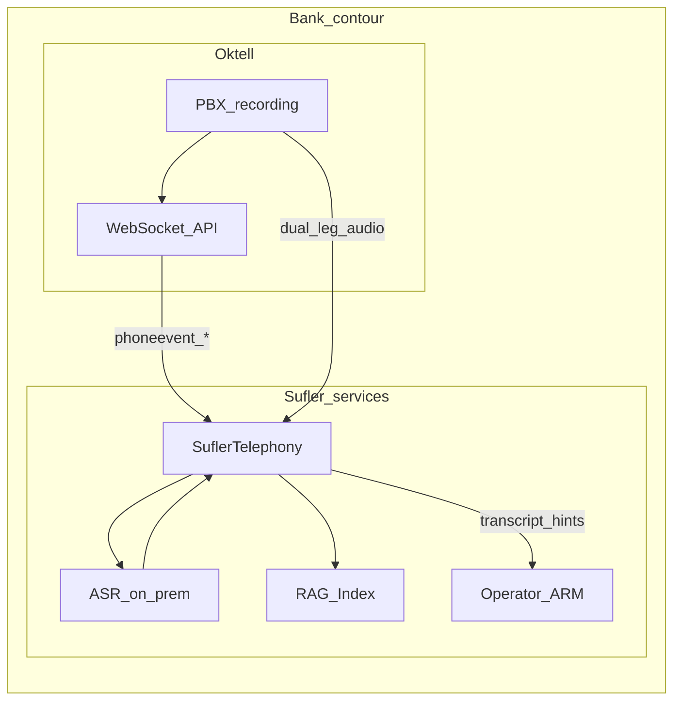
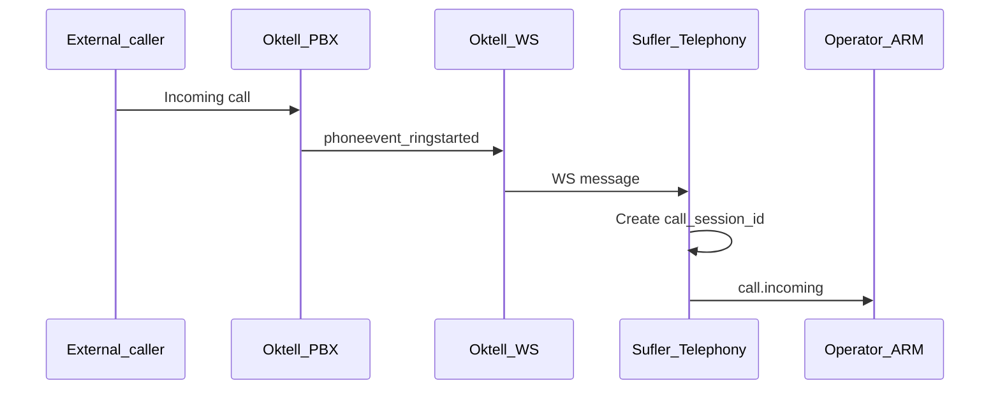
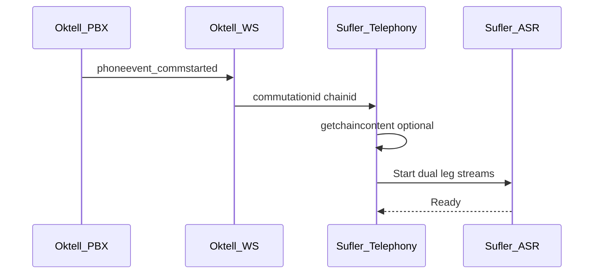
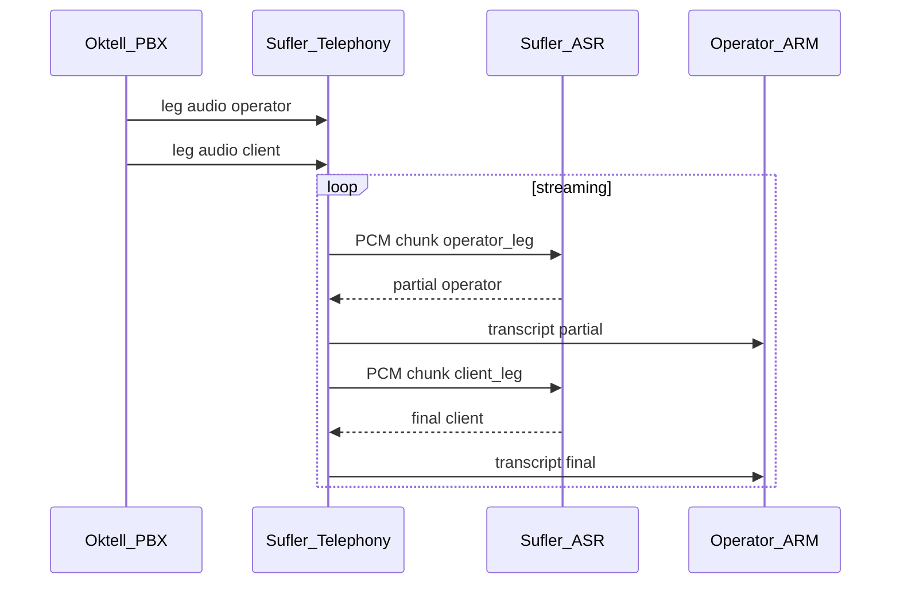
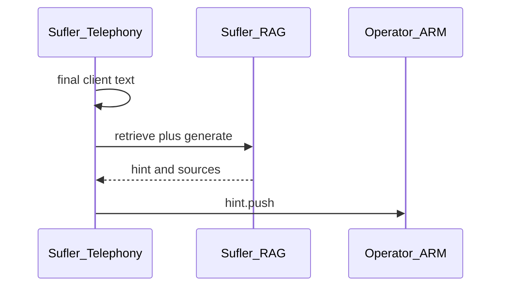

# ТЗ на интеграцию Oktell с модулем SuflerTelephony (суфлёр)

**Версия:** v0.1 · **Дата:** 2026-06-07 · **Проект:** суфлёр / Беларусбанк

**Назначение:** передать заказчику (подразделение телефонии / Oktell) и согласовать контур обмена с модулем **SuflerTelephony** в рамках **единого банковского контура** (Oktell и суфлёр — внутренние системы банка).

**Модель интеграции:** **T (Telephony push + dual-leg ASR)** — серверный **WebSocket** Oktell с событиями `phoneevent_*`; **распознавание речи (STT) полностью on-prem на стороне суфлёра** по **раздельным leg-записям** Oktell; подсказки RAG — из production-индекса СУЗ ([tz-bitrix-rag-sufler.md](../suz-bitrix-rag/tz-bitrix-rag-sufler.md)).

**Полный протокол (UC, риски, этапы):** [протокол-интеграция-oktell-sufler-telephony.md](протокол-интеграция-oktell-sufler-telephony.md)

---

## Содержание настоящего ТЗ

0. [Как читать документ](#0-как-читать-документ) — легенда [Штатно]/[Доработка Oktell]/[Суфлёр]
1. [Глоссарий](#1-глоссарий-основных-терминов) и [участники диаграмм](#17-участники-диаграмм-sequencediagram)
2. [Контекст](#2-контекст-и-ограничения)
3. [Принципы интеграции и API Oktell](#3-принципы-интеграции-и-api-oktell)
4. [Постановка для администраторов Oktell](#4-постановка-задачи-для-администраторов-oktell--телефонии)
5. [Ссылки на документацию Oktell](#5-что-даёт-открытая-документация-oktell-релевантно-интеграции)
6. [Спецификация обмена Oktell ↔ SuflerTelephony (INT-T01…T11)](#6-спецификация-обмена-данными-между-oktell-и-suflertelephony)

---

## 0. Как читать документ

### 0.1. Легенда маркеров

| Маркер | Значение |
|--------|----------|
| **[Штатно]** | Есть в официальной документации Oktell (Web-API, WebSocket protocol, запись разговоров, Oktell.js). В настоящем ТЗ **не расписывается** детально — только ссылка на пункт 3.2 / раздел 5. |
| **[Доработка Oktell]** | Настройка или доработка на стороне Oktell: Web-интеграция, правила записи, сценарии, сервисный пользователь. В ТЗ **описывается** контракт и ожидание от заказчика. |
| **[Суфлёр]** | SuflerTelephony, ASR, RAG, доставка в АРМ — зона Исполнителя, тот же контур банка. **Не** входит в scope администраторов Oktell. |

**Правило для раздела 6:** в карточках INT-T01…T03 описываются входящие сообщения Oktell **[Штатно]** и реакция **[Суфлёр]**. INT-T06…T08 — внутренний контур суфлёра. **[Доработка Oktell]** — только там, где без настройки записи/интеграции MVP невозможен.

### 0.2. Правило перекрёстных ссылок

Внутри комплекта документов использовать **«раздел N»** (крупные блоки оглавления) или **«пункт N.M»** (подразделы). Символ «§» **не используется**.

### 0.3. Краткий глоссарий интеграции

| Термин | Определение |
|--------|-------------|
| **SuflerTelephony** | Модуль суфлёра: приём событий Oktell, сессии звонков, связка с ASR и RAG **[Суфлёр]**. |
| **call_session_id** | UUID сессии звонка в контуре суфлёра; связывает события Oktell, транскрипт и подсказки **[Суфлёр]**. |
| **chainid** | Идентификатор цепочки (сессии) звонка в Oktell **[Штатно]**. |
| **commutationid** | Идентификатор коммутации (участка разговора оператор ↔ абонент) **[Штатно]**. |
| **Leg-запись** | Отдельный аудиофайл одного участника разговора; Oktell пишет **2 файла** на коммутацию **[Штатно]**. |
| **speaker** | Роль в транскрипте: `operator` или `client`; определяется по leg + метаданным Oktell, **не** по голосовому слепку. |
| **Production-индекс** | RAG-индекс СУЗ для КЦ; наполняется интеграцией СУЗ ([INT-01…](../suz-bitrix-rag/tz-bitrix-rag-sufler.md)) **[Суфлёр]**. |
| **ИБ** | Информационная безопасность: TLS, сегментация, mTLS/HMAC, аудит, хранение записей. |

---

## 1. Глоссарий основных терминов

### 1.0. Сводная таблица (частые термины)

| Термин | Определение |
|--------|-------------|
| **Oktell** | АТС / контакт-центр банка |
| **Суфлёр** | ПО с RAG + on-prem ASR + подсказки оператору КЦ |
| **SuflerTelephony** | Интеграционный модуль телефонии суфлёра |
| **КЦ** | Контакт-центр (телефония, чат) |
| **INT-Txx** | Технический сценарий обмена (раздел 6) |
| **OKT-xx** | Результат (deliverable) на стороне Oktell (раздел 4) |

### 1.1. Системы и роли

| Термин | Определение |
|--------|-------------|
| **Oktell** | Платформа телефонии и КЦ банка: маршрутизация, очереди, запись разговоров, Web-интеграция. |
| **SuflerTelephony** | Сервис приёма событий звонков, управления сессиями, оркестрации ASR и RAG. |
| **Суфлёр (контур)** | SuflerTelephony + ASR + RAG + LLM + АРМ оператора. |
| **СУЗ** | База знаний (1С-Битрикс CMS); источник текстов для подсказок ([ТЗ СУЗ](../suz-bitrix-rag/tz-bitrix-rag-sufler.md)). |
| **Оператор КЦ** | Сотрудник линии; использует АРМ с транскриптом и подсказками; **не** редактирует СУЗ. |
| **Администратор Oktell** | Настройка Web-интеграции, записи, пользователей, сценариев — заказчик по настоящему ТЗ. |
| **Контур банка** | Oktell и суфлёр в одном корпоративном контуре; обмен — внутренние каналы. |

### 1.2. Телефония Oktell

| Термин | Определение |
|--------|-------------|
| **Цепочка (chain)** | Логическая сессия обработки вызова; `chainid` — GUID **[Штатно]**. |
| **Коммутация (commutation)** | Участок соединения двух абонентов; `commutationid` — GUID **[Штатно]**. |
| **CallerId / callerid** | Номер или идентификатор звонящего в событии Oktell. |
| **userlogin / userid** | Учётная запись оператора Oktell, привязанная к линии. |
| **phoneevent_*** | Семейство push-событий телефонии в WebSocket protocol Oktell **[Штатно]**. |
| **recordlink** | Относительная или абсолютная ссылка на файл записи разговора **[Штатно]**. |
| **Dual-leg** | Два отдельных файла записи — по одному на каждого участника коммутации. |

### 1.3. ASR и транскрипт

| Термин | Определение |
|--------|-------------|
| **ASR / STT** | Automatic Speech Recognition; преобразование речи в текст **на стороне суфлёра**. |
| **partial** | Промежуточный фрагмент транскрипта (streaming). |
| **final** | Утверждённый фрагмент транскрипта после паузы/VAD. |
| **speaker** | `operator` — leg оператора; `client` — leg внешнего абонента. |

### 1.4. Надёжность

| Термин | Определение |
|--------|-------------|
| **At-least-once** | События Oktell могут дублироваться; SuflerTelephony идемпотентен по `chainid` + тип события + `commutationid`. |
| **Heartbeat** | Периодический `ping` / keepalive WebSocket (INT-T11). |
| **Reconciliation** | Сверка пропущенных звонков через `getpbxcalljournal` (INT-T09). |

### 1.5. Документы

| Термин | Определение |
|--------|-------------|
| **ТЗ (Oktell)** | Настоящий документ — задание заказчику по телефонии. |
| **MVP** | Минимальный набор INT-T01…T09, T11 для первой приёмки. |
| **Приложение 1** | Технические требования по договору (интеграция КЦ, суфлёр, СУЗ). |

### 1.7. Участники диаграмм (sequenceDiagram)

| ID в диаграмме | Что это | Сторона |
|----------------|---------|---------|
| **Oktell_PBX** | Ядро АТС, запись, маршрутизация | Заказчик |
| **Oktell_WS** | WebSocket / Web-интеграция Oktell | Заказчик **[Штатно]** |
| **Oktell_HTTP** | Серверный HTTP Web-API (порт 4055) | Заказчик **[Штатно]** |
| **Sufler_Telephony** | Приём событий, сессии, leg→speaker | **[Суфлёр]** |
| **Sufler_ASR** | On-prem STT по leg-аудио | **[Суфлёр]** |
| **Sufler_RAG** | Retrieval + LLM по СУЗ | **[Суфлёр]** |
| **Operator_ARM** | АРМ оператора (вкладка «Суфлёр») | **[Суфлёр]** |
| **Operator** | Оператор КЦ | Пользователь |

---

## 2. Контекст и ограничения

- **Платформа заказчика:** [Oktell](https://wiki.oktell.ru/) (АТС / КЦ банка).
- **Связь с СУЗ:** подсказки оператору строятся **только** на production-индексе RAG СУЗ; интеграция контента — отдельное ТЗ ([СУЗ ↔ RAG](../suz-bitrix-rag/tz-bitrix-rag-sufler.md)).
- **Требования проекта:** для КЦ ответы из СУЗ; ссылки на статьи — **оператору**, клиенту по телефону ссылки не диктуем автоматически из суфлёра; оператор **не** редактирует СУЗ.
- **Контур развёртывания:** Oktell и суфлёр — **один банковский контур**; WebSocket и HTTP — внутренние вызовы.
- **STT:** **только on-prem суфлёра** (Vosk, банковский движок и т.п.). Компоненты Oktell Yandex/Google SpeechKit **не используем**.
- **Разделение спикеров:** **dual-leg запись + метаданные Oktell**; голосовой слепок **не применяем**.
- **Клиентский канал (Oktell.js):** по [документации Oktell](http://wiki.oktell.ru/%D0%9E%D0%B1%D1%89%D0%B5%D0%B5_%D1%80%D1%83%D0%BA%D0%BE%D0%B2%D0%BE%D0%B4%D1%81%D1%82%D0%B2%D0%BE_%D0%BF%D0%BE_Web-%D0%B8%D0%BD%D1%82%D0%B5%D0%B3%D1%80%D0%B0%D1%86%D0%B8%D0%B8) **нельзя** использовать для учёта звонков и транскрипта — только **серверная** интеграция.
- **Прототип в репозитории:** [recognizer/main.py](../../../recognizer/main.py) — dev (микрофон + Vosk); не production-контур с Oktell.



---

## 3. Принципы интеграции и API Oktell

### 3.0. Принципы интеграции

1. **Единый контур банка** — Oktell и суфлёр как доверенные внутренние системы.
2. **Серверные события** — жизненный цикл звонка фиксируется по WebSocket `phoneevent_*`, не из браузера.
3. **ASR на стороне суфлёра** — Oktell передаёт аудио (leg) и метаданные, не текст.
4. **Dual-leg обязателен для MVP** — без раздельных записей участников MVP блокируется (пункт 3.8).
5. **RAG из СУЗ** — SuflerTelephony не подменяет регламенты; только retrieval + LLM по индексу СУЗ.
6. **Идемпотентность** — повтор `phoneevent_*` с теми же ключами безопасен.

### 3.1. Официальная документация Oktell (ориентиры)

| Раздел | URL |
|--------|-----|
| Web-интеграция (обзор) | [wiki.oktell.ru — Web-интеграция](http://wiki.oktell.ru/%D0%9E%D0%B1%D1%89%D0%B5%D0%B5_%D1%80%D1%83%D0%BA%D0%BE%D0%B2%D0%BE%D0%B4%D1%81%D1%82%D0%B2%D0%BE_%D0%BF%D0%BE_Web-%D0%B8%D0%BD%D1%82%D0%B5%D0%B3%D1%80%D0%B0%D1%86%D0%B8%D0%B8) |
| Web-Socket Protocol | [wiki.oktell.ru — Oktell Web-Socket Protocol](http://wiki.oktell.ru/%D0%9E%D0%BF%D0%B8%D1%81%D0%B0%D0%BD%D0%B8%D0%B5_%D0%B8%D0%BD%D1%82%D0%B5%D0%B3%D1%80%D0%B0%D1%86%D0%B8%D0%BE%D0%BD%D0%BD%D0%BE%D0%B3%D0%BE_%D0%BF%D1%80%D0%BE%D1%82%D0%BE%D0%BA%D0%BE%D0%BB%D0%B0_Oktell_web-so%D1%81ket_protocol) |
| Web-интеграция с CRM | [wiki.oktell.ru — WebSocket CRM](https://wiki.oktell.ru/%D0%98%D0%BD%D1%82%D0%B5%D0%B3%D1%80%D0%B0%D1%86%D0%B8%D1%8F_%D1%81_Web-Socket_CRM) |
| Серверный HTTP интерфейс | [wiki.oktell.ru — HTTP интерфейс](http://wiki.oktell.ru/%D0%A1%D0%B5%D1%80%D0%B2%D0%B5%D1%80%D0%BD%D1%8B%D0%B9_HTTP_%D0%B8%D0%BD%D1%82%D0%B5%D1%80%D1%84%D0%B5%D0%B9%D1%81) |
| Управление записями | [wiki.oktell.ru — Запись разговоров](https://wiki.oktell.ru/%D0%A3%D0%BF%D1%80%D0%B0%D0%B2%D0%BB%D0%B5%D0%BD%D0%B8%D0%B5_%D0%B7%D0%B0%D0%BF%D0%B8%D1%81%D1%8F%D0%BC%D0%B8_%D1%80%D0%B0%D0%B7%D0%B3%D0%BE%D0%B2%D0%BE%D1%80%D0%BE%D0%B2) |
| Oktell.js (клиент) | [js.oktell.ru](http://js.oktell.ru) |

### 3.2. Штатные средства Oktell, используемые в проекте

| Механизм | Назначение | Маркер |
|----------|------------|--------|
| WebSocket `phoneevent_ringstarted` | Входящий вызов на линию оператора | **[Штатно]** |
| WebSocket `phoneevent_commstarted` | Начало разговора (коммутация) | **[Штатно]** |
| WebSocket `phoneevent_commstopped` | Конец коммутации | **[Штатно]** |
| WebSocket `subscribeevent` / `phoneevent` | Подписка на события телефонии | **[Штатно]** |
| WebSocket `getchaincontent` | Контекст цепочки звонка | **[Штатно]** |
| WebSocket `getpbxcalljournal` | Журнал звонков (fallback) | **[Штатно]** |
| HTTP `downloadrecordbylink` | Скачивание записи по `recordlink` | **[Штатно]** |
| HTTP `wp_getabonentinfo`, `wp_getchaincontent` | Состояние линии / абонент | **[Штатно]** |
| Запись 2 файла на участника | Dual-leg для ASR | **[Штатно]** (конфиг) |
| Oktell.js | UI телефонии в браузере | **[Штатно]** (опц., не для учёта) |

### 3.3. Почему одного API Oktell недостаточно

| Проблема | Почему штатного API мало | Что добавляет интеграция |
|----------|--------------------------|---------------------------|
| Нет текста разговора | Oktell не отдаёт STT во внешний контур в реальном времени | On-prem ASR **[Суфлёр]** по leg-аудио |
| Нет подсказок RAG | Oktell не знает СУЗ | SuflerTelephony → RAG **[Суфлёр]** |
| Нет `speaker` | В API нет готового транскрипта с ролями | Маппинг leg + `userlogin` / `callerid` |
| Нет сессии суфлёра | `chainid` — ID Oktell, не UI оператора | `call_session_id` **[Суфлёр]** |
| Только mixed-запись | Один файл — нельзя надёжно разделить спикеров без слепка | Dual-leg **[Доработка Oktell]** конфиг |

### 3.4. Схема интеграции (рекомендация)

**Схема 3 (гибрид)** по документации Oktell:

| Канал | Назначение |
|-------|------------|
| **Серверный WebSocket** (CRM → Oktell или Oktell → CRM — по политике банка) | События `phoneevent_*`, `getchaincontent`, heartbeat |
| **HTTP Web-API** Oktell | Fallback: журнал, `downloadrecordbylink` |
| **Oktell.js** (опц.) | Кнопки телефонии в АРМ; **не** транскрипт |

### 3.5. Сводка: документация Oktell vs что настраивать

| Артефакт | В документации Oktell? | Действие |
|----------|------------------------|----------|
| `phoneevent_*` | Да | Подписка INT-T04; обработка INT-T01…03 |
| Dual-leg запись | Да (конфиг) | OKT-4: правила записи КЦ |
| On-prem ASR | **Нет** | **[Суфлёр]** INT-T06 |
| Подсказки RAG | **Нет** | **[Суфлёр]** INT-T07, T08 |
| Endpoint SuflerTelephony | **Нет** | **[Суфлёр]** + согласование URL с ИБ |

### 3.6. Что типично требует настройки Oktell (заказчику)

| Компонент | Зачем |
|-----------|--------|
| Web-интеграция (WebSocket) | Push событий звонка |
| Сервисный пользователь Web-API | HTTP fallback, загрузка записей |
| Правила записи для очередей КЦ | Dual-leg, `isrecorded=true` |
| Сопоставление login Oktell ↔ AD | Привязка оператора в АРМ |
| Тестовая линия / очередь | Приёмка без прода |

### 3.7. Модель интеграции T (зафиксировано)

| Аспект | Описание |
|--------|----------|
| **События** | WebSocket `phoneevent_ringstarted` → `commstarted` → `commstopped` |
| **Аудио** | Dual-leg файлы Oktell → streaming/polling ASR **[Суфлёр]** |
| **Спикер** | `operator` = leg линии `userlogin`; `client` = leg абонента (`isextline`, `callerid`) |
| **Транскрипт** | WebSocket/SSE в АРМ: `partial` / `final` с полем `speaker` |
| **RAG** | Триггер по накопленному тексту **клиента** (+ контекст оператора) |
| **Запрет** | Oktell STT, микрофон АРМ как основной канал, voiceprint |

### 3.8. Вопросы заказчику (чек-лист на встрече)

**3.8.1. Oktell и доступ**

1. Версия Oktell на проде и тесте?
2. Режим Web-интеграции: **Oktell → CRM** или **CRM → Oktell** (WebSocket)?
3. Внутренний URL/порт SuflerTelephony для WebSocket (или Oktell подключается к нам)?
4. Сервисная учётка с привилегией Web-API (Basic auth, порт 4055)?
5. Требования **ИБ**: mTLS, allowlist IP, аудит?

**3.8.2. Запись и dual-leg**

1. Включена ли запись на очередях/линиях КЦ?
2. Доступны ли **раздельные** leg-файлы (флаг «не микшировать каналы», `MixerDeleteSourceRecords=0`)?
3. С какой задержкой leg доступен **во время** разговора (incremental vs после микшера)?
4. Формат/кодек leg (G.711, WAV) — совместимость с ASR суфлёра?
5. Если только mixed — **блокер MVP**; срок включения dual-leg?

**3.8.3. Операторы**

1. Единый login Oktell = login AD / АРМ?
2. Список пилотных очередей / внутренних номеров для MVP?
3. Softphone (Oktell-voice.js) или физический IP-телефон?

**3.8.4. Эксплуатация**

1. Ожидаемое число одновременных звонков с суфлёром на пилоте?
2. SLA допустимой задержки транскрипта (ориентир: **2–5 с** после фразы)?
3. Нужен ли post-call `recordlink` (INT-T10) для архива/QA?

**Результат встречи:** подтверждён dual-leg, URL WebSocket, учётка Web-API, mapping login, тестовая очередь, ответственный администратор Oktell.

---

## 4. Постановка задачи для администраторов Oktell / телефонии

*Раздел можно передать заказчику как **ТЗ на настройку Oktell**. SuflerTelephony, ASR, RAG и АРМ — зона Исполнителя.*

### 4.1. Цель задачи

Обеспечить на стороне **Oktell** канал **серверной** интеграции с модулем **SuflerTelephony**, который:

- доставляет **события жизненного цикла звонка** оператора КЦ в реальном времени;
- обеспечивает **раздельную запись** (dual-leg) участников для on-prem ASR суфлёра;
- предоставляет **метаданные** (`chainid`, `commutationid`, `callerid`, `userlogin`) для привязки транскрипта и подсказок RAG.

### 4.2. Матрица требований: штатный механизм и настройка Oktell

| № | Требование интеграции | Штатный механизм Oktell | Настройка / доработка Oktell |
|---|------------------------|-------------------------|------------------------------|
| 1 | Push событие «звонок на линии» | `phoneevent_ringstarted` | Web-интеграция WebSocket; подписка `phoneevent` |
| 2 | Push «начало разговора» | `phoneevent_commstarted` | То же |
| 3 | Push «конец разговора» | `phoneevent_commstopped` | То же |
| 4 | Контекст звонка (очередь, задача) | `getchaincontent` | Сервисный доступ WS |
| 5 | Dual-leg аудио оператора и клиента | 2 файла записи на коммутацию | Правила записи КЦ; не микшировать каналы |
| 6 | Ссылка на запись (fallback) | `recordlink`, `downloadrecordbylink` | Запись включена; права сервисной УЗ |
| 7 | Журнал звонков (reconciliation) | `getpbxcalljournal` | Права на чтение журнала |
| 8 | Идентификация оператора | `userlogin`, `userid` в событиях | Login Oktell = login АРМ/AD |
| 9 | Идентификация клиента | `callerid`, `callername`, `isextline` | — (штатно в событии) |
| 10 | Надёжность канала | WebSocket + ping | Таймауты, reconnect на стороне **[Суфлёр]** |
| 11 | Не терять события при закрытии браузера | Серверная интеграция | **Не** полагаться на Oktell.js для учёта |
| 12 | Защита канала | Basic / TLS на WS и HTTP | Учётка Web-API, TLS, allowlist (**ИБ**) |
| 13 | Тестовый контур | Отдельная очередь/линия | Выделить пилот КЦ |
| 14 | Запись для всех пилотных операторов | Правила записи по маске/очереди | OKT-4 |
| 15 | HTTP fallback при обрыве WS | `getpbxcalljournal` | Расписание reconcile **[Суфлёр]** + доступ HTTP |
| 16 | Опционально: UI телефонии в АРМ | Oktell.js | Не блокирует MVP суфлёра |
| 17 | Не использовать облачный STT Oktell | — | Явный запрет в регламенте банка |
| 18 | Документация leg URL | `download/rec/...` | Описать способ доступа к leg для **[Суфлёр]** |
| 19 | Аудит интеграции | Логи Oktell Web-сервера | Совместный correlation id (`chainid`) |
| 20 | Приёмка | Тестовый звонок | Протокол INT-T01…03, T06 на тестовой линии |

### 4.3. Объём работ (OKT-xx)

| ID | Результат | Описание |
|----|-----------|----------|
| **OKT-1** | Web-интеграция WebSocket | Настроить направление и endpoint по согласованию с Исполнителем (CRM↔Oktell) |
| **OKT-2** | Сервисный пользователь | УЗ с Web-API; credentials в vault банка |
| **OKT-3** | Подписка на `phoneevent` | SuflerTelephony получает ring/comm start/stop |
| **OKT-4** | Правила записи КЦ | Dual-leg, запись на пилотных очередях, `isrecorded=true` |
| **OKT-5** | Маппинг login | Oktell `userlogin` = login в АРМ суфлёра |
| **OKT-6** | Доступ к leg-аудио | Документировать URL/механизм чтения leg (HTTP или иной согласованный) |
| **OKT-7** | Тестовая линия | Очередь/номер для приёмки |
| **OKT-8** | **ИБ** | TLS, allowlist, регламент хранения записей |
| **OKT-9** | Совместная приёмка | Прогон с Исполнителем по разделу 4.6 |
| **OKT-10** | JSON-примеры событий | Образцы `phoneevent_*` с тестового стенда для **[Суфлёр]** |

**Оценка (ориентир):** OKT-1…8 — **1–2 недели** администратора Oktell при готовых доступах и политике записи.

### 4.4. Не входит в scope Oktell

1. Разработка SuflerTelephony, ASR, RAG, LLM, АРМ.
2. Индексация СУЗ (отдельное ТЗ Bitrix).
3. Обучение операторов работе с подсказками.

### 4.5. Зависимости от заказчика

1. Dual-leg запись на пилотных линиях.
2. WebSocket connectivity до SuflerTelephony.
3. Сервисная учётка Web-API.
4. Контакт Исполнителя для JSON-schema и приёмки.

### 4.6. Критерии приёмки (Oktell + суфлёр)

| № | Тест | Действие | Ожидание Oktell | Ожидание суфлёра |
|---|------|----------|-----------------|------------------|
| 1 | Входящий звонок | Клиент звонит на пилотную линию | `phoneevent_ringstarted` с `callerid`, `userlogin` | Сессия `call_session_id` создана |
| 2 | Ответ оператора | Оператор снимает трубку | `phoneevent_commstarted`, `commutationid` | ASR запущен на оба leg; `speaker` задан |
| 3 | Разговор | Диалог 30+ с | Dual-leg пишутся | `partial`/`final` в АРМ с `operator` и `client` |
| 4 | RAG | Клиент задаёт вопрос по теме СУЗ | — | Подсказка с `permalink` СУЗ (≤ SLA, ориентир 10 с) |
| 5 | Завершение | Кладёт трубку | `phoneevent_commstopped` | Сессия закрыта; архив транскрипта |
| 6 | Обрыв WS | Кратковременный разрыв | Oktell шлёт события после reconnect | INT-T11; без потери активной сессии |
| 7 | Reconcile | Симуляция пропуска события | Журнал доступен | INT-T09 восстанавливает запись звонка |

**Артефакты:** протокол прогона, логи по `chainid`, скрин АРМ с транскриптом и подсказкой.

### 4.7. Приложения к постановке

- **Приложение А** — раздел 1 (глоссарий).
- **Приложение Б** — раздел 6 (INT-T01…T11).
- **Приложение В** — UC оператора ([протокол](протокол-интеграция-oktell-sufler-telephony.md)).
- **Приложение Г** — пункт 3.8 (вопросы заказчику).

---

## 5. Что даёт открытая документация Oktell (релевантно интеграции)

| Механизм | Маркер | Назначение |
|----------|--------|------------|
| Web-Socket Protocol (`phoneevent_*`, `getchaincontent`, …) | **[Штатно]** | INT-T01…05, T09 |
| `subscribeevent` | **[Штатно]** | INT-T04 |
| Серверный HTTP (`downloadrecordbylink`, `wp_*`) | **[Штатно]** | INT-T10, fallback |
| Dual-leg запись | **[Штатно]** + конфиг | INT-T06 |
| Oktell.js / Oktell-voice.js | **[Штатно]** | UI (опц.) |
| Yandex/Google STT в сценариях | **[Штатно]** | **Не используем** |

---

## 6. Спецификация обмена данными между Oktell и SuflerTelephony

### 6.0.0. Назначение раздела

| Вопрос | Ответ |
|--------|--------|
| **Спецификация чего?** | Контракта **Oktell → SuflerTelephony** (события, аудио, метаданные) и **SuflerTelephony → АРМ** (транскрипт, подсказки). |
| **Для кого?** | Администратор Oktell (что должен давать Oktell) и Исполнитель (что реализовать). |
| **Модель** | **T** — WebSocket push + dual-leg ASR + RAG. |

### 6.0. Шаблон карточки сценария

| № | Подраздел | Содержание |
|---|-----------|------------|
| 1 | **Сценарий** | Кто, когда, зачем; связь с UC. |
| 2 | **Матрица пункта 4.2** | Строки матрицы по сценарию. |
| 3 | **Форматы** | Протокол, поля JSON. |
| 4 | **Коды / ошибки** | Применимо для HTTP/WS. |
| 5 | **Пример** | JSON или сообщение протокола Oktell. |
| 6 | **Диаграмма** | mermaid sequenceDiagram |

### 6.1. Реестр сценариев

| ID | Сценарий | Источник | MVP |
|----|----------|----------|-----|
| **INT-T01** | Звонок на линию (ring) | WS `phoneevent_ringstarted` | Да |
| **INT-T02** | Начало разговора | WS `phoneevent_commstarted` | Да |
| **INT-T03** | Конец коммутации | WS `phoneevent_commstopped` | Да |
| **INT-T04** | Подписка на phoneevent | WS `subscribeevent` | Да |
| **INT-T05** | Контекст цепочки | WS `getchaincontent` | Да |
| **INT-T06** | Leg → ASR → transcript | **[Суфлёр]** | Да |
| **INT-T07** | Транскрипт → RAG | **[Суфлёр]** | Да |
| **INT-T08** | Подсказки → АРМ | **[Суфлёр]** WS/SSE | Да |
| **INT-T09** | Reconcile журнал | WS `getpbxcalljournal` | Да |
| **INT-T10** | Post-call recordlink | HTTP `downloadrecordbylink` | Нет* |
| **INT-T11** | Heartbeat / reconnect | WS ping | Да |

\* INT-T10 — опционально для QA/архива; не заменяет INT-T06 в MVP.

### 6.2. Общие поля

**События Oktell (вход в SuflerTelephony)** — ключевые поля из `phoneevent_*` **[Штатно]**:

| Поле | Тип | Описание |
|------|-----|----------|
| `chainid` | UUID | Цепочка звонка Oktell |
| `commutationid` | UUID | Коммутация (INT-T02, T03) |
| `userlogin` | string | Login оператора |
| `userid` | UUID | ID пользователя Oktell |
| `callerid` | string | Номер/ID абонента |
| `callername` | string | Имя/метка абонента |
| `isextline` | bool | Внешняя линия (клиент) |

**Внутренние поля SuflerTelephony [Суфлёр]:**

| Поле | Тип | Описание |
|------|-----|----------|
| `call_session_id` | UUID | Сессия суфлёра |
| `event_seq` | int | Порядковый номер фрагмента транскрипта |
| `speaker` | enum | `operator` \| `client` |
| `leg` | enum | `operator_leg` \| `client_leg` (маппинг из Oktell) |
| `text` | string | Текст ASR |
| `transcript_type` | enum | `partial` \| `final` |
| `asr_confidence` | float | 0…1, опционально |
| `occurred_at` | ISO-8601 | Время фрагмента |

**Подсказка RAG (SuflerTelephony → АРМ):**

| Поле | Тип | Описание |
|------|-----|----------|
| `hint_id` | UUID | ID подсказки |
| `call_session_id` | UUID | Сессия |
| `summary` | string | Текст подсказки |
| `sources` | array | `{ article_id, title, permalink, score }` |
| `trigger_text` | string | Фраза клиента, вызвавшая retrieval |

---

### INT-T01. Звонок на линию оператора (ring)

**UC:** UC-T1 · **Источник:** Oktell WebSocket **[Штатно]**

#### 1. Сценарий

На линию оператора поступает вызов. Oktell шлёт `phoneevent_ringstarted`. SuflerTelephony **создаёт** `call_session_id`, сохраняет `chainid`, `callerid`, готовит UI («входящий»).

#### 2. Матрица пункта 4.2

| № | Требование | Oktell | Настройка |
|---|------------|--------|-----------|
| 1 | Push ring | `phoneevent_ringstarted` | OKT-1, OKT-3 |
| 8 | Оператор | `userlogin` | OKT-5 |
| 9 | Клиент | `callerid` | — |
| 11 | Серверный канал | WS | OKT-1 |

#### 3. Форматы

Входящее сообщение Oktell (фрагмент, по [протоколу](http://wiki.oktell.ru/%D0%9E%D0%BF%D0%B8%D1%81%D0%B0%D0%BD%D0%B8%D0%B5_%D0%B8%D0%BD%D1%82%D0%B5%D0%B3%D1%80%D0%B0%D1%86%D0%B8%D0%BE%D0%BD%D0%BD%D0%BE%D0%B3%D0%BE_%D0%BF%D1%80%D0%BE%D1%82%D0%BE%D0%BA%D0%BE%D0%BB%D0%B0_Oktell_web-so%D1%81ket_protocol)):

```json
[
  "phoneevent_ringstarted",
  {
    "qid": "00488421-97E4-443B-81B7-D645E403AEBB",
    "userlogin": "ivanov",
    "userid": "3357F4D2-B37C-4809-9A1A-E4D64808DE1B",
    "chainid": "D6C8232D-4E4A-48BB-954E-C719582A4718",
    "callerid": "375291234567",
    "callername": "Клиент",
    "isextline": true
  }
]
```

**Действие [Суфлёр]:** `POST` internal — create session; push в АРМ `call.incoming`.

#### 4. Ошибки

| Ситуация | Действие SuflerTelephony |
|----------|--------------------------|
| Дубликат `chainid` + ring | Идемпотентно: обновить timestamp |
| Нет `userlogin` | Лог + алерт; сессия без привязки к АРМ |

#### 5. Диаграмма



---

### INT-T02. Начало разговора (commstarted)

**UC:** UC-T2

#### 1. Сценарий

Оператор ответил; Oktell шлёт `phoneevent_commstarted`. SuflerTelephony фиксирует `commutationid`, запускает INT-T05 (контекст) и **INT-T06** (ASR на dual-leg).

#### 2. Матрица

| № | Требование | Oktell | Настройка |
|---|------------|--------|-----------|
| 2 | comm start | `phoneevent_commstarted` | OKT-3 |
| 5 | dual-leg | запись | OKT-4, OKT-6 |
| 4 | контекст | `getchaincontent` | INT-T05 |

#### 3. Пример (Oktell → SuflerTelephony)

```json
[
  "phoneevent_commstarted",
  {
    "qid": "B7ACFEC1-65BB-4773-A425-DC39F5D1A48C",
    "userlogin": "ivanov",
    "userid": "3357F4D2-B37C-4809-9A1A-E4D64808DE1B",
    "chainid": "D6C8232D-4E4A-48BB-954E-C719582A4718",
    "commutationid": "072F2EE0-4B3B-49A7-AB5B-E213AE752A53",
    "callerid": "375291234567",
    "isextline": true
  }
]
```

**Действие [Суфлёр]:** map legs → `operator_leg` / `client_leg`; start ASR workers; ARM `call.active`.

#### 4. Диаграмма



---

### INT-T03. Конец коммутации (commstopped)

**UC:** UC-T3

#### 1. Сценарий

Разговор завершён. Oktell шлёт `phoneevent_commstopped`. SuflerTelephony останавливает ASR, финализирует транскрипт, закрывает сессию (или переводит в `completed`).

#### 3. Пример

```json
[
  "phoneevent_commstopped",
  {
    "qid": "D514511C-BD4F-406B-B9C7-695CDC6C40E7",
    "userlogin": "ivanov",
    "chainid": "D6C8232D-4E4A-48BB-954E-C719582A4718",
    "commutationid": "072F2EE0-4B3B-49A7-AB5B-E213AE752A53"
  }
]
```

**Действие [Суфлёр]:** stop ASR; ARM `call.ended`; опционально INT-T10 post-call archive.

---

### INT-T04. Подписка на события phoneevent

#### 1. Сценарий

При установлении WebSocket SuflerTelephony отправляет `subscribeevent` на агрегат `phoneevent` (или отдельные `phoneevent_ringstarted`, …).

#### 3. Пример запроса (SuflerTelephony → Oktell)

```json
[
  "subscribeevent",
  {
    "qid": "DDA55585-F598-4F8C-B605-E6E186E6D859",
    "event": "phoneevent"
  }
]
```

Ответ: `subscribeeventresult` с `"result": 1` **[Штатно]**.

---

### INT-T05. Контекст цепочки (getchaincontent)

#### 1. Сценарий

После INT-T02 SuflerTelephony запрашивает контекст: очередь, задача КЦ, `customfield`, trace коммутаций — для отображения в АРМ («задача: входящие КЦ»).

#### 3. Пример запроса

```json
[
  "getchaincontent",
  {
    "qid": "C13CE714-A502-4699-BE1A-9C4DB28BB70A",
    "userlogin": "ivanov"
  }
]
```

Ответ: `getchaincontentresult` с `content.trace[]` **[Штатно]**.

---

### INT-T06. Leg-аудио → on-prem ASR → transcript

**UC:** UC-T4 · **Зона [Суфлёр]**

#### 1. Сценарий

SuflerTelephony получает поток/файл **leg оператора** и **leg клиента** (dual-leg OKT-4). Каждый leg подаётся в **отдельный** ASR-пipeline. Результат — сообщения `transcript.partial` / `transcript.final` с полем `speaker`.

#### 2. Маппинг leg → speaker

| Leg | Условие | `speaker` |
|-----|---------|-----------|
| Линия с `userlogin` оператора | штатная линия пользователя | `operator` |
| Leg внешнего абонента | `isextline=true` или leg из `callerlineid` | `client` |

#### 3. Формат (SuflerTelephony → АРМ)

```json
{
  "type": "transcript.final",
  "call_session_id": "550e8400-e29b-41d4-a716-446655440000",
  "chainid": "D6C8232D-4E4A-48BB-954E-C719582A4718",
  "commutationid": "072F2EE0-4B3B-49A7-AB5B-E213AE752A53",
  "speaker": "client",
  "text": "Подскажите комиссию за перевод в другой банк",
  "transcript_type": "final",
  "event_seq": 12,
  "occurred_at": "2026-06-07T14:32:15+03:00"
}
```

#### 4. Диаграмма



---

### INT-T07. Триггер RAG по транскрипту

**UC:** UC-T5 · **[Суфлёр]**

#### 1. Сценарий

На `transcript.final` с `speaker=client` (или накопленный контекст диалога) SuflerTelephony вызывает RAG (production-индекс СУЗ). LLM формирует **подсказку оператору**; источники — только статьи СУЗ.

#### 2. Правила

- Retrieval только из **production-индекса** СУЗ.
- Debounce: не чаще 1 запроса RAG в **3–5 с** на сессию (настраиваемо).
- Подсказка **не** озвучивается клиенту автоматически.

#### 3. Диаграмма



---

### INT-T08. Доставка подсказок в АРМ

#### 3. Пример (SuflerTelephony → АРМ)

```json
{
  "type": "hint.push",
  "call_session_id": "550e8400-e29b-41d4-a716-446655440000",
  "hint_id": "7c9e6679-7425-40de-944b-e07fc1f90ae7",
  "summary": "Комиссия за межбанковский перевод — см. регламент…",
  "sources": [
    {
      "article_id": 12845,
      "title": "Комиссия за перевод",
      "permalink": "https://suz.bank.by/kc/articles/komissiya-perevod/",
      "score": 0.89
    }
  ],
  "trigger_text": "комиссию за перевод"
}
```

Транспорт: WebSocket или SSE на канал `userlogin` оператора **[Суфлёр]**.

---

### INT-T09. Reconcile (getpbxcalljournal)

#### 1. Сценарий

Job **[Суфлёр]** периодически (например каждые 15 мин) запрашивает журнал за интервал; восстанавливает пропущенные `chainid` без активной сессии.

#### 3. Пример запроса

```json
[
  "getpbxcalljournal",
  {
    "qid": "4CC7EDEC-499B-4C03-95D3-57B8C30FC110",
    "userlogin": "ivanov",
    "filter": {
      "datestart": "2026-06-07",
      "connectiontype": "incoming",
      "minduration": 1
    }
  }
]
```

Ответ содержит `recordlink`, `commutationid`, `chainid` **[Штатно]**.

---

### INT-T10. Post-call запись (recordlink) — опционально

> **Не MVP.** Резерв: полная перезагрузка аудио после звонка, QA, дообучение.

HTTP `downloadrecordbylink?recordlink=...` **[Штатно]**. Leg-предпочтение сохраняется; mixed — только если dual-leg недоступен (не целевой режим).

---

### INT-T11. Heartbeat и reconnect WebSocket

#### 1. Сценарий

SuflerTelephony шлёт ping по политике протокола Oktell; при разрыве — reconnect с экспоненциальным backoff; после reconnect — повтор INT-T04.

#### 2. Требования

- Не терять **активные** `call_session_id` при кратковременном обрыве (< 60 с).
- Логировать `chainid` для корреляции с OKT-9.

---

### 6.3. Версия контракта

| Версия | Статус |
|--------|--------|
| **v0.1** | Черновик; placeholder URL; согласование dual-leg на стенде |
| **v1.0** | После приёмки OKT-9 + JSON Schema transcript/hint |

**Для Oktell (раздел 4):** обеспечить MVP INT-T01…04, T09 (доступ); dual-leg OKT-4 обязателен для INT-T06.
