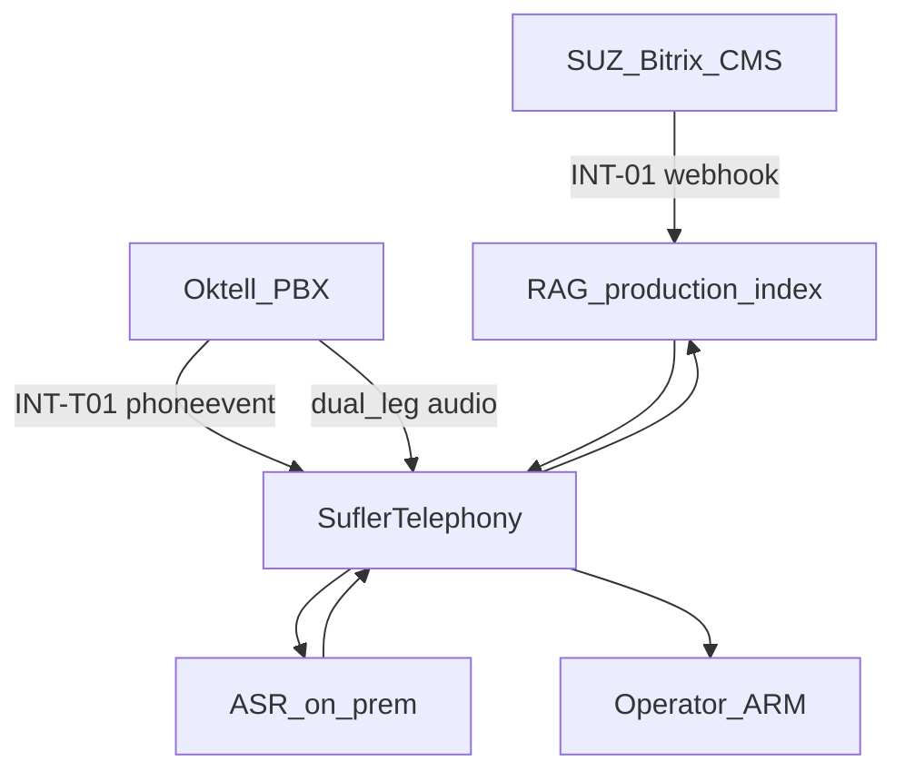

# Протокол интеграции Oktell с SuflerTelephony (суфлёр)

**Версия:** v0.1 · **Дата:** 2026-06-07

**Итоговое ТЗ:** [tz-oktell-sufler-telephony.md](tz-oktell-sufler-telephony.md)

---

## Содержание

1. [Связь с другими интеграциями](#1-связь-с-другими-интеграциями)
2. [Пользовательские сценарии оператора КЦ](#2-пользовательские-сценарии-оператора-кц)
3. [Риски и допущения](#3-риски-и-допущения)
4. [Пошаговый план работ](#4-пошаговый-план-работ)
5. [Ближайшие действия](#5-ближайшие-действия)

---

## 1. Связь с другими интеграциями

| Контур | Документ | Зависимость |
|--------|----------|-------------|
| СУЗ → RAG | [tz-bitrix-rag-sufler.md](../suz-bitrix-rag/tz-bitrix-rag-sufler.md) | Подсказки INT-T07 **требуют** актуальный production-индекс |
| Oktell → SuflerTelephony | [tz-oktell-sufler-telephony.md](tz-oktell-sufler-telephony.md) | События + dual-leg ASR |
| UI оператора | [ai-hub-panel-mockup.md](../../ui/ai-hub-panel-mockup.md) | Вкладка «Суфлёр», транскрипт, подсказки |

---

## 2. Пользовательские сценарии оператора КЦ

Роли: **Оператор КЦ**, **SuflerTelephony**, **Oktell**, **RAG**.

### UC-T1. Входящий звонок — подготовка контекста

| Шаг | Действие | Oktell | SuflerTelephony / АРМ |
|-----|----------|--------|------------------------|
| 1 | Клиент звонит на линию КЦ | Маршрутизация, ring | — |
| 2 | Телефон оператора звонит | `phoneevent_ringstarted` | Карточка «входящий», `callerid` |
| 3 | Оператор видит номер/метку | — | Контекст до ответа |

**Критерий:** INT-T01; `call_session_id` создан до ответа.

### UC-T2. Начало консультации

| Шаг | Действие | Oktell | SuflerTelephony |
|-----|----------|--------|-----------------|
| 1 | Оператор отвечает | `phoneevent_commstarted` | Старт ASR dual-leg |
| 2 | — | `getchaincontent` (опц.) | Очередь/задача в АРМ |
| 3 | Оператор приветствует | leg operator → ASR | `transcript`, speaker=operator |

**Критерий:** INT-T02, T05, T06; оба leg активны.

### UC-T3. Завершение звонка

| Шаг | Действие | Oktell | SuflerTelephony |
|-----|----------|--------|-----------------|
| 1 | Стороны прощаются | — | final transcript |
| 2 | Кладут трубку | `phoneevent_commstopped` | Stop ASR, close session |
| 3 | — | — | Транскрипт в истории (опц.) |

**Критерий:** INT-T03; нет утечки ASR после stop.

### UC-T4. Транскрипт в реальном времени

| Шаг | Действие | Ожидание |
|-----|----------|----------|
| 1 | Клиент задаёт вопрос | `transcript.final`, speaker=client в АРМ |
| 2 | Оператор уточняет | speaker=operator |
| 3 | Задержка | partial ≤ 1–2 с; final ≤ 5 с (ориентир, уточнить на стенде) |

**Критерий:** разделение `operator`/`client` **без** голосового слепка.

### UC-T5. Подсказка из СУЗ

| Шаг | Действие | Ожидание |
|-----|----------|----------|
| 1 | Клиент спрашивает про продукт/регламент | RAG retrieval |
| 2 | — | До 2 карточек подсказок с `permalink` |
| 3 | Оператор читает клиенту своими словами | Ссылка СУЗ только оператору |
| 4 | Оператор отклоняет/редактирует подсказку | UI mockup |

**Критерий:** INT-T07, T08; источник только production-индекс СУЗ.

### UC-T6. Сбой WebSocket

| Шаг | Действие | Ожидание |
|-----|----------|----------|
| 1 | Кратковременный обрыв WS | Reconnect INT-T11 |
| 2 | Звонок продолжается | ASR не обязан прерываться, если leg не зависит от WS |
| 3 | После восстановления | Reconcile INT-T09 при необходимости |

### Матрица UC ↔ INT

| UC | INT |
|----|-----|
| UC-T1 | T01 |
| UC-T2 | T02, T05, T06 |
| UC-T3 | T03 |
| UC-T4 | T06 |
| UC-T5 | T07, T08 |
| UC-T6 | T11, T09 |

---

## 3. Риски и допущения

| Риск | Вероятность | Митигация |
|------|-------------|-----------|
| Только mixed-запись (без dual-leg) | Средняя | **Блокер MVP**; OKT-4 обязателен (пункт 3.8) |
| Leg доступен только после микшера (высокая latency) | Средняя | Замер на стенде; этап 2 — SIP tap |
| Login Oktell ≠ login АРМ | Средняя | OKT-5, единый AD |
| Production-индекс СУЗ пуст/устарел | Низкая | Зависимость от [СУЗ-TZ](../suz-bitrix-rag/tz-bitrix-rag-sufler.md) |
| Нагрузка ASR при N параллельных звонках | Средняя | Capacity planning; очередь ASR |
| ИБ: вынос записей за контур | Низкая | Leg читается только in-bank |

**Допущения v0.1:**

- Oktell ≥ версии с Web-Socket CRM и dual-leg записью (уточнить у заказчика).
- Пилот — **входящие** звонки одной очереди КЦ.
- Язык ASR MVP — **ru**.

---

## 4. Пошаговый план работ

| Этап | Содержание | Результат |
|------|------------|-----------|
| **1** | Встреча заказчик: пункт 3.8, dual-leg, WS | Протокол встречи |
| **2** | OKT-1…8 на тесте | Тестовый канал Oktell |
| **3** | SuflerTelephony: WS ingest, sessions | INT-T01…04, T11 |
| **4** | ASR dual-leg pipeline | INT-T06 |
| **5** | RAG + АРМ | INT-T07, T08 |
| **6** | Reconcile + приёмка | OKT-9, раздел 4.6 |
| **7** | Пилот на линии КЦ | Эксплуатация |

---

## 5. Ближайшие действия

1. Согласовать **dual-leg** и latency leg на тестовом Oktell.
2. Выбрать направление WebSocket (Oktell → SuflerTelephony vs обратное).
3. Выдать сервисную учётку Web-API (OKT-2).
4. Зафиксировать JSON Schema `transcript` / `hint` (v1.0 контракта).
5. Параллельно: readiness production-индекса СУЗ ([СУЗ-TZ](../suz-bitrix-rag/tz-bitrix-rag-sufler.md)).
