# ТЗ на интеграцию СУЗ (1С-Битрикс CMS) с RAG суфлёра

**Версия:** v1.2 · **Дата:** 2026-07-14 · **Проект:** ПО на базе ИИ · **Договор:** № 14-03/2026  
**Заказчик:** ОАО «АСБ Беларусбанк» · **Исполнитель:** ООО «ГС Ритейл»

**Назначение:** нормативный контракт обмена СУЗ ↔ RAG для согласования с подразделением CMS / подрядчиком 1С-Битрикс и приёмки INT-T.  
**Связь:** [Прил.1](../../sources/technical-requirements/prilozhenie-1.md) §4.1.5–6, §4.5.1.3; сводка в едином ТЗ — [tz-unified-v1.4.md Part VI.1](../../modules/ai-hub/tz-unified-v1.4.md#vi1-суз--rag).  
**UC и приёмка INT-T:** [протокол-интеграция-суз-bitrix-rag.md](протокол-интеграция-суз-bitrix-rag.md) §8; критерии INT-T-SUZ — [VI.1.7](../../modules/ai-hub/tz-unified-v1.4.md#vi17-приёмка-int-t-интеграция-суз).

**Модель интеграции:** **B** — исходящий webhook с полным текстом статьи (`body_html`, `body_plain` + метаданные). В оперативной синхронизации отдельный GET статьи после события **не используется**.

---

## 1. Как читать документ

Маркеры ответственности и глоссарий терминов, используемых в настоящем ТЗ.

### 1.1. Маркеры

| Маркер | Значение |
|--------|----------|
| **[Штатно]** | Есть в 1С-Битрикс CMS ([REST](https://dev.1c-bitrix.ru/rest_help/), [события](https://dev.1c-bitrix.ru/api_help/main/events/index.php), [агенты](https://dev.1c-bitrix.ru/api_help/main/reference/cagent/index.php), [инфоблоки](https://dev.1c-bitrix.ru/api_help/iblock/index.php)). |
| **[Доработка]** | Модуль `bank.sufler.sync` (или `/local/`): webhook, outbox, payload, `/changes`. |
| **[Суфлёр]** | Приём, индексация, RAG, АРМ — зона Исполнителя; **не** scope разработчиков Bitrix. |

### 1.2. Глоссарий

| Термин | Определение |
|--------|-------------|
| **СУЗ** | Система управления знаниями банка на **1С-Битрикс: Управление сайтом** (не Bitrix24) |
| **КЦ** | Контакт-центр банка (телефония, онлайн-чат) |
| **Суфлёр** | ПО с подсказками оператору на базе RAG + LLM; читает индекс, не СУЗ в runtime |
| **RAG** | Retrieval-Augmented Generation — поиск по векторному индексу и подготовка контекста для LLM |
| **Модель B** | Push-интеграция: один исходящий webhook с **полным текстом** статьи и метаданными |
| **Webhook** | HTTP POST из CMS на внутренний endpoint суфлёра |
| **Payload** | JSON-тело исходящего webhook (метаданные + текст статьи) |
| **Outbox** | Очередь исходящих событий на стороне Bitrix с retry при сбоях |
| **event_id** | UUID сообщения; обеспечивает идемпотентность (at-least-once) |
| **event_type** | Код вида изменения (`article.version_published`, `article.deleted`, …) |
| **status** | Бизнес-статус статьи для RAG: `draft` / `published` / `archived` (не путать с `ACTIVE`) |
| **visibility_scope** | Коды аудитории (напр. `kc_operator`); определяет попадание в индекс КЦ |
| **permalink** | Стабильный URL статьи для перехода оператора из подсказки |
| **Production-индекс / `cc_production`** | Рабочий векторный индекс RAG Контакт-центра |
| **BTX / BTX-xx** | **Bitrix deliverable** — результат поставки модуля интеграции на стороне CMS (BTX-1…10) |
| **Deliverables (BTX)** | Перечень сдаваемых артефактов подрядчика Bitrix (§5.2) |
| **INT / INT-xx** | Сценарий обмена данными СУЗ ↔ суфлёр (INT-01…10) |
| **INT-T / INT-T-SUZ** | Приёмочные тесты интеграционного контура (не UI суфлёра) |
| **Ingest** | Сервис суфлёра, принимающий webhook и запускающий индексацию |
| **Replay** | Ручная повторная отправка записи из outbox без смены `event_id` |
| **HMAC** | Подпись тела webhook общим секретом (требование ИБ) |
| **SLA обновления** | Целевая задержка появления статьи в `cc_production` после публикации в СУЗ |

---

## 2. Цель и границы

Раздел фиксирует, зачем нужна интеграция и что не входит в работы Bitrix.

**Цель:** при изменении статей СУЗ обновлять индекс `cc_production` так, чтобы подсказки суфлёра опирались на актуальный контент **без runtime HTTP к CMS**.

| Входит | Не входит (Bitrix / CMS) |
|--------|---------------------------|
| Модуль sync, webhook, outbox, маппинг статусов/scope | RAG, эмбеддинги, LLM, АРМ оператора |
| Первичная загрузка через REST (INT-10) | Изменение бизнес-процессов редактирования СУЗ |
| Админ-журнал outbox, replay, `GET /changes` | Разработка контента статей |

**Бизнес-правила:**

- Источник истины — СУЗ; индексируются только статьи scope КЦ с `status=published` и `visibility_scope`, включающим КЦ.
- Черновик (`draft`) — webhook для аудита, **без** переиндексации production.
- Вложения (PDF/Word/Excel) в v1 **не** индексируются — только HTML/text тела.
- `permalink` — стабильный URL **оператору**; клиенту в онлайн-чате ссылки на СУЗ не отправляются (см. unified ТЗ).
- **SLA:** ≤ **30 с** (p95) от публикации в СУЗ до доступности в `cc_production`; ≤ **2 мин** — верхняя граница интеграционного теста.

---

## 3. As-Is (кратко)

Текущее состояние СУЗ до доработки: объём контента, частота правок, отсутствие исходящего webhook.

| Параметр | Значение |
|----------|----------|
| Статей | ~1732 |
| Обновления | 10–30 изменений/день |
| Структура | До 5 уровней вложенности |
| Версионность | Да (история изменений) |
| API / webhook исходящий | **Нет** (нужна доработка) |
| Владелец контента | Контент-менеджеры КЦ |

---

## 4. Целевая схема (модель B)

Целевая архитектура обмена: как событие в CMS доходит до индекса RAG одним webhook с полным телом.

**Цепочка:** событие инфоблока → сбор полного payload → outbox → `POST` webhook → ответ приёмника → индексация из тела запроса.


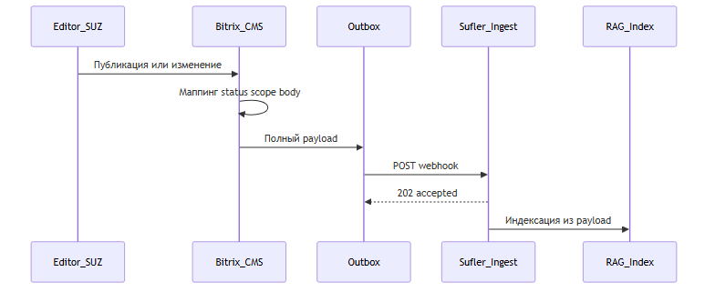


**Принципы:** единый банковский контур; событийный push; запись в outbox **до** HTTP; повтор с тем же `event_id`; REST **[Штатно]** — для INT-10 и опционального INT-06 (резерв/отладка), не для INT-01…05, 08.

**Штатные опоры CMS (документация):**

| Механизм | Документация |
|----------|--------------|
| Инфоблоки / `CIBlockElement` | [api_help/iblock](https://dev.1c-bitrix.ru/api_help/iblock/index.php) |
| События `OnAfterIBlockElementAdd/Update/Delete` | [api_help/main/events](https://dev.1c-bitrix.ru/api_help/main/events/index.php), [события инфоблока](https://dev.1c-bitrix.ru/api_help/iblock/events/index.php) |
| REST API (обзор) | [rest_help](https://dev.1c-bitrix.ru/rest_help/) |
| `iblock.element.list` | [iblock.element.list](https://dev.1c-bitrix.ru/rest_help/iblock/elements/iblock_element_get_list.php) |
| `iblock.element.get` | [iblock.element.get](https://dev.1c-bitrix.ru/rest_help/iblock/elements/iblock_element_get.php) |
| `iblock.element.getproperty` | [iblock.element.getproperty](https://dev.1c-bitrix.ru/rest_help/iblock/elements/iblock_element_getproperty.php) |
| `iblock.section.list` / `get` | [iblock.section.list](https://dev.1c-bitrix.ru/rest_help/iblock/sections/iblock_section_get_list.php), [iblock.section.get](https://dev.1c-bitrix.ru/rest_help/iblock/sections/iblock_section_get.php) |
| Агенты (`CAgent`) | [CAgent](https://dev.1c-bitrix.ru/api_help/main/reference/cagent/index.php) |
| OAuth / авторизация REST | [OAuth](https://dev.1c-bitrix.ru/rest_help/oauth/index.php) |

---

## 5. Постановка для разработчиков 1С-Битрикс

Что реализовать на стороне CMS: разделение штатных средств и доработки, перечень сдачи BTX, входные данные заказчика.

### 5.1. Штатно vs доработка

Что уже даёт платформа Bitrix и что добавляет модуль `bank.sufler.sync`. Ссылки — на открытую документацию **[Штатно]**.

| Требование | Штатно | Доработка |
|------------|--------|-----------|
| Чтение списка/статьи/разделов | REST [`iblock.element.list`](https://dev.1c-bitrix.ru/rest_help/iblock/elements/iblock_element_get_list.php), [`get`](https://dev.1c-bitrix.ru/rest_help/iblock/elements/iblock_element_get.php), [`getproperty`](https://dev.1c-bitrix.ru/rest_help/iblock/elements/iblock_element_getproperty.php); [`iblock.section.list`](https://dev.1c-bitrix.ru/rest_help/iblock/sections/iblock_section_get_list.php) / [`get`](https://dev.1c-bitrix.ru/rest_help/iblock/sections/iblock_section_get.php); обзор [REST](https://dev.1c-bitrix.ru/rest_help/) | Регламент ID инфоблока, коды свойств, сервисный токен (read) |
| Реакция на Add/Update/Delete | [События ядра](https://dev.1c-bitrix.ru/api_help/main/events/index.php) / [инфоблока](https://dev.1c-bitrix.ru/api_help/iblock/events/index.php): `OnAfterIBlockElementAdd/Update/Delete` | Обработчики → payload + outbox |
| Push в суфлёр | Нет | HTTP POST webhook |
| Надёжная доставка | Нет | Outbox: `pending` / `sent` / `failed`, retry |
| Уникальность сообщений | Нет | `event_id` (UUID) |
| Статус draft/published/archived | Частично `ACTIVE` ([инфоблоки](https://dev.1c-bitrix.ru/api_help/iblock/index.php)) | Вычисление `status` по правилам банка |
| Версии | История элемента ([инфоблоки](https://dev.1c-bitrix.ru/api_help/iblock/index.php)) | `version_id`, `is_current`, `event_type` |
| Scope КЦ | Свойства в REST ([getproperty](https://dev.1c-bitrix.ru/rest_help/iblock/elements/iblock_element_getproperty.php)) | `visibility_scope`; вне scope — не publish |
| Permalink | Шаблоны сайта | Стабильный URL в payload |
| Checksum / changed_fields | Нет | sha256; массив кодов полей |
| Инкремент хвоста | Частично `TIMESTAMP_X` в [`list`](https://dev.1c-bitrix.ru/rest_help/iblock/elements/iblock_element_get_list.php) | `GET …/changes?since=` из outbox |
| Retry по расписанию | [Агенты `CAgent`](https://dev.1c-bitrix.ru/api_help/main/reference/cagent/index.php) | Агент досылки `failed` + reconciliation |
| Защита канала | [OAuth](https://dev.1c-bitrix.ru/rest_help/oauth/index.php) входящего REST | TLS, allowlist, HMAC или mTLS исходящего POST |
| Эксплуатация | Общие логи | Админ-журнал + replay |

### 5.2. Deliverables (BTX)

Результаты поставки модуля интеграции на стороне Bitrix — пункты приёмки BTX-1…10. **BTX** = Bitrix deliverable.

| ID | Результат |
|----|-----------|
| **BTX-1** | Модуль `bank.sufler.sync`: URL webhook (тест/прод), HMAC, `IBLOCK_ID`, whitelist разделов КЦ |
| **BTX-2** | Обработчики [`OnAfterIBlockElementAdd/Update/Delete`](https://dev.1c-bitrix.ru/api_help/iblock/events/index.php) → outbox |
| **BTX-3** | Outbox + retry (3+ при 503/timeout; тот же `event_id`) |
| **BTX-4** | Маппинг → `status`, `visibility_scope`, версии, `body_*`, `checksum`, `changed_fields` |
| **BTX-5** | Регламент: коды свойств ↔ поля контракта |
| **BTX-6** | `GET /local/api/sufler/v1/changes?since=&limit=` (INT-09) |
| **BTX-7** | [Агент](https://dev.1c-bitrix.ru/api_help/main/reference/cagent/index.php) cron: досылка `failed`, опционально reconciliation |
| **BTX-8** | Админ-журнал outbox + **replay** (тот же `event_id`) |
| **BTX-9** | Совместная приёмка INT-T / UC |
| **BTX-10** | JSON Schema payload v1 + примеры по `event_type` |

**Оценка:** ориентир 2–4 недели одного разработчика Bitrix при готовых доступах и тестовом `IBLOCK_ID`.

### 5.3. Зависимости от Заказчика до старта

Данные и доступы, без которых нельзя начать разработку модуля sync.

1. ID инфоблока(ов), коды свойств, правила «опубликовано для КЦ» / `visibility_scope`.
2. Внутренний URL endpoint (тест/прод), лимит JSON, требования **ИБ**.
3. Сервисная учётка REST (read) для INT-10.
4. Тестовый контур Bitrix (копия prod) — срок по календарному плану договора.

---

## 6. Контракт обмена

Технический формат сообщения: куда слать, какие поля, как реагировать на ответы.

### 6.1. Транспорт

URL endpoint и заголовки исходящего POST.

**[Доработка]** `POST https://{internal-host}/api/v1/knowledge/events`

| Заголовок | Назначение |
|-----------|------------|
| `Content-Type: application/json` | Тело JSON |
| `X-Sufler-Event-Id: {event_id}` | Корреляция |
| `X-Sufler-Signature: HMAC-SHA256(body, secret)` | По требованию ИБ |

Маппинг полей элемента: `NAME` → `title`, `PREVIEW_TEXT` → `preview`, `DETAIL_TEXT` → `body_html` / `body_plain`.

### 6.2. Поля payload

Состав JSON webhook: обязательные и опциональные поля.

| Поле | Обяз. | Описание |
|------|-------|----------|
| `event_id` | да | UUID |
| `event_type` | да | Словарь §7 |
| `occurred_at` | да | ISO-8601 |
| `article_id`, `iblock_id` | да | ID элемента и инфоблока |
| `section_id` | нет | Раздел каталога |
| `version_id`, `version_number`, `is_current` | да* | Версии (*для версионных INT) |
| `status` | да | `draft` / `published` / `archived` |
| `title`, `preview`, `body_html`, `body_plain` | да* | Контент; `body_*` обязательны для INT-01/05 при `published` |
| `permalink` | да | URL оператору |
| `locale` | да | `ru` / `en` |
| `visibility_scope` | да | Напр. `["kc_operator"]` |
| `checksum` | да | sha256 нормализованного `body_plain` |
| `changed_fields` | нет | Коды полей |

### 6.3. `event_type` × действие в индексе

Какой тип события как меняет production-индекс.

| `event_type` | Типичный `status` | Действие в `cc_production` |
|--------------|-------------------|----------------------------|
| `article.version_published` | `published` | Индексировать / переиндексировать |
| `article.updated` | `draft` | Не индексировать |
| `article.unpublished` | `archived` или снятие | Soft delete |
| `article.deleted` | — | Hard delete по `article_id` |

### 6.4. Ответ приёмника (INT-07)

Коды ответа суфлёра и соответствующее поведение outbox на Bitrix.

| HTTP | Условие | Outbox Bitrix |
|------|---------|---------------|
| 202 | Принято | `sent` |
| 200 | Дубликат `event_id` | `sent` |
| 400 / 401 / 403 | Валидация / auth | `failed`, без retry |
| 503 / timeout | Временно недоступен | `pending` → INT-08 |

---

## 7. Реестр сценариев INT

Каталог сценариев обмена INT-01…10. Ниже — сводная таблица и полные карточки в едином формате (сценарий → матрица §5.1 → форматы → коды → пример → диаграмма). Бизнес-UC и приёмка INT-T — в [протоколе](протокол-интеграция-суз-bitrix-rag.md) §8 и [VI.1.7](../../modules/ai-hub/tz-unified-v1.4.md#vi17-приёмка-int-t-интеграция-суз).

**Модель B:** webhook несёт полное тело (`body_html`, `body_plain` + метаданные). **INT-06** — только резерв/отладка, **не** входит в цепочку INT-01/05.

| ID | Сценарий | Метод | event_type / API | UC | MVP |
|----|----------|-------|------------------|----|-----|
| **INT-01** | Публикация статьи в СУЗ | `POST` webhook | `article.version_published` | UC-A1 | Да |
| **INT-02** | Сохранение черновика | `POST` webhook | `article.updated`, `status=draft` | UC-A3 | Да |
| **INT-03** | Снятие с публикации | `POST` webhook | `article.unpublished` | UC-A6 | Да |
| **INT-04** | Удаление статьи | `POST` webhook | `article.deleted` | UC-A7 | Да |
| **INT-05** | Новая версия (редакция) | `POST` webhook | `article.version_published` | UC-A4 | Да |
| **INT-06** | GET статьи (резерв) | REST [`iblock.element.get`](https://dev.1c-bitrix.ru/rest_help/iblock/elements/iblock_element_get.php) / custom | — | — | Опц. |
| **INT-07** | Приём webhook (успех / дубль / ошибка) | `POST` → ответ | — | UC-D3 | Да |
| **INT-08** | Повтор из outbox (retry) | `POST` webhook (retry) | тот же `event_id` | UC-D2 | Да |
| **INT-09** | Инкремент изменений (fallback) | `GET …/changes?since=` | outbox | UC-B1 | Да |
| **INT-10** | Первичная полная загрузка | REST [`iblock.element.list`](https://dev.1c-bitrix.ru/rest_help/iblock/elements/iblock_element_get_list.php) / [`get`](https://dev.1c-bitrix.ru/rest_help/iblock/elements/iblock_element_get.php) **[Штатно]** | — | UC-D1 | Да |

### INT-01. Публикация статьи в СУЗ

**UC:** UC-A1 · **Цепочка (модель B):** webhook с полным телом → ответ INT-07 → индексация из payload (**без** INT-06).

#### 1. Сценарий

Редактор СУЗ **впервые опубликовал** статью (активный элемент инфоблока, scope КЦ). Bitrix собирает полный payload (метаданные + `body_html` / `body_plain`), пишет в outbox и шлёт webhook; суфлёр индексирует статью для КЦ **из тела POST**.

#### 2. Матрица §5.1 (штатно vs доработка)

| Требование §5.1 | Штатно (API / CMS) | Доработка Bitrix |
|-----------------|--------------------|------------------|
| Реакция на Add/Update/Delete | [События ядра](https://dev.1c-bitrix.ru/api_help/main/events/index.php) / [инфоблока](https://dev.1c-bitrix.ru/api_help/iblock/events/index.php): `OnAfterIBlockElementAdd` / `Update` | Обработчик модуля → полный payload + outbox |
| Push в суфлёр | Нет | HTTP POST webhook |
| Надёжная доставка | Нет | Outbox: `pending` / `sent` / `failed`, retry |
| Уникальность сообщений | Нет | `event_id` (UUID) |
| Статус draft/published/archived | Частично `ACTIVE` ([инфоблоки](https://dev.1c-bitrix.ru/api_help/iblock/index.php)) | Вычислить `status=published` |
| Версии | История элемента ([инфоблоки](https://dev.1c-bitrix.ru/api_help/iblock/index.php)) | `version_id`, `version_number`, `is_current` |
| Scope КЦ | Свойства ([getproperty](https://dev.1c-bitrix.ru/rest_help/iblock/elements/iblock_element_getproperty.php)) | `visibility_scope`; вне scope — не publish |
| Permalink | Шаблоны сайта | Стабильный `permalink` в payload |
| Checksum / changed_fields | Нет | `checksum` (sha256), `changed_fields[]` |
| Защита канала | [OAuth](https://dev.1c-bitrix.ru/rest_help/oauth/index.php) входящего REST | HMAC/mTLS исходящего webhook |
| Эксплуатация | Общие логи CMS | Админ-журнал outbox |

#### 3. Форматы запроса и ответа

**Исходящий запрос (Bitrix → суфлёр)**

| Параметр | Значение |
|----------|----------|
| Метод | `POST` |
| URL | `https://{internal-host}/api/v1/knowledge/events` |
| Заголовки | `Content-Type: application/json`; `X-Sufler-Event-Id: {event_id}`; опц. `X-Sufler-Signature` |

| Поле JSON | Тип | Обяз. | Описание |
|-----------|-----|------|----------|
| `event_id` | UUID | да | Идемпотентность |
| `event_type` | string | да | `article.version_published` |
| `occurred_at` | ISO-8601 | да | Время события |
| `article_id`, `iblock_id` | int | да | Элемент СУЗ |
| `section_id` | int | нет | Раздел |
| `version_id`, `version_number`, `is_current` | — | да | Версия |
| `status` | enum | да | `published` |
| `title`, `preview`, `body_html`, `body_plain` | string | да | Полный текст в webhook (модель B) |
| `checksum`, `changed_fields`, `permalink`, `locale`, `visibility_scope` | — | см. §6.2 | |

**Ответ (суфлёр → Bitrix):** см. **INT-07** (типично `202` + JSON `status: accepted`). Отдельный GET статьи **не** выполняется.

#### 4. Коды ответов и ошибок (webhook INT-01)

| HTTP | Условие | Пример тела | Outbox Bitrix |
|------|---------|-------------|---------------|
| 202 | Принято к обработке | `{"status":"accepted","event_id":"…"}` | `sent` |
| 200 | Дубликат `event_id` | `{"status":"duplicate","event_id":"…"}` | `sent` |
| 400 | Невалидный JSON/поля (в т.ч. нет `body_*`) | `{"error":"validation","fields":["body_plain"]}` | `failed`, без retry |
| 401/403 | Подпись/доступ | `{"error":"auth"}` | `failed`, алерт |
| 503 | Временная недоступность | `{"error":"temporary"}` | `pending` → **INT-08** |
| timeout | Нет ответа | — | `pending` → **INT-08** |

#### 5. Пример тела запроса

```http
POST /api/v1/knowledge/events HTTP/1.1
Content-Type: application/json
X-Sufler-Event-Id: 550e8400-e29b-41d4-a716-446655440000
```

```json
{
  "event_id": "550e8400-e29b-41d4-a716-446655440000",
  "event_type": "article.version_published",
  "occurred_at": "2026-05-27T14:32:01+03:00",
  "article_id": 12845,
  "iblock_id": 42,
  "section_id": 318,
  "version_id": "hist-92831",
  "version_number": 1,
  "is_current": true,
  "status": "published",
  "checksum": "sha256:9f2c1a…",
  "changed_fields": ["DETAIL_TEXT", "NAME"],
  "permalink": "https://suz.bank.by/kc/articles/komissiya-perevod/",
  "locale": "ru",
  "visibility_scope": ["kc_operator"],
  "title": "Комиссия за перевод",
  "preview": "Краткая выдержка…",
  "body_html": "<p>Текст DETAIL_TEXT…</p>",
  "body_plain": "Текст без HTML…"
}
```

**Маппинг полей инфоблока → payload (ориентир BTX-5):**

| Поле Bitrix | Поле контракта |
|-------------|----------------|
| `ID` | `article_id` |
| `IBLOCK_ID` | `iblock_id` |
| `IBLOCK_SECTION_ID` | `section_id` |
| `NAME` | `title` |
| `PREVIEW_TEXT` | `preview` |
| `DETAIL_TEXT` | `body_html` / `body_plain` |
| `ACTIVE` + правила банка | `status` |
| Свойство scope | `visibility_scope` |
| URL по шаблону | `permalink` |

**Контекст суфлёра:** после `202` — чанки → эмбеддинги → `cc_production` **из payload** (без GET).

#### 6. Диаграмма последовательности


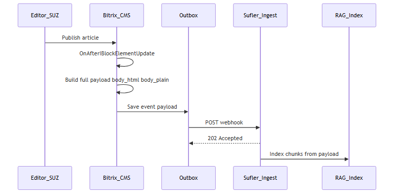


---

### INT-02. Сохранение черновика (без индексации КЦ)

**UC:** UC-A3

#### 1. Сценарий

Редактор **сохранил черновик**, не публикуя. Bitrix шлёт `article.updated` с `status=draft`; production-индекс суфлёра **не** меняется (аудит/журнал).

#### 2. Матрица §5.1 (штатно vs доработка)

| Требование §5.1 | Штатно (API / CMS) | Доработка Bitrix |
|-----------------|--------------------|------------------|
| Реакция на Add/Update/Delete | [`OnAfterIBlockElementUpdate`](https://dev.1c-bitrix.ru/api_help/iblock/events/index.php) | Обработчик; не путать с publish |
| Push в суфлёр | Нет | POST webhook |
| Надёжная доставка | Нет | Запись outbox + доставка |
| Уникальность сообщений | Нет | `event_id` (UUID) |
| Статус draft/published/archived | `ACTIVE=N` / workflow ([инфоблоки](https://dev.1c-bitrix.ru/api_help/iblock/index.php)) | **`status: draft`**, `is_current: false` |
| Checksum / changed_fields | Нет | `changed_fields`, `checksum` (рекомендуется) |
| Защита канала | — | HMAC исходящего POST |

#### 3. Форматы запроса и ответа

`POST /api/v1/knowledge/events` — те же заголовки, что **INT-01**. Обязательны: `event_id`, `event_type`=`article.updated`, `status`=`draft`, `is_current`=false, `article_id`, `iblock_id`; `checksum` рекомендуется. Поля `body_*` допустимы (для аудита), но **не** обязательны для индексации.

**Ответ:** **INT-07** (`202` / ошибки).

#### 4. Коды ответов и ошибок

Как **INT-01** / **INT-07**. Ошибка `400`, если передан `status: published` при операции черновика (валидация на стороне суфлёра).

#### 5. Пример тела запроса

```json
{
  "event_id": "7c9e6679-7425-40de-944b-e07fc1f90ae7",
  "event_type": "article.updated",
  "occurred_at": "2026-05-27T15:10:00+03:00",
  "article_id": 12845,
  "iblock_id": 42,
  "status": "draft",
  "is_current": false,
  "checksum": "sha256:ab12…",
  "changed_fields": ["DETAIL_TEXT"],
  "title": "Комиссия за перевод (черновик)",
  "body_plain": "Текст черновика…"
}
```

**Контекст суфлёра:** аудит/журнал; **без** переиндексации `cc_production`.

#### 6. Диаграмма последовательности


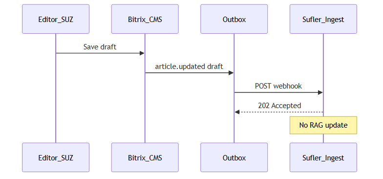


---

### INT-03. Снятие с публикации

**UC:** UC-A6

#### 1. Сценарий

Статья **снята с публикации** (`ACTIVE=N` / архив). Операторы КЦ не должны видеть её в подсказках.

#### 2. Матрица §5.1 (штатно vs доработка)

| Требование §5.1 | Штатно (API / CMS) | Доработка Bitrix |
|-----------------|--------------------|------------------|
| Реакция на Add/Update/Delete | [`OnAfterIBlockElementUpdate`](https://dev.1c-bitrix.ru/api_help/iblock/events/index.php) | `event_type: article.unpublished` |
| Push / outbox / UUID | Нет | Как INT-01 |
| Статус draft/published/archived | Смена `ACTIVE` ([инфоблоки](https://dev.1c-bitrix.ru/api_help/iblock/index.php)) | `status: archived`, `is_current: false` |
| Защита канала | — | HMAC webhook |

#### 3. Форматы запроса и ответа

`POST` webhook; `event_type` = `article.unpublished`. Минимум: `event_id`, `occurred_at`, `article_id`, `iblock_id`, `status`, `is_current`. Поля `body_*` не обязательны.

**Ответ:** **INT-07**.

#### 4. Коды ответов и ошибок

Как **INT-07**.

#### 5. Пример тела запроса

```json
{
  "event_id": "b1c2d3e4-f506-7890-abcd-ef1234567890",
  "event_type": "article.unpublished",
  "occurred_at": "2026-05-27T15:45:00+03:00",
  "article_id": 12845,
  "iblock_id": 42,
  "status": "archived",
  "is_current": false
}
```

**Контекст суфлёра:** soft delete в vector store по `article_id`.

#### 6. Диаграмма последовательности


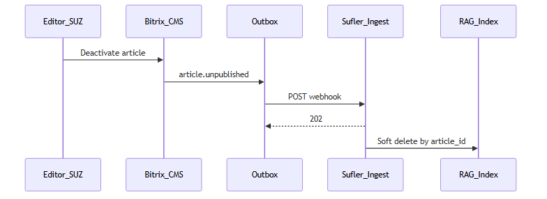


---

### INT-04. Удаление статьи

**UC:** UC-A7

#### 1. Сценарий

Элемент инфоблока **удалён** в СУЗ. Минимальный webhook (без `body_*`); индекс суфлёра очищается полностью.

#### 2. Матрица §5.1 (штатно vs доработка)

| Требование §5.1 | Штатно (API / CMS) | Доработка Bitrix |
|-----------------|--------------------|------------------|
| Реакция на Add/Update/Delete | [`OnAfterIBlockElementDelete`](https://dev.1c-bitrix.ru/api_help/iblock/events/index.php) | `article.deleted`, минимальный payload |
| Push / outbox / UUID | Нет | Модуль sync |
| Защита канала | — | HMAC |

#### 3. Форматы запроса и ответа

`POST`; `event_type` = `article.deleted`. Обязательны: `event_id`, `occurred_at`, `article_id`, `iblock_id`. Поля `body_*` **не** передаются.

#### 4. Коды ответов и ошибок

Как **INT-07**.

#### 5. Пример тела запроса

```json
{
  "event_id": "a3bb189e-8bf9-3888-9912-ace4e6543002",
  "event_type": "article.deleted",
  "occurred_at": "2026-05-27T16:00:00+03:00",
  "article_id": 9912,
  "iblock_id": 42,
  "is_current": false,
  "status": "archived"
}
```

**Контекст суфлёра:** hard delete векторов по `article_id`.

#### 6. Диаграмма последовательности


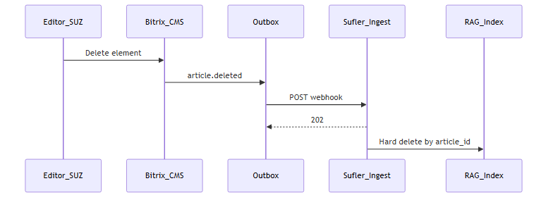


---

### INT-05. Публикация новой версии статьи

**UC:** UC-A4 · **Цепочка (модель B):** как **INT-01** — полный текст в webhook (**без** INT-06).

#### 1. Сценарий

Утверждена **новая редакция** (workflow / история элемента). В RAG одна текущая версия; старые векторы по предыдущему `version_id` снимаются. Bitrix передаёт новый `version_id` / `version_number` и полный `body_*`.

#### 2. Матрица §5.1 (штатно vs доработка)

| Требование §5.1 | Штатно (API / CMS) | Доработка Bitrix |
|-----------------|--------------------|------------------|
| Реакция / push / outbox / UUID | [События инфоблока](https://dev.1c-bitrix.ru/api_help/iblock/events/index.php) | Как INT-01 + полный payload |
| Версии | История элемента ([инфоблоки](https://dev.1c-bitrix.ru/api_help/iblock/index.php)) | Новый `version_id`, `version_number++`, `is_current: true` |
| Checksum / changed_fields | Нет | `changed_fields`, `checksum` |
| Permalink | Шаблоны сайта | Стабильный `permalink` (желательно без смены URL) |
| Защита / эксплуатация | — | HMAC, журнал outbox |

#### 3. Форматы запроса и ответа

Webhook — как **INT-01**, `event_type` = `article.version_published`, новые `version_id` / `version_number`, обязательны `body_html` / `body_plain`. Ответ — **INT-07**.

#### 4. Коды ответов и ошибок

Как **INT-01** / **INT-07**.

#### 5. Пример тела запроса

Как **INT-01**, с изменениями:

```json
{
  "event_id": "c0ffee00-1234-5678-9abc-def012345678",
  "event_type": "article.version_published",
  "occurred_at": "2026-05-28T10:00:00+03:00",
  "article_id": 12845,
  "iblock_id": 42,
  "section_id": 318,
  "version_id": "hist-99001",
  "version_number": 7,
  "is_current": true,
  "status": "published",
  "checksum": "sha256:77aa…",
  "changed_fields": ["DETAIL_TEXT"],
  "permalink": "https://suz.bank.by/kc/articles/komissiya-perevod/",
  "locale": "ru",
  "visibility_scope": ["kc_operator"],
  "title": "Комиссия за перевод",
  "preview": "Обновлённая выдержка…",
  "body_html": "<p>Текст редакции v7…</p>",
  "body_plain": "Текст редакции v7…"
}
```

**Контекст суфлёра:** переиндексация из payload; удаление векторов предыдущего `version_id`.

#### 6. Диаграмма последовательности


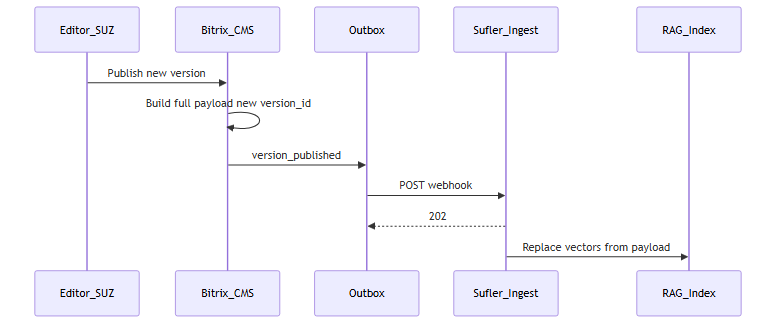


---

### INT-06. GET статьи (резерв / отладка)

**Статус в модели B:** **опционально**. **Не** вызывается из INT-01/05. Используется для отладки, сверки checksum, аварийного fallback или при расследовании инцидентов. Первичная загрузка — **INT-10**.

#### 1. Сценарий

Суфлёр (или инженер) запрашивает у Bitrix **полный текст** и свойства одной статьи по `article_id` через штатный REST или custom API модуля.

#### 2. Матрица §5.1 (штатно vs доработка)

| Требование §5.1 | Штатно (API / CMS) | Доработка Bitrix |
|-----------------|--------------------|------------------|
| Чтение списка/статьи/разделов | [`iblock.element.get`](https://dev.1c-bitrix.ru/rest_help/iblock/elements/iblock_element_get.php), [`getproperty`](https://dev.1c-bitrix.ru/rest_help/iblock/elements/iblock_element_getproperty.php); [`iblock.section.*`](https://dev.1c-bitrix.ru/rest_help/iblock/sections/iblock_section_get_list.php) | Регламент `IBLOCK_ID`, маппинг в контракт; опц. `GET /local/api/sufler/v1/articles/{id}` |
| Защита канала | [OAuth](https://dev.1c-bitrix.ru/rest_help/oauth/index.php) REST | Сервисный пользователь read-only |

#### 3. Форматы запроса и ответа

**Входящий запрос (суфлёр → Bitrix)**

| Вариант | Метод / URL |
|---------|-------------|
| Штатный | `GET /rest/iblock.element.get?ID={id}&IBLOCK_ID={iblock_id}` |
| Custom (опц.) | `GET /local/api/sufler/v1/articles/{id}` |

Заголовок: `Authorization: Bearer {service_token}`.

**Ответ 200 — поля (ориентир контракта):**

| Поле | Тип | Обяз. |
|------|-----|------|
| `article_id`, `iblock_id`, `version_id` | — | да |
| `title`, `preview`, `body_html`, `body_plain` | string | да |
| `status`, `locale`, `visibility_scope`, `updated_at` | — | да |

#### 4. Коды ответов и ошибок

| HTTP | Условие | Действие суфлёра |
|------|---------|------------------|
| 200 | Статья найдена | Сверка / опц. индексация |
| 404 | Удалена / нет доступа | Hard delete в индексе (если применялось) |
| 401/403 | Токен | Алерт, retry позже |
| 500 | Ошибка CMS | Retry с backoff |

#### 5. Пример тела запроса

```http
GET /rest/iblock.element.get?ID=12845&IBLOCK_ID=42 HTTP/1.1
Authorization: Bearer {service_token}
```

**Пример ответа 200 (нормализованный вид):**

```json
{
  "article_id": 12845,
  "iblock_id": 42,
  "version_id": "hist-92831",
  "title": "Комиссия за перевод",
  "preview": "Краткая выдержка…",
  "body_html": "<p>Текст DETAIL_TEXT…</p>",
  "body_plain": "Текст без HTML…",
  "status": "published",
  "locale": "ru",
  "visibility_scope": ["kc_operator"],
  "updated_at": "2026-05-27T14:32:01+03:00"
}
```

**Контекст суфлёра:** не штатная цепочка оперативной синхронизации модели B.

#### 6. Диаграмма последовательности


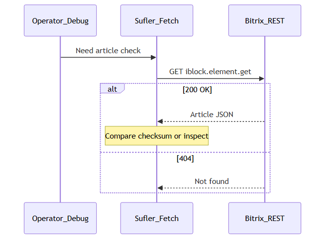


---

### INT-07. Приём webhook: успех, валидация, дубликат

**UC:** UC-D3 · **Относится к:** INT-01…05, 08

#### 1. Сценарий

Bitrix отправил POST; суфлёр возвращает код и JSON. Bitrix обновляет статус **outbox** (не путать с HTTP-кодом записи в журнале CMS).

#### 2. Матрица §5.1 (штатно vs доработка)

| Требование §5.1 | Штатно (API / CMS) | Доработка Bitrix |
|-----------------|--------------------|------------------|
| Push в суфлёр | HTTP-клиент CMS | Парсинг ответа, корреляция `event_id` |
| Надёжная доставка | Нет | Переходы outbox `pending` / `sent` / `failed` |
| Эксплуатация | Общие логи | Отображение ошибки в админке модуля |

#### 3. Форматы запроса и ответа

**Запрос:** тело из INT-01…05 (Bitrix → суфлёр).

**Ответ (суфлёр → Bitrix)** — `Content-Type: application/json`:

| Поле | При `status` | Описание |
|------|--------------|----------|
| `status` | `accepted` / `duplicate` | Успех |
| `event_id` | UUID | Эхо запроса |
| `error` | `validation` / `auth` / `temporary` | Ошибка |
| `fields` | string[] | При validation |

#### 4. Коды ответов и ошибок

| HTTP | Пример тела | Действие Bitrix |
|------|-------------|-----------------|
| 202 | `{"status":"accepted","event_id":"…"}` | outbox → `sent` |
| 200 | `{"status":"duplicate","event_id":"…"}` | `sent` (идемпотентность) |
| 400 | `{"error":"validation","fields":["status"]}` | `failed`, **без** retry |
| 401/403 | `{"error":"auth"}` | `failed`, алерт ИБ |
| 503 | `{"error":"temporary"}` | `pending` → **INT-08** |
| timeout | — | `pending` → **INT-08** |

#### 5. Пример тела запроса

Используйте пример **INT-01**; для проверки дубликата — повтор того же `event_id`.

**Пример ответа 202:**

```json
{"status":"accepted","event_id":"550e8400-e29b-41d4-a716-446655440000"}
```

**Контекст суфлёра:** идемпотентность по `event_id`.

#### 6. Диаграмма последовательности


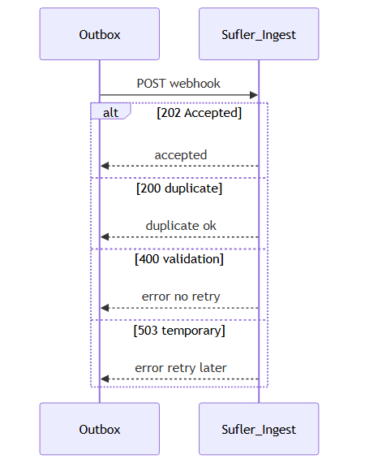


---

### INT-08. Повтор отправки из outbox (retry)

**UC:** UC-D2

#### 1. Сценарий

Первая доставка вернула **503** / timeout. Агент Bitrix повторяет **тот же** POST с тем же `event_id` и полным телом (модель B).

#### 2. Матрица §5.1 (штатно vs доработка)

| Требование §5.1 | Штатно (API / CMS) | Доработка Bitrix |
|-----------------|--------------------|------------------|
| Надёжная доставка | Нет | Backoff, лимит попыток, тот же `event_id` |
| Retry по расписанию | [Агенты `CAgent`](https://dev.1c-bitrix.ru/api_help/main/reference/cagent/index.php) | Агент модуля (напр. каждые 15 мин) |
| Эксплуатация | — | Replay / просмотр в админке |

#### 3. Форматы запроса и ответа

Идентичны исходному событию (INT-01…05), включая `body_*` для publish. Заголовок `X-Sufler-Event-Id` **не меняется**.

**Ответ:** **INT-07** (`202` или `200 duplicate`).

#### 4. Коды ответов и ошибок

Повтор до `sent` или исчерпания попыток → `failed` + алерт. `400`/`401` — **не** retry.

#### 5. Пример тела запроса

Полная копия JSON первой попытки (см. **INT-01**, включая `body_html` / `body_plain`).

**Контекст суфлёра:** at-least-once; дубликат по `event_id` — OK.

#### 6. Диаграмма последовательности


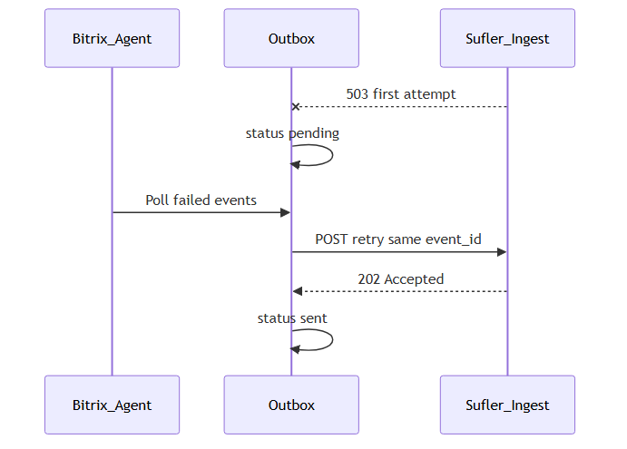


---

### INT-09. Инкремент изменений (fallback)

**UC:** UC-B1

#### 1. Сценарий

Пропущены webhook. Суфлёр (или reconcile-агент) запрашивает **хвост событий** по курсору из outbox. В модели B элементы `events[]` содержат тот же контракт, что webhook (для publish — с `body_*`).

#### 2. Матрица §5.1 (штатно vs доработка)

| Требование §5.1 | Штатно (API / CMS) | Доработка Bitrix |
|-----------------|--------------------|------------------|
| Чтение списка/статьи/разделов | [`iblock.element.list`](https://dev.1c-bitrix.ru/rest_help/iblock/elements/iblock_element_get_list.php) + `TIMESTAMP_X` | Недостаточно для семантики событий |
| Инкремент хвоста | Нет журнала интеграции | `GET .../changes?since=&limit=` из outbox |
| Retry по расписанию | [CAgent](https://dev.1c-bitrix.ru/api_help/main/reference/cagent/index.php) | Агент reconciliation |
| Защита канала | [OAuth](https://dev.1c-bitrix.ru/rest_help/oauth/index.php) | Bearer на custom API |

#### 3. Форматы запроса и ответа

| Параметр | Значение |
|----------|----------|
| Метод | `GET` |
| URL | `/local/api/sufler/v1/changes?since={cursor}&limit=100` |
| Query | `since` ISO-8601, `limit` int ≤100 |

**Ответ 200:** `cursor` (новый), `events[]` — элементы как webhook (§6.2; для `article.version_published` — с `body_*`).

#### 4. Коды ответов и ошибок

| HTTP | Условие |
|------|---------|
| 200 | Страница событий (может быть `[]`) |
| 400 | Некорректный `since` |
| 401/403 | Токен |
| 500 | Ошибка БД outbox |

#### 5. Пример тела запроса

```http
GET /local/api/sufler/v1/changes?since=2026-05-27T12:00:00%2B03:00&limit=100 HTTP/1.1
Authorization: Bearer {service_token}
```

```json
{
  "cursor": "2026-05-27T16:45:00+03:00",
  "events": [
    {
      "event_id": "550e8400-e29b-41d4-a716-446655440000",
      "event_type": "article.version_published",
      "occurred_at": "2026-05-27T14:32:01+03:00",
      "article_id": 12845,
      "iblock_id": 42,
      "status": "published",
      "checksum": "sha256:9f2c1a…",
      "title": "Комиссия за перевод",
      "body_plain": "Текст без HTML…",
      "body_html": "<p>Текст DETAIL_TEXT…</p>"
    }
  ]
}
```

**Контекст суфлёра:** обработка каждого события как соответствующий INT-01/03/04/05 **из тела события** (без дополнительного GET).

#### 6. Диаграмма последовательности


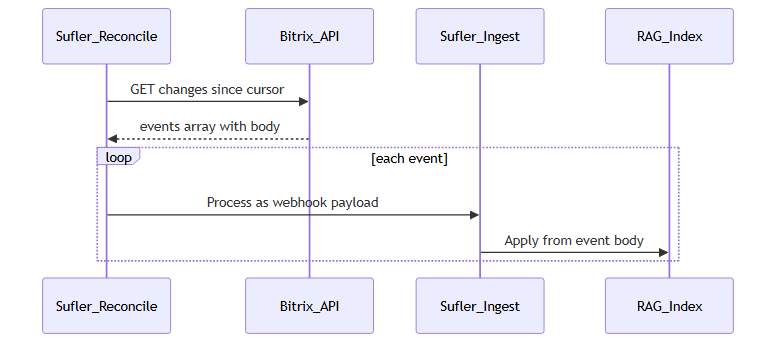


---

### INT-10. Первичная полная загрузка (full load)

**UC:** UC-D1

#### 1. Сценарий

**Внедрение:** массовое наполнение RAG опубликованными статьями scope КЦ через штатный REST; затем включается push INT-01…08 (модель B).

#### 2. Матрица §5.1 (штатно vs доработка)

| Требование §5.1 | Штатно (API / CMS) | Доработка Bitrix |
|-----------------|--------------------|------------------|
| Чтение списка/статьи/разделов | [`iblock.element.list`](https://dev.1c-bitrix.ru/rest_help/iblock/elements/iblock_element_get_list.php), [`get`](https://dev.1c-bitrix.ru/rest_help/iblock/elements/iblock_element_get.php), [`iblock.section.*`](https://dev.1c-bitrix.ru/rest_help/iblock/sections/iblock_section_get_list.php) | `IBLOCK_ID`, фильтр `ACTIVE=Y`, whitelist разделов КЦ, маппинг полей |
| Scope КЦ | Свойства ([getproperty](https://dev.1c-bitrix.ru/rest_help/iblock/elements/iblock_element_getproperty.php)) | Фильтр на list / post-filter |
| Защита канала | [OAuth](https://dev.1c-bitrix.ru/rest_help/oauth/index.php) REST | Сервисная учётка read-only |
| Эксплуатация | — | Тестовый `IBLOCK_ID` / стенд |

#### 3. Форматы запроса и ответа

| Шаг | Метод | Назначение |
|-----|-------|------------|
| 1 | `GET iblock.element.list` | Страница ID |
| 2 | `GET iblock.element.get` | Тело каждой статьи |

Query: `IBLOCK_ID`, `ACTIVE=Y`, `start` (пагинация Bitrix REST).

**Ответ list:** массив элементов/ID по документации REST; ошибки как у REST get (см. INT-06).

#### 4. Коды ответов и ошибок

| HTTP | Условие |
|------|---------|
| 200 | Страница list / get |
| 403 | Нет прав на инфоблок |
| 500 | Ошибка CMS — retry страницы |

#### 5. Пример тела запроса

```http
GET /rest/iblock.element.list?IBLOCK_ID=42&ACTIVE=Y&start=0 HTTP/1.1
Authorization: Bearer {service_token}
```

Далее для каждого `ID` — `GET iblock.element.get` (формат ответа — как в **INT-06**).

**Контекст суфлёра:** mass index; после завершения — режим событий (webhook модель B).

#### 6. Диаграмма последовательности


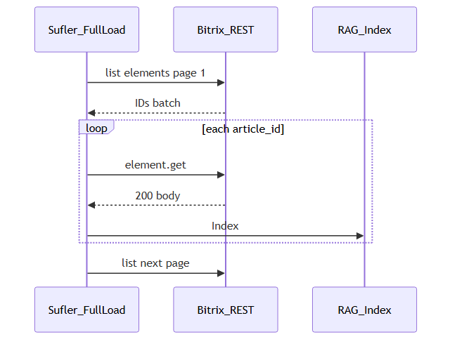


---

## 8. Чек-лист согласования с заказчиком

Вопросы, которые нужно закрыть с владельцем СУЗ и разработчиком Bitrix до реализации.

**Приёмка INT-T** (критерии и UC) — не дублируется здесь: см. [протокол](протокол-интеграция-суз-bitrix-rag.md) §8 и [VI.1.7](../../modules/ai-hub/tz-unified-v1.4.md#vi17-приёмка-int-t-интеграция-суз).

1. Редакция 1С-Битрикс; REST на тесте/проде включён?
2. ID инфоблока(ов) и whitelist разделов для КЦ.
3. Как отличить черновик / опубликовано для КЦ / архив?
4. Свойство или правило для `visibility_scope`.
5. Модель версий: история элемента, workflow, отдельные элементы?
6. Стабилен ли `permalink` при новой версии?
7. Лимит размера JSON; HMAC или mTLS?
8. Сервисная учётка REST (read) для INT-10.
9. Контакт разработчика Bitrix и срок BTX-1…10.

---

## Приложение А. JSON Schema (ориентир)

Минимальный набор обязательных ключей для schema (полный файл — BTX-10).

Полный файл schema поставляет **BTX-10**. Минимальные обязательные ключи для `article.version_published`:

`event_id`, `event_type`, `occurred_at`, `article_id`, `iblock_id`, `version_id`, `is_current`, `status`, `checksum`, `permalink`, `locale`, `visibility_scope`, `title`, `body_html`, `body_plain`.

Типы: `event_id` — UUID-строка; `status` — enum `draft|published|archived`; `visibility_scope` — массив строк; `body_*` — строки.

