
# Протокол интеграции СУЗ (1С-Битрикс CMS) с RAG суфлёра

## Содержание

1. [Глоссарий](#1-глоссарий-для-тз-и-согласований-с-заказчиком)
2. [Контекст и ограничения](#2-контекст-и-ограничения)
3. [API vs доработка Битрикс](#3-api-vs-доработка-битрикс-нужно-ли-что-то-писать-разработчикам-cms)
4. [Постановка задачи для разработчиков 1С-Битрикс](#4-постановка-задачи-для-разработчиков-1с-битрикс) — **основное ТЗ для CMS**
5. [Что даёт документация 1С-Битрикс](#5-что-даёт-открытая-документация-1с-битрикс-релевантно-cms)
6. [Спецификация INT-XX (§6)](#6-спецификация-интеграции-по-сценариям-int-xx)
   - [6.0 Шаблон](#60-шаблон-карточки-сценария-для-опроса-и-тз) · [6.1 Реестр](#61-реестр-сценариев-интеграции) · [6.2 Поля](#62-общие-поля-payload-все-webhook-int-010508)
   - [INT-01](#int-01-публикация-статьи-в-суз) · [INT-02](#int-02-сохранение-черновика-без-индексации-кц) · [INT-03](#int-03-снятие-с-публикации) · [INT-04](#int-04-удаление-статьи) · [INT-05](#int-05-публикация-новой-версии-статьи)
   - [INT-06](#int-06-догрузка-текста-статьи-get) · [INT-07](#int-07-приём-webhook-успех-валидация-дубликат) · [INT-08](#int-08-повтор-отправки-из-outbox-retry) · [INT-09](#int-09-инкремент-изменений-fallback) · [INT-10](#int-10-первичная-полная-загрузка-full-load)
7. [Данные для RAG](#7-данные-для-rag-что-забираем-из-инфоблока)
8. [Пользовательские сценарии](#8-пользовательские-сценарии-раздел-тз-для-битрикс-и-приёмки)
9. [Пошаговый план работ](#9-пошаговый-план-работ-только-планирование)
10. [Риски и допущения](#10-риски-и-явные-допущения)
11. [Ближайшие действия](#11-ближайшие-действия-команды-без-кода)

---

## 1. Глоссарий (для ТЗ и согласований с заказчиком)

Термины ниже используются в документе единообразно. Рекомендуется включить глоссарий в начало ТЗ для разработчика Битрикс (раздел 0 или приложение А).

### 1.1. Системы и роли


| Термин                            | Определение                                                                                                                                                   |
| --------------------------------- | ------------------------------------------------------------------------------------------------------------------------------------------------------------- |
| **СУЗ**                           | Система управления знаниями банка — корпоративная база регламентов и статей для сотрудников; в контуре проекта реализована на **1С-Битрикс CMS** (инфоблоки). |
| **1С-Битрикс: Управление сайтом** | CMS заказчика (не Bitrix24). Платформа хранения и публикации статей СУЗ.                                                                                      |
| **Суфлёр**                        | ПО на базе ИИ для операторов КЦ: подсказки по диалогу с опорой на актуальный контент СУЗ (RAG + LLM).                                                         |
| **КЦ**                            | Контакт-центр банка (телефония, онлайн-чат).                                                                                                                  |
| **Редактор СУЗ**                  | Сотрудник, создающий и публикующий статьи в админке Битрикс (не оператор линии).                                                                              |
| **Оператор КЦ**                   | Сотрудник линии; **не** редактирует СУЗ, использует подсказки и ссылки на статьи.                                                                             |
| **Контур суфлёра**                | Совокупность сервисов Исполнителя: приём событий, индексация, RAG, интеграция с АРМ оператора.                                                                |


### 1.2. Контент и структура в Битрикс


| Термин               | Определение                                                                                                                  |
| -------------------- | ---------------------------------------------------------------------------------------------------------------------------- |
| **Инфоблок**         | Основная сущность хранения в 1С-Битрикс: тип контента «статья СУЗ» (элементы, разделы, свойства, файлы).                     |
| **Элемент / статья** | Запись инфоблока (`article_id` в интеграции) — одна логическая статья базы знаний.                                           |
| **Раздел**           | Узел дерева каталога СУЗ (`section_id`); влияет на метаданные и фильтры поиска.                                              |
| **Черновик**         | Сохранённая, но **не опубликованная** редакция; в RAG для операторов **не используется**.                                    |
| **Публикация**       | Перевод статьи в состояние, доступное операторам КЦ (`status=published`, `ACTIVE=Y` и т.п. по модели банка).                 |
| **Версия статьи**    | Отдельная редакция текста с уникальным `version_id`; в индексе RAG одновременно **только одна текущая** (`is_current=true`). |
| **permalink**        | Стабильный URL статьи для оператора (открытие из подсказки суфлёра).                                                         |
| **visibility_scope** | Коды аудитории/ролей (например, «доступно КЦ»); определяет, попадает ли статья в индекс для суфлёра.                         |


### 1.3. Целевая модель интеграции (термины)


| Термин                | Определение                                                                                                                                                                                                            |
| --------------------- | ---------------------------------------------------------------------------------------------------------------------------------------------------------------------------------------------------------------------- |
| **Целевая модель**    | Согласованная схема взаимодействия: Битрикс фиксирует изменения и шлёт **события**; суфлёр **индексирует** только актуальный опубликованный контент для КЦ; поддерживается **версионность** и **точечные** обновления. |
| **Источник истины**   | СУЗ (Битрикс) — единственный авторитетный источник текстов для ответов КЦ (по Приложению 1 договора).                                                                                                                  |
| **Push-модель**       | Битрикс **сам отправляет** уведомление (webhook) при изменении статьи — основной канал.                                                                                                                                |
| **Pull-модель**       | Суфлёр **запрашивает** изменения или полный документ (REST / custom API) — резерв и первичная загрузка.                                                                                                                |
| **Событие (event)**   | Сообщение о факте изменения: тип `event_type` + **payload** (метаданные и ссылки на контент).                                                                                                                          |
| **event_type**        | Код вида изменения (`article.created`, `article.updated`, `article.deleted` и др.).                                                                                                                                    |
| **payload**           | Тело webhook: `event_id`, `article_id`, `version_id`, `checksum`, `changed_fields` и т.д.                                                                                                                              |
| **Production-индекс** | Рабочий векторный индекс RAG, из которого суфлёр ищет подсказки для операторов; не включает черновики.                                                                                                                 |


### 1.4. Надёжность и синхронизация


| Термин                      | Определение                                                                                                                                                       |
| --------------------------- | ----------------------------------------------------------------------------------------------------------------------------------------------------------------- |
| **Идемпотентность**         | Повторная обработка **одного и того же** события (`event_id`) или с тем же **checksum** не меняет результат повторно (нет дублей в индексе, нет лишней нагрузки). |
| **At-least-once**           | Доставка «как минимум один раз»: при сбоях возможен повтор, поэтому приёмник обязан быть идемпотентным.                                                           |
| **Outbox**                  | Таблица/очередь на стороне Битрикс: событие сначала сохраняется, затем отправляется с **retry** при ошибке сети.                                                  |
| **Webhook**                 | HTTP POST с JSON на endpoint контура суфлёра (часто через API Gateway банка).                                                                                     |
| **Fallback**                | Резервный механизм при сбое push: агент Битрикс или job суфлёра догоняет изменения по **курсору** (`since`).                                                      |
| **Reconciliation (сверка)** | Периодическое сравнение состояния Битрикс и RAG (checksum, список `article_id`) для устранения расхождений.                                                       |
| **Курсор (cursor)**         | Метка «обработано до …» (время, ID события) для инкрементальной выгрузки.                                                                                         |
| **checksum**                | Хеш нормализованного текста статьи; смена — сигнал к переиндексации; совпадение — можно пропустить обработку.                                                     |
| **SLA синхронизации**       | Целевое время от публикации в СУЗ до доступности в RAG (в плане ориентир **1–2 мин**).                                                                            |
| **lag**                     | Задержка актуализации индекса относительно СУЗ; мониторится при пиковых обновлениях.                                                                              |


### 1.5. RAG и поиск


| Термин                                   | Определение                                                                                                     |
| ---------------------------------------- | --------------------------------------------------------------------------------------------------------------- |
| **RAG** (Retrieval-Augmented Generation) | Подход: сначала **поиск** релевантных фрагментов в базе знаний, затем генерация/подсказка LLM **на их основе**. |
| **Индексация**                           | Загрузка статьи в контур суфлёра: нормализация → чанкинг → эмбеддинги → запись в хранилище.                     |
| **Чанк (chunk)**                         | Фрагмент текста статьи для векторного поиска; привязан к `article_id`, `version_id`, `chunk_index`.             |
| **Чанкинг**                              | Разбиение длинной статьи на части с сохранением метаданных.                                                     |
| **Эмбеддинг**                            | Векторное представление чанка для семантического поиска.                                                        |
| **Vector Store**                         | Хранилище векторов и метаданных (фильтр по scope КЦ, статусу, версии).                                          |
| **Retrieval**                            | Этап поиска релевантных чанков по запросу/контексту диалога.                                                    |
| **Переиндексация**                       | Обновление или замена векторов статьи после `article.updated` / новой версии.                                   |
| **Soft delete**                          | Статья скрыта из поиска (`unpublished`), данные в хранилище помечены неактивными.                               |
| **Hard delete**                          | Полное удаление векторов по `article_id` при `article.deleted`.                                                 |
| **Full load**                            | Первичная полная выгрузка всех опубликованных статей scope КЦ при внедрении.                                    |


### 1.6. Этапы и документы


| Термин                        | Определение                                                                            |
| ----------------------------- | -------------------------------------------------------------------------------------- |
| **ТЗ (на доработку Битрикс)** | Задание заказчику для разработчика CMS: события, outbox, API, сценарии UC, приёмка.    |
| **Спецификация интеграции**   | Приложение с JSON-schema событий и таблицей `event_type` (результат этапа 1).          |
| **MVP**                       | Минимальный набор сценариев и событий для первой приёмки (матрица «Обязателен в MVP»). |
| **Приложение 1**              | Технические требования к ПО по договору (интеграция с СУЗ, суфлёр, КЦ, ИБ и др.).      |


---

## 2. Контекст и ограничения

- **Платформа заказчика:** [1С-Битрикс: Управление сайтом](https://dev.1c-bitrix.ru/) (CMS), **не** Bitrix24.
- **Хранение СУЗ:** стандартные **инфоблоки** (статьи, разделы, свойства, вложения).
- **Требования проекта** ([транскрипт кик-офф](1d9bda79-331d-4b2e-a62e-7ab1814b29bb)): интеграция с СУЗ по п. 7.1 Приложения 1; для КЦ ответы **только из СУЗ**; ссылки на статьи оператору; клиенту в чате ссылки не отправляем; СУЗ меняется **несколько раз в день**, изменения **точечные**, есть **версионность**.
- **Текущий репозиторий** `[c:\sufler](c:\sufler)`: прототип Django-дашборда + ASR (`recognizer/`) — **модуля синхронизации с Битрикс/RAG пока нет**; планируем логический контур «Knowledge Sync + RAG» как отдельный блок будущей архитектуры.

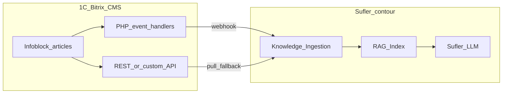


---

## 3. API vs доработка Битрикс: нужно ли что-то писать разработчикам CMS?

**Краткий ответ:** только «забирать по API» **недостаточно** для целевой **событийной** модели (несколько обновлений в день, версии, черновики). Нужна **совместная схема**: минимальная **доработка на стороне 1С-Битрикс** + **приём и индексация на стороне суфлёра** (часто webhook + догрузка контента по API).

### 3.1. Что может сделать Исполнитель (суфлёр) без доработки Битрикс


| Возможность                                                         | Ограничение                                                                                                  |
| ------------------------------------------------------------------- | ------------------------------------------------------------------------------------------------------------ |
| Периодический **опрос REST** `iblock.element.list` по `TIMESTAMP_X` | Задержка = интервал опроса; нагрузка на CMS; **не видит** «черновик vs опубликовано» без бизнес-логики банка |
| **Full load** при внедрении                                         | Разово ок; не решает оперативную синхронизацию                                                               |
| Чанкинг, RAG, фильтр «только КЦ»                                    | Нужны **стабильные поля** в ответе API (коды свойств, scope) — их должен описать заказчик                    |


### 3.2. Что типично требует доработки разработчиков 1С-Битрикс (ТЗ заказчику)


| Компонент                                       | Зачем не хватает «голого» REST                                                                      |
| ----------------------------------------------- | --------------------------------------------------------------------------------------------------- |
| **Обработчики событий** инфоблока               | REST не вызывается сам при сохранении; без push — только polling                                    |
| **Outbox + retry**                              | Гарантия доставки при обрыве связи с контуром суфлёра                                               |
| **Маппинг версий** (`version_id`, `is_current`) | Стандартный REST часто отдаёт «текущий элемент», история — отдельная логика банка                   |
| **Статус публикации / scope КЦ**                | В API сырой `ACTIVE`; «доступно оператору КЦ» часто в **свойстве** — нужен единый mapping в payload |
| `**changed_fields[]`**                          | Для точечной переиндексации; из коробки в REST нет                                                  |
| **Custom endpoint** `GET /changes?since=`       | Fallback и reconciliation, если REST модуль закрыт или урезан                                       |
| **Журнал интеграции** в админке                 | Эксплуатация и приёмка на стороне банка                                                             |


**Вывод для переговоров:** доработка Битрикс — **не «вся интеграция»**, а **тонкий слой событий и контракта данных**; суфлёр забирает **полный текст и метаданные** по согласованному API после сигнала (или в одном расширенном webhook — по решению ИБ).

### 3.3. Три допустимые модели (уточнить у заказчика, одну выбрать)


| Модель                              | Битрикс                                                       | Суфлёр                  | Когда уместно                                                                        |
| ----------------------------------- | ------------------------------------------------------------- | ----------------------- | ------------------------------------------------------------------------------------ |
| **A. Push + Fetch (рекомендуется)** | Webhook с метаданными; REST/custom GET статьи по `article_id` | Ingestion + fetch + RAG | Есть сеть до API Gateway; ИБ не требует полный текст в webhook                       |
| **B. Push с полным телом**          | Webhook сразу с текстом статьи                                | Только ingestion + RAG  | Закрытый контур, нет обратного fetch                                                 |
| **C. Только Pull**                  | Только REST (без доработки)                                   | Polling каждые N мин    | **Не рекомендуется** при «несколько раз в день» и версиях — только как временный MVP |


### 3.4. Вопросы заказчику (чек-лист на встрече с владельцем СУЗ + разработчиком Битрикс)

**3.4.1. Доступ и API**

1. Включён ли модуль **REST** на проде и тесте? Какая **редакция** 1С-Битрикс?
2. Можно ли выдать **сервисную учётку** для чтения инфоблока СУЗ (без прав записи)?
3. Есть ли **корпоративный API Gateway** / allowlist IP для вызова **из** Битрикс **в** контур суфлёра и **из** суфлёра **в** Битрикс?
4. REST **запрещён** политикой ИБ? → сразу закладывать **custom API в `/local/`** (модель A/B).

**3.4.2. Контент и версии**

1. ID **инфоблока(ов)** СУЗ для КЦ; какие **разделы** входят / исключены?
2. Как устроена **версионность**: история элемента, workflow, отдельные элементы?
3. Как в данных отличить **черновик** от **опубликовано для КЦ** (поля, статусы, свойства)?
4. Какое свойство/флаг = **«доступно операторам КЦ»** (`visibility_scope`)?
5. Стабилен ли **permalink** при новой версии (URL не меняется)?

**3.4.3. События и ответственность**

1. Готов ли заказчик выделить **разработчика 1С-Битрикс** под модуль/outbox (оценка: типично **2–4 недели** на MVP по ТЗ, не полный проект CMS)?
2. Допустим ли **исходящий webhook** с CMS на контур суфлёра (или только через шину банка)?
3. В webhook допустим **полный текст** статьи или только **ID** (решение ИБ → модель A vs B)?
4. Нужна ли **аудит-таблица** отправок на стороне Битрикс для службы эксплуатации банка?

**Эксплуатация**

1. Ожидаемый **пик**: сколько статей может измениться **за час** (массовый тариф)?
2. Есть ли **тестовый инфоблок** / копия СУЗ для отладки RAG без прода?
3. Кто **владелец** согласования контракта payload — ИБ, архитектор, разработчик Битрикс?

**Результат встречи:** зафиксированная модель **A / B / C**, список полей API, ответственный разработчик Битрикс, дата готовности тестового webhook.

---

## 4. Постановка задачи для разработчиков 1С-Битрикс

*Раздел можно передать заказчику как самостоятельное **ТЗ на доработку CMS** (проект суфлёр / интеграция с СУЗ). Контур RAG, LLM и АРМ оператора — зона Исполнителя.*

### 4.1. Цель задачи

Реализовать на стороне **1С-Битрикс: Управление сайтом** интеграционный контур, который при изменении статей СУЗ (инфоблоки) **уведомляет** систему «Суфлёр» и предоставляет **доступ к актуальному контенту** для индексации базы знаний (RAG). Суфлёр не опрашивает CMS в реальном времени сам по себе — нужны **события**, **надёжная доставка** и **единый формат данных** по бизнес-правилам банка (публикация, версии, доступность для КЦ).

### 4.2. Матрица требований: штатный механизм и доработка Bitrix

**Сводная матрица (все требования, №1–20)** — ниже. **Для вопросов заказчику и ТЗ** удобнее карточки **§6 (INT-01…INT-10)**: в каждом сценарии — отдельная таблица «что уже в API / что дописать Bitrix» (строки этой матрицы по сценарию), плюс форматы, коды ошибок, пример тела запроса.

Опора на документацию: [инфоблоки](https://dev.1c-bitrix.ru/api_help/iblock/index.php), [события](https://dev.1c-bitrix.ru/api_help/main/events/index.php), [REST](https://dev.1c-bitrix.ru/rest_help/).


| №   | Требование интеграции                           | Штатный механизм (описание)                                                                                                                                                | Доработка на стороне Bitrix (описание)                                                                                                                                                 |
| --- | ----------------------------------------------- | -------------------------------------------------------------------------------------------------------------------------------------------------------------------------- | -------------------------------------------------------------------------------------------------------------------------------------------------------------------------------------- |
| 1   | Чтение списка статей СУЗ                        | **REST API**, метод `iblock.element.list`: выборка элементов инфоблока по `IBLOCK_ID`, фильтрам `ACTIVE`, дате изменения `TIMESTAMP_X`, пагинация.                         | Подготовить для суфлёра регламент: ID инфоблока, коды свойств; создать **сервисного пользователя** и выдать токен REST (только чтение).                                                |
| 2   | Чтение одной статьи целиком                     | **REST API**, методы `iblock.element.get` и при необходимости `iblock.element.getproperty`: заголовок, анонс, детальный HTML-текст, пользовательские свойства.             | Реализовать **маппинг** свойств инфоблока банка в поля контракта интеграции (`product`, `visibility_scope`, `locale` и др.).                                                           |
| 3   | Чтение структуры разделов СУЗ                   | **REST API**, методы `iblock.section.list` / `iblock.section.get`: дерево разделов, коды, привязка статей к разделам.                                                      | Настроить **whitelist разделов**, участвующих в индексе для КЦ; описать в конфиге модуля.                                                                                              |
| 4   | Доступ к файлам-вложениям                       | **Файлы инфоблока**: в REST/API отдаются пути/ID файлов, скачивание по стандартным механизмам CMS.                                                                         | Принять решение по v1 (вложения в RAG или нет); при необходимости — отдать суфлёру **внутренние URL** файлов, доступные только из контура банка.                                       |
| 5   | Первичная полная выгрузка при внедрении         | **REST API**, пакетный обход `iblock.element.list` с пагинацией по всем опубликованным элементам scope КЦ.                                                                 | Опционально: вспомогательный скрипт/эндпоинт **ускоренного initial export**; не обязателен, если суфлёр выполняет full load сам через REST.                                            |
| 6   | Реакция на создание, изменение, удаление статьи | **События ядра** `OnAfterIBlockElementAdd`, `OnAfterIBlockElementUpdate`, `OnAfterIBlockElementDelete` (документированы; срабатывают при операциях с элементом инфоблока). | **Зарегистрировать обработчики** событий в модуле `/local/`, подключить к логике формирования интеграционных сообщений; при смене раздела — `OnAfterIBlockSection*` при необходимости. |
| 7   | Push-уведомление контура суфлёра                | **Не предусмотрено**: REST и инфоблоки **не отправляют** HTTP-вызовы во внешние системы автоматически.                                                                     | Реализовать **исходящий HTTP POST (webhook)** или публикацию в **корпоративную шину** по согласованной JSON-schema; URL и секрет — в настройках модуля.                                |
| 8   | Надёжная доставка при обрыве связи              | **Не предусмотрено**: штатные механизмы не гарантируют доставку во внешний контур.                                                                                         | Ввести таблицу **outbox** (очередь исходящих событий), статусы `pending` / `sent` / `failed`, **повтор отправки** (retry) при ответах 5xx/таймауте.                                    |
| 9   | Уникальность интеграционных сообщений           | **Не предусмотрено**.                                                                                                                                                      | Генерировать `**event_id` (UUID)** на каждое бизнес-событие; сохранять в outbox для корреляции с суфлёром.                                                                             |
| 10  | Статус «черновик / опубликовано / архив»        | **Частично**: в REST есть `ACTIVE`, даты; **нет** единой семантики «для КЦ» без правил банка.                                                                              | В обработчике вычислять `**status`** (`draft` / `published` / `archived`) по внутренним правилам СУЗ и передавать в payload; не слать «published» для черновиков.                      |
| 11  | Версионность статьи                             | **Частично**: опциональная **история изменений** элемента инфоблока; REST отдаёт **текущий** снимок элемента.                                                              | Реализовать логику `**version_id`**, `version_number`, `is_current`** при публикации/откате версии; формировать `event_type` = `article.version_published` где применимо.              |
| 12  | Точечное изменение (какие поля менялись)        | **Не предусмотрено** в REST-ответах.                                                                                                                                       | В обработчике **Update** сравнивать старое и новое значение полей; заполнять `**changed_fields[]`** в payload.                                                                         |
| 13  | Ограничение контента «только для КЦ»            | **Частично**: свойства инфоблока доступны через REST, интерпретация — на стороне банка.                                                                                    | Вычислять `**visibility_scope`**; для статей вне аудитории КЦ — не инициировать индексацию (не отправлять publish-события или слать `unpublished`).                                    |
| 14  | Ссылка на статью для оператора                  | **Частично**: URL детальной страницы строится **шаблонами сайта** и полями элемента.                                                                                       | Формировать и отдавать в payload стабильный `**permalink`** / `admin_url` по правилам банка (без смены при новой версии, если так зафиксировано).                                      |
| 15  | Контрольная сумма содержимого                   | **Не предусмотрено**.                                                                                                                                                      | Перед отправкой считать `**checksum`** (hash нормализованного текста) для пропуска лишней переиндексации на стороне суфлёра.                                                           |
| 16  | Инкрементальная выгрузка изменений (fallback)   | **Частично**: фильтр по `TIMESTAMP_X` в `iblock.element.list` — нет журнала интеграционных событий.                                                                        | Реализовать `**GET /api/.../changes?since=cursor`** (отдача из outbox) **или** документировать использование журнала outbox как источника инкремента.                                  |
| 17  | Периодическая сверка и досылка «хвостов»        | **Агенты (cron)** в 1С-Битрикс: штатный механизм отложенного выполнения PHP-кода по расписанию.                                                                            | Зарегистрировать **агент** (например, каждые 15 мин): повтор failed из outbox, опционально reconciliation по курсору с суфлёром.                                                       |
| 18  | Защита канала обмена                            | **REST**: OAuth 2.0 / входящий webhook-токен для **входящих** вызовов к REST — штатно.                                                                                     | Для **исходящего** webhook и custom API: TLS, allowlist IP, подпись **HMAC-SHA256** или **mTLS** — по требованию ИБ банка.                                                             |
| 19  | Эксплуатация и разбор инцидентов                | **Журналирование** в CMS есть общее, **отдельного UI** интеграции с суфлёром нет.                                                                                          | Страница в **админке модуля**: список отправок, ошибки, фильтр, ручной **replay** события из outbox.                                                                                   |
| 20  | Тестовый стенд интеграции                       | **Отдельные сайты/контуры** и копии инфоблоков — организационно поддерживаются платформой.                                                                                 | Выделить **тестовый `IBLOCK_ID`** или раздел; в настройках модуля — **отдельный URL webhook** на тестовый контур суфлёра.                                                              |


**Итог:** колонка «Штатный механизм» закрывает **чтение данных** через REST и **точку входа** (события ядра, агенты). Колонка «Доработка» обязательна для **push, outbox, бизнес-статусов, версий, scope КЦ и эксплуатации** — модуль `bank.sufler.sync` (или `/local/`).

### 4.3. Объём работ (что сдать)


| ID         | Результат                                              | Описание                                                                               |
| ---------- | ------------------------------------------------------ | -------------------------------------------------------------------------------------- |
| **BTX-1**  | Модуль `bank.sufler.sync` (или эквивалент в `/local/`) | Установка, настройки: URL webhook, секрет, `IBLOCK_ID`, whitelist разделов             |
| **BTX-2**  | Обработчики событий инфоблока                          | Формирование `event_type` + payload по таблице событий плана                           |
| **BTX-3**  | Outbox + retry                                         | Запись события до HTTP; 3+ повтора; идемпотентность по `event_id`                      |
| **BTX-4**  | Маппинг бизнес-статусов                                | `status`, `visibility_scope`, `version_id`, `is_current`, `changed_fields`, `checksum` |
| **BTX-5**  | Документация API для суфлёра                           | Описание REST-доступа **или** `GET /api/.../article/{id}` если REST закрыт             |
| **BTX-6**  | Fallback `changes`                                     | Инкрементальная выдача по `cursor` (журнал outbox)                                     |
| **BTX-7**  | Агент cron                                             | Досылка failed, reconciliation                                                         |
| **BTX-8**  | Админ-журнал                                           | Просмотр и ручной replay                                                               |
| **BTX-9**  | Тест-кейсы UC                                          | Прогон сценариев UC-A1…A9, B1, D1–D3 (см. раздел «Пользовательские сценарии»)          |
| **BTX-10** | JSON-schema                                            | Файл schema payload v1 + примеры для каждого `event_type`                              |


**Оценка (ориентир для заказчика):** MVP (BTX-1…8 + schema) — **2–4 недели** одного разработчика 1С-Битрикс при готовых доступах и тестовом стенде.

### 4.4. Не входит в scope разработчиков Битрикс

1. Векторная база, эмбеддинги, чанкинг, LLM, АРМ оператора КЦ.
2. Изменение бизнес-процессов редактирования СУЗ (только **интеграционный слой**).
3. Разработка контента статей, обучение редакторов.

### 4.5. Зависимости от заказчика (до старта разработки)

1. ID инфоблока(ов) СУЗ, коды свойств, правила «опубликовано для КЦ».
2. URL endpoint webhook (тест/прод), решение ИБ: **модель A** (сигнал + fetch) или **B** (полный текст в webhook).
3. Сервисная учётка REST (read) или согласование custom API.
4. Контакт Исполнителя для согласования JSON-schema и приёмки.

### 4.6. Критерии приёмки (краткий чек-лист)

1. Публикация статьи → webhook < 2 мин, в журнале `sent`, payload валиден по schema.
2. Черновик без публикации → в суфлёр **не** уходит `published` / не меняется production-индекс (событие с `draft` допустимо).
3. Новая версия → `version_published`, новый `version_id`, `is_current=true`.
4. Снятие с публикации → `article.unpublished`.
5. Удаление → `article.deleted`.
6. Имитация 503 на стороне суфлёра → запись остаётся в outbox, успешная досылка после восстановления.
7. 50 последовательных update → без потери событий в outbox.
8. REST/custom GET возвращает те же поля, что ожидает суфлёр (чек-лист полей из п. 2 таблицы «Данные для RAG»).

### 4.7. Приложения к постановке

- **Приложение А** — раздел **1. Глоссарий** настоящего плана.
- **Приложение Б** — JSON-schema + сценарии **§6** (INT-01…INT-10).
- **Приложение В** — Пользовательские сценарии UC-A…D (матрица приёмки).
- **Приложение Г** — Вопросы заказчику (раздел **3.4**, пункты 1–16).

*Связь с этапом **9.2** общего плана: раздел **4** = **основной текст ТЗ** для передачи в подразделение CMS банка.*

---

## 5. Что даёт открытая документация 1С-Битрикс (релевантно CMS)


| Механизм                                                                            | Назначение для интеграции                                                   |
| ----------------------------------------------------------------------------------- | --------------------------------------------------------------------------- |
| **Инфоблоки** (`CIBlockElement`, разделы, свойства, файлы)                          | Источник истины по статьям СУЗ                                              |
| **События ядра** (`OnAfterIBlockElementAdd/Update/Delete`, `OnAfterIBlockSection*`) | Push при точечных изменениях                                                |
| **История элементов** (если включена в инфоблоке)                                   | Версионность на стороне CMS                                                 |
| **REST API** (модуль `rest`, методы `iblock.element.*`, `iblock.section.*`)         | Pull, первичная загрузка, восстановление после сбоев                        |
| **Агенты / cron**                                                                   | Резервный инкрементальный опрос, сверка «хвостов»                           |
| **Кастомный модуль / `/local/`**                                                    | Единая точка: webhook, журнал изменений, маппинг версий — типично для банка |


Официальные ориентиры для ТЗ разработчику: [документация по инфоблокам](https://dev.1c-bitrix.ru/api_help/iblock/index.php), [события](https://dev.1c-bitrix.ru/api_help/main/events/index.php), [REST](https://dev.1c-bitrix.ru/rest_help/).

---

## 6. Спецификация интеграции по сценариям (INT-XX)

**Назначение раздела:** формат для **вопросов заказчику** и **ТЗ Bitrix**. Каждый **INT-XX** — один сценарий обмена в фиксированном порядке (см. **6.0**). Сводная матрица всех требований — **§4.2**; в карточках INT — **её разбиение по сценарию**.

**Модель по умолчанию:** **A (Push + Fetch)** — webhook с метаданными, полный текст статьи — отдельным GET.

**Связь:** бизнес-приёмка — **§8**; поля RAG — **§7**.

### 6.0. Шаблон карточки сценария (для опроса и ТЗ)

В каждом **INT-XX** разделы **в таком порядке**:

| № | Подраздел | Содержание |
|---|-----------|------------|
| 1 | **Сценарий** | Кто, когда, зачем; связь с UC (§8). |
| 2 | **Матрица §4.2 по сценарию** | Только строки сводной таблицы **§4.2**, относящиеся к этому INT: колонки «Штатный механизм» / «Доработка Bitrix». |
| 3 | **Форматы запроса и ответа** | Метод, URL, заголовки; таблица полей JSON (тип, обязательность). |
| 4 | **Коды ответов и ошибок** | HTTP-коды, когда возникают, тело ошибки, действие Bitrix (outbox). |
| 5 | **Пример тела запроса** | Готовый JSON (или HTTP для GET). |
| 6 | **Диаграмма последовательности** | mermaid `sequenceDiagram`. |

*Действие суфлёра — одной строкой в конце карточки (вне scope Bitrix, для контекста при согласовании).*

### 6.0.1. Какие строки §4.2 входят в какой INT

| INT | Строки §4.2 (№) |
|-----|-----------------|
| INT-01 | 6, 7, 8, 9, 10, 11, 12, 13, 14, 15, 18, 19 |
| INT-02 | 6, 7, 8, 9, 10, 12, 18 |
| INT-03 | 6, 7, 8, 9, 10, 18 |
| INT-04 | 6, 7, 8, 9, 18 |
| INT-05 | 6, 7, 8, 9, 11, 12, 14, 15, 18, 19 |
| INT-06 | 1, 2, 3, 4, 18 |
| INT-07 | 7, 8, 19 |
| INT-08 | 8, 17, 19 |
| INT-09 | 1, 16, 17, 18 |
| INT-10 | 1, 2, 3, 5, 13, 18, 20 |

*INT-01 и INT-05 после webhook вызывают цепочку **INT-06** (строки 1, 2).*

### 6.1. Реестр сценариев интеграции

| ID | Сценарий | Метод | event_type / API | UC (§8) | MVP |
|----|----------|-------|------------------|---------|-----|
| **INT-01** | Публикация статьи в СУЗ | `POST` webhook + `GET` статьи | `article.version_published` | UC-A1 | Да |
| **INT-02** | Сохранение черновика | `POST` webhook | `article.updated`, `status=draft` | UC-A3 | Да |
| **INT-03** | Снятие с публикации | `POST` webhook | `article.unpublished` | UC-A6 | Да |
| **INT-04** | Удаление статьи | `POST` webhook | `article.deleted` | UC-A7 | Да |
| **INT-05** | Новая версия (редакция) | `POST` webhook + `GET` | `article.version_published` | UC-A4 | Да |
| **INT-06** | Догрузка текста статьи | `GET` REST / custom API | `iblock.element.get` | INT-01,05 | Да |
| **INT-07** | Приём webhook (успех / дубль / ошибка) | `POST` → ответ | — | UC-D3 | Да |
| **INT-08** | Повтор после сбоя (outbox retry) | `POST` webhook (retry) | любой | UC-D2 | Да |
| **INT-09** | Инкремент изменений (fallback) | `GET` /changes | outbox / custom API | UC-B1 | Да |
| **INT-10** | Первичная полная загрузка | `GET` list + get | REST `iblock.element.*` | UC-D1 | Да |

### 6.2. Общие поля payload (все webhook INT-01…05, 08)

| Поле | Тип | Обязательность | Описание |
|------|-----|----------------|----------|
| `event_id` | UUID | да | Идемпотентность |
| `event_type` | string | да | См. реестр **6.1** |
| `occurred_at` | ISO-8601 | да | Время события |
| `article_id` | int | да | ID элемента инфоблока |
| `iblock_id` | int | да | ID инфоблока СУЗ |
| `section_id` | int | нет | Раздел |
| `version_id` | string | да* | *для версионных |
| `version_number` | int | нет | Номер редакции |
| `is_current` | bool | да | Текущая версия для КЦ |
| `status` | enum | да | `draft` / `published` / `archived` |
| `checksum` | string | да | sha256 нормализованного текста |
| `changed_fields` | string[] | нет | Точечные изменения |
| `permalink` | url | да | Ссылка для оператора |
| `locale` | string | да | `ru`, `en` |
| `visibility_scope` | string[] | да | Напр. `["kc_operator"]` |

**Транспорт:** `POST https://{gateway}/api/v1/knowledge/events`, заголовки `Content-Type: application/json`, опционально `X-Sufler-Signature: HMAC-SHA256(body, secret)`.

---

### INT-01. Публикация статьи в СУЗ

**UC:** UC-A1 · **Цепочка:** webhook (ниже) → **INT-06** GET → индексация.

#### 1. Сценарий

Редактор СУЗ **впервые опубликовал** статью (активный элемент инфоблока). Bitrix фиксирует событие, шлёт webhook; суфлёр догружает текст и индексирует для КЦ.

#### 2. Матрица §4.2 по сценарию

| № | Требование | Штатный механизм (API / CMS) | Доработка Bitrix |
|---|------------|------------------------------|------------------|
| 6 | Реакция на создание/изменение | `OnAfterIBlockElementAdd` / `Update` | Обработчик модуля → payload + outbox |
| 7 | Push-уведомление | Нет | HTTP POST webhook |
| 8 | Надёжная доставка | Нет | Таблица outbox, retry |
| 9 | Уникальность сообщений | Нет | `event_id` (UUID) |
| 10 | Статус draft/published | Частично `ACTIVE` | Вычислить `status=published` |
| 11 | Версионность | Частично история элемента | `version_id`, `version_number`, `is_current` |
| 12 | Какие поля менялись | Нет | `changed_fields[]` |
| 13 | Scope КЦ | Свойства через REST | `visibility_scope` |
| 14 | Ссылка оператору | URL по шаблону сайта | Стабильный `permalink` |
| 15 | Контрольная сумма | Нет | `checksum` |
| 18 | Защита канала | OAuth для входящего REST | HMAC/mTLS исходящего webhook |
| 19 | Эксплуатация | Общие логи CMS | Админ-журнал outbox |

#### 3. Форматы запроса и ответа

**Исходящий запрос (Bitrix → суфлёр)**

| Параметр | Значение |
|----------|----------|
| Метод | `POST` |
| URL | `https://{gateway}/api/v1/knowledge/events` |
| Заголовки | `Content-Type: application/json`; `X-Sufler-Event-Id: {event_id}`; опц. `X-Sufler-Signature` |

| Поле JSON | Тип | Обяз. | Описание |
|-----------|-----|------|----------|
| `event_id` | UUID | да | Идемпотентность |
| `event_type` | string | да | `article.version_published` |
| `occurred_at` | ISO-8601 | да | Время события |
| `article_id`, `iblock_id` | int | да | Элемент СУЗ |
| `section_id` | int | нет | Раздел |
| `version_id`, `version_number`, `is_current` | — | да* | Версия |
| `status` | enum | да | `published` |
| `checksum`, `changed_fields`, `permalink`, `locale`, `visibility_scope` | — | см. **6.2** | |

**Ответ (суфлёр → Bitrix):** см. **INT-07** (типично `202` + JSON `status: accepted`). Догрузка текста — **INT-06**.

#### 4. Коды ответов и ошибок (webhook INT-01)

| HTTP | Условие | Пример тела | Outbox Bitrix |
|------|---------|-------------|---------------|
| 202 | Принято к обработке | `{"status":"accepted","event_id":"…"}` | `sent` |
| 200 | Дубликат `event_id` | `{"status":"duplicate","event_id":"…"}` | `sent` |
| 400 | Невалидный JSON/поля | `{"error":"validation","fields":["status"]}` | `failed`, без retry |
| 401/403 | Подпись/доступ | `{"error":"auth"}` | `failed`, алерт |
| 503 | Временная недоступность | `{"error":"temporary"}` | `pending` → **INT-08** |
| timeout | Нет ответа | — | `pending` → **INT-08** |

#### 5. Пример тела запроса

```http
POST /api/v1/knowledge/events HTTP/1.1
Content-Type: application/json
X-Sufler-Event-Id: 550e8400-e29b-41d4-a716-446655440000
```

```json
{
  "event_id": "550e8400-e29b-41d4-a716-446655440000",
  "event_type": "article.version_published",
  "occurred_at": "2026-05-27T14:32:01+03:00",
  "article_id": 12845,
  "iblock_id": 42,
  "section_id": 318,
  "version_id": "hist-92831",
  "version_number": 1,
  "is_current": true,
  "status": "published",
  "checksum": "sha256:9f2c1a…",
  "changed_fields": ["DETAIL_TEXT", "NAME"],
  "permalink": "https://suz.bank.by/kc/articles/komissiya-perevod/",
  "locale": "ru",
  "visibility_scope": ["kc_operator"]
}
```

**Контекст суфлёра:** после `202` — **INT-06** → чанки → эмбеддинги → production-индекс.

#### 6. Диаграмма последовательности

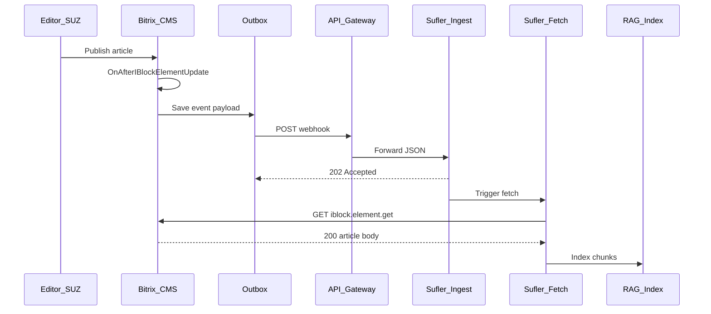

---

### INT-02. Сохранение черновика (без индексации КЦ)

**UC:** UC-A3

#### 1. Сценарий

Редактор **сохранил черновик**, не публикуя. Bitrix шлёт `article.updated` с `status=draft`; production-индекс суфлёра **не** меняется.

#### 2. Матрица §4.2 по сценарию

| № | Требование | Штатный механизм | Доработка Bitrix |
|---|------------|------------------|------------------|
| 6 | Изменение элемента | `OnAfterIBlockElementUpdate` | Обработчик, не путать с publish |
| 7 | Push | Нет | POST webhook |
| 8 | Outbox | Нет | Запись + доставка |
| 9 | event_id | Нет | UUID |
| 10 | Статус | `ACTIVE=N` / workflow | **`status: draft`**, `is_current: false` |
| 12 | changed_fields | Нет | Список изменённых полей |
| 18 | Защита | — | HMAC исходящего POST |

#### 3. Форматы запроса и ответа

`POST /api/v1/knowledge/events` — те же заголовки, что **INT-01**. Обязательны: `event_id`, `event_type`=`article.updated`, `status`=`draft`, `is_current`=false, `article_id`, `iblock_id`, `checksum` (рекомендуется).

**Ответ:** **INT-07** (`202` / ошибки).

#### 4. Коды ответов и ошибок

Как **INT-01** / **INT-07**. Ошибка `400`, если передан `status: published` при операции черновика (валидация на стороне суфлёра — уточнить на **§9.2**).

#### 5. Пример тела запроса

```json
{
  "event_id": "7c9e6679-7425-40de-944b-e07fc1f90ae7",
  "event_type": "article.updated",
  "occurred_at": "2026-05-27T15:10:00+03:00",
  "article_id": 12845,
  "iblock_id": 42,
  "status": "draft",
  "is_current": false,
  "checksum": "sha256:ab12…",
  "changed_fields": ["DETAIL_TEXT"]
}
```

**Контекст суфлёра:** аудит/журнал; **без** GET и без RAG.

#### 6. Диаграмма последовательности

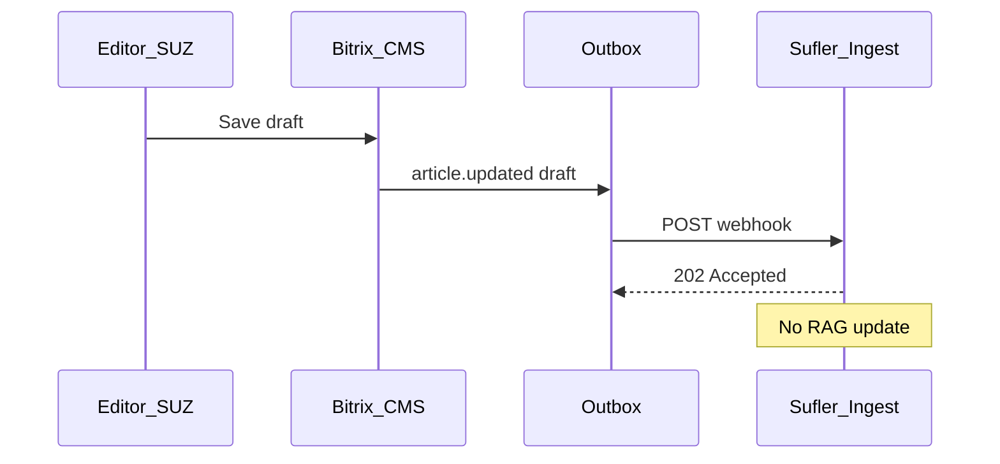

---

### INT-03. Снятие с публикации

**UC:** UC-A6

#### 1. Сценарий

Статья **снята с публикации** (`ACTIVE=N` / архив). Операторы КЦ не должны видеть её в подсказках.

#### 2. Матрица §4.2 по сценарию

| № | Требование | Штатный механизм | Доработка Bitrix |
|---|------------|------------------|------------------|
| 6 | Update | `OnAfterIBlockElementUpdate` | `event_type: article.unpublished` |
| 7–9 | Push, outbox, UUID | Нет | Как INT-01 |
| 10 | Статус | Смена `ACTIVE` | `status: archived`, `is_current: false` |
| 18 | Защита | — | HMAC webhook |

#### 3. Форматы запроса и ответа

`POST` webhook; `event_type` = `article.unpublished`. Минимум: `event_id`, `occurred_at`, `article_id`, `iblock_id`, `status`, `is_current`.

**Ответ:** **INT-07**.

#### 4. Коды ответов и ошибок

Как **INT-07**.

#### 5. Пример тела запроса

```json
{
  "event_id": "b1c2d3e4-f506-7890-abcd-ef1234567890",
  "event_type": "article.unpublished",
  "occurred_at": "2026-05-27T15:45:00+03:00",
  "article_id": 12845,
  "iblock_id": 42,
  "status": "archived",
  "is_current": false
}
```

**Контекст суфлёра:** soft delete в vector store по `article_id`.

#### 6. Диаграмма последовательности

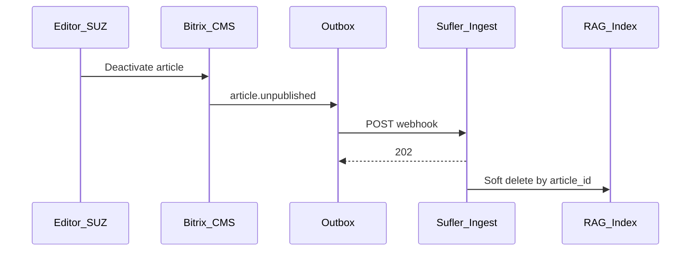

---

### INT-04. Удаление статьи

**UC:** UC-A7

#### 1. Сценарий

Элемент инфоблока **удалён** в СУЗ. Минимальный webhook; индекс суфлёра очищается полностью.

#### 2. Матрица §4.2 по сценарию

| № | Требование | Штатный механизм | Доработка Bitrix |
|---|------------|------------------|------------------|
| 6 | Удаление | `OnAfterIBlockElementDelete` | `article.deleted`, минимальный payload |
| 7–9 | Push, outbox, UUID | Нет | Модуль sync |
| 18 | Защита | — | HMAC |

#### 3. Форматы запроса и ответа

`POST`; `event_type` = `article.deleted`. Обязательны: `event_id`, `occurred_at`, `article_id`, `iblock_id`.

#### 4. Коды ответов и ошибок

Как **INT-07**. `404` на последующий GET — норма (**INT-06**).

#### 5. Пример тела запроса

```json
{
  "event_id": "a3bb189e-8bf9-3888-9912-ace4e6543002",
  "event_type": "article.deleted",
  "occurred_at": "2026-05-27T16:00:00+03:00",
  "article_id": 9912,
  "iblock_id": 42
}
```

**Контекст суфлёра:** hard delete векторов.

#### 6. Диаграмма последовательности

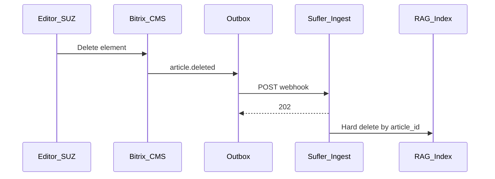

---

### INT-05. Публикация новой версии статьи

**UC:** UC-A4 · **Цепочка:** как **INT-01** + **INT-06**.

#### 1. Сценарий

Утверждена **новая редакция** (workflow / история элемента). В RAG одна текущая версия; старые векторы по `version_id` снимаются.

#### 2. Матрица §4.2 по сценарию

| № | Требование | Штатный механизм | Доработка Bitrix |
|---|------------|------------------|------------------|
| 6–9 | События, push, outbox | События ядра | Как INT-01 |
| 11 | Версии | История элемента (опц.) | Новый `version_id`, `version_number++`, `is_current: true` |
| 12 | Поля | Нет | `changed_fields` |
| 14–15 | permalink, checksum | Частично / нет | Как INT-01 |
| 18–19 | ИБ, журнал | — | Модуль |

#### 3. Форматы запроса и ответа

Webhook — как **INT-01**, `event_type` = `article.version_published`, новые `version_id` / `version_number`. Ответ — **INT-07**; затем **INT-06**.

#### 4. Коды ответов и ошибок

Как **INT-01** + **INT-06** (в т.ч. `404` если элемент удалён mid-flight).

#### 5. Пример тела запроса

Как **INT-01**, с `"version_number": 7`, `"version_id": "hist-99001"`.

**Контекст суфлёра:** переиндексация; удаление векторов предыдущего `version_id`.

#### 6. Диаграмма последовательности

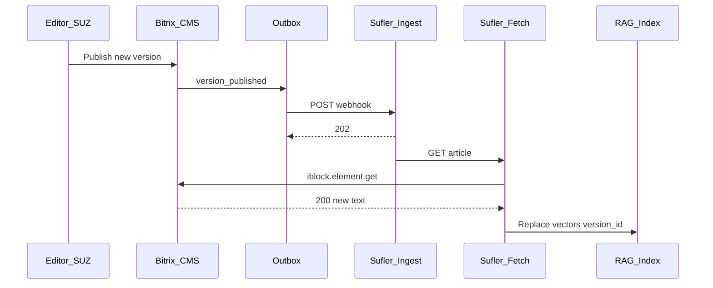

---

### INT-06. Догрузка текста статьи (GET)

**Вызывается из:** INT-01, INT-05 · **UC:** — (технический)

#### 1. Сценарий

Суфлёр после webhook запрашивает у Bitrix **полный текст** и свойства для индексации.

#### 2. Матрица §4.2 по сценарию

| № | Требование | Штатный механизм | Доработка Bitrix |
|---|------------|------------------|------------------|
| 1 | Список статей | `iblock.element.list` | Регламент `IBLOCK_ID`, токен |
| 2 | Одна статья | `iblock.element.get`, `getproperty` | Маппинг в контракт (`body_plain`, `product_codes`, …) |
| 3 | Разделы | `iblock.section.*` | Whitelist разделов КЦ |
| 4 | Вложения | Файлы инфоблока | URL файлов / v1 scope |
| 18 | Защита | OAuth REST | Сервисный пользователь read-only |

#### 3. Форматы запроса и ответа

**Входящий запрос (суфлёр → Bitrix)**

| Вариант | Метод / URL |
|---------|-------------|
| Штатный | `GET /rest/iblock.element.get?ID={id}&IBLOCK_ID={iblock_id}` |
| Custom | `GET /local/api/sufler/v1/articles/{id}` |

Заголовок: `Authorization: Bearer {service_token}`.

**Ответ 200 — поля**

| Поле | Тип | Обяз. |
|------|-----|------|
| `article_id`, `iblock_id`, `version_id` | — | да |
| `title`, `preview`, `body_html`, `body_plain` | string | да* |
| `status`, `locale`, `visibility_scope`, `product_codes`, `updated_at` | — | да |

#### 4. Коды ответов и ошибок

| HTTP | Условие | Действие суфлёра |
|------|---------|------------------|
| 200 | Статья найдена | Индексация |
| 404 | Удалена / нет доступа | Hard delete в индексе |
| 401/403 | Токен | Алерт, retry позже |
| 500 | Ошибка CMS | Retry с backoff |

#### 5. Пример тела запроса

```http
GET /rest/iblock.element.get?ID=12845&IBLOCK_ID=42 HTTP/1.1
Authorization: Bearer {service_token}
```

**Пример ответа 200:**

```json
{
  "article_id": 12845,
  "iblock_id": 42,
  "version_id": "hist-92831",
  "title": "Комиссия за перевод",
  "preview": "Краткая выдержка…",
  "body_html": "<p>Текст DETAIL_TEXT…</p>",
  "body_plain": "Текст без HTML…",
  "status": "published",
  "locale": "ru",
  "visibility_scope": ["kc_operator"],
  "product_codes": ["payments"],
  "updated_at": "2026-05-27T14:32:01+03:00"
}
```

**Контекст суфлёра:** чанкинг и эмбеддинги.

#### 6. Диаграмма последовательности

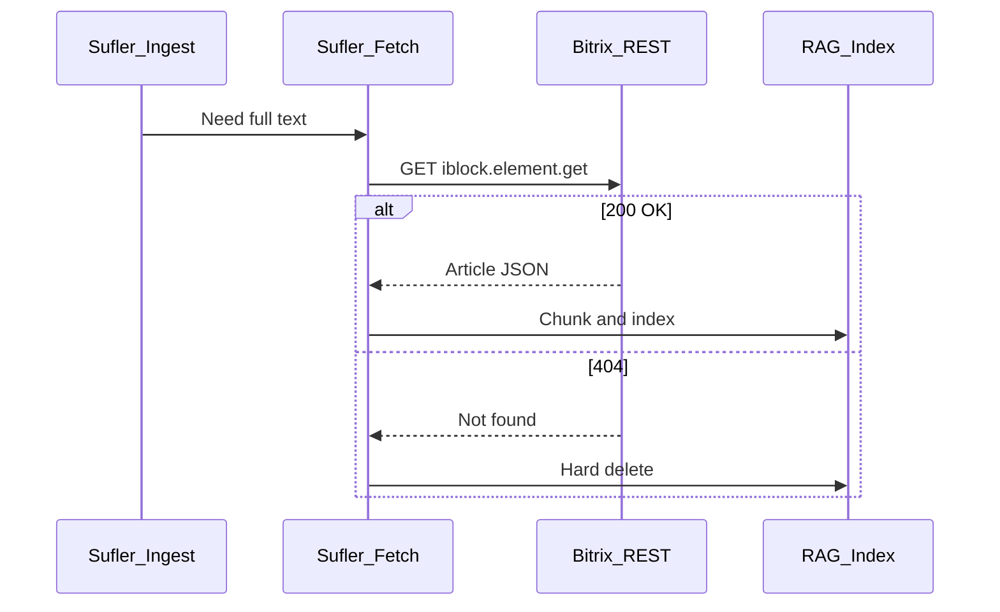

---

### INT-07. Приём webhook: успех, валидация, дубликат

**UC:** UC-D3 · **Относится к:** INT-01…05, 08

#### 1. Сценарий

Bitrix отправил POST; суфлёр возвращает код и JSON. Bitrix обновляет статус **outbox** (не путать с HTTP-кодом записи в журнале CMS).

#### 2. Матрица §4.2 по сценарию

| № | Требование | Штатный механизм | Доработка Bitrix |
|---|------------|------------------|------------------|
| 7 | Исходящий HTTP | curl / HttpClient | Парсинг ответа, корреляция `event_id` |
| 8 | Outbox | Нет | Переходы `pending` / `sent` / `failed` |
| 19 | Инциденты | Общие логи | Отображение ошибки в админке модуля |

#### 3. Форматы запроса и ответа

**Запрос:** тело из INT-01…05 (Bitrix → суфлёр).

**Ответ (суфлёр → Bitrix)** — `Content-Type: application/json`:

| Поле | При `status` | Описание |
|------|--------------|----------|
| `status` | `accepted` / `duplicate` | Успех |
| `event_id` | UUID | Эхо запроса |
| `error` | `validation` / `auth` / `temporary` | Ошибка |
| `fields` | string[] | При validation |

#### 4. Коды ответов и ошибок

| HTTP | Пример тела | Действие Bitrix |
|------|-------------|-----------------|
| 202 | `{"status":"accepted","event_id":"…"}` | outbox → `sent` |
| 200 | `{"status":"duplicate","event_id":"…"}` | `sent` (идемпотентность) |
| 400 | `{"error":"validation","fields":["status"]}` | `failed`, **без** retry |
| 401/403 | `{"error":"auth"}` | `failed`, алерт ИБ |
| 503 | `{"error":"temporary"}` | `pending` → **INT-08** |
| timeout | — | `pending` → **INT-08** |

#### 5. Пример тела запроса

Используйте пример **INT-01**; для проверки дубликата — повтор того же `event_id`.

**Контекст суфлёра:** идемпотентность по `event_id`.

#### 6. Диаграмма последовательности

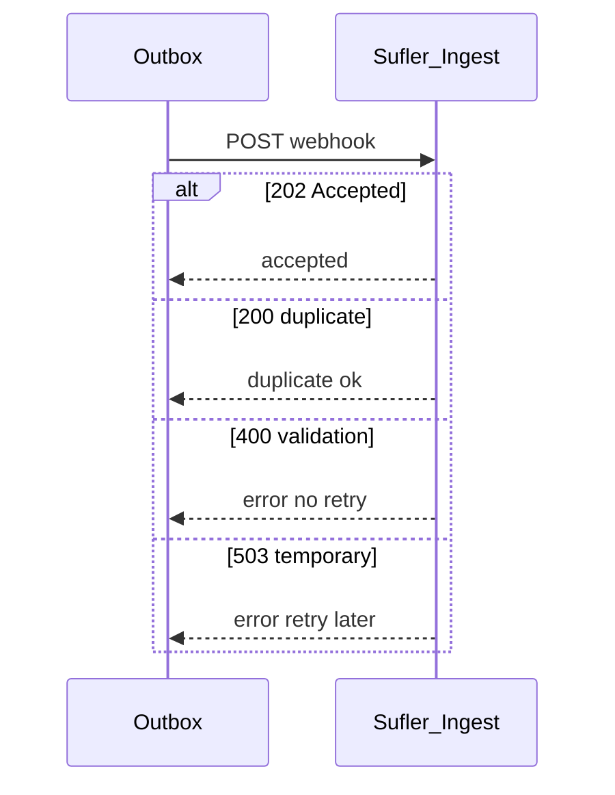

---

### INT-08. Повтор отправки из outbox (retry)

**UC:** UC-D2

#### 1. Сценарий

Первая доставка вернула **503** / timeout. Агент Bitrix повторяет **тот же** POST с тем же `event_id` и телом.

#### 2. Матрица §4.2 по сценарию

| № | Требование | Штатный механизм | Доработка Bitrix |
|---|------------|------------------|------------------|
| 8 | Outbox + retry | Нет | Backoff, лимит попыток |
| 17 | Cron | Агенты 1С-Битрикс | Агент модуля (15 мин) |
| 19 | Журнал | — | Replay / просмотр в админке |

#### 3. Форматы запроса и ответа

Идентичны исходному событию (INT-01…05). Заголовок `X-Sufler-Event-Id` **не меняется**.

**Ответ:** **INT-07** (`202` или `200 duplicate`).

#### 4. Коды ответов и ошибок

Повтор до `sent` или исчерпания попыток → `failed` + алерт. `400`/`401` — **не** retry.

#### 5. Пример тела запроса

Полная копия JSON первой попытки (см. **INT-01**).

**Контекст суфлёра:** at-least-once; дубликат по `event_id` — OK.

#### 6. Диаграмма последовательности

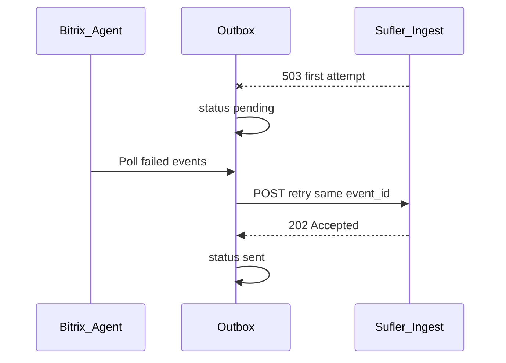

---

### INT-09. Инкремент изменений (fallback)

**UC:** UC-B1

#### 1. Сценарий

Пропущены webhook. Суфлёр (или reconcile-агент) запрашивает **хвост событий** по курсору из outbox.

#### 2. Матрица §4.2 по сценарию

| № | Требование | Штатный механизм | Доработка Bitrix |
|---|------------|------------------|------------------|
| 1 | Список по дате | `iblock.element.list` + `TIMESTAMP_X` | Недостаточно для семантики |
| 16 | Инкремент | Нет журнала интеграции | `GET .../changes?since=&limit=` из outbox |
| 17 | Периодика | Cron | Агент reconciliation |
| 18 | Защита | OAuth | Bearer на custom API |

#### 3. Форматы запроса и ответа

| Параметр | Значение |
|----------|----------|
| Метод | `GET` |
| URL | `/local/api/sufler/v1/changes?since={cursor}&limit=100` |
| Query | `since` ISO-8601, `limit` int ≤100 |

**Ответ 200:** `cursor` (новый), `events[]` — элементы как сокращённый webhook (поля **6.2**).

#### 4. Коды ответов и ошибок

| HTTP | Условие |
|------|---------|
| 200 | Страница событий (может быть `[]`) |
| 400 | Некорректный `since` |
| 401/403 | Токен |
| 500 | Ошибка БД outbox |

#### 5. Пример тела запроса

```http
GET /local/api/sufler/v1/changes?since=2026-05-27T12:00:00%2B03:00&limit=100 HTTP/1.1
Authorization: Bearer {service_token}
```

```json
{
  "cursor": "2026-05-27T16:45:00+03:00",
  "events": [
    {
      "event_id": "550e8400-e29b-41d4-a716-446655440000",
      "event_type": "article.version_published",
      "occurred_at": "2026-05-27T14:32:01+03:00",
      "article_id": 12845,
      "status": "published",
      "checksum": "sha256:9f2c1a…"
    }
  ]
}
```

**Контекст суфлёра:** обработка каждого события как INT-01/03/04/05.

#### 6. Диаграмма последовательности

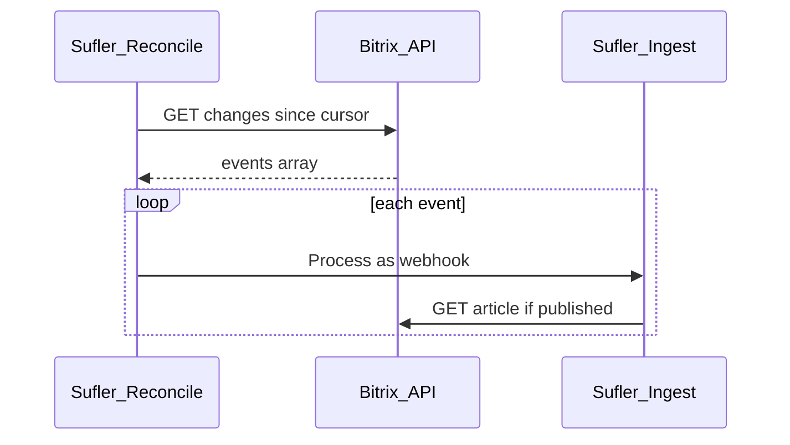

---

### INT-10. Первичная полная загрузка (full load)

**UC:** UC-D1

#### 1. Сценарий

**Внедрение:** массовое наполнение RAG опубликованными статьями scope КЦ; затем включается push INT-01…08.

#### 2. Матрица §4.2 по сценарию

| № | Требование | Штатный механизм | Доработка Bitrix |
|---|------------|------------------|------------------|
| 1 | Список | `iblock.element.list`, пагинация | `IBLOCK_ID`, фильтр `ACTIVE=Y` |
| 2 | Элемент | `iblock.element.get` | Маппинг полей (**INT-06**) |
| 3 | Разделы | `iblock.section.*` | Whitelist КЦ |
| 5 | Initial export | Пакетный list | Документация / опц. batch API |
| 13 | Scope КЦ | Свойства | Фильтр на list |
| 18 | Токен | OAuth REST | Сервисная учётка |
| 20 | Тестовый стенд | Отдельный контур | Тестовый `IBLOCK_ID` / webhook URL |

#### 3. Форматы запроса и ответа

| Шаг | Метод | Назначение |
|-----|-------|------------|
| 1 | `GET iblock.element.list` | Страница ID |
| 2 | `GET iblock.element.get` | Тело каждой статьи (**INT-06**) |

Query: `IBLOCK_ID`, `ACTIVE=Y`, `start` (пагинация Bitrix REST).

**Ответ list:** массив элементов/ID по документации REST; ошибки как **INT-06**.

#### 4. Коды ответов и ошибок

| HTTP | Условие |
|------|---------|
| 200 | Страница list / get |
| 403 | Нет прав на инфоблок |
| 500 | Ошибка CMS — retry страницы |

#### 5. Пример тела запроса

```http
GET /rest/iblock.element.list?IBLOCK_ID=42&ACTIVE=Y&start=0 HTTP/1.1
Authorization: Bearer {service_token}
```

Далее для каждого `ID` — запрос из **INT-06**.

**Контекст суфлёра:** mass index; после — режим событий.

#### 6. Диаграмма последовательности

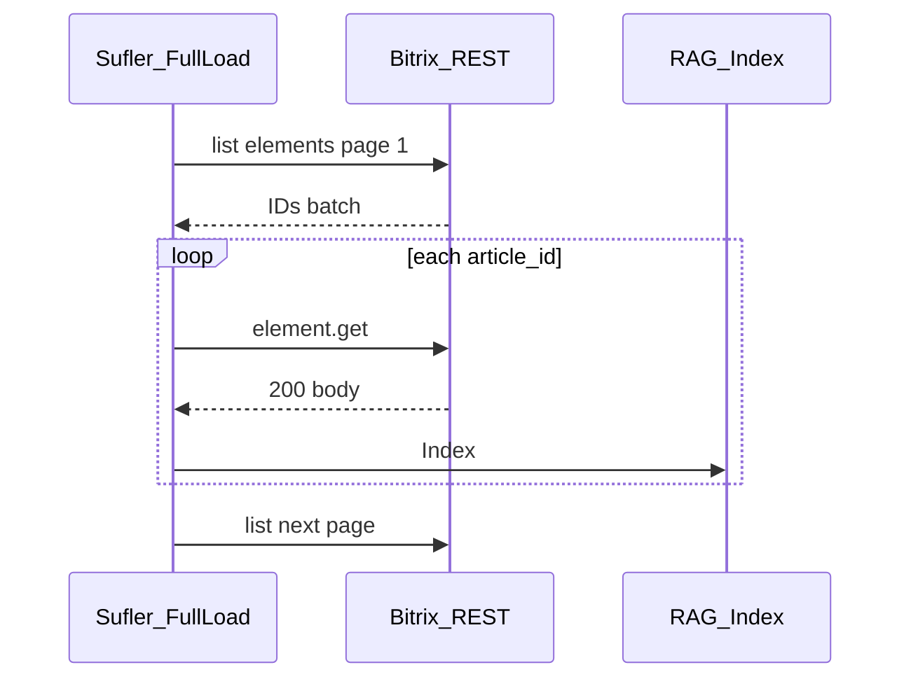

---

### 6.3. Версия контракта

| Версия | Статус |
|--------|--------|
| **v0.1** | Черновик плана; placeholder URL и `iblock_id=42` |
| **v1.0** | После **§9.2**: JSON Schema + согласование ИБ + тестовый стенд |

**Для разработчиков Bitrix (§4):** реализовать все сценарии **MVP=Да** из таблицы **6.1**; отклонения — только по протоколу с Исполнителем.
## 7. Данные для RAG: что забираем из инфоблока

Зафиксировать в ТЗ **конкретные ID инфоблоков и коды свойств** (после обследования — шаг 1 плана ниже).


| Сущность   | Поля (типовой набор)                                 | Зачем                                    |
| ---------- | ---------------------------------------------------- | ---------------------------------------- |
| Статья     | `NAME`, `PREVIEW_TEXT`, `DETAIL_TEXT` (HTML→текст)   | Тело для чанкинга                        |
| Метаданные | теги, продукт, тема КЦ, приоритет, дата актуальности | Фильтры retrieval                        |
| Раздел     | дерево разделов, код раздела                         | Scope и навигация оператору              |
| Версия     | `version_id`, автор, дата публикации                 | Трассировка «какая редакция в подсказке» |
| ACL        | группы AD / роли Битрикс                             | Не индексировать «не для КЦ»             |
| Вложения   | PDF/DOC (опционально v2)                             | OCR/парсинг — отдельная итерация         |


**Нормализация на стороне суфлёра (не Битрикс):** очистка HTML, единые заголовки, разбиение на чанки с `article_id` + `version_id` + `chunk_index` в метаданных вектора.

**Связь с бизнес-правилами:** в retrieval только `status=published` и `is_current=true`; при `article.updated` без публикации — не трогать production-индекс.

---

## 8. Пользовательские сценарии (раздел ТЗ для Битрикс и приёмки)

> **Техническая спецификация обмена** (запрос/ответ, Bitrix vs штатное API, диаграммы) — **§6 (INT-01…INT-10)**.  
> Ниже — **бизнес-сценарии** приёмки (редактор СУЗ, оператор КЦ).

**Роли в сценариях:**


| Роль                      | Кто                                   | Действия в Битрикс                                                      |
| ------------------------- | ------------------------------------- | ----------------------------------------------------------------------- |
| **Редактор СУЗ**          | владелец контента, методолог, продукт | создаёт, правит, публикует, снимает с публикации, удаляет статьи        |
| **Согласующий**           | юристы/комплаенс (если есть workflow) | утверждает версию перед публикацией                                     |
| **Оператор КЦ**           | линия телефонии/чат                   | **не редактирует** СУЗ; получает подсказки суфлёра со ссылкой на статью |
| **Администратор Битрикс** | техподдержка CMS                      | массовые операции, права, разделы                                       |


Ниже — сценарии для включения в ТЗ как **Приложение: матрица сценариев** (каждый = тест-кейс приёмки).

### 8.1. Жизненный цикл статьи (редактор СУЗ)

#### UC-A1. Создание и первая публикация статьи


| Шаг | Действие редактора                                     | Ожидание в Битрикс           | Событие                                           | Ожидание в RAG                                                |
| --- | ------------------------------------------------------ | ---------------------------- | ------------------------------------------------- | ------------------------------------------------------------- |
| 1   | Создаёт элемент инфоблока, заполняет заголовок и текст | Элемент в статусе «черновик» | **Нет** события для суфлёра                       | Индекс не меняется                                            |
| 2   | Нажимает «Опубликовать» / активирует элемент           | `ACTIVE=Y`, видимость для КЦ | `article.created` или `article.version_published` | Полная индексация; в поиске КЦ появляется через SLA (< 2 мин) |
| 3   | Оператор КЦ задаёт вопрос по теме статьи               | —                            | —                                                 | Суфлёр цитирует статью, `permalink` ведёт в СУЗ               |


**Критерий приёмки:** после п.2 статья находится retrieval-ом; в логе outbox — одна успешная отправка с `is_current=true`.

---

#### UC-A2. Редактирование опубликованной статьи (точечное изменение)


| Шаг | Действие                                          | Ожидание в Битрикс  | Событие                                              | Ожидание в RAG                                                               |
| --- | ------------------------------------------------- | ------------------- | ---------------------------------------------------- | ---------------------------------------------------------------------------- |
| 1   | Меняет абзац в `DETAIL_TEXT` (тариф, срок, сумма) | Сохранение элемента | `article.updated`, `changed_fields: ["DETAIL_TEXT"]` | Переиндексация только изменённых чанков; старые векторы этой версии заменены |
| 2   | Меняет только тег «продукт» в свойстве            | —                   | `changed_fields: ["PROPERTY_PRODUCT"]`               | Обновление метаданных, без полного re-chunk при неизменном тексте            |
| 3   | Оператор КЦ через 5 мин консультирует клиента     | —                   | —                                                    | Подсказка содержит **новую** цифру/формулировку                              |


**Критерий приёмки:** `checksum` в payload изменился; дублирующая отправка с тем же `checksum` не вызывает повторную переиндексацию (идемпотентность).

---

#### UC-A3. Черновик без публикации


| Шаг | Действие                                    | Событие                           | RAG                                                |
| --- | ------------------------------------------- | --------------------------------- | -------------------------------------------------- |
| 1   | Редактор сохраняет правки, **не** публикует | `article.updated`, `status=draft` | **Production-индекс не меняется**                  |
| 2   | Оператор КЦ работает в это время            | —                                 | В подсказках — **последняя опубликованная** версия |


**Критерий приёмки:** webhook может уходить (для аудита), но в ТЗ явно: суфлёр игнорирует неопубликованные версии в retrieval.

---

#### UC-A4. Новая версия статьи (версионность)


| Шаг | Действие                                                      | Событие                                                             | RAG                                                                                   |
| --- | ------------------------------------------------------------- | ------------------------------------------------------------------- | ------------------------------------------------------------------------------------- |
| 1   | Редактор создаёт новую редакцию (история элемента / workflow) | —                                                                   | Старая версия остаётся `is_current=true` до публикации                                |
| 2   | Согласующий утверждает, версия публикуется                    | `article.version_published`, новый `version_id`, `version_number+1` | Новые векторы; **удаление** векторов предыдущего `version_id` для этой статьи         |
| 3   | Оператор открывает ссылку из вчерашней подсказки              | URL статьи стабилен                                                 | Отображается **актуальная** версия в СУЗ; в метаданных подсказки — новый `version_id` |


**Критерий приёмки:** в индексе ровно одна текущая версия на `article_id`; история версий в RAG не хранится (только current), если иное не согласовано с ИБ.

---

#### UC-A5. Откат к предыдущей версии


| Шаг | Действие                                                       | Событие                                                        | RAG                                                  |
| --- | -------------------------------------------------------------- | -------------------------------------------------------------- | ---------------------------------------------------- |
| 1   | Редактор восстанавливает прошлую версию из истории как текущую | `article.version_published`, `version_id` = ID восстановленной | Переиндексация; контент снова как в откатной версии  |
| 2   | Оператор получает подсказку                                    | —                                                              | Текст совпадает с откатной редакцией, не с ошибочной |


**Критерий приёмки:** событие содержит корректный `version_id` восстановленной записи, не дублирует «пустое» обновление.

---

#### UC-A6. Снятие с публикации (без удаления)


| Шаг | Действие                                                          | Событие               | RAG                                                                                             |
| --- | ----------------------------------------------------------------- | --------------------- | ----------------------------------------------------------------------------------------------- |
| 1   | Редактор деактивирует статью (`ACTIVE=N`) или переводит в «архив» | `article.unpublished` | Статья **исключается** из retrieval (soft delete), векторы помечены неактивными                 |
| 2   | Оператор спрашивает по устаревшей теме                            | —                     | Суфлёр **не** предлагает эту статью; fallback — другие статьи или «нет актуальной статьи в СУЗ» |


**Критерий приёмки:** после unpublish статья не возвращается в top-k поиска; при повторной публикации — `article.version_published`, статья снова в индексе.

---

#### UC-A7. Удаление статьи


| Шаг | Действие                                               | Событие              | RAG                                     |
| --- | ------------------------------------------------------ | -------------------- | --------------------------------------- |
| 1   | Редактор удаляет элемент инфоблока                     | `article.deleted`    | Hard delete всех чанков по `article_id` |
| 2   | Оператор переходит по старой ссылке из истории диалога | 404 / редирект в СУЗ | Суфлёр не цитирует удалённую статью     |


**Критерий приёмки:** удаление идемпотентно — повторный `article.deleted` не вызывает ошибок.

---

#### UC-A8. Перенос статьи в другой раздел


| Шаг | Действие                                               | Событие                             | RAG                                                   |
| --- | ------------------------------------------------------ | ----------------------------------- | ----------------------------------------------------- |
| 1   | Редактор меняет раздел (например, «Карты» → «Платежи») | `section.moved`, `section_id` новый | Обновление метаданных; фильтры по разделу в retrieval |
| 2   | В новом разделе статья **не для КЦ** (см. UC-A9)       | доп. проверка `visibility_scope`    | Индекс КЦ обновляется по правилам scope               |


---

#### UC-A9. Изменение доступности для КЦ (ACL / свойство «аудитория»)


| Шаг | Действие                              | Событие                                                   | RAG                                            |
| --- | ------------------------------------- | --------------------------------------------------------- | ---------------------------------------------- |
| 1   | Снимают флаг «доступно операторам КЦ» | `article.updated`, `changed_fields: ["visibility_scope"]` | Статья убирается из индекса КЦ (как unpublish) |
| 2   | Добавляют флаг обратно                | `article.updated` + publish                               | Статья снова в индексе                         |


**Критерий приёмки:** payload всегда содержит актуальный `visibility_scope`; суфлёр не показывает внутренние статьи для юристов/филиалов оператору КЦ.

---

#### UC-A10. Замена вложения (PDF, регламент)


| Шаг | Действие                              | Событие                            | RAG                                                                 |
| --- | ------------------------------------- | ---------------------------------- | ------------------------------------------------------------------- |
| 1   | Редактор загружает новый PDF к статье | `attachment.changed`               | Если вложения в scope v2 — переиндексация; в MVP — опционально      |
| 2   | Текст статьи не менялся               | `changed_fields` без `DETAIL_TEXT` | Поведение зафиксировать в ТЗ (индексировать файл или только ссылку) |


---

### 8.2. Массовые и пиковые сценарии (несколько изменений в день)

#### UC-B1. Массовое обновление тарифов (50+ статей за день)


| Шаг | Контекст                                          | Ожидание в Битрикс                   | RAG                                                          |
| --- | ------------------------------------------------- | ------------------------------------ | ------------------------------------------------------------ |
| 1   | Редактор/скрипт импорта обновляет пакет элементов | N событий `article.updated` в outbox | Очередь суфлёра обрабатывает без потерь; порядок не критичен |
| 2   | Часть отправок временно недоступна (5xx)          | Retry из outbox                      | Агент сверки через 15 мин догоняет пропуски                  |
| 3   | К концу дня операторы на линии                    | —                                    | Нет систематических «устаревших тарифов» в подсказках        |


**Критерий приёмки:** outbox не теряет события при 100 последовательных update; мониторинг lag < согласованного SLA.

---

#### UC-B2. Быстрая ошибочная правка и исправление (в тот же день)


| Шаг | Действие                                   | RAG                                                                                 |
| --- | ------------------------------------------ | ----------------------------------------------------------------------------------- |
| 1   | Опубликовали неверную сумму                | В индексе неверный текст 1–2 мин                                                    |
| 2   | Исправили и переопубликовали               | `checksum` меняется → переиндексация                                                |
| 3   | Оператор, получивший подсказку между 1 и 2 | Бизнес-процесс: оператор **проверяет** цифру в СУЗ (не полагается только на суфлёр) |


Сценарий фиксирует **ограничение системы**: минимальное окно рассинхрона при частых правках.

---

### 8.3. Сценарии оператора КЦ (потребитель контента, не автор)

#### UC-C1. Оператор получает подсказку со ссылкой на СУЗ


| Шаг | Действие                                | Ожидание                                                      |
| --- | --------------------------------------- | ------------------------------------------------------------- |
| 1   | Клиент спрашивает про комиссию перевода | Суфлёр даёт выдержку + **ссылку для оператора** (`permalink`) |
| 2   | Оператор открывает ссылку               | Открывается актуальная статья в СУЗ (текущая `version_id`)    |
| 3   | В чат клиенту                           | **Ссылка не отправляется** (требование Прил. 1)               |


---

#### UC-C2. Статья обновилась во время смены оператора


| Шаг | Контекст                                                | Ожидание                                                   |
| --- | ------------------------------------------------------- | ---------------------------------------------------------- |
| 1   | Утром редактор обновил регламент                        | RAG обновлён к 10:00                                       |
| 2   | Оператор в 15:00 консультирует по теме                  | Подсказка по **новому** тексту                             |
| 3   | В истории диалога вчерашняя подсказка со старой цитатой | Новый запрос — новая цитата; старые логи не переписываются |


---

#### UC-C3. Статья снята с публикации — оператор на линии


| Шаг | Контекст                                     | Ожидание                                         |
| --- | -------------------------------------------- | ------------------------------------------------ |
| 1   | Продукт снят с обслуживания, статья в архиве | Суфлёр не предлагает архивную статью             |
| 2   | Оператор вручную ищет в СУЗ                  | Видит статус «неактивна» / архив                 |
| 3   | Эскалация                                    | Маршрут на продукт/вторую линию по регламенту КЦ |


---

#### UC-C4. Оператор помечает «подсказка неполная / неверная»


| Шаг | Действие                                       | Связь с СУЗ                                                                      |
| --- | ---------------------------------------------- | -------------------------------------------------------------------------------- |
| 1   | Оператор жмёт «неполный ответ» в АРМ (Прил. 1) | В логе суфлёра: `article_id`, `version_id`, запрос                               |
| 2   | Аналитик КЦ/владелец СУЗ разбирает             | При системной ошибке — тикет **редактору СУЗ**; при устаревании — сценарий UC-A2 |


*Разработчик Битрикс не реализует UI суфлёра, но в ТЗ указывается: события должны позволять **трассировку** «какая версия статьи была в индексе в момент подсказки».*

---

### 8.4. Служебные сценарии (админ, сбои)

#### UC-D1. Первичная загрузка базы при внедрении


| Шаг | Действие               | Ожидание                                                  |
| --- | ---------------------- | --------------------------------------------------------- |
| 1   | Запуск job full sync   | REST/выгрузка всех `published` + scope КЦ                 |
| 2   | Импорт 10 000 статей   | Без ручных webhook; по завершении — cursor для инкремента |
| 3   | Включение push-событий | Дальнейшие изменения только через UC-A*                   |


---

#### UC-D2. Потеря связи суфлёр ↔ Битрикс


| Шаг | Событие             | Ожидание                                             |
| --- | ------------------- | ---------------------------------------------------- |
| 1   | Webhook 5xx 1 час   | Outbox копит, retry                                  |
| 2   | Связь восстановлена | Догоняющая отправка; reconciliation сверяет checksum |
| 3   | Операторы           | Возможна задержка актуальности; алерт админам        |


---

#### UC-D3. Дублирующее событие (at-least-once)


| Шаг | Условие                                                | Ожидание                             |
| --- | ------------------------------------------------------ | ------------------------------------ |
| 1   | Одно и то же `event_id` пришло дважды                  | Суфлёр обрабатывает один раз         |
| 2   | Два события с разным `event_id`, одинаковый `checksum` | Вторая переиндексация не выполняется |


---

### 8.5. Матрица «бизнес UC → технический INT» (для тест-плана)

| UC (бизнес) | Технический сценарий (§6) |
|-------------|---------------------------|
| UC-A1 | **INT-01**, **INT-06** |
| UC-A3 | **INT-02** |
| UC-A4 | **INT-05**, **INT-06** |
| UC-A6 | **INT-03** |
| UC-A7 | **INT-04** |
| UC-B1 | **INT-09** (массово) |
| UC-D1 | **INT-10** |
| UC-D2 | **INT-08**, **INT-07** |

### 8.6. Матрица «сценарий → event_type» (справочно)


| ID     | Сценарий             | event_type                                      | Обязателен в MVP |
| ------ | -------------------- | ----------------------------------------------- | ---------------- |
| UC-A1  | Первая публикация    | `article.created` / `article.version_published` | Да               |
| UC-A2  | Правка текста        | `article.updated`                               | Да               |
| UC-A3  | Черновик             | `article.updated` (draft)                       | Да               |
| UC-A4  | Новая версия         | `article.version_published`                     | Да               |
| UC-A5  | Откат версии         | `article.version_published`                     | Да               |
| UC-A6  | Снятие с публикации  | `article.unpublished`                           | Да               |
| UC-A7  | Удаление             | `article.deleted`                               | Да               |
| UC-A8  | Перенос раздела      | `section.moved`                                 | Да               |
| UC-A9  | Смена scope КЦ       | `article.updated`                               | Да               |
| UC-A10 | Вложение             | `attachment.changed`                            | Нет (v2)         |
| UC-B1  | Массовое обновление  | N × `article.updated`                           | Да               |
| UC-B2  | Ошибка + исправление | 2 × `article.updated`                           | Да               |
| UC-D1  | Full load            | API, не webhook                                 | Да               |
| UC-D2  | Outbox retry         | технический                                     | Да               |
| UC-D3  | Идемпотентность      | технический                                     | Да               |


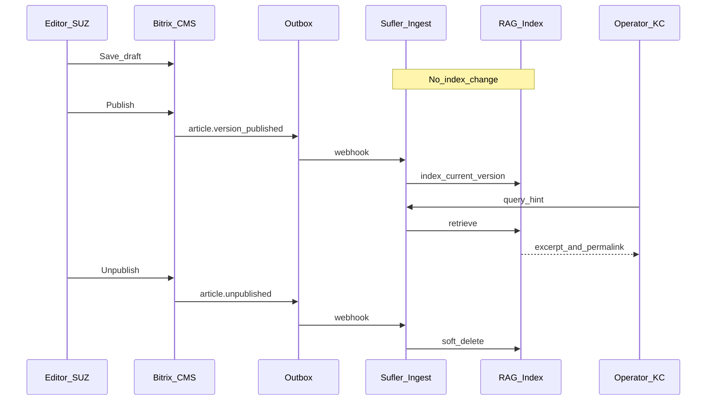


---

## 9. Пошаговый план работ (только планирование)

### 9.1. Этап 0. Входные артефакты (1–2 недели, параллельно встрече №4 «СУЗ» 27.05)

- Карта инфоблоков СУЗ: ID, типы свойств, обязательные поля, статусы публикации.
- Схема версионности: история элементов / workflow / кастомное поле `VERSION`.
- Регламент: какие разделы **в индексе КЦ**, какие **исключены** (комплаенс).
- Версия продукта 1С-Битрикс, редакция (наличие REST), сетевая схема (DMZ, API Gateway).

**Результат:** лист обследования + заполненные placeholder’ы в ТЗ для Битрикс.

### 9.2. Этап 1. Согласование контракта событий (workshop с разработчиком Битрикс)

- Утвердить сценарии **INT-01…INT-10** (§6), JSON-schema (приложение Б к ТЗ).
- Выбрать канал: **webhook primary**, **REST pull fallback**.
- Правила версий: одна «текущая» версия в индексе; старые векторы удалять по `version_id`.
- SLA: задержка доставки события (целевое **< 1–2 мин** при нескольких обновлениях в день).

**Результат:** «Спецификация интеграции СУЗ → Суфлёр v0.1».

### 9.3. Этап 2. ТЗ для разработчика Битрикс (готовый документ для заказчика)

**Основной текст для CMS:** раздел **4. Постановка задачи для разработчиков 1С-Битрикс** (таблица API vs доработка, работы BTX-1…10, приёмка).

Структура полного пакета документов:

1. **Глоссарий** — раздел **1** настоящего плана (обязательно для единого языка с Исполнителем и КЦ).
2. **Постановка задачи** — раздел **4** целиком (главное ТЗ для подрядчика CMS).
3. **Scope** — инфоблок(и) №…, разделы №…, только опубликованный контент для роли КЦ (заполняется после этапа **9.1**).
4. **Детализация реализации** (см. также BTX-1…10 в постановке) — `/local/` или модуль `bank.sufler.sync`:
  - обработчики `OnAfterIBlockElementAdd/Update/Delete`;
  - при включённой истории — обработка публикации новой версии;
  - формирование payload + запись в outbox;
  - HTTP-клиент с retry (3 попытки, exponential backoff);
  - агент сверки каждые 15 мин (`since cursor`).
5. **REST (если доступен):** сервисный пользователь, scope `iblock`, метод выгрузки полного элемента по `article_id` + `version_id` (для восстановления).
6. **Безопасность:** TLS, IP allowlist, подпись, без ПДн в payload (только ID и тех. метаданные; полный текст — по защищённому каналу или отдельным вызовом — согласовать с ИБ).
7. **Логирование:** журнал отправок в админке Битрикс (успех/ошибка, `event_id`).
8. **Пользовательские сценарии:** приложение «Матрица UC-A…UC-D» (см. раздел выше) — каждый сценарий = тест-кейс.
9. **Тесты:** прогон всех сценариев MVP из матрицы на тестовом инфоблоке; отдельно UC-B1 (пакет 50 update).
10. **Приёмка:** чек-лист по сценариям + демо: редактор публикует/правит/снимает/удаляет; оператор КЦ видит актуальную подсказку (на стенде суфлёра).

**Результат:** «ТЗ на доработку 1С-Битрикс (интеграция с СУЗ/RAG)» — приложение к общему ТЗ суфлёра.

### 9.4. Этап 3. Логический модуль на стороне суфлёра (для каркаса и итераций)

Выделить в архитектуре системы отдельные логические модули:


| Модуль                      | Ответственность                                      |
| --------------------------- | ---------------------------------------------------- |
| **Knowledge Ingestion API** | Приём webhook, валидация schema, идемпотентность     |
| **Content Fetcher**         | Догрузка полного текста (если в webhook только diff) |
| **Normalizer**              | HTML→text, язык, структура                           |
| **Chunker**                 | Разбиение с привязкой к `article_id`/`version_id`    |
| **Embedding Worker**        | Очередь на эмбеддинги                                |
| **Vector Store**            | Хранение + метаданные + фильтр по scope КЦ           |
| **Sync State DB**           | Курсор, checksums, статусы статей                    |
| **RAG Retriever**           | Поиск + цитирование `permalink` для оператора        |
| **Reconciliation Job**      | Ночная/часовая сверка с Битрикс                      |


**Итерации внедрения (после утверждения ТЗ):**

1. **MVP:** full load одного инфоблока + ручной webhook-тест.
2. **Events:** все `event_type` + outbox + переиндексация по `changed_fields`.
3. **Versions:** переключение current version, откат векторов.
4. **Hardening:** reconciliation, мониторинг lag, алерты при расхождении checksum.
5. **Optional:** вложения PDF, EN-локаль, ANIS — **вне scope** unless отдельное решение (в Требованиях для КЦ — только СУЗ).

### 9.5. Этап 4. Согласование с владельцем СУЗ и КЦ

Использовать вопросы из [встречи №4 / блок B СУЗ](1d9bda79-331d-4b2e-a62e-7ab1814b29bb): частота обновлений, устаревание vs тарифы, стабильность URL, тестовый контур-копия инфоблока для RAG.

### 9.6. Этап 5. Включение в общее ТЗ суфлёра

Раздел «Интеграция с СУЗ (1С-Битрикс)»: ссылка на спецификацию событий, диаграмма, NFR (задержка индексации, RPO), трассировка «подсказка → `article_id` + `version_id`» для аудита.

---

## 10. Риски и явные допущения

- **REST может быть отключён** в контуре банка — тогда только custom API в `/local/` + файловая выгрузка на fallback (заложить в ТЗ альтернативу B).
- **История инфоблока** может быть выключена — версии хранятся в свойстве; разработчик Битрикс обязан описать фактическую модель.
- **ИБ:** полный текст статей через webhook может потребовать отдельного согласования — на этапе 1 выбрать модель «webhook = сигнал, fetch = защищённый API».

---

## 11. Ближайшие действия команды (без кода)

1. Подготовить **шаблон ТЗ для Битрикс** (разделы из этапа 2) с пустыми ID инфоблоков.
2. На встрече с владельцем СУЗ запросить **экспорт структуры инфоблока** и демо жизненного цикла статьи (черновик → публикация → новая версия).
3. Назначить **ответственного разработчика 1С-Битрикс** со стороны заказчика для согласования JSON-schema.
4. Зафиксировать в реестре решений: **CMS, инфоблоки, push+pull**, версионность через `version_id`.

