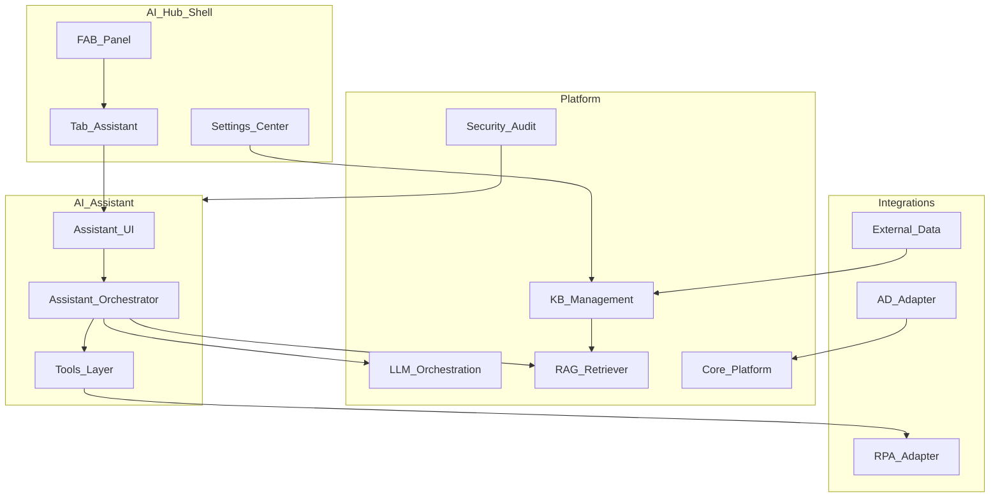
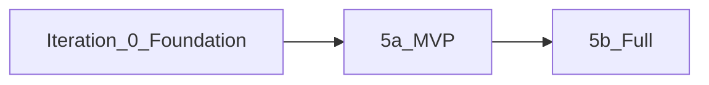

# Дополнение: API и оркестрация модуля «ИИ-ассистент»

**Версия:** v0.2 · **Дата:** 2026-06-08 · **Проект:** Проект по кастомизации и внедрению ПО на базе ИИ · **Заказчик:** ОАО «АСБ Беларусбанк» · **Договор:** № 14-03/2026

**Назначение:** техническое дополнение к [ТЗ контур AI Hub](../ai-hub/tz-ai-hub-contour.md) — детализация **REST API**, оркестрации и контрактов интеграции модуля **ИИ-ассистент**.

**Граница документа:** согласуемое **продуктовое** ТЗ модуля (сценарии, FR, UC, приёмка ASS-T, §5.1–5.2 Прил.1) — в **Части III** [tz-ai-hub-contour.md](../ai-hub/tz-ai-hub-contour.md). Настоящий документ **не дублирует** согласование с заказчиком; описывает API и реализационные детали для команды разработки.

**Связанные документы:**

- [ТЗ контур AI Hub](../ai-hub/tz-ai-hub-contour.md) — оболочка, матрица ролей, сводка по трём модулям
- [AI Hub Panel — макет UI](../../ui/ai-hub-panel-mockup.md)
- [Интеграция СУЗ ↔ RAG](../../integration/suz-bitrix-rag/tz-bitrix-rag-sufler.md) (опциональный источник KB)
- Интерактивные макеты (Cursor Canvas): `ai-assistant-ui-mockup.canvas.tsx`, `ai-hub-panel-mockup.canvas.tsx`

---

## Содержание

0. [Как читать документ](#0-как-читать-документ)
1. [Контекст и цели](#1-контекст-и-цели)
2. [Глоссарий и роли](#2-глоссарий-и-роли)
3. [Состав системы](#3-состав-системы)
4. [Интерфейсы и макеты](#4-интерфейсы-и-макеты)
5. [Пользовательские сценарии (UC-ASS)](#5-пользовательские-сценарии-uc-ass)
6. [Функциональные требования](#6-функциональные-требования)
7. [Настройки модуля](#7-настройки-модуля)
8. [API и оркестрация](#8-api-и-оркестрация)
9. [Интеграции](#9-интеграции)
10. [Нефункциональные требования и ИБ](#10-нефункциональные-требования-и-иб)
11. [Этапность поставки (итерация 5)](#11-этапность-поставки-итерация-5)
12. [Вопросы для согласования с заказчиком](#12-вопросы-для-согласования-с-заказчиком)
13. [Критерии приёмки (ASS-T)](#13-критерии-приёмки-ass-t)
14. [Лист согласования](#14-лист-согласования)

---

## 0. Как читать документ

### 0.1. Легенда маркеров

| Маркер | Значение |
|--------|----------|
| **[Прил.1]** | Требование из Приложения 1 к договору (п. 4.5 и общие разделы) |
| **[Платформа]** | Общий слой ПО (LLM Orchestration, RAG, Core, Security) — в ТЗ только контракт использования |
| **[Исполнитель]** | Реализует Исполнитель в рамках договора |
| **[Заказчик]** | Зона ответственности банка (AD, источники, RPA, ИБ) |
| **[MVP]** | Первая поставка итерации 5a |
| **[5.2]** | Фаза полного охвата (итерация 5b) |

### 0.2. Что не входит в настоящее ТЗ

- Детальная спецификация **платформы LLM/RAG** (отдельный раздел общего ТЗ проекта).
- Модуль **суфлёр** (оператор КЦ) — [ТЗ AI Hub, Часть II](../ai-hub/tz-ai-hub-contour.md#часть-ii-модуль-суфлёр).
- Модуль **OCR/IDP** — [ТЗ AI Hub, Часть IV](../ai-hub/tz-ai-hub-contour.md#часть-iv-модуль-документы-ocridp).
- **Онлайн-чат** (клиенты банка) — [tz-online-chat-platform.md](../../integration/online-chat/tz-online-chat-platform.md).

### 0.3. Как подготовить слайды для заказчика

1. Откройте `ai-assistant-ui-mockup.canvas.tsx` (состояния вкладки «Ассистент») или `ai-hub-panel-mockup.canvas.tsx` (оболочка и RBAC).
2. Переключите нужное состояние UI в Canvas.
3. Сделайте снимок экрана → вставьте изображение в место **Слайд N** ниже (Word, PDF или презентация).

---

## 1. Контекст и цели

### 1.1. Контекст

- По договору Исполнитель поставляет модуль **ИИ-ассистент** — диалоговый интерфейс для **сотрудников банка** с опорой на корпоративные базы знаний и согласованные внешние источники **[Прил.1]**.
- Модуль размещается во вкладке **«Ассистент»** единой панели **AI Hub** (бренд «Беларусбанк AI»): FAB → drawer ~400 px.
- Источники ассистента **шире СУЗ** (в отличие от суфлёра КЦ); production-индекс операторов КЦ **не смешивается** с индексами ассистента.
- Операторы контакт-центра (телефония Oktell, онлайн-чат) **не являются** целевой аудиторией ассистента; при необходимости доступ назначается отдельной AD-ролью.

### 1.2. Цели модуля

| № | Цель |
|---|------|
| 1 | Быстрый доступ сотрудников к **корпоративным знаниям** через диалог |
| 2 | Ответы с **цитированием источников** и показателем релевантности |
| 3 | **Саммаризация** загруженных документов (pdf/docx) |
| 4 | **Генерация** документов по шаблонам (Word/PDF в MVP) |
| 5 | Администрирование KB **без программирования** |
| 6 | Соответствие требованиям ИБ: AD, аудит, изоляция подразделений |

### 1.3. Границы с соседними модулями

| Модуль | Общее | Отличие ассистента |
|--------|-------|-------------------|
| **Суфлёр КЦ** | LLM, RAG | Аудитория — сотрудники back-office; источники шире СУЗ; нет режима «подсказка в диалоге с клиентом» |
| **Внутренний UI КЦ** | Чат + % | Только тест KB для КЦ |
| **Онлайн-чат** | Core | Клиенты банка, очереди — вне scope |
| **OCR/IDP** | LLM post-processing | Отдельный конвейер; ассистент может **читать** структуру полей по API |
| **СУЗ Bitrix** | Может быть одним из KB | Для ассистента СУЗ **не** единственный источник |

### 1.4. Текущее состояние (прототип)

| В репозитории | Целевое |
|---------------|---------|
| `index.html` — «Чат с ИИ-ассистентом» | **Не** целевой UI (демо клиентского канала КЦ) |
| `main.js` → `localhost:8003` | Заменить на Assistant Orchestrator API |
| Django `Client` / `ChatSession` | Модель `EmployeeSession` + subject AD |

---

## 2. Глоссарий и роли

### 2.1. Глоссарий

| Термин | Определение |
|--------|-------------|
| **ИИ-ассистент** | Продуктовый модуль для **сотрудников банка**: диалог с LLM с опорой на корпоративные KB и согласованные внешние источники |
| **AI Hub** | Бренд и контур: FAB, drawer, Центр настроек, три модуля (Ассистент · Документы · Суфлёр) |
| **AI Hub Panel** | Рабочая панель (drawer ~400 px); вкладки отображаются **только по RBAC** (скрытые вкладки не показываются) |
| **Центр настроек AI Hub** | Полноэкранная админка (`/ai-hub/admin` или аналог); пункт ≡ в панели |
| **Сотрудник банка** | Пользователь с учётной записью AD; целевая аудитория ассистента — back-office и смежные подразделения |
| **База знаний (KB)** | Логический корпус документов для RAG; зеркало СУЗ, загруженные файлы, данные адаптеров |
| **Сессия диалога** | Цепочка сообщений user/assistant с сохранением контекста |
| **Источник ответа** | Фрагмент KB с метаданными: название, % релевантности, ссылка на документ |
| **Инструмент (tool)** | Действие поверх чата: генерация документа, RPA, SQL (по политике) |
| **Production-индекс** | Рабочий векторный индекс RAG для операторов КЦ; **отдельно** от индексов ассистента |

### 2.2. Роли и доступ (AD)

Маппинг ролей на группы **Active Directory** — **[Заказчик]**. На тестовом стенде допускаются локальные учётки **[Исполнитель]**.

#### Таблица 1 — доступ к вкладке «Ассистент»

| Роль (Прил. 1) | AD-группа (пример) | Вкладка «Ассистент» | Центр настроек (раздел KB) | Основные действия |
|----------------|-------------------|:-------------------:|:--------------------------:|-------------------|
| **Пользователь ИИ-ассистента** | `BB_AI_Assistant_User` | да | — | Чат, KB, вложения, обратная связь |
| **Администратор баз знаний** | `BB_KB_Admin` | да | да (KB) | + CRUD KB, импорт документов |
| **Администратор подразделения** | `BB_Dept_Admin` | да | scope, лимиты | Персонализация подразделения [5.2] |
| **Внутренний пользователь КЦ** | `BB_CC_Internal_Tester` | да | — | Тест KB (ограниченный scope) |
| **Администратор системы** | `BB_AI_System_Admin` | да | да (все разделы) | Все вкладки панели + админка |
| **Аудитор** | `BB_AI_Auditor` | read-only* | журналы | Просмотр без отправки сообщений (*уточнить с ИБ) |
| **Специалист КЦ Oktell** | `BB_CC_Telephony_Operator` | **по AD** | — | Основная роль — суфлёр в Hub; ассистент только при явном назначении |
| **Оператор онлайн-чата** | `BB_CC_Chat_Operator` | **нет** | — | Суфлёр только в АРМ чата; ассистент не в Hub |
| **Супервизор КЦ** | `BB_CC_Supervisor` | по AD | опц. | Уточнить на воркшопе |

**Согласовано заказчиком:** ☐

#### Таблица 2 — ключевое решение по операторам КЦ

| Роль | Вкладка «Ассистент» в AI Hub | Примечание |
|------|:----------------------------:|------------|
| Сотрудник back-office | **да** (при роли ассистента) | Основная аудитория |
| Специалист КЦ **Oktell** | по AD | По умолчанию — только «Суфлёр» в Hub |
| Оператор **онлайн-чата** | **нет** | Суфлёр в правой колонке АРМ чата |
| Прочие без роли ассистента | **нет** | Вкладка скрыта (не disabled) |

**Согласовано заказчиком:** ☐

### 2.3. Политики доступа

- Без успешной аутентификации AD (или stub на стенде) доступ к API ассистента запрещён.
- Список доступных KB фильтруется по **подразделению** и AD-группам.
- Запрещённые источники не отображаются в UI и не участвуют в retrieval (fail-closed).

---

## 3. Состав системы

---

## 4. Интерфейсы и макеты

**Принцип:** в ТЗ для заказчика — **интерактивные Canvas-макеты** и **слайды** (скриншоты из Canvas).

### 4.1. Где смотреть макет

| Артефакт | Содержание |
|----------|------------|
| **ai-assistant-ui-mockup.canvas.tsx** | Вкладка «Ассистент»: переключатель состояний UI |
| **ai-hub-panel-mockup.canvas.tsx** | Полная панель: FAB, RBAC, три вкладки |
| [ai-hub-panel-mockup.md](../../ui/ai-hub-panel-mockup.md) | Текстовое описание + инструкция |

**Как открыть:** в Cursor откройте файл `.canvas.tsx` — превью отображается справа от чата.

### 4.2. Сводная таблица слайдов

| Слайд | Экран | Canvas / состояние | Согласовано | Замечания |
|-------|-------|-------------------|:-----------:|-----------|
| ASS-1 | Вкладка «Ассистент» — чат с источниками | `ai-assistant-ui` → Чат | ☐ | |
| ASS-2 | Состояния: пустой / стриминг / ошибка | `ai-assistant-ui` → переключатель | ☐ | |
| ASS-3 | Генерация документа (modal) | `ai-assistant-ui` → Генерация doc | ☐ | Word/PDF MVP |
| ASS-4 | Центр настроек — базы знаний | post-MVP / скрин админки | ☐ | |
| ASS-5 | Оболочка AI Hub (контекст вкладки) | `ai-hub-panel` → Демо: Ассистент | ☐ | |

### Слайд ASS-1. Вкладка «Ассистент» — чат с источниками

*[место для слайда ASS-1]*

| Зона | Элементы |
|------|----------|
| Toolbar | Select KB, «+ Новый», «История диалогов» |
| Лента | User / Assistant; блок «Источники (N)» с % |
| Ввод | TextArea, счётчик 500 символов, «Прикрепить», «Инструменты» |
| Обратная связь | Полезно / Неполный / Неверно (tooltip по Прил.1 §5.1.19) |

### Слайд ASS-2. Состояния UI

*[место для слайда ASS-2]*

| Состояние | Элементы | MVP |
|-----------|----------|-----|
| **Чат** | KB, лента, источники, ввод, обратная связь | да |
| **Пустой** | Placeholder «Выберите базу знаний…» | да |
| **Стриминг** | «Ассистент печатает…», «Остановить» | да |
| **Ошибка** | Callout + «Повторить» | да |
| **RPA** | Modal confirm | [5.2] |

### Слайд ASS-3. Генерация документа (modal)

*[место для слайда ASS-3]*

Поток: Инструменты → «Сгенерировать» → шаблон Word/PDF → поля → «Создать черновик» → «Скачать».

### Слайд ASS-4. Центр настроек — базы знаний

*[место для слайда ASS-4]*

| Экран | Роли |
|-------|------|
| CRUD KB, импорт | Администратор баз знаний |
| Реестр адаптеров | Администратор / архитектор |
| Настройки подразделения | Администратор подразделения |

### Слайд ASS-5. Оболочка AI Hub (контекст)

*[место для слайда ASS-5]*

FAB 56×56 px, drawer ~400 px, шапка «Беларусбанк AI», tab bar (только разрешённые вкладки), подвал «KB обновлена». Детали — [ТЗ AI Hub §I.5](../ai-hub/tz-ai-hub-contour.md#i5-оболочка-ai-hub).

### 4.3. Таблица зон и контролов

| Зона | Элементы | Действия | UC |
|------|----------|----------|-----|
| Toolbar | Select KB, «+ Новый», «История» | Смена KB, новая сессия | UC-ASS-01 |
| Лента | User / Assistant bubbles | — | UC-ASS-02 |
| Источники | Pill %, «Открыть», «Копировать» | Переход к фрагменту | UC-ASS-02 |
| Ввод | TextArea, счётчик 500 | Enter / Отправить | FR-ASS-01 |
| Вложения | «Прикрепить» | pdf/docx | UC-ASS-04 |
| Инструменты | Dropdown | Генерация, RPA, SQL | UC-ASS-05…07 |
| Обратная связь | Кнопки под ответом | Оценка качества | UC-ASS-10 |

---

## 5. Пользовательские сценарии (UC-ASS)

| UC | Сценарий | Роль | Слайд | MVP |
|----|----------|------|-------|-----|
| UC-ASS-01 | Вход AD, выбор KB, новый диалог | Пользователь ассистента | ASS-1 | да |
| UC-ASS-02 | Вопрос → ответ с источниками и % | Пользователь ассистента | ASS-1 | да |
| UC-ASS-03 | Комбинированные источники | Пользователь ассистента | ASS-1 | [5.2] |
| UC-ASS-04 | Саммаризация pdf/docx | Пользователь ассистента | ASS-1 | да |
| UC-ASS-05 | Генерация Word/PDF | Пользователь ассистента | ASS-3 | да |
| UC-ASS-06 | Запуск RPA с confirm | Пользователь ассистента | ASS-2 | [5.2] |
| UC-ASS-07 | SQL/код (политика ИБ) | По RBAC | ASS-2 | [5.2] |
| UC-ASS-08 | Админ: CRUD KB | Админ KB | ASS-4 | да |
| UC-ASS-09 | Админ: External Data Adapter | Архитектор | ASS-4 | [5.2] |
| UC-ASS-10 | Обратная связь | Пользователь ассистента | ASS-1 | да |
| UC-ASS-11 | Аудит журнала | Аудитор | — | да |
| UC-ASS-12 | Отказ по ИБ-политике | Пользователь ассистента | ASS-2 | да |
| UC-ASS-N01 | Оператор чата не видит вкладку «Ассистент» | Оператор чата | ASS-5 | да |

### UC-ASS-01 — Вход и выбор KB

**Актор:** сотрудник банка.  
**Предусловия:** AD SSO, роль «Пользователь ИИ-ассистента».  
**Основной поток:** FAB → вкладка «Ассистент» → выбрать KB → начать диалог.  
**Результат:** создана `session_id`, выбран `kb_id`.

**Согласовано заказчиком:** ☐

### UC-ASS-02 — Вопрос по внутренней KB

**Поток:** ввод вопроса → retrieval → ответ с блоком «Источники (N)» и кнопками «Открыть» / «Копировать».  
**Исключение:** низкая релевантность — явное сообщение «Недостаточно данных в выбранной KB».

**Согласовано заказчиком:** ☐

### UC-ASS-03 — Комбинированные источники

**Поток:** запрос использует несколько KB/адаптеров согласно политике подразделения.  
**MVP:** один KB; [5.2] — мультивыбор.

**Согласовано заказчиком:** ☐

### UC-ASS-04 — Саммаризация вложения

**Поток:** «Прикрепить» pdf/docx → отправить с промптом «кратко изложи» → ответ на основе файла.

**Согласовано заказчиком:** ☐

### UC-ASS-05 — Генерация документа

**Поток:** Инструменты → «Сгенерировать» → шаблон Word/PDF → поля → «Создать черновик» → «Скачать».  
**MVP:** Word/PDF.

**Согласовано заказчиком:** ☐

### UC-ASS-06 — Запуск RPA

**Поток:** Инструменты → RPA → confirm → вызов API банка. **[5.2]**

**Согласовано заказчиком:** ☐

### UC-ASS-07 — SQL/код

**Поток:** только при RBAC; предупреждение ИБ; read-only контур. **[5.2]**

**Согласовано заказчиком:** ☐

### UC-ASS-08 — Админ: создание KB

**Актор:** администратор KB. Полноэкранный режим: CRUD, импорт, права AD.

**Согласовано заказчиком:** ☐

### UC-ASS-09 — Админ: подключение источника

**Актор:** администратор / архитектор. Реестр External Data Adapters.

**Согласовано заказчиком:** ☐

### UC-ASS-10 — Обратная связь

**Актор:** пользователь ассистента. **Предусловия:** ответ LLM отображён полностью.

**Поток:**

1. Под ответом — «Полезно» / «Неполный» / «Неверно» (tooltip: «воспользовался» / «неполный ответ» / «не воспользовался» по §5.1.19).
2. Одна оценка на сообщение; повторный выбор заблокирован (MVP).
3. `FeedbackEvent` → Reporting и аудит (ASS-T-14): `session_id`, `message_id`, `feedback_type`, `kb_id`, `source_ids[]`, `relevance_scores[]`.
4. **Неполный:** Callout + chip-уточнения; placeholder «Уточните запрос…»; пользователь отправляет уточняющий turn.
5. **Полезно:** «Спасибо, оценка сохранена». **Неверно:** «Зафиксировано. Можете переформулировать вопрос».

**Согласовано заказчиком:** ☐

### UC-ASS-11 — Аудит

**Актор:** аудитор. Просмотр журнала запросов без изменения данных.

**Согласовано заказчиком:** ☐

### UC-ASS-12 — Отказ по ИБ

**Поток:** запрос к запрещённому источнику → отказ с кодом политики, событие в SIEM.

**Согласовано заказчиком:** ☐

### UC-ASS-N01 — Оператор чата не видит вкладку «Ассистент»

**Актор:** оператор онлайн-чата (`BB_CC_Chat_Operator`).  
**Предусловия:** нет роли «Пользователь ИИ-ассистента».  
**Поток:** открыть AI Hub → вкладка «Ассистент» **отсутствует** в tab bar.  
**Результат:** суфлёр доступен только в АРМ чата (не в Hub).

**Согласовано заказчиком:** ☐

---

## 6. Функциональные требования

Матрица: **ID → требование → сторона → MVP**.

| ID | Требование [Прил.1] | Реализация | MVP |
|----|---------------------|------------|-----|
| FR-ASS-01 | Диалоговый чат с сохранением контекста сессии | [Исполнитель] Orchestrator + Interaction History | да |
| FR-ASS-02 | Несколько баз знаний, выбор пользователем | [Исполнитель] KB API + UI select | да |
| FR-ASS-03 | Ответ с цитированием источников и % релевантности | [Исполнитель] RAG + UI блок «Источники» | да |
| FR-ASS-04 | Внутренние и внешние источники (каталог банка) | [Заказчик] каталог + [Исполнитель] адаптеры | частично MVP |
| FR-ASS-05 | Загрузка файлов (pdf/docx) и саммаризация | [Исполнитель] ingest + LLM | да |
| FR-ASS-06 | Генерация Word/PDF (шаблоны) | [Исполнитель] Tools | Word/PDF MVP |
| FR-ASS-07 | Генерация Excel/PPT/BPMN | [Исполнитель] | [5.2] |
| FR-ASS-08 | RPA-триггеры с подтверждением | [Заказчик] API + [Исполнитель] UI | [5.2] |
| FR-ASS-09 | Работа с кодом/SQL (политика ИБ) | Совместно | [5.2] / dev |
| FR-ASS-10 | Обратная связь по ответам | [Исполнитель] | да |
| FR-ASS-11 | Администрирование KB без программирования | [Исполнитель] | базово MVP |
| FR-ASS-12 | Персонализация по подразделению (промпты, лимиты) | [Исполнитель] | [5.2] |
| FR-ASS-13 | История диалогов, retention 1 год | [Платформа] Interaction History | да |
| FR-ASS-14 | До 2000 одновременных пользователей | [Исполнитель] + инфра [Заказчик] | приёмка §10 |

### 6.1. KPI (Прил. 1)

| Показатель | Целевое значение |
|------------|------------------|
| Длина ответа | ≤ 500 символов (ориентир UI) |
| Время ответа | 1–2 сек (p95 на проме) |
| Галлюцинации | ≤ 3% (методика отчётности платформы) |
| Одновременные пользователи | до 2000 |

---

## 7. Настройки модуля

Три уровня конфигурации (сводка — [ТЗ AI Hub §I.6](../ai-hub/tz-ai-hub-contour.md#i6-администрирование-и-настройки-сводка)).

### 7.1. Рабочий UI (вкладка «Ассистент»)

| Параметр | Кто меняет | Описание |
|----------|------------|----------|
| Выбор KB | Пользователь | Из списка, отфильтрованного по AD |
| Новый диалог | Пользователь | Сброс контекста сессии |
| Прикрепление файла | Пользователь | pdf/docx в рамках сессии |

### 7.2. Центр настроек AI Hub — раздел «Ассистент»

| Параметр | Роль |
|----------|------|
| CRUD KB, импорт документов | Админ KB |
| Scope KB по AD-группам | Админ KB |
| **Промпты ассистента** (`assistant_bank`) | Админ KB — §III.10.1 |
| **Параметры модели LLM** (§3.3) | Админ KB — §III.11.1; профиль `assistant_bank` |
| **Конфигурация LLM** (dashboard 7 слоёв) | Админ KB — §III.11 |
| **Навыки и инструменты** (capabilities) | Админ KB — §III.6.1 |
| Реестр External Data Adapters | Архитектор |
| Шаблоны Word/PDF | Админ KB |
| Лимиты, промпты подразделения | Админ подразделения [5.2] |

System prompt `assistant_bank` — **[Платформа]** Scenarios & Prompts Studio, раздел **«Промпты ассистента»** (3 колонки: библиотека · редактор · preview). Промпты КЦ (`sufler_cc`) — в **«Редакторе сценариев»** (§II.6.1.1).

**Макеты:** [ai-hub-settings-mockup.md](../../ui/ai-hub-settings-mockup.md) · Canvas: `llm_config_assistant`, `model_params`, `prompts_assistant`, `capabilities`.

### 7.3. Платформа и внешние системы

| Параметр | Где |
|----------|-----|
| Модели LLM, квоты | [Платформа] |
| Индексация СУЗ для ассистента | [Заказчик] Bitrix + [Исполнитель] pipeline |
| Группы AD → роли | [Заказчик] AD |

---

## 8. API и оркестрация

**Префикс:** `/api/v1/assistant` · **Аутентификация:** Bearer / SSO cookie (контур банка).

| Метод | Назначение |
|-------|------------|
| `POST /sessions` | Создать сессию (`dept_id`, `kb_ids[]`) |
| `GET /sessions` | Список сессий пользователя |
| `POST /sessions/{id}/messages` | Отправить сообщение (+ `attachments[]`) |
| `GET /sessions/{id}/messages` | История (пагинация) |
| `GET /kb` | Доступные KB (фильтр AD) |
| `POST /tools/generate-document` | Генерация Word/PDF |
| `POST /tools/rpa/trigger` | RPA (confirm token) **[5.2]** |
| `GET /sessions/{id}/stream` | SSE стриминг ответа **[MVP]** |

**Оркестратор:**

- System prompt: `assistant_bank` (отдельно от `sufler_cc`).
- Запрет смешения production-индекса КЦ с индексами ассистента.
- Логирование tool calls в Security & Audit.

---

## 9. Интеграции

| Система | Сторона | Содержание |
|---------|---------|------------|
| **AD** | [Заказчик] | SSO, группы → роли |
| **External Data** | Совместно | Адаптеры: auth, sync, поля для RAG |
| **RPA** | [Заказчик] | Белый список сценариев, API |
| **СУЗ (опционально)** | [Заказчик] | Отдельный индекс `assistant_suz` vs `cc_production` — см. [tz-bitrix-rag-sufler.md](../../integration/suz-bitrix-rag/tz-bitrix-rag-sufler.md) |
| **OCR** | [Исполнитель] | Опционально: `file_id` → поля в чат |
| **SIEM** | [Заказчик] | Экспорт событий ИБ |
| **ЭДО** | [Заказчик] | Выгрузка сгенерированных документов (уточнить) |

---

## 10. Нефункциональные требования и ИБ

| Требование | Описание |
|------------|----------|
| Нагрузка | 2000 concurrent; сценарий приёмки ramp-up |
| Сеть | Inference без исходящего интернета |
| OWASP LLM Top 10 | Prompt injection, утечка между dept, аудит |
| Retention | История 1 год |
| ПДн | Маскирование в логах; права аудитора |
| RBAC | Скрытие вкладки «Ассистент» для ролей без доступа |

---

## 11. Этапность поставки (итерация 5)

**Блокер:** итерация 0 (Core, LLM, RAG, Security).

### DoD 5a (MVP)

- AD (или stub), чат, 2+ KB, RAG с цитатами, саммаризация файла, Word/PDF генерация, админка KB (базово), ASS-T-01…06, ASS-T-UI-01…03, UC-ASS-N01.

### DoD 5b (Full)

- RPA, Excel/PPT/BPMN, внешние адаптеры, SQL policy, ASS-T-07…09.

---

## 12. Вопросы для согласования с заказчиком

1. Каталог **внутренних** источников помимо СУЗ (портал, регламенты, DWH)?
2. Разрешены ли **внешние** источники для ассистента?
3. Владелец **RPA** и перечень сценариев v1?
4. Политика **SQL/код** — блок вопросов **14.1–14.10** для совещания: [ТЗ AI Hub §V.2](../ai-hub/tz-ai-hub-contour.md#совещание-sql--код--банковские-субд) (объём §5.1.39, whitelist СУБД, интерфейс настройки, выбор БД в UI, KB ≠ SQL, ИБ, аудит)
5. Интеграция с **ЭДО** для выгрузки сгенерированных документов?
6. Отдельный индекс **СУЗ для ассистента** vs production КЦ (рекомендуется «да»)?
7. Маппинг **11+ ролей** Прил. 1 на группы AD?
8. FAB на **всех** страницах intranet или только в выбранных приложениях?
9. Нужен ли операторам Oktell доступ к ассистенту **по AD** или только суфлёр?

---

## 13. Критерии приёмки (ASS-T)

| ID | Тест | Ожидание |
|----|------|----------|
| ASS-T-01 | AD-вход пользователя ассистента | 200, список KB по scope |
| ASS-T-02 | Вопрос по KB | Ответ + ≥1 источник с % |
| ASS-T-03 | Чужой dept / KB | 403 или пустой retrieval |
| ASS-T-04 | Вложение pdf | Саммаризация в ответе |
| ASS-T-05 | Генерация Word | Файл скачивается, поля заполнены |
| ASS-T-06 | Обратная связь | Запись в отчётности |
| ASS-T-07 | RPA с confirm | [5.2] |
| ASS-T-08 | Аудит | Журнал содержит session_id, без лишних ПДн |
| ASS-T-09 | Нагрузка smoke | 50 concurrent, p95 ≤ 5 сек на стенде |
| ASS-T-UI-01 | Слайды ASS-1…ASS-3 | Согласованы с заказчиком |
| ASS-T-UI-02 | RBAC: оператор чата | Вкладка «Ассистент» скрыта |
| ASS-T-UI-03 | Блок «Источники» | % и действие «Открыть» |
| ASS-T-UI-04 | RBAC: оператор Oktell без роли ассистента | Вкладка «Ассистент» скрыта; «Суфлёр» видна |

---

## 14. Лист согласования

| Роль | ФИО | Подпись | Дата |
|------|-----|---------|------|
| Заказчик — владелец продукта | | | |
| Заказчик — ИБ | | | |
| Заказчик — КЦ (при необходимости) | | | |
| Исполнитель — руководитель проекта | | | |

---

*Дополнение к [ТЗ контур AI Hub](../ai-hub/tz-ai-hub-contour.md). Продуктовое согласование — в Части III Hub TZ. Версия v0.2.*
