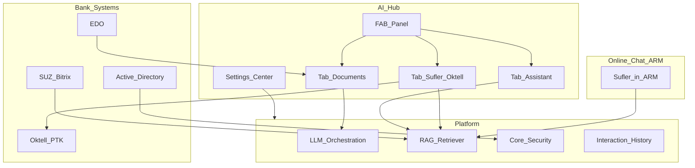
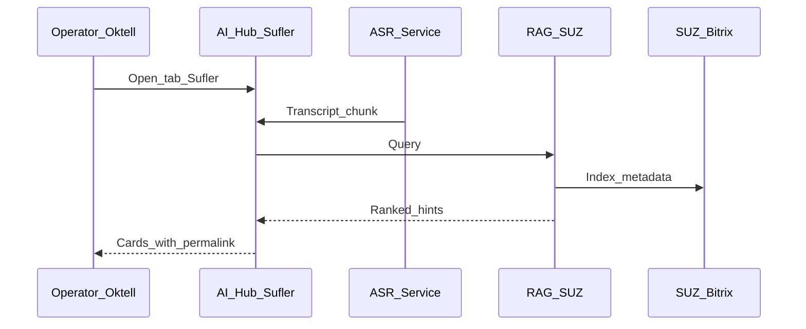
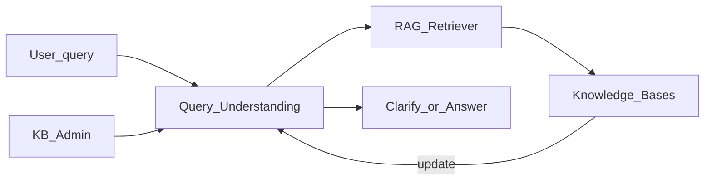

# ТЗ на контур AI Hub (Суфлёр · Ассистент · Документы)

**Версия:** v1.1 · **Дата:** 2026-06-08 · **Проект:** ПО на базе ИИ · **Договор:** № 14-03/2026 · **Заказчик:** ОАО «АСБ Беларусбанк»

**Назначение:** согласуемое проектное ТЗ (этап 1 календарного плана) на контур **AI Hub** — единую оболочку и три продуктовых модуля по **Приложению 1** к договору. Документ для владельцев процессов банка, КЦ (телефония и чат), ИБ и команды Исполнителя.

**Структура:** **Часть I** — общие положения (глоссарий, роли, оболочка). **Части II–IV** — модули «Суфлёр», «Ассистент», «Документы» (каждый: сценарии, макеты, функционал, настройки, приёмка). **Часть V** — поставка, вопросы, сводная приёмка.

**Нормативная база:** содержание — по **Приложению 1** к договору (приоритет); структура дополнена **ГОСТ 34.602-2020** — см. [I.1.1](#i11-соответствие-гост-34602-2020).

**Связанные документы (углубление, без дублирования):**

- [Интеграция СУЗ ↔ RAG](../../integration/suz-bitrix-rag/tz-bitrix-rag-sufler.md)
- [Oktell ↔ суфлёр](../../integration/oktell-sufler-telephony/tz-oktell-sufler-telephony.md)
- [Онлайн-чат (АРМ)](../../integration/online-chat/tz-online-chat-platform.md)
- [ТЗ ИИ-ассистент (API)](../ai-assistant/tz-ai-assistant-belarusbank.md)
- [Макеты UI — панель](../../ui/ai-hub-panel-mockup.md)
- [Макеты UI — Центр настроек](../../ui/ai-hub-settings-mockup.md)

---

## Содержание

### Часть I. Общие положения

- [I.1 Как читать документ](#i1-как-читать-документ)
- [I.1.1 Соответствие ГОСТ 34.602-2020](#i11-соответствие-гост-34602-2020)
- [I.2 Контекст и цели](#i2-контекст-и-цели)
- [I.3 Глоссарий](#i3-глоссарий)
- [I.4 Матрица ролей и вкладок](#i4-матрица-ролей-и-вкладок)
- [I.5 Оболочка AI Hub](#i5-оболочка-ai-hub)
- [I.6 Администрирование и настройки (сводка)](#i6-администрирование-и-настройки-сводка)
- [I.7 Состав контура](#i7-состав-контура)
- [I.8 Сводная таблица слайдов](#i8-сводная-таблица-слайдов)

### Часть II. Модуль «Суфлёр»

- [II.1 Назначение и границы](#ii1-назначение-и-границы)
- [II.2 Роли](#ii2-роли)
- [II.3 Интерфейсы и макеты](#ii3-интерфейсы-и-макеты)
- [II.4 Пользовательские сценарии](#ii4-пользовательские-сценарии)
- [II.5 Функциональные требования](#ii5-функциональные-требования)
- [II.6 Настройки модуля](#ii6-настройки-модуля)
- [II.6.1 Редактор диалоговых сценариев](#ii61-редактор-диалоговых-сценариев)
- [II.6.1.1 Интерфейс промптов КЦ](#ii611-интерфейс-промптов-кц)
- [II.6.2 Конфигурация LLM КЦ](#ii62-конфигурация-llm-кц)
- [II.6.2.1 Параметры модели (КЦ) §3.3](#ii621-параметры-модели-кц-33)
- [II.7 Интеграции](#ii7-интеграции)
- [II.8 Приёмка (SUF-T)](#ii8-приёмка-suf-t)

### Часть III. Модуль «Ассистент»

- [III.1 Назначение и границы](#iii1-назначение-и-границы)
- [III.2 Роли](#iii2-роли-1)
- [III.3 Интерфейсы и макеты](#iii3-интерфейсы-и-макеты)
- [III.4 Пользовательские сценарии](#iii4-пользовательские-сценарии)
- [III.5 Функциональные требования](#iii5-функциональные-требования)
- [III.6 Настройки модуля](#iii6-настройки-модуля)
- [III.7 Интеграции и API](#iii7-интеграции-и-api)
- [III.8 Приёмка (ASS-T)](#iii8-приёмка-ass-t)
- [III.9 Модуль понимания запросов](#iii9-модуль-понимания-запросов-52)
- [III.10 Промпты и отчётность ассистента (§5.3–5.4)](#iii10-промпты-и-отчётность-ассистента-5354)
- [III.10.1 Интерфейс «Промпты ассистента»](#iii101-интерфейс-промпты-ассистента)
- [III.11 Конфигурация LLM (ассистент)](#iii11-конфигурация-llm-ассистент)
- [III.11.1 Параметры модели LLM (§3.3)](#iii111-параметры-модели-llm-33)

- [IV.1 Назначение и границы](#iv1-назначение-и-границы)
- [IV.2 Роли](#iv2-роли)
- [IV.3 Интерфейсы и макеты](#iv3-интерфейсы-и-макеты-1)
- [IV.4 Пользовательские сценарии](#iv4-пользовательские-сценарии-1)
- [IV.5 Функциональные требования](#iv5-функциональные-требования-1)
- [IV.6 Настройки модуля](#iv6-настройки-модуля-1)
- [IV.7 Интеграции](#iv7-интеграции-1)
- [IV.8 Приёмка (DOC-T)](#iv8-приёмка-doc-t)

### Часть V. Закрытие

- [V.1 Состав поставки](#v1-состав-поставки)
- [V.2 Вопросы для согласования](#v2-вопросы-для-согласования)
- [V.3 Сводная приёмка (HUB-T)](#v3-сводная-приёмка-hub-t)
- [Приложение А. Лист согласования](#приложение-а-лист-согласования)
- [Приложение B. Реестр диалоговых сценариев КЦ (Прил.2)](#приложение-b-реестр-диалоговых-сценариев-кц-прил2)

---

# Часть I. Общие положения контура AI Hub

## I.1. Как читать документ

### Легенда маркеров


| Маркер            | Значение                                                          |
| ----------------- | ----------------------------------------------------------------- |
| **[Прил.1]**      | Требование Приложения 1 к договору                                |
| **[Платформа]**   | Общий слой ПО (LLM, RAG, Core, Security) — контракт использования |
| **[Исполнитель]** | Реализует в рамках договора                                       |
| **[Заказчик]**    | AD, внешние системы, контент СУЗ, Oktell, ЭДО, ИБ                 |


### Что не входит в настоящее ТЗ

- Детальная спецификация **платформы LLM/RAG** (отдельный раздел общего ТЗ проекта).
- **Онлайн-чат** как операционная платформа — [tz-online-chat-platform.md](../../integration/online-chat/tz-online-chat-platform.md); здесь — только стыковка суфлёра чата.
- INT-01…10 Bitrix, INT-T01…Oktell — в дочерних ТЗ интеграций.

### I.1.1. Соответствие ГОСТ 34.602-2020

Структура настоящего ТЗ согласована с **ГОСТ 34.602-2020** «Информационные технологии. Комплекс стандартов на автоматизированные системы. Техническое задание на создание автоматизированной системы». **Содержание требований** определяется **Приложением 1** к договору; при расхождении приоритет у Приложения 1.

| Раздел ГОСТ 34.602-2020 | Раздел(ы) настоящего ТЗ | Примечание |
| --- | --- | --- |
| 1. Общие положения | Шапка документа, I.1, [Приложение А](#приложение-а-лист-согласования) | Договор № 14-03/2026, этап 1 календарного плана |
| 2. Назначение и цели создания системы | [I.2](#i2-контекст-и-цели) | Цели контура AI Hub, границы «что не входит» — I.1 |
| 3. Характеристика объекта автоматизации | [I.2.1](#i21-контекст), [I.3](#i3-глоссарий), [I.4](#i4-матрица-ролей-и-вкладок), роли модулей II.2 / III.2 / IV.2 | Процессы КЦ, back-office, документооборот |
| 4. Требования к системе | [I.5–I.6](#i5-оболочка-ai-hub), [II.5–II.7](#ii5-функциональные-требования), [III.5–III.11](#iii5-функциональные-требования), [IV.5–IV.7](#iv5-функциональные-требования-1) | Функциональные, ИБ, интеграции — по Прил.1 |
| 5. Состав и содержание работ | [V.1](#v1-состав-поставки) | Deliverables, этапы внедрения |
| 6. Порядок контроля и приёмки | [II.8](#ii8-приёмка-suf-t), [III.8](#iii8-приёмка-ass-t), [IV.8](#iv8-приёмка-doc-t), [V.3](#v3-сводная-приёмка-hub-t) | SUF-T, ASS-T, DOC-T, HUB-T |
| 7. Требования к подготовке объекта к вводу | [V.1](#v1-состав-поставки), дочерние ТЗ интеграций | AD, стенды, обучение, данные СУЗ |
| 8. Требования к документированию | [V.1](#v1-состав-поставки) | Эксплуатационная документация по §11 Прил.1 |
| 9. Источники разработки | Шапка «Связанные документы», [Прил.1](../../sources/technical-requirements/prilozhenie-1.md), протоколы встреч | ОАЦ № 66, OWASP LLM — в требованиях ИБ модулей |

---

## I.2. Контекст и цели

### I.2.1. Контекст

По договору Исполнитель поставляет ПО на базе ИИ для банка. Контур **AI Hub** объединяет три продуктовых модуля в единой оболочке (FAB → drawer):


| Модуль        | Аудитория                                    | Прил.1                          |
| ------------- | -------------------------------------------- | ------------------------------- |
| **Суфлёр**    | Специалисты КЦ (Oktell — в Hub; чат — в АРМ) | п. 4.2–4.3                      |
| **Ассистент** | Сотрудники банка (back-office)               | §5.1, §5.2                      |
| **Документы** | Верификаторы, операторы документооборота     | модуль распознавания документов |


Все модули опираются на общую **платформу**: LLM Orchestration, RAG, Security & Audit, Interaction History **[Платформа]**.

### I.2.2. Цели контура AI Hub


| №   | Цель                                                                             |
| --- | -------------------------------------------------------------------------------- |
| 1   | Единая точка входа к ИИ-сервисам для сотрудников банка (бренд **AI Hub**)        |
| 2   | Разграничение доступа по ролям AD — каждый видит только разрешённые вкладки      |
| 3   | Суфлёр для **телефонии** — во вкладке Hub; для **чата** — в АРМ, без вкладки Hub |
| 4   | Централизованная **админка настроек** модулей без программирования               |
| 5   | Трассировка требований Прил.1 → сценарии → приёмка                               |


### I.2.3. Ключевое решение по RBAC (суфлёр)


| Роль                     | Вкладка «Суфлёр» в AI Hub | Суфлёр в работе            |
| ------------------------ | ------------------------- | -------------------------- |
| Специалист КЦ **Oktell** | **да**                    | AI Hub + интеграция Oktell |
| Оператор **онлайн-чата** | **нет**                   | Правая панель **АРМ чата** |
| Прочие сотрудники банка  | **нет**                   | —                          |


---

## I.3. Глоссарий


| Термин                    | Определение                                                             |
| ------------------------- | ----------------------------------------------------------------------- |
| **AI Hub**                | Бренд и контур: FAB, drawer, Центр настроек, три модуля                 |
| **AI Hub Panel**          | Рабочая панель (drawer ~400 px): вкладки по RBAC                        |
| **Центр настроек AI Hub** | Полноэкранная админка (`/ai-hub/admin`); вход **только** из меню ≡ панели |
| **FAB**                   | Кнопка вызова панели 56×56 px, правый нижний угол                       |
| **Суфлёр**                | Подсказки оператору КЦ в реальном времени на основе **СУЗ** (RAG + LLM) |
| **ИИ-ассистент**          | Диалоговый интерфейс для **сотрудников банка**; источники шире СУЗ      |
| **Документы / OCR / IDP** | Распознавание, классификация, извлечение полей, HITL-верификация        |
| **СУЗ**                   | База знаний на 1С-Битрикс CMS; **источник истины** для суфлёра КЦ       |
| **KB**                    | База знаний для RAG (зеркало СУЗ, загруженные файлы, адаптеры)          |
| **Production-индекс**     | Рабочий векторный индекс RAG для операторов КЦ (без черновиков)         |
| **HITL**                  | Human-in-the-loop — ручная проверка полей OCR оператором                |
| **doc_type**              | Тип документа в модуле «Документы» (схема полей, валидации)             |
| **permalink**             | Стабильная ссылка на статью СУЗ **для оператора** (не для клиента)      |
| **АРМ**                   | Рабочее место оператора (чат или телефония)                             |


---

## I.4. Матрица ролей и вкладок

### Таблица 1 — видимость вкладок AI Hub Panel


| Роль (Прил.1)                  | AD-группа (пример)         | Ассистент | Документы | Суфлёр (Hub) | Центр настроек  |
| ------------------------------ | -------------------------- | --------- | --------- | ------------ | --------------- |
| Пользователь ИИ-ассистента     | `BB_AI_Assistant_User`     | да        | —         | —            | —               |
| Верификатор документов         | `BB_IDP_Verifier`          | опц.      | да        | —            | —               |
| Администратор типов документов | `BB_IDP_Admin`             | —         | да        | —            | да (раздел OCR) |
| **Специалист КЦ Oktell**       | `BB_CC_Telephony_Operator` | по AD     | по AD     | **да**       | —               |
| **Оператор онлайн-чата**       | `BB_CC_Chat_Operator`      | —         | —         | **нет**      | —               |
| Супервизор КЦ                  | `BB_CC_Supervisor`         | по AD     | по AD     | по AD*       | опц.            |
| Администратор баз знаний       | `BB_KB_Admin`              | да        | —         | —            | да (раздел KB)  |
| **Админ диалоговых сценариев** | `BB_CC_Scenario_Admin`     | —         | —         | —            | **да (редактор сценариев)** |
| Администратор системы          | `BB_AI_System_Admin`       | да        | да        | по AD        | да              |
| Аудитор                        | `BB_AI_Auditor`            | read      | read      | —            | журналы         |


 Супервизор телефонии — уточнить на воркшопе: Hub и/или только отчёты.

Маппинг ролей на группы **Active Directory** — **[Заказчик]**. На тестовом стенде допускаются локальные учётки **[Исполнитель]**.

**Согласовано заказчиком:** ☐

### Таблица 2 — суфлёр вне AI Hub Panel


| Роль                         | UI суфлёра               | Вкладка Hub «Суфлёр» |
| ---------------------------- | ------------------------ | -------------------- |
| Специалист КЦ Oktell         | AI Hub Panel             | да                   |
| Оператор онлайн-чата         | АРМ чата, правая колонка | **нет**              |
| Супервизор (наблюдение чата) | АРМ чата                 | **нет**              |
| Сотрудник back-office        | —                        | **нет**              |


**Согласовано заказчиком:** ☐

---

## I.5. Оболочка AI Hub

Единый shell для всех модулей. Детали вкладок — в Частях II–IV.

**Центр настроек** — отдельное полноэкранное приложение (`/ai-hub/admin`). **Единственная точка входа:** меню **≡** в шапке AI Hub Panel → пункт «Центр настроек» (только админ-роли §I.4). Отдельного пункта в корпоративном портале **нет**. Вкладки «Настройки» в tab bar панели **нет** — drawer 400×560 остаётся рабочим UI.


| Элемент     | Параметры                                                                                                      |
| ----------- | -------------------------------------------------------------------------------------------------------------- |
| **FAB**     | 56×56 px, правый нижний угол; бейдж уведомлений                                                                |
| **Панель**  | ~400 px, slide-in; pin / minimize / close                                                                      |
| **Шапка**   | «Беларусбанк AI», ФИО · роль AD                                                                                |
| **Tab bar** | Ассистент · Документы · Суфлёр — **только разрешённые вкладки** (не disabled)                                  |
| **Меню ≡**  | «Центр настроек» → `/ai-hub/admin` (админ-роли); «KB · полное окно» — deep-link для Админа KB (раздел «Базы знаний») |
| **Подвал**  | Статус связи; «KB / СУЗ обновлена · время»                                                                      |


**Интерактивные макеты:** `canvases/ai-hub-panel-mockup.canvas.tsx` (оболочка, ≡), `canvases/ai-hub-settings-mockup.canvas.tsx` (частичный preview). **Полная спека Центра настроек:** [ai-hub-settings-mockup.md](../../ui/ai-hub-settings-mockup.md).

### Слайд I-1. Оболочка AI Hub (FAB, шапка, вкладки)

*[место для слайда I-1]*


| Элемент | Описание                                         |
| ------- | ------------------------------------------------ |
| FAB     | Кнопка вызова, бейдж                             |
| Drawer  | Шапка, tab bar, контент активной вкладки, подвал |
| RBAC    | Скрытые вкладки не отображаются (не disabled)    |


---

## I.6. Администрирование и настройки (сводка)

### Три уровня конфигурации


| Уровень                      | Где          | Что настраивается                                                                 |
| ---------------------------- | ------------ | --------------------------------------------------------------------------------- |
| **1. Рабочий UI**            | Панель / АРМ | Действия в сессии: выкл. суфлёр, выбор KB, верификация полей, запуск RPA (confirm) |
| **2. Центр настроек AI Hub** | Полноэкран из ≡ | **Конфигурация LLM** (dashboard), параметры модели §3.3, промпты (Studio), навыки, KB, QU, RPA, редактор сценариев, политики суфлёра |
| **3. Платформа + внешние**   | Core / банк  | LLM (core), Bitrix (СУЗ), Oktell, AD, ЭДО, Online Chat admin — **без** дублирования Studio в «Внешних системах» |


**Правило:** в Центре настроек AI Hub конфигурируется только поведение **AI-модулей** без программирования. Операционка линии чата, контент СУЗ и техническая стыковка Oktell **не дублируются** — только ссылки и read-only статусы (§II.6, §III.6).

### Слайд I-2. Центр настроек — навигация

<!-- ВСТАВИТЬ СКРИНШОТ: ai-hub-settings-mockup → landing «Конфигурация LLM» или полная навигация sidebar -->

*[Место для слайда I-2]*

**Макет:** [ai-hub-settings-mockup.md](../../ui/ai-hub-settings-mockup.md) · sidebar §I.6; Canvas: `llm_config_assistant`.


| Раздел центра               | Подразделы / содержание                                              | Модуль    | Роли (AD)                              | Прил.1        |
| --------------------------- | -------------------------------------------------------------------- | --------- | -------------------------------------- | ------------- |
| **Общее**                   | Подразделения (scope), журнал изменений, read-only AD→роли           | Все       | Админ системы; Аудитор (read)          | 5.1.34, 5.1.27 |
| **Конфигурация LLM**        | Dashboard 7 слоёв профиля `assistant_bank`; deep links; test-run     | Ассистент | Админ KB                               | §III.11       |
| **Параметры модели LLM**   | Температура, max ответ, chunk/overlap, семантика RAG (§3.3)          | Ассистент | Админ KB; дефолты [Платформа]          | 3.3.1–3.3.6   |
| **Базы знаний**             | CRUD KB, импорт, scope по AD, статус индекса, webhook СУЗ (журнал)   | Ассистент | Админ KB                               | 5.1.41, 5.1.4 |
| **Понимание запросов (QU)** | Preview поиска, порог %, валидация формулировок, синонимы            | Ассистент | Админ KB                               | 5.2.8–12      |
| **Источники данных**        | External Data Adapters (реестр, auth, sync)                          | Ассистент | Архитектор / Админ системы             | 5.1.30–31     |
| **Навыки и инструменты**    | Capabilities: RAG, RPA, doc, SQL, саммаризация — toggles + ссылки    | Ассистент | Админ KB; ИБ (SQL/RPA)                 | §III.6.1      |
| **Инструменты ассистента**  | Шаблоны Word/PDF/Excel/PPT/BPMN; **реестр RPA**; SQL/код; лимиты; фильтры | Ассистент | Админ KB; ИБ                         | 5.1.9–10, 5.1.15 |
| **Мониторинг ассистента**   | Нагрузка, статистика по подразделениям, ошибки LLM                   | Ассистент | Админ системы                          | 5.1.37, 5.1.20 |
| **Промпты ассистента**      | Embed Studio (`assistant_bank`): CRUD system/task prompts            | Ассистент | Админ KB                               | 5.3.2         |
| **Конфигурация LLM КЦ**     | Dashboard профиля `sufler_cc`                                        | КЦ        | Админ сценариев; Админ КЦ             | §II.6.2       |
| **Параметры модели (КЦ)**   | Профиль `sufler_cc`: temperature, chunk, семантика (§3.3)            | КЦ        | Админ сценариев / Админ КЦ             | 3.3.1–3.3.6   |
| **Политики суфлёра**        | Порог % (тел/чат), max карточек, режим «Услуга», обратная связь      | Суфлёр    | Админ КЦ / Админ системы               | п. 4.5, FR-SUF |
| **Редактор сценариев**      | Визуальный конструктор (embed Studio `sufler_cc`), карта, тест, реестр ≥50 | КЦ   | Админ сценариев; Админ КЦ             | 4.5.2, 4.6.4   |
| **Сценарии суфлёра**        | Привязка отделов → `scenario_id`; read-only список                   | Суфлёр    | Админ КЦ                               | §II.6.1       |
| **Типы документов (OCR)**   | doc_type, схемы полей, валидации, порог auto-approve                 | Документы | Админ OCR                              | IV.6          |
| **Экспорт документов**      | Маршруты JSON/XML/CSV, TTL хранения                                  | Документы | Админ интеграций + ИБ                  | IV.6          |
| **Внешние системы**         | Карточки-ссылки: Bitrix СУЗ, Oktell, Online Chat admin (read-only статусы) | Все  | По роли                                | —             |


### Матрица «параметр → где настраивается»


| Параметр                         | Рабочий UI     | Центр AI Hub | Платформа | Внешняя система        |
| -------------------------------- | -------------- | ------------ | --------- | ---------------------- |
| Выкл. суфлёр на диалог           | ✓              |              |           |                        |
| Порог % подсказки (тел/чат)      |                | ✓            | дефолт ✓  |                        |
| Контент СУЗ                      |                | read-only    |           | ✓ Bitrix               |
| Список KB пользователя           | ✓ выбор        | ✓ scope      |           | ✓ AD                   |
| Шаблоны Word/PDF (ассистент)     |                | ✓            |           |                        |
| **RPA-сценарии (whitelist)**     | ✓ запуск+confirm | ✓ реестр   |           | ✓ API банка [Заказчик] |
| Политика SQL / код               | ✓ по RBAC      | ✓            | sandbox ✓ | ✓ ИБ                   |
| doc_type, схема полей            | ✓ при загрузке | ✓            |           |                        |
| Промпты LLM `assistant_bank`     |                | ✓ «Промпты ассистента» | ✓ Studio embed |           |
| Промпты / сценарии `sufler_cc`   | ✓ режим «Услуга» | ✓ «Редактор сценариев» + привязки | ✓ Studio embed | |
| **Параметры модели (§3.3)**      |                | ✓ «Параметры модели LLM» | inference ✓ |           |
| **Capabilities / навыки LLM**    | ✓ инструменты  | ✓ «Навыки и инструменты» | runtime ✓ | ✓ RPA API |
| **Шаблоны ответов оператора чата** | ✓ «Шаблоны» в АРМ | ссылка   |           | ✓ Online Chat admin    |
| Боты первой линии                |                | ссылка       |           | ✓ Online Chat admin    |
| Webhook СУЗ                      |                | журнал       | ✓         | ✓ Bitrix               |
| Oktell запись / WS               |                | read-only    |           | ✓ Oktell               |
| Очереди чата                     |                |              |           | ✓ Платформа чата       |


### Разграничение «сценариев» (не смешивать)


| Термин в обсуждении              | Где настраивается                          |
| -------------------------------- | ------------------------------------------ |
| Шаблоны ответов оператора («скрипты») | Online Chat admin → «Шаблоны и категории» |
| RPA для ассистента               | Центр настроек → реестр RPA (§III.6)       |
| Диалоговые сценарии КЦ           | Центр → **Редактор сценариев** (§II.6.1)   |
| **Конфигурация LLM** (dashboard) | Центр → §III.11 / §II.6.2                  |
| Параметры inference (§3.3)       | Центр → **Параметры модели LLM**           |
| Навыки LLM (capabilities)        | Центр → **Навыки и инструменты** (§III.6.1) |
| Диалог «Услуга» (runtime)       | Телефония Hub + чат (4.3.2.8)              |
| Боты чата                        | Online Chat admin → «Боты»                 |


Детализация по модулю — §II.6, §III.6, §IV.6.

---

## I.7. Состав контура




| Компонент      | UI                            | Пользователи               |
| -------------- | ----------------------------- | -------------------------- |
| AI Hub Panel   | FAB, intranet / Oktell-контур | По RBAC §I.4               |
| Суфлёр Oktell  | Вкладка Hub                   | `BB_CC_Telephony_Operator` |
| Суфлёр чат     | АРМ чата                      | `BB_CC_Chat_Operator`      |
| ИИ-ассистент   | Вкладка Hub                   | Back-office                |
| OCR/IDP        | Вкладка «Документы»           | Верификаторы               |
| Центр настроек | `/ai-hub/admin` из меню ≡     | Админы §I.4                |


---

## I.8. Сводная таблица слайдов


| Слайд | Часть | Экран                      | Canvas                 |
| ----- | ----- | -------------------------- | ---------------------- |
| I-1   | I     | Оболочка AI Hub            | ai-hub-panel-mockup    |
| I-2   | I     | Центр настроек — навигация + dashboard LLM | ai-hub-settings-mockup |
| I-3   | I     | Редактор сценариев (карта) | ai-hub-settings-mockup |
| II-1  | II    | Суфлёр Hub (Oktell)        | ai-hub-panel-mockup    |
| II-2  | II    | Подсказки, транскрипт      | ai-hub-panel-mockup    |
| II-3  | II    | Суфлёр в АРМ чата          | online-chat-mockups    |
| II-4  | II    | Тест сценария (4.5.2.7)    | ai-hub-settings-mockup |
| III-1 | III   | Ассистент — чат            | ai-assistant-ui-mockup |
| III-2 | III   | Пустой / стриминг / ошибка | ai-assistant-ui-mockup |
| III-3 | III   | Генерация документа        | ai-assistant-ui-mockup |
| III-4 | III   | Центр — KB и QU            | ai-hub-settings-mockup |
| III-5 | III   | Саммаризация аудио/видео   | ai-assistant-ui-mockup |
| III-6 | III   | Инструменты: код/SQL, RPA  | ai-assistant-ui-mockup |
| III-6a| III   | Центр — карточка RPA       | ai-hub-settings-mockup |
| III-7 | III   | Перевод RU↔EN, уточнения   | ai-assistant-ui-mockup |
| IV-1  | IV    | Очередь документов         | ai-hub-panel-mockup    |
| IV-2  | IV    | Загрузка                   | ai-hub-panel-mockup    |
| IV-3  | IV    | Проверка bbox              | ai-hub-panel-mockup    |
| IV-4  | IV    | Центр — doc_type           | ai-hub-settings-mockup |


---

# Часть II. Модуль «Суфлёр»

## II.1. Назначение и границы

### Назначение **[Прил.1]**

Модуль обеспечивает операторам контакт-центра **подсказки в реальном времени** при обслуживании клиентов на основе актуального контента **СУЗ**. Ответы формируются через RAG + LLM; оператор видит **ранжированные карточки** с % релевантности и ссылкой на статью СУЗ **для себя**.

### Два UI-контура (обязательно различать)


| Канал                      | Где UI                              | Кто видит                           |
| -------------------------- | ----------------------------------- | ----------------------------------- |
| **Телефония (Oktell/ПТК)** | Вкладка **«Суфлёр»** в AI Hub Panel | Специалисты КЦ на Oktell            |
| **Онлайн-чат**             | **Правая панель АРМ** чата          | Операторы чата; **вкладки Hub нет** |


### Границы


| Входит                              | Не входит                                                                                                                             |
| ----------------------------------- | ------------------------------------------------------------------------------------------------------------------------------------- |
| Подсказки из production-индекса СУЗ | Источники вне СУЗ для КЦ                                                                                                              |
| ASR + транскрипт (телефония)        | Детальная настройка Oktell — [tz-oktell-sufler-telephony.md](../../integration/oktell-sufler-telephony/tz-oktell-sufler-telephony.md) |
| Обратная связь оператора            | Редактирование статей СУЗ                                                                                                             |
| Режим «Консультация / Услуга»       | Отправка URL СУЗ **клиенту** в чате                                                                                                   |


### Отличие от модуля «Ассистент»


|           | Суфлёр                         | Ассистент              |
| --------- | ------------------------------ | ---------------------- |
| Аудитория | Оператор КЦ                    | Сотрудник банка        |
| Источники | **Только СУЗ**                 | Несколько KB, шире СУЗ |
| Режим     | Подсказка в диалоге с клиентом | Свободный диалог       |
| UI        | Hub (Oktell) или АРМ (чат)     | Вкладка Hub            |


---

## II.2. Роли


| Роль                 | Суфлёр Hub | Суфлёр АРМ чата | Настройки      |
| -------------------- | ---------- | --------------- | -------------- |
| Специалист КЦ Oktell | ✓          | —               | —              |
| Оператор чата        | **нет**    | ✓               | —              |
| Супервизор КЦ        | опц.       | наблюдение      | опц.           |
| Администратор КЦ     | —          | —               | политики §II.6 |
| Back-office          | **нет**    | **нет**         | —              |


---

## II.3. Интерфейсы и макеты

### II.3.1. Вкладка «Суфлёр» в AI Hub (Oktell)

**Назначение:** работа специалиста на телефонной линии.


| Зона      | Элементы                                                        |
| --------- | --------------------------------------------------------------- |
| Статус    | Активен / выключить; канал; ID звонка                           |
| Контекст  | Данные клиента; раскрываемый **транскрипт** (клиент / оператор) |
| Подсказки | До 2 карточек: %, текст, **ссылка СУЗ** (только оператору)      |
| Действия  | Отклонить · Редактировать · Отправить (в контур телефонии)      |
| Режим     | **Консультация** / **Услуга** (отключает суфлёр при услуге)     |


#### Слайд II-1. Вкладка «Суфлёр» — общий вид (Oktell)

*[место для слайда II-1]*

#### Слайд II-2. Транскрипт и карточки подсказок

*[место для слайда II-2]*

### II.3.2. Панель суфлёра в АРМ онлайн-чата

**Назначение:** оператор чата; **не** AI Hub. Подробно — [tz-online-chat-platform.md](../../integration/online-chat/tz-online-chat-platform.md) §4.2.


| Элемент                | Описание                                            |
| ---------------------- | --------------------------------------------------- |
| Ранжированные карточки | % релевантности, фрагмент, ссылка СУЗ для оператора |
| «Вставить в ответ»     | Текст без URL в поле ответа клиенту                 |
| «Открыть в СУЗ»        | Permalink только у оператора                        |
| Обратная связь         | Полезно / Неполно / Неверно                         |


#### Слайд II-3. АРМ чата — правая панель суфлёра

*[место для слайда II-3]*

### Состояния UI


| Состояние              | Отображение                     |
| ---------------------- | ------------------------------- |
| Загрузка подсказки     | Скелетон; ввод не блокируется   |
| Нет релевантных статей | «Нет актуальной статьи в СУЗ»   |
| Суфлёр недоступен      | Сообщение; работа без подсказок |
| Режим «Услуга»         | Подсказки отключены             |


---

## II.4. Пользовательские сценарии

### Сводная таблица


| UC         | Сценарий                          | Канал        | Слайд |
| ---------- | --------------------------------- | ------------ | ----- |
| UC-SUF-T01 | Звонок → транскрипт → подсказка   | Oktell / Hub | II-1  |
| UC-SUF-T02 | Оператор использует подсказку     | Oktell / Hub | II-2  |
| UC-SUF-T03 | Ссылка на СУЗ только оператору    | Oktell / Hub | II-2  |
| UC-SUF-T04 | Обратная связь по подсказке       | Oktell / Hub | II-2  |
| UC-SUF-T05 | Режим «Услуга»                    | Oktell / Hub | II-2  |
| UC-SUF-C01 | Сообщение клиента → подсказка     | Чат / АРМ    | II-3  |
| UC-SUF-C02 | «Вставить» без URL клиенту        | Чат / АРМ    | II-3  |
| UC-SUF-C03 | Суфлёр недоступен — ручной ответ  | Чат / АРМ    | II-3  |
| UC-SUF-N01 | Оператор чата: вкладка Hub скрыта | Hub          | —     |
| UC-SUF-N02 | Back-office: вкладка Hub скрыта   | Hub          | —     |


### UC-SUF-T01 — Звонок, транскрипт, подсказка (Oktell)


|                 |                                                            |
| --------------- | ---------------------------------------------------------- |
| **Участники**   | Специалист КЦ, клиент, AI Hub, СУЗ                         |
| **Предусловия** | AD-вход; роль Oktell; активный звонок; индекс СУЗ актуален |
| **Слайды**      | II-1, II-2                                                 |


**Основной поток:**

1. Специалист принимает звонок; открывает AI Hub → вкладка «Суфлёр».
2. ASR передаёт транскрипт реплик клиента/оператора.
3. По реплике клиента формируются подсказки из production-индекса СУЗ.
4. Карточки отображаются с % релевантности.

**Результат:** оператор видит подсказки в контексте звонка.

**Согласовано заказчиком:** ☐

### UC-SUF-T02 — Использование подсказки (Oktell)

**Поток:** выбрать карточку → «Редактировать» при необходимости → использовать в разговоре → обратная связь.

**Согласовано заказчиком:** ☐

### UC-SUF-C01 — Подсказка в АРМ чата


|                 |                                                                  |
| --------------- | ---------------------------------------------------------------- |
| **Участники**   | Оператор чата, клиент, платформа чата, суфлёр                    |
| **Предусловия** | Активный диалог; **вкладка «Суфлёр» в Hub недоступна** этой роли |
| **Слайды**      | II-3                                                             |


**Основной поток:**

1. Клиент отправляет сообщение в чат.
2. Платформа передаёт событие суфлёру.
3. В **правой панели АРМ** появляются подсказки.
4. Оператор нажимает «Вставить в ответ» или отвечает вручную.

**Согласовано заказчиком:** ☐

### UC-SUF-C02 — Ответ без URL СУЗ клиенту

**Поток:** «Вставить» → текст в поле ответа **без** permalink → отправка клиенту.

**Критерий:** URL статей СУЗ **не** попадают в сообщение клиенту.

**Согласовано заказчиком:** ☐

### UC-SUF-N01 — Оператор чата не видит вкладку «Суфлёр» в Hub

**Поток:** вход под `BB_CC_Chat_Operator` → FAB → только разрешённые вкладки; **«Суфлёр» отсутствует**.

**Согласовано заказчиком:** ☐

---

## II.5. Функциональные требования


| ID        | Требование [Прил.1]             | Реализация                         |
| --------- | ------------------------------- | ---------------------------------- |
| FR-SUF-01 | Подсказки только из СУЗ         | [Платформа] RAG production-индекс  |
| FR-SUF-02 | Ранжирование с % релевантности  | [Исполнитель]                      |
| FR-SUF-03 | Ссылки permalink для оператора  | [Исполнитель] + СУЗ                |
| FR-SUF-04 | Телефония: ASR, транскрипт      | [Исполнитель] + Oktell [Заказчик]  |
| FR-SUF-05 | Чат: события диалога → суфлёр   | [Исполнитель] + платформа чата     |
| FR-SUF-06 | Время ответа ≤ 2 сек            | [Исполнитель]                      |
| FR-SUF-07 | Обратная связь оператора        | [Исполнитель] Relevance & Feedback |
| FR-SUF-08 | Режим «Услуга» — отключение     | [Исполнитель]                      |
| FR-SUF-09 | Hub: вкладка только Oktell-роли | [Исполнитель] RBAC                 |
| FR-SUF-10 | Чат: панель в АРМ, не Hub       | [Исполнитель]                      |


### KPI **[Прил.1]**


| Показатель      | Значение                  |
| --------------- | ------------------------- |
| Время подсказки | 1–2 сек (p95)             |
| Длина подсказки | ≤ 500 символов (ориентир) |
| Галлюцинации    | ≤ 3%                      |
| Источник КЦ     | 100% СУЗ (production)     |


---

## II.6. Настройки модуля

### Центр настроек AI Hub — раздел «Политики суфлёра»


| Параметр                        | Описание                                      |
| ------------------------------- | --------------------------------------------- |
| Порог релевантности (телефония) | % для отображения карточки                    |
| Порог релевантности (чат)       | Отдельное значение для АРМ чата               |
| Max карточек на экране          | По умолчанию 2                                |
| Поведение режима «Услуга»       | Авто / ручное подтверждение                   |
| Обратная связь оператора        | Куда пишется «Полезно / Неполно»; SLA отчётности |


### Центр настроек — раздел «Сценарии суфлёра» (привязки)

Диалоговые сценарии **создаются и редактируются** в разделе **[Редактор сценариев](#ii61-редактор-диалоговых-сценариев)** (§II.6.1). Здесь — только **привязка отделов КЦ** к `scenario_id` опубликованного сценария.


| Поле            | Описание                          |
| --------------- | --------------------------------- |
| `dept_id`       | Отдел КЦ (Online Chat / Oktell)   |
| `scenario_id`   | ID сценария в Scenarios Studio    |
| Активен         | Вкл/выкл привязку без удаления    |


---

## II.6.1. Редактор диалоговых сценариев

**Трассировка [Прил.1]:** **4.5.2.1–4.5.2.8**, **4.6.4.2–4.6.4.4**, роль «Администратор диалоговых сценариев и промптов» (§2.3, п. 6).

### Назначение

Раздел **«Редактор сценариев»** в Центре настроек AI Hub (`/ai-hub/admin`) — **полноэкранный визуальный конструктор** диалоговых сценариев для КЦ **без программирования** (4.5.2.2.3). Реализуется как **embed / SSO** модуля **[Платформа] Scenarios & Prompts Studio** (system prompt `sufler_cc`); дублирование flow-редактора в коде Hub **не требуется**.

Отличие от **RPA-реестра** (§III.6, 5.1.10): RPA — whitelist запуска процессов в **ассистенте**; диалоговые сценарии — **ветвящиеся сценарии обслуживания клиента** в телефонии и чате (4.5.2.3).

### Функциональные требования


| ID         | Прил.1     | Требование                                      | Реализация              |
| ---------- | ---------- | ----------------------------------------------- | ----------------------- |
| FR-SCR-01  | 4.5.2.1    | ≥ **50** сценариев в production к внедрению      | [Исполнитель] + миграция Прил.2 |
| FR-SCR-02  | 4.5.2.2.1  | Любая сложность ветвления, интеграции, уточнения | [Платформа] Studio      |
| FR-SCR-03  | 4.5.2.2.2  | Редактирование действующих сценариев            | [Платформа] Studio      |
| FR-SCR-04  | 4.5.2.2.3  | Визуальный конструктор без кода                 | Embed в Hub             |
| FR-SCR-05  | 4.5.2.2.4  | Анализ эффективности, низкая релевантность      | Studio + отчётность КЦ  |
| FR-SCR-06  | 4.5.2.3    | Телефония **и** онлайн-чат                      | Runtime + §II.6 привязки |
| FR-SCR-07  | 4.5.2.4    | Обратная связь оператора по завершении         | Hub / АРМ               |
| FR-SCR-08  | 4.5.2.5    | Уточняющие вопросы / эскалация оператору        | Studio                  |
| FR-SCR-09  | 4.5.2.7–8  | Тестирование сценариев, отчёт об ошибках         | Вкладка «Тест» в Hub    |
| FR-SCR-10  | 4.6.4.3    | **Визуальная карта** сценария                   | Canvas редактора        |
| FR-SCR-11  | 4.6.4.4    | Тест LLM в контролируемой среде                | Sandbox в Studio        |


### II.6.1.1. Интерфейс промптов КЦ

**Путь:** `/ai-hub/admin` → **Редактор сценариев** · embed Studio · `sufler_cc`  
**Роль:** `BB_CC_Scenario_Admin` · **Прил.1:** **4.5.2.6–8**, **4.6.4.2–4**

Промпты КЦ **не выносятся** в отдельный раздел сайдбара — они часть диалогового сценария и закрывают **4.5.2.6** (CRUD без кода) через вкладки редактора и библиотеку reusable-snippets.

#### Вкладки редактора сценария


| Вкладка | Содержание | Прил.1 |
| ------- | ---------- | ------ |
| **Карта** | Визуальный граф узлов; клик по узлу → панель: уточняющий вопрос, **prompt узла**, условие ветвления | 4.5.2.2.3, 4.6.4.3 |
| **Промпты** | System prompt сценария; **библиотека reusable snippets** («Эскалация оператору», «Низкая релевантность») | 4.5.2.6 |
| **Настройки** | Каналы (телефония / чат), статус Draft / Production | 4.5.2.3 |

#### Экран «Тест сценария» (§II.6.1, слайд II-4)

Отдельный пункт сайдбара **«Тест сценария»** или кнопка **«Тест»** из редактора:

- слева — диалог sandbox (как у оператора);
- справа — **отчёт test-run**: OK / ошибки ветвления / **ошибки формулировки промпта** (**4.5.2.8**);
- экспорт отчёта PDF для приёмки.

**Макет:** `canvases/ai-hub-settings-mockup.canvas.tsx` → `scenario_editor`, `scenario_test`.

#### Что не является промптами LLM в этом UI

| Объект | Где |
| ------ | --- |
| Шаблоны ответов оператора чата | Online Chat admin |
| Подсказки суфлёра (RAG) | Генерируются из СУЗ, не редактируются как prompt |


### II.6.2. Конфигурация LLM КЦ

**Трассировка [Прил.1]:** **§3.3**, **4.5.2**, **4.5.3**, **4.2.1** · профиль **`sufler_cc`**.

Dashboard **7 слоёв** (deep links, без дублирования логики):

| Слой | Раздел Hub | Содержание |
| ---- | ---------- | ---------- |
| **0** | **Параметры модели (КЦ)** | §3.3; preset «строгий суфлёр» (низкая temperature) |
| **1** | **Редактор сценариев** | Промпты + flow (§II.6.1.1) |
| **2** | **Редактор сценариев** | Диалоговые сценарии «Услуга» |
| **3** | Базы знаний / webhook СУЗ | read-only + журнал |
| **4** | QU + **Политики суфлёра** | пороги тел/чат |
| **5** | **Политики суфлёра** | max карточек, режим «Услуга» |
| **6** | **Тест сценария** | sandbox + отчёт 4.5.2.8 |

**Макет:** `canvases/ai-hub-settings-mockup.canvas.tsx` → `llm_config_cc`.

**Термин:** skill-группы операторов чата (§4.4) — **Online Chat admin**, не этот dashboard.

#### UC-LLM-CC-01 — админ проверяет стек КЦ

| | |
| --- | --- |
| **Роль** | Админ сценариев / Админ КЦ |
| **Поток** | «Конфигурация LLM КЦ» → слои 0–5 OK → «Тест сценария» → sandbox + отчёт 4.5.2.8 |
| **Критерий** | SUF-T-10 + SUF-T-MDL-01 |

### II.6.2.1. Параметры модели (КЦ) §3.3

**Путь:** `/ai-hub/admin` → **Параметры модели (КЦ)** или переключатель профиля на экране **«Параметры модели LLM»** · **`sufler_cc`**  
**Роль:** Админ сценариев / Админ КЦ · **Прил.1:** **3.3.1–3.3.6**, **3.4**

Тот же экран и FR-MDL-* что §III.11.1, но **отдельный профиль** с preset «строгий суфлёр»:

| Параметр | Ориентир preset КЦ | Обоснование |
| -------- | ------------------ | ----------- |
| Temperature | 0.1–0.25 | Консервативные подсказки оператору |
| Max ответа | ≤500 симв. | §3.4, краткие карточки суфлёра |
| Chunk / overlap | как у production СУЗ | Согласовать с индексом `sufler_suz` |
| Семант. пороги 3.3.5–3.6 | выше, чем у ассистента | Меньше галлюцинаций в КЦ |

**Разграничение:** пороги **релевантности подсказки** (тел/чат) — **«Политики суфлёра»**, не §3.3. Cross-link в UI между экранами.

**Макет:** [ai-hub-settings-mockup.md](../../ui/ai-hub-settings-mockup.md) → `model_params` (профиль КЦ) · Canvas: `model_params`.

#### UC-MDL-02 — админ КЦ меняет temperature профиля sufler_cc

| | |
| --- | --- |
| **Роль** | Админ сценариев / Админ КЦ |
| **Поток** | «Параметры модели (КЦ)» → temperature 0.2 → «Сохранить» → «Тест сценария» на CC-SCR-002 |
| **Критерий** | SUF-T-MDL-01 |


| UC           | Сценарий                                           | Слайд |
| ------------ | -------------------------------------------------- | ----- |
| UC-SCR-01    | Админ: создать сценарий в визуальном редакторе     | I-3   |
| UC-SCR-02    | Админ: опубликовать; привязать отдел (§II.6)       | I-3   |
| UC-SCR-03    | Админ: тест-run с отчётом ошибок (4.5.2.7–8)       | II-4  |
| UC-SCR-04    | Оператор Oktell: режим «Услуга» по сценарию        | II-2  |
| UC-SCR-05    | Оператор чата: авто-диалог по сценарию (4.3.2.8)   | II-3  |
| UC-SCR-06    | Импорт эталона CC-SCR-* из [Приложения B](#приложение-b-реестр-диалоговых-сценариев-кц-прил2) | —     |


### Слайд I-3. Редактор сценариев — визуальная карта

<!-- ВСТАВИТЬ СКРИНШОТ: ai-hub-settings-mockup → экран «Редактор сценариев» (CC-SCR-002) -->

*[Место для слайда I-3]*

**Макет:** [ai-hub-settings-mockup.md](../../ui/ai-hub-settings-mockup.md) → `scenario_editor` (вкладка «Карта», CC-SCR-002).

Эталон ветвления — диаграмма **«Счёт внуку, 6 лет»** (CC-SCR-002) из Приложения 2 к договору; PNG — [`docs/sources/technical-requirements/app2-scenarios/`](../sources/technical-requirements/app2-scenarios/).

### Слайд II-4. Тестирование сценария

*[Место для слайда II-4]*

**Макет:** `canvases/ai-hub-settings-mockup.canvas.tsx` → экран `scenario_test`.

### Миграция сценариев из Приложения 2

- Исполнитель **импортирует** не менее **50** сценариев до завершения внедрения (**4.5.2.1**).
- **10 эталонных** тем из Прил.2 — реестр [Приложение B](#приложение-b-реестр-диалоговых-сценариев-кц-прил2); исходные **блок-схемы** — в `docs/sources/technical-requirements/app2-scenarios/` (`manifest.yaml`).
- Pandoc-текст в [`prilozhenie-1.md`](../sources/technical-requirements/prilozhenie-1.md) **не используется** для импорта (граф связей потерян).

---

### Шаблоны ответов оператора чата (вне Hub)

**Шаблоны ответов** («скрипты оператора» в разговорном смысле) — **не** каталог суфлёра и **не** настраиваются в AI Hub. Подсказки суфлёра генерируются из **СУЗ** (RAG). Готовые тексты для вставки оператором — в **панели управления онлайн-чата** → «Шаблоны и категории» ([tz-online-chat-platform.md](../../integration/online-chat/tz-online-chat-platform.md) §4.3).

В Центре настроек (раздел «Политики суфлёра» или «Внешние системы») — **ссылка** «Управление шаблонами ответов → Online Chat admin» для роли Администратор КЦ. Редактирование шаблонов в Hub **запрещено**.


### Вне AI Hub


| Что                              | Где                                                                                                      |
| -------------------------------- | -------------------------------------------------------------------------------------------------------- |
| Статьи СУЗ                       | 1С-Битрикс                                                                                               |
| Webhook / индексация             | [tz-bitrix-rag-sufler.md](../../integration/suz-bitrix-rag/tz-bitrix-rag-sufler.md)                      |
| Запись, WebSocket Oktell         | [tz-oktell-sufler-telephony.md](../../integration/oktell-sufler-telephony/tz-oktell-sufler-telephony.md) |
| Очереди, АРМ чата, **шаблоны ответов**, боты | [tz-online-chat-platform.md](../../integration/online-chat/tz-online-chat-platform.md) §4.3        |
| Промпты LLM, сценарии «Услуга»   | Scenarios & Prompts Studio [Платформа]                                                                   |


---

## II.7. Интеграции




| Система             | Назначение              | ТЗ                         |
| ------------------- | ----------------------- | -------------------------- |
| СУЗ / Bitrix        | Контент, события        | tz-bitrix-rag-sufler       |
| Oktell / ПТК        | Звонок, ASR, транскрипт | tz-oktell-sufler-telephony |
| Платформа чата      | События диалога         | tz-online-chat-platform §8 |
| Interaction History | Контекст клиента        | [Платформа]                |


---

## II.8. Приёмка (SUF-T)


| ID       | Критерий                                         | UC         |
| -------- | ------------------------------------------------ | ---------- |
| SUF-T-01 | Oktell: подсказка по транскрипту во вкладке Hub  | UC-SUF-T01 |
| SUF-T-02 | Permalink ведёт в СУЗ; только оператор           | UC-SUF-T03 |
| SUF-T-03 | Чат: подсказка в АРМ при сообщении клиента       | UC-SUF-C01 |
| SUF-T-04 | Клиент чата не получает URL СУЗ                  | UC-SUF-C02 |
| SUF-T-05 | Оператор чата: вкладка «Суфлёр» в Hub **скрыта** | UC-SUF-N01 |
| SUF-T-06 | Back-office: вкладка «Суфлёр» **скрыта**         | UC-SUF-N02 |
| SUF-T-07 | Обратная связь сохраняется в отчётности          | UC-SUF-T04 |
| SUF-T-08 | p95 подсказки ≤ 2 сек на стенде                  | FR-SUF-06  |
| SUF-T-09 | ≥ **50** сценариев `production` с картой (4.6.4.3) | FR-SCR-01 |
| SUF-T-10 | Тест-run 4.5.2.7 для всех сценариев реестра v1   | FR-SCR-09  |
| SUF-T-11 | CC-SCR-001…010: ветки как на диаграммах Прил.2   | UC-SCR-06  |
| SUF-T-MDL-01 | Изменение temperature §3.3.1 профиля `sufler_cc` | UC-MDL-02  |


---

# Часть III. Модуль «Ассистент»

## III.1. Назначение и границы

### Назначение **[Прил.1] §5.1, §5.2**

Модуль **ИИ-ассистент** — интеллектуальный интерфейс для **сотрудников банка**: диалог с LLM, поиск и анализ во внутренних и внешних источниках, генерация контента и документов, саммаризация (включая аудио/видео), работа с кодом и SQL, RPA, модуль понимания запросов (§5.2). Вкладка «Ассистент» в оболочке **AI Hub**.

Трассировка: пункты **5.1.1–5.1.41.4**, **5.2.1–5.2.14** Приложения 1.

### Границы


| Входит                                                 | Не входит                        |
| ------------------------------------------------------ | -------------------------------- |
| Вкладка «Ассистент» в AI Hub                           | Суфлёр оператора КЦ              |
| Функции модуля LLM через **[Платформа]**               | Детальная спецификация платформы |
| KB, RAG, Query Understanding (§5.2)                    | Production-индекс КЦ (отдельный) |
| Word/PDF/Excel/PPT/BPMN, текст, презентации, диаграммы | —                                |
| RPA, парсинг, код/SQL (политика ИБ)                    | Онлайн-чат с клиентами           |
| Саммаризация документов, **аудио, видео**              | —                                |
| Панель администрирования, отчётность                   | —                                |
| До 2000 concurrent                                     | —                                |


Детализация API — [tz-ai-assistant-belarusbank.md](../ai-assistant/tz-ai-assistant-belarusbank.md).

---

## III.2. Роли

См. матрицу §I.4. Для модуля:


| Роль                        | Вкладка «Ассистент»     | Центр настроек                |
| --------------------------- | ----------------------- | ----------------------------- |
| Пользователь ИИ-ассистента  | ✓                       | —                             |
| Администратор баз знаний    | ✓                       | KB, модуль понимания запросов |
| Администратор подразделения | ✓                       | scope, лимиты, персонализация |
| Оператор КЦ (чат/Oktell)    | **нет** (основная роль) | —                             |
| Аудитор                     | read-only               | журналы                       |


---

## III.3. Интерфейсы и макеты

**Макет:** `ai-assistant-ui-mockup.canvas.tsx` · переключатель состояний UI.

### Зоны вкладки «Ассистент»


| Зона           | Элементы                                                            |
| -------------- | ------------------------------------------------------------------- |
| Toolbar        | Select KB, «+ Новый», «История» (10 дней), язык RU/EN               |
| Лента          | User / Assistant; «Источники (N)» с %; классификация запроса        |
| Ввод           | TextArea, «Прикрепить» (pdf/docx/xlsx, аудио, видео), «Инструменты» |
| Инструменты    | Генерация doc, RPA, **Код/SQL**, перевод                            |
| Обратная связь | Полезно / Неполный / Неверно (tooltip: воспользовался / неполный ответ / не воспользовался) |


### Сводная таблица слайдов


| Слайд | Экран                             | Canvas                 |
| ----- | --------------------------------- | ---------------------- |
| III-1 | Чат с источниками                 | ai-assistant-ui-mockup |
| III-2 | Пустой / стриминг / ошибка        | ai-assistant-ui-mockup |
| III-3 | Генерация документа (modal)       | ai-assistant-ui-mockup |
| III-4 | Центр настроек — KB и QU          | —                      |
| III-5 | Саммаризация аудио/видео          | ai-assistant-ui-mockup |
| III-6 | Инструменты: код/SQL, RPA         | ai-assistant-ui-mockup |
| III-7 | Перевод RU↔EN, уточняющие вопросы | ai-assistant-ui-mockup |


### Слайд III-1. Вкладка «Ассистент» — чат с источниками

*[место для слайда III-1]*

**Обратная связь под ответом (§5.1.19, UC-ASS-17):**

| Кнопка UI | Tooltip (Прил.1) | `feedback_type` | Поведение |
|-----------|------------------|-----------------|-----------|
| Полезно | Воспользовался | `used` | Оценка сохранена; кнопки блокируются |
| Неполный | Неполный ответ | `incomplete` | Callout + chip-уточнения; placeholder «Уточните запрос…» |
| Неверно | Не воспользовался | `not_used` | Зафиксировано; пользователь может переформулировать вопрос |

Событие `FeedbackEvent` (session_id, message_id, kb_id, source_ids, relevance_scores) → Reporting (FR-RPT-02, ASS-T-14). Смена оценки — post-MVP.

### Слайд III-2. Состояния UI

*[место для слайда III-2]*


| Состояние | Элементы                                     |
| --------- | -------------------------------------------- |
| Чат       | KB, лента, источники, ввод, обратная связь   |
| Пустой    | Placeholder «Выберите базу знаний…»          |
| Стриминг  | «Ассистент печатает…», «Остановить»          |
| Ошибка    | Callout + «Повторить»; «Запрос не распознан» |
| Уточнение | Варианты ответа при низкой релевантности     |


### Слайд III-3. Генерация документа

*[место для слайда III-3]*

Шаблоны Word/PDF/Excel/PPT/BPMN; поля; «Скачать».

### Слайд III-4. Центр настроек — KB и понимание запросов

<!-- ВСТАВИТЬ СКРИНШОТ: ai-hub-settings-mockup → экран «KB + QU» -->

*[Место для слайда III-4]*

**Макет:** [ai-hub-settings-mockup.md](../../ui/ai-hub-settings-mockup.md) → разделы `kb_admin`, `qu_admin` (текстовый wireframe; слайд III-4).

### Слайд III-5. Саммаризация аудио/видео

*[место для слайда III-5]*

Вложение mp3/wav/mp4 (форматы — §V.2) → транскрипт/саммари в ответе.

### Слайд III-6. Инструменты: код/SQL, RPA

*[место для слайда III-6]*

### Слайд III-7. Перевод и двуязычный ответ

*[место для слайда III-7]*

---

## III.4. Пользовательские сценарии


| UC         | Сценарий                                   | Прил.1             | Слайд |
| ---------- | ------------------------------------------ | ------------------ | ----- |
| UC-ASS-01  | Вход AD, выбор KB, новый диалог            | 5.1.3.1, 5.1.33–34 | III-1 |
| UC-ASS-02  | Вопрос → ответ с источниками и %           | 5.1.7, 5.1.20      | III-1 |
| UC-ASS-03  | Комбинированные внутр./внешн. источники    | 5.1.4, 5.1.30      | III-1 |
| UC-ASS-04  | Саммаризация pdf/docx/xlsx                 | 5.1.12, 5.1.38     | III-1 |
| UC-ASS-04a | Саммаризация **аудио/видео**               | 5.1.38             | III-5 |
| UC-ASS-05  | Генерация Word/PDF/Excel/PPT/BPMN          | 5.1.8–5.1.9        | III-3 |
| UC-ASS-06  | Генерация текста (записка, справка, отчёт) | 5.1.8.1            | III-3 |
| UC-ASS-07  | Генерация презентации / диаграммы          | 5.1.8.2–3          | III-3 |
| UC-ASS-08  | Запуск RPA с confirm                       | 5.1.10             | III-6 |
| UC-ASS-09  | Код / SQL / тест-кейсы (RBAC, ИБ)          | 5.1.39             | III-6 |
| UC-ASS-10  | Парсинг по параметрам пользователя         | 5.1.11             | III-1 |
| UC-ASS-11  | Перевод RU↔EN, двуязычный ответ            | 5.1.21–22          | III-7 |
| UC-ASS-12  | Уточняющие вопросы / варианты ответа       | 5.1.32, 5.2.13     | III-7 |
| UC-ASS-13  | Запрос не распознан                        | 5.1.23             | III-2 |
| UC-ASS-14  | Повторные одинаковые реплики               | 5.2.14             | III-2 |
| UC-ASS-15  | Контекст предыдущих диалогов               | 5.1.24             | III-1 |
| UC-ASS-16  | История обращений (10 дней)                | 5.1.25             | III-1 |
| UC-ASS-17  | Обратная связь                             | 5.1.19             | III-1 |
| UC-ASS-18  | Админ: CRUD KB, импорт                     | 5.1.41             | III-4 |
| UC-ASS-19  | Админ: External Data Adapter               | 5.1.30–31          | III-4 |
| UC-ASS-20  | Админ: панель мониторинга ассистента       | 5.1.37             | III-4 |
| UC-ASS-21  | Админ: preview QU, порог релевантности     | 5.2.11–12          | III-4 |
| UC-ASS-22  | Аудит журнала                              | 5.1.27             | —     |
| UC-ASS-23  | Отказ по ИБ / фильтр контента              | 5.1.14–15          | III-2 |
| UC-ASS-N01 | Оператор чата: вкладка «Ассистент» скрыта  | §I.4               | III-1 |


### UC-ASS-01 — Вход и выбор KB

**Актор:** сотрудник банка. **Предусловия:** AD SSO.

**Поток:** FAB → «Ассистент» → выбор KB → диалог.

**Результат:** `session_id`, `kb_id`.

**Согласовано заказчиком:** ☐

### UC-ASS-02 — Вопрос по KB

**Поток:** ввод → retrieval → ответ + «Источники (N)» + % + «Открыть».

**Исключение:** низкая релевантность → UC-ASS-12.

**Согласовано заказчиком:** ☐

### UC-ASS-04 — Саммаризация документов

**Поток:** «Прикрепить» pdf/docx/xlsx → промпт → резюме и аналитика.

**Согласовано заказчиком:** ☐

### UC-ASS-04a — Саммаризация аудио/видео

**Поток:** «Прикрепить» аудио/видео → ASR/обработка → саммари в ответе.

**Согласовано заказчиком:** ☐

### UC-ASS-05 — Генерация файлов

**Поток:** Инструменты → шаблон (Word/PDF/Excel/PPT/BPMN) → поля → «Скачать».

**Согласовано заказчиком:** ☐

### UC-ASS-08 — Запуск RPA

**Поток:** Инструменты → RPA → confirm → API банка.

**Согласовано заказчиком:** ☐

### UC-ASS-09 — Код / SQL

**Поток:** Инструменты → Код/SQL → предупреждение ИБ → генерация/проверка (read-only SQL по политике).

**Согласовано заказчиком:** ☐

### UC-ASS-11 — Перевод

**Поток:** запрос на перевод → ответ на целевом языке; при двуязычном режиме — EN + RU для проверки.

**Согласовано заказчиком:** ☐

### UC-ASS-12 — Уточняющие вопросы

**Поток:** низкая релевантность → список вариантов → пользователь выбирает.

**Согласовано заказчиком:** ☐

### UC-ASS-17 — Обратная связь по ответу

**Актор:** пользователь ИИ-ассистента. **Предусловия:** ответ ассистента завершён (не стриминг). **Слайд:** III-1.

**Поток:**

1. Под ответом — три кнопки с короткими подписями и tooltip по Прил.1 §5.1.19: «Полезно» / «Неполный» / «Неверно».
2. Пользователь выбирает одну оценку → остальные кнопки блокируются (одна оценка на сообщение, MVP).
3. Система записывает `FeedbackEvent` (`feedback_type`: `used` | `incomplete` | `not_used`) с привязкой к `session_id`, `message_id`, KB и источникам.
4. **Неполный:** Callout с предложением уточнить запрос; chip-быстрые уточнения («Сроки», «Документы», «Исключения»); placeholder поля ввода «Уточните запрос…»; новый turn в диалоге не сбрасывает оценку исходного ответа.
5. **Полезно / Неверно:** подтверждение без доп. UI; данные уходят в Reporting (§5.4, FR-RPT-02–03).

**Согласовано заказчиком:** ☐

### UC-ASS-N01 — Оператор чата не видит «Ассистент»

**Поток:** AI Hub без вкладки «Ассистент» для `BB_CC_Chat_Operator`.

**Согласовано заказчиком:** ☐

---

## III.5. Функциональные требования

Матрица: **ID → пункт Прил.1 → требование → сторона**.

### §5.1 — модуль ИИ-ассистент


| ID        | Прил.1    | Требование                                  | Реализация                         |
| --------- | --------- | ------------------------------------------- | ---------------------------------- |
| FR-ASS-01 | 5.1.1     | Функции модуля LLM                          | [Платформа] + контракт             |
| FR-ASS-02 | 5.1.2     | Распознавание и понимание запросов          | [Исполнитель] + §5.2               |
| FR-ASS-03 | 5.1.3.1   | Чат, промпт, контекстный диалог             | [Исполнитель] Orchestrator         |
| FR-ASS-04 | 5.1.3.2   | Персонализация по подразделению             | [Исполнитель]                      |
| FR-ASS-05 | 5.1.4     | Поиск во внутр./внешн. источниках           | [Заказчик] каталог + [Исполнитель] |
| FR-ASS-06 | 5.1.5     | Интеграция с системами банка                | [Заказчик] API + [Исполнитель]     |
| FR-ASS-07 | 5.1.6     | Агрегация со сводкой                        | [Исполнитель]                      |
| FR-ASS-08 | 5.1.7     | Фильтрация и ранжирование %                 | [Исполнитель] RAG + UI             |
| FR-ASS-09 | 5.1.8.1   | Генерация текста (записки, справки…)        | [Исполнитель] Tools                |
| FR-ASS-10 | 5.1.8.2   | Генерация презентаций                       | [Исполнитель]                      |
| FR-ASS-11 | 5.1.8.3   | BPMN, ER, блок-схемы                        | [Исполнитель]                      |
| FR-ASS-12 | 5.1.8.4   | Генерация изображений                       | [Исполнитель] + согласование ИБ    |
| FR-ASS-13 | 5.1.9     | Файлы Word/PDF/Excel/PPT/BPMN               | [Исполнитель] Tools                |
| FR-ASS-14 | 5.1.10    | Интеграция RPA                              | [Заказчик] API + [Исполнитель] UI  |
| FR-ASS-15 | 5.1.11    | Парсинг по параметрам                       | [Исполнитель]                      |
| FR-ASS-16 | 5.1.12    | Анализ документов, PDF/Excel, аналитика     | [Исполнитель]                      |
| FR-ASS-17 | 5.1.13    | Адаптация терминологии, обучение на истории | [Исполнитель] + [Платформа]        |
| FR-ASS-18 | 5.1.14    | Защита ПДн и тайны                          | [Исполнитель] + ИБ [Заказчик]      |
| FR-ASS-19 | 5.1.15    | Фильтры типа контента                       | [Исполнитель]                      |
| FR-ASS-20 | 5.1.16    | Статистика по подразделениям, ролям         | [Исполнитель] Reporting            |
| FR-ASS-21 | 5.1.17    | Время ответа ≤ 2 сек                        | [Исполнитель] + инфра              |
| FR-ASS-22 | 5.1.18    | UI: запросы к KB и источникам               | [Исполнитель]                      |
| FR-ASS-23 | 5.1.19    | Обратная связь (3+ кнопки)                  | [Исполнитель]                      |
| FR-ASS-24 | 5.1.20    | Ссылки на источники в ответе                | [Исполнитель]                      |
| FR-ASS-25 | 5.1.21–22 | RU/EN, перевод, двуязычный ответ            | [Исполнитель]                      |
| FR-ASS-26 | 5.1.23    | Сообщение «запрос не распознан»             | [Исполнитель]                      |
| FR-ASS-27 | 5.1.24    | Контекст предыдущих диалогов                | [Платформа] History                |
| FR-ASS-28 | 5.1.25    | История в UI за **10 дней**                 | [Исполнитель] UI                   |
| FR-ASS-29 | 5.1.26    | SSL, on-prem, лимиты файлов                 | [Исполнитель] + [Заказчик]         |
| FR-ASS-30 | 5.1.27    | Логирование операций                        | [Платформа] Security               |
| FR-ASS-31 | 5.1.28    | Безопасный доступ к внешним источникам      | Совместно                          |
| FR-ASS-32 | 5.1.29    | Классификация запросов (операция/справка…)  | [Исполнитель]                      |
| FR-ASS-33 | 5.1.30–31 | Адаптеры внутр./внешн. систем               | [Исполнитель]                      |
| FR-ASS-34 | 5.1.32    | Уточняющие вопросы                          | [Исполнитель]                      |
| FR-ASS-35 | 5.1.33–34 | Аутентификация, AD                          | [Заказчик] AD                      |
| FR-ASS-36 | 5.1.35    | 2000 concurrent                             | [Исполнитель] + инфра              |
| FR-ASS-37 | 5.1.36    | Обучение на новых данных KB                 | [Исполнитель] pipeline             |
| FR-ASS-38 | 5.1.37    | Панель администрирования                    | [Исполнитель]                      |
| FR-ASS-39 | 5.1.38    | Саммаризация док., **аудио, видео**         | [Исполнитель]                      |
| FR-ASS-40 | 5.1.39    | Код, **SQL**, тест-кейсы, проверка          | Совместно + ИБ                     |
| FR-ASS-41 | 5.1.40    | Замена LLM без смены UI                     | [Платформа]                        |
| FR-ASS-42 | 5.1.41    | Админ KB без программирования               | [Исполнитель]                      |


### §5.2 — модуль понимания запросов (см. §III.9)


| ID       | Прил.1 | Требование                         | Реализация       |
| -------- | ------ | ---------------------------------- | ---------------- |
| FR-QU-01 | 5.2.1  | Модуль QU, настройка без кода      | [Исполнитель]    |
| FR-QU-02 | 5.2.2  | Обучающая выборка из KB            | [Исполнитель]    |
| FR-QU-03 | 5.2.3  | Синонимы, одна формулировка        | [Платформа] QU   |
| FR-QU-04 | 5.2.4  | RU и EN                            | [Исполнитель]    |
| FR-QU-05 | 5.2.5  | Синонимы/антонимы, % релевантности | [Исполнитель]    |
| FR-QU-06 | 5.2.6  | Без ручной разметки ключевых слов  | [Исполнитель]    |
| FR-QU-07 | 5.2.7  | Автообучение при обновлении KB     | [Исполнитель]    |
| FR-QU-08 | 5.2.8  | Авто/ручная валидация формулировок | [Исполнитель]    |
| FR-QU-09 | 5.2.9  | Пополнение выборки из источников   | [Исполнитель]    |
| FR-QU-10 | 5.2.10 | Дедупликация примеров вопросов     | [Исполнитель]    |
| FR-QU-11 | 5.2.11 | Preview поиска для админа KB       | [Исполнитель] UI |
| FR-QU-12 | 5.2.12 | Минимальный порог релевантности    | Центр настроек   |
| FR-QU-13 | 5.2.13 | Уточнение + варианты ответа        | [Исполнитель]    |
| FR-QU-14 | 5.2.14 | Повторные реплики подряд           | [Исполнитель]    |


### KPI **[Прил.1]**


| Показатель   | Значение                     | Прил.1 |
| ------------ | ---------------------------- | ------ |
| Время ответа | ≤ 2 сек (p95)                | 5.1.17 |
| Длина ответа | ≤ 500 символов (ориентир UI) | —      |
| Галлюцинации | ≤ 3%                         | —      |
| Concurrent   | до 2000                      | 5.1.35 |
| История в UI | 10 дней                      | 5.1.25 |


---

## III.6. Настройки модуля

### Центр настроек — раздел «Ассистент» (общие параметры)


| Параметр                        | Прил.1    | Роль                |
| ------------------------------- | --------- | ------------------- |
| CRUD KB, импорт                 | 5.1.41    | Админ KB            |
| Scope KB по AD                  | 5.1.41    | Админ KB            |
| External Data Adapters          | 5.1.30–31 | Архитектор          |
| Шаблоны Word/PDF/Excel/PPT/BPMN | 5.1.9     | Админ KB            |
| Порог релевантности QU          | 5.2.12    | Админ KB            |
| Preview QU по запросу           | 5.2.11    | Админ KB            |
| Лимиты, промпты подразделения   | 5.1.3.2   | Админ подразделения |
| Фильтры контента                | 5.1.15    | Админ + ИБ          |
| Лимиты размера/типа файлов      | 5.1.26.3  | Админ               |
| Панель мониторинга              | 5.1.37    | Админ системы       |


System prompt `assistant_bank` — embed в **«Промпты ассистента»** (§III.10.1); параметры inference — **«Параметры модели LLM»** (§III.11.1).

### Реестр RPA-сценариев **[Прил.1] 5.1.10**

Whitelist сценариев для «Инструменты → RPA» в панели ассистента (слайд III-6). Пользователь **не редактирует** реестр в drawer — только запускает разрешённые сценарии с **обязательным confirm**. API и endpoint — **[Заказчик]**.


| Поле                      | Описание                                           | Кто заполняет   |
| ------------------------- | -------------------------------------------------- | --------------- |
| `scenario_id`             | Идентификатор в API банка                          | [Заказчик]      |
| Название / описание       | Отображение в UI «Инструменты → RPA»               | Админ KB / системы |
| Endpoint / adapter        | URL или id адаптера RPA                            | [Заказчик]      |
| AD-группы / подразделения | Кто видит сценарий в списке                        | Админ KB        |
| Требует confirm           | Всегда `true` (5.1.10)                             | [Исполнитель]   |
| Параметры формы           | Поля modal в панели (тема, ФИО и т.д.)             | Админ KB        |
| Активен                   | Вкл/выкл без удаления записи                       | Админ KB        |


**Правило:** сценарий, отсутствующий в реестре или с `Активен = false`, **не отображается** в UI ассистента (HUB-T-09).

**Макет:** [ai-hub-settings-mockup.md](../../ui/ai-hub-settings-mockup.md) → `rpa_registry` (текстовый wireframe; слайд III-6a).

### UC-ASS-RPA — администрирование реестра

**Роль:** Админ KB / Админ системы.

**Поток:** Центр настроек → «Инструменты · RPA» → «+ Сценарий» → заполнить поля §III.6 → сохранить → проверить видимость в панели «Ассистент» (III-6) для тестовой AD-группы → запуск с confirm (UC-ASS-08).

**Критерий:** ASS-T-07 + HUB-T-09.

### Слайд III-6a. Карточка RPA-сценария

*[Место для слайда III-6a]*

**Макет:** [ai-hub-settings-mockup.md](../../ui/ai-hub-settings-mockup.md) → `rpa_registry`.

### Политика SQL / код **[Прил.1] 5.1.39**

Настраивается совместно с ИБ. Раздел «Инструменты ассистента» в Центре настроек.


| Параметр              | Описание                                      | Роль        |
| --------------------- | --------------------------------------------- | ----------- |
| Разрешённые БД / схемы | Whitelist для SQL read-only                  | ИБ          |
| Режим SQL             | read-only / запрещено                         | ИБ          |
| Sandbox код           | Разрешена генерация тест-кейсов без prod-доступа | ИБ + Админ |
| AD-группы             | Кто видит «Код/SQL» в панели                  | ИБ          |
| Аудит tool calls      | Обязательное логирование (Security & Audit)   | [Платформа] |


Запуск SQL/кода в панели — только при совпадении политики и RBAC (ASS-T-08, ASS-T-09).

### III.6.1. «Навыки и инструменты» (capabilities)

**Путь:** `/ai-hub/admin` → **Навыки и инструменты** · профиль `assistant_bank`  
**Роль:** Админ KB (toggles); ИБ (approve SQL/RPA endpoints) · **Прил.1:** **5.1.8–12**, **5.1.10**, **5.2.13**, **5.1.24**

Агрегатор для заказчика: **что LLM может делать** при генерации ответа. Не заменяет детальные экраны §III.6 — даёт карточки с toggle + «Настроить →».

| Capability | Toggle | Deep link | Прил.1 |
| ---------- | ------ | --------- | ------ |
| Поиск по KB (RAG) | ✓ | Базы знаний | 5.1.4, 5.1.41 |
| Внешние источники | ✓ | Источники данных | 5.1.28–31 |
| Генерация документов | ✓ | Инструменты → шаблоны | 5.1.8–9 |
| RPA | ✓ | Реестр RPA | 5.1.10 |
| SQL / код | ✓ | Политика SQL §III.6 | 5.1.39 |
| Саммаризация файлов | ✓ | Лимиты файлов | 5.1.12, 5.1.38 |
| Перевод RU↔EN | ✓ | Промпты → task | 5.1.21–22 |
| Уточняющие вопросы | ✓ | Понимание запросов | 5.2.13 |
| Контекст истории | auto/manual | §III.11 слой 5 | 5.1.24 |

**Макет:** `canvases/ai-hub-settings-mockup.canvas.tsx` → `capabilities`.

**Правило:** capability выключена → инструмент **не отображается** в панели ассистента (аналог HUB-T-09 для RPA).

**RBAC UI:** Админ KB — все карточки; **ИБ** — только SQL/код, RPA endpoint, фильтры контента (approve); Архитектор — External Data Adapters (read + link).

---

## III.7. Интеграции и API


| Система            | Сторона       | Содержание             | Прил.1        |
| ------------------ | ------------- | ---------------------- | ------------- |
| AD                 | [Заказчик]    | SSO, группы            | 5.1.34        |
| СУЗ (опционально)  | [Заказчик]    | Индекс `assistant_suz` | 5.1.4         |
| RPA                | [Заказчик]    | API, whitelist         | 5.1.10        |
| Банковские системы | [Заказчик]    | Адаптеры               | 5.1.5, 5.1.31 |
| Внешние источники  | Совместно     | Secure adapters        | 5.1.28–30     |
| OCR                | [Исполнитель] | `file_id` → поля в чат | —             |
| SIEM               | [Заказчик]    | События ИБ             | 5.1.27        |
| ASR (аудио/видео)  | [Исполнитель] | Саммаризация 5.1.38    | 5.1.38        |


**API (сводка):** `/api/v1/assistant` — см. [tz-ai-assistant-belarusbank.md](../ai-assistant/tz-ai-assistant-belarusbank.md).

---

## III.8. Приёмка (ASS-T)


| ID          | Тест                          | FR / UC    | Ожидание                        |
| ----------- | ----------------------------- | ---------- | ------------------------------- |
| ASS-T-01    | AD-вход                       | UC-ASS-01  | 200, список KB                  |
| ASS-T-02    | Вопрос по KB                  | UC-ASS-02  | Ответ + источник с %            |
| ASS-T-03    | Чужой dept/KB                 | FR-ASS-35  | 403 / пустой retrieval          |
| ASS-T-04    | Вложение pdf                  | UC-ASS-04  | Саммаризация                    |
| ASS-T-04a   | Вложение аудио/видео          | UC-ASS-04a | Саммаризация                    |
| ASS-T-05    | Генерация Word                | UC-ASS-05  | Файл скачивается                |
| ASS-T-06    | Excel/PPT/BPMN                | UC-ASS-05  | Файл по шаблону                 |
| ASS-T-07    | RPA confirm                   | UC-ASS-08  | Вызов API                       |
| ASS-T-08    | SQL read-only                 | UC-ASS-09  | По политике ИБ                  |
| ASS-T-09    | Код + тест-кейс               | UC-ASS-09  | Генерация в sandbox             |
| ASS-T-10    | Перевод RU↔EN                 | UC-ASS-11  | Корректный язык                 |
| ASS-T-11    | Уточняющие вопросы            | UC-ASS-12  | Варианты при низком %           |
| ASS-T-PRM-01 | Публикация промпта `assistant_bank` | UC-PRM-01 | Новая версия в production; preview OK |
| ASS-T-MDL-01 | Изменение temperature §3.3.1       | UC-MDL-01 | Test-run отражает новый параметр      |
| ASS-T-LLM-01 | Dashboard «Конфигурация LLM»       | UC-LLM-01 | Test-run всех активных capabilities    |
| ASS-T-12    | «Запрос не распознан»         | UC-ASS-13  | Сообщение в UI                  |
| ASS-T-13    | История 10 дней               | UC-ASS-16  | Сообщения доступны              |
| ASS-T-14    | Обратная связь                | UC-ASS-17  | Запись в отчётности             |
| ASS-T-15    | Аудит                         | UC-ASS-22  | session_id, без лишних ПДн      |
| ASS-T-16    | 50 concurrent smoke           | FR-ASS-36  | p95 ≤ 5 сек на стенде           |
| ASS-T-16a   | p95 ответа ≤ 2 сек (выборка)    | 5.1.17     | На согласованном наборе запросов |
| ASS-T-17    | Статистика подразделения      | FR-ASS-20  | Отчёт формируется               |
| ASS-T-18    | Админ: preview QU             | UC-ASS-21  | Документы + %                   |
| ASS-T-QU-01 | Автообучение QU при update KB | FR-QU-07   | Pipeline запущен                |
| ASS-T-QU-02 | Порог релевантности           | FR-QU-12   | Ниже порога — уточнение         |
| ASS-T-UI-01 | Слайды III-1…III-7            | §III.3     | Согласованы                     |
| ASS-T-UI-02 | Оператор чата                 | UC-ASS-N01 | «Ассистент» скрыта              |
| ASS-T-UI-03 | Блок «Источники»              | UC-ASS-02  | % и «Открыть»                   |
| ASS-T-UI-04 | Oktell без роли ассистента    | §I.4       | «Суфлёр» видна, «Ассистент» нет |


---

## III.9. Модуль понимания запросов (§5.2)

Входит в поставку модуля «Ассистент» **[Прил.1] §5.2**.

### Назначение

Модуль **понимания запросов (Query Understanding)** обеспечивает семантический поиск по KB, синонимы, RU/EN, накопление примеров вопросов, автообучение при обновлении KB — **без программирования** для администратора KB.

### Связь с ассистентом




### Администрирование QU


| Действие                          | Прил.1 | UI             |
| --------------------------------- | ------ | -------------- |
| Preview: какие документы найдутся | 5.2.11 | Центр настроек |
| Минимальный порог %               | 5.2.12 | Центр настроек |
| Валидация новых формулировок      | 5.2.8  | Центр настроек |
| Загрузка примеров из источников   | 5.2.9  | Импорт KB      |


### Слайд III-4 (дополнение). Preview QU в Центре настроек

<!-- ВСТАВИТЬ СКРИНШОТ: ai-hub-settings-mockup → блок Preview QU -->

*[Место для слайда III-4 — вкладка «Понимание запросов»]*

---

## III.10. Промпты и отчётность ассистента (§5.3–5.4)

**Трассировка [Прил.1]:** **5.3.1–5.3.3**, **5.4.1–5.4.5**.

### Назначение

Раздел закрывает требования Прил.1 к **базе знаний LLM ассистента**, **промптам** и **отчётности** модуля ИИ-ассистент — в границах контура AI Hub и **[Платформа] Scenarios & Prompts Studio**.

| Область | Где настраивается | System prompt |
| ------- | ----------------- | ------------- |
| KB ассистента, QU, preview | Центр настроек → «Базы знаний» / «Понимание запросов» (§III.6, §III.9) | — |
| System / task prompts ассистента | Центр настроек → **«Промпты ассистента»** (embed Studio) | `assistant_bank` |
| Диалоговые сценарии КЦ | §II.6.1 «Редактор сценариев» (embed Studio) | `sufler_cc` |
| Отчётность ассистента | Центр настроек → «Мониторинг» + конструктор отчётов | — |

**Макет:** `canvases/ai-hub-settings-mockup.canvas.tsx` → экраны `prompts_assistant`, `scenario_editor`, `external` (без карточки Studio).

### §5.3 — база знаний LLM и промпты


| ID         | Прил.1   | Требование                                      | Реализация                    |
| ---------- | -------- | ----------------------------------------------- | ----------------------------- |
| FR-KB-01   | 5.3.1.1  | CRUD KB, промпты, структура — без программиста  | Центр настроек + Studio       |
| FR-KB-02   | 5.3.1.2  | Структура данных для эффективного RAG           | [Исполнитель] pipeline        |
| FR-KB-03   | 5.3.1.3  | Обновление KB в реальном времени (API и др.)    | [Исполнитель] + [Заказчик]    |
| FR-KB-04   | 5.3.1.4  | Оповещения об изменениях KB                     | [Исполнитель] notify          |
| FR-KB-05   | 5.3.1.5  | Логирование обновлений KB                       | Security & Audit              |
| FR-KB-06   | 5.3.1.6  | Разметка источников — по согласованию с банком  | Совместно                     |
| FR-KB-07   | 5.3.1.7  | Неограниченное число KB LLM                     | [Платформа]                   |
| FR-PRM-01  | 5.3.2.1  | Самостоятельное создание промптов               | Studio `assistant_bank`       |
| FR-PRM-02  | 5.3.2.2  | CRUD промптов без кода                          | «Промпты ассистента» (embed)  |
| FR-REL-01  | 5.3.3.1  | Уровни релевантности для LLM                    | QU §III.9 + порог §III.6      |
| FR-REL-02  | 5.3.3.2  | Автоотслеживание релевантности, отчёты          | §5.4 + Relevance & Feedback   |


**Правило:** промпты **`sufler_cc`** (диалоговые сценарии КЦ) — embed Studio в **§II.6.1 «Редактор сценариев»**; **`assistant_bank`** — embed Studio в **«Промпты ассистента»** (§III.10.1). Оба раздела — **уровень 2** (оболочка Hub). Раздел **«Внешние системы»** Studio **не дублирует** (только Bitrix, Oktell, Online Chat admin).

### III.10.1. Интерфейс «Промпты ассистента»

**Путь:** `/ai-hub/admin` → **Промпты ассистента** · embed Studio · `assistant_bank`  
**Роль:** Админ KB (`BB_AI_KB_Admin`) · **Прил.1:** **5.3.2.1–2**, **5.3.1.1**

Единый экран **Prompt Studio** для back-office: библиотека + редактор + preview. Реализация — embed **[Платформа] Scenarios & Prompts Studio**; Hub даёт оболочку (RBAC, breadcrumbs, аудит).

#### Компоновка (3 колонки)


| Колонка | Элементы |
| ------- | -------- |
| **Библиотека** (≈240 px) | Дерево: System · Task · Scope (по KB / AD-группе); фильтр; «+ Промпт» |
| **Редактор** (flex) | Название, тип, scope; Markdown-поле текста; переменные `{{kb}}`, `{{user}}`, `{{dept}}`; версия (draft / vN); **Сохранить черновик** · **Опубликовать** |
| **Preview** (≈320 px) | Выбор KB; поле тестового запроса; ответ LLM + % релевантности + источники; **Отправить тест** |

#### Типы промптов


| Тип | Назначение | Пример |
| --- | ---------- | ------ |
| **System** | Тон, ограничения, роль ассистента | «Ты внутренний ассистент банка…» |
| **Task** | Шаблон под инструмент ассистента | Саммаризация, SQL-помощник, генерация doc |
| **Scope** | Override для KB или подразделения | §5.1.3.2 персонализация |

#### Функциональные требования UI


| ID | Прил.1 | Требование | UI |
| -- | ------ | ---------- | -- |
| FR-PRM-UI-01 | 5.3.2.1 | Создание промптов | Кнопка «+ Промпт», мастер тип + scope |
| FR-PRM-UI-02 | 5.3.2.2 | CRUD без кода | Markdown-редактор, без JSON/YAML |
| FR-PRM-UI-03 | 5.3.1.1 | Совместно с KB | Scope-привязка к KB из «Базы знаний» |
| FR-PRM-UI-04 | 5.3.1.5 | Логирование | Журнал в «Общее → Аудит» при публикации |
| FR-PRM-UI-05 | 5.2.11 | Preview QU | Preview использует порог из «Понимание запросов» |

#### UC-PRM-01 — админ публикует промпт ассистента


| | |
| --- | --- |
| **Роль** | Админ KB |
| **Поток** | «Промпты ассистента» → выбрать System → редактировать → Preview с тестовым запросом → «Опубликовать» |
| **Критерий** | ASS-T-PRM-01: новая версия в production; старая в архиве |

**Макет:** `canvases/ai-hub-settings-mockup.canvas.tsx` → `prompts_assistant`.

#### Сводка: где работать с промптами


| Контекст | Раздел Hub | System prompt | Тест |
| -------- | ---------- | ------------- | ---- |
| Ассистент back-office | **Промпты ассистента** | `assistant_bank` | Preview в правой колонке |
| КЦ · диалог «Услуга» | **Редактор сценариев** → вкладки Карта / Промпты | `sufler_cc` | **Тест сценария** + отчёт |

---

## III.11. Конфигурация LLM (ассистент)

**Трассировка [Прил.1]:** **§3.3**, **5.3.2**, **5.1.8–12**, **5.2.\***, **5.3.3** · профиль **`assistant_bank`**.

Единый **dashboard** поведения LLM для back-office: промпты, параметры модели, навыки, KB, QU, политики — **без программирования** (роль №2 Прил.1). Landing-экран с 7 слоями и deep links; логика остаётся в дочерних разделах.

### Что понимает заказчик под «промптами»

| Язык заказчика | Архитектура | Прил.1 |
| -------------- | ----------- | ------ |
| **Промпты** | System/task prompts, prompts узлов сценария | 4.5.2.6, 5.3.2 |
| **Skills / навыки** | Capabilities LLM: RAG, RPA, doc, SQL… | 5.1.8–12, 5.1.10, 5.2.13 |
| **Tools / инструменты** | RPA API, adapters, шаблоны, политика SQL | 5.1.10, 5.1.30–31, 5.1.39 |
| **Knowledge** | KB, scope AD, индексация | 5.1.41, 5.3.1 |
| **Understanding** | QU: пороги, preview, синонимы | 5.2.* |
| **Policies** | Релевантность, фильтры, история, лимиты | 5.1.15, 5.1.24, 5.3.3 |
| **Параметры модели** | Temperature, chunk, семантика RAG | **§3.3.1–3.3.6** |

**Skill-группа (чат)** ≠ **навык LLM** — см. §I.6 «Разграничение сценариев».

### Стек 7 слоёв (профиль `assistant_bank`)

| Слой | Название | Раздел Hub | Прил.1 |
| ---- | -------- | ---------- | ------ |
| **0** | Параметры модели | **Параметры модели LLM** (§III.11.1) | 3.3.1–3.3.6 |
| **1** | Instructions | **Промпты ассистента** (§III.10.1) | 5.3.2 |
| **2** | Capabilities | **Навыки и инструменты** (§III.6.1) | 5.1.8–12, 5.1.10 |
| **3** | Knowledge | Базы знаний | 5.1.41, 5.3.1 |
| **4** | Understanding | Понимание запросов | 5.2.1–5.2.14 |
| **5** | Guardrails | QU порог + фильтры контента + контекст истории | 5.1.15, 5.1.24, 5.3.3 |
| **6** | Test & Publish | Preview + **«Проверить конфигурацию»** | 5.3.2, UC-PRM-01 |

#### Слои 3–6 — детализация

| Слой | Ассистент | Guardrails / политики |
| ---- | --------- | --------------------- |
| **3 Knowledge** | CRUD KB + scope AD | — |
| **4 Understanding** | QU: preview, порог 5.2.12, синонимы | — |
| **5 Guardrails** | Фильтры контента (ИБ); контекст истории auto/manual (5.1.24); релевантность §5.3.3 | Max длина — §3.3.2; confirm RPA — always |
| **6 Test** | Preview промптов + **«Проверить конфигурацию»** (весь стек) | draft → production; аудит 5.3.1.5 |

#### Матрица ролей (кто настраивает)

| Слой | Админ KB | Админ сценариев КЦ | Админ системы | Архитектор | ИБ |
| ---- | -------- | ------------------- | ------------- | ---------- | --- |
| Промпты `assistant_bank` | CRUD | — | read | — | read |
| Промпты / сценарии КЦ | read | CRUD | read | — | — |
| Параметры модели §3.3 | CRUD в диапазоне | CRUD (профиль КЦ) | дефолты / модели | — | лимиты |
| Capabilities (toggles) | CRUD | — | CRUD | — | approve SQL/RPA |
| KB | CRUD | read | scope | — | — |
| QU | CRUD | read (preview КЦ) | — | — | — |
| RPA реестр | CRUD записей | — | CRUD | endpoint | approve |
| External adapters | read | — | read | CRUD | approve |
| Фильтры контента | propose | — | CRUD | — | **approve** |
| Test / publish | ✓ | ✓ (КЦ) | audit | — | — |

**Экран dashboard:** статус каждого слоя (OK / внимание / не настроено); кнопка **«Проверить конфигурацию»** — test-run с выбранным KB и активными capabilities.

**Макет:** `canvases/ai-hub-settings-mockup.canvas.tsx` → `llm_config_assistant`.

#### UC-LLM-01 — админ проверяет полный стек

| | |
| --- | --- |
| **Роль** | Админ KB |
| **Поток** | «Конфигурация LLM» → все слои OK → «Проверить конфигурацию» → sandbox-ответ + список задействованных capabilities |
| **Критерий** | ASS-T-LLM-01 |

### III.11.1. Параметры модели LLM (§3.3)

**Путь:** `/ai-hub/admin` → **Параметры модели LLM** · переключатель **`assistant_bank` | `sufler_cc`**  
**Трассировка [Прил.1]:** **3.3.1–3.3.6**, **3.1**, **3.4** · профиль КЦ — §II.6.2.1.

#### Прил.1 §3.3 — полный перечень

| Пункт | Суть | UI |
| ----- | ---- | -- |
| **3.3.1** | Температура (случайность vs детерминизм) | Slider 0–1 |
| **3.3.2** | Max длина ответа | Число + preset |
| **3.3.3** | Длина фрагмента (chunk) | Символы |
| **3.3.4** | Перекрытие фрагментов (overlap) | Символы |
| **3.3.5** | Семант. близость для **включения** фрагмента в контекст | % slider |
| **3.3.6** | Семант. близость для **готового** ответа из KB без генерации | % slider |
| **3.1** | Контекстное окно ≥8200 | read-only badge |
| **3.2** | Несколько LLM на модуль | select / read-only |
| **3.4** | ≤500 симв., 1–2 сек (ориентир КЦ) | preset max ответа |
| **3.6** | Галлюцинации ≤3% | мониторинг §5.4 |

#### Разделение ответственности

| Уровень | Кто | Что |
| ------- | --- | --- |
| **[Платформа]** | Inference core | Hard limits, доступные модели, API |
| **Hub (уровень 2)** | Админ KB / КЦ | Профильные значения в диапазоне; publish + audit |
| **Не дублировать** | — | Порог QU **5.2.12** (когда отвечать) ≠ **3.3.5–3.3.6** (retrieval/inclusion) |

#### Функциональные требования

| ID | Прил.1 | Параметр | UI | Роль |
| -- | ------ | -------- | -- | ---- |
| FR-MDL-01 | 3.3.1 | **Температура** | Slider 0–1 + подсказка «ниже = строже» | Админ KB / КЦ |
| FR-MDL-02 | 3.3.2 | **Max длина ответа** (токены/символы) | Число; preset краткий/стандарт/развёрнутый | Админ KB / КЦ |
| FR-MDL-03 | 3.3.3 | **Chunk size** | Символы; per KB или global * | Админ KB |
| FR-MDL-04 | 3.3.4 | **Chunk overlap** | Символы | Админ KB |
| FR-MDL-05 | 3.3.5 | **Семант. порог в контекст** | % slider | Админ KB / КЦ |
| FR-MDL-06 | 3.3.6 | **Порог детерминированного ответа из KB** | % slider | Админ KB / КЦ |
| FR-MDL-07 | 3.1 | Контекстное окно ≥8200 | read-only badge | [Платформа] |
| FR-MDL-08 | 3.2 | Выбор модели LLM per модуль | select / read-only | Админ системы |

\* Per KB vs global — вопрос **V.2 №24**.

#### Компоновка экрана

```
Параметры модели LLM · профиль: Ассистент (assistant_bank)

Генерация                    RAG / индексация
─────────────────            ─────────────────────────
Температура        [====●--] 0.35   Chunk size      [512  ] симв.
Max ответа         [1200  ] симв.   Overlap         [64   ] симв.
                             Семант. порог контекста  [72%] ───
                             Детермин. ответ из KB    [95%] ───

ℹ Порог «когда отвечать» (QU 5.2.12) → Понимание запросов

[Сброс к дефолту платформы]  [Сохранить]  [Тест с текущими параметрами]
```

**Preset по профилю:**

| Параметр | `assistant_bank` (ориентир) | `sufler_cc` (ориентир) |
| -------- | --------------------------- | ---------------------- |
| Temperature | 0.3–0.4 | 0.1–0.25 |
| Max ответа | 800–1200 симв. | ≤500 симв. |
| Семант. пороги | стандарт RAG | строже (меньше галлюцинаций) |

**Разграничение:** пороги **3.3.5–3.3.6** (retrieval/inclusion) ≠ порог **QU 5.2.12** (когда отвечать) — в UI cross-link «см. Понимание запросов».

**Макет:** [ai-hub-settings-mockup.md](../../ui/ai-hub-settings-mockup.md) → `model_params` · Canvas: `model_params`.

#### UC-MDL-01 — админ меняет temperature

| | |
| --- | --- |
| **Роль** | Админ KB |
| **Поток** | «Параметры модели LLM» → профиль Ассистент → temperature 0.3 → «Сохранить» → «Тест с текущими параметрами» |
| **Критерий** | ASS-T-MDL-01 |

**Формулировка для заказчика:** «Промпты, **параметры модели (температура, RAG)**, навыки и инструменты — единая конфигурация LLM в Центре AI Hub. Skill-группы чата — в Online Chat admin.»

### §5.4 — отчётность и конструктор


| ID         | Прил.1    | Требование                                       | Реализация                 |
| ---------- | --------- | ------------------------------------------------ | -------------------------- |
| FR-RPT-01  | 5.4.1.1   | Средняя релевантность; разбивка по типам запросов | [Исполнитель] отчёты       |
| FR-RPT-02  | 5.4.1.2   | Полезность: «воспользовался» / «не воспользовался» / «неполный» | Relevance & Feedback |
| FR-RPT-03  | 5.4.1.3   | Отчёт по ошибочным ответам и причинам            | [Исполнитель]              |
| FR-RPT-04  | 5.4.2.1   | Категоризация запросов и ответов по темам        | [Исполнитель]              |
| FR-RPT-05  | 5.4.2.2   | Отчёт по галлюцинациям с просмотром диалогов      | [Исполнитель] + ИБ         |
| FR-RPT-06  | 5.4.3     | Регулярные (день/неделя/месяц) и ad-hoc отчёты   | Scheduler                  |
| FR-RPT-07  | 5.4.4     | Таблицы, графики, диаграммы                      | UI отчётности              |
| FR-RPT-08  | 5.4.5.1–4 | Конструктор: метрики, формат, шаблоны отчётов    | Report Builder в Hub       |


### UC-ASS-RPT — администратор формирует отчёт


|                 |                                                                 |
| --------------- | --------------------------------------------------------------- |
| **Роль**        | Админ KB / Админ системы                                        |
| **Предусловия** | Есть данные обратной связи и аудита сессий ассистента           |
| **Поток**       | Центр настроек → «Мониторинг» / «Конструктор отчётов» → выбрать метрики (релевантность, полезность, темы) → период → «Сформировать» → экспорт PDF/Excel |
| **Критерий**    | ASS-T-RPT-01, ASS-T-RPT-02                                      |


### Слайд III-10. Конструктор отчётов ассистента

*[Место для слайда III-10]*

### Приёмка (ASS-T-RPT)


| ID            | Тест                              | FR       | Ожидание                          |
| ------------- | --------------------------------- | -------- | --------------------------------- |
| ASS-T-RPT-01  | Отчёт релевантности за период     | FR-RPT-01| Таблица + график; % по категориям |
| ASS-T-RPT-02  | Конструктор: свой шаблон          | FR-RPT-08| Сохранён и переиспользуется       |
| ASS-T-RPT-03  | Расписание «еженедельно»          | FR-RPT-06| Файл на почту / в хранилище       |
| ASS-T-RPT-04  | Отчёт галлюцинаций                | FR-RPT-05| Запрос + ответ + тема; RBAC ИБ    |

---

# Часть IV. Модуль «Документы» (OCR/IDP)

## IV.1. Назначение и границы

### Назначение **[Прил.1]**

Модуль **распознавания и интеллектуальной обработки документов**: загрузка PDF/JPG/PNG/TIFF, OCR (точность ≥ 95%), классификация типа, извлечение полей, валидация, рукописный текст, HITL-верификация, экспорт в системы банка, post-processing через LLM.

### Границы


| Входит                                 | Не входит                                       |
| -------------------------------------- | ----------------------------------------------- |
| Вкладка «Документы» в AI Hub           | Парсинг вложений СУЗ → RAG (отдельная итерация) |
| Пакетная загрузка, API ingest          | Суфлёр, онлайн-чат                              |
| Интеграция с ЭДО                       | Обучение моделей в облаке                       |
| Локальное развёртывание, без интернета |                                                 |


---

## IV.2. Роли


| Роль                           | Вкладка «Документы» | Центр настроек  |
| ------------------------------ | ------------------- | --------------- |
| Верификатор / оператор         | ✓                   | —               |
| Администратор типов документов | ✓                   | doc_type, схемы |
| Системная интеграция           | API only            | —               |
| Аудитор                        | read-only           | журналы         |


---

## IV.3. Интерфейсы и макеты

**Sub-tabs:** **Очередь** · **Загрузить** · **Проверка**


| Sub-tab   | Элементы                                                                   |
| --------- | -------------------------------------------------------------------------- |
| Очередь   | Фильтры; таблица (файл, тип, статус); progress; «Открыть»                  |
| Загрузить | Drop-zone; тип документа; пакет; «Начать распознавание»                    |
| Проверка  | Split: viewer + bbox; поля + confidence; LLM-правка; «Утвердить и экспорт» |


### Слайд IV-1. Очередь задач

*[место для слайда IV-1]*

### Слайд IV-2. Загрузка документов

*[место для слайда IV-2]*

### Слайд IV-3. Проверка — viewer и поля (bbox)

*[место для слайда IV-3]*


| Элемент    | Описание                                            |
| ---------- | --------------------------------------------------- |
| Viewer     | PDF/изображение; подсветка bbox по полям            |
| Confidence | Цвет: авто / на проверку / ошибка валидации         |
| Поля       | Таблица: поле · значение · confidence · inline edit |
| LLM        | Предложение правки — Принять / Отклонить            |
| Экспорт    | JSON / XML / CSV после approve                      |


### Слайд IV-4. Центр настроек — типы документов

<!-- ВСТАВИТЬ СКРИНШОТ: ai-hub-settings-mockup → экран «Типы документов» -->

*[Место для слайда IV-4]*

**Макет:** [ai-hub-settings-mockup.md](../../ui/ai-hub-settings-mockup.md) → `doc_types` (текстовый wireframe).

### Статусы job

`queued` → `processing` → `review` → `approved` → `exported` / `rejected`

---

## IV.4. Пользовательские сценарии


| UC        | Сценарий                            |
| --------- | ----------------------------------- |
| UC-DOC-01 | Одиночная загрузка через UI         |
| UC-DOC-02 | Пакет N файлов                      |
| UC-DOC-03 | Ingest по API                       |
| UC-DOC-04 | Получение из ЭДО                    |
| UC-DOC-05 | Неизвестный тип → ручной выбор      |
| UC-DOC-06 | Валидация failed → блок export      |
| UC-DOC-07 | LLM-правка → accept/reject          |
| UC-DOC-08 | Approve → экспорт в целевую систему |


### UC-DOC-01 — Загрузка и распознавание


|               |                           |
| ------------- | ------------------------- |
| **Участники** | Верификатор, IDP pipeline |
| **Слайды**    | IV-2                      |


**Поток:**

1. Вкладка «Документы» → «Загрузить» → drop PDF.
2. Выбор `doc_type` (или авто-классификация).
3. «Начать распознавание» → job в очереди.
4. По готовности — переход в «Проверка».

**Согласовано заказчиком:** ☐

### UC-DOC-08 — Утверждение и экспорт

**Поток:** проверка полей → правки → «Утвердить и экспорт» → JSON в целевую систему → ack.

**Согласовано заказчиком:** ☐

---

## IV.5. Функциональные требования


| ID        | Требование [Прил.1]                | Реализация                 |
| --------- | ---------------------------------- | -------------------------- |
| FR-OCR-01 | Форматы PDF/JPG/PNG/TIFF           | [Исполнитель]              |
| FR-OCR-02 | OCR ≥ 95% (пилотный набор)         | [Исполнитель]              |
| FR-OCR-03 | Классификация doc_type             | [Исполнитель]              |
| FR-OCR-04 | Извлечение полей по schema         | [Исполнитель]              |
| FR-OCR-05 | Валидация (маски, кросс-поля)      | [Исполнитель]              |
| FR-OCR-06 | Рукопись (пониженный auto-approve) | [Исполнитель]              |
| FR-OCR-07 | HITL перед export                  | [Исполнитель]              |
| FR-OCR-08 | LLM post-processing                | [Исполнитель]              |
| FR-OCR-09 | Экспорт JSON/XML/CSV               | [Исполнитель]              |
| FR-OCR-10 | REST API ingest                    | [Исполнитель]              |
| FR-OCR-11 | Интеграция ЭДО                     | [Заказчик] + [Исполнитель] |


---

## IV.6. Настройки модуля


| Параметр                            | Где                         |
| ----------------------------------- | --------------------------- |
| Справочник `doc_type`               | Центр настроек              |
| Схемы полей, валидации              | Центр настроек              |
| Порог confidence auto-approve       | Центр настроек              |
| Маршруты экспорта (ABS, CRM, архив) | Центр настроек + [Заказчик] |
| TTL хранения файлов                 | Центр + ИБ                  |


**API (сводка):** `/api/idp/v1/` — `POST /jobs`, `GET /jobs/{id}`, `PATCH /fields`, `POST /approve`.

---

## IV.7. Интеграции


| Система           | Сторона       | Содержание                                             |
| ----------------- | ------------- | ------------------------------------------------------ |
| ЭДО               | [Заказчик]    | Push/poll документов                                   |
| Целевые системы   | [Заказчик]    | Приём JSON после approve                               |
| LLM Orchestration | [Исполнитель] | Post-processing, лимиты                                |
| SIEM              | [Заказчик]    | `document.uploaded`, `field.corrected`, `job.approved` |


---

## IV.8. Приёмка (DOC-T)


| ID       | Критерий                                         |
| -------- | ------------------------------------------------ |
| DOC-T-01 | Загрузка PDF → job `review`                      |
| DOC-T-02 | Классификация ≥ 3 doc_type на пилоте             |
| DOC-T-03 | Bbox отображаются в проверке                     |
| DOC-T-04 | Валидация failed блокирует export                |
| DOC-T-05 | Approve → JSON в тестовый endpoint               |
| DOC-T-06 | Точность ≥ 95% на согласованном наборе Заказчика |


---

# Часть V. Состав поставки, вопросы, приёмка

## V.1. Состав поставки

Контур **AI Hub** поставляется **единым этапом** в рамках договора № 14-03/2026. Требования Прил.1 §5.1 и §5.2 (ассистент) включены в поставку без разделения на MVP и расширенную фазу.


| Компонент              | Содержание                                                                                                                                    |
| ---------------------- | --------------------------------------------------------------------------------------------------------------------------------------------- |
| **Оболочка**           | FAB, AI Hub Panel, RBAC вкладок, Центр настроек (навигация)                                                                                   |
| **Модуль «Суфлёр»**    | Hub (Oktell) + стыковка АРМ чата; RAG СУЗ                                                                                                     |
| **Модуль «Ассистент»** | Вкладка Hub; KB; RAG; Query Understanding (§5.2); Tools (Word/PDF/Excel/PPT/BPMN); саммаризация док./аудио/видео; RPA; код/SQL; перевод RU↔EN; промпты и отчётность (§5.3–5.4) |
| **Редактор сценариев КЦ** | Embed Scenarios Studio; **≥ 50** диалоговых сценариев в production (4.5.2.1); миграция эталонов [Приложение B](#приложение-b-реестр-диалоговых-сценариев-кц-прил2) |
| **Модуль «Документы»** | OCR/IDP; HITL; экспорт                                                                                                                        |
| **Платформа**          | LLM, RAG, Security, Interaction History, Scenarios & Prompts Studio                                                                          |


### Внешние зависимости (готовность со стороны Заказчика)


| Зависимость                     | Влияет на            |
| ------------------------------- | -------------------- |
| Платформа LLM/RAG (on-prem)     | Все модули           |
| СУЗ / Bitrix, production-индекс | Суфлёр               |
| Oktell / ПТК (интеграция)       | Суфлёр Hub           |
| Платформа онлайн-чата           | Суфлёр в АРМ чата    |
| AD, группы RBAC                 | Оболочка, все модули |
| ЭДО, целевые системы экспорта   | Документы            |
| RPA API, банковские адаптеры    | Ассистент            |


---

## V.2. Вопросы для согласования

### Общие / AD


| №   | Вопрос                                                    |
| --- | --------------------------------------------------------- |
| 1   | Точные имена AD-групп: Oktell vs Chat vs Assistant        |
| 2   | FAB на всех страницах intranet или выбранных приложениях? |
| 3   | Маппинг 13+ ролей Прил.1 на группы AD                     |


### Суфлёр


| №   | Вопрос                                                     |
| --- | ---------------------------------------------------------- |
| 4   | Супервизор: вкладка Hub «Суфлёр» или только АРМ/отчёты?    |
| 5   | Пороги релевантности телефония vs чат (стартовые значения) |
| 6   | Lag публикации СУЗ → подсказка (сек)                       |


### Ассистент


| №   | Вопрос                                                                 | Прил.1         |
| --- | ---------------------------------------------------------------------- | -------------- |
| 7   | Каталог внутренних источников помимо СУЗ                               | 5.1.4–5.1.5    |
| 8   | Внешние источники разрешены?                                           | 5.1.28–5.1.30  |
| 9   | Отдельный индекс СУЗ для ассистента vs production КЦ                   | 5.1.4          |
| 10  | Перечень RPA-сценариев v1 — заполнение **реестра** §III.6 (id, endpoint, AD, форма) | 5.1.10         |
| 19  | Read-only просмотр шаблонов чата из Hub для супервизора КЦ?                         | п. 4.4         |
| 11  | История в UI **10 дней** vs срок хранения в аудите/платформе (1 год)   | 5.1.25, 5.1.27 |
| 12  | Форматы аудио/видео для саммаризации; ASR в контуре банка              | 5.1.38         |
| 13  | Генерация изображений (5.1.8.4) — согласование ИБ                      | 5.1.8.4        |
| 14  | **Блок SQL / код / СУБД** — см. таблицу ниже (вопросы 14.1–14.10)       | 5.1.39, 5.1.37 |
| 15  | Fine-tuning / обучение на истории (5.1.13, 5.1.36) vs RAG-only on-prem | 5.1.13, 5.1.36 |


### Конфигурация LLM (промпты, навыки, §3.3)


| №   | Вопрос                                                                 | Прил.1         |
| --- | ---------------------------------------------------------------------- | -------------- |
| 21  | «Skills» заказчика = capabilities ассистента или включают сценарии КЦ? | §5.1, §4.5.2   |
| 22  | Кто публикует RPA в prod — только ИБ или Админ KB после approve?       | 5.1.10         |
| 23  | Один test-run на весь стек LLM или отдельно по слоям?                  | §III.11        |
| 24  | Chunk/overlap §3.3.3–4 — **per KB** или global на профиль?             | 3.3.3–3.3.4    |
| 25  | Кто может поднимать temperature выше порога (doc-gen vs строгий суфлёр)? | 3.3.1, 3.4   |


#### Совещание: SQL / код / банковские СУБД

**Контекст:** в Прил.1 §5.1.39 зафиксированы только **генерация и проверка** SQL; выполнение в prod-БД, whitelist схем и выбор целевой СУБД в контракте **не описаны**. Dropdown KB («Корп. регламенты») в рабочей панели относится к **базам знаний** (§5.1.41, §5.3), а не к SQL-подключениям. Проектное решение: политика в **Центре настроек AI Hub** → «Инструменты ассистента» (§III.6).

| № | Вопрос для совещания | Основание Прил.1 | Варианты / что зафиксировать | Ответственный |
| - | -------------------- | ---------------- | ---------------------------- | ------------- |
| 14.1 | **Объём функции SQL:** достаточно ли контрактного «генерация + проверка» (копировать, статический анализ), или нужно **выполнение** запросов в банковских СУБД? | §5.1.39 | A) только генерация/проверка; B) read-only execute; C) запрет execute в v1 | ИБ + владелец ассистента |
| 14.2 | **Перечень СУБД v1:** какие банковские БД/схемы входят в whitelist для ассистента (DWH, отчётные витрины, операционные — поимённо)? | §5.1.5, §5.1.31 | Таблица: `alias` · СУБД · схемы · владелец · назначение | Владельцы систем + ИБ |
| 14.3 | **Где настраивается подключение:** подтверждаем ли **панель администрирования** (§5.1.37) = Центр настроек AI Hub → «Инструменты ассистента» → политика SQL; **не** в drawer панели и **не** через dropdown KB? | §5.1.37, §5.1.41 | Да / иной интерфейс (какой) | Админ ассистента + Исполнитель |
| 14.4 | **Выбор целевой БД в рабочем UI:** если у пользователя доступно несколько СУБД из whitelist — нужен ли отдельный селектор в режиме «Код/SQL», или БД определяется автоматически (подразделение, AD-группа, контекст запроса)? | §5.1.39 (не регламентировано) | Селектор / авто / одна БД на v1 | ИБ + UX |
| 14.5 | **Разграничение KB и SQL:** подтверждаем, что «базы знаний LLM» (§5.3, dropdown в чате) и «банковские СУБД для SQL» — **разные сущности**, не смешиваются в одном списке? | §5.1.41, §5.3.1.7 | Да | Админ KB |
| 14.6 | **Режим доступа к данным:** read-only обязателен? Запрещённые операции (`INSERT`, `UPDATE`, `DDL`)? Нужен ли лимит строк / таймаут / запрет многотабличных join? | §5.1.26, §5.1.14 | Политика ИБ в Центре настроек | ИБ |
| 14.7 | **Кто видит инструмент «Код/SQL»:** AD-группы, роли (табл. §2.4), подразделения; нужен ли доступ аналитикам, разработчикам, только ИТ? | §5.1.34, §5.1.39 | Матрица роль → инструмент | ИБ + HR/AD |
| 14.8 | **Техническая интеграция:** кто владелец строк подключения и API-шлюза к СУБД — банк (§5.1.31, §5.3.1.6 «разметка источников — разработчик по согласованию») или Исполнитель? Где sandbox для кода/тест-кейсов? | §5.1.31, §5.3.1.6 | Контур sandbox · учётные записи · сеть | Архитектор + ИБ |
| 14.9 | **Аудит и SIEM:** при execute SQL — логирование в Security & Audit ассистента + события СУБД по §9.3.2 (`select` и др.); куда передаётся, срок хранения? | §5.1.27, §9.3.2 | Формат события · интеграция SIEM | ИБ |
| 14.10 | **Приёмка:** критерии ASS-T-08/09 — тестовые запросы по каким СУБД, кто предоставляет эталонные данные, допустимы ли синтетические стенды? | §5.1.39 | Чек-лист приёмки SQL | Исполнитель + заказчик |

**Решения совещания (заполнить):**

| № | Решение | Дата | Участники |
| - | ------- | ---- | --------- |
| 14.1 | | | |
| 14.2 | | | |
| 14.3 | | | |
| 14.4 | | | |
| 14.5 | | | |
| 14.6 | | | |
| 14.7 | | | |
| 14.8 | | | |
| 14.9 | | | |
| 14.10 | | | |


### Документы


| №   | Вопрос                                 |
| --- | -------------------------------------- |
| 16  | Пилотные `doc_type` (3–5 типов)        |
| 17  | Контракт ЭДО (push vs poll)            |
| 18  | Целевые системы экспорта после approve |


---

## V.3. Сводная приёмка (HUB-T)


| ID       | Критерий                                          | Модули |
| -------- | ------------------------------------------------- | ------ |
| HUB-T-01 | Матрица §I.4 для всех тестовых ролей              | I      |
| HUB-T-02 | FAB показывает только разрешённые вкладки         | I      |
| HUB-T-03 | Центр настроек — только админ-роли; вход **только** через ≡ | I      |
| HUB-T-04 | Оператор Oktell: «Суфлёр» в Hub                   | II     |
| HUB-T-05 | Оператор чата: «Суфлёр» **не** в Hub; есть в АРМ  | II     |
| HUB-T-06 | Пользователь ассистента: «Ассистент» без «Суфлёр» | III    |
| HUB-T-07 | Верификатор: «Документы», approve, export         | IV     |
| HUB-T-08 | + SUF-T, ASS-T, DOC-T по модулям                  | II–IV  |
| HUB-T-09 | RPA: сценарий вне реестра §III.6 **не** в UI ассистента | III |
| HUB-T-10 | QU: изменение порога в Центре отражается в preview (ASS-T-QU-02) | III |
| HUB-T-11 | doc_type: CRUD только `BB_IDP_Admin`; оператор — read/verify | IV |
| HUB-T-12 | Роль `BB_CC_Scenario_Admin`: раздел «Редактор сценариев» доступен; embed Studio открывается | II |


---

## Приложение B. Реестр диалоговых сценариев КЦ (Прил.2)

**Трассировка [Прил.1]:** **4.5.2.1** (≥ 50 сценариев к завершению внедрения), **Приложение 2** к договору (10 эталонных тем).

### Требование поставки

- К моменту завершения внедрения в production — **не менее 50** опубликованных диалоговых сценариев с визуальной картой (4.6.4.3) и успешным test-run (4.5.2.7–8).
- **10 сценариев** ниже — **эталоны формата** из Прил.2; полный реестр 50+ ведётся в Scenarios Studio и выгружается по запросу Заказчика.
- Исходные **блок-схемы** и `manifest.yaml` — каталог [`docs/sources/technical-requirements/app2-scenarios/`](../sources/technical-requirements/app2-scenarios/).

### Эталонный реестр (CC-SCR-001…010)


| ID         | Корневой вопрос / тема                         | Канал   | Диаграмма              | Приёмка    |
| ---------- | ---------------------------------------------- | ------- | ---------------------- | ---------- |
| CC-SCR-001 | 14-летний хочет открыть счёт                   | tel+chat| `CC-SCR-001.png`       | SUF-T-11   |
| CC-SCR-002 | Счёт внуку, 6 лет (от имени / на имя)          | tel+chat| `CC-SCR-002.png`       | SUF-T-11   |
| CC-SCR-003 | Оплата телефоном (NFC, Apple/Belkart/Samsung…) | tel+chat| `CC-SCR-003.png`       | SUF-T-11   |
| CC-SCR-004 | Автокредит (марка, новый/БУ, BELGEE)           | tel+chat| `CC-SCR-004.png`       | SUF-T-11   |
| CC-SCR-005 | Перевод в РФ (карта / СБП / SWIFT)             | tel+chat| `CC-SCR-005.png`       | SUF-T-11   |
| CC-SCR-006 | PIN-код (был / забыл / первичный / смена)      | tel+chat| `CC-SCR-006.png`       | SUF-T-11   |
| CC-SCR-007 | Выписка для визы (RU/EN, каналы)               | tel+chat| `CC-SCR-007.png`       | SUF-T-11   |
| CC-SCR-008 | Стройсбережения — окончание срока вклада       | tel+chat| `CC-SCR-008.png`       | SUF-T-11   |
| CC-SCR-009 | Перевод на криптобиржу (ФЛ/ЮЛ, Visa)          | tel+chat| `CC-SCR-009.png`       | SUF-T-11   |
| CC-SCR-010 | Проверка российских рублей (монеты / купюры)   | tel+chat| `CC-SCR-010.png`       | SUF-T-11   |


**Импорт:** UC-SCR-06 — администратор импортирует эталон из manifest → проверяет ветки на test-run → публикует.

**Связь с онлайн-чатом:** сценарии CC-SCR-* доступны оператору чата для авто-переписки по **4.3.2.8** — см. [tz-online-chat-platform.md §8.4](../../integration/online-chat/tz-online-chat-platform.md#84-авто-диалог-по-сценарию-4328).

---

## Приложение А. Лист согласования


| Роль (Заказчик)                | ФИО | Дата | Подпись / статус |
| ------------------------------ | --- | ---- | ---------------- |
| Владелец КЦ (телефония)        |     |      |                  |
| Владелец КЦ (онлайн-чат)       |     |      |                  |
| Владелец back-office / HR / IT |     |      |                  |
| Координатор проекта            |     |      |                  |
| Представитель ИБ               |     |      |                  |


**Версия документа:** v1.1 (согласуемая)

**Соответствие стандартам:** структура — ГОСТ 34.602-2020; содержание требований — Приложение 1 к договору (см. [I.1.1](#i11-соответствие-гост-34602-2020)).

---

*Документ подготовлен Исполнителем (ООО «ГС Ритейл») для согласования с ОАО «АСБ Беларусбанк».*