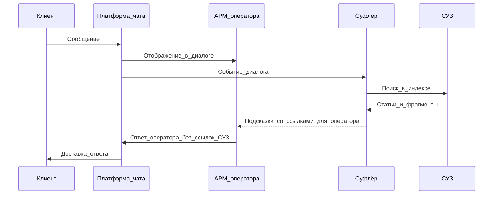
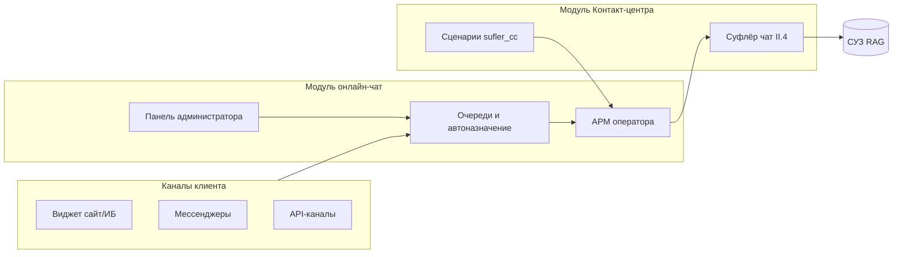
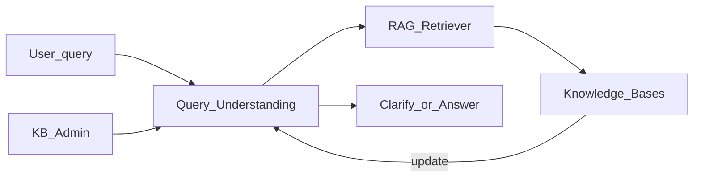
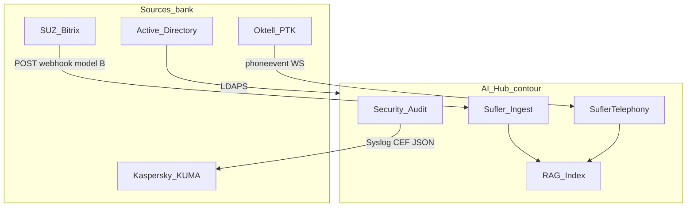
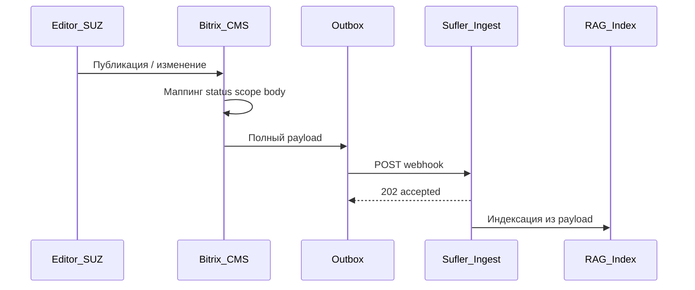
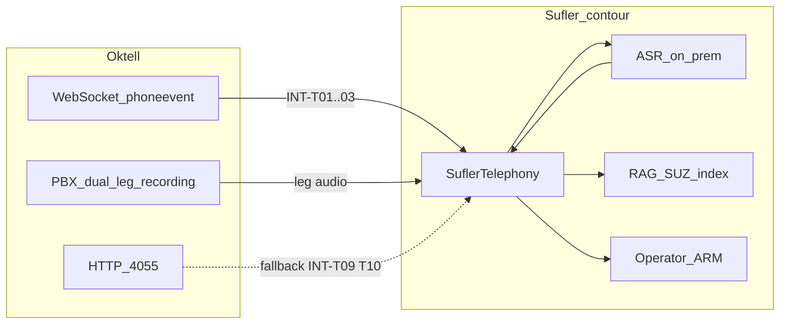
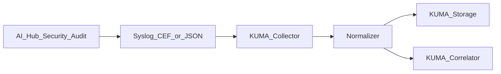

# Техническое задание на создание автоматизированной системы

**ПО на базе искусственного интеллекта для банковских процессов**

**Версия:** v1.2 (черновик) · **Дата:** 2026-06-14 · **Проект:** ПО на базе ИИ · **Договор:** № 14-03/2026 · **Заказчик:** ОАО «АСБ Беларусбанк» · **Исполнитель:** ООО «ГС Ритейл»

**Статус документа:** Процесс согласования — Parts I–VI заполнены по **[Прил.1]**; Part IV (OCR) — §6.1–6.3; открыты: AD-группы, HUB-T, документирование §11.1; макеты UI — зарезервированы ([I.8](#i8-сводная-таблица-макетов-ui)).

**Назначение:** единое согласуемое проектное ТЗ (этап 1 календарного плана, [Прил.2](../../sources/technical-requirements/prilozhenie-1.md)) на контур **AI Hub** (оболочка) и договорные модули **[Прил.1 §2.2]**: модуль LLM, модуль Контакт-центра, модуль ИИ-ассистент, модуль распознавания документов — и интеграции с системами банка.

**Нормативная база:** содержание — по **Приложению 1** к договору (приоритет); структура дополнена **ГОСТ 34.602-2020** — см. [I.1.1](#i11-соответствие-гост-34602-2020).

**Предшественник:** [tz-ai-hub-contour.md v1.1](tz-ai-hub-contour.md) — источник для переноса содержания.

**Справочные документы (не дублировать в v1.2):**

- [tz-ai-hub-contour.md v1.1](tz-ai-hub-contour.md)
- [tz-online-chat-platform.md](../../integration/online-chat/tz-online-chat-platform.md) → Part II.5
- [tz-bitrix-rag-sufler.md](../../integration/suz-bitrix-rag/tz-bitrix-rag-sufler.md) → Part VI.1
- [tz-oktell-sufler-telephony.md](../../integration/oktell-sufler-telephony/tz-oktell-sufler-telephony.md) → Part VI.2
- [tz-ai-assistant-belarusbank.md](../ai-assistant/tz-ai-assistant-belarusbank.md) → Part III (API)

**Планы доработок по замечаниям заказчика:**

- [ai-contour/plan-dorabotok-v1.2.md](../../remarks/ai-contour/plan-dorabotok-v1.2.md) (46 комм.)
- [online-chat/plan-dorabotok-v1.2.md](../../remarks/online-chat/plan-dorabotok-v1.2.md) (17 правок)
- [suz-integration/plan-dorabotok-v1.2.md](../../remarks/suz-integration/plan-dorabotok-v1.2.md) (100 комм.)

---

## Содержание

### Часть 0. Реквизиты документа

- [0.1 Идентификация](#01-идентификация)
- [0.2 Основание разработки](#02-основание-разработки)
- [0.3 Стороны и контакты](#03-стороны-и-контакты)

### Часть I. Общие положения

- [I.1 Правила и обозначения, принятые в документе](#i1-правила-и-обозначения-принятые-в-документе)
- [I.1.1 Соответствие ГОСТ 34.602-2020](#i11-соответствие-гост-34602-2020)
- [I.2 Контекст и цели](#i2-контекст-и-цели)
- [I.3 Глоссарий](#i3-глоссарий)
- [I.4 Матрица ролей и доступа](#i4-матрица-ролей-и-доступа)
  - [I.4.1 Роли Прил.1 (§2.4)](#i41-роли-прил1-§24)
  - [I.4.2 Дополнительные роли проекта](#i42-дополнительные-роли-проекта)
- [I.5 Оболочка AI Hub](#i5-оболочка-ai-hub)
- [I.6 Администрирование и настройки (сводка)](#i6-администрирование-и-настройки-сводка)
- [I.7 Состав системы](#i7-состав-системы)
- [I.8 Сводная таблица макетов UI](#i8-сводная-таблица-макетов-ui)
- [I.9 Информационная безопасность](#i9-информационная-безопасность)
- [I.10 Active Directory / LDAPS](#i10-active-directory--ldaps)

### Часть II. Модуль Контакт-центра (§2.2.2, §4)

- [II.0 Поручения протокола встречи №2](#ii0-поручения-протокола-встречи-2)
- [II.1 Общие положения (§4.1)](#ii1-общие-положения-41)
- [II.2 Модуль понимания запросов (§2.2.2.1, §4.2)](#ii2-модуль-понимания-запросов-2221-42)
- [II.3 Интерфейс для работы суфлёра — канал телефония (§2.2.2.2, §4.3.1)](#ii3-интерфейс-для-работы-суфлёра--канал-телефония-2222-431)
- [II.4 Интерфейс для работы суфлёра — онлайн-чат (§2.2.2.3, §4.3.2)](#ii4-интерфейс-для-работы-суфлёра--онлайн-чат-2223-432)
- [II.5 Модуль онлайн-чат (§2.2.2.4, §4.4)](#ii5-модуль-онлайн-чат-2224-44)
- [II.6 Модуль «Отчетность» (§4.7)](#ii6-модуль-отчетность-47)
- [II.7 Приёмка модуля Контакт-центра (SUF-T, CHAT-T)](#ii7-приёмка-модуля-контакт-центра-suf-t-chat-t)

### Часть III. Модуль ИИ-ассистент (§2.2.3, §5)

- [III.0 Поручения протокола встречи №2](#iii0-поручения-протокола-встречи-2)
- [III.1 Назначение и границы](#iii1-назначение-и-границы)
- [III.2 Роли](#iii2-роли)
- [III.3 Интерфейсы и макеты](#iii3-интерфейсы-и-макеты)
- [III.4 Пользовательские сценарии](#iii4-пользовательские-сценарии)
- [III.5 Функциональные требования](#iii5-функциональные-требования)
- [III.6 Настройки модуля](#iii6-настройки-модуля)
- [III.7 Интеграции и API](#iii7-интеграции-и-api)
- [III.8 Приёмка (ASS-T)](#iii8-приёмка-ass-t)
- [III.9 Модуль понимания запросов модуля ИИ-ассистент (§5.2)](#iii9-модуль-понимания-запросов-модуля-ии-ассистент-52)
- [III.10 Промпты и отчётность ассистента](#iii10-промпты-и-отчётность-ассистента)
- [III.11 Конфигурация LLM (ассистент)](#iii11-конфигурация-llm-ассистент)

### Часть IV. Модуль распознавания документов (§2.2.4, §6)

- [IV.0 Поручения протокола встречи №2](#iv0-поручения-протокола-встречи-2)
- [IV.1 Назначение и границы](#iv1-назначение-и-границы)
- [IV.2 Роли](#iv2-роли)
- [IV.3 Интерфейсы и макеты](#iv3-интерфейсы-и-макеты)
- [IV.4 Пользовательские сценарии](#iv4-пользовательские-сценарии)
- [IV.5 Функциональные требования](#iv5-функциональные-требования)
- [IV.6 Настройки модуля](#iv6-настройки-модуля)
- [IV.7 Интеграции](#iv7-интеграции)
- [IV.8 Приёмка (DOC-T)](#iv8-приёмка-doc-t)
- [IV.9 Информационная безопасность модуля](#iv9-информационная-безопасность-модуля)

### Часть V. Модуль LLM (§2.2.1, §3)

- [V.1 Общие требования (§3)](#v1-общие-требования-3)
- [V.2 Конфигурация моделей и RAG (§3.3–3.5)](#v2-конфигурация-моделей-и-rag-33-35)

### Часть VI. Интеграции

- [VI.0 Общие положения](#vi0-общие-положения)
- [VI.1 СУЗ ↔ RAG](#vi1-суз--rag)
- [VI.2 Oktell ↔ суфлёр (телефония)](#vi2-oktell--суфлёр-телефония)
- [VI.3 SIEM / аудит (Kaspersky KUMA)](#vi3-siem--аудит-kaspersky-kuma)

### Часть VII. Закрытие

- [VII.1 Состав и содержание работ](#vii1-состав-и-содержание-работ)
- [VII.2 Контроль и приёмка](#vii2-контроль-и-приёмка)
- [VII.3 Подготовка объекта к вводу](#vii3-подготовка-объекта-к-вводу)
- [VII.4 Требования к документированию](#vii4-требования-к-документированию)
- [VII.5 Вопросы для согласования](#vii5-вопросы-для-согласования)

### Приложения

- [Приложение A. Лист согласования](#приложение-a-лист-согласования)
- [Приложение B. Реестр диалоговых сценариев КЦ (Прил.2)](#приложение-b-реестр-диалоговых-сценариев-кц-прил2)
- [Приложение C. Источники разработки](#приложение-c-источники-разработки)
- [Приложение D. Индекс замечаний v1.2](#приложение-d-индекс-замечаний-v12)

---

# Часть 0. Реквизиты документа

## 0.1. Идентификация

| Поле               | Значение                                                                                                        |
| ------------------ | --------------------------------------------------------------------------------------------------------------- |
| Наименование АС    | ПО на базе ИИ для банковских процессов                                                                          |
| Версия ТЗ          | v1.2 (черновик)                                                                                                 |
| Дата               | 2026-06-14                                                                                                      |
| Статус             | Процесс согласования                                                                                            |
| Общий срок проекта | Не более 7 месяцев с даты подписания договора ([Прил.2](../../sources/technical-requirements/prilozhenie-1.md)) |

## 0.2. Основание разработки

Настоящее ТЗ разрабатывается в рамках **этапа 1** календарного плана договора № 14-03/2026: «Составление (разработка) Исполнителем Технического задания на основании технических требований Заказчика» — **20 рабочих дней** с даты подписания договора. Результат этапа — утверждённое сторонами ТЗ.

| Основание                           | Ссылка                                                                                     | Содержание                                                      |
| ----------------------------------- | ------------------------------------------------------------------------------------------ | --------------------------------------------------------------- |
| Договор                             | № 14-03/2026                                                                               | Предмет, сроки, стороны                                         |
| Технические требования (Прил.1)     | [prilozhenie-1.md](../../sources/technical-requirements/prilozhenie-1.md)                  | Требования к ПО §1–11, роли, модули                             |
| Календарный план (Прил.2)           | В составе prilozhenie-1.md                                                                 | Этапы 1–9 внедрения                                             |
| Эталонные сценарии КЦ (Прил.2 к ТТ) | [manifest.yaml](../../sources/technical-requirements/app2-scenarios/manifest.yaml)         | CC-SCR-001…010 (минимум 50 сценариев к внедрению — §4.5.2.1 ТТ) |
| Протокол встречи №2                 | [ПРОТОКОЛ ВСТРЕЧИ #2.docx](../../sources/meeting-protocols/ПРОТОКОЛ%20ВСТРЕЧИ%20%232.docx) | Поручения по СУЗ, Oktell, стендам (28.05.2026)                  |

## 0.3. Стороны и контакты

| Сторона     | Организация           | Роль в проекте                                                 | Контакт      |
| ----------- | --------------------- | -------------------------------------------------------------- | ------------ |
| Заказчик    | ОАО «АСБ Беларусбанк» | ДИТ, Центр кибербезопасности, КЦ — стенды, AD, СУЗ, Oktell, ИБ | *уточняется* |
| Исполнитель | ООО «ГС Ритейл»       | Разработка ПО, ТЗ на интеграции, BelVPN                        | *уточняется* |

**Поручения протокола №2 (28.05.2026):** Исполнитель — спецификации интеграции СУЗ/Oktell и требования к тестовому серверу **до 04.06.2026**; заявка BelVPN и данные сотрудников **до 05.06.2026**; Заказчик — тестовый контур Bitrix **до 20.06.2026**, тест Oktell с линией **до 15.07.2026**, ВМ по требованиям Исполнителя **до 18.06.2026**.

---

# Часть I. Общие положения

## I.1. Правила и обозначения, принятые в документе {#i1-правила-и-обозначения-принятые-в-документе}

Документ — **единое согласуемое ТЗ v1.2** на контур AI Hub. Приоритет источников:

1. **[Прил.1]** — договорные технические требования (главный источник содержания).
2. **As-Is** — описание функциональности, действующей в настоящее время (источники `docs/sources/`: вопросники, протоколы, AD, Oktell PDF); фиксирует ограничения интеграции.
3. **plan-dorabotok-v1.2** — замечания заказчика к v1.1; детализация FR/UI — при переносе из v1.1.
4. **ГОСТ 34.602-2020** — полнота структуры ([I.1.1](#i11-соответствие-гост-34602-2020)); при расхождении с Прил.1 побеждает Прил.1.

Детальные FR/UC/критерии приёмки модулей переносятся из [tz-ai-hub-contour.md v1.1](tz-ai-hub-contour.md) и дочерних integration `tz-*.md` — в соответствующие разделы Parts II–VI. При переносе **проектные ярлыки v1.1** («Суфлёр», «Ассистент», «Документы» как имена Parts) заменяются на **договорные** названия §2.2 Прил.1.

### Правило наименования модулей, ролей

1. **Заголовки Parts и подразделов модулей** — **дословно** по **[Прил.1 §2.2]** (и §5–§6 для состава модулей ИИ-ассистент и распознавания документов).
2. **Роли §2.4** — **дословно** в [I.4.1](#i41-роли-прил1-§24); сокращения («КЦ», «Ассистент» как имя роли) в заголовках и FR **запрещены**.
3. **«AI Hub»** — только **оболочка** контура ([I.5](#i5-оболочка-ai-hub)), не имя договорного моду §2.2.
4. **«Суфлёр»** — термин §1 и имя **интерфейса** §2.2.2.2–2.2.2.3, не заголовок Part.
5. Дополнительные роли проекта (супервизор, аудитор и др.) — только [I.4.2](#i42-дополнительные-роли-проекта), не подменяют §2.4.

### Легенда маркеров

| Маркер                | Значение                                                                                               |
| --------------------- | ------------------------------------------------------------------------------------------------------ |
| **[Прил.1]**          | Требование Приложения 1 к договору                                                                     |
| **[модуль LLM]**      | Общий слой §2.2.1, §3 — Part V                                                                         |
| **[Исполнитель]**     | Реализует в рамках договора                                                                            |
| **[Заказчик]**        | AD, внешние системы, контент СУЗ, Oktell, ИБ                                                           |
| **As-Is** / **To-Be** | Текущее и целевое состояние — см. [I.3](#i3-глоссарий)                                                 |
| **TBD**               | Значение параметра — см. [I.3](#i3-глоссарий) (термин **TBD**)                                         |
| **Трассировка**       | Сопоставление источников требований с разделами ТЗ — см. [I.3](#i3-глоссарий) (термин **Трассировка**) |

### Легенда статусов в таблицах

| Статус              | Значение                                                                                                              |
| ------------------- | --------------------------------------------------------------------------------------------------------------------- |
| **готово**          | Требование, сценарий или критерий описаны в настоящем ТЗ; **не** означает реализацию в продукте или результат приёмки |
| **открыто**         | Нужны решения или данные **Заказчика**, согласование на рабочей встрече (или согласование с ДИТ, ИБ, вендором, КЦ)    |
| **перенос v1.1**    | Текст переносится из [tz-ai-hub-contour.md v1.1](tz-ai-hub-contour.md)                                                |
| **каркас**          | Только структура раздела, содержание не заполнено                                                                     |
| **закрыто текстом** | Замечание заказчика учтено в тексте настоящего ТЗ (Приложение D)                                                      |
| **проект**          | Компонент в scope проекта; детализация — в указанном разделе ТЗ                                                       |
| **в работе**        | Раздел или этап в процессе заполнения / согласования                                                                  |

Под таблицами со статусом **открыто** — блок **«Открытые вопросы для Заказчика»** со ссылкой на [VII.5](#vii5-вопросы-для-согласования), где применимо.

### Таблица трассировки §2.2 → разделы ТЗ

| Пункт Прил.1 §2.2   | Дословное название                              | Раздел ТЗ v1.2                                                      | Статус |
| ------------------- | ----------------------------------------------- | ------------------------------------------------------------------- | ------ |
| 2.2.1               | модуль LLM                                      | [Part V](#часть-v-модуль-llm-§2221-§3)                              | готово |
| 2.2.2               | модуль Контакт-центра                           | [Part II](#часть-ii-модуль-контакт-центра-§222-§4)                  | готово |
| 2.2.2.1             | модуль понимания запросов                       | [II.2](#ii2-модуль-понимания-запросов-2221-42)                      | готово |
| 2.2.2.2             | интерфейс для работы суфлёра … канала телефония | [II.3](#ii3-интерфейс-для-работы-суфлёра--канал-телефония-2222-431) | готово |
| 2.2.2.3             | интерфейс для работы суфлёра … онлайн-чата      | [II.4](#ii4-интерфейс-для-работы-суфлёра--онлайн-чат-2223-432)      | готово |
| 2.2.2.4             | модуль онлайн-чат                               | [II.5](#ii5-модуль-онлайн-чат-2224-44)                              | готово |
| 2.2.3               | интерфейс для работы модуля ИИ-ассистента       | [Part III](#часть-iii-модуль-ии-ассистент-§223-§5)                  | готово |
| 2.2.4               | модуль распознавания документов                 | [Part IV](#часть-iv-модуль-распознавания-документов-§224-§6)        | готово |
| §4.7 (по тексту ТТ) | модуль «Отчетность»                             | [II.6](#ii6-модуль-отчетность-47)                                   | готово |

### Перенос FR/UC из v1.1 (замена имён)

| v1.1 (tz-ai-hub-contour) | v1.2 (договорное имя)              | Раздел     |
| ------------------------ | ---------------------------------- | ---------- |
| Part II «Суфлёр»         | интерфейс … суфлёра (тел.) + (чат) | II.3, II.4 |
| Part V «Онлайн-чат»      | модуль онлайн-чат                  | II.5       |
| Part III «Ассистент»     | модуль ИИ-ассистент                | Part III   |
| Part IV «Документы»      | модуль распознавания документов    | Part IV    |
| VI.4 «Платформа LLM»     | модуль LLM                         | Part V     |
| —                        | модуль понимания запросов          | II.2       |
| —                        | модуль «Отчетность»                | II.6       |

| Пункт Прил.1 | Раздел ТЗ v1.2 | Сценарий (UC)       | Критерий приёмки | Статус |
| ------------ | -------------- | ------------------- | ---------------- | ------ |
| §4.1         | II.1           | —                   | FR-CC-01…14      | готово |
| §4.2         | II.2           | UC-UND-01…02        | FR-UND/FR-ASR    | готово |
| §4.3.1       | II.3           | UC-SUF-T01…T05      | SUF-T-01…14      | готово |
| §4.3.2       | II.4           | UC-SUF-C01…C03      | SUF-T-03…07      | готово |
| §4.4         | II.5           | UC-K/O/S/A/R (*22*) | CHAT-T-01…20     | готово |
| §4.5–4.6     | II.3.5         | UC-SCR-*            | FR-SCR-01…11     | готово |
| §4.7         | II.6           | UC-R1…R2            | FR-RPT-01…12     | готово |

## I.1.1. Соответствие ГОСТ 34.602-2020

Структура документа согласована с **ГОСТ 34.602-2020** «Техническое задание на создание автоматизированной системы»; содержание требований — по **Приложению 1** (приоритет при расхождениях).

| Раздел ГОСТ 34.602                      | Раздел настоящего ТЗ                 |
| --------------------------------------- | ------------------------------------ |
| 1. Общие положения                      | Часть 0, I                           |
| 2. Назначение и цели                    | I.2                                  |
| 3. Характеристика объекта автоматизации | I.3–I.4, I.7                         |
| 4. Требования к системе                 | Части II–V (модули), VI (интеграции) |
| 5. Состав и содержание работ            | VII.1                                |
| 6. Порядок контроля и приёмки           | VII.2, приёмка модулей               |
| 7. Подготовка объекта к вводу           | VII.3                                |
| 8. Требования к документированию        | VII.4                                |
| 9. Источники разработки                 | Приложение C                         |

## I.2. Контекст и цели

### Цели **[Прил.1 §2.1]**

Усовершенствовать и оптимизировать процессы банка, повысить эффективность работы пользователей путём внедрения инструментов на базе ИИ: модуль LLM, Контакт-центр (суфлёр телефония/чат, онлайн-чат), ИИ-ассистент, распознавание документов.

### As-Is — Контакт-центр (источник: [Вопросы ГС Ритейл 1.docx](../../sources/meeting-protocols/Вопросы%20ГС%20Ритейл%201.docx))

| Тема                     | As-Is                                                                                                                   | To-Be                                                             |
| ------------------------ | ----------------------------------------------------------------------------------------------------------------------- | ----------------------------------------------------------------- |
| Телефония vs чат         | Разные отделы и ПО; один оператор не ведёт звонок и чат одновременно                                                    | Единый **модуль Контакт-центра** в AI Hub, раздельные АРМ каналов |
| Очередь звонков          | Общая очередь (межгород/моб./городской — одна очередь)                                                                  | Сохранить совместимость с Oktell                                  |
| Каналы чата              | Telegram, Viber, VK — **одно окно** оператора; сайт и др. — отдельно                                                    | Виджет + мессенджеры по §4.4 ТТ                                   |
| Источник ответов         | **СУЗ** — основной; курсы, адреса — с корп. сайта; эскалация — старший оператор / контент-менеджеры                     | Только СУЗ + ссылки оператору (не клиенту в чате)                 |
| История клиента          | **Только в рамках канала**; кросс-канальной истории нет                                                                 | Единая история и саммари — §4.4 ТТ                                |
| Робот / бот              | На **телефонии** — IVR-робот; в чате бот **не** бесшовно (ссылка на онлайн-чат)                                         | Сценарии + суфлёр для оператора                                   |
| Обратная связь оператора | Тематики обязательны (влияют на оценку); оценки подсказок LLM — внедрять с обучением                                    | §4.3 ТТ: релевантность/полезность                                 |
| Нагрузка                 | ~500 зв/ч сред., ~700 пик — **подтверждено** заказчиком                                                                 | §4.4.6 ТТ                                                         |
| Сценарии                 | Черновики скриптов в КЦ; эталон 10 тем — [Прил. B](#приложение-b-реестр-диалоговых-сценариев-кц-прил2); ≥50 к внедрению | Редактор сценариев в Hub                                          |

### I.2.3. Ключевое решение по RBAC (суфлёр)

**«Суфлёр в работе»** — фактическое отображение подсказок оператору в канале (не путать с видимостью вкладки «Суфлёр» в оболочке Hub). Оператор онлайн-чата получает суфлёр **только** в АРМ чата ([II.4](#ii4-интерфейс-для-работы-суфлёра--онлайн-чат-2223-432), [II.5](#ii5-модуль-онлайн-чат-§2223-§44)).

| Роль (§2.4)                      | Вкладка «Суфлёр» в AI Hub | Суфлёр в работе            |
| -------------------------------- | ------------------------- | -------------------------- |
| Оператор канала телефония (п. 4) | **да**                    | AI Hub + интеграция Oktell |
| Оператор онлайн-чата (п. 5)      | **нет**                   | Правая панель **АРМ чата** |
| Прочие роли §2.4                 | **нет**                   | **—** (не применимо)       |

## I.3. Глоссарий

Термины **[Прил.1 §1]** — **дословно** (полный перечень — [prilozhenie-1.md §1](../../sources/technical-requirements/prilozhenie-1.md)). Ниже — ключевые термины настоящего ТЗ; **трассировка** требований к разделам — см. термин **Трассировка** в блоке «Проектные уточнения». Уточнения из `docs/sources/` не заменяют определения §1.

| Термин (§1)                    | Определение (Прил.1)                                                      | Примечание в ТЗ                               |
| ------------------------------ | ------------------------------------------------------------------------- | --------------------------------------------- |
| **LLM**                        | большая языковая модель …                                                 | Part [V](#часть-v-модуль-llm-§2221-§3); §3 ТТ |
| **Актив**                      | компьютер, сетевой ресурс, СУБД, ПО …                                     | §8–9 ИБ                                       |
| **АНИС**                       | автоматизированная нормативно-информационная ПО …                         | внешний источник (потенциально)               |
| **База знаний LLM**            | специализированный набор данных …                                         | СУЗ, источники ассистента                     |
| **Банк**                       | ОАО «АСБ Беларусбанк»                                                     | Заказчик                                      |
| **Веб-сайт банка (веб-сайт)**  | [https://belarusbank.by/](https://belarusbank.by/) …                      | виджеты §4.4                                  |
| **Внешний источник данных**    | … за пределами закрытого контура                                          | §5 ИИ-ассистент                               |
| **Внутренний источник данных** | … в пределах закрытого контура                                            | §5 ИИ-ассистент                               |
| **Галлюцинации**               | генерация ответа … без подтверждения данными                              | ≤3% §3.6                                      |
| **Диалоговые сценарии**        | набор готовых вопросов и предполагаемых ответов …                         | ≥50 к внедрению §4.5.2.1                      |
| **Запрос**                     | голосовой или текстовый вопрос … в модуль LLM                             | II.2, III.9                                   |
| **ИИ-ассистент**               | модуль взаимодействия пользователя с LLM …                                | Part III                                      |
| **Канал телефония**            | канал … Oktell … Контакт-центра                                           | II.3, VI.2                                    |
| **Клиент**                     | физическое или юридическое лицо …                                         | КЦ                                            |
| **Онлайн-чат**                 | канал … текстовых сообщений …                                             | II.5                                          |
| **Оператор онлайн-чата**       | сотрудник … модуля онлайн-чат в Контакт-центре                            | роль §2.4 п.5                                 |
| **Оператор канала телефония**  | сотрудник … канала телефония в Контакт-центре                             | роль §2.4 п.4                                 |
| **Пользователь**               | сотрудник банка … любым из модулей ПО                                     | §2.4                                          |
| **Промпты**                    | Задание (запрос, инструкция) …                                            | III.10                                        |
| **Релевантность**              | уровень соответствия ответа … запросу клиента (%)                         | обратная связь §4.3                           |
| **Ретривер**                   | модуль поиска релевантной информации …                                    | §3.5, VI.1                                    |
| **Саммаризация**               | метод сокращения … до ключевых аспектов                                   | §4.4 ТТ                                       |
| **ПО**                         | программное обеспечение … на базе ИИ                                      | объект настоящего ТЗ                          |
| **СУЗ**                        | ПО «Система управления знаниями» …                                        | ~1732 статьи; API **нет** (As-Is)             |
| **Суфлёр**                     | модуль, который помогает … оператору канала телефония и/или онлайн-чата … | **интерфейсы** II.3, II.4; не имя Part        |

**Проектные уточнения (не §1):**

| Термин                                     | Определение                                                                                                                                                                                    | ТТ / примечание                                                                                                                                                                                                         |
| ------------------------------------------ | ---------------------------------------------------------------------------------------------------------------------------------------------------------------------------------------------- | ----------------------------------------------------------------------------------------------------------------------------------------------------------------------------------------------------------------------- |
| **As-Is**                                  | Описание функциональности, действующей в настоящее время (факты заказчика до внедрения; источники: вопросники, протоколы, текущая инфраструктура)                                              | Заголовки, колонки и блоки «As-Is»                                                                                                                                                                                      |
| **To-Be**                                  | Описание функциональности после внедрения согласно настоящему ТЗ и **[Прил.1]**                                                                                                                | Колонка «To-Be» в таблицах сравнения                                                                                                                                                                                    |
| **AI Hub**                                 | Оболочка — единая точка входа к модулям                                                                                                                                                        | Проектное имя контура; [I.5](#i5-оболочка-ai-hub)                                                                                                                                                                       |
| **рабочий индекс** (`cc_production`)       | Production-индекс базы знаний Контакт-центра в RAG; отдельный от индексов ассистента                                                                                                           | §4.5, [VI.1](#vi1-суз--rag); детали — [tz-bitrix-rag-sufler.md](../../integration/suz-bitrix-rag/tz-bitrix-rag-sufler.md)                                                                                               |
| **OWASP Top 10 for LLM Applications 2025** | Перечень технических мер защиты LLM-приложений (инъекции, утечки данных, небезопасные плагины и др.)                                                                                           | §8.15; [I.9.1](#i91-требования-информационной-безопасности-§8-тт)                                                                                                                                                       |
| **модуль Контакт-центра**                  | §2.2.2 — umbrella-модуль КЦ                                                                                                                                                                    | Part II                                                                                                                                                                                                                 |
| **модуль «Отчетность»**                    | подсистема отчётов и мониторинга КЦ                                                                                                                                                            | §4.7; [II.6](#ii6-модуль-отчетность-47)                                                                                                                                                                                 |
| **Oktell / ПТК**                           | Телефония Контакт-центра, on-premise                                                                                                                                                           | v2.15.6.240503; MS SQL 2016                                                                                                                                                                                             |
| **KUMA**                                   | SIEM заказчика (Kaspersky UMA)                                                                                                                                                                 | §9.1.9; [VI.3](#vi3-siem--аудит-kaspersky-kuma)                                                                                                                                                                         |
| **INT-T**                                  | Критерии приёмки интеграций                                                                                                                                                                    | Отдельно от SUF-T (§4.6)                                                                                                                                                                                                |
| **TBD**                                    | Требует уточнения в процессе дальнейшего конфигурирования и переноса на среду Заказчика                                                                                                        | Маркер в таблицах (AD-группа, endpoint, контакт и т.п.); **не** означает отсутствие требования в **[Прил.1]**                                                                                                           |
| **Трассировка**                            | Установление соответствия между внешним источником требований (пункты **[Прил.1]** §2.2, §4–§6; поручения протоколов встреч; замечания **plan-dorabotok** v1.1) и разделами настоящего ТЗ v1.2 | Таблицы и блоки «Трассировка … → …»; [I.1](#i1-правила-и-обозначения-принятые-в-документе) (§2.2), Parts II–IV, [VI.0.2](#vi02-трассировка-к-тт-и-поручения-протокола-2), [Прил. D](#приложение-d-индекс-замечаний-v12) |

## I.4. Матрица ролей и доступа

Минимальный набор ролей — **[Прил.1 §2.4]** (13 ролей, формулировки **дословно**). Сопоставление с AD-группами — зона Заказчика (ДИТ); структура AD: [Структура_AD.docx](../../sources/active-directory/Структура_AD.docx), тестовый экспорт [BANK.ldif](../../sources/active-directory/BANK.ldif) (`DC=test,DC=asb`).

### I.4.1. Роли Прил.1 (§2.4)

| №   | Роль (ТТ §2.4, дословно)                      | AD-группа      | Вкладки / права Hub                 | Разделы ТЗ   | Статус  |
| --- | --------------------------------------------- | -------------- | ----------------------------------- | ------------ | ------- |
| 1   | Администратор ПО                              | *TBD Заказчик* | Все настройки, интеграции, ИБ       | Hub, I.5–I.6 | открыто |
| 2   | Администратор базы знаний LLM                 | *TBD*          | Сценарии, промпты, пороги RAG       | II, III, V   | открыто |
| 3   | Администратор модуля Контакт-центра           | *TBD*          | модуль Контакт-центра, чат, очереди | Part II      | открыто |
| 4   | Оператор канала телефония Контакт-центра      | *TBD*          | интерфейс суфлёра (тел.)            | II.3         | открыто |
| 5   | Оператор онлайн-чата Контакт-центра           | *TBD*          | интерфейс суфлёра (чат), АРМ чата   | II.4, II.5   | открыто |
| 6   | Внутренний пользователь Контакт-центра        | *TBD*          | Тестовый диалог LLM                 | II.2 / II.3  | открыто |
| 7   | Аналитик Контакт-центра                       | *TBD*          | Отчёты, модуль «Отчетность»         | II.6         | открыто |
| 8   | Администратор модуля ИИ-ассистент             | *TBD*          | модуль ИИ-ассистент, источники      | Part III     | открыто |
| 9   | Пользователь ИИ-ассистента                    | *TBD*          | Чат ассистента                      | Part III     | открыто |
| 10  | Аналитик ИИ-ассистента                        | *TBD*          | Отчёты ассистента                   | Part III     | открыто |
| 11  | Администратор модуля распознавания документов | *TBD*          | OCR/IDP                             | Part IV      | открыто |
| 12  | Пользователь модуля распознавания документов  | *TBD*          | Загрузка документов                 | Part IV      | открыто |
| 13  | Аналитик модуля распознавания документов      | *TBD*          | Отчёты OCR                          | Part IV      | открыто |

#### Открытые вопросы для Заказчика

| Ссылка                                     | Вопрос                                                                                             | Ответственный |
| ------------------------------------------ | -------------------------------------------------------------------------------------------------- | ------------- |
| [VII.5](#vii5-вопросы-для-согласования) №4 | Имена AD-групп для **13 ролей §2.4**, параметры **LDAPS** prod, сопоставление ролей ТЗ ↔ группы AD | ДИТ           |
| I.4.1 п.1–13                               | Атрибуты профиля УЗ (Department, mail и др.) для отображения в Hub                                 | ДИТ           |

### I.4.2. Дополнительные роли проекта

Роли **вне** минимального набора §2.4 — для RBAC оболочки AI Hub и операционной модели v1.1; **не заменяют** договорные роли §2.4.

| Роль (проект)                                 | AD-группа (пример v1.1) | Назначение                        | Разделы ТЗ | Статус      |
| --------------------------------------------- | ----------------------- | --------------------------------- | ---------- | ----------- |
| Супервизор Контакт-центра                     | `BB_CC_Supervisor`      | Наблюдение за очередями, АРМ чата | II.5       | открыто     |
| Аудитор                                       | `BB_AI_Auditor`         | Read-only журналы, настройки      | I.9, VI.3  | v1.1        |
| Администратор диалоговых сценариев и промптов | *TBD*                   | Редактор сценариев §4.5.2         | II.3       | §2.3 п.6 ТТ |

### I.4.3. Матрица доступа (сводка)

Детальная матрица вкладок Hub — перенос из [tz-ai-hub-contour.md v1.1 §I.4](tz-ai-hub-contour.md). Принцип: **13 ролей §2.4** — обязательны; дополнительные роли §I.4.2 — по согласованию с Заказчиком.

**As-Is (AD):** доступ через **членство в группах**; атрибуты УЗ — First/Last name, Office (обяз.), Department, Company, Job Title, mail, telephone; группы — древовидная структура, именование согласуется с админами MS AD.

## I.5. Оболочка AI Hub

Единый shell для модулей §2.2. Детали вкладок — в Частях II–IV.

| Элемент     | Параметры                                                                     |
| ----------- | ----------------------------------------------------------------------------- |
| **FAB**     | 56×56 px, правый нижний угол; бейдж уведомлений                               |
| **Панель**  | ~400 px, slide-in; pin / minimize / close                                     |
| **Шапка**   | «Беларусбанк AI», ФИО · роль AD                                               |
| **Tab bar** | Ассистент · Документы · Суфлёр — **только разрешённые вкладки** (не disabled) |
| **Меню ≡**  | «Центр настроек» → `/ai-hub/admin` (админ-роли); deep-link «KB · полное окно» |
| **Подвал**  | Статус связи; «KB / СУЗ обновлена · время»                                    |

**RBAC:** вкладки без доступа **не отображаются** (не disabled). Матрица — [I.4](#i4-матрица-ролей-и-доступа).

**Слайд 1. Макет интерфейса оболочки AI Hub**

*[Место для вставки макета]*

**Режим активной сессии КЦ** **[Прил.1 §4.6.2.3, §8.1]:** при активном звонке (событие Oktell) или активном диалоге чата в Hub панель переходит в режим фокуса на суфлёре — см. [FR-SUF-12](#ii34-функциональные-требования-суфлёр-телефония). Для оператора канала телефония §2.4 п.4 в Hub доступна **только** вкладка «Суфлёр» ([FR-SUF-09](#ii34-функциональные-требования-суфлёр-телефония)); для ролей с несколькими вкладками остальные скрыты или переключение с подтверждением «Перейти? Подсказки приостановятся».

## I.6. Администрирование и настройки (сводка)

**[Прил.1]:** сводка областей настройки ПО по модулям §2.2. Детализация по модулям — Parts II–V; матрица ролей — [I.4](#i4-матрица-ролей-и-доступа).

| Область настройки                                 | Пункт в ТТ                   | Роль §2.4 (основная)                                  | Раздел ТЗ                                                                                                                                               |
| ------------------------------------------------- | ---------------------------- | ----------------------------------------------------- | ------------------------------------------------------------------------------------------------------------------------------------------------------- |
| Общее управление ПО, интеграции, ИБ               | §2.4 п.1                     | Администратор ПО                                      | I.5, I.9, VI                                                                                                                                            |
| Параметры модели LLM (temperature, chunk, пороги) | §3.3.1–3.3.6                 | Администратор базы знаний LLM (п. 2)                  | [V.2](#v2-конфигурация-моделей-и-rag-§33–35), [III.11](#iii11-конфигурация-llm-ассистент), [II.3.5.2](#ii352-конфигурация-llm-контакт-центра-sufler_cc) |
| Базы знаний LLM, промпты, сценарии КЦ             | §4.1.8, §4.5.1–4.5.3         | п. 2; администратор диалоговых сценариев (§2.3 п.6)   | [II.3.5](#ii35-редактор-диалоговых-сценариев), [III.10](#iii10-промпты-и-отчётность-ассистента)                                                         |
| Диалоговые сценарии (≥50), тестирование           | §4.5.2.1–4.5.2.8             | п. 2, администратор диалоговых сценариев              | [II.3.5.1](#ii351-редактор-диалоговых-сценариев)                                                                                                        |
| Модуль онлайн-чат: каналы, очереди, АРМ           | §4.4                         | Администратор модуля Контакт-центра (п. 3)            | [II.5](#ii5-модуль-онлайн-чат-2224-44)                                                                                                                  |
| Отчётность КЦ                                     | §4.7                         | Аналитик Контакт-центра (п. 7)                        | [II.6](#ii6-модуль-отчетность-47)                                                                                                                       |
| Базы знаний и промпты ассистента                  | §5.1.41, §5.3.1–5.3.3        | п. 2, Администратор модуля ИИ-ассистент (п. 8)        | [III.6](#iii6-настройки-модуля), [III.10](#iii10-промпты-и-отчётность-ассистента)                                                                       |
| Источники данных, RPA, политика SQL               | §5.1.10, §5.1.30–31, §5.1.39 | п. 8 + ИБ                                             | [III.6.3](#iii63-реестр-источников-данных)–[III.6.5](#iii65-политика-sql--код-§5139)                                                                    |
| Шаблоны документов OCR, типы `doc_type`           | §6.1.7, §6.1.13, §6.1.20     | Администратор модуля распознавания документов (п. 11) | [IV.6](#iv6-настройки-модуля)                                                                                                                           |
| Отчётность OCR, конструктор                       | §6.2.1–6.2.5                 | Аналитик модуля распознавания документов (п. 13)      | [IV.6.2](#iv62-отчётность-§62), [IV.8](#iv8-приёмка-doc-t)                                                                                              |
| Разметка СУЗ для LLM                              | §4.5.1.6                     | [Исполнитель] + [Заказчик]                            | [VI.1](#vi1-суз--rag)                                                                                                                                   |

**Слайд 2. Макет интерфейса Центра настроек — навигация и конфигурация LLM**

*[Место для вставки макета]*

## I.7. Состав системы

**[Прил.1 §2.2]** + внешние системы банка (sources):33

| Компонент (§2.2 / ТТ)                        | Назначение                                             | Раздел ТЗ                                          | Внешняя система          | Статус                                                    |
| -------------------------------------------- | ------------------------------------------------------ | -------------------------------------------------- | ------------------------ | --------------------------------------------------------- |
| AI Hub (оболочка)                            | Единая точка входа, auth по AD                         | I.5                                                | Active Directory         | проект                                                    |
| **модуль LLM** (§2.2.1)                      | Генеративная модель, RAG, общие параметры §3           | V                                                  | On-premise               | §3 ТТ                                                     |
| **модуль Контакт-центра** (§2.2.2)           | КЦ: понимание запросов, суфлёр, онлайн-чат, отчётность | II                                                 | Oktell, СУЗ, мессенджеры | проект                                                    |
| — модуль понимания запросов                  | ASR/NLP, транскрипты §4.2                              | II.2                                               | Oktell MRCP              | открыто                                                   |
| — интерфейс … суфлёра (телефония)            | Подсказки оператору канала телефония                   | II.3                                               | Oktell, RAG/СУЗ          | готово                                                    |
| — интерфейс … суфлёра (онлайн-чат)           | Подсказки оператору онлайн-чата                        | II.4                                               | АРМ чата                 | готово                                                    |
| — **модуль онлайн-чат**                      | Виджеты, АРМ, очереди §4.4                             | II.5                                               | Telegram, Viber, VK      | проект                                                    |
| — модуль «Отчетность»                        | Мониторинг и отчёты §4.7                               | II.6                                               | —                        | готово                                                    |
| **модуль ИИ-ассистент** (§2.2.3, §5)         | ИИ для сотрудников банка                               | [Part III](#часть-iii-модуль-ии-ассистент-§223-§5) | AD, источники данных     | готово; ВКС §[III.0](#iii0-поручения-протокола-встречи-2) |
| **модуль распознавания документов** (§2.2.4) | OCR/IDP §6                                             | IV                                                 | ЭДО, целевые системы     | готово                                                    |
| Интеграция СУЗ ↔ RAG                         | Индекс базы знаний для подсказок                       | VI.1                                               | 1С-Битрикс (СУЗ)         | API нет → модель B                                        |
| Интеграция Oktell                            | События звонка, ASR, контекст                          | VI.2                                               | Oktell 2.15.6            | уточнение протокола                                       |
| SIEM / аудит                                 | Экспорт событий ИБ в **KUMA**                          | VI.3                                               | Kaspersky KUMA           | проект                                                    |

## I.8. Сводная таблица макетов UI

Макеты иллюстрируют функциональные требования к UI по **[Прил.1]** (§4.6, §5.1.18, §6.1.15); не ослабляют ТТ. Нумерация слайдов — сквозная по документу (для согласования и вставки в Word).

| ID    | Слайд | Название макета                                                                               | Раздел ТЗ                                                      | Статус          |
| ----- | ----- | --------------------------------------------------------------------------------------------- | -------------------------------------------------------------- | --------------- |
| I-1   | 1     | Макет интерфейса оболочки AI Hub                                                              | [I.5](#i5-оболочка-ai-hub)                                     | зарезервировано |
| I-2   | 2     | Макет интерфейса Центра настроек — навигация и конфигурация LLM                               | [I.6](#i6-администрирование-и-настройки-сводка)                | зарезервировано |
| II-1  | 3     | Макет интерфейса для работы суфлёра — канал телефония (общий вид)                             | [II.3.2](#ii32-интерфейсы-и-макеты)                            | зарезервировано |
| II-2  | 4     | Макет интерфейса для работы суфлёра — подсказки на реплики клиента (канал телефония)          | [II.3.2](#ii32-интерфейсы-и-макеты)                            | зарезервировано |
| II-3  | 5     | Макет интерфейса для работы суфлёра — онлайн-чат (панель в АРМ)                               | [II.4](#ii4-интерфейс-для-работы-суфлёра--онлайн-чат-2223-432) | зарезервировано |
| II-4  | 6     | Макет интерфейса редактора диалоговых сценариев — визуальная карта                            | [II.3.5.1](#ii351-редактор-диалоговых-сценариев)               | зарезервировано |
| II-5  | 7     | Макет интерфейса тестирования диалогового сценария                                            | [II.3.5.1](#ii351-редактор-диалоговых-сценариев)               | зарезервировано |
| II-6  | 8     | Макет интерфейса виджета модуля онлайн-чат и формы входа                                      | [II.5.3](#ii53-виджет-и-форма-входа-замечания-612)             | зарезервировано |
| II-7  | 9     | Макет интерфейса рабочего места оператора онлайн-чата (АРМ)                                   | [II.5.4](#ii54-арм-оператора-замечания-1315)                   | зарезервировано |
| III-1 | 10    | Макет интерфейса модуля ИИ-ассистента — чат с источниками                                     | [III.3](#iii3-интерфейсы-и-макеты)                             | зарезервировано |
| III-2 | 11    | Макет интерфейса модуля ИИ-ассистента — состояния интерфейса                                  | [III.3](#iii3-интерфейсы-и-макеты)                             | зарезервировано |
| III-3 | 12    | Макет интерфейса модуля ИИ-ассистента — генерация документа                                   | [III.3](#iii3-интерфейсы-и-макеты)                             | зарезервировано |
| III-4 | 13    | Макет интерфейса Центра настроек — базы знаний LLM и уточняющие вопросы                       | [III.6](#iii6-настройки-модуля)                                | зарезервировано |
| III-5 | 14    | Макет интерфейса модуля ИИ-ассистента — саммаризация аудио и видео                            | [III.3](#iii3-интерфейсы-и-макеты)                             | зарезервировано |
| III-6 | 15    | Макет интерфейса модуля ИИ-ассистента — инструменты код/SQL и RPA                             | [III.6.5](#iii65-политика-sql--код-§5139)                      | зарезервировано |
| III-7 | 16    | Макет интерфейса Центра настроек — реестр RPA                                                 | [III.6.3](#iii63-реестр-источников-данных)                     | зарезервировано |
| III-8 | 17    | Макет интерфейса модуля ИИ-ассистента — перевод RU↔EN                                         | [III.3](#iii3-интерфейсы-и-макеты)                             | зарезервировано |
| IV-1  | 18    | Макет интерфейса модуля распознавания документов — очередь задач                              | [IV.3](#iv3-интерфейсы-и-макеты)                               | зарезервировано |
| IV-2  | 19    | Макет интерфейса модуля распознавания документов — загрузка документов                        | [IV.3](#iv3-интерфейсы-и-макеты)                               | зарезервировано |
| IV-3  | 20    | Макет интерфейса модуля распознавания документов — проверка: просмотр текста поверх оригинала | [IV.3](#iv3-интерфейсы-и-макеты)                               | зарезервировано |
| IV-4  | 21    | Макет интерфейса Центра настроек — типы документов                                            | [IV.6](#iv6-настройки-модуля)                                  | зарезервировано |

## I.9. Информационная безопасность

Требования **[Прил.1 §8–9]**; детализация ролей и LDAPS — [I.10](#i10-active-directory--ldaps). Модуль OCR — [IV.9](#iv9-информационная-безопасность-модуля).

### I.9.1. Требования информационной безопасности (§8 ТТ)

Внедряемая АС обеспечивает выполнение требований информационной безопасности в соответствии с **[Прил.1 §8.1–8.16]**, а именно:

| Пункт ТТ | Требование (Прил.1)                                                                                                                    | Отражение в ТЗ v1.2                                                           |
| -------- | -------------------------------------------------------------------------------------------------------------------------------------- | ----------------------------------------------------------------------------- |
| 8.1      | Разграничение прав доступа на основе ролевой модели                                                                                    | [I.4](#i4-матрица-ролей-и-доступа), [I.5](#i5-оболочка-ai-hub), FR по модулям |
| 8.2      | Идентификация и аутентификация; блокировка неиспользуемых УЗ                                                                           | [I.10](#i10-active-directory--ldaps), §7.1                                    |
| 8.3      | Генерация и смена учётных данных; длина, сложность, срок, история паролей; смена со старым паролем; хранение паролей в защищённом виде | [I.10](#i10-active-directory--ldaps) (политика AD)                            |
| 8.4      | Изменение реквизитов доступа по умолчанию или их блокирование                                                                          | [I.10](#i10-active-directory--ldaps)                                          |
| 8.5      | Настройки парольной политики (длина, сложность, историчность, период смены)                                                            | [I.10](#i10-active-directory--ldaps)                                          |
| 8.6      | Защита обратной связи при вводе пароля                                                                                                 | [I.10](#i10-active-directory--ldaps)                                          |
| 8.7      | Функционал недоступен неавторизованным пользователям                                                                                   | [I.5](#i5-оболочка-ai-hub), RBAC                                              |
| 8.8      | Защита от подбора реквизитов; лимит неудачных попыток и блокировка                                                                     | [I.10](#i10-active-directory--ldaps)                                          |
| 8.9      | Блокировка по неактивности                                                                                                             | [I.10](#i10-active-directory--ldaps)                                          |
| 8.10     | Антивирус на серверной части — ПО Заказчика                                                                                            | [VII.3](#vii3-подготовка-объекта-к-вводу)                                     |
| 8.11     | Обновления ПО, исправление ошибок и уязвимостей                                                                                        | Этапы 2, 7 календарного плана; [VII.1](#vii1-состав-и-этапы-работ)            |
| 8.12     | Отсутствие уязвимостей в коде и библиотеках; статический/компонентный анализ; устранение до ввода                                      | Этап 7 ИБ; [VII.1](#vii1-состав-и-этапы-работ)                                |
| 8.13     | Полномочное управление УЗ (создание, активация, блокировка, уничтожение)                                                               | [I.4](#i4-матрица-ролей-и-доступа), API §8.16                                 |
| 8.14     | Соответствие приказу ОАЦ № 66 (Прил.3 к Положению о ТКЗ)                                                                               | Настоящий раздел; аттестация — этап 4                                         |
| 8.15     | Технические меры по **OWASP Top 10 for LLM Applications 2025**                                                                         | [I.3](#i3-глоссарий); FR по модулям LLM                                       |
| 8.16     | API управления пользователями и полномочиями                                                                                           | [I.4](#i4-матрица-ролей-и-доступа), интеграция AD                             |

### I.9.2. Протоколирование и аудит (§9 ТТ)

Внедряемая АС обеспечивает протоколирование и аудит в соответствии с **[Прил.1 §9.1–9.3]**, а именно:

**§9.1 — система протоколирования:**

| Пункт ТТ | Требование                                               | Отражение в ТЗ v1.2                                                                |
| -------- | -------------------------------------------------------- | ---------------------------------------------------------------------------------- |
| 9.1.1    | Функционирование в течение всего периода работы актива   | [VI.3](#vi3-siem--аудит-kaspersky-kuma)                                            |
| 9.1.2    | Однозначная идентификация событий с привязкой по времени | [VI.3](#vi3-siem--аудит-kaspersky-kuma)                                            |
| 9.1.3    | Хранение событий ≥1 года (циклическое)                   | [VI.3](#vi3-siem--аудит-kaspersky-kuma)                                            |
| 9.1.4    | Доступность событий за срок хранения                     | [VI.3](#vi3-siem--аудит-kaspersky-kuma)                                            |
| 9.1.5    | Синхронизация времени актива                             | [VI.3](#vi3-siem--аудит-kaspersky-kuma), [VII.3](#vii3-подготовка-объекта-к-вводу) |
| 9.1.6    | Структурированный вид; экспорт/просмотр вне актива       | [VI.3](#vi3-siem--аудит-kaspersky-kuma)                                            |
| 9.1.7    | Защита информации при регистрации событий                | [VI.3](#vi3-siem--аудит-kaspersky-kuma)                                            |
| 9.1.8    | Реагирование на сбои регистрации                         | [VI.3](#vi3-siem--аудит-kaspersky-kuma)                                            |
| 9.1.9    | Передача событий ИБ в SIEM (KUMA)                        | [VI.3](#vi3-siem--аудит-kaspersky-kuma)                                            |

**§9.2 — защита при регистрации событий:**

| Пункт ТТ | Требование                                                          | Отражение в ТЗ v1.2                                       |
| -------- | ------------------------------------------------------------------- | --------------------------------------------------------- |
| 9.2.1    | Доступ к управлению механизмами регистрации — только уполномоченным | [I.4](#i4-матрица-ролей-и-доступа) п.1, ИБ                |
| 9.2.2    | Просмотр журналов — по должностным обязанностям                     | RBAC; [I.4.2](#i42-дополнительные-роли-проекта) «Аудитор» |
| 9.2.3    | Защита журналов от несанкционированной модификации и удаления       | [VI.3](#vi3-siem--аудит-kaspersky-kuma)                   |
| 9.2.4    | Мониторинг целостности журналов                                     | [VI.3](#vi3-siem--аудит-kaspersky-kuma)                   |
| 9.2.5    | Процедуры при переполнении журналов                                 | [VI.3](#vi3-siem--аудит-kaspersky-kuma)                   |
| 9.2.6    | Предупреждение о сбоях регистрации                                  | [VI.3](#vi3-siem--аудит-kaspersky-kuma)                   |

**§9.3 — состав событий:** перечни для ОС, СУБД, прикладного ПО, телекоммуникационного оборудования и СЗИ — по **[Прил.1 §9.3.1–9.3.5]**; профиль событий AI Hub и модулей — [VI.3.2](#vi32-сопоставление-с-протоколированием-§9), INT-T-AUD.

### I.9.3. On-premise и транспорт (замечание #37)

| Требование                                                   | Пункт ТТ  | Отражение в ТЗ v1.2                                                                          |
| ------------------------------------------------------------ | --------- | -------------------------------------------------------------------------------------------- |
| Работа без доступа к Интернету (модули КЦ, кроме онлайн-чат) | §4.1.4    | [FR-CC-04](#ii11-функциональные-требования)                                                  |
| Развёртывание в контуре Заказчика (ассистент)                | §5.1.26.2 | [III.1](#iii1-назначение-и-границы)                                                          |
| Локальное развёртывание OCR, изолированная сеть              | §6.1.22   | [FR-OCR-22](#iv5-функциональные-требования), [IV.9](#iv9-информационная-безопасность-модуля) |
| LDAPS для аутентификации                                     | §7.1, §8  | [I.10](#i10-active-directory--ldaps)                                                         |

## I.10. Active Directory / LDAPS

**[Прил.1 §5.1.33–34, §7.1, §8–9]**; As-Is: [Структура_AD.docx](../../sources/active-directory/Структура_AD.docx), [BANK.ldif](../../sources/active-directory/BANK.ldif).

| Зона ответственности                                | Исполнитель               | Заказчик (ДИТ)                             |
| --------------------------------------------------- | ------------------------- | ------------------------------------------ |
| Модуль auth/authz по группам AD                     | Реализация в Hub          | Создание и ведение групп под 13 ролей §2.4 |
| Маппинг ролей ТТ → AD-группы                        | Предложить матрицу (I.4)  | Утвердить и назначить членство             |
| Параметры LDAPS (хост, порт 636, сертификаты)       | Подключение по параметрам | Предоставить endpoint и доверенные CA      |
| Служебная УЗ для LDAP bind                          | Использование read-only   | Выдать УЗ, ротация                         |
| Атрибуты профиля (Department, Company, Title, mail) | Отображение в Hub         | Актуальность в AD                          |

**Структура AD (факт):** OU `BANK` → `Users` (древо подразделений), `Groups`, `Computers`; домен тестового экспорта `DC=test,DC=asb`. Параметры **продуктивного** LDAPS — *уточняется Заказчиком*.

---

# Часть II. Модуль Контакт-центра (§2.2.2, §4)

**[Прил.1 §2.2.2]:** модуль Контакт-центра включает модуль понимания запросов, интерфейсы для работы суфлёра (телефония и онлайн-чат), модуль онлайн-чат и функциональность мониторинга и отчётности (§4.7, модуль «Отчетность»).

## II.0. Поручения протокола встречи №2

Источник: [ПРОТОКОЛ ВСТРЕЧИ #2.docx](../../sources/meeting-protocols/ПРОТОКОЛ%20ВСТРЕЧИ%20%232.docx) (28.05.2026); уточняющие факты As-Is — [Вопросы встреча 2.docx](../../sources/meeting-protocols/Вопросы%20встреча%202.docx).

**Трассировка поручений протокола №2 → Part II** (сроки и ответственные — также [0.3](#03-стороны-и-контакты), [VII.1](#vii1-состав-и-этапы-работ), [VII.3](#vii3-подготовка-объекта-к-вводу)):

| Пункт протокола | Договорённость                                                                                  | Отражение в Part II                                                                                | См. также                                                                                             |
| --------------- | ----------------------------------------------------------------------------------------------- | -------------------------------------------------------------------------------------------------- | ----------------------------------------------------------------------------------------------------- |
| **1.1**         | Спецификация интеграции СУЗ: поля, формат, триггеры, протокол — **до 04.06.2026** (Исполнитель) | FR-SUF-01, FR-UND-08; зависимость подсказок от актуального индекса                                 | [VI.1](#vi1-суз--rag), [II.3.6](#ii36-kpi-и-интеграции)                                               |
| **1.2**         | Проработка API/webhook СУЗ заказчиком — **~до 25.06.2026** после 1.1                            | блокирует закрытие INT-T на prod; FR-SUF-04 не затронут                                            | [VII.5](#vii5-вопросы-для-согласования) №3                                                            |
| **1.4**         | Тестовый контур Bitrix (копия prod) — **до 20.06.2026** (Заказчик)                              | приёмка SUF-T/INT-T на стенде КЦ                                                                   | [II.7.1](#ii71-suf-t-суфлёр), [VII.3](#vii3-подготовка-объекта-к-вводу)                               |
| **2.1**         | Спецификация интеграции Oktell — **до 04.06.2026** (Исполнитель)                                | FR-SUF-04, UC-SUF-T01, открытые вопросы [II.3.4](#ii34-функциональные-требования-суфлёр-телефония) | [VI.2](#vi2-oktell--суфлёр-телефония)                                                                 |
| **2.3**         | Тестовая линия Oktell в prod с маркировкой — **до 15.07.2026** (ДИТ)                            | SUF-T-01, SUF-T-12, SUF-T-13; FR-SUF-04                                                            | [II.3.4](#ii34-функциональные-требования-суфлёр-телефония), [VII.3](#vii3-подготовка-объекта-к-вводу) |
| **3.1–3.5**     | Тестовый сервер, BelVPN, доступ сотрудников                                                     | **вне** функционала Part II                                                                        | [VII.1](#vii1-состав-и-этапы-работ), [VII.3](#vii3-подготовка-объекта-к-вводу)                        |
| **4.2**         | ВКС по модулю ИИ-ассистент и распознаванию документов — после 10.06                             | **вне** Part II                                                                                    | Part III–IV, [VII.5](#vii5-вопросы-для-согласования) №8                                               |

**As-Is по [Вопросы встреча 2.docx](../../sources/meeting-protocols/Вопросы%20встреча%202.docx)** (дополняет [I.2](#i2-контекст-и-цели) и разделы II–VI):

| Тема                         | As-Is                                                                                 | To-Be (Part II)                                                                |
| ---------------------------- | ------------------------------------------------------------------------------------- | ------------------------------------------------------------------------------ |
| **Oktell**                   | v2.15.6.240503, on-prem, MS SQL 2016; **тестового контура с линиями нет**             | FR-SUF-04; тест по п. 2.3 протокола                                            |
| **Oktell ASR**               | **Не встроен**; MRCP/REST/WebSocket — документация «по запросу», ответы «—»           | FR-ASR-*, модель T [VI.2](#vi2-oktell--суфлёр-телефония)                       |
| **Oktell события**           | Ответ «—» на WebSocket/события; PDF администратора описывает WS                       | [VII.5](#vii5-вопросы-для-согласования) №1                                     |
| **Oktell скрипты оператору** | **Нет** (всплывающих подсказок в Oktell)                                              | Суфлёр Hub [II.3](#ii3-интерфейс-для-работы-суфлёра--канал-телефония-2222-431) |
| **Oktell API вызова**        | **Нет**                                                                               | События + ASR on-prem, не управление вызовом                                   |
| **Oktell история**           | idchain, время, номер в таблицах MS SQL; схемы БД **нет**                             | Контекст звонка для суфлёра — INT-T                                            |
| **Oktell мониторинг**        | Zabbix (серверы, БД)                                                                  | [VI.2](#vi2-oktell--суфлёр-телефония)                                          |
| **СУЗ API / webhook**        | **API нет**; push-событий **нет** (обновления на главной)                             | Модель B [VI.1](#vi1-суз--rag); [VII.5](#vii5-вопросы-для-согласования) №3     |
| **СУЗ контент**              | **1732** статьи; разделы до **5** уровней; версионность **есть**                      | FR-CC-06, FR-SUF-01                                                            |
| **СУЗ обновления**           | **10–30** изменений в среднем **в день**; раздел может правиться несколько раз в день | FR-UND-08, webhook/outbox [VI.1](#vi1-суз--rag)                                |
| **СУЗ поиск (операторы)**    | Полнотекст + фильтры тег/категория                                                    | RAG-индекс для суфлёра, не замена UI СУЗ                                       |

## II.1. Общие положения (§4.1)

**[Прил.1 §4.1]:** общие требования к модулю Контакт-центра — каналы, база знаний LLM (СУЗ), языки, режимы работы операторов.

**As-Is** (источники: [Вопросы ГС Ритейл 1.docx](../../sources/meeting-protocols/Вопросы%20ГС%20Ритейл%201.docx) — процессы КЦ; [Вопросы встреча 2.docx](../../sources/meeting-protocols/Вопросы%20встреча%202.docx) — Oktell/СУЗ; сводка — [II.0](#ii0-поручения-протокола-встречи-2)):

- На телефонии клиента встречает **голосовой робот** (IVR); скилл-группы и маршрутизация по транскрипту/тематике.
- В Oktell **нет** скриптов/всплывающих подсказок оператору — суфлёр реализуется **отдельно** (вкладка Hub, [II.3](#ii3-интерфейс-для-работы-суфлёра--канал-телефония-2222-431)).
- В чате **нет** бесшовного бота; чат-бот даёт ссылку на онлайн-чат.
- Оператор выбирает **тематику** обращения; для услуг суфлёр может быть вкл/выкл.
- Оценки подсказок LLM — **обязательны** (аналогия с обязательными тематиками звонка).
- Источник ответов — **СУЗ** (~**1732** статьи; **10–30** правок/день, [II.0](#ii0-поручения-протокола-встречи-2)); API/webhook **нет** — интеграция по модели B ([VI.1](#vi1-суз--rag)).
- Кросс-канальной истории клиента **нет** (To-Be: §4.4 ТТ).

### II.1.1. Функциональные требования

| ID       | Описание                                                                                                                                                                                                                                                                                                              | Пункт в ТТ | Статус |
| -------- | --------------------------------------------------------------------------------------------------------------------------------------------------------------------------------------------------------------------------------------------------------------------------------------------------------------------- | ---------- | ------ |
| FR-CC-01 | Модуль Контакт-центра должен функционировать в защищенной инфраструктуре банка, и обеспечивать соответствие требованиям конфиденциальности и защиты данных.                                                                                                                                                           | 4.1.1      | готово |
| FR-CC-02 | Интерфейс модуля Контакт-центра должен быть на русском языке.                                                                                                                                                                                                                                                         | 4.1.2      | готово |
| FR-CC-03 | Модуль Контакт-центра должен работать на базе модуля LLM.                                                                                                                                                                                                                                                             | 4.1.3      | готово |
| FR-CC-04 | Модуль Контакт-центра, за исключением модуля онлайн-чата, должен работать без доступа к сети Интернет.                                                                                                                                                                                                                | 4.1.4      | готово |
| FR-CC-05 | Разработчик может использовать в работе СУЗ через прямое взаимодействие с ней либо на основе СУЗ создать свою базу знаний LLM для использования ее в дальнейшем модулем Контакт-центра с возможностью обновления данных в режиме онлайн.                                                                              | 4.1.5      | готово |
| FR-CC-06 | Модуль Контакт-центра должен предоставлять информацию только на основе СУЗ и не предоставлять иной информации по любым запросам клиентов вне тем деятельности Контакт-центра.                                                                                                                                         | 4.1.6      | готово |
| FR-CC-07 | Модуль Контакт-центра должен уметь предоставлять информацию на русском и английском языках, распознавать язык, используемый в сообщении клиентом, а также переключаться в рамках разговора с русского языка на английский и с английского языка на русский соответственно изменению языка запроса со стороны клиента. | 4.1.7      | готово |
| FR-CC-08 | Модуль Контакт-центра должен предоставлять интерфейс управления базами знаний LLM. Интерфейс управления базами знаний LLM должен позволять пользователям без навыков использования языков программирования:                                                                                                           | 4.1.8      | готово |
| FR-CC-09 | Модуль Контакт-центра должен поддерживать размещение произвольного числа виджетов с функционалом текстовых каналов для ведения переписки с пользователями, не ограничиваясь в количестве мест размещения (сайт, лендинг, М-банкинг, Интернет-банкинг и иные каналы банка).                                            | 4.1.9      | готово |
| FR-CC-10 | Модуль Контакт-центра должен поддерживать регулярные обновления для совершенствования функционала и безопасности.                                                                                                                                                                                                     | 4.1.10     | готово |
| FR-CC-11 | Модуль Контакт-центра должен поддерживать масштабируемость и способность обрабатывать увеличивающийся объем данных и документов при увеличении числа пользователей.                                                                                                                                                   | 4.1.11     | готово |
| FR-CC-12 | Модуль Контакт-центра должен обеспечивать анализ сообщений и истории взаимодействия с клиентом, чтобы корректно интерпретировать запросы и находить релевантные ответы в базе знаний LLM.                                                                                                                             | 4.1.12     | готово |
| FR-CC-13 | Модуль Контакт-центра должен включать в себя механизм загрузки и удаления текстовых документов в формате .pdf, docx, .rtf, .txt, .xlsx, .pptx, .png, .jpg, .jpeg для каждой выбранной базы знаний LLM с целью их последующей индексации и использования при генерации ответов модулем LLM.                            | 4.1.13     | готово |
| FR-CC-14 | Модуль Контакт-центра должен указывать ссылки на источники, на основании которых сгенерирован конкретный ответ, с возможностью перехода по ссылкам на страницы подключаемой СУЗ и должна иметь возможность отключать отображение ссылок в определенных каналах.                                                       | 4.1.14     | готово |

## II.2. Модуль понимания запросов (§2.2.2.1, §4.2)

**[Прил.1 §2.2.2.1, §4.2]:** модуль понимания запросов — потоковое ASR (RU/EN), транскрипты, разделение речи оператора и клиента, интеграция MRCP v1/v2, выгрузки в модуль «Отчетность».

**As-Is:** ASR **не встроен** в Oktell; offline-аналитика на телефонии — см. [VI.2](#vi2-oktell--суфлёр-телефония) и [II.0](#ii0-поручения-протокола-встречи-2). Статус интеграции MRCP/Oktell — **открыто** (согласование [VII.5](#vii5-вопросы-для-согласования) №1–2). **Протокол №2 п. 2.1:** спецификация Oktell от Исполнителя — **до 04.06.2026**.

### II.2.1. Общие требования (§4.2.1)

| ID        | Описание                                                                                                                                                                                                                                                                                                                    | Пункт в ТТ | Статус |
| --------- | --------------------------------------------------------------------------------------------------------------------------------------------------------------------------------------------------------------------------------------------------------------------------------------------------------------------------- | ---------- | ------ |
| FR-UND-01 | Модуль Контакт-центра должен включать в себя модуль понимания запросов пользователей. Модуль понимания запросов должен предоставлять возможность его настройки (управления) работниками Заказчика без навыков использования языков программирования.                                                                        | 4.2.1.1    | готово |
| FR-UND-02 | Модуль понимания запросов должен работать исключительно в инфраструктуре банка без доступа в сеть Интернет.                                                                                                                                                                                                                 | 4.2.1.2    | готово |
| FR-UND-03 | Для обучения модуль понимания запросов должен использовать обучающую выборку документов баз знаний LLM -- накопленные в каждом документе баз знаний LLM примеры вопросов пользователей, каждый новый вопрос пользователя должен автоматически сопоставляться с накопленным массивом примеров вопросов и ответов.            | 4.2.1.3    | готово |
| FR-UND-04 | Для работы модуля понимания запросов (распознавания синонимичных слов и словосочетаний, полной смены формулировки на семантически близкую) должно быть достаточно одной формулировки вопроса.                                                                                                                               | 4.2.1.4    | готово |
| FR-UND-05 | Модуль понимания запросов должен поддерживать работу с русским и английским языками.                                                                                                                                                                                                                                        | 4.2.1.5    | готово |
| FR-UND-06 | Модуль понимания должен автоматически учитывать порядок слов, использование синонимов или антонимов; результат каждого поиска в базе знаний LLM должен быть снабжен показателем релевантности в результатах поиска, отражающим вероятность того, что найденный документ базы знаний LLM соответствует вопросу пользователя. | 4.2.1.6    | готово |
| FR-UND-07 | Обучение модуля понимания не должно требовать указания ключевых слов или какой-либо другой ручной разметки примеров вопросов.                                                                                                                                                                                               | 4.2.1.7    | готово |
| FR-UND-08 | Обучение модуля понимания должно запускаться автоматически сразу после каждого обновления базы знаний LLM.                                                                                                                                                                                                                  | 4.2.1.8    | готово |
| FR-UND-09 | Добавление новых формулировок вопросов должно происходить полностью автоматически или через ручную валидацию администратором базы знаний LLM.                                                                                                                                                                               | 4.2.1.9    | готово |
| FR-UND-10 | Список примеров в обучающей выборке должен также иметь возможность пополняться через загрузку СУЗ.                                                                                                                                                                                                                          | 4.2.1.10   | готово |
| FR-UND-11 | При добавлении новых формулировок модуль понимания должен автоматически контролировать наличие повторяющихся примеров в обучающей выборке и при пополнении обучающей выборки повторяющимся примером вопроса заблокировать его добавление.                                                                                   | 4.2.1.11   | готово |
| FR-UND-12 | Администратор базы знаний LLM должен иметь инструмент контроля над работой модуля понимания, который позволит определить какие документы будут найдены по запросу пользователя, с каким процентом релевантности и из какого примера вопроса.                                                                                | 4.2.1.12   | готово |
| FR-UND-13 | Администратор базы знаний LLM должен иметь возможность указать минимальную релевантность поиска, начиная с которой модуль Контакт-центра может использовать найденный документ для предоставления ответа пользователю.                                                                                                      | 4.2.1.13   | готово |
| FR-UND-14 | Должна быть возможность уточнения вопроса в случае, когда релевантности найденных документов недостаточно для прямого ответа, при этом должен предоставляться пользователю список вариантов ответа для выбора.                                                                                                              | 4.2.1.14   | готово |

### II.2.2. ASR в канале телефония (§4.2.2)

| ID        | Описание                                                                                                                                                                                                                                                                                                                                                                                                                                                                                                          | Пункт в ТТ | Статус |
| --------- | ----------------------------------------------------------------------------------------------------------------------------------------------------------------------------------------------------------------------------------------------------------------------------------------------------------------------------------------------------------------------------------------------------------------------------------------------------------------------------------------------------------------- | ---------- | ------ |
| FR-ASR-01 | В канале телефония должно быть обеспечено потоковое распознавание и преобразование русской и английской речи (слитной, разговорной, спонтанной) в текст независимо от пола и возраста говорящего.                                                                                                                                                                                                                                                                                                                 | 4.2.2.1    | готово |
| FR-ASR-02 | Должны использоваться модели распознавания, в составе которых должна быть акустическая модель, устойчивая по отношению к сложным акустическим условиям, и языковая модель с большим словарем, поддерживающим современную лексику.                                                                                                                                                                                                                                                                                 | 4.2.2.2    | готово |
| FR-ASR-03 | При распознавании речи должна быть обеспечена высокая точность распознавания в каждом звонке -- не менее 90% при различных уровнях фонового шума, акцентах и при нагрузке не менее 70 звонков в обработке операторами канала телефония одновременно с возможностью масштабирования.                                                                                                                                                                                                                               | 4.2.2.3    | готово |
| FR-ASR-04 | Должно быть обеспечено преобразование речи в текст в реальном времени с задержкой не более 1 секунды.                                                                                                                                                                                                                                                                                                                                                                                                             | 4.2.2.4    | готово |
| FR-ASR-05 | Разработчик должен обеспечить наполнение и хранение в преобразованных в текст диалогов в течение 1 года с возможностью просмотра с целью анализа качества преобразования и релевантности предоставления ответов, с автоматической самоочисткой за период хранения более 1 года.                                                                                                                                                                                                                                   | 4.2.2.5    | готово |
| FR-ASR-06 | Должна быть обеспечена возможность обработки звука, поступающего из нескольких источников одновременно для улучшения качества распознавания голоса собеседника (клиента) в сложных акустических условиях (звонки других пользователей, повышенный фоновый шум, разговоры клиентов, эхо-сигнал и т.д.) — использование алгоритмов подавления шума и эха, автоматической адаптации к изменяющимся акустическим условиям в процессе разговора, включая изменение уровня громкости и характеристики окружающей среды. | 4.2.2.6    | готово |
| FR-ASR-07 | Распознавание речи должно быть оптимизировано для условий телефонного канала.                                                                                                                                                                                                                                                                                                                                                                                                                                     | 4.2.2.7    | готово |
| FR-ASR-08 | Должен быть обеспечен точный перевод речи в текст с расстановкой автоматической пунктуации.                                                                                                                                                                                                                                                                                                                                                                                                                       | 4.2.2.8    | готово |
| FR-ASR-09 | Преобразование речи в текст должно проводиться с поддержкой специализированных словарей (понимание банковской терминологии, аббревиатур, сокращений). Формирование и наполнение этих словарей должно осуществляться как в ручном режиме, так и путем загрузки файлов со словарями (.txt, .xlsx, .docx и иные форматы).                                                                                                                                                                                            | 4.2.2.9    | готово |
| FR-ASR-10 | Должны быть предусмотрены интерфейсы, в которых пользователь мог бы видеть распознанные и не распознанные записи диалогов с возможностью их прослушивания, датой и временем совершения звонка, и текстом транскрибации (при его наличии) — для оценки качества преобразования речи в текст, релевантности предоставленных ответов, дообучения ПО и наполнения словарей без участия разработчика.                                                                                                                  | 4.2.2.10   | готово |
| FR-ASR-11 | Должна быть предоставлена возможность выгрузки нераспознанных записей диалогов для последующего анализа в модуль «Отчетность».                                                                                                                                                                                                                                                                                                                                                                                    | 4.2.2.11   | готово |
| FR-ASR-12 | Должно быть обеспечено разделение речи оператора канала телефония и речи клиента для корректной передачи запроса в модуль LLM.                                                                                                                                                                                                                                                                                                                                                                                    | 4.2.2.12   | готово |

### II.2.3. Пользовательские сценарии

| ID        | Описание                                                                                              | Пункт в ТТ        | Статус |
| --------- | ----------------------------------------------------------------------------------------------------- | ----------------- | ------ |
| UC-UND-01 | Администратор базы знаний LLM задаёт пороги релевантности и запускает дообучение после обновления СУЗ | 4.2.1.8–4.2.1.13  | готово |
| UC-UND-02 | При низкой релевантности система предлагает уточняющие вопросы клиенту/оператору по политике КЦ       | 4.2.1.14–4.2.1.15 | готово |

**UC-UND-01 (кратко):** администратор базы знаний LLM → Центр настроек → пороги QU → сохранение → журнал обучения после webhook СУЗ.

**UC-UND-02 (кратко):** запрос клиента → поиск в базе знаний LLM → релевантность ниже порога → ветка уточняющих вопросов / эскалация оператору.

## II.3. Интерфейс для работы суфлёра — канал телефония (§2.2.2.2, §4.3.1)

**[Прил.1 §4.3.1, §4.6.2]:** интерфейс суфлёра на канале телефония — подсказки LLM оператору канала телефония Контакт-центра, обратная связь, диалоговые сценарии (≥50 к внедрению), отключение подсказок при «услуге» vs «консультации».

### II.3.1. Роли

Роли — подмножество **[Прил.1 §2.4]**: п. 2–7 (администратор базы знаний LLM, администратор модуля Контакт-центра, оператор канала телефония Контакт-центра, оператор онлайн-чата Контакт-центра, внутренний пользователь Контакт-центра, аналитик Контакт-центра). Матрица AD — [I.4](#i4-матрица-ролей-и-доступа).

### II.3.2. Интерфейсы и макеты

- **Структура окна (лаконичный UI, FR-SUF-13):** вертикальная лента **пар «реплика клиента → подсказка(и)»** — без дублирующих блоков «контекст» и отдельного полного транскрипта; каждая пара визуально связана (общая рамка / маркер), чтобы оператор сразу видел, **к какой реплике относится ответ** (§4.6.2.2.2).
- **На одну реплику:** не более **2** подсказок; основной текст ≤ 500 символов (§3.4); **% релевантности** — компактно; ссылка СУЗ — одна строка «СУЗ ↗», без развёрнутого блока статьи.
- **Обратная связь** по §4.3.1.9: три кнопки «Воспользовался / Не воспользовался / Неполный ответ» **под соответствующей подсказкой**; без кнопок «Отправить / Редактировать» (телефония — оператор отвечает **голосом**, §4.3.1).
- Режим «Консультация / Услуга» — в шапке панели; свернуть/развернуть окно суфлёра — §4.6.2.3.1.
- Подсказки **на каждую реплику клиента** (FR-SUF-11), не одна в начале диалога.

**Слайд 3. Макет интерфейса для работы суфлёра — канал телефония (общий вид)**

*[Место для вставки макета]*

**Слайд 4. Макет интерфейса для работы суфлёра — подсказки на реплики клиента (канал телефония)**

*[Место для вставки макета]*

### II.3.3. Пользовательские сценарии

| ID         | Описание                                                                                                 | Пункт в ТТ         | Статус |
| ---------- | -------------------------------------------------------------------------------------------------------- | ------------------ | ------ |
| UC-SUF-T01 | Звонок → поток ASR → **подсказки на каждую реплику клиента** во вкладке Hub (не одна подсказка в начале) | 4.3.1.4, 4.6.2.2.2 | готово |
| UC-SUF-T02 | Оператор использует подсказку и даёт обратную связь                                                      | 4.3.1              | готово |
| UC-SUF-T03 | Permalink СУЗ доступен только оператору канала телефония                                                 | 4.3.1              | готово |
| UC-SUF-T04 | Обратная связь «Полезно / Неполно / Неверно» по подсказке                                                | 4.3.1, 4.6         | готово |
| UC-SUF-T05 | Режим «Услуга» — отключение или ограничение подсказок                                                    | 4.3.1, 4.5.2       | готово |
| UC-SUF-N01 | Оператор онлайн-чата: вкладка «Суфлёр» в Hub скрыта                                                      | 4.3.2              | готово |
| UC-SUF-N02 | Внутренний пользователь Контакт-центра: вкладка «Суфлёр» скрыта                                          | 4.3.1              | готово |

**Краткие потоки:** UC-SUF-T01 — звонок → ASR (поток реплик) → на **каждую новую реплику клиента** RAG СУЗ → карточка подсказки, привязанная к строке транскрипта (§4.6.2.2.2), обновление по мере поступления ASR (§4.3.1.4); UC-SUF-T04 — оценка «Полезно / Неполно / Неверно»; UC-SUF-T05 — тематика «Услуга» блокирует подсказки.

### II.3.4. Функциональные требования (суфлёр телефония)

| ID        | Описание                                                                                                                                                                                                                                                                                                                           | Пункт в ТТ         | Статус  |
| --------- | ---------------------------------------------------------------------------------------------------------------------------------------------------------------------------------------------------------------------------------------------------------------------------------------------------------------------------------- | ------------------ | ------- |
| FR-SUF-01 | Подсказки только из production-индекса СУЗ (RAG)                                                                                                                                                                                                                                                                                   | 4.3.1              | готово  |
| FR-SUF-02 | Ранжирование подсказок с процентом релевантности                                                                                                                                                                                                                                                                                   | 4.3.1              | готово  |
| FR-SUF-03 | Ссылки permalink на статьи СУЗ — только оператору                                                                                                                                                                                                                                                                                  | 4.3.1              | готово  |
| FR-SUF-04 | Телефония: поток ASR, транскрипт dual-leg в суфлёр                                                                                                                                                                                                                                                                                 | 4.2.2, 4.3.1       | открыто |
| FR-SUF-05 | Чат: события диалога передаются в суфлёр (см. II.4)                                                                                                                                                                                                                                                                                | 4.3.2              | готово  |
| FR-SUF-06 | Время формирования подсказки ≤ 2 с (p95 на стенде)                                                                                                                                                                                                                                                                                 | 4.3.1              | готово  |
| FR-SUF-07 | Обязательная обратная связь оператора по подсказкам                                                                                                                                                                                                                                                                                | 4.3.1, 4.6         | готово  |
| FR-SUF-08 | Режим «Услуга» отключает или ограничивает подсказки                                                                                                                                                                                                                                                                                | 4.3.1              | готово  |
| FR-SUF-09 | Вкладка суфлёра Hub — только роли канала телефония §2.4 п.4                                                                                                                                                                                                                                                                        | 4.3.1              | готово  |
| FR-SUF-10 | Чат: панель суфлёра в АРМ, не во вкладке Hub                                                                                                                                                                                                                                                                                       | 4.3.2              | готово  |
| FR-SUF-11 | Подсказки формируются на **каждую новую реплику клиента** в активной сессии телефонии; привязка к строке транскрипта (§4.6.2.2.2); обновление карточек по мере поступления ASR — **не** одна подсказка в начале диалога                                                                                                            | 4.3.1.4, 4.6.2.2.2 | готово  |
| FR-SUF-12 | При активном звонке (событие Oktell) или активном диалоге чата в Hub — фиксация вкладки «Суфлёр»: остальные вкладки Hub (Ассистент, Документы) скрыты или переключение с подтверждением «Перейти? Подсказки приостановятся»; для роли оператор канала телефония §2.4 п.4 — в Hub **только** вкладка «Суфлёр» (дополняет FR-SUF-09) | 4.6.2.3, 8.1       | готово  |
| FR-SUF-13 | **Лаконичный UI оператора:** без перегрузки деталями; структура «реплика клиента → подсказка» в одном блоке; не более 2 подсказок на реплику; текст ≤ 500 символов; ссылка СУЗ компактно; обратная связь только §4.3.1.9; **нет** элементов чата («Отправить», «Редактировать») на телефонии                                       | 4.6.2.2, 4.6.2.3   | готово  |

#### Открытые вопросы для Заказчика

Исходные материалы `**[docs/sources/oktell/](../../sources/oktell/)`** достаточны для **As-Is** (версия 2.15.6, MS SQL, IVR, отсутствие встроенного ASR) и для черновика интеграции ([VI.2](#vi2-oktell--суфлёр-телефония), [tz-oktell-sufler-telephony.md](../../integration/oktell-sufler-telephony/tz-oktell-sufler-telephony.md)). Статус **открыто** у FR-SUF-04 означает: **нет согласованного протокола и подтверждения на контуре банка**, а не отсутствие документов как таковых.

**Уже в `[docs/sources/oktell/](../../sources/oktell/)`:**

| Документ                                                                                                                                  | Что даёт для ТЗ                                                                                           |
| ----------------------------------------------------------------------------------------------------------------------------------------- | --------------------------------------------------------------------------------------------------------- |
| [Вопросы встреча ООО ГС Ритейл.docx](../../sources/oktell/Вопросы%20встреча%20ООО%20ГС%20Ритейл.docx)                                     | As-Is: нет тестового контура, ASR не встроен, «событийная модель не поддерживает», MRCP/REST «по запросу» |
| [Руководство_Администратора_2026.pdf](../../sources/oktell/Руководство_Администратора_2026.pdf)                                           | WebSocket, HTTP :4055, MRCP v1/v2; запись **в 2 файла** (dual-leg)                                        |
| [Описание функциональных возможностей системы_2026.pdf](../../sources/oktell/Описание%20функциональных%20возможностей%20системы_2026.pdf) | ПТК КЦ: REST, MRCP, запись, интеграции — уровень возможностей                                             |

**Противоречие источников (требует техсессии):** вопросник — «событийная модель не поддерживает»; PDF администратора — WebSocket с push-событиями. См. [VII.5](#vii5-вопросы-для-согласования) №1.

| Ссылка                                                 | Вопрос                                                                                                                                                                                    | Ответственный       |
| ------------------------------------------------------ | ----------------------------------------------------------------------------------------------------------------------------------------------------------------------------------------- | ------------------- |
| FR-SUF-04 / [VII.5](#vii5-вопросы-для-согласования) №1 | Целевой протокол INT-T: **WebSocket** (`phoneevent_`*) vs **HTTP :4055** vs иной — с учётом ответа «событийная модель не поддерживается»                                                  | ДИТ + вендор Oktell |
| FR-SUF-04 / [VII.5](#vii5-вопросы-для-согласования) №2 | Закрытие §4.2.2: **MRCP v2** (поток из Oktell) vs **dual-leg ASR on-prem** у суфлёра ([модель T](../../integration/oktell-sufler-telephony/tz-oktell-sufler-telephony.md)); задержка ≤1 с | Исполнитель + ДИТ   |
| FR-SUF-04                                              | Dual-leg: включена ли запись **2 файла на коммутацию** в prod; latency доступа leg-файлов / аудио для ASR                                                                                 | ДИТ + админ Oktell  |
| FR-SUF-04                                              | Направление Web-интеграции (Oktell→CRM / CRM→Oktell), URL, сервисная УЗ Web-API                                                                                                           | ДИТ                 |
| FR-SUF-04                                              | Тестовая линия в prod с маркировкой (протокол №2, **до 15.07.2026**)                                                                                                                      | ДИТ                 |

**Запросить у ДИТ / вендора Oktell** (в `[oktell/README.md](../../sources/oktell/README.md)` — ожидаемые, **ещё не приложены**):

- **Руководство по интеграции** Oktell (полное): `phoneevent_`*, `subscribeevent`, JSON-схемы сообщений
- Подтверждение конфигурации **dual-leg** записи и способ доставки leg-аудио в контур суфлёра (real-time vs post-call)
- Контакты администратора Oktell и участник техсессии по VII.5 №1–2
- Архитектурная схема / информационный обмен ПТК КЦ (при наличии)

### II.3.5. Настройки (редактор сценариев, LLM Контакт-центра)

#### II.3.5.1. Редактор диалоговых сценариев

Embed **Scenarios & Prompts Studio** (`sufler_cc`) в Центре настроек Hub (`/ai-hub/admin` → «Редактор сценариев»). Роль: администратор диалоговых сценариев и промптов (§2.4 п.6).

| ID        | Описание                                               | Пункт в ТТ      | Статус |
| --------- | ------------------------------------------------------ | --------------- | ------ |
| FR-SCR-01 | ≥ 50 диалоговых сценариев в production к внедрению     | 4.5.2.1         | готово |
| FR-SCR-02 | Произвольная сложность ветвления и интеграций сценария | 4.5.2.2.1       | готово |
| FR-SCR-03 | Редактирование действующих сценариев без простоя       | 4.5.2.2.2       | готово |
| FR-SCR-04 | Визуальный конструктор сценариев без программирования  | 4.5.2.2.3       | готово |
| FR-SCR-05 | Анализ эффективности сценариев, низкая релевантность   | 4.5.2.2.4       | готово |
| FR-SCR-06 | Сценарии для канала телефония и онлайн-чат             | 4.5.2.3         | готово |
| FR-SCR-07 | Обратная связь оператора по завершении сценария        | 4.5.2.4         | готово |
| FR-SCR-08 | Уточняющие вопросы и эскалация оператору               | 4.5.2.5         | готово |
| FR-SCR-09 | Тестирование сценариев и отчёт об ошибках (test-run)   | 4.5.2.7–4.5.2.8 | готово |
| FR-SCR-10 | Визуальная карта сценария в редакторе                  | 4.6.4.3         | готово |
| FR-SCR-11 | Тест LLM сценария в контролируемой среде (sandbox)     | 4.6.4.4         | готово |

**Слайд 6. Макет интерфейса редактора диалоговых сценариев — визуальная карта**

*[Место для вставки макета]*

**Слайд 7. Макет интерфейса тестирования диалогового сценария**

*[Место для вставки макета]*

#### II.3.5.2. Конфигурация LLM Контакт-центра (`sufler_cc`)

| Слой | Раздел Hub                | Содержание                                                  |
| ---- | ------------------------- | ----------------------------------------------------------- |
| 0    | Параметры модели (КЦ)     | §3.3, preset «строгий суфлёр» (низкая temperature)          |
| 1–2  | Редактор сценариев        | Промпты узлов, сценарии «Услуга»                            |
| 3    | Базы знаний / webhook СУЗ | read-only + журнал индексации                               |
| 4–5  | Политики суфлёра          | Пороги релевантности тел./чат, max карточек, режим «Услуга» |
| 6    | Тест сценария             | sandbox + отчёт 4.5.2.8                                     |

### II.3.6. KPI и интеграции

| Показатель            | Значение                     | Пункт в ТТ |
| --------------------- | ---------------------------- | ---------- |
| Время подсказки (p95) | ≤ 2 с                        | 4.3.1      |
| Длина карточки        | ≤ 500 символов (ориентир)    | §3.4       |
| Доля галлюцинаций     | ≤ 3% на стенде               | 4.3.1      |
| Источник КЦ           | 100% СУЗ (production-индекс) | 4.1.6      |

| Интеграция                    | Назначение                                    | Раздел                                         |
| ----------------------------- | --------------------------------------------- | ---------------------------------------------- |
| **СУЗ → RAG**                 | Production-индекс для подсказок и `permalink` | [VI.1](#vi1-суз--rag)                          |
| **Oktell → SuflerTelephony**  | Сессия звонка, ASR dual-leg, события          | [VI.2](#vi2-oktell--суфлёр-телефония)          |
| **модуль понимания запросов** | Транскрипт, разделение каналов                | [II.2](#ii2-модуль-понимания-запросов-2221-42) |

**As-Is (Oktell):** MS SQL 2016; ASR **не** встроен; API управления вызовом — **нет**; событийная модель — **открыто** ([VII.5](#vii5-вопросы-для-согласования)); тестового контура **нет** ([II.0](#ii0-поручения-протокола-встречи-2)).

**Зависимости приёмки Part II (протокол №2):**

| Критерий                     | Блокирующий артефакт                      | Срок (протокол)                            |
| ---------------------------- | ----------------------------------------- | ------------------------------------------ |
| SUF-T-01, SUF-T-12, SUF-T-13 | Тестовая линия Oktell в prod (п. **2.3**) | **до 15.07.2026**                          |
| SUF-T-03…07, CHAT-T          | Подсказки из актуального индекса СУЗ      | тест Bitrix п. **1.4** — **до 20.06.2026** |
| INT-T (§4.6)                 | Спецификации п. **1.1**, **2.1**          | **до 04.06.2026** (Исполнитель)            |

## II.4. Интерфейс для работы суфлёра — онлайн-чат (§2.2.2.3, §4.3.2)

**Слайд 5. Макет интерфейса для работы суфлёра — онлайн-чат (панель в АРМ)**

*[Место для вставки макета]*

**[Прил.1 §4.3.2]:** модуль суфлёр в канале онлайн-чат обрабатывает текстовые сообщения клиентов для релевантных подсказок оператору онлайн-чата Контакт-центра; обратная связь обязательна.

- Подсказки LLM в ходе диалога; ссылки на статьи **СУЗ — только оператору** (клиенту в чате ссылки на СУЗ **не** отправляются).
- Обратная связь по подсказкам — **обязательна**, включая оценку **«Неверно»** ([plan-dorabotok online-chat #16](../../remarks/online-chat/plan-dorabotok-v1.2.md)).

### II.4.1. Пользовательские сценарии

| ID         | Описание                            | Пункт в ТТ | Статус |
| ---------- | ----------------------------------- | ---------- | ------ |
| UC-SUF-C01 | Сообщение клиента → подсказка в АРМ | 4.3.2      | готово |
| UC-SUF-C02 | Ответ клиенту без permalink СУЗ     | 4.3.2.7    | готово |
| UC-SUF-C03 | Суфлёр недоступен — ручной ответ    | 4.3.2      | готово |

### II.4.2. Функциональные требования

| ID         | Описание                                                                                                                                                                                                               | Пункт в ТТ   | Статус |
| ---------- | ---------------------------------------------------------------------------------------------------------------------------------------------------------------------------------------------------------------------- | ------------ | ------ |
| FR-SUF-C01 | При сообщении клиента формируются подсказки в правой панели АРМ                                                                                                                                                        | 4.3.2        | готово |
| FR-SUF-C02 | «Вставить в ответ» без URL статей СУЗ в текст клиенту                                                                                                                                                                  | 4.3.2.7      | готово |
| FR-SUF-C03 | При недоступности суфлёра оператор ведёт диалог вручную                                                                                                                                                                | 4.3.2        | готово |
| FR-SUF-C04 | Обратная связь: Полезно / Неполно / **Неверно** (замечание online-chat #16)                                                                                                                                            | 4.3.2.5      | готово |
| FR-SUF-C05 | Авто-диалог по сценарию 4.3.2.8 с оповещением оператора                                                                                                                                                                | 4.3.2.8      | готово |
| FR-SUF-C06 | Тематика диалога важнее автоподстановки названия статьи СУЗ                                                                                                                                                            | 4.3.2        | готово |
| FR-SUF-C07 | При активном диалоге в АРМ чата — фокус на панели суфлёра; переключение в другие модули Hub **не применимо** (чат использует АРМ, не вкладку Hub) — см. [II.4](#ii4-интерфейс-для-работы-суфлёра--онлайн-чат-2223-432) | 4.3.2        | готово |
| FR-SUF-C08 | Панель суфлёра в АРМ чата — та же логика пар «сообщение клиента → подсказка», без лишних блоков; «Вставить в ответ» — одна кнопка под подсказкой (FR-SUF-C02)                                                          | 4.3.2, 4.6.3 | готово |

### II.4.3. Стыковка с платформой чата (§8.1 integration TZ)

| Направление       | Содержание                                                 |
| ----------------- | ---------------------------------------------------------- |
| Чат → Суфлёр      | Каждое сообщение клиента (session_id, канал, текст, время) |
| Суфлёр → АРМ      | Ранжированные подсказки, % релевантности, permalink СУЗ    |
| Оператор → Суфлёр | Полезно / Неполно / Неверно; отключение для диалога        |

## II.5. Модуль онлайн-чат (§2.2.2.4, §4.4)

### II.5.1. Контекст, каналы, состав системы

**[Прил.1 §4.4]:** виджеты, мессенджеры, API; режим операторов чата пн–пт 9:00–20:00 (**§4.4.6**).

**Цели:**

| Цель                       | Метрика                            | Пункт в ТТ |
| -------------------------- | ---------------------------------- | ---------- |
| Единое окно оператора чата | TG/Viber/VK + виджеты §4.1.9       | 4.4        |
| Снижение AHT               | Подсказки суфлёра + шаблоны        | 4.3.2      |
| Качество ответов           | Обязательная тематика и фидбек LLM | 4.4, 4.3   |
| Нагрузка                   | ~500 зв/ч, ~700 пик (контекст КЦ)  | 4.4.6      |

**Состав (целевой):**

| Канал                 | As-Is                    | To-Be                     |
| --------------------- | ------------------------ | ------------------------- |
| Telegram / Viber / VK | Единое окно              | Сохранить + виджеты       |
| Сайт / ИБ             | Отдельно от мессенджеров | Виджеты §4.1.9            |
| OK, API               | По ТТ в scope            | Неограниченные API-каналы |

### II.5.2. Роли и администрирование

| Роль §2.4 | Договорное имя                                | Замечания plan #1–17               |
| --------- | --------------------------------------------- | ---------------------------------- |
| п.3       | администратор модуля Контакт-центра           | #4 полнота прав администратора     |
| п.4       | оператор канала телефония Контакт-центра      | не смешивается с чатом в MVP       |
| п.5       | оператор онлайн-чата Контакт-центра           | #13 UC-O8, #14 черновик/блокировка |
| п.6       | администратор диалоговых сценариев и промптов | редактор сценариев Hub             |
| п.7       | аналитик Контакт-центра                       | отчётность II.6, UC-R1/R2          |
| п.2       | администратор базы знаний LLM                 | СУЗ, пороги QU II.2                |

Матрица AD — [I.4](#i4-матрица-ролей-и-доступа). Группы LDAPS prod — **открыто** ([VII.5](#vii5-вопросы-для-согласования) №4).

### II.5.3. Виджет и форма входа (замечания #6–12)

- Произвольные точки размещения виджета (#6); настраиваемые поля формы (#12).
- Статус очереди на форме — опционально (#10); расшифровка **ИБ** (#8) — см. [I.10](#i10-информационная-безопасность).
- Фото/имена в шапке диалога (#11); соцсети в контексте и составе (#1, #5).

**Слайд 8. Макет интерфейса виджета модуля онлайн-чат и формы входа**

*[Место для вставки макета]*

### II.5.4. АРМ оператора (замечания #13–15)

- Черновик сообщения клиента до отправки (#14, FR-CHAT-09).
- Блокировка клиента (#14); UC-O8 обзор коллег read-only (#13).
- Статус «обед», offline (#15); суфлёр и обязательный фидбек — [II.4](#ii4-интерфейс-для-работы-суфлёра--онлайн-чат-2223-432).

**Слайд 9. Макет интерфейса рабочего места оператора онлайн-чата (АРМ)**

*[Место для вставки макета]*

### II.5.5. Очереди, офлайн, отказы (#17)

| Состояние          | Поведение                                   | Пункт в ТТ |
| ------------------ | ------------------------------------------- | ---------- |
| Online             | Автоназначение активных операторов          | 4.4.6      |
| Offline клиента    | Диалог в офлайн-очереди, ответ при возврате | 4.4, UC-K4 |
| Перегрузка         | Очередь + сообщение клиенту (#7)            | 4.4        |
| Отказ / потерянный | Классификация по порогам (#17)              | 4.4        |
| Нет оператора      | Сценарий отказа по FR-CHAT-15               | 4.4        |

### II.5.6. Сводная таблица UC (22 сценария)

| ID    | Сценарий                                 | Пункт в ТТ | Статус |
| ----- | ---------------------------------------- | ---------- | ------ |
| UC-K1 | Начало чата на сайте                     | 4.4        | готово |
| UC-K2 | Обращение через мессенджер               | 4.4        | готово |
| UC-K3 | Повторное обращение (единая история)     | 4.4        | готово |
| UC-K4 | Клиент офлайн / отказ / потерянный (#17) | 4.4        | готово |
| UC-O1 | Приём назначенного диалога               | 4.4        | готово |
| UC-O2 | Ответ с суфлёром и фидбеком              | 4.3.2      | готово |
| UC-O3 | Перевод диалога                          | 4.4        | готово |
| UC-O4 | Закрытие диалога с тематикой (#3)        | 4.4        | готово |
| UC-O5 | Диалог из общей очереди                  | 4.4        | готово |
| UC-O6 | Внутренний чат операторов                | 4.4        | готово |
| UC-O7 | Авто-диалог по сценарию                  | 4.3.2.8    | готово |
| UC-O8 | Обзор диалогов коллег (read-only)        | 4.4        | готово |
| UC-S1 | Супервизор: наблюдение                   | 4.4        | готово |
| UC-S2 | Супервизор: перераспределение            | 4.4        | готово |
| UC-S3 | История отдела                           | 4.4        | готово |
| UC-A1 | Отдел и маршрутизация                    | 4.4        | готово |
| UC-A2 | Виджет на сайте (#6–12)                  | 4.1.9, 4.4 | готово |
| UC-A3 | Автоназначение                           | 4.4        | готово |
| UC-A4 | Подключение бота                         | 4.4        | готово |
| UC-A5 | Канал мессенджера (#1, #5)               | 4.4        | готово |
| UC-R1 | Оперативная панель                       | 4.7        | готово |
| UC-R2 | Отчёт за период                          | 4.7        | готово |

**Ключевые потоки:**

- **UC-K1:** виджет → форма → очередь → оператор → диалог.
- **UC-K4:** клиент offline → офлайн-очередь → ответ при reconnect; классификация отказ/потерянный.
- **UC-O4:** закрытие → **обязательная тематика** → история в едином хранилище.
- **UC-O2:** сообщение клиента → суфлёр → фидбек Полезно/Неполно/Неверно → ответ без URL СУЗ.
- **UC-O8:** «Диалоги коллег» → режим просмотра без поля ввода.

### II.5.7. Функциональные требования

| ID         | Описание                                                | Пункт в ТТ | Статус  |
| ---------- | ------------------------------------------------------- | ---------- | ------- |
| FR-CHAT-01 | Виджет и неограниченное число точек размещения          | 4.1.9, 4.4 | готово  |
| FR-CHAT-02 | Единое АРМ оператора онлайн-чата                        | 4.4        | готово  |
| FR-CHAT-03 | Очереди, автоназначение, лимит диалогов на оператора    | 4.4        | готово  |
| FR-CHAT-04 | Офлайн-обращения и ответ при возврате клиента           | 4.4        | готово  |
| FR-CHAT-05 | Отделы / скилл-группы и маршрутизация                   | 4.4        | готово  |
| FR-CHAT-06 | Интеграция Telegram, Viber, VK, OK, API                 | 4.4        | готово  |
| FR-CHAT-07 | Единая история клиента между каналами                   | 4.4        | готово  |
| FR-CHAT-08 | Обязательная тематика при закрытии (#3, #9)             | 4.4        | готово  |
| FR-CHAT-09 | Черновик сообщения клиента до отправки (#14, CHAT-T-18) | 4.4        | готово  |
| FR-CHAT-10 | Блокировка клиента с журналированием (#14, CHAT-T-19)   | 4.4        | готово  |
| FR-CHAT-11 | Статусы оператора online / обед / offline (#15)         | 4.4.6      | готово  |
| FR-CHAT-12 | Настраиваемые поля формы входа (#12)                    | 4.4        | готово  |
| FR-CHAT-13 | Настраиваемый статус очереди для клиента (#7, #10)      | 4.4        | готово  |
| FR-CHAT-14 | Обзор диалогов коллег UC-O8 (#13)                       | 4.4        | готово  |
| FR-CHAT-15 | Классификация отказ/потерянный/офлайн (#17)             | 4.4        | готово  |
| FR-CHAT-16 | Внутренний чат операторов                               | 4.4        | готово  |
| FR-CHAT-17 | Бот первой линии с эскалацией                           | 4.4        | готово  |
| FR-CHAT-18 | Супервайзинг и перераспределение                        | 4.4        | готово  |
| FR-CHAT-19 | Вход через AD / LDAPS                                   | 4.4, §8 ТТ | открыто |
| FR-CHAT-20 | ИБ виджета: CSP, домены, вложения (#8)                  | §8–9 ТТ    | готово  |

#### Открытые вопросы для Заказчика

| Ссылка                                                  | Вопрос                                      | Ответственный |
| ------------------------------------------------------- | ------------------------------------------- | ------------- |
| FR-CHAT-19 / [VII.5](#vii5-вопросы-для-согласования) №4 | Вход в АРМ онлайн-чата через **AD / LDAPS** | ДИТ           |

### II.5.8. Матрица поставки (§6.1 integration TZ)

| Блок                     | Требование 4.4 | Поставка |
| ------------------------ | -------------- | -------- |
| Виджет                   | Да             | ✓        |
| АРМ оператора            | Да             | ✓        |
| Очереди / автоназначение | Да             | ✓        |
| Суфлёр в АРМ             | 4.3.2          | ✓        |
| Мессенджеры + API        | Да             | ✓        |
| Единая история           | Да             | ✓        |
| Отчётность КЦ            | 4.7            | ✓        |

### II.5.9. Возможности сообщений по каналам (§6.3)

| Действие       | Виджет | Telegram | Viber | VK / OK     |
| -------------- | ------ | -------- | ----- | ----------- |
| Цитирование    | Да     | Да*      | Нет*  | Ограничено* |
| Редактирование | Да     | Да*      | Нет*  | Нет*        |
| Вложения       | По ИБ  | Да*      | Да*   | Да*         |

 Точная матрица уточняется при подключении канала.

## II.6. Модуль «Отчетность» (§4.7)

**[Прил.1 §4.7]:** мониторинг и отчётность **модуля Контакт-центра** — релевантность и полезность ответов LLM, производительность, выгрузка нераспознанных записей, конструктор отчётов. Данные также из [II.2](#ii2-модуль-понимания-запросов-2221-42) (§4.2.2.11, §4.2.2.14).

**Scope v1.2:** функциональность §4.7 — подраздел II.6 (не отдельный Part §2.2). Потребитель: **аналитик Контакт-центра** (§2.4 п.7).

### II.6.1. Функциональные требования

| ID        | Описание                                                                                                                                                                                                                                 | Пункт в ТТ | Статус |
| --------- | ---------------------------------------------------------------------------------------------------------------------------------------------------------------------------------------------------------------------------------------- | ---------- | ------ |
| FR-RPT-01 | Модуль Контакт-центра должен иметь возможность для мониторинга всех этапов обработки запросов и корректности ответов.                                                                                                                    | 4.7.1      | готово |
| FR-RPT-02 | Модуль Контакт-центра должен автоматически формировать отчеты с результатами по релевантности и полезности ответов модуля LLM на основе отметок, проставленных операторами канала телефония и онлайн-чата в разрезе ролей пользователей. | 4.7.2      | готово |
| FR-RPT-03 | Отслеживать запросы в режиме реального времени:                                                                                                                                                                                          | 4.7.3.1    | готово |
| FR-RPT-04 | Анализировать корректность ответов модуля LLM:                                                                                                                                                                                           | 4.7.3.2    | готово |
| FR-RPT-05 | Контролировать производительность:                                                                                                                                                                                                       | 4.7.3.3    | готово |
| FR-RPT-06 | Оповещать об отклонениях:                                                                                                                                                                                                                | 4.7.3.4    | готово |
| FR-RPT-07 | Релевантность ответов:                                                                                                                                                                                                                   | 4.7.4.1    | готово |
| FR-RPT-08 | Оценка полезности ответов:                                                                                                                                                                                                               | 4.7.4.2    | готово |
| FR-RPT-09 | Анализ ошибок и их причины:                                                                                                                                                                                                              | 4.7.4.3    | готово |
| FR-RPT-10 | Периодические отчеты для аналитиков и управленцев:                                                                                                                                                                                       | 4.7.4.4    | готово |
| FR-RPT-11 | отчеты должны быть доступны в разных форматах (.xlsx, .pdf) и содержать сводные данные по каналам, качеству обслуживания и показателям LLM, чтобы их можно было использовать для улучшения клиентского сервиса.                          | 4.7.4.4.1  | готово |
| FR-RPT-12 | Закономерности:                                                                                                                                                                                                                          | 4.7.4.5    | готово |

### II.6.2. Пользовательские сценарии

| ID    | Описание                                                                    | Пункт в ТТ    | Статус |
| ----- | --------------------------------------------------------------------------- | ------------- | ------ |
| UC-R1 | Аналитик Контакт-центра формирует отчёт релевантности/полезности по каналам | 4.7.4         | готово |
| UC-R2 | Выгрузка нераспознанных записей ASR в модуль «Отчетность»                   | 4.2.2.11, 4.7 | готово |

**UC-R1:** аналитик → конструктор отчётов → фильтры канал/период → экспорт xlsx/pdf.

**UC-R2:** модуль понимания запросов → очередь нераспознанных → выгрузка в отчётность → разбор ASR.

## II.7. Приёмка модуля Контакт-центра (SUF-T, CHAT-T)

Критерии приёмки интерфейсов суфлёра и модуля онлайн-чат; детализация UC — §II.3–II.5.

### II.7.1. SUF-T (интерфейсы суфлёра, §4.3, §4.6)

**Условия стенда:** критерии SUF-T на интеграционном контуре — после выполнения поручений протокола №2 ([II.0](#ii0-поручения-протокола-встречи-2), [II.3.6](#ii36-kpi-и-интеграции)): тест Bitrix **до 20.06.2026**, тестовый звонок Oktell **до 15.07.2026**.

| ID       | Критерий                                                                                         | UC / FR    | Статус |
| -------- | ------------------------------------------------------------------------------------------------ | ---------- | ------ |
| SUF-T-01 | Oktell: подсказка по транскрипту во вкладке Hub                                                  | UC-SUF-T01 | готово |
| SUF-T-02 | Permalink СУЗ только оператору                                                                   | UC-SUF-T03 | готово |
| SUF-T-03 | Чат: подсказка в АРМ при сообщении клиента                                                       | UC-SUF-C01 | готово |
| SUF-T-04 | Клиент чата не получает URL СУЗ                                                                  | UC-SUF-C02 | готово |
| SUF-T-05 | Оператор чата: вкладка «Суфлёр» в Hub скрыта                                                     | UC-SUF-N01 | готово |
| SUF-T-06 | Back-office: вкладка «Суфлёр» скрыта                                                             | UC-SUF-N02 | готово |
| SUF-T-07 | Обратная связь сохраняется в отчётности                                                          | UC-SUF-T04 | готово |
| SUF-T-08 | p95 подсказки ≤ 2 с на стенде                                                                    | FR-SUF-06  | готово |
| SUF-T-09 | ≥ 50 сценариев production с картой                                                               | FR-SCR-01  | готово |
| SUF-T-10 | Test-run 4.5.2.7–8 для сценариев реестра                                                         | FR-SCR-09  | готово |
| SUF-T-11 | CC-SCR-001…010: ветки как в Прил.2                                                               | FR-SCR-01  | готово |
| SUF-T-12 | Динамические подсказки: новая реплика клиента → новая/обновлённая карточка ≤ 2 с                 | FR-SUF-11  | готово |
| SUF-T-13 | Активный звонок: tab bar Hub заблокирован на «Суфлёр» / confirm при переключении                 | FR-SUF-12  | готово |
| SUF-T-14 | UI: пары «реплика клиента → подсказка»; ≤ 2 подсказки на реплику; без лишних элементов телефонии | FR-SUF-13  | готово |

### II.7.2. MDL (профиль `sufler_cc`)

| ID     | Критерий                                                       | UC / FR           | Статус |
| ------ | -------------------------------------------------------------- | ----------------- | ------ |
| MDL-01 | Изменение temperature профиля `sufler_cc` с проверкой test-run | UC-MDL-02, §3.3.1 | готово |

### II.7.3. CHAT-T (модуль онлайн-чат, §4.4)

| ID        | Критерий                                         | UC                | Статус  |
| --------- | ------------------------------------------------ | ----------------- | ------- |
| CHAT-T-01 | Клиент с сайта начинает диалог и получает ответ  | UC-K1             | готово  |
| CHAT-T-02 | Автоназначение / очередь                         | UC-O1, UC-O5      | готово  |
| CHAT-T-03 | АРМ: данные клиента и история                    | UC-O1             | готово  |
| CHAT-T-04 | Подсказка суфлёра из СУЗ                         | UC-O2             | готово  |
| CHAT-T-05 | Ответ клиенту без ссылок СУЗ                     | UC-O2             | готово  |
| CHAT-T-06 | Закрытие диалога, история сохранена              | UC-O4             | готово  |
| CHAT-T-07 | Админ: отдел, виджет                             | UC-A1, UC-A2      | готово  |
| CHAT-T-08 | Вход в АРМ через AD                              | §4.4, FR-CHAT-19  | открыто |
| CHAT-T-09 | Супервизор: наблюдение и перевод                 | UC-S1, UC-S2      | готово  |
| CHAT-T-10 | Бот первой линии                                 | UC-A4             | готово  |
| CHAT-T-11 | Оперативная панель                               | UC-R1             | готово  |
| CHAT-T-12 | Мессенджер: сообщение → АРМ → ответ              | UC-K2, UC-A5      | готово  |
| CHAT-T-13 | Единая история между каналами                    | UC-K3             | готово  |
| CHAT-T-14 | Отчёт за период                                  | UC-R2             | готово  |
| CHAT-T-15 | Офлайн-обращение                                 | UC-K4             | готово  |
| CHAT-T-16 | Авто-диалог 4.3.2.8                              | UC-O7             | готово  |
| CHAT-T-17 | UC-O8: просмотр диалога коллеги read-only        | UC-O8             | готово  |
| CHAT-T-18 | Черновик сообщения клиента в виджете до отправки | FR-CHAT-09        | готово  |
| CHAT-T-19 | Блокировка клиента, повтор отклонён              | FR-CHAT-10        | готово  |
| CHAT-T-20 | Классификация отказ/потерянный/офлайн            | FR-CHAT-15, UC-K4 | готово  |

#### Открытые вопросы для Заказчика

| Ссылка                                                 | Вопрос                                          | Ответственный |
| ------------------------------------------------------ | ----------------------------------------------- | ------------- |
| CHAT-T-08 / [VII.5](#vii5-вопросы-для-согласования) №4 | Проверка входа в АРМ через AD на стенде приёмки | ДИТ           |

---

# Часть III. Модуль ИИ-ассистент (§2.2.3, §5)

## III.0. Поручения протокола встречи №2

Источник: [ПРОТОКОЛ ВСТРЕЧИ #2.docx](../../sources/meeting-protocols/ПРОТОКОЛ%20ВСТРЕЧИ%20%232.docx) (28.05.2026); сводка поручений КЦ — [II.0](#ii0-поручения-протокола-встречи-2).

**Трассировка поручений протокола №2 → Part III:**

| Пункт протокола | Договорённость                                                                                                             | Отражение в Part III                                                                    | См. также                                  |
| --------------- | -------------------------------------------------------------------------------------------------------------------------- | --------------------------------------------------------------------------------------- | ------------------------------------------ |
| **4.2**         | Отдельная **ВКС** по модулю ИИ-ассистент и модулю распознавания документов — **после 10.06.2026** (участие рабочей группы) | Детализация источников данных, каталога интеграций, политики SQL/код — уточнение на ВКС | [VII.5](#vii5-вопросы-для-согласования) №8 |
| **3.1–3.5**     | Тестовый сервер, BelVPN, доступ сотрудников                                                                                | Стенд для ASS-T; AD stub на dev                                                         | [VII.3](#vii3-подготовка-объекта-к-вводу)  |

**As-Is (контекст для модуля):**

| Тема              | As-Is                                                                               | To-Be (Part III)                                                                 |
| ----------------- | ----------------------------------------------------------------------------------- | -------------------------------------------------------------------------------- |
| Целевая аудитория | Сотрудники back-office; операторы КЦ — **не** основная аудитория                    | Вкладка «Ассистент» по ролям §2.4 п.8–10                                         |
| Источники знаний  | СУЗ — единственный официальный источник **КЦ**; для ассистента каталог **шире** СУЗ | Отдельные индексы KB; `assistant_suz` ≠ production-индекс КЦ                     |
| СУЗ API           | **Нет** (см. [II.0](#ii0-поручения-протокола-встречи-2))                            | Опциональный индекс СУЗ для ассистента — модель B / загрузка                     |
| AD / LDAPS        | Группы под 13 ролей §2.4 — **не согласованы**                                       | [I.10](#i10-active-directory--ldaps), [VII.5](#vii5-вопросы-для-согласования) №4 |
| ВКС по ассистенту | **Не проведена** на дату черновика v1.2                                             | Закрытие открытых вопросов §III.6, [VII.5](#vii5-вопросы-для-согласования)       |

## III.1. Назначение и границы

**[Прил.1 §5.1, §5.2]:** модуль **ИИ-ассистент** — интеллектуальный интерфейс для **сотрудников банка** (не клиентов Контакт-центра): диалог с LLM, поиск и анализ во внутренних и внешних источниках, генерация контента и документов, саммаризация (включая аудио/видео), работа с кодом и SQL, RPA, модуль понимания запросов (§5.2). Размещается во вкладке «Ассистент» оболочки **AI Hub** ([I.5](#i5-оболочка-ai-hub)).

**Трассировка:** пункты **5.1.1–5.1.41.4**, **5.2.1–5.2.14**, **5.3–5.4** Приложения 1.

### Границы модуля

| Входит                                                 | Не входит                                                                                      |
| ------------------------------------------------------ | ---------------------------------------------------------------------------------------------- |
| Вкладка «Ассистент» в AI Hub                           | Суфлёр оператора КЦ ([Part II](#часть-ii-модуль-контакт-центра-§222-§4))                       |
| Функции модуля LLM через **[Платформа]**               | Детальная спецификация платформы ([Part V](#часть-v-модуль-llm-§221-§3))                       |
| KB, RAG, Query Understanding (§5.2)                    | Production-индекс КЦ (`cc_production`) — отдельный контур                                      |
| Word/PDF/Excel/PPT/BPMN, текст, презентации, диаграммы | Онлайн-чат с клиентами ([II.5](#ii5-модуль-онлайн-чат-2224-44))                                |
| RPA, парсинг, код/SQL (политика ИБ)                    | Модуль распознавания документов ([Part IV](#часть-iv-модуль-распознавания-документов-§224-§6)) |
| Саммаризация документов, **аудио, видео**              | —                                                                                              |
| Панель администрирования, отчётность §5.4              | —                                                                                              |
| До **2000 одновременных пользователей** (§5.1.35)      | —                                                                                              |

**KPI [Прил.1]:**

| Показатель                 | Значение                     | Пункт в ТТ |
| -------------------------- | ---------------------------- | ---------- |
| Время ответа               | ≤ 2 сек (p95)                | 5.1.17     |
| Длина ответа               | ≤ 500 символов (ориентир UI) | §3.4       |
| Галлюцинации               | ≤ 3%                         | §3.6       |
| Одновременные пользователи | до **2000**                  | 5.1.35     |
| История в UI               | 10 дней                      | 5.1.25     |

Детализация REST API и оркестрации — [tz-ai-assistant-belarusbank.md](../ai-assistant/tz-ai-assistant-belarusbank.md) (не дублируется в согласуемом ТЗ).

## III.2. Роли

Роли модуля — подмножество **[Прил.1 §2.4]** (п. 2, 8–10). Полная матрица — [I.4.1](#i41-роли-прил1-§24). Сопоставление AD-групп — зона Заказчика (ДИТ).

| № §2.4 | Роль (дословно)                   | Вкладка «Ассистент» | Центр настроек       | Основные действия                            |
| ------ | --------------------------------- | ------------------- | -------------------- | -------------------------------------------- |
| 2      | Администратор базы знаний LLM     | по AD               | KB, QU, промпты, LLM | CRUD KB, импорт, пороги QU, `assistant_bank` |
| 8      | Администратор модуля ИИ-ассистент | по AD               | модуль целиком       | Источники, мониторинг §5.1.37, capabilities  |
| 9      | Пользователь ИИ-ассистента        | **да**              | —                    | Чат, выбор KB, вложения, обратная связь      |
| 10     | Аналитик ИИ-ассистента            | read-only*          | отчётность §5.4      | Отчёты, конструктор, экспорт                 |

 Просмотр отчётов и агрегированных журналов без отправки сообщений в чат.

**Примечание (границы с КЦ):** роли п. 4–5 (оператор канала телефония / онлайн-чата Контакт-центра) **не являются** ролями модуля ИИ-ассистент. Оператор онлайн-чата **не видит** вкладку «Ассистент» в Hub (UC-ASS-N01, ASS-T-UI-02); оператор телефонии — вкладка «Суфлёр» по [FR-SUF-09](#ii34-функциональные-требования-суфлёр-телефония), «Ассистент» только при явном назначении роли п. 9.

Роль **Аналитик ИИ-ассистента** (п. 10) закрывает отчётность §5.4; отдельная проектная роль «Аудитор» ([I.4.2](#i42-дополнительные-роли-проекта)) — read-only журналы ИБ, не подменяет п. 10.

## III.3. Интерфейсы и макеты

**Принцип [plan-dorabotok #24]:** требования к UI — из **[Прил.1 §5.1.18–19]**; макеты и слайды — **иллюстрация** для согласования, не ослабляют ТТ. Сквозная нумерация — [I.8](#i8-сводная-таблица-макетов-ui) (слайды 10–17).

### Зоны вкладки «Ассистент»

| Зона           | Элементы                                                                                                |
| -------------- | ------------------------------------------------------------------------------------------------------- |
| Toolbar        | **Выбор базы знаний** (список по AD/подразделению), «+ Новый», «История» (10 дней), переключатель RU/EN |
| Лента          | User / Assistant; блок «Источники (N)» с %; классификация запроса                                       |
| Ввод           | TextArea, «Прикрепить» (pdf/docx/xlsx, аудио, видео), «Инструменты»                                     |
| Инструменты    | Генерация doc, RPA, **Код/SQL**, **перевод RU↔EN** (текст запроса/ответа, не формат файла — §5.1.21–22) |
| Обратная связь | Полезно / Неполный / Неверно (tooltip: воспользовался / неполный ответ / не воспользовался — §5.1.19)   |

### Сводная таблица слайдов

| ID    | Слайд | Экран                                                             | Пункт в ТТ        |
| ----- | ----- | ----------------------------------------------------------------- | ----------------- |
| III-1 | 10    | Чат с источниками                                                 | 5.1.18–20         |
| III-2 | 11    | **Состояния интерфейса** (пустой / стриминг / ошибка / уточнение) | 5.1.23, 5.2.13    |
| III-3 | 12    | Генерация документа (modal)                                       | 5.1.8–9           |
| III-4 | 13    | Центр настроек — KB и QU                                          | 5.1.41, 5.2.11–12 |
| III-5 | 14    | Саммаризация аудио/видео                                          | 5.1.38            |
| III-6 | 15    | Инструменты: код/SQL, RPA                                         | 5.1.10, 5.1.39    |
| III-7 | 16    | Центр настроек — реестр RPA                                       | 5.1.39            |
| III-8 | 17    | Перевод RU↔EN, двуязычный ответ                                   | 5.1.21–22         |

**Слайд 10. Макет интерфейса модуля ИИ-ассистента — чат с источниками**

*[Место для вставки макета]*

**Слайд 11. Макет интерфейса модуля ИИ-ассистента — состояния интерфейса**

*[Место для вставки макета]*

**Слайд 12. Макет интерфейса модуля ИИ-ассистента — генерация документа**

*[Место для вставки макета]*

**Слайд 13. Макет интерфейса Центра настроек — базы знаний LLM и уточняющие вопросы**

*[Место для вставки макета]*

**Слайд 14. Макет интерфейса модуля ИИ-ассистента — саммаризация аудио и видео**

*[Место для вставки макета]*

**Слайд 15. Макет интерфейса модуля ИИ-ассистента — инструменты код/SQL и RPA**

*[Место для вставки макета]*

**Слайд 16. Макет интерфейса Центра настроек — реестр RPA**

*[Место для вставки макета]*

**Слайд 17. Макет интерфейса модуля ИИ-ассистента — перевод RU↔EN**

*[Место для вставки макета]*

**Слайд 11** иллюстрирует **состояния UI** (не отдельный экран «ошибка»): чат, пустой placeholder «Выберите базу знаний…», стриминг «Ассистент печатает…», callout ошибки + «Повторить», ветка уточнения при низкой релевантности.

**Обратная связь (слайд 10, UC-ASS-17):**

| Кнопка UI | Tooltip (Прил.1)  | Поведение                                                |
| --------- | ----------------- | -------------------------------------------------------- |
| Полезно   | Воспользовался    | Оценка сохранена; кнопки блокируются                     |
| Неполный  | Неполный ответ    | Callout + chip-уточнения; placeholder «Уточните запрос…» |
| Неверно   | Не воспользовался | Зафиксировано; пользователь может переформулировать      |

Событие `FeedbackEvent` → отчётность §5.4 (ASS-T-14).

## III.4. Пользовательские сценарии

| UC         | Наименование                                           | Пункт в ТТ         | Статус  |
| ---------- | ------------------------------------------------------ | ------------------ | ------- |
| UC-ASS-01  | Вход AD, выбор KB, новый диалог                        | 5.1.3.1, 5.1.33–34 | готово  |
| UC-ASS-02  | Вопрос → ответ с источниками и %                       | 5.1.7, 5.1.20      | готово  |
| UC-ASS-03  | Комбинированные внутр./внешн. источники                | 5.1.4, 5.1.30      | готово  |
| UC-ASS-04  | Саммаризация pdf/docx/xlsx                             | 5.1.12, 5.1.38     | готово  |
| UC-ASS-04a | Саммаризация аудио/видео                               | 5.1.38             | готово  |
| UC-ASS-05  | Генерация Word/PDF/Excel/PPT/BPMN                      | 5.1.8–9            | готово  |
| UC-ASS-06  | Генерация текста (записка, справка, отчёт)             | 5.1.8.1            | готово  |
| UC-ASS-07  | Генерация презентации / диаграммы                      | 5.1.8.2–3          | готово  |
| UC-ASS-08  | Запуск RPA с confirm                                   | 5.1.10             | готово  |
| UC-ASS-09  | Код / SQL / тест-кейсы (RBAC, ИБ)                      | 5.1.39             | открыто |
| UC-ASS-10  | Парсинг по параметрам пользователя                     | 5.1.11             | готово  |
| UC-ASS-11  | Перевод RU↔EN, двуязычный ответ (**текста**, не файла) | 5.1.21–22          | готово  |
| UC-ASS-12  | Уточняющие вопросы / варианты ответа                   | 5.1.32, 5.2.13     | готово  |
| UC-ASS-13  | Запрос не распознан                                    | 5.1.23             | готово  |
| UC-ASS-14  | Повторные одинаковые реплики                           | 5.2.14             | готово  |
| UC-ASS-15  | Контекст предыдущих диалогов                           | 5.1.24             | готово  |
| UC-ASS-16  | История обращений (10 дней)                            | 5.1.25             | готово  |
| UC-ASS-17  | Обратная связь                                         | 5.1.19             | готово  |
| UC-ASS-18  | Админ: CRUD KB, импорт                                 | 5.1.41             | готово  |
| UC-ASS-19  | Админ: External Data Adapter                           | 5.1.30–31          | открыто |
| UC-ASS-20  | Админ: панель мониторинга ассистента                   | 5.1.37             | готово  |
| UC-ASS-21  | Админ: preview QU, порог релевантности                 | 5.2.11–12          | готово  |
| UC-ASS-22  | Просмотр журнала (аналитик / ИБ)                       | 5.1.27             | готово  |
| UC-ASS-23  | Отказ по ИБ / фильтр контента                          | 5.1.14–15          | готово  |
| UC-ASS-N01 | Оператор чата: вкладка «Ассистент» скрыта              | §2.4 п.5, I.4      | готово  |

**Ключевые потоки:**

- **UC-ASS-01:** FAB → «Ассистент» → **выбор KB** из списка, отфильтрованного по AD и **подразделению** (атрибут `department` / scope KB) → новый диалог → `session_id`, `kb_id`.
- **UC-ASS-02:** ввод → retrieval → ответ + «Источники (N)» + % + «Открыть»; при низкой релевантности → UC-ASS-12.
- **UC-ASS-11:** запрос на перевод **текста** → ответ на целевом языке; при двуязычном режиме §5.1.21 — EN + RU для проверки (не конвертация формата вложения).
- **UC-ASS-N01:** оператор онлайн-чата (§2.4 п.5) открывает Hub → вкладка «Ассистент» **отсутствует** в tab bar.

## III.5. Функциональные требования

### III.5.1. Общие требования (§5.1)

| ID        | Описание                                                                                     | Пункт в ТТ | Статус  |
| --------- | -------------------------------------------------------------------------------------------- | ---------- | ------- |
| FR-ASS-01 | Модуль ИИ-ассистент должен включать функции модуля LLM.                                      | 5.1.1      | готово  |
| FR-ASS-02 | Распознавание и понимание запросов (модуль QU §5.2).                                         | 5.1.2      | готово  |
| FR-ASS-03 | Единый чат: промпт и контекстный диалог.                                                     | 5.1.3.1    | готово  |
| FR-ASS-04 | Персонализация под пользователя / **структурное подразделение** банка.                       | 5.1.3.2    | готово  |
| FR-ASS-05 | Поиск во **внутренних и внешних** источниках данных.                                         | 5.1.4      | открыто |
| FR-ASS-06 | Интеграция с внутренними банковскими системами.                                              | 5.1.5      | открыто |
| FR-ASS-07 | Сбор и агрегация информации с автоматической сводкой.                                        | 5.1.6      | готово  |
| FR-ASS-08 | Контекстная фильтрация и ранжирование по релевантности (% в UI).                             | 5.1.7      | готово  |
| FR-ASS-09 | Генерация текста (записки, справки, отчёты…).                                                | 5.1.8.1    | готово  |
| FR-ASS-10 | Генерация презентаций по шаблонам.                                                           | 5.1.8.2    | готово  |
| FR-ASS-11 | Генерация BPMN, ER, блок-схем.                                                               | 5.1.8.3    | готово  |
| FR-ASS-12 | Генерация изображений.                                                                       | 5.1.8.4    | открыто |
| FR-ASS-13 | Создание файлов Word, PDF, Excel, PPT, BPMN.                                                 | 5.1.9      | готово  |
| FR-ASS-14 | Интеграция RPA (запуск по команде с confirm).                                                | 5.1.10     | открыто |
| FR-ASS-15 | Парсинг по параметрам пользователя.                                                          | 5.1.11     | готово  |
| FR-ASS-16 | Анализ документов, PDF/Excel, резюме и аналитика.                                            | 5.1.12     | готово  |
| FR-ASS-17 | Адаптация терминологии, обучение на истории.                                                 | 5.1.13     | готово  |
| FR-ASS-18 | Защита ПДн и тайны.                                                                          | 5.1.14     | готово  |
| FR-ASS-19 | Фильтры типа контента.                                                                       | 5.1.15     | готово  |
| FR-ASS-20 | Статистика по подразделениям, ролям, типам запросов.                                         | 5.1.16     | готово  |
| FR-ASS-21 | Время ответа ≤ 2 сек.                                                                        | 5.1.17     | готово  |
| FR-ASS-22 | UI: запросы к KB и источникам.                                                               | 5.1.18     | готово  |
| FR-ASS-23 | Обратная связь (≥3 кнопки).                                                                  | 5.1.19     | готово  |
| FR-ASS-24 | Ссылки на источники в ответе.                                                                | 5.1.20     | готово  |
| FR-ASS-25 | **Перевод RU↔EN** и двуязычный ответ (**текста** запроса/ответа, §5.1.21–22).                | 5.1.21–22  | готово  |
| FR-ASS-26 | Сообщение «запрос не распознан».                                                             | 5.1.23     | готово  |
| FR-ASS-27 | Контекст предыдущих диалогов (auto/manual).                                                  | 5.1.24     | готово  |
| FR-ASS-28 | История в UI за **10 дней**.                                                                 | 5.1.25     | готово  |
| FR-ASS-29 | SSL, on-prem, лимиты размера/типа файлов.                                                    | 5.1.26     | готово  |
| FR-ASS-30 | Логирование операций пользователей.                                                          | 5.1.27     | готово  |
| FR-ASS-31 | Безопасный доступ к внешним источникам.                                                      | 5.1.28     | открыто |
| FR-ASS-32 | Классификация запросов (операция/справка…).                                                  | 5.1.29     | готово  |
| FR-ASS-33 | Адаптеры внутр./внешн. систем.                                                               | 5.1.30–31  | открыто |
| FR-ASS-34 | Уточняющие вопросы при неясном запросе.                                                      | 5.1.32     | готово  |
| FR-ASS-35 | Аутентификация; авторизация через **AD**.                                                    | 5.1.33–34  | открыто |
| FR-ASS-36 | Поддержка до **2000 одновременных пользователей**.                                           | 5.1.35     | готово  |
| FR-ASS-37 | Обучение на новых данных KB / источниках.                                                    | 5.1.36     | готово  |
| FR-ASS-38 | Панель администрирования (источники, мониторинг).                                            | 5.1.37     | готово  |
| FR-ASS-39 | Саммаризация документов, **аудио, видео**.                                                   | 5.1.38     | готово  |
| FR-ASS-40 | Код, **SQL**, тест-кейсы (совместно с ИБ — §III.6, [VII.5](#vii5-вопросы-для-согласования)). | 5.1.39     | открыто |
| FR-ASS-41 | Замена LLM без смены UI.                                                                     | 5.1.40     | готово  |
| FR-ASS-42 | Админ KB без программирования.                                                               | 5.1.41     | готово  |

**Маркеры реализации [plan-dorabotok #34–35]:** `[Платформа]` — общий слой LLM/RAG; «+ согласование ИБ» — FR-ASS-12; «+ ИБ [Заказчик]» — FR-ASS-18, FR-ASS-40.

### III.5.2. Модуль понимания запросов (§5.2)

См. детализацию [III.9](#iii9-модуль-понимания-запросов-модуля-ии-ассистент-52).

| ID       | Описание                                                                | Пункт в ТТ | Статус |
| -------- | ----------------------------------------------------------------------- | ---------- | ------ |
| FR-QU-01 | Модуль QU, настройка без кода.                                          | 5.2.1      | готово |
| FR-QU-02 | Обучающая выборка из KB.                                                | 5.2.2      | готово |
| FR-QU-03 | Синонимы; достаточно одной формулировки.                                | 5.2.3      | готово |
| FR-QU-04 | RU и EN.                                                                | 5.2.4      | готово |
| FR-QU-05 | Синонимы/антонимы; % релевантности.                                     | 5.2.5      | готово |
| FR-QU-06 | Без ручной разметки ключевых слов.                                      | 5.2.6      | готово |
| FR-QU-07 | Автообучение при обновлении KB.                                         | 5.2.7      | готово |
| FR-QU-08 | Авто/ручная валидация формулировок.                                     | 5.2.8      | готово |
| FR-QU-09 | Пополнение выборки из **внутренних источников** (загрузка / импорт KB). | 5.2.9      | готово |
| FR-QU-10 | Дедупликация примеров вопросов.                                         | 5.2.10     | готово |
| FR-QU-11 | Preview поиска для админа KB.                                           | 5.2.11     | готово |
| FR-QU-12 | Минимальный порог релевантности.                                        | 5.2.12     | готово |
| FR-QU-13 | Уточнение + варианты ответа.                                            | 5.2.13     | готово |
| FR-QU-14 | Повторные реплики подряд.                                               | 5.2.14     | готово |

## III.6. Настройки модуля

Три уровня: рабочий UI (вкладка) · Центр настроек AI Hub · платформа / внешние системы.

### III.6.1. Рабочий UI — выбор базы знаний

| Параметр           | Кто меняет          | Описание                                                                                   | Пункт в ТТ      |
| ------------------ | ------------------- | ------------------------------------------------------------------------------------------ | --------------- |
| **Выбор KB**       | Пользователь (п. 9) | Список KB, отфильтрованный по **AD-группам** и **подразделению** (`department` / scope KB) | 5.1.3.2, 5.1.41 |
| Новый диалог       | Пользователь        | Сброс контекста сессии                                                                     | 5.1.3.1         |
| Прикрепление файла | Пользователь        | pdf/docx/xlsx, аудио, видео в рамках лимитов §5.1.26.3                                     | 5.1.12, 5.1.38  |
| Перевод RU↔EN      | Пользователь        | Инструмент «Перевод» — **текст**, не конвертация формата файла                             | 5.1.21–22       |

**Связь KB ↔ подразделение:** scope KB задаёт администратор базы знаний LLM (п. 2) в Центре настроек; пользователь видит только разрешённые KB. Персонализация промптов по подразделению — §5.1.3.2, [III.10.1](#iii101-интерфейс-промпты-ассистента) (тип Scope).

### III.6.2. Центр настроек — раздел «Ассистент»

| Параметр                                | Роль §2.4  | Пункт в ТТ       |
| --------------------------------------- | ---------- | ---------------- |
| CRUD KB, импорт документов              | п. 2, п. 8 | 5.1.41           |
| Scope KB по AD-группам / подразделениям | п. 2       | 5.1.41, 5.1.3.2  |
| External Data Adapters                  | п. 8       | 5.1.30–31        |
| Шаблоны Word/PDF/Excel/PPT/BPMN         | п. 2       | 5.1.9            |
| Порог релевантности QU                  | п. 2       | 5.2.12           |
| Preview QU                              | п. 2       | 5.2.11           |
| Реестр RPA (whitelist)                  | п. 8       | 5.1.10           |
| Политика SQL / код                      | ИБ + п. 8  | 5.1.39           |
| Фильтры контента                        | п. 8 + ИБ  | 5.1.15           |
| Лимиты файлов                           | п. 8       | 5.1.26.3         |
| Панель мониторинга                      | п. 8       | 5.1.37           |
| **Навыки и инструменты** (capabilities) | п. 2, п. 8 | 5.1.8–12, 5.1.10 |
| Промпты `assistant_bank`                | п. 2       | 5.3.2            |
| Параметры модели LLM                    | п. 2       | §3.3             |

System prompt `assistant_bank` — [III.10.1](#iii101-интерфейс-промпты-ассистента); промпты КЦ `sufler_cc` — [II.3.5.1](#ii351-редактор-диалоговых-сценариев) (не смешивать).

### III.6.3. Реестр источников данных

**[plan-dorabotok #30–#33]:** каталог внутренних и внешних источников; при отсутствии API — fallback через **загрузку файлов** / регламентную выгрузку.

| Источник                               | Тип        | Интеграция As-Is                    | To-Be                               | Fallback без API                          | Пункт в ТТ      |
| -------------------------------------- | ---------- | ----------------------------------- | ----------------------------------- | ----------------------------------------- | --------------- |
| Загруженные документы (pdf/docx/xlsx…) | Внутренний | —                                   | Импорт в KB админом                 | **Загрузка файлов** в KB / сессию         | 5.1.41, 5.1.12  |
| СУЗ (Bitrix)                           | Внутренний | API **нет** ([VI.1](#vi1-суз--rag)) | Опциональный индекс `assistant_suz` | Выгрузка по модели B; ручной импорт       | 5.1.4, 5.1.30   |
| Регламенты / портал / DWH              | Внутренний | *уточнить на ВКС*                   | External Data Adapter               | **Загрузка** + регламентная синхронизация | 5.1.4–5, 5.1.30 |
| Банковские системы (RPA, API)          | Внутренний | По каталогу Заказчика               | Адаптеры                            | Ручная выгрузка в KB                      | 5.1.5, 5.1.31   |
| Внешние источники (интернет)           | Внешний    | Политика ИБ                         | Secure adapter, whitelist           | **Не используется** без адаптера и ИБ     | 5.1.28–30       |
| OCR / IDP                              | Внутренний | —                                   | Опционально `file_id` → поля в чат  | —                                         | —               |

**Правило:** production-индекс КЦ (`cc_production`) **не смешивается** с индексами ассистента.

### III.6.4. «Навыки и инструменты» (capabilities)

**Путь:** `/ai-hub/admin` → **Навыки и инструменты** · профиль `assistant_bank` · роли п. 2, п. 8; ИБ — approve SQL/RPA.

| Capability           | Deep link                                                       | Пункт в ТТ     |
| -------------------- | --------------------------------------------------------------- | -------------- |
| Поиск по KB (RAG)    | Базы знаний                                                     | 5.1.4, 5.1.41  |
| Внешние источники    | [III.6.3](#iii63-реестр-источников-данных)                      | 5.1.28–31      |
| Генерация документов | Шаблоны                                                         | 5.1.8–9        |
| RPA                  | Реестр RPA                                                      | 5.1.10         |
| SQL / код            | Политика SQL §III.6.5                                           | 5.1.39         |
| Саммаризация файлов  | Лимиты файлов                                                   | 5.1.12, 5.1.38 |
| **Перевод RU↔EN**    | Промпты → task                                                  | 5.1.21–22      |
| Уточняющие вопросы   | [III.9](#iii9-модуль-понимания-запросов-модуля-ии-ассистент-52) | 5.2.13         |
| Контекст истории     | [III.11](#iii11-конфигурация-llm-ассистент) слой 5              | 5.1.24         |

Capability выключена → инструмент **не отображается** в панели ассистента.

### III.6.5. Политика SQL / код (§5.1.39)

Настраивается совместно с ИБ; детализация вопросов — [VII.5](#vii5-вопросы-для-согласования).

| Параметр               | Описание                               | Роль        |
| ---------------------- | -------------------------------------- | ----------- |
| Разрешённые БД / схемы | Whitelist SQL read-only                | ИБ          |
| Режим SQL              | read-only / запрещено                  | ИБ          |
| Sandbox код            | Генерация тест-кейсов без prod-доступа | ИБ + п. 8   |
| AD-группы              | Кто видит «Код/SQL» в панели           | ИБ          |
| Аудит tool calls       | Обязательное логирование               | [Платформа] |

## III.7. Интеграции и API

| Система                | Сторона                           | Содержание                               | Пункт в ТТ                                      |
| ---------------------- | --------------------------------- | ---------------------------------------- | ----------------------------------------------- |
| **AD / LDAPS**         | [Заказчик]                        | SSO, группы → роли §2.4                  | 5.1.34, [I.10](#i10-active-directory--ldaps)    |
| **СУЗ** (опционально)  | [Заказчик] + [Исполнитель]        | Индекс `assistant_suz` ≠ `cc_production` | 5.1.4, [VI.1](#vi1-суз--rag)                    |
| **RPA**                | [Заказчик] API + [Исполнитель] UI | Whitelist сценариев §III.6.2             | 5.1.10                                          |
| **Банковские системы** | [Заказчик]                        | Адаптеры External Data                   | 5.1.5, 5.1.31                                   |
| **Внешние источники**  | Совместно                         | Secure adapters                          | 5.1.28–30                                       |
| **OCR**                | [Исполнитель]                     | `file_id` → поля в чат                   | —                                               |
| **SIEM (KUMA)**        | [Заказчик]                        | События ИБ                               | 5.1.27, [VI.3](#vi3-siem--аудит-kaspersky-kuma) |
| **ASR** (аудио/видео)  | [Исполнитель]                     | Саммаризация §5.1.38                     | 5.1.38                                          |

**REST API (сводка):** префикс `/api/v1/assistant` — сессии, сообщения, KB, tools, SSE-стриминг. Полный контракт — [tz-ai-assistant-belarusbank.md §8](../ai-assistant/tz-ai-assistant-belarusbank.md).

Интеграция «только API» (без UI) — вне вкладки «Ассистент»; потребители — по согласованному контракту и RBAC [Заказчик].

## III.8. Приёмка (ASS-T)

**Условия стенда:** после ВКС §III.0 п. 4.2; AD/LDAPS prod — [VII.5](#vii5-вопросы-для-согласования) №4.

| ID           | Критерий                                   | UC / FR    | Статус  |
| ------------ | ------------------------------------------ | ---------- | ------- |
| ASS-T-01     | AD-вход пользователя ассистента            | UC-ASS-01  | готово  |
| ASS-T-02     | Вопрос по KB: ответ + ≥1 источник с %      | UC-ASS-02  | готово  |
| ASS-T-03     | Чужой dept / KB: 403 или пустой retrieval  | FR-ASS-35  | готово  |
| ASS-T-04     | Вложение pdf: саммаризация                 | UC-ASS-04  | готово  |
| ASS-T-04a    | Вложение аудио/видео: саммаризация         | UC-ASS-04a | готово  |
| ASS-T-05     | Генерация Word                             | UC-ASS-05  | готово  |
| ASS-T-06     | Excel/PPT/BPMN по шаблону                  | UC-ASS-05  | готово  |
| ASS-T-07     | RPA с confirm                              | UC-ASS-08  | открыто |
| ASS-T-08     | SQL read-only по политике ИБ               | UC-ASS-09  | открыто |
| ASS-T-09     | Код + тест-кейс в sandbox                  | UC-ASS-09  | открыто |
| ASS-T-10     | Перевод RU↔EN                              | UC-ASS-11  | готово  |
| ASS-T-11     | Уточняющие вопросы при низком %            | UC-ASS-12  | готово  |
| ASS-T-12     | «Запрос не распознан»                      | UC-ASS-13  | готово  |
| ASS-T-13     | История 10 дней                            | UC-ASS-16  | готово  |
| ASS-T-14     | Обратная связь → отчётность                | UC-ASS-17  | готово  |
| ASS-T-15     | Аудит: session_id, без лишних ПДн          | UC-ASS-22  | готово  |
| ASS-T-16     | 50 concurrent smoke, p95 ≤ 5 сек на стенде | FR-ASS-36  | готово  |
| ASS-T-16a    | p95 ответа ≤ 2 сек (согласованная выборка) | 5.1.17     | готово  |
| ASS-T-17     | Статистика подразделения                   | FR-ASS-20  | готово  |
| ASS-T-18     | Админ: preview QU                          | UC-ASS-21  | готово  |
| ASS-T-QU-01  | Автообучение QU при update KB              | FR-QU-07   | готово  |
| ASS-T-QU-02  | Порог релевантности → уточнение            | FR-QU-12   | готово  |
| ASS-T-UI-01  | Слайды 10–17 согласованы                   | §III.3     | готово  |
| ASS-T-UI-02  | Оператор чата: «Ассистент» скрыта          | UC-ASS-N01 | готово  |
| ASS-T-UI-03  | Блок «Источники»: % и «Открыть»            | UC-ASS-02  | готово  |
| ASS-T-PRM-01 | Публикация промпта `assistant_bank`        | UC-PRM-01  | готово  |
| ASS-T-MDL-01 | Изменение temperature §3.3.1               | UC-MDL-01  | готово  |
| ASS-T-LLM-01 | «Проверить конфигурацию» — test-run        | UC-LLM-01  | готово  |
| ASS-T-RPT-01 | Отчёт релевантности за период              | FR-RPT-01  | готово  |
| ASS-T-RPT-02 | Конструктор: свой шаблон                   | FR-RPT-08  | готово  |

RBAC границы с КЦ: оператор чата — ASS-T-UI-02; оператор телефонии без роли п. 9 — [FR-SUF-09](#ii34-функциональные-требования-суфлёр-телефония) (ASS-T-UI-04 перенесён в Part II, не дублируется).

## III.9. Модуль понимания запросов модуля ИИ-ассистент (§5.2)

**[Прил.1 §5.2]:** модуль **Query Understanding** — семантический поиск по KB, синонимы, RU/EN, накопление примеров, автообучение при обновлении KB; настройка **без программирования** (роль п. 2).

| Действие админа                 | UI             | Пункт в ТТ |
| ------------------------------- | -------------- | ---------- |
| Preview: документы по запросу   | Центр настроек | 5.2.11     |
| Минимальный порог %             | Центр настроек | 5.2.12     |
| Валидация формулировок          | Центр настроек | 5.2.8      |
| Загрузка примеров из источников | Импорт KB      | 5.2.9      |

Порог **QU 5.2.12** (когда отвечать) ≠ пороги retrieval **§3.3.5–3.3.6** — см. [III.11.1](#iii111-параметры-модели-llm-§33).

## III.10. Промпты и отчётность ассистента

**[Прил.1 §5.3–5.4]:** база знаний LLM ассистента, промпты, отчётность — в границах Hub и **[Платформа] Scenarios & Prompts Studio**.

| Область            | Где настраивается                                     | System prompt    |
| ------------------ | ----------------------------------------------------- | ---------------- |
| KB, QU             | Центр настроек → «Базы знаний» / «Понимание запросов» | —                |
| Промпты ассистента | [III.10.1](#iii101-интерфейс-промпты-ассистента)      | `assistant_bank` |
| Сценарии КЦ        | [II.3.5.1](#ii351-редактор-диалоговых-сценариев)      | `sufler_cc`      |
| Отчётность         | «Мониторинг» + конструктор                            | —                |

### III.10.1. Интерфейс «Промпты ассистента»

**Путь:** `/ai-hub/admin` → **Промпты ассистента** · embed Studio · `assistant_bank` · роль п. 2 · **§5.3.2**.

Компоновка (3 колонки): **библиотека** (System / Task / Scope по KB / подразделению) · **редактор** Markdown + переменные `{{kb}}`, `{{user}}`, `{{dept}}` · **preview** с тестовым запросом и % релевантности.

| ID        | Описание                               | Пункт в ТТ | Статус |
| --------- | -------------------------------------- | ---------- | ------ |
| FR-KB-01  | CRUD KB, промпты — без программиста    | 5.3.1.1    | готово |
| FR-PRM-01 | Самостоятельное создание промптов      | 5.3.2.1    | готово |
| FR-PRM-02 | CRUD промптов без кода                 | 5.3.2.2    | готово |
| FR-REL-01 | Уровни релевантности для LLM           | 5.3.3.1    | готово |
| FR-REL-02 | Автоотслеживание релевантности, отчёты | 5.3.3.2    | готово |

**UC-PRM-01:** админ KB → редактирование System → preview → «Опубликовать» → критерий ASS-T-PRM-01.

### III.10.2. Отчётность (§5.4)

Потребитель: **аналитик ИИ-ассистента** (§2.4 п. 10).

| ID        | Описание                                                  | Пункт в ТТ | Статус |
| --------- | --------------------------------------------------------- | ---------- | ------ |
| FR-RPT-01 | Средняя релевантность; разбивка по типам запросов         | 5.4.1.1    | готово |
| FR-RPT-02 | Полезность: воспользовался / не воспользовался / неполный | 5.4.1.2    | готово |
| FR-RPT-03 | Отчёт по ошибочным ответам                                | 5.4.1.3    | готово |
| FR-RPT-04 | Категоризация по темам                                    | 5.4.2.1    | готово |
| FR-RPT-05 | Отчёт по галлюцинациям (RBAC ИБ)                          | 5.4.2.2    | готово |
| FR-RPT-06 | Регулярные и ad-hoc отчёты                                | 5.4.3      | готово |
| FR-RPT-07 | Таблицы, графики, диаграммы                               | 5.4.4      | готово |
| FR-RPT-08 | Конструктор: метрики, формат, шаблоны                     | 5.4.5      | готово |

**UC-ASS-RPT:** аналитик → конструктор → метрики (релевантность, полезность, темы) → период → экспорт PDF/Excel.

## III.11. Конфигурация LLM (ассистент)

**[Прил.1 §3.3, 5.3.2, 5.1.8–12, 5.2., 5.3.3]** · профиль `**assistant_bank`**. Dashboard **7 слоёв** без программирования (роль п. 2).

| Слой | Название         | Раздел Hub                                                      | Пункт в ТТ            |
| ---- | ---------------- | --------------------------------------------------------------- | --------------------- |
| 0    | Параметры модели | [III.11.1](#iii111-параметры-модели-llm-§33)                    | 3.3.1–3.3.6           |
| 1    | Instructions     | [III.10.1](#iii101-интерфейс-промпты-ассистента)                | 5.3.2                 |
| 2    | Capabilities     | [III.6.4](#iii64-навыки-и-инструменты-capabilities)             | 5.1.8–12, 5.1.10      |
| 3    | Knowledge        | Базы знаний                                                     | 5.1.41, 5.3.1         |
| 4    | Understanding    | [III.9](#iii9-модуль-понимания-запросов-модуля-ии-ассистент-52) | 5.2.*                 |
| 5    | Guardrails       | QU порог + фильтры + контекст истории                           | 5.1.15, 5.1.24, 5.3.3 |
| 6    | Test & Publish   | Preview + «Проверить конфигурацию»                              | 5.3.2, UC-PRM-01      |

**UC-LLM-01:** все слои OK → «Проверить конфигурацию» → sandbox-ответ → ASS-T-LLM-01.

### III.11.1. Параметры модели LLM (§3.3)

**Путь:** `/ai-hub/admin` → **Параметры модели LLM** · переключатель `assistant_bank` | `sufler_cc` (КЦ — [II.3.5.2](#ii352-конфигурация-llm-контакт-центра-sufler_cc)).

| Пункт ТТ | Параметр                              | UI              |
| -------- | ------------------------------------- | --------------- |
| 3.3.1    | Температура                           | Slider 0–1      |
| 3.3.2    | Max длина ответа                      | Число + preset  |
| 3.3.3    | Chunk size                            | Символы         |
| 3.3.4    | Chunk overlap                         | Символы         |
| 3.3.5    | Семант. порог включения фрагмента     | % slider        |
| 3.3.6    | Порог детерминированного ответа из KB | % slider        |
| 3.1      | Контекст ≥8200                        | read-only badge |
| 3.2      | Несколько LLM на модуль               | select          |

| ID        | Описание                              | Пункт в ТТ | Статус |
| --------- | ------------------------------------- | ---------- | ------ |
| FR-MDL-01 | Температура                           | 3.3.1      | готово |
| FR-MDL-02 | Max длина ответа                      | 3.3.2      | готово |
| FR-MDL-03 | Chunk size                            | 3.3.3      | готово |
| FR-MDL-04 | Chunk overlap                         | 3.3.4      | готово |
| FR-MDL-05 | Семант. порог в контекст              | 3.3.5      | готово |
| FR-MDL-06 | Порог детерминированного ответа из KB | 3.3.6      | готово |

**UC-MDL-01:** изменение temperature → «Тест с текущими параметрами» → ASS-T-MDL-01.

Preset `assistant_bank`: temperature 0.3–0.4; max ответа 800–1200 симв. (ориентир; суфлёр КЦ — ≤500, §3.4).

---

# Часть IV. Модуль распознавания документов (§2.2.4, §6)

## IV.0. Поручения протокола встречи №2

Источник: [ПРОТОКОЛ ВСТРЕЧИ #2.docx](../../sources/meeting-protocols/ПРОТОКОЛ%20ВСТРЕЧИ%20%232.docx) (28.05.2026); сводка поручений КЦ/стенды — [II.0](#ii0-поручения-протокола-встречи-2).

**Трассировка поручений протокола №2 → Part IV:**

| Пункт протокола | Договорённость                                                                                                                 | Отражение в Part IV                                                                                                | См. также                                  |
| --------------- | ------------------------------------------------------------------------------------------------------------------------------ | ------------------------------------------------------------------------------------------------------------------ | ------------------------------------------ |
| **4.2**         | Отдельные **ВКС** по модулю ИИ-ассистент и модулю **распознавания документов** — **после 10.06.2026** (участие рабочей группы) | Детализация `doc_type`, интеграции ЭДО, целевых систем экспорта, пилотного набора, политики RPA — уточнение на ВКС | [VII.5](#vii5-вопросы-для-согласования) №8 |
| **3.1–3.2**     | Требования к тестовому серверу — **до 04.06**; ВМ Заказчика — **до 18.06**                                                     | Стенд для DOC-T (OCR on-prem, GPU при необходимости)                                                               | [VII.3](#vii3-подготовка-объекта-вводу)    |
| **3.3–3.5**     | BelVPN, доступ сотрудников                                                                                                     | Совместное тестирование DOC-T на стенде банка                                                                      | [VII.3](#vii3-подготовка-объекта-вводу)    |

**As-Is (контекст для модуля):**

| Тема                          | As-Is                                                                                                                          | To-Be (Part IV)                                                                    |
| ----------------------------- | ------------------------------------------------------------------------------------------------------------------------------ | ---------------------------------------------------------------------------------- |
| Модуль OCR/IDP в банке        | **Отдельный вопросник / As-Is не собран** на дату протокола №2; детализация — на ВКС §4.2                                      | Вкладка «Документы» в AI Hub; pipeline OCR → классификация → поля → HITL → экспорт |
| ВКС по модулю                 | **Не проведена** на дату черновика v1.2                                                                                        | Закрытие открытых вопросов §IV.7, [VII.5](#vii5-вопросы-для-согласования) №8       |
| Пилотные `doc_type`           | **Не согласованы**                                                                                                             | 3–5 типов на пилоте (вопрос №16 v1.1)                                              |
| ЭДО                           | Контракт push/poll **не описан** в протоколах                                                                                  | UC-DOC-03; интеграция [IV.7](#iv7-интеграции)                                      |
| Целевые системы после approve | Перечень **не зафиксирован** (ABS, CRM, архив — ориентир v1.1)                                                                 | Маршруты экспорта §IV.6                                                            |
| RPA / чат-ассистент           | Политика включения в цепочку — **на ВКС**                                                                                      | §6.1.24–25 ТТ; связь с [Part III](#часть-iii-модуль-ии-ассистент-§223-§5)          |
| СУЗ (сканы в статей)          | В СУЗ хранятся PDF, Word, изображения; **парсинг вложений СУЗ → RAG** — **не** модуль OCR                                      | [VI.1](#vi1-суз--rag); граница [IV.1](#iv1-назначение-и-границы)                   |
| AD / LDAPS                    | Группы под роли п. 11–13 §2.4 — **не согласованы**                                                                             | [I.10](#i10-active-directory--ldaps), [IV.2](#iv2-роли)                            |
| ИБ документов                 | Главы 8–9 ТТ — в [I.9](#i9-информационная-безопасность); детализация для OCR — [IV.9](#iv9-информационная-безопасность-модуля) | Шифрование, TTL, аудит §6.1.21, §9.3                                               |

**Трассировка замечаний v1.1 → Part IV** ([plan-dorabotok §2.3](../../remarks/ai-contour/plan-dorabotok-v1.2.md)):

| № комм. | Действие                                                       | Раздел v1.2                                                                             | Статус          |
| ------- | -------------------------------------------------------------- | --------------------------------------------------------------------------------------- | --------------- |
| #49     | FR-OCR-01: форматы **PDF, JPEG, PNG, TIFF** (§6.1.6)           | [IV.5](#iv5-функциональные-требования)                                                  | готово          |
| #48     | Реестр UC-DOC-01…13; UC-DOC-RPT-01…02                          | [IV.4](#iv4-пользовательские-сценарии)                                                  | закрыто текстом |
| #47     | Экспорт отчётности — отдельное действие в UI                   | [IV.4](#iv4-пользовательские-сценарии), [IV.6](#iv6-настройки-модуля)                   | закрыто текстом |
| #50     | ИБ глав 8–9 для раздела IV                                     | [I.9](#i9-информационная-безопасность), [IV.9](#iv9-информационная-безопасность-модуля) | закрыто текстом |
| #15     | Роль **Аналитик модуля распознавания документов** (п. 13 §2.4) | [IV.2](#iv2-роли), отчётность §6.2                                                      | закрыто текстом |

## IV.1. Назначение и границы

**[Прил.1 §2.2.4, §6.1]:** модуль **распознавания документов** — автоматическое распознавание, классификация и извлечение структурированной информации из документов (фото, PDF) с использованием компьютерного зрения и ИИ; **включает функции модуля LLM** (§6.1.1). Размещается во вкладке «Документы» оболочки **AI Hub** ([I.5](#i5-оболочка-ai-hub)).

**Трассировка:** пункты **6.1.1–6.1.25**, **6.2.1–6.2.5**, **6.3** Приложения 1.

### Виды документов (§6.1.3)

| №       | Категория               | Примеры                        |
| ------- | ----------------------- | ------------------------------ |
| 6.1.3.1 | Удостоверяющие личность | Паспорт, ID                    |
| 6.1.3.2 | Анкеты, заявления       | Заявки клиентов                |
| 6.1.3.3 | Справки                 | Внутренние/внешние             |
| 6.1.3.4 | Договоры                | Кредит, депозит, аренда        |
| 6.1.3.5 | Платёжные               | Квитанции, чеки, счета         |
| 6.1.3.6 | Уставные ЮЛ             | Устав, выписки, лицензии       |
| 6.1.3.7 | Банковские выписки      | —                              |
| 6.1.3.8 | Жильё, имущество        | —                              |
| 6.1.3.9 | Рукописные              | Пониженный auto-approve (v1.1) |

Конкретный перечень `doc_type` для пилота — на ВКС §[IV.0](#iv0-поручения-протокола-встречи-2) п. 4.2.

### Границы модуля

| Входит                                                      | Не входит                                                                                  |
| ----------------------------------------------------------- | ------------------------------------------------------------------------------------------ |
| Вкладка «Документы» в AI Hub                                | Суфлёр, онлайн-чат ([Part II](#часть-ii-модуль-контакт-центра-§222-§4))                    |
| Загрузка UI, API ingest, пакетная загрузка (§6.1.4–5)       | Парсинг вложений СУЗ → RAG (отдельная итерация)                                            |
| OCR, классификация, извлечение полей, валидация, HITL       | Модуль ИИ-ассистент как отдельный чат ([Part III](#часть-iii-модуль-ии-ассистент-§223-§5)) |
| LLM post-processing, интеграция с чат-ассистентом (§6.1.24) | Обучение моделей в облаке                                                                  |
| Интеграция с ЭДО, экспорт в системы банка                   | Детальная спецификация платформы LLM ([Part V](#часть-v-модуль-llm-§221-§3))               |
| Отчётность §6.2, обучение §6.3                              | —                                                                                          |
| Локальное развёртывание, изолированная сеть (§6.1.22)       | —                                                                                          |

**KPI [Прил.1]:**

| Показатель                 | Значение                                            | Пункт в ТТ   |
| -------------------------- | --------------------------------------------------- | ------------ |
| Точность OCR               | ≥ **95%** на стандартных отсканированных документах | 6.1.18       |
| Производительность         | ≥ **1 страница / 1 сек** на 1 поток                 | 6.1.19       |
| Форматы входа              | PDF, **JPEG**, PNG, TIFF (+ .jpg)                   | 6.1.6        |
| Форматы экспорта документа | pdf, docx, txt, xlsx                                | 6.1.16       |
| Выгрузка данных            | Excel, CSV, JSON                                    | 6.1.23       |
| ИБ                         | Шифрование, аудит, RBAC                             | 6.1.21, §8–9 |

Детальные FR/UC/приёмка — **[Прил.1 §6]** (настоящий раздел IV.2–IV.8).

## IV.2. Роли

**[Прил.1 §2.4 п.11–13]:** минимальный набор ролей модуля распознавания документов (формулировки **дословно**).

| № §2.4 | Роль (ТТ, дословно)                           | Функции по ТТ                                                                                                                                                                                                                                                                                             | Вкладка Hub                              | AD-группа | Статус  |
| ------ | --------------------------------------------- | --------------------------------------------------------------------------------------------------------------------------------------------------------------------------------------------------------------------------------------------------------------------------------------------------------- | ---------------------------------------- | --------- | ------- |
| 11     | Администратор модуля распознавания документов | Контроль за предоставлением доступов в модуль распознавания документов; управление настройками безопасности модуля распознавания документов; контроль за своевременным обновлением модуля распознавания документов и обеспечение его работоспособности; управление интеграциями с другими системами банка | «Документы», Центр настроек (раздел OCR) | TBD       | открыто |
| 12     | Пользователь модуля распознавания документов  | Доступ к интерфейсу модуля LLM через модуль распознавания документов для отправки запросов и получения ответов модуля LLM; предоставление обратной связи по качеству ответов модуля LLM путем проставления оценки релевантности и полезности ответа                                                       | «Документы»                              | TBD       | открыто |
| 13     | Аналитик модуля распознавания документов      | Сбор и анализ данных о работе модуля распознавания документов; формирование отчетности модуля распознавания документов                                                                                                                                                                                    | Отчётность OCR (§6.2)                    | TBD       | открыто |

Сопоставление AD-групп — [I.4.1](#i41-роли-прил1-§24); параметры LDAPS — [I.10](#i10-active-directory--ldaps).

## IV.3. Интерфейсы и макеты

**[Прил.1 §6.1.15]:** модуль распознавания документов должен обеспечивать наличие визуального интерфейса для просмотра распознанного текста поверх оригинала, возможность ручной корректировки данных пользователем, подсветку сомнительных зон.

**Sub-tabs вкладки «Документы»:** **Очередь** · **Загрузить** · **Проверка**

| Sub-tab   | Элементы                                                                   |
| --------- | -------------------------------------------------------------------------- |
| Очередь   | Фильтры; таблица (файл, тип, статус); progress; «Открыть»                  |
| Загрузить | Drop-zone; тип документа; пакет; «Начать распознавание»                    |
| Проверка  | Split: viewer + bbox; поля + confidence; LLM-правка; «Утвердить и экспорт» |

**Слайд 18. Макет интерфейса модуля распознавания документов — очередь задач**

*[Место для вставки макета]*

**Слайд 19. Макет интерфейса модуля распознавания документов — загрузка документов**

*[Место для вставки макета]*

**Слайд 20. Макет интерфейса модуля распознавания документов — проверка: просмотр текста поверх оригинала**

*[Место для вставки макета]*

| Элемент    | Описание                                            |
| ---------- | --------------------------------------------------- |
| Viewer     | PDF/изображение; подсветка bbox по полям            |
| Confidence | Цвет: авто / на проверку / ошибка валидации         |
| Поля       | Таблица: поле · значение · confidence · inline edit |
| LLM        | Предложение правки — Принять / Отклонить            |
| Экспорт    | JSON / XML / CSV после approve                      |

**Слайд 21. Макет интерфейса Центра настроек — типы документов**

*[Место для вставки макета]*

| ID           | Требование к UI                                              | Пункт в ТТ | Статус |
| ------------ | ------------------------------------------------------------ | ---------- | ------ |
| FR-OCR-UI-01 | Просмотр распознанного текста **поверх оригинала** документа | 6.1.15     | готово |
| FR-OCR-UI-02 | Ручная корректировка извлечённых данных пользователем (HITL) | 6.1.15     | готово |
| FR-OCR-UI-03 | Подсветка сомнительных зон распознавания                     | 6.1.15     | готово |
| FR-OCR-UI-04 | Ручная переквалификация типа документа                       | 6.1.7      | готово |

## IV.4. Пользовательские сценарии

Сценарии производные от **[Прил.1 §6.1]** (загрузка → распознавание → валидация → экспорт / интеграция).

| UC            | Наименование                                                      | Пункт в ТТ   | Статус |
| ------------- | ----------------------------------------------------------------- | ------------ | ------ |
| UC-DOC-01     | Загрузка документа через web-интерфейс                            | 6.1.4        | готово |
| UC-DOC-02     | Загрузка через API                                                | 6.1.4        | готово |
| UC-DOC-03     | Загрузка из ПО электронного документооборота                      | 6.1.4        | готово |
| UC-DOC-04     | Пакетная загрузка документов                                      | 6.1.5        | готово |
| UC-DOC-05     | Автоопределение типа документа; ручная переквалификация           | 6.1.7        | готово |
| UC-DOC-06     | OCR, извлечение полей, валидация данных                           | 6.1.8–6.1.14 | готово |
| UC-DOC-07     | HITL: просмотр overlay, корректировка, подсветка зон              | 6.1.15       | готово |
| UC-DOC-08     | Экспорт распознанного документа (pdf, docx, txt, xlsx)            | 6.1.16       | готово |
| UC-DOC-09     | Выгрузка данных (Excel, CSV, JSON)                                | 6.1.23       | готово |
| UC-DOC-10     | Подтверждение распознавания через чат-ассистент                   | 6.1.24       | готово |
| UC-DOC-11     | Включение в цепочку обработки RPA                                 | 6.1.25       | готово |
| UC-DOC-RPT-01 | Аналитик: формирование отчёта по §6.2 (регулярный / ad-hoc)       | 6.2.1–6.2.5  | готово |
| UC-DOC-RPT-02 | Аналитик: **экспорт** сформированного отчёта (отдельное действие) | 6.2.4, 6.2.5 | готово |

## IV.5. Функциональные требования

**[Прил.1 §6.1]:**

| ID        | Описание                                                                                                                                                                                                                                                                                                                                                                | Пункт в ТТ | Статус |
| --------- | ----------------------------------------------------------------------------------------------------------------------------------------------------------------------------------------------------------------------------------------------------------------------------------------------------------------------------------------------------------------------- | ---------- | ------ |
| FR-OCR-01 | Модуль распознавания документов должен включать функции модуля LLM.                                                                                                                                                                                                                                                                                                     | 6.1.1      | готово |
| FR-OCR-02 | Модуль распознавания документов предназначен для автоматического распознавания, классификации и извлечения структурированной информации из различных типов документов, поступающих в банк в виде фотографий, PDF-файлов. Модуль должен использовать технологии компьютерного зрения и искусственного интеллекта для повышения точности и скорости обработки документов. | 6.1.2      | готово |
| FR-OCR-03 | Модуль распознавания документов должен поддерживать работу со следующими видами документов: удостоверяющие личность; анкеты, заявления; справки; договоры; платёжные документы; уставные документы ЮЛ; банковские выписки; документы на жильё и имущество; документы, оформленные вручную.                                                                              | 6.1.3      | готово |
| FR-OCR-04 | Модуль распознавания документов должен обеспечивать возможность загрузки документов через API, web-интерфейс и интеграцию с ПО электронного документооборота.                                                                                                                                                                                                           | 6.1.4      | готово |
| FR-OCR-05 | Модуль распознавания документов должен поддерживать пакетную загрузку.                                                                                                                                                                                                                                                                                                  | 6.1.5      | готово |
| FR-OCR-06 | Модуль распознавания документов должен поддерживать различные форматы документов: .pdf, .jpg, .png, .tiff, .jpeg и иные.                                                                                                                                                                                                                                                | 6.1.6      | готово |
| FR-OCR-07 | Модуль распознавания документов должен поддерживать автоматическое определение типа документа с возможностью ручной переквалификации типа документа пользователем.                                                                                                                                                                                                      | 6.1.7      | готово |
| FR-OCR-08 | Модуль распознавания документов должен поддерживать оптическое распознавание текста (OCR).                                                                                                                                                                                                                                                                              | 6.1.8      | готово |
| FR-OCR-09 | Модуль распознавания документов должен поддерживать высокоточное извлечение текста из изображений и PDF-документов.                                                                                                                                                                                                                                                     | 6.1.9      | готово |
| FR-OCR-10 | Модуль распознавания документов должен поддерживать распознавание как печатного, так и рукописного текста.                                                                                                                                                                                                                                                              | 6.1.10     | готово |
| FR-OCR-11 | Модуль распознавания документов должен обеспечивать поддержку многостраничных документов.                                                                                                                                                                                                                                                                               | 6.1.11     | готово |
| FR-OCR-12 | Модуль распознавания документов должен поддерживать работу с многоязычными документами (русский, английский).                                                                                                                                                                                                                                                           | 6.1.12     | готово |
| FR-OCR-13 | Модуль распознавания документов должен содержать функционал извлечения ключевых полей, выделения и структурирования информации из документа (ФИО, даты, серии и номера документов, суммы, реквизиты, наименования компаний, адреса и пр.), а также возможность настройки пользовательских шаблонов под документы.                                                       | 6.1.13     | готово |
| FR-OCR-14 | Модуль распознавания документов должен обеспечивать проверку качества и валидацию данных, проверку полноты распознавания (например, заполненность всех обязательных полей), проверку корректности извлечённых данных (по справочникам, регулярным выражениям и т.д.), выявление аномалий, ошибок или несоответствий.                                                    | 6.1.14     | готово |
| FR-OCR-15 | Модуль распознавания документов должен обеспечивать наличие визуального интерфейса для просмотра распознанного текста поверх оригинала, возможность ручной корректировки данных пользователем, подсветку сомнительных зон.                                                                                                                                              | 6.1.15     | готово |
| FR-OCR-16 | Модуль распознавания документов должен позволять экспортировать распознанные документы в форматы: pdf, docx, .txt, .xlsx.                                                                                                                                                                                                                                               | 6.1.16     | готово |
| FR-OCR-17 | Модуль распознавания документов должен иметь возможность интеграции с внутренними системами банка.                                                                                                                                                                                                                                                                      | 6.1.17     | готово |
| FR-OCR-18 | Точность OCR модуля распознавания документов должна составлять не менее 95% на стандартных отсканированных документах.                                                                                                                                                                                                                                                  | 6.1.18     | готово |
| FR-OCR-19 | Производительность модуля распознавания документов должна составлять не менее 1 страницы в 1 секунду на 1 поток.                                                                                                                                                                                                                                                        | 6.1.19     | готово |
| FR-OCR-20 | Модуль распознавания документов должен иметь возможность обучения на новых типах документов.                                                                                                                                                                                                                                                                            | 6.1.20     | готово |
| FR-OCR-21 | Модуль распознавания документов должен обеспечивать шифрование передаваемых и хранимых данных, аудит действий пользователя, поддержку разграничений прав доступа.                                                                                                                                                                                                       | 6.1.21     | готово |
| FR-OCR-22 | Модуль распознавания документов должен иметь возможность локального развертывания и поддерживать работу в изолированной сети.                                                                                                                                                                                                                                           | 6.1.22     | готово |
| FR-OCR-23 | Модуль распознавания документов должен обеспечивать ведение логирования всех операций распознавания, формирования отчетов о статусе обработки (успех, ошибки, отказ) и возможность выгрузки данных в Excel, CSV, JSON.                                                                                                                                                  | 6.1.23     | готово |
| FR-OCR-24 | Модуль распознавания документов должен иметь возможность интеграции чат-ассистентами (для подтверждения распознавания данных).                                                                                                                                                                                                                                          | 6.1.24     | готово |
| FR-OCR-25 | Модуль распознавания документов должен иметь возможность включения в цепочку обработки RPA (как часть процесса).                                                                                                                                                                                                                                                        | 6.1.25     | готово |

### IV.5.1. Отчётность (§6.2)

| ID            | Описание                                                                                                                                                                                                                                                                      | Пункт в ТТ | Статус |
| ------------- | ----------------------------------------------------------------------------------------------------------------------------------------------------------------------------------------------------------------------------------------------------------------------------- | ---------- | ------ |
| FR-OCR-RPT-01 | Модуль распознавания документов должен иметь возможность автоматического формирования отчетов с результатами распознавания документов, в том числе в части результатов распознавания (успешно, с ошибками, отказ) и статистики использования (типы документов, пользователи). | 6.2.1      | готово |
| FR-OCR-RPT-02 | Модуль распознавания документов должен формировать отдельный отчет по распознаваниям с ошибками, включая причины распознавания с ошибками.                                                                                                                                    | 6.2.2      | готово |
| FR-OCR-RPT-03 | Модуль распознавания документов должен генерировать отчеты регулярно (ежедневно, еженедельно, ежемесячно), а также по запросу.                                                                                                                                                | 6.2.3      | готово |
| FR-OCR-RPT-04 | Модуль распознавания документов должен уметь формировать статистику в виде сводных таблиц, графиков, диаграмм.                                                                                                                                                                | 6.2.4      | готово |
| FR-OCR-RPT-05 | Конструктор отчетов должен позволять: настраивать содержание отчета; добавлять или убирать определенные метрики; изменять формат представления данных; создавать собственные шаблоны отчетов для дальнейшего использования.                                                   | 6.2.5      | готово |

## IV.6. Настройки модуля

**[Прил.1 §6.1.7, 6.1.13, 6.1.20; §6.2.5]:** настраиваемые параметры модуля распознавания документов.

| Параметр                       | Описание                                                                                                             | Роль §2.4 | Пункт в ТТ   |
| ------------------------------ | -------------------------------------------------------------------------------------------------------------------- | --------- | ------------ |
| Типы документов (`doc_type`)   | Каталог типов по §6.1.3; автоопределение + ручная переквалификация                                                   | п. 11     | 6.1.7        |
| Пользовательские шаблоны полей | Извлечение ФИО, дат, реквизитов и др. по шаблону                                                                     | п. 11     | 6.1.13       |
| Правила валидации              | Справочники, регулярные выражения, обязательные поля                                                                 | п. 11     | 6.1.14       |
| Обучение на новых типах        | Добавление типов документов в production-контур                                                                      | п. 11     | 6.1.20       |
| Конструктор отчётов            | Метрики, период, формат, шаблоны; **экспорт** — отдельное действие ([UC-DOC-RPT-02](#iv4-пользовательские-сценарии)) | п. 13     | 6.2.5        |
| ИБ модуля                      | Шифрование, аудит, RBAC                                                                                              | п. 11     | 6.1.21, §8–9 |

### IV.6.2. Отчётность (§6.2)

Потребитель: **аналитик модуля распознавания документов** (§2.4 п. 13). Критерии — [IV.8](#iv8-приёмка-doc-t), FR-OCR-RPT-01…05.

## IV.7. Интеграции

**[Прил.1 §6.1.4, 6.1.17, 6.1.24–25; §7.1]:**

| Система / канал                  | Содержание интеграции                          | Пункт в ТТ | Статус                                  |
| -------------------------------- | ---------------------------------------------- | ---------- | --------------------------------------- |
| Web-интерфейс / API              | Загрузка документов, статус обработки          | 6.1.4      | готово                                  |
| ПО электронного документооборота | Приём документов из ЭДО                        | 6.1.4      | готово                                  |
| Внутренние системы банка         | Экспорт структурированных данных после approve | 6.1.17     | готово                                  |
| Модуль ИИ-ассистент              | Подтверждение распознанных данных в чате       | 6.1.24     | готово                                  |
| RPA                              | Включение в цепочку обработки                  | 6.1.25     | готово                                  |
| Active Directory                 | Аутентификация, RBAC                           | §7.1, §8   | открыто                                 |
| SIEM (KUMA)                      | Аудит операций OCR                             | §9.1.9     | [VI.3](#vi3-siem--аудит-kaspersky-kuma) |

Конкретные контракты API ЭДО и целевых систем — **TBD** при конфигурировании на среде Заказчика ([VII.5](#vii5-вопросы-для-согласования) №8).

## IV.8. Приёмка (DOC-T)

**[Прил.1 §6.1.18–19, 6.1.21–23; §6.2]:** критерии приёмки модуля распознавания документов.

| ID       | Критерий                                                        | UC / FR                         | Статус  |
| -------- | --------------------------------------------------------------- | ------------------------------- | ------- |
| DOC-T-01 | Загрузка PDF/JPEG через web: OCR ≥95% на эталонном наборе       | UC-DOC-01, FR-OCR-06, FR-OCR-18 | готово  |
| DOC-T-02 | Пакетная загрузка ≥10 документов без потери статуса             | UC-DOC-04, FR-OCR-05            | готово  |
| DOC-T-03 | Автоопределение типа + ручная переквалификация                  | UC-DOC-05, FR-OCR-07            | готово  |
| DOC-T-04 | Извлечение обязательных полей по шаблону; валидация §6.1.14     | UC-DOC-06, FR-OCR-13, FR-OCR-14 | готово  |
| DOC-T-05 | HITL: overlay, корректировка, подсветка сомнительных зон        | UC-DOC-07, FR-OCR-15            | готово  |
| DOC-T-06 | Производительность ≥1 стр./сек на 1 поток                       | FR-OCR-19                       | готово  |
| DOC-T-07 | Экспорт документа pdf/docx/txt/xlsx                             | UC-DOC-08, FR-OCR-16            | готово  |
| DOC-T-08 | Выгрузка данных Excel/CSV/JSON                                  | UC-DOC-09, FR-OCR-23            | готово  |
| DOC-T-09 | Логирование операций; отчёт успех/ошибка/отказ                  | FR-OCR-23                       | готово  |
| DOC-T-10 | RBAC: пользователь п.12 — загрузка; чужие документы — запрещено | FR-OCR-21, IV.2                 | готово  |
| DOC-T-11 | Аналитик п.13: отчёт за период по §6.2.1                        | UC-DOC-RPT-01, FR-OCR-RPT-01    | готово  |
| DOC-T-12 | Экспорт отчёта — отдельная кнопка/действие                      | UC-DOC-RPT-02, FR-OCR-RPT-05    | готово  |
| DOC-T-13 | Локальное развёртывание, изолированная сеть                     | FR-OCR-22                       | готово  |
| DOC-T-14 | Интеграция с ассистентом: подтверждение полей                   | UC-DOC-10, FR-OCR-24            | готово  |
| DOC-T-15 | RPA: запуск сценария из цепочки OCR (whitelist)                 | UC-DOC-11, FR-OCR-25            | открыто |

## IV.9. Информационная безопасность модуля

**[Прил.1 §6.1.21]:** модуль распознавания документов должен обеспечивать шифрование передаваемых и хранимых данных, аудит действий пользователя, поддержку разграничений прав доступа.

Общие требования ИБ актива — [I.9](#i9-информационная-безопасность) (§8–9 ТТ); настоящий раздел — специфика модуля OCR и связь с FR-OCR-21…23.

| Требование §6.1.21                 | Детализация                                                                        | Отражение в ТЗ v1.2                                              |
| ---------------------------------- | ---------------------------------------------------------------------------------- | ---------------------------------------------------------------- |
| Шифрование **передаваемых** данных | TLS внутри контура; защищённые каналы API ingest, ЭДО, экспорт в целевые системы   | FR-OCR-21, [IV.7](#iv7-интеграции), [VI.0](#vi0-общие-положения) |
| Шифрование **хранимых** данных     | At-rest для исходных файлов, результатов OCR, журналов обработки                   | FR-OCR-21, FR-OCR-22                                             |
| **Аудит** действий пользователя    | Загрузка, просмотр, корректировка полей, approve/reject, экспорт, выгрузка отчётов | FR-OCR-21, FR-OCR-23, [VI.3](#vi3-siem--аудит-kaspersky-kuma)    |
| **Разграничение** прав доступа     | Роли п. 11–13 §2.4; изоляция документов между пользователями                       | [IV.2](#iv2-роли), [I.4.1](#i41-роли-прил1-§24), DOC-T-10        |

**§6.1.23 — логирование операций OCR** (связь с §9 ТТ):

| Класс события         | Примеры                                           | Пункт ТТ       | Передача в KUMA                                      |
| --------------------- | ------------------------------------------------- | -------------- | ---------------------------------------------------- |
| Обработка документа   | Старт/завершение OCR; успех, ошибка, отказ        | 6.1.23         | [VI.3.2](#vi32-сопоставление-с-протоколированием-§9) |
| Действия пользователя | Загрузка, HITL-корректировка, экспорт             | 6.1.21, 6.1.23 | INT-T-AUD                                            |
| Отчётность            | Формирование отчёта §6.2; выгрузка Excel/CSV/JSON | 6.1.23, 6.2.5  | INT-T-AUD                                            |
| ИБ                    | Отказ доступа, ошибка записи аудита               | §8–9           | INT-T-AUD                                            |

Локальное развёртывание и изолированная сеть — [FR-OCR-22](#iv5-функциональные-требования), [I.9.3](#i93-on-premise-и-транспорт-замечание-37).

---

# Часть V. Модуль LLM (§2.2.1, §3)

**[Прил.1 §2.2.1]:** модуль на основе генеративных нейронных сетей (модуль LLM), интегрируемый на уровне модулей Контакт-центра, ИИ-ассистента и распознавания документов.

## V.1. Общие требования (§3)

Общие требования **[Прил.1 §3]**:

| Параметр     | Требование ТТ                                                            | Статус |
| ------------ | ------------------------------------------------------------------------ | ------ |
| Контекст     | ≥8200 токенов/символов (§3.1)                                            | готово |
| Модели       | Одна или несколько LLM на модуль; неограниченное число баз знаний (§3.2) | готово |
| Генерация    | До 500 символов за 1–2 с при ≥10 RPS (§3.4)                              | готово |
| RAG          | Ответы с учётом ретривера (§3.5)                                         | готово |
| Галлюцинации | ≤3% (§3.6)                                                               | готово |

Детальный контракт платформы — без дублирования в v1.2 (ссылка на ПТР этапа 2); конфигурации по модулям — [II.3.5.2](#ii352-конфигурация-llm-контакт-центра), [III.11](#iii11-конфигурация-llm-ассистент).

## V.2. Конфигурация моделей и RAG (§3.3–3.5)

**[Прил.1 §3.3]:** температура, max tokens, chunk size/overlap, semantic thresholds — настраиваются администратором базы знаний LLM ([I.4.1](#i41-роли-прил1-§24) п.2).

**Контекст внедрения (источники встречи):**

- [ПРОТОКОЛ ВСТРЕЧИ #2.docx](../../sources/meeting-protocols/ПРОТОКОЛ%20ВСТРЕЧИ%20%232.docx): согласованы зависимости по данным СУЗ (поля, формат, триггеры) и тестовому контуру.
- [Вопросы встреча 2.docx](../../sources/meeting-protocols/Вопросы%20встреча%202.docx): по СУЗ отсутствуют API/webhook, при этом база обновляется регулярно и используется как основной источник.
- [Вопросы ГС Ритейл 1.docx](../../sources/meeting-protocols/Вопросы%20ГС%20Ритейл%201.docx): для консультаций КЦ приоритетный источник ответа — СУЗ.

> Детальные платформенные настройки, контракты API и low-level параметры inference остаются в ПТР этапа 2; в v1.2 фиксируются только договорные рамки §3 и зависимости внедрения.

| ID        | Требование                                                                                                                                                  | Пункт в ТТ   | Статус |
| --------- | ----------------------------------------------------------------------------------------------------------------------------------------------------------- | ------------ | ------ |
| FR-LLM-01 | Администратор базы знаний LLM задаёт `temperature` модели для каждого модуля (`sufler_cc`, `assistant_bank`, `docs_ocr`) в пределах, утверждённых ИБ.       | 3.3.1        | готово |
| FR-LLM-02 | Администратор базы знаний LLM задаёт ограничение длины генерации (`max tokens/symbols`) per модуль; UI и канальные ограничения не отменяют требование §3.4. | 3.3.2, 3.4   | готово |
| FR-LLM-03 | Для каждого индекса базы знаний настраиваются `chunk size` и `overlap` с последующей переиндексацией и журналированием версии параметров.                   | 3.3.3, 3.3.4 | готово |
| FR-LLM-04 | Настраиваются два порога семантической близости: для включения фрагмента в контекст и для детерминированного ответа без генерации.                          | 3.3.5, 3.3.6 | готово |
| FR-LLM-05 | Генерация ответа использует ретривер и актуальный индекс базы знаний; источник должен быть трассируем до статьи/фрагмента.                                  | 3.5          | готово |
| FR-LLM-06 | Мониторинг качества LLM фиксирует долю галлюцинаций и отклонение от порога ≤3% с передачей в отчётность и аудит.                                            | 3.6          | готово |
| FR-LLM-07 | Целевые параметры производительности и ответа фиксируются как SLO платформы: до 500 символов, 1–2 сек, не менее 10 RPS.                                     | 3.4          | готово |

### V.2.1. Ограничения источников знаний для RAG

As-Is по СУЗ (влияние на §3.5):

| Параметр                  | As-Is                                                  | Учет в Part V                                                |
| ------------------------- | ------------------------------------------------------ | ------------------------------------------------------------ |
| Объём и динамика контента | ~1732 статьи, 10–30 правок/день                        | Инкрементальная переиндексация и контроль latency обновления |
| Структура                 | Разделы/подразделы/категории, вложенность до 5 уровней | Нормализация структуры в индекс RAG                          |
| API/webhook               | Отсутствуют                                            | Интеграция по модели B (контракт данных + polling/outbox)    |
| Версионность статей       | Есть                                                   | Используется для delta-sync и трассировки источника          |

Детализация интеграционных механизмов приведена в [VI.1](#vi1-суз--rag); Part V фиксирует влияние этих ограничений на достижение KPI §3.

### V.2.2. Зависимости подтверждения KPI Part V

| Зависимость                                     | Источник          | Влияние на Part V                                          |
| ----------------------------------------------- | ----------------- | ---------------------------------------------------------- |
| Спецификация полей/формата/триггеров СУЗ        | Протокол №2 п.1.1 | Нужна для устойчивого retriever-пайплайна (§3.5)           |
| Проработка API/варианта выгрузки СУЗ заказчиком | Протокол №2 п.1.2 | Влияет на актуальность индекса и фактическую релевантность |
| Тестовый контур Bitrix                          | Протокол №2 п.1.4 | Нужен для стендовой проверки SLO/SLA и приёмки             |

**Открытые вопросы для Заказчика:** механизм событий/выгрузки СУЗ и параметры стенда — см. [VII.5](#vii5-вопросы-для-согласования) №3.

---

# Часть VI. Интеграции

**[Прил.1 §7.1]:** ПО должно иметь возможность интеграции с каналом телефония (ПТК КЦ), веб-сайтом банка, **СУЗ**, Active Directory и иными системами банка. В Part VI фиксируются **внешние контуры обмена** с системами заказчика; аутентификация по AD — [I.10](#i10-active-directory--ldaps).

Детальные JSON-schema, UC и low-level контракты — в дочерних документах ([tz-bitrix-rag-sufler.md](../../integration/suz-bitrix-rag/tz-bitrix-rag-sufler.md), [tz-oktell-sufler-telephony.md](../../integration/oktell-sufler-telephony/tz-oktell-sufler-telephony.md)); в v1.2 — договорные рамки, As-Is из `[docs/sources/](../../sources/)`, модели интеграции и критерии **INT-T**.

## VI.0. Общие положения

### VI.0.1. Исходные материалы (`docs/sources/`)

| Каталог                                                | Содержание                                                                                                                                                                                                                                            | Раздел Part VI                       |
| ------------------------------------------------------ | ----------------------------------------------------------------------------------------------------------------------------------------------------------------------------------------------------------------------------------------------------- | ------------------------------------ |
| [suz/](../../sources/suz/)                             | Вопросник As-Is по базе знаний Bitrix                                                                                                                                                                                                                 | VI.1                                 |
| [oktell/](../../sources/oktell/)                       | PDF вендора + вопросник КЦ/ДИТ                                                                                                                                                                                                                        | VI.2                                 |
| [siem/](../../sources/siem/)                           | KUMA: открытая док. + параметры контура банка                                                                                                                                                                                                         | VI.3                                 |
| [meeting-protocols/](../../sources/meeting-protocols/) | [ПРОТОКОЛ №2](../../sources/meeting-protocols/ПРОТОКОЛ%20ВСТРЕЧИ%20%232.docx), [Вопросы встреча 2](../../sources/meeting-protocols/Вопросы%20встреча%202.docx), [Вопросы ГС Ритейл 1](../../sources/meeting-protocols/Вопросы%20ГС%20Ритейл%201.docx) | VI.0.2, VI.1, VI.2                   |
| [active-directory/](../../sources/active-directory/)   | [Структура_AD.docx](../../sources/active-directory/Структура_AD.docx), [BANK.ldif](../../sources/active-directory/BANK.ldif)                                                                                                                          | [I.10](#i10-active-directory--ldaps) |

### VI.0.2. Трассировка к ТТ и поручения протокола №2

| Пункт ТТ / протокола         | Требование                                                                                     | Раздел v1.2                                                               |
| ---------------------------- | ---------------------------------------------------------------------------------------------- | ------------------------------------------------------------------------- |
| §4.1.5–6, §4.5.1.3, §4.5.1.6 | СУЗ — источник ответов КЦ; обновление базы знаний LLM в режиме реального времени; разметка СУЗ | VI.1                                                                      |
| §4.2.2.18                    | Интеграция с голосовыми подсистемами по MRCP v1/v2                                             | VI.2 (vs модель T)                                                        |
| §4.3.1.8, §4.6.1.2           | Ссылки на статьи СУЗ — **оператору**, не клиенту                                               | VI.1, [II.3](#ii3-интерфейс-для-работы-суфлёра--канал-телефония-2222-431) |
| §9.1.9                       | Передача событий ИБ в SIEM                                                                     | VI.3                                                                      |
| §7.1                         | Интеграция с ПТК, СУЗ, AD                                                                      | VI.1–VI.3, I.10                                                           |
| Протокол №2 п.1.1, 1.2, 1.4  | Спецификация СУЗ; API заказчиком; тестовый Bitrix                                              | VI.1.6                                                                    |
| Протокол №2 п.2.1, 2.3       | Спецификация Oktell; тестовая линия в prod                                                     | VI.2.6                                                                    |

### VI.0.3. Принципы и границы приёмки

1. **Единый банковский контур** — обмен только внутренними каналами (HTTP POST, WebSocket, Syslog); без выхода контента СУЗ/записей звонков в интернет.
2. **Источник истины** — СУЗ (Bitrix) для текстов подсказок КЦ; Oktell — для событий звонка и leg-аудио, не для регламентов.
3. **INT-T ≠ SUF-T** — приёмка **интеграционного обмена** (webhook/outbox, события Oktell, доставка в KUMA) **отдельно** от приёмки UI суфлёра и качества подсказок (**SUF-T**, [II.7.1](#ii71-suf-t-интерфейсы-суфлёра-43-46)).
4. **Разделение ответственности:** Заказчик — инфраструктура, каналы, согласование **ИБ**; доработка Bitrix/Oktell — по матрицам BTX/OKT; Исполнитель — приёмник, RAG, ASR, LLM, методика разметки СУЗ **[Прил.1 §4.5.1.6]**.

---

## VI.1. СУЗ ↔ RAG

**Система:** [1С-Битрикс: Управление сайтом](https://dev.1c-bitrix.ru/) (**СУЗ**, **не Bitrix24**) — единственный официальный источник консультаций КЦ **[Прил.1 §4.1.5–6, §4.5.1.3]**.

**Нормативный контракт интеграции:** [tz-bitrix-rag-sufler.md v1.2](../../integration/suz-bitrix-rag/tz-bitrix-rag-sufler.md) (модель **B**, INT-01…10, BTX-1…10, UC, JSON Schema). В v1.2 — сводка для согласования; при расхождении приоритет у дочернего ТЗ.

**Контекст эксплуатации** ([Вопросы ГС Ритейл 1.docx](../../sources/meeting-protocols/Вопросы%20ГС%20Ритейл%201.docx) блок B):

- Оператор консультирует **из СУЗ**; при отсутствии информации — старший оператор или контент-менеджер СУЗ.
- Ссылки на статьи СУЗ **нужны оператору** для перехода; клиенту в чате ссылки на СУЗ **не отправляются** (допустимы ссылки на корпоративный сайт банка).
- СУЗ обновляется **ежедневно** (фактически — непрерывно в рабочее время); контент-менеджеры КЦ обрабатывают материалы департаментов банка.

### VI.1.1. As-Is

Источники: [Вопросы … СУЗ.docx](../../sources/suz/Вопросы%20встреча%20ООО%20ГС%20Ритейл%20СУЗ.docx), [Вопросы встреча 2.docx](../../sources/meeting-protocols/Вопросы%20встреча%202.docx).

| Параметр          | Значение                                                                |
| ----------------- | ----------------------------------------------------------------------- |
| Статей            | ~**1732**                                                               |
| Обновления        | **10–30** изменений/день; раздел может правиться несколько раз за день  |
| Структура         | Разделы, подразделы, категории; вложенность **до 5 уровней**            |
| Контент           | Текст, таблицы, PDF, Word, Excel, изображения, ссылки                   |
| Версионность      | **Да** (история изменений)                                              |
| Поиск (UI СУЗ)    | Полнотекстовый + фильтры по тегам/категориям                            |
| API / webhook     | **Нет**; уведомления — главная страница СУЗ + информирование операторов |
| Владелец контента | Контент-менеджеры КЦ                                                    |

### VI.1.2. Модели интеграции A/B/C и выбор B

Штатный REST Bitrix **[Штатно]** недостаточен для **событийной** синхронизации без модуля `bank.sufler.sync` **[Доработка]** (см. [tz-bitrix-rag-sufler.md §3.3](../../integration/suz-bitrix-rag/tz-bitrix-rag-sufler.md)).

| Модель | Суть                                                                                       | Round-trip     | Статус                                                         |
| ------ | ------------------------------------------------------------------------------------------ | -------------- | -------------------------------------------------------------- |
| **A**  | Короткий webhook (метаданные) + **обязательный GET** статьи (`iblock.element.get`, INT-06) | 2 (POST + GET) | Альтернатива; не выбрана                                       |
| **B**  | Webhook с **полным телом** (`body_html`, `body_plain` + метаданные §6.2)                   | 1 (POST)       | **Зафиксирована**                                              |
| **C**  | Только Pull — периодический опрос REST без webhook                                         | N× polling     | **Не рекомендуется** (задержка, нагрузка, нет draft/published) |

**Обоснование модели B** ([§3.8](../../integration/suz-bitrix-rag/tz-bitrix-rag-sufler.md)): единый банковский контур; один HTTP-вызов; снимок текста **на момент outbox** (нет гонки webhook→GET); §4.5.1.3 и §4.1.5 (real-time / online). GET **[Штатно]** — только **INT-10** (полная первичная загрузка) и **опционально INT-06** (миграция, отладка); **не** после INT-01…05, 08.

> Устаревшие формулировки «короткий webhook + обязательный GET после каждого события» **не применяются** к оперативной синхронизации модели B.

### VI.1.3. Payload, статусы и бизнес-правила

**Транспорт [Доработка]:** `POST https://{internal-host}/api/v1/knowledge/events`  
Заголовки: `Content-Type: application/json`, `X-Sufler-Event-Id: {event_id}`, опционально `X-Sufler-Signature: HMAC-SHA256(body, secret)` (**ИБ**).

Поля webhook — [tz-bitrix-rag-sufler.md §6.2](../../integration/suz-bitrix-rag/tz-bitrix-rag-sufler.md); маппинг из инфоблока: `NAME` → `title`, `PREVIEW_TEXT` → `preview`, `DETAIL_TEXT` → `body_html` / `body_plain`.

| Поле                                          | Обяз. | Назначение                                                                                                    |
| --------------------------------------------- | ----- | ------------------------------------------------------------------------------------------------------------- |
| `event_id`                                    | да    | UUID; идемпотентность (at-least-once)                                                                         |
| `event_type`                                  | да    | Словарь проекта (см. VI.1.4), не имя REST-метода                                                              |
| `occurred_at`                                 | да    | ISO-8601 — время бизнес-события в CMS                                                                         |
| `article_id`, `iblock_id`                     | да    | ID элемента и инфоблока СУЗ                                                                                   |
| `section_id`                                  | нет   | Узел каталога                                                                                                 |
| `version_id`, `version_number`, `is_current`  | да*   | Версионность (*для версионных INT)                                                                            |
| `status`                                      | да    | `**draft` / `published` / `archived`** — не путать с `ACTIVE`                                                 |
| `title`, `preview`, `body_html`, `body_plain` | да*   | Контент для RAG; *`body_`* обязательны для INT-01, 05 при `published`                                         |
| `permalink`                                   | да    | Стабильный URL оператора **[Прил.1 §4.3.1.8]**                                                                |
| `locale`                                      | да    | `ru`, `en` — §4.1.7                                                                                           |
| `visibility_scope`                            | да    | Массив кодов аудитории, напр. `["kc_operator"]`; **вычисляется** модулем sync (штатной галки «только КЦ» нет) |
| `checksum`                                    | да    | sha256 нормализованного `body_plain`                                                                          |
| `changed_fields`                              | нет   | Коды полей (`DETAIL_TEXT`, `NAME`, …)                                                                         |

**Разделение `event_type` и `status`:** снятие с публикации и удаление задаются `**event_type`**, а не значением `status`:

| `event_type`                | Типичный `status`                 | Действие в production-индексе             |
| --------------------------- | --------------------------------- | ----------------------------------------- |
| `article.version_published` | `published`                       | Индексировать / переиндексировать         |
| `article.updated`           | `draft`                           | **Не индексировать** (webhook для аудита) |
| `article.unpublished`       | `archived` или `published`→снятие | **Soft delete** (скрыть из retrieval)     |
| `article.deleted`           | —                                 | **Hard delete** по `article_id`           |

**Бизнес-правила:**

- Индексируются **только** статьи scope КЦ с `status=published` и `visibility_scope`, включающим КЦ; вне scope — не отправлять publish или слать `article.unpublished`.
- Вложения (PDF/Word/Excel) в **v1 не индексируются** — только HTML/text тела статьи.
- Подсказки — только из production-индекса; ссылки клиенту в чате — [II.4](#ii4-интерфейс-для-работы-суфлёра--онлайн-чат-2223-432).
- Разметка СУЗ для LLM — **[Прил.1 §4.5.1.6]** (методика Исполнителя, согласование Заказчиком).
- **SLA:** §4.5.1.3 — real-time; **< 2 мин** — верхняя граница **интеграционного** теста доставки webhook ([§4.6](../../integration/suz-bitrix-rag/tz-bitrix-rag-sufler.md) тест №1), не KPI качества подсказок (SUF-T).

**Ответ приёмника (INT-07, [Суфлёр]):**

| HTTP            | Условие                 | Действие outbox Bitrix                        |
| --------------- | ----------------------- | --------------------------------------------- |
| 202             | Принято                 | `sent`                                        |
| 200             | Дубликат `event_id`     | `sent`                                        |
| 400 / 401 / 403 | Ошибка валидации / auth | `failed`, без retry                           |
| 503 / timeout   | Временная недоступность | `pending` → INT-08 (retry, тот же `event_id`) |

### VI.1.4. Реестр сценариев INT и deliverables BTX

| ID     | Сценарий                  | `event_type` / метод                                      | MVP  |
| ------ | ------------------------- | --------------------------------------------------------- | ---- |
| INT-01 | Публикация статьи         | `POST` webhook · `article.version_published`              | Да   |
| INT-02 | Черновик                  | `POST` · `article.updated`, `status=draft`                | Да   |
| INT-03 | Снятие с публикации       | `POST` · `article.unpublished`                            | Да   |
| INT-04 | Удаление                  | `POST` · `article.deleted`                                | Да   |
| INT-05 | Новая версия              | `POST` · `article.version_published` (новый `version_id`) | Да   |
| INT-06 | GET статьи (fallback)     | `GET` REST / custom API                                   | Нет* |
| INT-07 | Ответ приёмника           | `202` / `200 duplicate` / ошибки                          | Да   |
| INT-08 | Retry outbox              | `POST` retry (тот же `event_id`)                          | Да   |
| INT-09 | Инкремент `/changes`      | `GET /local/api/sufler/v1/changes?since=`                 | Да   |
| INT-10 | Полная первичная загрузка | `GET` `iblock.element.`* **[Штатно]**                     | Да   |

 INT-06 **не входит** в цепочку модели B (INT-01…05, 08).

**Deliverables Bitrix (BTX-xx)** — [§4.3](../../integration/suz-bitrix-rag/tz-bitrix-rag-sufler.md):

| ID     | Результат                                                                        |
| ------ | -------------------------------------------------------------------------------- |
| BTX-1  | Модуль `bank.sufler.sync`: URL webhook, HMAC, `IBLOCK_ID`, whitelist разделов КЦ |
| BTX-2  | Обработчики `OnAfterIBlockElementAdd/Update/Delete` → outbox                     |
| BTX-3  | Outbox + retry (`pending`/`sent`/`failed`, 3+ повтора при 503/timeout)           |
| BTX-4  | Бизнес-маппинг → `status`, `visibility_scope`, версии, `body_`*, `checksum`      |
| BTX-5  | Документация: коды свойств ↔ поля контракта                                      |
| BTX-6  | `GET …/changes?since=` (INT-09)                                                  |
| BTX-7  | Агент cron: досылка `failed`, reconciliation                                     |
| BTX-8  | Админ-журнал outbox + **replay** (тот же `event_id`)                             |
| BTX-9  | Совместная приёмка UC (протокол §8)                                              |
| BTX-10 | JSON Schema payload v1 + примеры по `event_type`                                 |

**Штатно vs доработка:** инфоблоки, события ядра, REST `iblock.element.`*, агенты — **[Штатно]** ([§3.2](../../integration/suz-bitrix-rag/tz-bitrix-rag-sufler.md)); webhook, outbox, payload, `/changes` — **[Доработка]**.

**Не входит в scope разработчиков Bitrix** ([§4.4](../../integration/suz-bitrix-rag/tz-bitrix-rag-sufler.md)): RAG, эмбеддинги, LLM, АРМ оператора; изменение бизнес-процессов редактирования СУЗ.

**Зависимости от Заказчика до старта** ([§4.5](../../integration/suz-bitrix-rag/tz-bitrix-rag-sufler.md)): ID инфоблока(ов), коды свойств, правила «опубликовано для КЦ»; внутренний URL endpoint (тест/прод), лимит JSON, требования **ИБ**; сервисная учётка REST (read) для INT-10.

### VI.1.5. Матрица ответственности

| Блок                               | Исполнитель | Bitrix (доработка) | Заказчик/ДИТ           |
| ---------------------------------- | ----------- | ------------------ | ---------------------- |
| Спецификация payload, INT-сценарии | Да          | Согласование       | Согласование           |
| Outbox, retry, replay              | —           | Да                 | ИБ, URL endpoint       |
| Индексация, RAG, LLM               | Да          | —                  | —                      |
| Разметка СУЗ для LLM §4.5.1.6      | Методика    | —                  | Согласование           |
| Тестовый стенд Bitrix              | —           | —                  | Да (протокол №2 п.1.4) |
| Приёмка INT-T                      | Да          | Да                 | Да                     |

### VI.1.6. Поручения протокола №2 и зависимости

| Пункт                                      | Срок                         | Ответственный          |
| ------------------------------------------ | ---------------------------- | ---------------------- |
| 1.1 Спецификация полей, формата, триггеров | **до 04.06.2026**            | Исполнитель            |
| 1.2 Проработка API/webhook СУЗ             | **~до 25.06.2026** после 1.1 | ДИТ / подрядчик Bitrix |
| 1.4 Тестовый контур Bitrix (копия prod)    | **до 20.06.2026**            | ДИТ                    |

**Открытый вопрос:** механизм событий/выгрузки — [VII.5](#vii5-вопросы-для-согласования) №3.

### VI.1.7. Приёмка INT-T (интеграция СУЗ)

Приёмка **INT-T-SUZ** — **только** контур обмена webhook/outbox/payload/idempotency **[Прил.1 §4.5.1.3]**; **не смешивать** с приёмкой UI и качества подсказок (**SUF-T**, ТТ §4.6 интерфейс). Критерии — [tz-bitrix-rag-sufler.md §4.6](../../integration/suz-bitrix-rag/tz-bitrix-rag-sufler.md):

| ID           | Критерий (= тест §4.6)                                                            | Метод   |
| ------------ | --------------------------------------------------------------------------------- | ------- |
| INT-T-SUZ-01 | Первая публикация → webhook < 2 мин, payload с `body_html`/`body_plain` по schema | Тест №1 |
| INT-T-SUZ-02 | Черновик: `status=draft` → **без** переиндексации RAG                             | Тест №2 |
| INT-T-SUZ-03 | Новая версия: `is_current=true`, старая снята из retrieval                        | Тест №3 |
| INT-T-SUZ-04 | Unpublish: `article.unpublished` → soft delete                                    | Тест №4 |
| INT-T-SUZ-05 | Delete: `article.deleted` → hard delete                                           | Тест №5 |
| INT-T-SUZ-06 | Retry при 503 → идемпотентность по `event_id`                                     | Тест №6 |
| INT-T-SUZ-07 | 50 последовательных update — нет потерь в outbox                                  | Тест №7 |
| INT-T-SUZ-08 | Сверка REST/custom GET с маппингом BTX-4/5                                        | Тест №8 |

**Артефакты:** протокол прогона, скриншоты админ-журнала (BTX-8), логи по `event_id`. UC — [протокол интеграции СУЗ §8](../../integration/suz-bitrix-rag/протокол-интеграция-суз-bitrix-rag.md) (UC-A1…A9, B1, D1–D3).

---

## VI.2. Oktell ↔ суфлёр (телефония)

**Продукт:** Oktell, ООО «Телефонные Системы» (РФ), **2.15.6.240503** release, HAL **2.16.82.270**, БД schema **210802**, **MS SQL Server 2016**, on-premise. **Тестового контура с линиями нет** ([вопросник](../../sources/oktell/Вопросы%20встреча%20ООО%20ГС%20Ритейл.docx), [Вопросы встреча 2.docx](../../sources/meeting-protocols/Вопросы%20встреча%202.docx)).

**Контекст КЦ:** на телефонии клиента встречает **голосовой робот** (IVR); скилл-группы и маршрутизация по транскрипту робота; **скриптов оператору в Oktell нет** — суфлёр реализуется в Hub ([II.3](#ii3-интерфейс-для-работы-суфлёра--канал-телефония-2222-431)). Подсказки RAG — только из production-индекса СУЗ ([VI.1](#vi1-суз--rag)).

### VI.2.1. As-Is (ответы заказчика / вендора)

| Тема                          | Факт                                                                                                                   | Источник                                                                            |
| ----------------------------- | ---------------------------------------------------------------------------------------------------------------------- | ----------------------------------------------------------------------------------- |
| IVR / робот                   | Web-редактор IVR-деревьев; маршрутизация по транскрипту/тематике; сценарий по звонку — **можно** определить программно | [Вопросник Oktell](../../sources/oktell/Вопросы%20встреча%20ООО%20ГС%20Ритейл.docx) |
| Экспорт/импорт сценариев      | **Нет**                                                                                                                | Вопросник                                                                           |
| Скилл-группы                  | **Есть** (пример: «купить карту» → продажи)                                                                            | Вопросник                                                                           |
| Скрипты оператору в Oktell    | **Не используются**                                                                                                    | Вопросник                                                                           |
| История звонка                | Таблицы SQL: `idchain`, начало/конец, номер клиента                                                                    | Вопросник                                                                           |
| ASR                           | **Не встроен**; в роботе — online, оператор–клиент — offline-аналитика                                                 | Вопросник                                                                           |
| MRCP v2, REST                 | З заявлена поддержка; документация — по запросу                                                                        | Вопросник (vendor)                                                                  |
| Событийная модель / WebSocket | Заказчик: **«не поддерживает»**                                                                                        | Вопросник                                                                           |
| API управления вызовом        | **Нет**                                                                                                                | Вопросник                                                                           |
| Схема БД Oktell               | Документации **нет**                                                                                                   | Вопросник                                                                           |
| Мониторинг                    | **Zabbix** (серверы, БД)                                                                                               | Вопросник                                                                           |

### VI.2.2. Документация вендора и противоречия

`[docs/sources/oktell/](../../sources/oktell/)`:

| Файл                                                                                                                                | Содержание (релевантно интеграции)                                                                                                                                                                           |
| ----------------------------------------------------------------------------------------------------------------------------------- | ------------------------------------------------------------------------------------------------------------------------------------------------------------------------------------------------------------ |
| [Руководство_Администратора_2026.pdf](../../sources/oktell/Руководство_Администратора_2026.pdf)                                     | **WebSocket** — двунаправленный TCP, JSON/XML, UTF-8; **HTTP :4055** — серверный интерфейс; запись **2 файла на абонента** (dual-leg, G.711); флаг микшера «упаковывать сразу» делает leg-файлы недоступными |
| [Описание функциональных возможностей …_2026.pdf](../../sources/oktell/Описание%20функциональных%20возможностей%20системы_2026.pdf) | ПТК КЦ банка: MRCP v1/v2, REST, подсистема записи                                                                                                                                                            |
| [Вопросы встреча … .docx](../../sources/oktell/Вопросы%20встреча%20ООО%20ГС%20Ритейл.docx)                                          | As-Is ответы КЦ/ДИТ                                                                                                                                                                                          |

**Противоречие:** PDF вендора описывает **WebSocket** и события телефонии; вопросник — «событийная модель не поддерживается». **MRCP v2** в ТТ (§4.2.2.18) vs целевая **модель T** (dual-leg ASR on-prem суфлёра). Требуется **техсессия** ДИТ + вендор — [VII.5](#vii5-вопросы-для-согласования) №1–2, [II.3.4](#ii34-функциональные-требования-суфлёр-телефония) (FR-SUF-04).

### VI.2.3. Модель интеграции T (зафиксировано)

| Аспект               | Описание                                                                                   |
| -------------------- | ------------------------------------------------------------------------------------------ |
| **События**          | Серверный WebSocket: `phoneevent_ringstarted` → `commstarted` → `commstopped` **[Штатно]** |
| **Клиент Oktell.js** | **Не** используется для учёта звонков и транскрипта — только серверная интеграция          |
| **Аудио**            | Dual-leg записи Oktell → on-prem **ASR суфлёра** (не Oktell STT / SpeechKit)               |
| **Спикер**           | `operator` = leg линии `userlogin`; `client` = leg абонента — **без** voiceprint           |
| **RAG**              | SuflerTelephony → production-индекс СУЗ; MRCP — резерв/legacy, не primary MVP              |
| **Fallback**         | HTTP :4055 — `getpbxcalljournal`, `downloadrecordbylink` (INT-T09, T10)                    |

### VI.2.4. Реестр INT-T и deliverables OKT

| ID      | Сценарий                                   | MVP  |
| ------- | ------------------------------------------ | ---- |
| INT-T01 | Звонок на линию (`phoneevent_ringstarted`) | Да   |
| INT-T02 | Начало разговора (`commstarted`)           | Да   |
| INT-T03 | Конец коммутации (`commstopped`)           | Да   |
| INT-T04 | Подписка `subscribeevent`                  | Да   |
| INT-T05 | Контекст `getchaincontent`                 | Да   |
| INT-T06 | Leg → ASR → transcript                     | Да   |
| INT-T07 | Транскрипт → RAG                           | Да   |
| INT-T08 | Подсказки → АРМ                            | Да   |
| INT-T09 | Reconcile журнал                           | Да   |
| INT-T10 | Post-call `recordlink`                     | Нет* |
| INT-T11 | Heartbeat / reconnect                      | Да   |

 INT-T10 — опционально QA/архив.

| ID           | Deliverable Oktell (заказчик)                                        |
| ------------ | -------------------------------------------------------------------- |
| OKT-1…3      | Web-интеграция WS, сервисная УЗ, подписка `phoneevent`               |
| OKT-4, OKT-6 | Dual-leg запись КЦ; доступ к leg-аудио (**блокер MVP** без dual-leg) |
| OKT-5, OKT-7 | Маппинг `userlogin` ↔ AD/АРМ; тестовая линия                         |
| OKT-8…10     | ИБ канала; совместная приёмка; JSON-примеры событий                  |

### VI.2.5. Матрица ответственности

| Блок                            | Исполнитель | Oktell (настройка) | Заказчик/ДИТ           |
| ------------------------------- | ----------- | ------------------ | ---------------------- |
| SuflerTelephony, ASR, RAG, АРМ  | Да          | —                  | —                      |
| WebSocket, запись, сервисная УЗ | —           | Да (OKT-1…6)       | ИБ, сеть               |
| Индекс СУЗ для подсказок        | Да (VI.1)   | —                  | Контент КЦ             |
| Тестовая линия prod             | —           | —                  | Да (протокол №2 п.2.3) |
| Приёмка INT-T                   | Да          | Да                 | Да                     |

### VI.2.6. Поручения протокола №2

| Пункт                                              | Срок              | Ответственный |
| -------------------------------------------------- | ----------------- | ------------- |
| 2.1 Спецификация данных, формата, триггеров Oktell | **до 04.06.2026** | Исполнитель   |
| 2.3 Тестовая линия в prod с маркировкой            | **до 15.07.2026** | ДИТ           |

### VI.2.7. Приёмка INT-T (интеграция Oktell)

| ID           | Критерий                                                   | Метод                 |
| ------------ | ---------------------------------------------------------- | --------------------- |
| INT-T-OKT-01 | `phoneevent_ringstarted` → сессия `call_session_id`        | Тестовый звонок OKT-7 |
| INT-T-OKT-02 | `commstarted` → ASR на оба leg, `speaker` задан            | INT-T02, T06          |
| INT-T-OKT-03 | `partial`/`final` в АРМ ≤ SLA (ориентир 2–5 с после фразы) | Нагрузочный тест      |
| INT-T-OKT-04 | Подсказка с `permalink` СУЗ по теме клиента                | INT-T07, T08          |
| INT-T-OKT-05 | `commstopped` → закрытие сессии                            | INT-T03               |
| INT-T-OKT-06 | Reconnect WS без потери активного звонка                   | INT-T11               |
| INT-T-OKT-07 | Reconcile пропущенного события                             | INT-T09               |

Детальные тесты 1–7 — [tz-oktell-sufler-telephony.md §4.6](../../integration/oktell-sufler-telephony/tz-oktell-sufler-telephony.md); UC — [протокол интеграции Oktell](../../integration/oktell-sufler-telephony/протокол-интеграция-oktell-sufler-telephony.md).

---

## VI.3. SIEM / аудит (Kaspersky KUMA)

**[Прил.1 §9.1.9]:** передача событий информационной безопасности в централизованную SIEM-систему.

**As-Is (заказчик):** SIEM — **Kaspersky Unified Monitoring and Analysis Platform (KUMA)**. Продукт **проприетарный**; техническое проектирование интеграции выполняется по **открытой документации** Kaspersky (без исходного кода продукта).

### VI.3.1. Роли и границы

| Зона                                             | Исполнитель                                           | Заказчик (ДИТ / ИБ)                       |
| ------------------------------------------------ | ----------------------------------------------------- | ----------------------------------------- |
| Генерация событий аудита в ПО AI Hub             | Security & Audit слой: структурированные события §9.3 | —                                         |
| Локальное хранение журналов ≥1 год (§9.1.3)      | Реализация в ПО                                       | Политика ротации, ёмкость                 |
| Приём, нормализация, корреляция, хранение в SIEM | —                                                     | Collector, normalizer, routing в KUMA     |
| Согласование транспорта, формата, EPS, tenant    | Спецификация событий AI Hub                           | Endpoint collector, firewall, сертификаты |
| Версия KUMA, тестовый tenant                     | —                                                     | Предоставить (prod/test)                  |

### VI.3.2. Сопоставление с §9 ТТ

| Требование ТТ                             | Реализация                                                                          |
| ----------------------------------------- | ----------------------------------------------------------------------------------- |
| §9.1.2 — однозначная идентификация, время | Поля `Timestamp` (RFC3339 / sync NTP), `EventID`, `DeviceVendor`/`DeviceProduct`    |
| §9.1.3 — хранение ≥1 год                  | Локальный буфер/архив ПО + долгосрочное хранение в KUMA (политика Заказчика)        |
| §9.1.6 — структурированный вид, экспорт   | JSON/CEF/Syslog; экспорт файла из ПО независимо от KUMA                             |
| §9.1.9 — передача в SIEM                  | Доставка raw-событий на collector KUMA (см. VI.3.3)                                 |
| §9.3 — состав записи                      | Тип события, время, источник, результат (успех/отказ), субъект (AD login), описание |

### VI.3.3. Целевая схема интеграции

**Рекомендуемый контур (по документации KUMA):**

1. **Исполнитель** — сервис аудита AI Hub формирует события и отправляет на endpoint, согласованный с ДИТ.
2. **Заказчик** — на стороне KUMA настраивает **collector** с пассивным connector (**TCP**, **UDP** или **HTTP**) и **normalizer** под выбранный формат ([Collector](https://support.kaspersky.com/kuma/3.0.3/217762)):
  - **JSON** — структурированные события приложения;
  - **CEF** / **Syslog-CEF** — совместимость с типовыми SIEM-пайплайнами;
  - **Syslog** (RFC 3164 / 5424) — при маппинге на normalized event model.
3. События приводятся к [normalized event data model](https://support.kaspersky.co.uk/kuma/3.0.3/217941) (макс. размер события **4 MB**).
4. Destinations collector → **storage** + **correlator** (стандартная схема KUMA).

**Альтернативы (на согласование с ДИТ):** агент KUMA на сервере приложения (forward raw events); rsyslog как промежуточный relay — см. раздел «Event stream control using rsyslog» в [руководстве KUMA 3.0.3 (PDF)](https://support.kaspersky.com/help/KUMA/3.0.3/en-US/KUMA-3.0.3-en-US.pdf).

> REST API KUMA v2 (`POST /api/v2/events` и др.) предназначен преимущественно для **поиска и управления** платформой, а не для основного потока ingest прикладных событий — не использовать как primary-канал без согласования с ИБ.

### VI.3.4. Открытые источники документации

| Документ                                 | URL                                                                                                                                          | Использование                         |
| ---------------------------------------- | -------------------------------------------------------------------------------------------------------------------------------------------- | ------------------------------------- |
| KUMA 3.0.3 — Administrator's Guide (PDF) | [support.kaspersky.com/help/KUMA/3.0.3/en-US/KUMA-3.0.3-en-US.pdf](https://support.kaspersky.com/help/KUMA/3.0.3/en-US/KUMA-3.0.3-en-US.pdf) | Архитектура, collectors, интеграции   |
| Collector                                | [support.kaspersky.com/kuma/3.0.3/217762](https://support.kaspersky.com/kuma/3.0.3/217762)                                                   | Connectors, normalizers, destinations |
| Normalized event data model              | [support.kaspersky.co.uk/kuma/3.0.3/217941](https://support.kaspersky.co.uk/kuma/3.0.3/217941)                                               | Маппинг полей событий AI Hub          |
| Supported event sources (4.0)            | [support.kaspersky.com/kuma/4.0/255782](https://support.kaspersky.com/kuma/4.0/255782)                                                       | OOTB normalizers (ориентир)           |
| Searching events (REST API v2)           | [support.kaspersky.com/kuma/3.0.3/269922](https://support.kaspersky.com/kuma/3.0.3/269922)                                                   | Верификация доставки на стенде        |

Локальная копия ссылок и заметок — [docs/sources/siem/README.md](../../sources/siem/README.md). **Версия KUMA в контуре банка** — уточняется Заказчиком (документация 3.x / 4.x может отличаться).

### VI.3.5. Черновой перечень событий AI Hub → KUMA

Детальный реестр — в спецификации интеграции (этап 2–3). Минимальные категории:

| Категория         | Примеры                                                | Модули     |
| ----------------- | ------------------------------------------------------ | ---------- |
| Аутентификация    | login success/fail, logout, lockout                    | Hub, AD    |
| Авторизация       | access denied, role change                             | Hub        |
| Администрирование | изменение настроек, интеграций, LLM                    | Hub, II–IV |
| Данные / ИБ       | экспорт журнала, ошибка записи аудита, OWASP LLM guard | Hub, III   |
| Интеграции        | сбой доставки в KUMA, overflow буфера                  | VI.3       |

### VI.3.6. Приёмка (INT-T, аудит)

| ID           | Критерий                                                        | Метод                             |
| ------------ | --------------------------------------------------------------- | --------------------------------- |
| INT-T-AUD-01 | Согласованные типы событий §9.3 поступают в KUMA                | Тестовый collector + поиск в KUMA |
| INT-T-AUD-02 | Поля субъекта (AD login), времени, результата заполнены         | Выборка событий                   |
| INT-T-AUD-03 | При недоступности KUMA — локальная запись + сигнализация §9.2.6 | Имитация отказа                   |
| INT-T-AUD-04 | Локальное хранение ≥1 год                                       | Проверка политики ротации ПО      |

---

# Часть VII. Закрытие

## VII.1. Состав и содержание работ

Календарный план **[Прил.2 к договору]** (9 этапов, срок проекта ≤7 мес.):

| Этап  | Наименование                 | Deliverables                                      | Длительность                            | Статус   |
| ----- | ---------------------------- | ------------------------------------------------- | --------------------------------------- | -------- |
| **1** | Разработка и утверждение ТЗ  | Настоящий документ v1.2 + спецификации интеграций | **20** раб. дней от подписания договора | в работе |
| 2     | Кастомизация ПО по ТЗ        | Модули Hub, демо, внутреннее тестирование         | 110 раб. дней от утверждения ТЗ         | —        |
| 3     | Настройка интеграций         | СУЗ, Oktell, AD, SIEM                             | 110 раб. дней (параллельно с этапом 2)  | —        |
| 4     | Материалы для аттестации СЗИ | Документация §2.11 договора                       | 110 раб. дней (параллельно)             | —        |
| 5     | Обучение                     | ≥3 админ., ≥5 пользователей                       | 5 раб. дней после этапов 2–3            | —        |
| 6     | Совместное тестирование      | Функц., интегр., нагрузочное                      | 10 раб. дней                            | —        |
| 7     | Проверка ИБ                  | Устранение уязвимостей                            | 10 раб. дней                            | —        |
| 8     | ОПЭ                          | Пилотная группа                                   | 10 раб. дней                            | —        |
| 9     | Пром. эксплуатация           | Акт сдачи-приёмки                                 | 2 раб. дня                              | —        |

**Ближайшие поручения (протокол №2, 28.05.2026):** см. [0.3](#03-стороны-и-контакты).

## VII.2. Контроль и приёмка

Сводная матрица наборов приёмки (детальные критерии — в разделах модулей и integration `tz-*.md`):

| Набор  | Модуль (§2.2)                   | Раздел                       | Зависимости / примечание                                                                                                      | Статус                 |
| ------ | ------------------------------- | ---------------------------- | ----------------------------------------------------------------------------------------------------------------------------- | ---------------------- |
| SUF-T  | интерфейсы суфлёра (тел./чат)   | II.7.1                       | UI §4.3; CC-SCR → SUF-T-11                                                                                                    | готово                 |
| CHAT-T | модуль онлайн-чат               | II.7.3                       | §4.4; стыковка [II.4](#ii4-интерфейс-для-работы-суфлёра--онлайн-чат-2223-432)                                                 | готово                 |
| ASS-T  | модуль ИИ-ассистент             | [III.8](#iii8-приёмка-ass-t) | ВКС §[III.0](#iii0-поручения-протокола-встречи-2) п. 4.2; открытые FR — RPA/SQL/внешн. источники                              | готово                 |
| DOC-T  | модуль распознавания документов | IV.8                         | DOC-T-01…15; открытые: DOC-T-15 (RPA), AD, ВКС §[IV.0](#iv0-поручения-протокола-встречи-2)                                    | готово                 |
| INT-T  | Интеграции                      | VI                           | **Отдельно** от SUF-T (UI §4.6 ТТ); контракт — [tz-bitrix-rag §4.6](../../integration/suz-bitrix-rag/tz-bitrix-rag-sufler.md) | VI.1.7, VI.2.7, VI.3.6 |
| HUB-T  | Контур целиком                  | VII.2                        | Этапы 6–9 календарного плана                                                                                                  | перенос v1.1           |

## VII.3. Подготовка объекта к вводу

| Объект                        | Ответственный                                                | Факт / требование                           |
| ----------------------------- | ------------------------------------------------------------ | ------------------------------------------- |
| Тестовый сервер AI Hub        | Исполнитель → требования **до 04.06**; ДИТ → ВМ **до 18.06** | CPU/RAM/GPU/ОС — в спецификации Исполнителя |
| BelVPN / удалённый доступ     | Исполнитель заявка **до 05.06**; ЦКБ — заключение            | Форма банка                                 |
| Тестовый Bitrix (СУЗ)         | ДИТ                                                          | Копия prod, **до 20.06.2026**               |
| Тест Oktell (реальный звонок) | ДИТ                                                          | Prod с маркировкой теста, **до 15.07.2026** |
| AD / LDAPS                    | ДИТ                                                          | Группы под 13 ролей, LDAPS endpoint         |
| Контент СУЗ                   | КЦ                                                           | Production-индекс для INT-T                 |
| Обучение                      | Исполнитель                                                  | ≥3 админ., ≥5 пользов. (этап 5)             |

## VII.4. Требования к документированию

**[Прил.1 §11.1]** — комплект к вводу в эксплуатацию:

| Документ                                 | Раздел ТТ | Статус       |
| ---------------------------------------- | --------- | ------------ |
| Проектное и техническое решение          | §11.1.1   | перенос v1.1 |
| Руководство по эксплуатации              | §11.1.2   | перенос v1.1 |
| Руководство по администрированию         | §11.1.3   | перенос v1.1 |
| Документация интеграции (API, протоколы) | §11.1.4   | перенос v1.1 |

## VII.5. Вопросы для согласования

**Сводный реестр** открытых вопросов и полей **TBD**, фиксируемых при конфигурировании и переносе на среду Заказчика. Детализация — в блоках «Открытые вопросы для Заказчика» после соответствующих таблиц ([I.4.1](#i41-роли-прил1-§24), [II.3.4](#ii34-функциональные-требования-суфлёр-телефония), [II.5.7](#ii57-открытые-вопросы), [V.2](#v2-конфигурация-моделей-и-rag-33-35)).

### VII.5.1. Данные заказчика (TBD при внедрении)

Поля, которые **не блокируют** текст требований ТЗ, но обязательны для промышленного контура:

| ID  | Поле                                              | Раздел ТЗ                                 | Значение             | Ответственный          |
| --- | ------------------------------------------------- | ----------------------------------------- | -------------------- | ---------------------- |
| C1  | Контакты сторон (ФИО, email, тел.)                | [0.3](#03-стороны-и-контакты)             | *TBD*                | Заказчик + Исполнитель |
| C2  | Имена **13 AD-групп** §2.4                        | [I.4.1](#i41-роли-прил1-§24)              | *TBD* (все 13 ролей) | ДИТ                    |
| C3  | AD-группа админа сценариев / доп. роли            | [I.4.2](#i42-дополнительные-роли-проекта) | *TBD*                | ДИТ                    |
| C4  | **Prod LDAPS** (хост, порт 636, CA, служебная УЗ) | [I.10](#i10-active-directory--ldaps)      | *TBD*                | ДИТ / ИБ               |

### VII.5.2. Открытые решения (зависимости внедрения)

Темы, требующие **решения** или **воркшопа** до закрытия приёмки/интеграций:

| ID  | Тема                                                         | Разделы ТЗ         | Связь с реестром ниже                                   |
| --- | ------------------------------------------------------------ | ------------------ | ------------------------------------------------------- |
| D1  | Oktell: протокол событий, ASR (WS/MRCP vs dual-leg)          | II.2, II.3.4, VI.2 | №1–2                                                    |
| D2  | СУЗ: API/webhook, срок доработки Bitrix                      | V.2, VI.1          | №3                                                      |
| D3  | KUMA: версия, tenant, collector, формат                      | VI.3               | №5                                                      |
| D4  | Ассистент: RPA, SQL, внешн. источники, генерация изображений | III.5–III.8        | Политики ИБ — [III.6.5](#iii65-политика-sql--код-§5139) |
| D5  | Онлайн-чат: AD-вход в АРМ                                    | II.5               | [II.5.7](#ii57-открытые-вопросы)                        |
| D6  | OCR: ВКС, `doc_type`, ЭДО, целевые системы                   | IV.0, IV.6, IV.7   | №8                                                      |
| D7  | Единая история клиента телефония↔чат                         | II.1, II.5, II.7   | №6                                                      |
| D8  | Пакет сценариев ≥50 (приоритет тем)                          | Прил. B, II.3.5.1  | №7                                                      |

### VII.5.3. Реестр вопросов (протокол №2 и воркшопы)

| №   | Вопрос                                                                                                                                                                                                                                                                                                                    | Влияет на                | Ответственный          | Критерий закрытия                                                                                                                    | Статус  |
| --- | ------------------------------------------------------------------------------------------------------------------------------------------------------------------------------------------------------------------------------------------------------------------------------------------------------------------------- | ------------------------ | ---------------------- | ------------------------------------------------------------------------------------------------------------------------------------ | ------- |
| 1   | **Oktell:** WebSocket/HTTP :4055 ([PDF](../../sources/oktell/Руководство_Администратора_2026.pdf)) vs ответ «событийная модель не поддерживается» ([вопросник](../../sources/oktell/Вопросы%20встреча%20ООО%20ГС%20Ритейл.docx)) — целевой протокол INT-T; см. [II.3.4](#ii34-функциональные-требования-суфлёр-телефония) | II.3.4, VI.2, INT-T      | ДИТ + вендор Oktell    | Согласованный протокол и схема событий для стенда/прода                                                                              | открыто |
| 2   | **Oktell:** MRCP v2 (§4.2.2) vs dual-leg ASR on-prem ([модель T](../../integration/oktell-sufler-telephony/tz-oktell-sufler-telephony.md)); задержка ≤1 с; см. [II.3.4](#ii34-функциональные-требования-суфлёр-телефония)                                                                                                 | II.2, II.3.4, VI.2       | Исполнитель + ДИТ      | Зафиксирован целевой контур ASR и подтверждён test-case по latency                                                                   | открыто |
| 3   | **СУЗ:** срок и объём доработки API/webhook после спецификации 04.06                                                                                                                                                                                                                                                      | V.2, VI.1, KPI §3.5–§3.6 | ДИТ / подрядчик Bitrix | Согласован способ событий/выгрузки (API, webhook или polling/outbox), сроки и SLA обновления индекса                                 | открыто |
| 4   | **AD:** имена групп и LDAPS prod                                                                                                                                                                                                                                                                                          | I.4, I.10, II.5.7, IV.2  | ДИТ                    | Переданы имена групп, endpoint LDAPS и матрица «роль ТЗ ↔ AD-группа»; см. [VII.5.1](#vii51-данные-заказчика-tbd-при-внедрении) C2–C4 | открыто |
| 5   | **KUMA:** версия платформы, tenant, endpoint collector (TCP/UDP/HTTP), формат (JSON/CEF/Syslog), EPS-лимит                                                                                                                                                                                                                | VI.3, INT-T-AUD          | ДИТ / ИБ               | Согласован профиль интеграции и выделен тестовый tenant                                                                              | открыто |
| 6   | **Единая история** клиента телефония↔чат — объём MVP vs полная §4.4 ТТ                                                                                                                                                                                                                                                    | II.1, II.5, II.7.3       | Заказчик (КЦ)          | Утверждён состав MVP-полей и этапность до полной §4.4                                                                                | открыто |
| 7   | **Пакет сценариев** ≥50: приоритет тем помимо эталонных CC-SCR-001…010                                                                                                                                                                                                                                                    | Прил. B, II.3.5.1        | Заказчик (КЦ)          | Утверждён приоритетный backlog сценариев первой волны                                                                                | открыто |
| 8   | **Модули ИИ-ассистент и распознавания документов:** даты ВКС после 10.06                                                                                                                                                                                                                                                  | III.0, IV.0, III.6, IV.7 | Заказчик               | Назначены даты/состав участников и зафиксированы протоколы решений                                                                   | открыто |
| 9   | **Part V KPI LLM:** методика подтверждения метрик §3.4–§3.6 (500 символов, 1–2 сек при ≥10 RPS, галлюцинации ≤3%) на стенде банка                                                                                                                                                                                         | V.1, V.2, VII.2          | Исполнитель + ДИТ + КЦ | Согласованы датасет, формула метрик, длительность прогона и критерий Pass/Fail                                                       | открыто |

---

# Приложение A. Лист согласования

**Версия документа:** v1.2 (черновик) · **Дата:** 2026-06-14

**Соответствие:** структура — ГОСТ 34.602-2020 ([I.1.1](#i11-соответствие-гост-34602-2020)); содержание требований — **[Прил.1]** к договору № 14-03/2026.

| Роль (Заказчик)                          | ФИО | Дата | Подпись / статус |
| ---------------------------------------- | --- | ---- | ---------------- |
| Владелец КЦ (телефония)                  |     |      |                  |
| Владелец КЦ (онлайн-чат)                 |     |      |                  |
| Владелец back-office / HR / IT           |     |      |                  |
| Координатор проекта (ДИТ)                |     |      |                  |
| Представитель ИБ (ЦКБ)                   |     |      |                  |
| Владелец модуля ИИ-ассистент             |     |      |                  |
| Владелец модуля распознавания документов |     |      |                  |

| Роль (Исполнитель)            | ФИО | Дата | Подпись / статус |
| ----------------------------- | --- | ---- | ---------------- |
| Руководитель проекта          |     |      |                  |
| Архитектор / ведущий аналитик |     |      |                  |

*Документ подготовлен Исполнителем (ООО «ГС Ритейл») для согласования с ОАО «АСБ Беларусбанк».*

---

# Приложение B. Реестр диалоговых сценариев КЦ (Прил.2)

Источник: [manifest.yaml](../../sources/technical-requirements/app2-scenarios/manifest.yaml). **Минимум к внедрению:** 50 сценариев (§4.5.2.1 ТТ); эталонных в договоре — **10**. Диаграммы PNG — `diagram_status: pending`.

| ID         | Наименование                  | Канал | Раздел ТЗ | Приёмка  |
| ---------- | ----------------------------- | ----- | --------- | -------- |
| CC-SCR-001 | 14-летний хочет открыть счёт  | both  | II.3      | SUF-T-11 |
| CC-SCR-002 | Счёт внуку, 6 лет             | both  | II.3      | SUF-T-11 |
| CC-SCR-003 | Оплата телефоном (NFC)        | both  | II.3      | SUF-T-11 |
| CC-SCR-004 | Автокредит                    | both  | II.3      | SUF-T-11 |
| CC-SCR-005 | Перевод в РФ                  | both  | II.3      | SUF-T-11 |
| CC-SCR-006 | PIN-код карты                 | both  | II.3      | SUF-T-11 |
| CC-SCR-007 | Выписка для визы              | both  | II.3      | SUF-T-11 |
| CC-SCR-008 | Стройсбережения — срок вклада | both  | II.3      | SUF-T-11 |
| CC-SCR-009 | Перевод на криптобиржу        | both  | II.3      | SUF-T-11 |
| CC-SCR-010 | Проверка российских рублей    | both  | II.3      | SUF-T-11 |

---

# Приложение C. Источники разработки

> *ГОСТ 34.602 §9. Перечень документов, на основании которых разрабатывается настоящее ТЗ.*

## C.1. Договорные и нормативные документы

| Документ                              | Путь                                                                                              | Использование в ТЗ          |
| ------------------------------------- | ------------------------------------------------------------------------------------------------- | --------------------------- |
| Приложение 1 — технические требования | [prilozhenie-1.md](../../sources/technical-requirements/prilozhenie-1.md)                         | Содержание требований §1–11 |
| Приложение 2 — сценарии КЦ            | [app2-scenarios/manifest.yaml](../../sources/technical-requirements/app2-scenarios/manifest.yaml) | Прил. B                     |
| ГОСТ 34.602-2020                      | Структура ТЗ                                                                                      | I.1.1                       |
| Приказ ОАЦ № 66                       | Прил.1 §8.14                                                                                      | I.9                         |

## C.2. Исходные материалы заказчика (`docs/sources/`)

| Категория           | Путь                                                   | Прочитано               | Разделы ТЗ                              |
| ------------------- | ------------------------------------------------------ | ----------------------- | --------------------------------------- |
| Active Directory    | [active-directory/](../../sources/active-directory/)   | Да (DOCX + LDIF)        | I.4, I.10                               |
| Oktell              | [oktell/](../../sources/oktell/)                       | Да (DOCX + PDF)         | VI.2, VII.5                             |
| СУЗ                 | [suz/](../../sources/suz/)                             | Да (DOCX)               | VI.1                                    |
| SIEM (KUMA)         | [siem/](../../sources/siem/)                           | Открытая док. Kaspersky | VI.3                                    |
| Протоколы совещаний | [meeting-protocols/](../../sources/meeting-protocols/) | Да                      | 0.3, I.2, **II.0**, **IV.0**, II.5, VII |

## C.3. Протоколы и вопросники совещаний

| Документ            | Путь                                                                                                         | Тема / использование в ТЗ                                                                                                      |
| ------------------- | ------------------------------------------------------------------------------------------------------------ | ------------------------------------------------------------------------------------------------------------------------------ |
| Протокол встречи #2 | [ПРОТОКОЛ ВСТРЕЧИ #2.docx](../../sources/meeting-protocols/ПРОТОКОЛ%20ВСТРЕЧИ%20%232.docx)                   | Поручения СУЗ/Oktell/стенды → [II.0](#ii0-поручения-протокола-встречи-2); ВКС OCR → [IV.0](#iv0-поручения-протокола-встречи-2) |
| Вопросы встреча 1   | [Вопросы ГС Ритейл 1.docx](../../sources/meeting-protocols/Вопросы%20ГС%20Ритейл%201.docx)                   | As-Is — Контакт-центр → I.2, II.5                                                                                              |
| Вопросы встреча 2   | [Вопросы встреча 2.docx](../../sources/meeting-protocols/Вопросы%20встреча%202.docx)                         | As-Is Oktell/СУЗ → [II.0](#ii0-поручения-протокола-встречи-2), VI.1, VI.2                                                      |
| Вопросы СУЗ         | [Вопросы встреча ООО ГС Ритейл СУЗ.docx](../../sources/suz/Вопросы%20встреча%20ООО%20ГС%20Ритейл%20СУЗ.docx) | Структура СУЗ → VI.1                                                                                                           |
| Вопросы Oktell      | [Вопросы встреча ООО ГС Ритейл.docx](../../sources/oktell/Вопросы%20встреча%20ООО%20ГС%20Ритейл.docx)        | API, ASR → VI.2                                                                                                                |

## C.4. Замечания заказчика и планы доработок

| Источник   | Путь                                                                                           | Замечаний |
| ---------- | ---------------------------------------------------------------------------------------------- | --------- |
| AI Hub     | [ai-contour/plan-dorabotok-v1.2.md](../../remarks/ai-contour/plan-dorabotok-v1.2.md)           | 46        |
| Онлайн-чат | [online-chat/plan-dorabotok-v1.2.md](../../remarks/online-chat/plan-dorabotok-v1.2.md)         | 17        |
| СУЗ ↔ RAG  | [suz-integration/plan-dorabotok-v1.2.md](../../remarks/suz-integration/plan-dorabotok-v1.2.md) | 100       |

## C.5. Справочные ТЗ (источники переноса)

| Документ                                                                                                 | Версия | Перенос в                                    |
| -------------------------------------------------------------------------------------------------------- | ------ | -------------------------------------------- |
| [tz-ai-hub-contour.md](tz-ai-hub-contour.md)                                                             | v1.1   | Parts I–V, VII (перенос с заменой имён §2.2) |
| [tz-online-chat-platform.md](../../integration/online-chat/tz-online-chat-platform.md)                   | v0.1   | Part II.5                                    |
| [tz-bitrix-rag-sufler.md](../../integration/suz-bitrix-rag/tz-bitrix-rag-sufler.md)                      | v0.3+  | Part VI.1                                    |
| [tz-oktell-sufler-telephony.md](../../integration/oktell-sufler-telephony/tz-oktell-sufler-telephony.md) | —      | Part VI.2                                    |

---

# Приложение D. Индекс замечаний v1.2

**Трассировка** ([I.3](#i3-глоссарий)) замечаний заказчика → разделы настоящего ТЗ. Детализация — в plan-dorabotok и `_comment_map` / `_remarks_grouped`.

| Источник        | №            | Краткое содержание                                          | Раздел v1.2                                                                              | Статус          |
| --------------- | ------------ | ----------------------------------------------------------- | ---------------------------------------------------------------------------------------- | --------------- |
| online-chat     | #1           | Соцсети в контексте                                         | II.4–II.5                                                                                | закрыто текстом |
| online-chat     | #2           | Контакты по необходимости                                   | II.4–II.5                                                                                | закрыто текстом |
| online-chat     | #3           | Закрытие + тема оператором                                  | II.4–II.5                                                                                | закрыто текстом |
| online-chat     | #4           | Роль администратора — полнота                               | II.4–II.5                                                                                | закрыто текстом |
| online-chat     | #5           | Соцсети в составе системы                                   | II.4–II.5                                                                                | закрыто текстом |
| online-chat     | #6           | Иные точки виджета                                          | II.4–II.5                                                                                | закрыто текстом |
| online-chat     | #7           | Настраиваемый статус очереди                                | II.4–II.5                                                                                | закрыто текстом |
| online-chat     | #8           | Расшифровка ИБ                                              | II.4–II.5                                                                                | закрыто текстом |
| online-chat     | #9           | Тема — настраиваемое поле                                   | II.4–II.5                                                                                | закрыто текстом |
| online-chat     | #10          | Статус на форме — опционально                               | II.4–II.5                                                                                | закрыто текстом |
| online-chat     | #11          | Фото/имена в диалоге                                        | II.4–II.5                                                                                | закрыто текстом |
| online-chat     | #12          | Настройка полей формы                                       | II.4–II.5                                                                                | закрыто текстом |
| online-chat     | #13          | Обзор диалогов коллег (UC-O8)                               | II.4–II.5                                                                                | закрыто текстом |
| online-chat     | #14          | Черновик + блокировка                                       | II.4–II.5                                                                                | закрыто текстом |
| online-chat     | #15          | Статус «обед», offline                                      | II.4–II.5                                                                                | закрыто текстом |
| online-chat     | #16          | Фидбек «Неверно» (суфлёр)                                   | II.4–II.5                                                                                | закрыто текстом |
| online-chat     | #17          | Логика офлайн/отказ/потерянный                              | II.4–II.5                                                                                | закрыто текстом |
| ai-contour      | #0           | Единый модуль Контакт-центра §2.2.2                         | [I.2](#i2-контекст-и-цели), Part II                                                      | закрыто текстом |
| ai-contour      | #1           | Таблица I.2.3; пояснение «Суфлёр в работе»                  | [I.2.3](#i23-ключевое-решение-по-rbac-суфлёр)                                            | закрыто текстом |
| ai-contour      | #2, #8       | Легенда: «нет» = вкладка скрыта; «—» = не применимо         | [I.1](#i1-правила-и-обозначения-принятые-в-документе)                                    | закрыто текстом |
| ai-contour      | #3           | «Рабочий индекс» ↔ `cc_production` / Bitrix-RAG             | [I.3](#i3-глоссарий), [VI.1](#vi1-суз--rag)                                              | закрыто текстом |
| ai-contour      | #4, #14, #45 | Роли по минимальному набору §2.4 ТТ                         | [I.4](#i4-матрица-ролей-и-доступа), II.2, III.2, [IV.2](#iv2-роли)                       | закрыто текстом |
| ai-contour      | #5           | Границы модулей КЦ / LLM / онлайн-чат                       | Part II                                                                                  | закрыто текстом |
| ai-contour      | #6, #9, #28  | Трассировка ТТ → раздел → UC → приёмка                      | [I.1](#i1-правила-и-обозначения-принятые-в-документе), Parts II–IV                       | закрыто текстом |
| ai-contour      | #7           | Сводная I.8 — реестр макетов по модулям                     | [I.8](#i8-сводная-таблица-макетов-ui)                                                    | закрыто текстом |
| ai-contour      | #10          | Колонка «Пункт в ТТ» во всех таблицах Part II               | Part II                                                                                  | закрыто текстом |
| ai-contour      | #13          | Сократить «Не входит» до ссылок                             | III.1, [IV.1](#iv1-назначение-и-границы)                                                 | закрыто текстом |
| ai-contour      | #19          | Колонка «Пункт в ТТ» в UC/FR Part IV                        | [IV.4](#iv4-пользовательские-сценарии), [IV.5](#iv5-функциональные-требования)           | закрыто текстом |
| ai-contour      | #24          | UI: требования ТТ vs макеты Hub                             | [I.8](#i8-сводная-таблица-макетов-ui), II.3, III.3, IV.3                                 | закрыто текстом |
| ai-contour      | #36          | Полное покрытие ИБ §8–9                                     | [I.9](#i9-информационная-безопасность)                                                   | закрыто текстом |
| ai-contour      | #37          | SSL, on-prem, лимиты в разделе ИБ                           | [I.9.3](#i93-on-premise-и-транспорт-замечание-37), [V.1](#v1-общие-требования-3)         | закрыто текстом |
| ai-contour      | #38          | Подраздел LDAPS, зоны ответственности                       | [I.10](#i10-active-directory--ldaps)                                                     | закрыто текстом |
| ai-contour      | #39, #46     | «API only» / системная интеграция — не в таблице ролей      | [III.2](#iii2-роли), [III.7](#iii7-интеграции)                                           | закрыто текстом |
| ai-contour      | #42          | Структура Part II по §2.2.2                                 | Part II                                                                                  | закрыто текстом |
| ai-contour      | #43          | Кликабельные ссылки в Word v1.2                             | [export-unified-to-word.ps1](export-unified-to-word.ps1)                                 | открыто         |
| suz-integration | #1…#100      | Модель B, payload, INT vs SUF                               | VI.1                                                                                     | закрыто текстом |
| ai-contour      | —            | Динамические подсказки на каждую реплику (не одна в начале) | II.3, FR-SUF-11                                                                          | закрыто текстом |
| ai-contour      | —            | Фиксация вкладки «Суфлёр» при активном звонке / сессии      | I.5, FR-SUF-12                                                                           | закрыто текстом |
| ai-contour      | —            | Лаконичный UI: пары реплика→ответ, без перегрузки деталями  | II.3.2, FR-SUF-13                                                                        | закрыто текстом |
| протокол №2     | 1.1–2.3      | Поручения СУЗ/Oktell/стенды → Part II                       | [II.0](#ii0-поручения-протокола-встречи-2)                                               | закрыто текстом |
| протокол №2     | 4.2          | ВКС по ИИ-ассистенту → Part III                             | [III.0](#iii0-поручения-протокола-встречи-2)                                             | закрыто текстом |
| ai-contour      | #11          | Перевод RU↔EN в таблице FR                                  | [III.5](#iii5-функциональные-требования), FR-ASS-25                                      | закрыто текстом |
| ai-contour      | #12          | «2000 concurrent» → одновременные пользователи              | [III.1](#iii1-назначение-и-границы), FR-ASS-36                                           | закрыто текстом |
| ai-contour      | #16          | Убрать «Администратор подразделения»                        | [III.2](#iii2-роли)                                                                      | закрыто текстом |
| ai-contour      | #17          | Оператор КЦ — примечание, не роль модуля                    | [III.2](#iii2-роли)                                                                      | закрыто текстом |
| ai-contour      | #18          | Роль «Аудитор» → аналитик / I.4.2                           | [III.2](#iii2-роли), [I.4.2](#i42-дополнительные-роли-проекта)                           | закрыто текстом |
| ai-contour      | #20, #29     | Выбор KB и связь с подразделением                           | [III.6.1](#iii61-рабочий-ui--выбор-базы-знаний)                                          | закрыто текстом |
| ai-contour      | #21          | Перевод текста, не формата файла                            | [III.3](#iii3-интерфейсы-и-макеты), UC-ASS-11                                            | закрыто текстом |
| ai-contour      | #23          | Слайд 11 — состояния UI                                     | [III.3](#iii3-интерфейсы-и-макеты)                                                       | закрыто текстом |
| ai-contour      | #30–#33      | Таблица источников, fallback без API                        | [III.6.3](#iii63-реестр-источников-данных)                                               | закрыто текстом |
| ai-contour      | #31          | «+ загрузка» → загрузка файлов в KB                         | [III.6.3](#iii63-реестр-источников-данных)                                               | закрыто текстом |
| ai-contour      | #34, #35     | Маркеры [Платформа], ИБ в FR                                | [III.5](#iii5-функциональные-требования)                                                 | закрыто текстом |
| ai-contour      | #40          | Инструмент «Код/SQL» + ИБ                                   | [III.6.5](#iii65-политика-sql--код-§5139), FR-ASS-40                                     | закрыто текстом |
| ai-contour      | #41          | ASS-T-UI-04 / Oktell → Part II (FR-SUF-09)                  | [III.8](#iii8-приёмка-ass-t), [II.3.4](#ii34-функциональные-требования-суфлёр-телефония) | закрыто текстом |
| протокол №2     | 4.2          | ВКС по OCR → Part IV                                        | [IV.0](#iv0-поручения-протокола-встречи-2)                                               | закрыто текстом |
| ai-contour      | #47          | Экспорт в сценариях отчётности OCR                          | [IV.0](#iv0-поручения-протокола-встречи-2), IV.4, IV.6                                   | закрыто текстом |
| ai-contour      | #48          | UC-DOC-01…13, реестр сценариев                              | [IV.0](#iv0-поручения-протокола-встречи-2), IV.4                                         | закрыто текстом |
| ai-contour      | #49          | FR-OCR-01: JPEG в форматах                                  | [IV.0](#iv0-поручения-протокола-встречи-2), IV.5                                         | закрыто текстом |
| ai-contour      | #50          | ИБ §8–9 для Part IV                                         | [I.9](#i9-информационная-безопасность), [IV.9](#iv9-информационная-безопасность-модуля)  | закрыто текстом |
| ai-contour      | #15          | Аналитик OCR (п. 13 §2.4)                                   | [IV.0](#iv0-поручения-протокола-встречи-2), IV.2                                         | закрыто текстом |

**Статусы:** `открыто` · `в работе` · `закрыто текстом` — см. [docs/remarks/README.md](../../remarks/README.md).