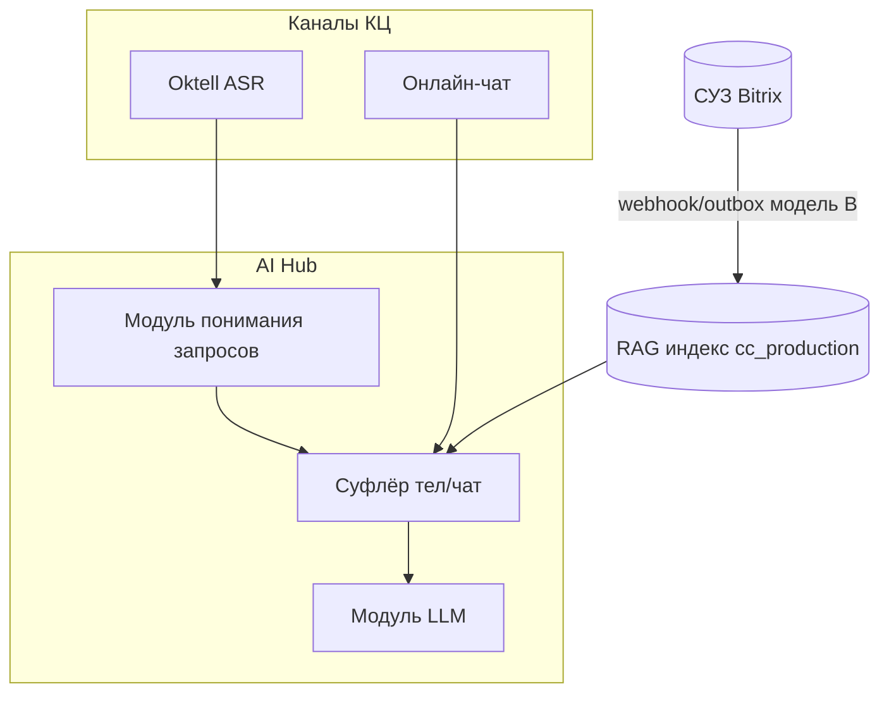
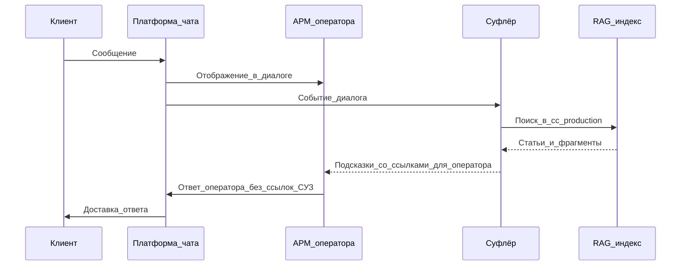
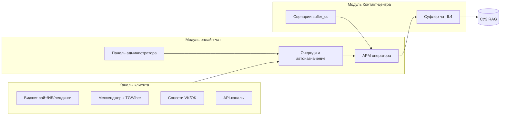
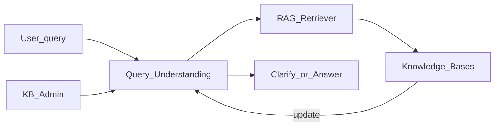
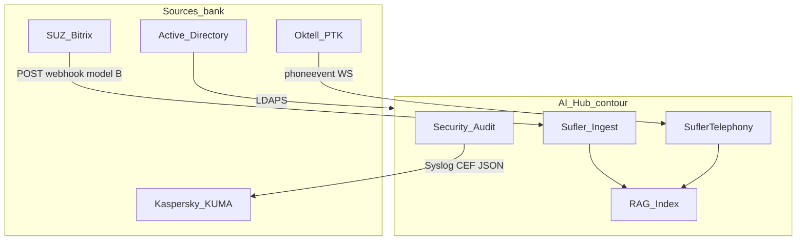
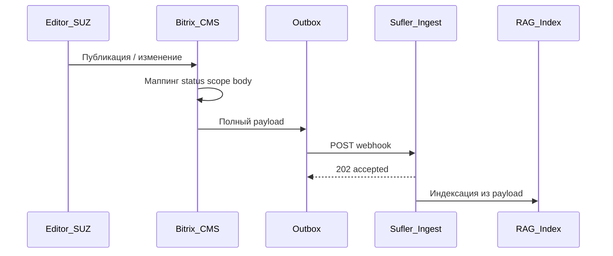
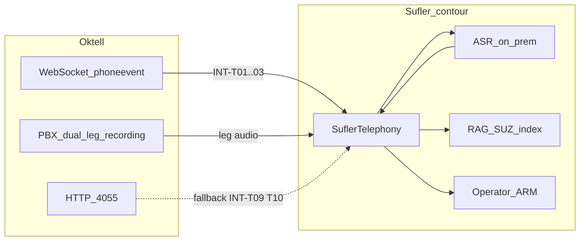
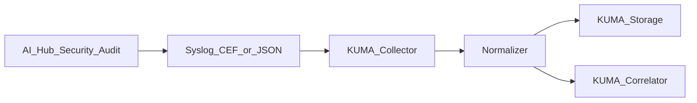

# Техническое задание на создание автоматизированной системы

**ПО на базе искусственного интеллекта для банковских процессов**

**Версия:** v1.3 (черновик) · **Дата:** 2026-06-26 · **Проект:** ПО на базе ИИ · **Договор:** № 14-03/2026 · **Заказчик:** ОАО «АСБ Беларусбанк» · **Исполнитель:** ООО «ГС Ритейл»

**Статус документа:** Итерация v1.3 — согласованная редакция; фокус: **описание реализации** (вход → механизм реализации → выход → приёмка), листовая трассировка ТТ, макеты canvas.

**Назначение:** единое согласуемое проектное ТЗ (этап 1 календарного плана, [Прил.2](../../sources/technical-requirements/prilozhenie-1.md)) на контур **AI Hub** (оболочка) и договорные модули **[Прил.1 §2.2]**: модуль LLM, модуль Контакт-центра, модуль ИИ-ассистент, модуль распознавания документов — и интеграции с системами банка.

**Модель поставки:** функциональность модулей **[Прил.1 §2.2]** и интеграций поставляется **единовременно** в рамках этапов 2–9 календарного плана **[Прил.2]**; деление на MVP, «первую волну» или последующие функциональные фазы **не применяется**.

**Нормативная база:** содержание — по **Приложению 1** к договору (приоритет); структура дополнена **ГОСТ 34.602-2020** — см. [I.1.1](#i11-соответствие-гост-34602-2020).

**Предшественник:** [tz-ai-hub-contour.md v1.1](tz-ai-hub-contour.md) — источник для переноса содержания.

**Справочные документы (не дублировать в v1.3):**

- **ТЗ AI Hub (contour) v1.1** → Parts I–V, VII
- **ТЗ платформы онлайн-чат** → Part II.5
- **ТЗ интеграции СУЗ ↔ RAG** → Part VI.1
- **ТЗ интеграции Oktell ↔ суфлёр** → Part VI.2
- **ТЗ ИИ-ассистент (Belarusbank)** → Part III (API)

---

## Содержание

### Часть 0. Реквизиты документа

- [0.1 Идентификация](#01-идентификация)
- [0.2 Основание разработки](#02-основание-разработки)
- [0.3 Стороны и контакты](#03-стороны-и-контакты)

### Часть I. Общие положения
Часть I задаёт единые правила, терминологию и архитектурный контекст для всего контура **AI Hub** и договорных модулей §2.2 Прил.1. Здесь фиксируются приоритет источников, матрица ролей §2.4, оболочка Hub, состав системы, требования ИБ и трассировка к календарному плану. Разделы I.1–I.10 используются как справочник при чтении Parts II–VII и приложений.

- [I.1 Правила и обозначения, принятые в документе](#i1-правила-и-обозначения-принятые-в-документе)
- [I.1.1 Соответствие ГОСТ 34.602-2020](#i11-соответствие-гост-34602-2020)
- [I.2 Контекст и цели](#i2-контекст-и-цели)
- [I.3 Глоссарий](#i3-глоссарий)
- [I.4 Матрица ролей и доступа](#i4-матрица-ролей-и-доступа)
 - [I.4.1 Роли Прил.1 (§2.4)](#i41-роли-прил1-§24)
 - [I.4.2 Дополнительные роли проекта](#i42-дополнительные-роли-проекта)
- [I.5 Оболочка AI Hub](#i5-оболочка-ai-hub)
- [I.6 Администрирование и настройки (сводка)](#i6-администрирование-и-настройки-сводка)
- [I.7 Состав системы](#i7-состав-системы)
- [I.8 Сводная таблица макетов UI](#i8-сводная-таблица-макетов-ui)
- [I.9 Информационная безопасность](#i9-информационная-безопасность)
- [I.10 Active Directory / LDAPS](#i10-active-directory--ldaps)

### Часть II. Модуль Контакт-центра (§2.2.2, §4)
Модуль Контакт-центра является центральным элементом автоматизации работы операторов банка. Он объединяет голосовой канал (телефония Oktell), текстовые каналы (онлайн-чат, мессенджеры) и интеллектуальные подсказки на базе LLM (суфлёр). Все подсказки формируются исключительно на основе СУЗ (через RAG-индекс) и предоставляются оператору в реальном времени для повышения качества обслуживания клиентов. Управление модулем осуществляется ролями согласно [I.4.1](#i41-роли-прил1-§24): администратор Контакт-центра, операторы, аналитики.

[Прил.1 §2.2.2]: модуль Контакт-центра включает модуль понимания запросов, интерфейсы для работы суфлёра (телефония и онлайн-чат), модуль онлайн-чат и функциональность мониторинга и отчётности (§4.7, модуль «Отчетность»).

- [II.0 Сроки и поручения по интеграциям (КЦ)](#ii0-поручения-протокола-встречи-2)
- [II.1 Общие положения (§4.1)](#ii1-общие-положения-41)
- [II.2 Модуль понимания запросов (§2.2.2.1, §4.2)](#ii2-модуль-понимания-запросов-2221-42)
- [II.3 Интерфейс для работы суфлёра — канал телефония (§2.2.2.2, §4.3.1)](#ii3-интерфейс-для-работы-суфлёра--канал-телефония-2222-431)
- [II.4 Интерфейс для работы суфлёра — онлайн-чат (§2.2.2.3, §4.3.2)](#ii4-интерфейс-для-работы-суфлёра--онлайн-чат-2223-432)
- [II.5 Модуль онлайн-чат (§2.2.2.4, §4.4)](#ii5-модуль-онлайн-чат-2224-44)
- [II.6 Модуль «Отчетность» (§4.7)](#ii6-модуль-отчетность-47)
- [II.7 Приёмка модуля Контакт-центра (UND-T, SUF-T, CHAT-T, RPT-T)](#ii7-приёмка-модуля-контакт-центра-suf-t-chat-t)

- [II.7.4 Нагрузочное тестирование КЦ](#ii74-нагрузочное-тестирование-кц)
- [II.7.5 RPT-T (отчётность §4.7)](#ii75-rpt-t-отчётность-47)
- [II.7.6 UND-T (модуль понимания запросов §4.2.1)](#ii76-und-t-модуль-понимания-запросов-421)

### Часть III. Модуль ИИ-ассистент (§2.2.3, §5)
Модуль ИИ-ассистент предоставляет сотрудникам банка (back-office) интеллектуальный чат с LLM во вкладке «Ассистент» оболочки AI Hub. Он поддерживает работу с внутренними и внешними источниками, генерацию документов, саммаризацию, RPA и SQL/код по политике ИБ. Модуль не предназначен для операторов Контакт-центра в штатной сессии; управление — ролями §2.4 п.8–10 и администратором базы знаний LLM (п.2).

[Прил.1 §2.2.3, §5]: интерфейс для работы модуля ИИ-ассистента — диалог с LLM, KB, QU §5.2, отчётность §5.4.

- [III.0 Сроки и поручения (модуль ИИ-ассистент)](#iii0-поручения-протокола-встречи-2)
- [III.1 Назначение и границы](#iii1-назначение-и-границы)
- [III.2 Роли](#iii2-роли)
- [III.3 Интерфейсы и макеты](#iii3-интерфейсы-и-макеты)
- [III.4 Пользовательские сценарии](#iii4-пользовательские-сценарии)
- [III.5 Функциональные требования](#iii5-функциональные-требования)
- [III.6 Настройки модуля](#iii6-настройки-модуля)
- [III.7 Интеграции и API](#iii7-интеграции-и-api)
- [III.8 Приёмка (ASS-T)](#iii8-приёмка-ass-t)
- [III.9 Модуль понимания запросов модуля ИИ-ассистент (§5.2)](#iii9-модуль-понимания-запросов-модуля-ии-ассистент-52)
- [III.10 Промпты и отчётность ассистента](#iii10-промпты-и-отчётность-ассистента)
- [III.11 Конфигурация LLM (ассистент)](#iii11-конфигурация-llm-ассистент)

### Часть IV. Модуль распознавания документов (§2.2.4, §6)
Модуль распознавания документов автоматизирует OCR/IDP для банковских документов (паспорта, договоры, выписки и др.) во вкладке «Документы» AI Hub. Pipeline: загрузка → классификация → извлечение полей → HITL → экспорт в системы банка. Развёртывание on-prem в изолированной сети; роли — §2.4 п.11–13.

[Прил.1 §2.2.4, §6]: модуль распознавания документов — OCR, IDP, отчётность §6.2, интеграция с LLM §6.1.1.

- [IV.0 Сроки и поручения (модуль OCR)](#iv0-поручения-протокола-встречи-2)
- [IV.1 Назначение и границы](#iv1-назначение-и-границы)
- [IV.2 Роли](#iv2-роли)
- [IV.3 Интерфейсы и макеты](#iv3-интерфейсы-и-макеты)
- [IV.4 Пользовательские сценарии](#iv4-пользовательские-сценарии)
- [IV.5 Функциональные требования](#iv5-функциональные-требования)
- [IV.6 Настройки модуля](#iv6-настройки-модуля)
- [IV.7 Интеграции](#iv7-интеграции)
- [IV.8 Приёмка (DOC-T)](#iv8-приёмка-doc-t)
- [IV.9 Информационная безопасность модуля](#iv9-информационная-безопасность-модуля)

### Часть V. Модуль LLM (§2.2.1, §3)
Модуль LLM — общий генеративный слой §2.2.1, используемый модулями Контакт-центра (`sufler_cc`), ИИ-ассистента (`assistant_bank`) и OCR. Part V фиксирует договорные рамки §3: контекст, RAG, параметры inference, KPI (≤500 символов, 1–2 с, галлюцинации ≤3%). Детальные платформенные контракты — этап 2; конфигурации по модулям — [II.3.5.2](#ii352-конфигурация-llm-контакт-центра-sufler_cc), [III.11](#iii11-конфигурация-llm-ассистент).

[Прил.1 §2.2.1, §3]: модуль LLM — генеративная модель, RAG, общие параметры для модулей §2.2.

- [V.1 Общие требования (§3)](#v1-общие-требования-3)
- [V.2 Конфигурация моделей и RAG (§3.3–3.5)](#v2-конфигурация-моделей-и-rag-33-35)

### Часть VI. Интеграции
Part VI описывает внешние контуры обмена AI Hub с системами банка: **СУЗ ↔ RAG** (модель B), **Oktell ↔ суфлёр** (модель T), **SIEM KUMA**. Приёмка интеграций (**INT-T**) отделена от SUF-T/CHAT-T. Аутентификация — [I.10](#i10-active-directory--ldaps). Детальные JSON-schema — в дочерних `tz-bitrix-rag-sufler.md` и `tz-oktell-sufler-telephony.md`.

[Прил.1 §7.1]: интеграция с ПТК КЦ, веб-сайтом, СУЗ, AD и иными системами банка.

- [VI.0 Общие положения](#vi0-общие-положения)
- [VI.1 СУЗ ↔ RAG](#vi1-суз--rag)
- [VI.2 Oktell ↔ суфлёр (телефония)](#vi2-oktell--суфлёр-телефония)
- [VI.3 SIEM / аудит (Kaspersky KUMA)](#vi3-siem--аудит-kaspersky-kuma)

### Часть VII. Закрытие
Part VII завершает ТЗ v1.3: состав работ по календарному плану **[Прил.2]**, контроль и приёмка этапов, подготовка объекта к вводу, документирование и реестр открытых вопросов для согласования с Заказчиком.

- [VII.1 Состав и содержание работ](#vii1-состав-и-содержание-работ)
- [VII.2 Контроль и приёмка](#vii2-контроль-и-приёмка)
- [VII.3 Подготовка объекта к вводу](#vii3-подготовка-объекта-к-вводу)
- [VII.4 Требования к документированию](#vii4-требования-к-документированию)
- [VII.5 Вопросы для согласования](#vii5-вопросы-для-согласования)

### Приложения

- [Приложение A. Лист согласования](#приложение-a-лист-согласования)
- [Приложение B. Реестр диалоговых сценариев КЦ (Прил.2)](#приложение-b-реестр-диалоговых-сценариев-кц-прил2)
- [Приложение C. Источники разработки](#приложение-c-источники-разработки)
- [I.7.1 Архитектура информационного обмена](#i71-архитектура-информационного-обмена)

---

# Часть 0. Реквизиты документа

## 0.1. Идентификация

| Поле | Значение |
| ------------------ | --------------------------------------------------------------------------------------------------------------- |
| Наименование АС | ПО на базе ИИ для банковских процессов |
| Версия ТЗ | v1.3 (черновик) |
| Дата | 2026-06-26 |
| Статус | Процесс согласования |
| Общий срок проекта | Не более 7 месяцев с даты подписания договора ([Прил.2](../../sources/technical-requirements/prilozhenie-1.md)) |

## 0.2. Основание разработки

Настоящее ТЗ разрабатывается в рамках **этапа 1** календарного плана договора № 14-03/2026: «Составление (разработка) Исполнителем Технического задания на основании технических требований Заказчика» — **20 рабочих дней** с даты подписания договора. Результат этапа — утверждённое сторонами ТЗ.

| Основание | Ссылка | Содержание |
| ----------------------------------- | ------------------------------------------------------------------------------------------ | --------------------------------------------------------------- |
| Договор | № 14-03/2026 | Предмет, сроки, стороны |
| Технические требования (Прил.1) | [prilozhenie-1.md](../../sources/technical-requirements/prilozhenie-1.md) | Требования к ПО §1–11, роли, модули |
| Календарный план (**Прил.2 договора**) | В составе prilozhenie-1.md | Этапы 1–9 внедрения |
| Эталонные сценарии КЦ (**Прил.2 к ТТ**, не путать с календарным планом) | [manifest.yaml](../../sources/technical-requirements/app2-scenarios/manifest.yaml) | CC-SCR-001…010 (минимум 50 сценариев к внедрению — §4.5.2.1 ТТ) |

## 0.3. Стороны и контакты

| Сторона | Организация | Роль в проекте | Контакт |
| ----------- | --------------------- | -------------------------------------------------------------- | ------------ |
| Заказчик | ОАО «АСБ Беларусбанк» | **ДРиРИТ** (Департамент разработки и развития ИТ), Центр кибербезопасности, КЦ — стенды, AD, СУЗ, Oktell, ИБ | *уточняется* |
| Исполнитель | ООО «ГС Ритейл» | Разработка ПО, ТЗ на интеграции, BelVPN | *уточняется* |

**Согласованные сроки подготовки контуров:** Исполнитель — спецификации интеграции СУЗ/Oktell и требования к тестовому серверу **T+20 раб. дней** от подписания договора; заявка BelVPN и данные сотрудников **T+21 раб. дней**; Заказчик — тестовый контур Bitrix **T+30 раб. дней** (тест Bitrix), тест Oktell с линией **T+45 раб. дней** (тест Oktell), ВМ по требованиям Исполнителя **T+28 раб. дней**.

---

# Часть I. Общие положения

Часть I задаёт единые правила, терминологию и архитектурный контекст для всего контура **AI Hub** и договорных модулей §2.2 Прил.1. Здесь фиксируются приоритет источников, матрица ролей §2.4, оболочка Hub, состав системы, требования ИБ и трассировка к календарному плану. Разделы I.1–I.10 используются как справочник при чтении Parts II–VII и приложений.

## I.1. Правила и обозначения, принятые в документе {#i1-правила-и-обозначения-принятые-в-документе}

**[Прил.1 §1–2, ГОСТ 34.602]: правила документирования, маркеры, трассировка §2.2**

Раздел I.1 определяет, как читать и согласовывать настоящее ТЗ v1.3: приоритет **[Прил.1]**, формат As-Is/To-Be, легенду статусов и соответствие структуры ГОСТ 34.602-2020. Он обеспечивает:

- Единые правила наименования модулей §2.2 и ролей §2.4 (дословно по договору)
- Таблицу трассировки §2.2 → разделы Parts II–V
- Легенду маркеров **[Прил.1]**, **[Исполнитель]**, **[Заказчик]**, As-Is/To-Be
- Ссылку на формат описания функции v1.3 ([I.1.2](#i12-формат-описания-функции-v13))

**Целевой эффект:** участники проекта одинаково интерпретируют требования, статусы и границы модулей при согласовании и приёмке.

Документ — **единое согласуемое ТЗ v1.3** на контур AI Hub. Приоритет источников:

1. **[Прил.1]** — договорные технические требования (главный источник содержания).
2. **As-Is** — описание функциональности, действующей в настоящее время (материалы заказчика, AD, Oktell, СУЗ); фиксирует ограничения интеграции.
3. **ГОСТ 34.602-2020** — полнота структуры ([I.1.1](#i11-соответствие-гост-34602-2020)); при расхождении с Прил.1 побеждает Прил.1.

Детальные FR/UC/критерии приёмки модулей переносятся из [tz-ai-hub-contour.md v1.1](tz-ai-hub-contour.md) и дочерних integration `tz-*.md` — в соответствующие разделы Parts II–VI. При переносе **проектные ярлыки v1.1** («Суфлёр», «Ассистент», «Документы» как имена Parts) заменяются на **договорные** названия §2.2 Прил.1.

### Правило наименования модулей, ролей

1. **Заголовки Parts и подразделов модулей** — **дословно** по **[Прил.1 §2.2]** (и §5–§6 для состава модулей ИИ-ассистент и распознавания документов).
2. **Роли §2.4** — **дословно** в [I.4.1](#i41-роли-прил1-§24); сокращения («КЦ», «Ассистент» как имя роли) в заголовках и FR **запрещены**.
3. **«AI Hub»** — только **оболочка** контура ([I.5](#i5-оболочка-ai-hub)), не имя договорного моду §2.2.
4. **«Суфлёр»** — термин §1 и имя **интерфейса** §2.2.2.2–2.2.2.3, не заголовок Part.
5. Дополнительные роли проекта (супервизор, аудитор и др.) — только [I.4.2](#i42-дополнительные-роли-проекта), не подменяют §2.4.

### Легенда маркеров

| Маркер | Значение |
| --------------------- | ------------------------------------------------------------------------------------------------------ |
| **[Прил.1]** | Требование Приложения 1 к договору |
| **[модуль LLM]** | Общий слой §2.2.1, §3 — Part V |
| **[Исполнитель]** | Реализует в рамках договора |
| **[Заказчик]** | AD, внешние системы, контент СУЗ, Oktell, ИБ |
| **As-Is** / **To-Be** | Текущее и целевое состояние — см. [I.3](#i3-глоссарий) |
| **TBD** | Значение параметра — см. [I.3](#i3-глоссарий) (термин **TBD**) |
| **Трассировка** | Сопоставление источников требований с разделами ТЗ — см. [I.3](#i3-глоссарий) (термин **Трассировка**) |

### Легенда статусов в таблицах

| Статус | Значение |
| ------------------- | --------------------------------------------------------------------------------------------------------------------- |
| **готово** | Требование, сценарий или критерий описаны в настоящем ТЗ; **не** означает реализацию в продукте или результат приёмки |
| **открыто** | Нужны решения или данные **Заказчика**, согласование на рабочей встрече (или согласование с ДИТ, ИБ, вендором, КЦ) |
| **перенос v1.1** | Текст переносится из [tz-ai-hub-contour.md v1.1](tz-ai-hub-contour.md) |
| **каркас** | Только структура раздела, содержание не заполнено |
| **закрыто текстом** | Требование отражено в тексте настоящего ТЗ |
| **проект** | Компонент в scope проекта; детализация — в указанном разделе ТЗ |
| **в работе** | Раздел или этап в процессе заполнения / согласования |

Под таблицами со статусом **открыто** — блок **«Открытые вопросы для Заказчика»** со ссылкой на [VII.5](#vii5-вопросы-для-согласования), где применимо.

### Таблица трассировки §2.2 → разделы ТЗ

| Пункт Прил.1 §2.2 | Дословное название | Раздел ТЗ v1.3 | Статус |
| ------------------- | ----------------------------------------------- | ------------------------------------------------------------------- | ------ |
| 2.2.1 | модуль LLM | [Part V](#часть-v-модуль-llm-§2221-§3) | готово |
| 2.2.2 | модуль Контакт-центра | [Part II](#часть-ii-модуль-контакт-центра-§222-§4) | готово |
| 2.2.2.1 | модуль понимания запросов | [II.2](#ii2-модуль-понимания-запросов-2221-42) | готово |
| 2.2.2.2 | интерфейс для работы суфлёра … канала телефония | [II.3](#ii3-интерфейс-для-работы-суфлёра--канал-телефония-2222-431) | готово |
| 2.2.2.3 | интерфейс для работы суфлёра … онлайн-чата | [II.4](#ii4-интерфейс-для-работы-суфлёра--онлайн-чат-2223-432) | готово |
| 2.2.2.4 | модуль онлайн-чат | [II.5](#ii5-модуль-онлайн-чат-2224-44) | готово |
| 2.2.3 | интерфейс для работы модуля ИИ-ассистента | [Part III](#часть-iii-модуль-ии-ассистент-§223-§5) | готово |
| 2.2.4 | модуль распознавания документов | [Part IV](#часть-iv-модуль-распознавания-документов-§224-§6) | готово |
| §4.7 (по тексту ТТ) | модуль «Отчетность» | [II.6](#ii6-модуль-отчетность-47) | готово |

### Перенос FR/UC из v1.1 (замена имён)

| v1.1 (tz-ai-hub-contour) | v1.3 (договорное имя) | Раздел |
| ------------------------ | ---------------------------------- | ---------- |
| Part II «Суфлёр» | интерфейс … суфлёра (тел.) + (чат) | II.3, II.4 |
| Part V «Онлайн-чат» | модуль онлайн-чат | II.5 |
| Part III «Ассистент» | модуль ИИ-ассистент | Part III |
| Part IV «Документы» | модуль распознавания документов | Part IV |
| VI.4 «Платформа LLM» | модуль LLM | Part V |
| — | модуль понимания запросов | II.2 |
| — | модуль «Отчетность» | II.6 |

| Пункт Прил.1 | Раздел ТЗ v1.3 | Сценарий (UC) | Критерий приёмки | Статус |
| ------------ | -------------- | ------------------- | ---------------- | ------ |
| §4.1 | II.1 | — | FR-CC-01…14 | готово |
| §4.2 | II.2 | UC-UND-01…02 | FR-UND/FR-ASR | готово |
| §4.3.1 | II.3 | UC-SUF-T01…T05 | SUF-T-01…14 | готово |
| §4.3.2 | II.4 | UC-SUF-C01…C04 | SUF-T-03…07, SUF-T-17 | готово |
| §4.4 | II.5 | UC-K/O/S/A/R (*22*) | CHAT-T-01…21 | готово |
| §4.5–4.6 | II.3.5 | UC-SCR-* | FR-SCR-01…11 | готово |
| §4.7 | II.6 | UC-R1…R2 | FR-RPT-01…12 | готово |

### I.1.2. Формат описания функции (v1.3) {#i12-формат-описания-функции-v13}

**[Прил.1 §4–6;]: блок **Вход → Механизм реализации → Выход (UI) → Приёмка****

Подраздел I.1.2 задаёт обязательный шаблон описания ключевых FR/UC модулей Контакт-центра (Part II): вместо дословного переноса ТТ каждая функция раскрывается как цепочка реализации для согласования с заказчиком.

**Целевой эффект:** таблицы FR/UC содержат развёрнутую колонку «Реализация» с листовой трассировкой к пунктам ТТ.

Договор — **кастомизация существующего ПО**. В v1.3 каждое ключевое FR/UC модуля Контакт-центра (Part II) описывается **не переносом текста ТТ**, а блоком реализации. Расшифровка меток блока и сокращений колонки «Реализация» — [I.3.1](#i3-формат-описания-реализации).

| Блок | Содержание |
| ---- | ---------- |
| **Вход** | Кто инициирует действие; канал (телефония / чат / виджет); входные данные (текст, ASR, идентификаторы клиента) |
| **Механизм реализации** | ASR → модуль понимания запросов → RAG по индексу СУЗ (**не** прямой HTTP к СУЗ) → LLM + промпт (`sufler_cc`) → политики КЦ |
| **Выход (UI)** | Что видит оператор/клиент; ссылка на макет [I.8](#i8-сводная-таблица-макетов-ui) / canvas |
| **Приёмка** | ID теста (SUF-T / CHAT-T); метрика; стенд ([II.7](#ii7-приёмка-модуля-контакт-центра-suf-t-chat-t)) |

**Колонки таблиц UC и FR (Part II–IV):**

**UC (пользовательские сценарии):**

| Колонка | Содержание |
| ------- | ---------- |
| **ID / UC** | Идентификатор сценария |
| **Наименование** | Краткое название (1 строка) |
| **Реализация** | Как работает: **Вход** → **Механизм реализации** → **Выход (UI)** → **Приёмка** (сжато; полный блок — [I.1.2](#i12-формат-описания-функции-v13)) |
| **Пункт в ТТ** | Листовой номер § ТТ |
| **Статус** | готово / открыто / VII.5 |

**FR (функциональные требования):**

| Колонка | Содержание |
| ------- | ---------- |
| **ID** | Идентификатор FR |
| **Описание** | Формулировка требования из ТТ (что должно быть) |
| **Реализация** | Как реализуется: **Вход** → **Механизм реализации** → **Выход (UI)** → **Приёмка** |
| **Пункт в ТТ** | Листовой номер § ТТ |
| **Статус** | готово / открыто / VII.5 |

**Колонки таблиц UC и FR (Part II–IV):**

**UC (пользовательские сценарии):**

| Колонка | Содержание |
| ------- | ---------- |
| **ID / UC** | Идентификатор сценария |
| **Наименование** | Краткое название (1 строка) |
| **Реализация** | Как работает: **Вход** → **Механизм реализации** → **Выход (UI)** → **Приёмка** (сжато; полный блок — [I.1.2](#i12-формат-описания-функции-v13)) |
| **Пункт в ТТ** | Листовой номер § ТТ |
| **Статус** | готово / открыто / VII.5 |

**FR (функциональные требования):**

| Колонка | Содержание |
| ------- | ---------- |
| **ID** | Идентификатор FR |
| **Описание** | Формулировка требования из ТТ (что должно быть) |
| **Реализация** | Как реализуется: **Вход** → **Механизм реализации** → **Выход (UI)** → **Приёмка** — развёрнуто, простым языком для согласования с заказчиком; сокращения — [I.3.1](#i3-формат-описания-реализации) |
| **Пункт в ТТ** | Листовой номер § ТТ |
| **Статус** | готово / открыто / VII.5 |

**Трассировка:** в таблицах FR/UC — колонка «Пункт в ТТ» с **листовым** номером (напр. §4.3.2.11, не §4.3.2).

## I.1.1. Соответствие ГОСТ 34.602-2020

**[ГОСТ 34.602-2020]: структура ТЗ на создание АС**

Раздел I.1.1 сопоставляет структуру документа с ГОСТ 34.602-2020 при сохранении приоритета содержания **[Прил.1]**. Он обеспечивает:

- Маппинг разделов ГОСТ (общие положения, назначение, требования, приёмка) на Parts 0–VII
- Краткое отражение требований ГОСТ §4 (надёжность, RPO/RTO, персонал) без ослабления ТТ
- Полноту структуры для согласования с ДРиРИТ

**Целевой эффект:** документ соответствует нормативным ожиданиям к ТЗ на АС и одновременно остаётся договорным по содержанию.

Структура документа согласована с **ГОСТ 34.602-2020** «Техническое задание на создание автоматизированной системы»; содержание требований — по **Приложению 1** (приоритет при расхождениях).

| Раздел ГОСТ 34.602 | Раздел настоящего ТЗ |
| --------------------------------------- | ------------------------------------ |
| 1. Общие положения | Часть 0, I |
| 2. Назначение и цели | I.2 |
| 3. Характеристика объекта автоматизации | I.3–I.4, I.7 |
| 4. Требования к системе | Части II–V (модули), VI (интеграции) |
| 5. Состав и содержание работ | VII.1 |
| 6. Порядок контроля и приёмки | VII.2, приёмка модулей |
| 7. Подготовка объекта к вводу | VII.3 |
| 8. Требования к документированию | VII.4 |
| 9. Источники разработки | Приложение C |

### I.1.1.1. Требования ГОСТ §4 (кратко)

**[Прил.1]** — без ослабления договорных требований:

| Подраздел ГОСТ §4 | Содержание в ТЗ v1.3 |
| ----------------- | -------------------- |
| Надёжность / доступность | On-prem, отказоустойчивость RAG/LLM — [V.1](#v1-общие-требования-3); SLA подсказок — [II.3.6.1](#ii3631-сквозной-бюджет-времени-asr--rag--llm) |
| RPO / RTO | Хранение транскриптов 1 год (FR-ASR-05); cold archive чата — [II.5.10](#ii510-дополнительные-функции-§444); детали prod — [VII.5](#vii5-вопросы-для-согласования) |
| Эксплуатация и ТО | [VII.4](#vii4-требования-к-документированию), руководства §11.1 |
| Численность и квалификация персонала | Обучение ≥3 админ., ≥5 пользов. — [VII.3](#vii3-подготовка-объекта-к-вводу) |
| Виды обеспечения | Лингвistic — §4.2/§4.3 RU/EN; программное — Parts II–V; техническое — [VI](#часть-vi-интеграции) |

## I.2. Контекст и цели

**[Прил.1 §2.1]: цели внедрения ПО на базе ИИ**

Раздел I.2 описывает бизнес-контекст проекта: цели оптимизации процессов банка, текущее состояние Контакт-центра (As-Is) и ключевые проектные решения по RBAC суфлёра. Он обеспечивает:

- Сопоставление As-Is / To-Be по телефонии, чату, СУЗ и нагрузке
- Фиксацию решения: оператор чата получает суфлёр только в АРМ, не во вкладке Hub
- Связь целей §2.1 с модулями Parts II–IV

**Целевой эффект:** заказчик и исполнитель разделяют понимание мотивации проекта и ограничений текущей инфраструктуры.

### Цели **[Прил.1 §2.1]**

Усовершенствовать и оптимизировать процессы банка, повысить эффективность работы пользователей путём внедрения инструментов на базе ИИ: модуль LLM, Контакт-центр (суфлёр телефония/чат, онлайн-чат), ИИ-ассистент, распознавание документов.

### As-Is — Контакт-центр 

| Тема | As-Is | To-Be |
| ------------------------ | ----------------------------------------------------------------------------------------------------------------------- | ----------------------------------------------------------------- |
| Телефония vs чат | Разные отделы и ПО; один оператор не ведёт звонок и чат одновременно | Единый **модуль Контакт-центра** в AI Hub, раздельные АРМ каналов |
| Очередь звонков | Общая очередь (межгород/моб./городской — одна очередь) | Сохранить совместимость с Oktell |
| Каналы чата | Telegram, Viber, VK — **одно окно** оператора; сайт и др. — отдельно | Виджет + мессенджеры по §4.4 ТТ |
| Источник ответов | **СУЗ** — основной; курсы, адреса — с корп. сайта; эскалация — старший оператор / контент-менеджеры | **RAG по СУЗ** для подсказок; ручной поиск в СУЗ/сайте **не исключается** |
| История клиента | **Только в рамках канала**; кросс-канальной истории нет | Единая история, summary, настраиваемый контекст — §4.1.12, §4.3.1.13, §4.3.2.11 |
| Робот / бот (Webim) | На **телефонии** — IVR-робот; в Webim бот **есть**, но **не задействован**; оператор ищет ответ в СУЗ вручную | Суфлёр автоматизирует поиск; оператор **может** обращаться к иным источникам (СУЗ, сайт) |
| Обратная связь оператора | Тематики обязательны (влияют на оценку); оценки подсказок LLM — внедрять с обучением | §4.3 ТТ: релевантность/полезность |
| Нагрузка телефонии | ~500 зв/ч сред., ~700 пик — **подтверждено** заказчиком | §4.8 ТТ; 75 одновременных операторов — нагрузочный тест §4.3.1.4 |
| Сценарии | Черновики скриптов в КЦ; эталон 10 тем — [Прил. B](#приложение-b-реестр-диалоговых-сценариев-кц-прил2); ≥50 к внедрению | Редактор сценариев в Hub |

### I.2.3. Ключевое решение по RBAC (суфлёр)

**«Суфлёр в работе»** — фактическое отображение подсказок оператору в канале (**отдельное окно** телефония или **панель АРМ** чата; **не** вкладка Hub). Оператор онлайн-чата получает суфлёр **только** в АРМ чата ([II.4](#ii4-интерфейс-для-работы-суфлёра--онлайн-чат-2223-432), [II.5](#ii5-модуль-онлайн-чат-§2223-§44)).

| Роль (§2.4) | Вкладки Hub «Ассистент» / «Документы» | Суфлёр в работе |
| -------------------------------- | ------------------------------------- | ----------------------------------------- |
| Оператор канала телефония (п. 4) | **нет** (не открывается в смене) | **Отдельное окно** (II-1…II-2, Oktell) |
| Оператор онлайн-чата (п. 5) | **нет** (не открывается в смене) | Правая панель **АРМ чата** (II-3, II-4) |
| Прочие роли §2.4 | по RBAC ([I.4](#i4-матрица-ролей-и-доступа)) | **—** (не применимо) |

### I.2.4. Ключевые проектные решения v1.3

Сводка решений, отражённых в настоящем ТЗ:

| Тема | Решение | Отражение в v1.3 | Статус |
| ---- | ------- | ---------------- | ------ |
| Описание реализации (вход → механизм → выход → приёмка) | Детализация, не копия ТТ | I.1.2, I.3.1, колонка «Реализация» FR/UC | готово |
| Онлайн-чат: 3 блока каналов | Мессенджеры / соцсети / API | [II.5.1.1](#ii511-три-блока-каналов-v13) | готово |
| Виджет: без ETA, тема опционально | Настройки админа | II.5.3.1, FR-CHAT-* | готово |
| АРМ: клиент/оператор, summary, история | Единая история и summary | II.4, II.5.4, FR-SUF-15, canvas «Онлайн-чат» | готово |
| Обратная связь, e-mail, лог правок | Логирование редакций оператора | II.5.10, FR-CHAT-*, post-chat | готово |
| Многоязычность RU/EN | LLM + отчётность | II.2, II.4, FR-SUF-14 | готово |
| Супервизор | Маршруты, очереди, UC | [II-8](#i8-сводная-таблица-макетов-ui), слайд 22, UC-S1…S3 | готово |
| ИБ виджета CSP/вложения | Правила вложений и домены | FR-CHAT-20, II.5 | готово |
| As-Is КЦ | Webim, процессы, каналы | I.2, II.0, II.5.1 | готово |
| **Суфлёр — отдельный интерфейс** | **Не** в одной оболочке с ассистентом/документами | I.5, FR-SUF-09/12, макеты II-1…II-3; **I-1 без суфлёра** | готово |
| Архитектурная схема | AI Hub, RAG, Oktell | [I.7.1](#i71-архитектура-информационного-обмена) | готово |
| Роли: read-only просмотр | Без роли «Аудитор» §2.4 | I.4.2 (супервизор) | готово |
| Нагрузочное тестирование | 75 оп., p95 ≤2 с | [II.7.4](#ii74-нагрузочное-тестирование-кц) | готово |
| Внутренний пользователь КЦ | Отдельный тест-диалог | II-KC, II.3.5.3 | готово |

## I.3. Глоссарий

**[Прил.1 §1]: термины и проектные уточнения**

Раздел I.3 содержит ключевые термины §1 дословно и проектные уточнения (AI Hub, `cc_production`, трассировка, INT-T). Он обеспечивает:

- Единый словарь для всех модулей и интеграций
- Ссылки на [I.3.1](#i3-формат-описания-реализации) для меток колонки «Реализация»
- Разграничение «Суфлёр» (интерфейс) и «модуль Контакт-центра» (Part II)

**Целевой эффект:** формулировки FR/UC трактуются однозначно.

Термины **[Прил.1 §1]** — **дословно** (полный перечень — [prilozhenie-1.md §1](../../sources/technical-requirements/prilozhenie-1.md)). Ниже — ключевые термины настоящего ТЗ; **трассировка** требований к разделам — см. термин **Трассировка** в блоке «Проектные уточнения». Уточнения из `docs/sources/` не заменяют определения §1.

| Термин (§1) | Определение (Прил.1) | Примечание в ТЗ |
| ------------------------------ | ------------------------------------------------------------------------- | --------------------------------------------- |
| **LLM** | большая языковая модель … | Part [V](#часть-v-модуль-llm-§2221-§3); §3 ТТ |
| **Актив** | компьютер, сетевой ресурс, СУБД, ПО … | §8–9 ИБ |
| **АНИС** | автоматизированная нормативно-информационная ПО … | внутренний источник ассистента — [III.6.3](#iii63-реестр-источников-данных), §5.1.4 |
| **База знаний LLM** | специализированный набор данных … | СУЗ, источники ассистента |
| **Банк** | ОАО «АСБ Беларусбанк» | Заказчик |
| **Веб-сайт банка (веб-сайт)** | [https://belarusbank.by/](https://belarusbank.by/) … | виджеты §4.4 |
| **Внешний источник данных** | … за пределами закрытого контура | §5 ИИ-ассистент |
| **Внутренний источник данных** | … в пределах закрытого контура | §5 ИИ-ассистент |
| **Галлюцинации** | генерация ответа … без подтверждения данными | ≤3% §3.6 |
| **Диалоговые сценарии** | набор готовых вопросов и предполагаемых ответов … | ≥50 к внедрению §4.5.2.1 |
| **Запрос** | голосовой или текстовый вопрос … в модуль LLM | II.2, III.9 |
| **ИИ-ассистент** | модуль взаимодействия пользователя с LLM … | Part III |
| **Канал телефония** | канал … Oktell … Контакт-центра | II.3, VI.2 |
| **Клиент** | физическое или юридическое лицо … | КЦ |
| **Онлайн-чат** | канал … текстовых сообщений … | II.5 |
| **Оператор онлайн-чата** | сотрудник … модуля онлайн-чат в Контакт-центре | роль §2.4 п.5 |
| **Оператор канала телефония** | сотрудник … канала телефония в Контакт-центре | роль §2.4 п.4 |
| **Пользователь** | сотрудник банка … любым из модулей ПО | §2.4 |
| **Промпты** | Задание (запрос, инструкция) … | III.10 |
| **Релевантность** | уровень соответствия ответа … запросу клиента (%) | обратная связь §4.3 |
| **Ретривер** | модуль поиска релевантной информации … | §3.5, VI.1 |
| **Саммаризация** | метод сокращения … до ключевых аспектов | §4.4 ТТ |
| **ПО** | программное обеспечение … на базе ИИ | объект настоящего ТЗ |
| **СУЗ** | ПО «Система управления знаниями» … | ~1732 статьи; API **нет** (As-Is) |
| **Суфлёр** | модуль, который помогает … оператору канала телефония и/или онлайн-чата … | **интерфейсы** II.3, II.4; не имя Part |

| **ИБ** | информационная безопасность (не «интернет-банкинг») | расшифровка в Part II.5, §8–9 ТТ |

**Проектные уточнения (не §1):**

| Термин | Определение | ТТ / примечание |
| ------------------------------------------ | ---------------------------------------------------------------------------------------------------------------------------------------------------------------------------------------------- | ----------------------------------------------------------------------------------------------------------------------------------------------------------------------------------------------------------------------- |
| **As-Is** | Описание функциональности, действующей в настоящее время (факты заказчика до внедрения; текущая инфраструктура и процессы) | Заголовки, колонки и блоки «As-Is» |
| **To-Be** | Описание функциональности после внедрения согласно настоящему ТЗ и **[Прил.1]** | Колонка «To-Be» в таблицах сравнения |
| **AI Hub** | Оболочка — единая точка входа к модулям | Проектное имя контура; [I.5](#i5-оболочка-ai-hub) |
| **рабочий индекс** (`cc_production`) | Production-индекс базы знаний Контакт-центра в RAG; отдельный от индексов ассистента | §4.5, [VI.1](#vi1-суз--rag); детали — [tz-bitrix-rag-sufler.md](../../integration/suz-bitrix-rag/tz-bitrix-rag-sufler.md) |
| **OWASP Top 10 for LLM Applications 2025** | Перечень технических мер защиты LLM-приложений (инъекции, утечки данных, небезопасные плагины и др.) | §8.15; [I.9.1](#i91-требования-информационной-безопасности-§8-тт) |
| **модуль Контакт-центра** | §2.2.2 — umbrella-модуль КЦ | Part II |
| **модуль «Отчетность»** | подсистема отчётов и мониторинга КЦ | §4.7; [II.6](#ii6-модуль-отчетность-47) |
| **Oktell / ПТК** | Телефония Контакт-центра, on-premise | v2.15.6.240503; MS SQL 2016 |
| **KUMA** | SIEM заказчика (Kaspersky UMA) | §9.1.9; [VI.3](#vi3-siem--аудит-kaspersky-kuma) |
| **INT-T** | Критерии приёмки интеграций | Отдельно от SUF-T (§4.6) |
| **TBD** | Требует уточнения в процессе дальнейшего конфигурирования и переноса на среду Заказчика | Маркер в таблицах (AD-группа, endpoint, контакт и т.п.); **не** означает отсутствие требования в **[Прил.1]** |
| **Трассировка** | Установление соответствия между пунктами **[Прил.1]** §2.2, §4–§6 и разделами настоящего ТЗ v1.3 | Таблицы и блоки «Трассировка … → …»; [I.1](#i1-правила-и-обозначения-принятые-в-документе) (§2.2), Parts II–IV, [VI.0.2](#vi02-трассировка-к-тт-и-срокам-интеграций) |

### I.3.1. Формат описания реализации {#i3-формат-описания-реализации}
**[I.1.2]: метки **Вход**, **Механизм реализации**, **Обеспечивается за счёт**, **Выход**, **Приёмка****

Подраздел I.3.1 расшифровывает сокращения и метки колонки «Реализация» в таблицах FR/UC (Parts II–IV) для бизнес-аудитории.

Метки и сокращения колонки **«Реализация»** в таблицах FR/UC (Part II–IV). Полный шаблон блока — [I.1.2](#i12-формат-описания-функции-v13).

| Термин | Определение | ТТ / примечание |
| ------ | ----------- | --------------- |
| **Вход** | Исходное событие, роль или данные, с которых начинается сценарий или проверка FR: кто инициирует действие, канал (телефония / чат / виджет), входные артефакты (текст, ASR, идентификаторы клиента) | Метка блока в колонке «Реализация»; [I.1.2](#i12-формат-описания-функции-v13) |
| **Механизм реализации** | Техническая цепочка обработки без описания UI: компоненты Hub, пайплайн (ASR → модуль понимания запросов → RAG → LLM), конфигурация, политики | Основная метка «середины» блока; типична для orchestration и data pipeline |
| **Обеспечивается за счёт** | Инфраструктурные, организационные или политические меры, которыми достигается требование: ИБ, сегментация сети, i18n, RBAC, CI/CD, audit log | Альтернативная метка блока «механизм», когда акцент на **средствах обеспечения**, а не на пайплайне обработки |
| **Реализовано посредством** | Конкретный элемент реализации: UI-компонент, embed-виджет, API-интеграция, отдельная панель Hub | Альтернативная метка блока «механизм», когда ключевой носитель — **интерфейс или интеграция** |
| **Выход** / **Выход (UI)** | Наблюдаемый результат для оператора, клиента или системы после обработки; в полном блоке I.1.2 — со ссылкой на макет [I.8](#i8-сводная-таблица-макетов-ui) / canvas | В сжатой колонке «Реализация» допускается **Выход** без «(UI)» |
| **Приёмка** | Критерий проверки выполнения FR/UC: ID набора тестов (SUF-T, CHAT-T, INT-T, ASS-T и др.), метрика, стенд | [II.7](#ii7-приёмка-модуля-контакт-центра-suf-t-chat-t); **INT-T** — см. блок «Проектные уточнения» |
| **Реализация** (колонка) | Сжатое описание «как работает» в одной ячейке таблицы FR/UC по схеме **Вход** → метка механизма → **Выход** → **Приёмка** | Не дублирует колонку «Описание» (формулировка ТТ) |
| **on-prem** / **on-premise** | Размещение ПО, моделей и данных в инфраструктуре банка (K8s/VM, закрытый контур), без публичного облака | §4.1.1, §4.1.4; **Oktell / ПТК** — см. «Проектные уточнения» |
| **разметка СУЗ для LLM** | Подготовка контента СУЗ для индекса `cc_production`: нормализация HTML, чанкинг, эмбеддинги, метаданные индекса — зона **Исполнителя** (§4.5.1.6); **не** создание метаданных в CMS и **не** редактирование статей контент-менеджерами КЦ | [VI.1.3.1](#vi131-разметка-суз-для-индексации-rag-4516) |
| **runtime** | Режим штатной эксплуатации: обработка запросов и диалогов в работающей системе (в отличие от deploy, ETL, обучения offline) | «runtime HTTP к СУЗ» — **запрещён**; обновление через RAG-индекс |
| **egress** | Исходящий сетевой трафик из защищённого сегмента контура банка | §4.1.4: egress допускается для **виджета онлайн-чата**; остальной модуль КЦ — без Интернет |
| **air-gapped** | Сегмент инфраструктуры без маршрута в сеть Интернет («изолированный контур») | FR-CC-04; синоним в тексте: «без доступа к сети Интернет» |
| **i18n** | Интернационализация пользовательского интерфейса (локализация строк, язык по умолчанию) | FR-CC-02: `ru` по умолчанию для UI модуля КЦ |
| **RBAC** | Role-Based Access Control — разграничение доступа по ролям §2.4; вкладки Hub без прав **не отображаются** | I.2.3; [I.4](#i4-матрица-ролей-и-доступа), [I.5](#i5-оболочка-ai-hub) |
| **audit log** | Журнал аудита действий пользователей и системных событий (блокировка клиента, доступ к данным, админ-операции) | §8–9 ТТ; выгрузка в SIEM — [VI.3](#vi3-siem--аудит-kaspersky-kuma) |
| **TLS** | Transport Layer Security — шифрование каналов связи между компонентами и клиентами | §8 ТТ; FR-CC-01 вместе с RBAC и политиками ИБ |
| **orchestration** | Координация цепочки сервисов и инструментов в одном запросе (QU → RAG → LLM; tools ассистента §5.1.30) | FR-CC-03; Part III — комбинированные источники |
| **CI/CD** | Continuous Integration / Continuous Delivery — сборка, тестирование и доставка обновлений Hub | FR-CC-10; regression SUF-T / CHAT-T после патча |
| **smoke (test)** | Минимальная проверка работоспособности («дымовой» тест) ключевых сценариев без полного регресса | В колонке «Приёмка»: «SUF-T smoke», «CHAT-T smoke», «модульный smoke» |
| **ASR** | Automatic Speech Recognition — автоматическое распознавание речи | Потоковое (streaming) распознавание on-prem в канале телефонии; [II.2.2](#ii22-asr-в-канале-телефония-422), [II.3](#ii3-интерфейс-для-работы-суфлёра--канал-телефония-2222-431) |
| **RAG** | Retrieval-Augmented Generation — поиск по индексу KB (`cc_production`) и подготовка контекста для LLM | Не прямой HTTP к СУЗ в runtime; [VI.1](#vi1-суз--rag), `рабочий индекс` — см. «Проектные уточнения» |
| **QU** | Query Understanding — модуль понимания запросов | [II.2](#ii2-модуль-понимания-запросов-2221-42), §4.2.1 ТТ |
| **ETL** | Extract-Transform-Load — загрузка и синхронизация данных СУЗ → RAG-индекс | Вне runtime суфлёра; обновление `cc_production` |
| **LLM** | См. таблицу §1 выше (термин **LLM**) | Part [V](#часть-v-модуль-llm-§2221-§3); определение §1 не дублировать |

## I.4. Матрица ролей и доступа

**[Прил.1 §2.4, §8.1]: 13 договорных ролей и RBAC Hub**

Раздел I.4 фиксирует минимальный набор из 13 ролей §2.4 дословно, дополнительные проектные роли и принципы отображения вкладок Hub. Он обеспечивает:

- Таблицу ролей с привязкой к разделам ТЗ и AD-группам (TBD — зона Заказчика)
- Разделение договорных ролей §2.4 и проектных ([I.4.2](#i42-дополнительные-роли-проекта))
- Основу RBAC для всех модулей и Центра настроек

**Целевой эффект:** доступ пользователей к функциям Hub соответствует договорной модели и политикам ИБ банка.

Минимальный набор ролей — **[Прил.1 §2.4]** (13 ролей, формулировки **дословно**). Сопоставление с AD-группами — зона Заказчика (**ДРиРИТ**); структура AD: [Структура_AD.docx](../../sources/active-directory/Структура_AD.docx), тестовый экспорт [BANK.ldif](../../sources/active-directory/BANK.ldif) (`DC=test,DC=asb`).

### I.4.1. Роли Прил.1 (§2.4)

**[Прил.1 §2.4]: 13 ролей — формулировки дословно**

Подраздел I.4.1 — единственный источник договорных наименований ролей; сокращения в заголовках и FR запрещены.

**Целевой эффект:** матрица AD и UI Hub настраиваются по согласованному списку ролей.

| № | Роль (ТТ §2.4, дословно) | AD-группа | Вкладки / права Hub | Разделы ТЗ | Статус |
| --- | --------------------------------------------- | -------------- | ----------------------------------- | ------------ | ------- |
| 1 | Администратор ПО | *TBD Заказчик* | Все настройки, интеграции, ИБ | Hub, I.5–I.6 | открыто |
| 2 | Администратор базы знаний LLM | *TBD* | Сценарии, промпты, пороги RAG | II, III, V | открыто |
| 3 | Администратор модуля Контакт-центра | *TBD* | модуль Контакт-центра, чат, очереди | Part II | открыто |
| 4 | Оператор канала телефония Контакт-центра | *TBD* | интерфейс суфлёра (тел.) | II.3 | открыто |
| 5 | Оператор онлайн-чата Контакт-центра | *TBD* | интерфейс суфлёра (чат), АРМ чата | II.4, II.5 | открыто |
| 6 | Внутренний пользователь Контакт-центра | *TBD* | Тестовый диалог LLM | II.2 / II.3 | открыто |
| 7 | Аналитик Контакт-центра | *TBD* | Отчёты, модуль «Отчетность» | II.6 | открыто |
| 8 | Администратор модуля ИИ-ассистент | *TBD* | модуль ИИ-ассистент, источники | Part III | открыто |
| 9 | Пользователь ИИ-ассистента | *TBD* | Чат ассистента | Part III | открыто |
| 10 | Аналитик ИИ-ассистента | *TBD* | Отчёты ассистента | Part III | открыто |
| 11 | Администратор модуля распознавания документов | *TBD* | OCR/IDP | Part IV | открыто |
| 12 | Пользователь модуля распознавания документов | *TBD* | Загрузка документов | Part IV | открыто |
| 13 | Аналитик модуля распознавания документов | *TBD* | Отчёты OCR | Part IV | открыто |

#### Открытые вопросы для Заказчика

| Ссылка | Вопрос | Ответственный |
| ------------------------------------------ | -------------------------------------------------------------------------------------------------- | ------------- |
| [VII.5](#vii5-вопросы-для-согласования) №4 | Имена AD-групп для **13 ролей §2.4**, параметры **LDAPS** prod, сопоставление ролей ТЗ ↔ группы AD | ДРиРИТ |
| I.4.1 п.1–13 | Атрибуты профиля УЗ (Department, mail и др.) для отображения в Hub | ДРиРИТ |

### I.4.2. Дополнительные роли проекта
**[Прил.1 §2.4]: дополнительные роли проекта (супервизор, аудитор)**

Дополнительные роли расширяют RBAC оболочки и операционную модель чата; они **не заменяют** роли §2.4.

Роли **вне** минимального набора §2.4 — для RBAC оболочки AI Hub и операционной модели v1.1; **не заменяют** договорные роли §2.4.

| Роль (проект) | AD-группа (пример v1.1) | Назначение | Разделы ТЗ | Статус |
| --------------------------------------------- | ----------------------- | --------------------------------- | ---------- | ----------- |
| Супервизор Контакт-центра | `BB_CC_Supervisor` | Наблюдение за очередями, АРМ чата | II.5 | открыто |
| Администратор диалоговых сценариев и промптов | *TBD* | Редактор сценариев §4.5.2; **= п.6 §2.4** «Внутренний пользователь Контакт-центра» для тест-диалога — см. [II.3.5.3](#ii353-интерфейс-внутреннего-пользователя-кц) | II.3 | готово |

### I.4.3. Матрица доступа (сводка)

Детальная матрица вкладок Hub — перенос из [tz-ai-hub-contour.md v1.1 §I.4](tz-ai-hub-contour.md). Принцип: **13 ролей §2.4** — обязательны; дополнительные роли §I.4.2 — по согласованию с Заказчиком.

**As-Is (AD):** доступ через **членство в группах**; атрибуты УЗ — First/Last name, Office (обяз.), Department, Company, Job Title, mail, telephone; группы — древовидная структура, именование согласуется с админами MS AD.

## I.5. Оболочка AI Hub

**[Проект AI Hub]: единая точка входа, FAB, панель, RBAC**

Раздел I.5 описывает оболочку **AI Hub** — shell для модулей §2.2, не путать с договорным названием модуля. Он обеспечивает:

- FAB и slide-in панель (~400 px) с минимальной шапкой
- Вкладки Hub: **только** «Ассистент» и «Документы»; суфлёр — **отдельный интерфейс** (не tab bar)
- RBAC: операторы КЦ в рабочей сессии **не** открывают Hub (§4.6.2.3)

**Целевой эффект:** операторы и администраторы работают в едином контуре без смешения каналов и модулей.

Единый shell для модулей §2.2. Детали вкладок — в Частях II–IV.

| Элемент | Параметры |
| ----------- | ----------------------------------------------------------------------------- |
| **FAB** | 56×56 px, правый нижний угол; бейдж уведомлений |
| **Панель** | ~400 px, slide-in; pin / minimize / close |
| **Шапка** | Минимальная: ФИО оператора (без «подключено к СУЗ», без лишних метаданных AD) |
| **Tab bar** | Ассистент · Документы — **отдельно** от **интерфейса суфлёра** (см. ниже); оператор КЦ **не** видит ассистент/документы в рабочей сессии |
| **Меню ≡** | «Центр настроек» → `/ai-hub/admin` (админ-роли); deep-link «KB · полное окно» |
| **Подвал** | Статус связи; «KB / СУЗ обновлена · время» |

**RBAC:** вкладки без доступа **не отображаются** (не disabled). Матрица — [I.4](#i4-матрица-ролей-и-доступа).

**Отдельный интерфейс суфлёра (v1.3)**

- **Телефония:** standalone-панель / окно «Суфлёр» (не вкладка Hub с ассистентом); макет — **Суфлёр · телефония** ([I.8](#i8-сводная-таблица-макетов-ui), II-1…II-2).
- **Чат:** правая панель АРМ ([II.4](#ii4-интерфейс-для-работы-суфлёра--онлайн-чат-2223-432)); макет — **Онлайн-чат и АРМ КЦ** (II-3).
- **Внутренний пользователь КЦ (§2.4 п.6):** тестовый диалог с LLM — **Тест-диалог внутреннего пользователя КЦ** (II-KC).

**Слайд 1. Макет интерфейса оболочки AI Hub**

*Макет: [I.8](#i8-сводная-таблица-макетов-ui) — canvas указан в колонке «Canvas».*

**Режим активной сессии КЦ** **[Прил.1 §4.6.2.3]:** оператор **не** смешивает суфлёр с Hub «Ассистент»/«Документы». **Телефония:** фокус в **отдельном окне** суфлёра ([FR-SUF-12](#ii34-функциональные-требования-суфлёр-телефония), макет II-1…II-2). **Чат:** фокус в **АРМ** с правой панелью суфлёра ([II.4](#ii4-интерфейс-для-работы-суфлёра--онлайн-чат-2223-432)); Hub-панель оператору чата **не показывается** в рабочей сессии.

## I.6. Администрирование и настройки (сводка)

**[Прил.1 §2.4, §3–§6]: сводка областей настройки по модулям**

Раздел I.6 — навигационная карта Центра настроек Hub: какие параметры (LLM, KB, сценарии, чат, OCR) настраивает каждая роль §2.4. Он обеспечивает:

- Таблицу «область настройки → пункт ТТ → роль → раздел ТЗ»
- Ссылки на детальные разделы Parts II–V
- Макет I-2 (canvas ai-hub-settings)

**Целевой эффект:** администраторы находят нужный раздел конфигурации без программирования.

| Область настройки | Пункт в ТТ | Роль §2.4 (основная) | Раздел ТЗ |
| ------------------------------------------------- | ---------------------------- | ----------------------------------------------------- | ------------------------------------------------------------------------------------------------------------------------------------------------------- |
| Общее управление ПО, интеграции, ИБ | §2.4 п.1 | Администратор ПО | I.5, I.9, VI |
| Параметры модели LLM (temperature, chunk, пороги) | §3.3.1–3.3.6 | Администратор базы знаний LLM (п. 2) | [V.2](#v2-конфигурация-моделей-и-rag-§33–35), [III.11](#iii11-конфигурация-llm-ассистент), [II.3.5.2](#ii352-конфигурация-llm-контакт-центра-sufler_cc) |
| Базы знаний LLM, промпты, сценарии КЦ | §4.1.8, §4.5.1–4.5.3 | п. 2; администратор диалоговых сценариев (§2.3 п.6) | [II.3.5](#ii35-редактор-диалоговых-сценариев), [III.10](#iii10-промпты-и-отчётность-ассистента) |
| Диалоговые сценарии (≥50), тестирование | §4.5.2.1–4.5.2.8 | п. 2, администратор диалоговых сценариев | [II.3.5.1](#ii351-редактор-диалоговых-сценариев) |
| Модуль онлайн-чат: каналы, очереди, АРМ | §4.4 | Администратор модуля Контакт-центра (п. 3) | [II.5](#ii5-модуль-онлайн-чат-2224-44) |
| Отчётность КЦ | §4.7 | Аналитик Контакт-центра (п. 7) | [II.6](#ii6-модуль-отчетность-47) |
| Базы знаний и промпты ассистента | §5.1.41, §5.3.1–5.3.3 | п. 2, Администратор модуля ИИ-ассистент (п. 8) | [III.6](#iii6-настройки-модуля), [III.10](#iii10-промпты-и-отчётность-ассистента) |
| Источники данных, RPA, политика SQL | §5.1.10, §5.1.30–31, §5.1.39 | п. 8 + ИБ | [III.6.3](#iii63-реестр-источников-данных)–[III.6.5](#iii65-политика-sql--код-§5139) |
| Шаблоны документов OCR, типы `doc_type` | §6.1.7, §6.1.13, §6.1.20 | Администратор модуля распознавания документов (п. 11) | [IV.6](#iv6-настройки-модуля) |
| Отчётность OCR, конструктор | §6.2.1–6.2.5 | Аналитик модуля распознавания документов (п. 13) | [IV.6.2](#iv62-отчётность-§62), [IV.8](#iv8-приёмка-doc-t) |
| Разметка СУЗ для LLM | §4.5.1.6 | [Исполнитель] (методика + выполнение; согласование с [Заказчиком]) | [VI.1.3.1](#vi131-разметка-суз-для-индексации-rag-4516) |

**Слайд 2. Макет интерфейса Центра настроек — навигация и конфигурация LLM**

*Макет: [I.8](#i8-сводная-таблица-макетов-ui) — canvas указан в колонке «Canvas».*

## I.7. Состав системы

**[Прил.1 §2.2, §7.1]: компоненты контура и внешние системы**

Раздел I.7 перечисляет все компоненты §2.2, оболочку Hub и внешние системы банка (Oktell, СУЗ, AD, KUMA). Он обеспечивает:

- Сводную таблицу компонент → назначение → раздел ТЗ → внешняя система
- Архитектуру информационного обмена ([I.7.1](#i71-архитектура-информационного-обмена))
- Принцип: суфлёр не обращается к СУЗ в runtime, только к RAG-индексу

**Целевой эффект:** архитектура контура прозрачна для согласования интеграций и стендов.

| Компонент (§2.2 / ТТ) | Назначение | Раздел ТЗ | Внешняя система | Статус |
| -------------------------------------------- | ------------------------------------------------------ | -------------------------------------------------- | ------------------------ | --------------------------------------------------------- |
| AI Hub (оболочка) | Единая точка входа, auth по AD | I.5 | Active Directory | проект |
| **модуль LLM** (§2.2.1) | Генеративная модель, RAG, общие параметры §3 | V | On-premise | §3 ТТ |
| **модуль Контакт-центра** (§2.2.2) | КЦ: понимание запросов, суфлёр, онлайн-чат, отчётность | II | Oktell, СУЗ, мессенджеры | проект |
| — модуль понимания запросов | ASR/NLP, транскрипты §4.2 | II.2 | Oktell MRCP | открыто |
| — интерфейс … суфлёра (телефония) | Подсказки оператору канала телефония | II.3 | Oktell, RAG/СУЗ | готово |
| — интерфейс … суфлёра (онлайн-чат) | Подсказки оператору онлайн-чата | II.4 | АРМ чата | готово |
| — **модуль онлайн-чат** | Виджеты, АРМ, очереди §4.4 | II.5 | Telegram, Viber, VK | проект |
| — модуль «Отчетность» | Мониторинг и отчёты §4.7 | II.6 | — | готово |
| **модуль ИИ-ассистент** (§2.2.3, §5) | ИИ для сотрудников банка | [Part III](#часть-iii-модуль-ии-ассистент-§223-§5) | AD, источники данных | готово |
| **модуль распознавания документов** (§2.2.4) | OCR/IDP §6 | IV | ЭДО, целевые системы | готово |
| Интеграция СУЗ ↔ RAG | Индекс базы знаний для подсказок | VI.1 | 1С-Битрикс (СУЗ) | API нет → модель B |
| Интеграция Oktell | События звонка, ASR, контекст | VI.2 | Oktell 2.15.6 | уточнение на этапе согласования |
| SIEM / аудит | Экспорт событий ИБ в **KUMA** | VI.3 | Kaspersky KUMA | проект |

### I.7.1. Архитектура информационного обмена {#i71-архитектура-информационного-обмена}

**[Прил.1 §2.2.2, §4.1–4.4]: архитектура информационного обмена — потоки КЦ (Oktell, онлайн-чат, RAG, LLM)**

Диаграмма I.7.1 показывает единый контур Hub для телефонии и чата; различие — только UI (АРМ vs панель суфлёра).

**Целевой эффект:** заказчик видит, что подсказки формируются из RAG-индекса `cc_production`, а не прямым HTTP к Bitrix.

**Принцип:** суфлёр **не** обращается к СУЗ напрямую в runtime — только к **RAG-индексу** ([VI.1](#vi1-суз--rag)). Обеспечивается за счёт **единого** контура Hub для чата и телефонии; различие — только UI (АРМ vs панель суфлёра).

## I.8. Сводная таблица макетов UI

**[Прил.1 §4.6, §5.1.18, §6.1.15]: реестр canvas-макетов**

Раздел I.8 — сквозной реестр слайдов UI (I-1…IV-5) с привязкой к разделам ТЗ и **названиям canvas-макетов** (открываются в Cursor IDE у Исполнителя; в комплект для Заказчика — PNG/PDF по запросу). Макеты иллюстрируют ТТ и не ослабляют договорные требования.

**Целевой эффект:** согласование интерфейсов идёт по нумерованным слайдам без дублирования макетов в тексте FR.

| ID | Слайд | Название макета | Раздел ТЗ | Canvas |
| ----- | ----- | --------------------------------------------------------------------------------------------- | -------------------------------------------------------------- | ------ |
| I-1 | 1 | Макет интерфейса оболочки AI Hub (**только** «Ассистент» + «Документы»; **без** суфлёра) | [I.5](#i5-оболочка-ai-hub) | **Оболочка AI Hub** · back-office |
| I-2 | 2 | Макет интерфейса Центра настроек — навигация и конфигурация LLM | [I.6](#i6-администрирование-и-настройки-сводка) | **Центр настроек AI Hub** |
| II-1 | 3 | Макет интерфейса для работы суфлёра — канал телефония (общий вид) | [II.3.2](#ii32-интерфейсы-и-макеты) | **Суфлёр · телефония** |
| II-2 | 4 | Макет интерфейса для работы суфлёра — подсказки на реплики клиента (канал телефония) | [II.3.2](#ii32-интерфейсы-и-макеты) | **Суфлёр · телефония** |
| II-3 | 5 | Макет интерфейса для работы суфлёра — онлайн-чат (панель в АРМ) | [II.4](#ii4-интерфейс-для-работы-суфлёра--онлайн-чат-2223-432) | **Онлайн-чат и АРМ КЦ** · «АРМ + суфлёр» |
| II-4 | 6 | Макет интерфейса редактора диалоговых сценариев — визуальная карта | [II.3.5.1](#ii351-редактор-диалоговых-сценариев) | **Центр настроек AI Hub** · «Редактор сценариев» |
| II-5 | 7 | Макет интерфейса тестирования диалогового сценария | [II.3.5.1](#ii351-редактор-диалоговых-сценариев) | **Центр настроек AI Hub** · «Тест сценария» |
| II-6 | 8 | Макет интерфейса виджета модуля онлайн-чат и формы входа | [II.5.3](#ii53-виджет-и-форма-входа-замечания-612) | **Онлайн-чат и АРМ КЦ** · «Виджет» |
| II-7 | 9 | Макет интерфейса рабочего места оператора онлайн-чата (АРМ) | [II.5.4](#ii54-арм-оператора-замечания-1315) | **Онлайн-чат и АРМ КЦ** · «АРМ» |
| II-KC | — | Тест-диалог внутреннего пользователя КЦ (§2.4 п.6) | [II.3.5.3](#ii353-интерфейс-внутреннего-пользователя-кц) | **Тест-диалог внутреннего пользователя КЦ** |
| III-1 | 10 | Макет интерфейса модуля ИИ-ассистента — чат с источниками | [III.3](#iii3-интерфейсы-и-макеты) | **ИИ-ассистент** · «Чат с источниками» |
| III-2 | 11 | Макет интерфейса модуля ИИ-ассистента — состояния интерфейса | [III.3](#iii3-интерфейсы-и-макеты) | **ИИ-ассистент** · «Состояния UI» |
| III-3 | 12 | Макет интерфейса модуля ИИ-ассистента — генерация документа | [III.3](#iii3-интерфейсы-и-макеты) | **ИИ-ассистент** · «Генерация документа» |
| III-4 | 13 | Макет интерфейса Центра настроек — базы знаний LLM и уточняющие вопросы | [III.6](#iii6-настройки-модуля) | **Центр настроек AI Hub** · «Базы знаний», «Понимание запросов» |
| III-5 | 14 | Макет интерфейса модуля ИИ-ассистента — саммаризация аудио и видео | [III.3](#iii3-интерфейсы-и-макеты) | **ИИ-ассистент** · «Саммаризация» |
| III-6 | 15 | Макет интерфейса модуля ИИ-ассистента — инструменты код/SQL и RPA | [III.6.5](#iii65-политика-sql--код-§5139) | **ИИ-ассистент** · «Инструменты» |
| III-7 | 16 | Макет интерфейса Центра настроек — реестр RPA | [III.6.3](#iii63-реестр-источников-данных) | **Центр настроек AI Hub** · «Источники данных (RPA)» |
| III-8 | 17 | Макет интерфейса модуля ИИ-ассистента — перевод RU↔EN | [III.3](#iii3-интерфейсы-и-макеты) | **ИИ-ассистент** · «Перевод RU↔EN» |
| IV-1 | 18 | Макет интерфейса модуля распознавания документов — очередь задач | [IV.3](#iv3-интерфейсы-и-макеты) | **Документы · OCR** · «Очередь» |
| IV-2 | 19 | Макет интерфейса модуля распознавания документов — загрузка документов | [IV.3](#iv3-интерфейсы-и-макеты) | **Документы · OCR** · «Загрузить» |
| IV-3 | 20 | Макет интерфейса модуля распознавания документов — проверка: просмотр текста поверх оригинала | [IV.3](#iv3-интерфейсы-и-макеты) | **Документы · OCR** · «Проверка (HITL)» |
| IV-4 | 21 | Макет интерфейса Центра настроек — типы документов | [IV.6](#iv6-настройки-модуля) | **Центр настроек AI Hub** · «Типы документов» |
| II-8 | 22 | Макет интерфейса супервизора — маршруты и очереди | [II.5.6](#ii56-сводная-таблица-uc-22-сценария) | **Онлайн-чат и АРМ КЦ** · «Супервизор» |
| II-9 | 23 | Макет интерфейса Post-chat — опрос после диалога | [II.5.10](#ii510-дополнительные-функции-§444) | **Онлайн-чат и АРМ КЦ** · «Post-chat» |
| II-10 | 24 | Макет интерфейса панели управления модуля онлайн-чат | [II.5.2](#ii52-роли-и-администрирование) | **Онлайн-чат и АРМ КЦ** · «Панель управления» |
| II-11 | 25 | Макет интерфейса оперативной панели КЦ | [II.6](#ii6-модуль-отчетность-47) | **Онлайн-чат и АРМ КЦ** · «Оперативная панель» |
| II-12 | 26 | Макет интерфейса аналитики модуля онлайн-чат | [II.6](#ii6-модуль-отчетность-47) | **Онлайн-чат и АРМ КЦ** · «Аналитика» |
| IV-5 | 27 | Макет интерфейса Центра настроек — экспорт документов | [IV.6](#iv6-настройки-модуля) | **Центр настроек AI Hub** · «Экспорт документов» |

**Сводка canvas (7 файлов у Исполнителя):** **Оболочка AI Hub** · **Центр настроек AI Hub** · **Суфлёр · телефония** · **Онлайн-чат и АРМ КЦ** · **Тест-диалог внутреннего пользователя КЦ** · **ИИ-ассистент** · **Документы · OCR**.

## I.9. Информационная безопасность

**[Прил.1 §8–9]: ИБ, протоколирование, on-premise**

Раздел I.9 агрегирует требования §8–9 ТТ: RBAC, LDAPS, OWASP LLM, аудит и передачу событий в SIEM. Он обеспечивает:

- Таблицу §8.1–8.16 → отражение в ТЗ v1.3
- Требования §9.1–9.3 протоколирования и защиты журналов
- On-premise и транспорт ([I.9.3](#i93-on-premise-и-транспорт-замечание-37))

**Целевой эффект:** внедряемая АС соответствует политикам ИБ банка и приказу ОАЦ № 66.

### I.9.1. Требования информационной безопасности (§8 ТТ)
**[Прил.1 §8.1–8.16]: разграничение доступа, пароли, OWASP LLM**

Подраздел I.9.1 трассирует каждый пункт §8 к разделам Hub и модулей; детализация LDAPS — [I.10](#i10-active-directory--ldaps).

Внедряемая АС обеспечивает выполнение требований информационной безопасности в соответствии с **[Прил.1 §8.1–8.16]**, а именно:

| Пункт ТТ | Требование (Прил.1) | Отражение в ТЗ v1.3 |
| -------- | -------------------------------------------------------------------------------------------------------------------------------------- | ----------------------------------------------------------------------------- |
| 8.1 | Разграничение прав доступа на основе ролевой модели | [I.4](#i4-матрица-ролей-и-доступа), [I.5](#i5-оболочка-ai-hub), FR по модулям |
| 8.2 | Идентификация и аутентификация; блокировка неиспользуемых УЗ | [I.10](#i10-active-directory--ldaps), §7.1 |
| 8.3 | Генерация и смена учётных данных; длина, сложность, срок, история паролей; смена со старым паролем; хранение паролей в защищённом виде | [I.10](#i10-active-directory--ldaps) (политика AD) |
| 8.4 | Изменение реквизитов доступа по умолчанию или их блокирование | [I.10](#i10-active-directory--ldaps) |
| 8.5 | Настройки парольной политики (длина, сложность, историчность, период смены) | [I.10](#i10-active-directory--ldaps) |
| 8.6 | Защита обратной связи при вводе пароля | [I.10](#i10-active-directory--ldaps) |
| 8.7 | Функционал недоступен неавторизованным пользователям | [I.5](#i5-оболочка-ai-hub), RBAC |
| 8.8 | Защита от подбора реквизитов; лимит неудачных попыток и блокировка | [I.10](#i10-active-directory--ldaps) |
| 8.9 | Блокировка по неактивности | [I.10](#i10-active-directory--ldaps) |
| 8.10 | Антивирус на серверной части — ПО Заказчика | [VII.3](#vii3-подготовка-объекта-к-вводу) |
| 8.11 | Обновления ПО, исправление ошибок и уязвимостей | Этапы 2, 7 календарного плана; [VII.1](#vii1-состав-и-этапы-работ) |
| 8.12 | Отсутствие уязвимостей в коде и библиотеках; статический/компонентный анализ; устранение до ввода | Этап 7 ИБ; [VII.1](#vii1-состав-и-этапы-работ) |
| 8.13 | Полномочное управление УЗ (создание, активация, блокировка, уничтожение) | [I.4](#i4-матрица-ролей-и-доступа), API §8.16 |
| 8.14 | Соответствие приказу ОАЦ № 66 (Прил.3 к Положению о ТКЗ) | Настоящий раздел; аттестация — этап 4 |
| 8.15 | Технические меры по **OWASP Top 10 for LLM Applications 2025** | [I.3](#i3-глоссарий); FR по модулям LLM |
| 8.16 | API управления пользователями и полномочиями | [I.4](#i4-матрица-ролей-и-доступа), интеграция AD |

### I.9.2. Протоколирование и аудит (§9 ТТ)
**[Прил.1 §9.1–9.3]: журналы, SIEM, защита записей**

Подраздел I.9.2 связывает §9 ТТ с [VI.3](#vi3-siem--аудит-kaspersky-kuma) и ролями аналитиков §2.4 п.7, 10, 13.

Внедряемая АС обеспечивает протоколирование и аудит в соответствии с **[Прил.1 §9.1–9.3]**, а именно:

**§9.1 — система протоколирования:**

| Пункт ТТ | Требование | Отражение в ТЗ v1.3 |
| -------- | -------------------------------------------------------- | ---------------------------------------------------------------------------------- |
| 9.1.1 | Функционирование в течение всего периода работы актива | [VI.3](#vi3-siem--аудит-kaspersky-kuma) |
| 9.1.2 | Однозначная идентификация событий с привязкой по времени | [VI.3](#vi3-siem--аудит-kaspersky-kuma) |
| 9.1.3 | Хранение событий ≥1 года (циклическое) | [VI.3](#vi3-siem--аудит-kaspersky-kuma) |
| 9.1.4 | Доступность событий за срок хранения | [VI.3](#vi3-siem--аудит-kaspersky-kuma) |
| 9.1.5 | Синхронизация времени актива | [VI.3](#vi3-siem--аудит-kaspersky-kuma), [VII.3](#vii3-подготовка-объекта-к-вводу) |
| 9.1.6 | Структурированный вид; экспорт/просмотр вне актива | [VI.3](#vi3-siem--аудит-kaspersky-kuma) |
| 9.1.7 | Защита информации при регистрации событий | [VI.3](#vi3-siem--аудит-kaspersky-kuma) |
| 9.1.8 | Реагирование на сбои регистрации | [VI.3](#vi3-siem--аудит-kaspersky-kuma) |
| 9.1.9 | Передача событий ИБ в SIEM (KUMA) | [VI.3](#vi3-siem--аудит-kaspersky-kuma) |

**§9.2 — защита при регистрации событий:**

| Пункт ТТ | Требование | Отражение в ТЗ v1.3 |
| -------- | ------------------------------------------------------------------- | --------------------------------------------------------- |
| 9.2.1 | Доступ к управлению механизмами регистрации — только уполномоченным | [I.4](#i4-матрица-ролей-и-доступа) п.1, ИБ |
| 9.2.2 | Просмотр журналов — по должностным обязанностям | RBAC; роль **аналитик** / read-only отчёты (§2.4 п.7, 10, 13) |
| 9.2.3 | Защита журналов от несанкционированной модификации и удаления | [VI.3](#vi3-siem--аудит-kaspersky-kuma) |
| 9.2.4 | Мониторинг целостности журналов | [VI.3](#vi3-siem--аудит-kaspersky-kuma) |
| 9.2.5 | Процедуры при переполнении журналов | [VI.3](#vi3-siem--аудит-kaspersky-kuma) |
| 9.2.6 | Предупреждение о сбоях регистрации | [VI.3](#vi3-siem--аудит-kaspersky-kuma) |

**§9.3 — состав событий:** перечни для ОС, СУБД, прикладного ПО, телекоммуникационного оборудования и СЗИ — по **[Прил.1 §9.3.1–9.3.5]**; профиль событий AI Hub и модулей — [VI.3.2](#vi32-сопоставление-с-протоколированием-§9), INT-T-AUD.

### I.9.3. On-premise и транспорт
**[Прил.1 §4.1.4, §5.1.26.2, §6.1.22]: изолированный контур**

Фиксирует размещение модулей в контуре банка; egress допускается только для виджета онлайн-чата.

| Требование | Пункт ТТ | Отражение в ТЗ v1.3 |
| ------------------------------------------------------------ | --------- | -------------------------------------------------------------------------------------------- |
| Работа без доступа к Интернету (модули КЦ, кроме онлайн-чат) | §4.1.4 | [FR-CC-04](#ii11-функциональные-требования) |
| Развёртывание в контуре Заказчика (ассистент) | §5.1.26.2 | [III.1](#iii1-назначение-и-границы) |
| Локальное развёртывание OCR, изолированная сеть | §6.1.22 | [FR-OCR-22](#iv5-функциональные-требования), [IV.9](#iv9-информационная-безопасность-модуля) |
| LDAPS для аутентификации | §7.1, §8 | [I.10](#i10-active-directory--ldaps) |

## I.10. Active Directory / LDAPS

**[Прил.1 §5.1.33–34, §7.1, §8]: аутентификация и AD-группы**

Раздел I.10 распределяет зоны ответственности по LDAPS, маппингу 13 ролей §2.4 на AD-группы и атрибутам профиля. Он обеспечивает:

- Матрицу «Исполнитель / Заказчик (ДРиРИТ)» по auth и группам
- Ссылку на As-Is структуру AD (`docs/sources/active-directory/`)
- Открытые вопросы prod LDAPS — [VII.5](#vii5-вопросы-для-согласования) №4

**Целевой эффект:** единый вход сотрудников банка в Hub через согласованные группы AD без локальных паролей.

| Зона ответственности | Исполнитель | Заказчик (ДИТ) |
| --------------------------------------------------- | ------------------------- | ------------------------------------------ |
| Модуль auth/authz по группам AD | Реализация в Hub | Создание и ведение групп под 13 ролей §2.4 |
| Маппинг ролей ТТ → AD-группы | Предложить матрицу (I.4) | Утвердить и назначить членство |
| Параметры LDAPS (хост, порт 636, сертификаты) | Подключение по параметрам | Предоставить endpoint и доверенные CA |
| Служебная УЗ для LDAP bind | Использование read-only | Выдать УЗ, ротация |
| Атрибуты профиля (Department, Company, Title, mail) | Отображение в Hub | Актуальность в AD |

**Структура AD (факт):** OU `BANK` → `Users` (древо подразделений), `Groups`, `Computers`; домен тестового экспорта `DC=test,DC=asb`. Параметры **продуктивного** LDAPS — *уточняется Заказчиком*.

---

# Часть II. Модуль Контакт-центра (§2.2.2, §4)

Модуль Контакт-центра является центральным элементом автоматизации работы операторов банка. Он объединяет голосовой канал (телефония Oktell), текстовые каналы (онлайн-чат, мессенджеры) и интеллектуальные подсказки на базе LLM (суфлёр). Все подсказки формируются исключительно на основе СУЗ (через RAG-индекс) и предоставляются оператору в реальном времени для повышения качества обслуживания клиентов. Управление модулем осуществляется ролями согласно [I.4.1](#i41-роли-прил1-§24): администратор Контакт-центра, операторы, аналитики.

**[Прил.1 §2.2.2]:** модуль Контакт-центра включает модуль понимания запросов, интерфейсы для работы суфлёра (телефония и онлайн-чат), модуль онлайн-чат и функциональность мониторинга и отчётности (§4.7, модуль «Отчетность»).

## II.0. Сроки и поручения по интеграциям (КЦ) {#ii0-поручения-протокола-встречи-2}

**Трассировка сроков и поручений → Part II** (сроки и ответственные — также [0.3](#03-стороны-и-контакты), [VII.1](#vii1-состав-и-этапы-работ), [VII.3](#vii3-подготовка-объекта-к-вводу)):

| Пункт | Договорённость | Отражение в Part II | См. также |
| --------------- | ----------------------------------------------------------------------------------------------- | -------------------------------------------------------------------------------------------------- | ----------------------------------------------------------------------------------------------------- |
| **1.1** | Спецификация интеграции СУЗ (поля, формат, триггеры) **и методика разметки** §4.5.1.6 — **T+20 раб. дней** от подписания договора (Исполнитель) | FR-SUF-01, FR-SUZ-01, FR-UND-08; зависимость подсказок от актуального индекса | [VI.1](#vi1-суз--rag), [VI.1.3.1](#vi131-разметка-суз-для-индексации-rag-4516) |
| **1.2** | Проработка API/webhook СУЗ заказчиком — **~до 25.06.2026** после 1.1 | блокирует закрытие INT-T на prod; FR-SUF-04 не затронут | [VII.5](#vii5-вопросы-для-согласования) №3 |
| **1.4** | Тестовый контур Bitrix (копия prod) — **T+30 раб. дней** (тест Bitrix) (Заказчик) | приёмка SUF-T/INT-T на стенде КЦ | [II.7.1](#ii71-suf-t-суфлёр), [VII.3](#vii3-подготовка-объекта-к-вводу) |
| **2.1** | Спецификация интеграции Oktell — **T+20 раб. дней** от подписания договора (Исполнитель) | FR-SUF-04, UC-SUF-T01, открытые вопросы [II.3.4](#ii34-функциональные-требования-суфлёр-телефония) | [VI.2](#vi2-oktell--суфлёр-телефония) |
| **2.3** | Тестовая линия Oktell в prod с маркировкой — **T+45 раб. дней** (тест Oktell) (ДИТ) | SUF-T-01, SUF-T-12, SUF-T-13; FR-SUF-04 | [II.3.4](#ii34-функциональные-требования-суфлёр-телефония), [VII.3](#vii3-подготовка-объекта-к-вводу) |
| **3.1–3.5** | Тестовый сервер, BelVPN, доступ сотрудников | **вне** функционала Part II | [VII.1](#vii1-состав-и-этапы-работ), [VII.3](#vii3-подготовка-объекта-к-вводу) |
| **4.2** | Дополнительное согласование модулей ИИ-ассистент и распознавания документов | **вне** Part II | Part III–IV, [VII.5](#vii5-вопросы-для-согласования) №8 |

**As-Is (Oktell/СУЗ):** (дополняет [I.2](#i2-контекст-и-цели) и разделы II–VI):

| Тема | As-Is | To-Be (Part II) |
| ---------------------------- | ------------------------------------------------------------------------------------- | ------------------------------------------------------------------------------ |
| **Oktell** | v2.15.6.240503, on-prem, MS SQL 2016; **тестового контура с линиями нет** | FR-SUF-04; тест по п. 2.3 |
| **Oktell ASR** | **Не встроен**; MRCP/REST/WebSocket — документация «по запросу», ответы «—» | FR-ASR-*, модель T [VI.2](#vi2-oktell--суфлёр-телефония) |
| **Oktell события** | Ответ «—» на WebSocket/события; PDF администратора описывает WS | [VII.5](#vii5-вопросы-для-согласования) №1 |
| **Oktell скрипты оператору** | **Нет** (всплывающих подсказок в Oktell) | Суфлёр Hub [II.3](#ii3-интерфейс-для-работы-суфлёра--канал-телефония-2222-431) |
| **Oktell API вызова** | **Нет** | События + ASR on-prem, не управление вызовом |
| **Oktell история** | idchain, время, номер в таблицах MS SQL; схемы БД **нет** | Контекст звонка для суфлёра — INT-T |
| **Oktell мониторинг** | Zabbix (серверы, БД) | [VI.2](#vi2-oktell--суфлёр-телефония) |
| **СУЗ API / webhook** | **API нет**; push-событий **нет** (обновления на главной) | Модель B [VI.1](#vi1-суз--rag); [VII.5](#vii5-вопросы-для-согласования) №3 |
| **СУЗ контент** | **1732** статьи; разделы до **5** уровней; версионность **есть** | FR-CC-06, FR-SUF-01 |
| **СУЗ обновления** | **10–30** изменений в среднем **в день**; раздел может правиться несколько раз в день | FR-UND-08, webhook/outbox [VI.1](#vi1-суз--rag) |
| **СУЗ поиск (операторы)** | Полнотекст + фильтры тег/категория | RAG-индекс для суфлёра, не замена UI СУЗ |

## II.1. Общие положения (§4.1)

**[Прил.1 §4.1]: общие требования к модулю Контакт-центра**

Раздел II.1 задаёт базовые требования к модулю КЦ: языки, on-prem, связь с модулем LLM, базы знаний и масштабируемость. Он обеспечивает:

- FR-CC-01…14: ИБ, i18n RU/EN, изоляция от Интернета (кроме чата)
- Привязку к RAG-индексу `cc_production` и политике «только СУЗ»
- Контекст As-Is КЦ (Oktell, Webim, СУЗ) перед таблицей FR

**Целевой эффект:** модуль КЦ развёрнут в контуре банка и готов к интеграции с Oktell, чатом и СУЗ по договорным KPI.

**As-Is** (сводка — [II.0](#ii0-поручения-протокола-встречи-2)):

- На телефонии клиента встречает **голосовой робот** (IVR); скилл-группы и маршрутизация по транскрипту/тематике.
- В Oktell **нет** скриптов/всплывающих подсказок оператору — суфлёр реализуется **отдельно** (вкладка Hub, [II.3](#ii3-интерфейс-для-работы-суфлёра--канал-телефония-2222-431)).
- В Webim бот **есть**, но **не задействован**; оператор вручную ищет ответ в СУЗ/поисковике.
- Оператор выбирает **тематику** обращения; для услуг суфлёр может быть вкл/выкл.
- Оценки подсказок LLM — **обязательны** (аналогия с обязательными тематиками звонка).
- Источник ответов — **СУЗ** (объём статей — справочно для нагрузки RAG, не KPI as-is); интеграция **модель B** → RAG ([VI.1](#vi1-суз--rag)).
- Кросс-канальной истории клиента **нет** (To-Be: §4.4 ТТ).

### II.1.1. Функциональные требования
**[Прил.1 §4.1.1–4.1.14]: FR-CC-01…14**

Таблица FR-CC описывает общие требования §4.1 в формате v1.3 (колонка «Реализация»).

| ID | Описание | Реализация | Пункт в ТТ | Статус |
| --- | --- | --- | --- | --- |
| FR-CC-01 | Модуль Контакт-центра должен функционировать в защищенной инфраструктуре банка, и обеспечивать соответствие требованиям конфиденциальности и защиты данных. | **Вход:** развёртывание модуля Контакт-центра в инфраструктуре банка. **Механизм реализации:** шифрование каналов, разграничение доступа по ролям, журнал аудита и политики ИБ по §8–9 ТТ. **Выход:** модуль работает в защищённом сегменте без выхода в Интернет (кроме виджета онлайн-чата). **Приёмка:** INT-T / аудит ИБ. | 4.1.1 | готово |
| FR-CC-02 | Интерфейс модуля Контакт-центра должен быть на русском языке. | **Вход:** оператор или администратор открывает любой экран модуля КЦ. **Реализовано посредством:** интерфейс по умолчанию на русском языке; локализованы Hub, АРМ и виджет. **Выход:** все надписи и сообщения отображаются на русском языке. **Приёмка:** CHAT-T / SUF-T smoke. | 4.1.2 | готово |
| FR-CC-03 | Модуль Контакт-центра должен работать на базе модуля LLM. | **Вход:** оператор или клиент задаёт вопрос в канале Контакт-центра. **Реализовано посредством:** система распознаёт запрос, ищет ответ в базе знаний `cc_production` и формирует ответ языковой моделью (промпт `sufler_cc`) в контуре банка. **Выход:** оператор или клиент получает подсказку или ответ из модуля LLM. **Приёмка:** SUF-T-01, CHAT-T-04. | 4.1.3 | готово |
| FR-CC-04 | Модуль Контакт-центра, за исключением модуля онлайн-чата, должен работать без доступа к сети Интернет. | **Вход:** штатная работа суфлёра, распознавания речи, поиска и языковой модели. **Реализовано посредством:** компоненты размещены в изолированном контуре банка; доступ в Интернет только у виджета онлайн-чата (§4.1.4). **Выход:** все части модуля КЦ, кроме чата, работают без доступа к сети Интернет. **Приёмка:** INT-T: проверка сетевой изоляции. | 4.1.4 | готово |
| FR-CC-05 | Разработчик может использовать в работе СУЗ через прямое взаимодействие с ней либо на основе СУЗ создать свою базу знаний LLM для использования ее в дальнейшем модулем Контакт-центра с возможностью обновления данных в режиме онлайн. | **Вход:** в СУЗ обновился контент (статья, FAQ, документ). **Механизм реализации:** изменения из Bitrix загружаются в индекс `cc_production` без прямых обращений к СУЗ во время диалога; переиндексация по расписанию. **Выход:** база знаний актуальна; операторы получают ответы по новым данным. **Приёмка:** UC-UND-01 на стенде Bitrix. | 4.1.5 | готово |
| FR-CC-06 | Модуль Контакт-центра должен предоставлять информацию только на основе СУЗ и не предоставлять иной информации по любым запросам клиентов вне тем деятельности Контакт-центра. | **Вход:** клиент задаёт вопрос вне тематики Контакт-центра. **Механизм реализации:** системный промпт и фильтр контента ограничивают поиск только базой `cc_production`; посторонние темы блокируются. **Выход:** клиент получает отказ или диалог передаётся оператору. **Приёмка:** ASS-T-23 / SUF-T: негативный сценарий. | 4.1.6 | готово |
| FR-CC-07 | Модуль Контакт-центра должен уметь предоставлять информацию на русском и английском языках, распознавать язык, используемый в сообщении клиентом, а также переключаться в рамках разговора с русского языка на английский и с английского языка на русский соответственно изменению языка запроса со стороны клиента. | **Вход:** клиент пишет или говорит на русском или английском языке. **Реализовано посредством:** система определяет язык реплики и формирует ответ на том же языке, с автопереключением при смене языка. **Выход:** ответ или подсказка на RU или EN в соответствии с языком клиента. **Приёмка:** SUF-T-12, CHAT-T-04. | 4.1.7 | готово |
| FR-CC-08 | Интерфейс управления базами знаний LLM для **КЦ** (§4.1.8, §4.5.1): создание/редактирование/удаление KB суфлёра; загрузка документов (.pdf, docx, …); управление структурой; **без программирования** — Центр настроек Hub → «Базы знаний КЦ» | **Вход:** администратор баз знаний КЦ открывает «Центр настроек» Hub. **Механизм реализации:** интерфейс управления базами суфлёра: создание, загрузка документов, индексация — без программирования (§4.5.1). **Выход:** администратор видит панель «Базы знаний КЦ». **Приёмка:** UC-UND-01, ASS-T-18 (админ KB). | 4.1.8, 4.5.1 | готово |
| FR-CC-09 | Модуль Контакт-центра должен поддерживать размещение произвольного числа виджетов с функционалом текстовых каналов для ведения переписки с пользователями, не ограничиваясь в количестве мест размещения (сайт, лендинг, М-банкинг, Интернет-банкинг и иные каналы банка). | **Вход:** администратор настраивает виджет онлайн-чата для новой точки размещения. **Реализовано посредством:** отдельный идентификатор виджета для сайта, М-банка или интернет-банка; код для встраивания и предпросмотр (II.5.3.1). **Выход:** администратор получает код встраивания и проверяет виджет в предпросмотре. **Приёмка:** CHAT-T-07, UC-A2. | 4.1.9 | готово |
| FR-CC-10 | Модуль Контакт-центра должен поддерживать регулярные обновления для совершенствования функционала и безопасности. | **Вход:** выпускается очередное обновление по политике банка. **Механизм реализации:** регулярная доставка патчей Hub с журналом изменений и регрессионным тестированием SUF-T / CHAT-T. **Выход:** обновления устанавливаются без простоя критичных каналов телефонии и чата. **Приёмка:** план сопровождения VII.1. | 4.1.10 | готово |
| FR-CC-11 | Модуль Контакт-центра должен поддерживать масштабируемость и способность обрабатывать увеличивающийся объем данных и документов при увеличении числа пользователей. | **Вход:** растёт число операторов и одновременных диалогов. **Механизм реализации:** горизонтальное масштабирование распознавания речи, поиска и модели; архивирование истории в долгосрочное хранилище. **Выход:** система выдерживает SLA p95 при 75 операторах (II.7.4). **Приёмка:** нагрузочное тестирование II.7.4. | 4.1.11 | готово |
| FR-CC-12 | Модуль Контакт-центра должен обеспечивать анализ сообщений и истории взаимодействия с клиентом, чтобы корректно интерпретировать запросы и находить релевантные ответы в базе знаний LLM. | **Вход:** клиент отправляет новое сообщение в диалоге. **Механизм реализации:** модуль понимания запросов учитывает историю обращения (FR-SUF-15) и ищет ответ в базе знаний. **Выход:** оператор видит релевантные подсказки с учётом контекста разговора. **Приёмка:** CHAT-T-13, SUF-T-01. | 4.1.12 | готово |
| FR-CC-13 | Модуль Контакт-центра должен включать в себя механизм загрузки и удаления текстовых документов в формате .pdf, docx, .rtf, .txt, .xlsx, .pptx, .png, .jpg, .jpeg для каждой выбранной базы знаний LLM с целью их последующей индексации и использования при генерации ответов модулем LLM. | **Вход:** администратор загружает или удаляет документ в выбранной базе знаний. **Механизм реализации:** документ разбивается на фрагменты и добавляется в векторный индекс соответствующей KB. **Выход:** файл доступен для поиска или удалён из индекса. **Приёмка:** UC-UND-01. | 4.1.13 | готово |
| FR-CC-14 | Модуль Контакт-центра должен указывать ссылки на источники, на основании которых сгенерирован конкретный ответ, с возможностью перехода по ссылкам на страницы подключаемой СУЗ и должна иметь возможность отключать отображение ссылок в определенных каналах. | **Вход:** система сформировала ответ языковой модели. **Механизм реализации:** в метаданных сохраняется ссылка на статью СУЗ; для клиента в чате ссылка скрыта политикой канала. **Выход:** оператор видит «СУЗ ↗» и может открыть источник; клиент в чате — без URL. **Приёмка:** SUF-T-02, CHAT-T-05. | 4.1.14 | готово |

## II.2. Модуль понимания запросов (§2.2.2.1, §4.2)

**[Прил.1 §2.2.2.1, §4.2]:** модуль понимания запросов — потоковое ASR (RU/EN), транскрипты, MRCP, отчётность

Модуль понимания запросов является ключевым компонентом Контакт-центра, отвечающим за преобразование голосовой речи клиентов и операторов в текст и семантическое сопоставление с базой знаний. Он обеспечивает:

- Распознавание речи в реальном времени (ASR) для звонков RU/EN
- Разделение речи оператора и клиента (диаризация)
- Поддержку двух языков и on-prem развёртывание QU
- Интеграцию с телефонией через MRCP v1/v2 ([VI.2](#vi2-oktell--суфлёр-телефония))
- Выгрузку транскриптов и нераспознанных записей в модуль «Отчетность»

**Целевой эффект:** операторы получают текстовую расшифровку диалога в реальном времени, а аналитики — данные для контроля качества ASR и QU.

**As-Is:** ASR **не встроен** в Oktell; offline-аналитика на телефонии — см. [VI.2](#vi2-oktell--суфлёр-телефония) и [II.0](#ii0-поручения-протокола-встречи-2). Статус интеграции MRCP/Oktell — **открыто** (согласование [VII.5](#vii5-вопросы-для-согласования) №1–2). **П. 2.1:** спецификация Oktell от Исполнителя — **T+20 раб. дней** от подписания договора.

### II.2.1. Общие требования (§4.2.1)
**[Прил.1 §4.2.1]: FR-UND — настройка QU без программирования**

Требования к модулю понимания запросов: обучение на KB, пороги релевантности, эскалация и уточняющие вопросы.

| ID | Описание | Реализация | Пункт в ТТ | Статус |
| --- | --- | --- | --- | --- |
| FR-UND-01 | Модуль Контакт-центра должен включать в себя модуль понимания запросов пользователей. Модуль понимания запросов должен предоставлять возможность его настройки (управления) работниками Заказчика без навыков использования языков программирования. | **Вход:** администратор базы знаний открывает Центр настроек Hub. **Механизм реализации:** встроенный модуль понимания запросов (QU); настройка без программирования §4.2.1.1. **Выход:** администратор видит панель «Модуль понимания». **Приёмка:** UC-UND-01. | 4.2.1.1 | готово |
| FR-UND-02 | Модуль понимания запросов должен работать исключительно в инфраструктуре банка без доступа в сеть Интернет. | **Вход:** любой запрос, поступающий в модуль понимания запросов. **Обеспечивается за счёт:** развёртывание on-prem; без обращений к внешним API. **Выход:** ответ языковой модели выполняется в контуре банка. **Приёмка:** INT-T. | 4.2.1.2 | готово |
| FR-UND-03 | Для обучения модуль понимания запросов должен использовать обучающую выборку документов баз знаний LLM -- накопленные в каждом документе баз знаний LLM примеры вопросов пользователей, каждый новый вопрос пользователя должен автоматически сопоставляться с накопленным массивом примеров вопросов и ответов. | **Вход:** новый вопрос пользователя в диалоге. **Механизм реализации:** автоматическое дополнение пар «вопрос–ответ» из диалогов в обучающую выборку KB. **Выход:** обучающая выборка обновлена. **Приёмка:** UC-UND-01. | 4.2.1.3 | готово |
| FR-UND-04 | Для работы модуля понимания запросов (распознавания синонимичных слов и словосочетаний, полной смены формулировки на семантически близкую) должно быть достаточно одной формулировки вопроса. | **Вход:** новый или эталонный вариант формулировки вопроса в обучающей выборке KB. **Механизм реализации:** сравнение запроса с эталоном по косинусной близости векторных представлений (embedding); для синонимов и перефразировок достаточно одного примера §4.2.1.4. **Выход:** семантическое совпадение с документом KB без обязательного совпадения по точному ключевому слову. **Приёмка:** модульные тесты модуля понимания запросов (QU). | 4.2.1.4 | готово |
| FR-UND-05 | Модуль понимания запросов должен поддерживать работу с русским и английским языками. | **Вход:** текст запроса на русском или английском языке. **Механизм реализации:** двуязычные модели модуля понимания запросов (RU/EN). **Выход:** распознанное намерение на обоих языках. **Приёмка:** SUF-T-12. | 4.2.1.5 | готово |
| FR-UND-06 | Модуль понимания должен автоматически учитывать порядок слов, использование синонимов или антонимов; результат каждого поиска в базе знаний LLM должен быть снабжен показателем релевантности в результатах поиска, отражающим вероятность того, что найденный документ базы знаний LLM соответствует вопросу пользователя. | **Вход:** поисковый запрос пользователя или администратора. **Механизм реализации:** семантическое ранжирование с показателем релевантности (%) в результатах. **Выход:** список документов с процентом релевантности. **Приёмка:** UC-UND-02. | 4.2.1.6 | готово |
| FR-UND-07 | Обучение модуля понимания не должно требовать указания ключевых слов или какой-либо другой ручной разметки примеров вопросов. | **Вход:** новые примеры вопросов в обучающей выборке. **Механизм реализации:** обучение без учителя с автоматической разметкой; без ручной разметки ключевых слов. **Выход:** модуль обучается без указания ключевых слов. **Приёмка:** UC-UND-01. | 4.2.1.7 | готово |
| FR-UND-08 | Обучение модуля понимания должно запускаться автоматически сразу после каждого обновления базы знаний LLM. | **Вход:** обновление базы знаний или поступление webhook из СУЗ. **Механизм реализации:** запуск задачи переобучения после переиндексации. **Выход:** в журнале зафиксировано «обучение запущено». **Приёмка:** UC-UND-01. | 4.2.1.8 | готово |
| FR-UND-09 | Добавление новых формулировок вопросов должно происходить полностью автоматически или через ручную валидацию администратором базы знаний LLM. | **Вход:** новая формулировка вопроса в диалоге. **Механизм реализации:** автодобавление или постановка на ручную валидацию (FR-UND-16). **Выход:** пример добавлен в выборку или отправлен на модерацию. **Приёмка:** UC-UND-01. | 4.2.1.9 | готово |
| FR-UND-10 | Список примеров в обучающей выборке должен также иметь возможность пополняться через загрузку СУЗ. | **Вход:** импорт FAQ и примеров из СУЗ. **Механизм реализации:** ETL: импорт FAQ и примеров из СУЗ в хранилище обучающей выборки. **Выход:** обучающая выборка пополнена. **Приёмка:** UC-UND-01. | 4.2.1.10 | готово |
| FR-UND-11 | При добавлении новых формулировок модуль понимания должен автоматически контролировать наличие повторяющихся примеров в обучающей выборке и при пополнении обучающей выборки повторяющимся примером вопроса заблокировать его добавление. | **Вход:** повторяющийся вопрос при пополнении выборки. **Механизм реализации:** проверка хеша и семантического сходства → отклонение дубликата. **Выход:** повторный пример заблокирован. **Приёмка:** модульные тесты модуля понимания запросов (QU). | 4.2.1.11 | готово |
| FR-UND-12 | Администратор базы знаний LLM должен иметь инструмент контроля над работой модуля понимания, который позволит определить какие документы будут найдены по запросу пользователя, с каким процентом релевантности и из какого примера вопроса. | **Вход:** администратор вводит тестовый запрос в интерфейсе KB. **Механизм реализации:** интерфейс предпросмотра результатов поиска §4.2.1.12. **Выход:** отображаются документы, процент релевантности и исходный пример вопроса. **Приёмка:** ASS-T-21 (аналог). | 4.2.1.12 | готово |
| FR-UND-13 | Администратор базы знаний LLM должен иметь возможность указать минимальную релевантность поиска, начиная с которой модуль Контакт-центра может использовать найденный документ для предоставления ответа пользователю. | **Вход:** администратор задаёт минимальный порог релевантности. **Механизм реализации:** конфигурация `min_relevance` для каждой KB. **Выход:** ниже порога срабатывает UC-UND-02. **Приёмка:** UC-UND-01. | 4.2.1.13 | готово |
| FR-UND-15 | Процесс обучения модуля понимания: журнал итераций, откат версии обучающей выборки | **Вход:** завершена очередная итерация обучения модуля понимания. **Механизм реализации:** версионируемый журнал обучения с возможностью отката выборки. **Выход:** доступны история итераций и откат выборки. **Приёмка:** UC-UND-01. | 4.2.1.15 | готово |
| FR-UND-16 | Ручная валидация новых примеров администратором с комментарием | **Вход:** автоматически добавлен новый пример вопроса. **Механизм реализации:** очередь модерации с полем комментария администратора. **Выход:** администратор утверждает или отклоняет пример. **Приёмка:** UC-UND-01. | 4.2.1.16 | готово |
| FR-UND-17 | Эскалация оператору при невозможности автоматического ответа | **Вход:** модуль понимания не может сформировать автоматический ответ. **Механизм реализации:** эскалация в канал оператора. **Выход:** оператор получает уведомление. **Приёмка:** UC-UND-02. | 4.2.1.17 | готово |
| FR-UND-14 | Должна быть возможность уточнения вопроса в случае, когда релевантности найденных документов недостаточно для прямого ответа, при этом должен предоставляться пользователю список вариантов ответа для выбора. | **Вход:** оценка релевантности найденных документов ниже порога. **Механизм реализации:** ветка сценария «уточняющие вопросы» (промпт `sufler_cc`). **Выход:** клиенту или оператору предлагаются кнопки-варианты или эскалация. **Приёмка:** UC-UND-02. | 4.2.1.14 | готово |

### II.2.2. ASR в канале телефония (§4.2.2)
**[Прил.1 §4.2.2]: FR-ASR — потоковое ASR, WER ≥90%, хранение 1 год**

ASR on-prem для телефонии: задержка ≤1 с, банковский словарь, QA-интерфейс для аналитиков.

| ID | Описание | Реализация | Пункт в ТТ | Статус |
| --- | --- | --- | --- | --- |
| FR-ASR-01 | В канале телефония должно быть обеспечено потоковое распознавание и преобразование русской и английской речи (слитной, разговорной, спонтанной) в текст независимо от пола и возраста говорящего. | **Вход:** активный звонок в Oktell с подключённым оператором. **Обеспечивается за счёт:** потоковое распознавание речи RU/EN on-prem. **Выход:** промежуточный и финальный транскрипт передаётся в модуль QU. **Приёмка:** SUF-T-01, INT-T. | 4.2.2.1 | готово |
| FR-ASR-02 | Должны использоваться модели распознавания, в составе которых должна быть акустическая модель, устойчивая по отношению к сложным акустическим условиям, и языковая модель с большим словарем, поддерживающим современную лексику. | **Вход:** аудиопоток активного звонка. **Механизм реализации:** акустическая и языковая модели с банковским словарём. **Выход:** устойчивое распознавание в сложных акустических условиях. **Приёмка:** тест WER (word error rate) ≥90%. | 4.2.2.2 | готово |
| FR-ASR-03 | При распознавании речи должна быть обеспечена высокая точность распознавания в каждом звонке -- не менее 90% при различных уровнях фонового шума, акцентах и при нагрузке не менее 70 звонков в обработке операторами канала телефония одновременно с возможностью масштабирования. | **Вход:** не менее 70 одновременных звонков на стенде. **Механизм реализации:** кластер воркеров ASR; нагрузочное тестирование. **Выход:** точность ≥90% при шуме и нагрузке. **Приёмка:** II.7.4 / INT-T. | 4.2.2.3 | готово |
| FR-ASR-04 | Должно быть обеспечено преобразование речи в текст в реальном времени с задержкой не более 1 секунды. | **Вход:** очередной фрейм аудиопотока. **Механизм реализации:** конвейер потокового распознавания с задержкой ≤1 с. **Выход:** текст в реальном времени отображается в панели суфлёра. **Приёмка:** SUF-T-01 p95. | 4.2.2.4 | готово |
| FR-ASR-05 | Разработчик должен обеспечить наполнение и хранение в преобразованных в текст диалогов в течение 1 года с возможностью просмотра с целью анализа качества преобразования и релевантности предоставления ответов, с автоматической самоочисткой за период хранения более 1 года. | **Вход:** завершённый телефонный диалог. **Механизм реализации:** хранение транскриптов 1 год; автоматическое удаление по TTL. **Выход:** интерфейс просмотра для контроля качества (QA). **Приёмка:** FR-ASR-10 UI. | 4.2.2.5 | готово |
| FR-ASR-06 | Должна быть обеспечена возможность обработки звука, поступающего из нескольких источников одновременно для улучшения качества распознавания голоса собеседника (клиента) в сложных акустических условиях (звонки других пользователей, повышенный фоновый шум, разговоры клиентов, эхо-сигнал и т.д.) — использование алгоритмов подавления шума и эха, автоматической адаптации к изменяющимся акустическим условиям в процессе разговора, включая изменение уровня громкости и характеристики окружающей среды. | **Вход:** двухканальная запись или зашумлённый канал. **Механизм реализации:** подавление шума, эхоподавление (AEC), автоматическая регулировка усиления (AGC). **Выход:** очищенная дорожка речи клиента. **Приёмка:** INT-T: акустическая лаборатория. | 4.2.2.6 | готово |
| FR-ASR-07 | Распознавание речи должно быть оптимизировано для условий телефонного канала. | **Вход:** аудиопоток телефонного канала PSTN/VoIP 8 kHz. **Механизм реализации:** акустическая модель, настроенная под телефонный канал. **Выход:** распознавание, оптимизированное для телефонии. **Приёмка:** INT-T. | 4.2.2.7 | готово |
| FR-ASR-08 | Должен быть обеспечен точный перевод речи в текст с расстановкой автоматической пунктуации. | **Вход:** непрерывный поток речи. **Механизм реализации:** постобработка с автоматической расстановкой пунктуации. **Выход:** транскрипт с пунктуацией. **Приёмка:** SUF-T-01. | 4.2.2.8 | готово |
| FR-ASR-09 | Преобразование речи в текст должно проводиться с поддержкой специализированных словарей (понимание банковской терминологии, аббревиатур, сокращений). Формирование и наполнение этих словарей должно осуществляться как в ручном режиме, так и путем загрузки файлов со словарями (.txt, .xlsx, .docx и иные форматы). | **Вход:** банковский термин или аббревиатура в речи. **Механизм реализации:** загрузка пользовательского словаря (.txt, .xlsx) и ручное редактирование. **Выход:** повышение веса словарных статей (повышение веса словарных статей (hotword boost)). **Приёмка:** admin ASR UI. | 4.2.2.9 | готово |
| FR-ASR-10 | Должны быть предусмотрены интерфейсы, в которых пользователь мог бы видеть распознанные и не распознанные записи диалогов с возможностью их прослушивания, датой и временем совершения звонка, и текстом транскрибации (при его наличии) — для оценки качества преобразования речи в текст, релевантности предоставленных ответов, дообучения ПО и наполнения словарей без участия разработчика. | **Вход:** аналитик контроля качества открывает интерфейс ASR. **Механизм реализации:** прослушивание записи, просмотр транскрипта и признака распознавания. **Выход:** разбор записей с низкой уверенностью распознавания. **Приёмка:** UC-REP-CC-02. | 4.2.2.10 | готово |
| FR-ASR-11 | Должна быть предоставлена возможность выгрузки нераспознанных записей диалогов для последующего анализа в модуль «Отчетность». | **Вход:** накопились нераспознанные сегменты речи. **Механизм реализации:** очередь экспорта → модуль «Отчётность». **Выход:** отчёт §4.7.3.2 для разбора качества ASR. **Приёмка:** UC-REP-CC-02. | 4.2.2.11 | готово |
| FR-ASR-12 | Должно быть обеспечено разделение речи оператора канала телефония и речи клиента для корректной передачи запроса в модуль LLM. | **Вход:** двухканальная запись разговора оператора и клиента. **Механизм реализации:** диаризация: разделение речи оператора и клиента. **Выход:** помеченные реплики передаются в LLM. **Приёмка:** SUF-T-01, FR-SUF-04. | 4.2.2.12 | готово |

### II.2.3. Пользовательские сценарии
**[Прил.1 §4.2.1.8–14]: UC-UND-01…02**

Сценарии администратора KB: пороги, переобучение после обновления СУЗ, ветка уточняющих вопросов.

| ID | Наименование | Реализация | Пункт в ТТ | Статус |
| --- | --- | --- | --- | --- |
| UC-UND-01 | Администратор базы знаний LLM задаёт пороги релевантности и запускает дообучение после обновления СУЗ | **Вход:** администратор базы знаний языковой модели открывает Центр настроек Hub. **Механизм реализации:** сохранение порогов модуля понимания запросов; webhook или outbox СУЗ запускает переиндексацию и автоматическое обучение модуля понимания. **Выход:** журнал обучения и актуальный статус индекса. **Приёмка:** UC-UND-01 на стенде с тестовым Bitrix. | 4.2.1.8–4.2.1.13 | готово |
| UC-UND-02 | При низкой релевантности система предлагает уточняющие вопросы клиенту/оператору по политике КЦ | **Вход:** реплика клиента или оператора получает оценку релевантности ниже заданного порога. **Механизм реализации:** поиск по индексу `cc_production`; ветка сценария «уточняющие вопросы» (промпт `sufler_cc`). **Выход:** список вариантов для клиента или эскалация оператору. **Приёмка:** тест-кейс с искусственно заниженным показателем релевантности. | 4.2.1.14–4.2.1.15 | готово |

### II.2.4. Дополнительные требования ASR (§4.2.2.13–19)
**[Прил.1 §4.2.2.13–19]: MRCP, метаданные звонка, масштабирование**

Интеграционные и эксплуатационные требования ASR; статус MRCP/WebSocket — открыто ([VII.5](#vii5-вопросы-для-согласования)).

| ID | Описание | Реализация | Пункт в ТТ | Статус |
| --- | --- | --- | --- | --- |
| FR-ASR-13 | Интеграция с телефонией через MRCP v1/v2 для потокового ASR | **Вход:** сессия MRCP от АТС Oktell. **Механизм реализации:** клиент MRCP v1/v2 (открыто VII.5). **Выход:** потоковое ASR из АТС. **Приёмка:** INT-T (открыто). | 4.2.2.13 | открыто |
| FR-ASR-14 | Передача метаданных звонка (ID, направление, длительность) в модуль понимания | **Вход:** событие начала звонка. **Механизм реализации:** передача call_id, направления и длительности в метаданные QU. **Выход:** обогащённый контекст сессии. **Приёмка:** SUF-T-01. | 4.2.2.14 | готово |
| FR-ASR-15 | Журналирование событий ASR для отчётности §4.7 | **Вход:** события распознавания речи в процессе звонка. **Механизм реализации:** структурированный журнал → показатели §4.7. **Выход:** журнал аудита событий ASR. **Приёмка:** CHAT-T-14 / INT-T. | 4.2.2.15 | готово |
| FR-ASR-16 | Настройка порогов confidence без программирования | **Вход:** администратор открывает настройки ASR в Hub. **Механизм реализации:** настройка порогов уверенности в интерфейсе Hub. **Выход:** пороги применяются без переразвёртывания. **Приёмка:** admin smoke. | 4.2.2.16 | готово |
| FR-ASR-17 | Экспорт обучающих примеров из нераспознанных записей | **Вход:** накопились неудачные образцы ASR. **Механизм реализации:** экспорт как кандидатов для дообучения. **Выход:** CSV для переобучения. **Приёмка:** UC-REP-CC-02. | 4.2.2.17 | готово |
| FR-ASR-18 | Интеграция с голосовыми подсистемами (Oktell) — см. [VI.2](#vi2-oktell--суфлёр-телефония) | **Вход:** интеграция с голосовой подсистемой Oktell. **Механизм реализации:** WebSocket/HTTP по спецификации VI.2 (открыто). **Выход:** события звонка и аудиопоток. **Приёмка:** INT-T (открыто). | 4.2.2.18 | открыто |
| FR-ASR-19 | Масштабирование ASR при ≥70 одновременных звонках | **Вход:** не менее 70 одновременных звонков. **Механизм реализации:** автомасштабирование ASR; HPA в Kubernetes. **Выход:** без деградации p95. **Приёмка:** II.7.4. | 4.2.2.19 | готово |
**UC-ASR-01:** звонок → dual-leg ASR → разделение реплик → транскрипт в суфлёр ([FR-SUF-04](#ii34-функциональные-требования-суфлёр-телефония)).

## II.3. Интерфейс для работы суфлёра — канал телефония (§2.2.2.2, §4.3.1)

**[Прил.1 §4.3.1, §4.6.2]: интерфейс суфлёра телефония — подсказки LLM оператору**

Интерфейс суфлёра на канале телефония — standalone-панель Hub (не вкладка с ассистентом), показывающая пары «реплика клиента → подсказка» на базе RAG и промпта `sufler_cc`. Он обеспечивает:

- Подсказки на каждую реплику клиента (≤2 карточки, ≤500 символов)
- Permalink СУЗ и доп. материалы только оператору
- Обязательную обратную связь §4.3.1.9 и режим «Консультация / Услуга»
- Редактор сценариев и конфигурацию LLM ([II.3.5](#ii35-настройки-редактор-сценариев-llm-контакт-центра))

**Целевой эффект:** оператор телефонии отвечает клиенту быстрее и точнее, опираясь на актуальную базу СУЗ без ручного поиска.

### II.3.1. Роли
**[Прил.1 §2.4 п.2–7]: роли КЦ для суфлёра телефонии**

Подмножество ролей §2.4; матрица AD — [I.4](#i4-матрица-ролей-и-доступа).

Роли — подмножество **[Прил.1 §2.4]**: п. 2–7 (администратор базы знаний LLM, администратор модуля Контакт-центра, оператор канала телефония Контакт-центра, оператор онлайн-чата Контакт-центра, внутренний пользователь Контакт-центра, аналитик Контакт-центра). Матрица AD — [I.4](#i4-матрица-ролей-и-доступа).

### II.3.2. Интерфейсы и макеты
**[Прил.1 §4.6.2]: лаконичный UI — лента пар «реплика → подсказка»**

Структура окна суфлёра, слайды II-1/II-2, canvas sufer-phone-mockup.

- **Структура окна (лаконичный UI, FR-SUF-13):** вертикальная лента **пар «реплика клиента → подсказка(и)»** — без дублирующих блоков «контекст» и отдельного полного транскрипта; каждая пара визуально связана (общая рамка / маркер), чтобы оператор сразу видел, **к какой реплике относится ответ** (§4.6.2.2.2).
- **На одну реплику:** не более **2** подсказок; основной текст ≤ 500 символов (§3.4); **% релевантности** — компактно; ссылка СУЗ — одна строка «СУЗ ↗», без развёрнутого блока статьи.
- **Обратная связь** по §4.3.1.9: три кнопки «Воспользовался / Не воспользовался / Неполный ответ» **под соответствующей подсказкой**; без кнопок «Отправить / Редактировать» (телефония — оператор отвечает **голосом**, §4.3.1).
- Режим «Консультация / Услуга» — в шапке панели; свернуть/развернуть окно суфлёра — §4.6.2.3.1.
- Подсказки **на каждую реплику клиента** (FR-SUF-11), не одна в начале диалога.

**§4.6.2.2.3 — процент релевантности на каждой подсказке**

- На **каждой** карточке подсказки отображается **целое число 0–100 %** (Pill в правом верхнем углу карточки, макет II-2, canvas `sufer-phone-mockup`).
- **Источник:** score retriever'а по индексу `cc_production` после QU-обработки реплики ([FR-UND-06](#ii21-функциональные-требования-модуль-понимания-запросов), [FR-SUF-02](#ii34-функциональные-требования-суфлёр-телефония)); нормализация в проценты — конфигурация профиля `sufler_cc` ([II.3.5.2](#ii352-конфигурация-llm-контакт-центра-sufler_cc), параметр `min_relevance` — [FR-UND-13](#ii21-функциональные-требования-модуль-понимания-запросов)).
- **Ранжирование:** карточки внутри пары «реплика → подсказки» упорядочены **сверху вниз по убыванию %**; top-1 ≥ `min_relevance`.
- **Ниже порога:** карточка **не показывается** либо отображается сообщение «запрос не распознан» / срабатывает [UC-UND-02](#ii22-пользовательские-сценарии-модуль-понимания-запросов) ([FR-SUF-16](#ii34-функциональные-требования-суфлёр-телефония)).
- **Приёмка:** [SUF-T-12](#ii71-suf-t-суфлёр-телефония), canvas sufer-phone (слайд II-2).

**§4.6.2.3 — управление окном суфлёра**

| Пункт ТТ | Реализация | FR / UC | Макет |
| -------- | ---------- | ------- | ----- |
| **4.6.2.3.1** | Окно суфлёра — **standalone** с системными кнопками **─** (свернуть в панель задач), **□** (развернуть/восстановить), **×** (закрыть). Закрытие **не завершает** звонок; лента и `call_id` сохраняются до `call.disconnected`. **Повторный вызов:** (а) лаунчер Hub **I-0** → «Суфлёр»; (б) иконка AI Hub в **системном трее** → «Открыть суфлёр»; (в) **автоматически** при `call.connected` ([FR-SUF-09](#ii34-функциональные-требования-суфлёр-телефония)). Полное **отключение** подсказок на время звонка — переключатель «Суфлёр: вкл/выкл» в шапке (отдельно от режима «Услуга»). | [FR-SUF-22](#ii34-функциональные-требования-суфлёр-телефония), [UC-SUF-T07](#ii33-пользовательские-сценарии-суфлёр-телефония) | II-1, canvas (сценарий «окно закрыто») |
| **4.6.2.3.2** | Окно располагается **рядом** с рабочим местом Oktell (пропорционально области оператора), **не перекрывает** транскрипт и элементы телефонии; допускается **закрепление** боковой панели контекста («Закреплена» / «Поверх окна» на макете). | FR-SUF-22 | II-1 |
| **4.6.2.3.3** | При переключении «**Услуга**» подсказки **скрываются**; повторное включение — переключение обратно на «Консультация» в шапке ([UC-SUF-T05](#ii33-пользовательские-сценарии-суфлёр-телефония), [FR-SUF-08](#ii34-функциональные-требования-суфлёр-телефония)). | FR-SUF-08, FR-SUF-12 | II-1 |

**Слайд 3. Макет интерфейса для работы суфлёра — канал телефония (общий вид)**

*Макет: [I.8](#i8-сводная-таблица-макетов-ui) — canvas указан в колонке «Canvas».*

**Слайд 4. Макет интерфейса для работы суфлёра — подсказки на реплики клиента (канал телефония)**

*Макет: [I.8](#i8-сводная-таблица-макетов-ui) — canvas указан в колонке «Canvas».*

### II.3.3. Пользовательские сценарии
**[Прил.1 §4.3.1]: UC-SUF-T01…T07, UC-SUF-N01…N02**

Звонок → ASR → подсказки в **отдельном окне**; оператор чата — суфлёр **только** в АРМ (Hub без суфлёра).

| ID | Наименование | Реализация | Пункт в ТТ | Статус |
| --- | --- | --- | --- | --- |
| UC-SUF-T01 | Звонок → поток ASR → **подсказки на каждую реплику клиента** в **отдельном окне** суфлёра (не Hub) | **Вход:** в Oktell начался активный звонок, поступает двухсторонний поток распознавания речи. **Механизм реализации:** модуль понимания запросов разделяет реплики; на каждую реплику клиента выполняется поиск и ответ языковой модели (`sufler_cc`). **Выход:** отдельная панель суфлёра с парами «реплика → подсказка» (не более двух). **Приёмка:** SUF-T-01, SUF-T-12. | 4.3.1.4, 4.6.2.2.2 | готово |
| UC-SUF-T02 | Оператор использует подсказку и даёт обратную связь | **Вход:** оператор телефонии озвучивает клиенту текст подсказки суфлёра. **Механизм реализации:** в событии сессии фиксируется факт использования подсказки. **Выход:** подсказка остаётся в ленте с отметкой об использовании. **Приёмка:** SUF-T-07. | 4.3.1 | готово |
| UC-SUF-T03 | Permalink СУЗ доступен только оператору канала телефония | **Вход:** оператор нажимает «СУЗ ↗» под карточкой подсказки. **Механизм реализации:** открывается постоянная ссылка из метаданных поиска; клиенту ссылка не передаётся. **Выход:** статья СУЗ открывается в новой вкладке или окне оператора. **Приёмка:** SUF-T-02. | 4.3.1 | готово |
| UC-SUF-T04 | Обратная связь «Полезно / Неполно / Неверно» по подсказке | **Вход:** оператор нажимает кнопки обратной связи под подсказкой (§4.3.1.9). **Механизм реализации:** событие `событие обратной связи (FeedbackEvent)` передаётся в модуль «Отчётность» (§4.7). **Выход:** зафиксирована оценка «Воспользовался / Не воспользовался / Неполный / Неверно». **Приёмка:** SUF-T-07. | 4.3.1, 4.6 | готово |
| UC-SUF-T05 | Режим «Услуга» — отключение или ограничение подсказок | **Вход:** оператор переключает режим «Консультация / Услуга» в шапке рабочего места. **Механизм реализации:** политика `sufler_cc` блокирует поиск для тематики «Услуга». **Выход:** подсказки скрыты или ограничены. **Приёмка:** сценарий CC-SCR с веткой «Услуга». | 4.3.1, 4.5.2 | готово |
| UC-SUF-T06 | На каждой подсказке отображается **% релевантности**; карточки ранжированы по убыванию | **Вход:** активный звонок; клиент произносит реплику по теме из `cc_production`; `min_relevance` задан администратором ([FR-UND-13](#ii21-функциональные-требования-модуль-понимания-запросов)). **Механизм реализации:** QU → retriever → LLM; score нормализуется в **0–100 %**; на каждой карточке — Pill «NN %»; сортировка сверху вниз ([FR-SUF-02](#ii34-функциональные-требования-суфлёр-телефония), [FR-UND-06](#ii21-функциональные-требования-модуль-понимания-запросов)). **Выход (UI):** ≤2 карточки с %; top-1 ≥ `min_relevance`; при score ниже порога — нет карточки или [UC-UND-02](#ii22-пользовательские-сценарии-модуль-понимания-запросов). **Приёмка:** SUF-T-12, canvas sufer-phone (II-2). | 4.6.2.2.3, 4.2.1.6 | готово |
| UC-SUF-T07 | Оператор **свернуть / развернуть / закрыть** окно суфлёра и **вызвать снова** в ходе звонка | **Вход:** активный звонок Oktell; окно суфлёра открыто ([FR-SUF-09](#ii34-функциональные-требования-суфлёр-телефония)). **Механизм реализации:** (1) **─** — свернуть в панель задач, звонок продолжается; (2) **□** — развернуть/восстановить; (3) **×** — закрыть окно, лента сохраняется; (4) повторный вызов — лаунчер **I-0**, **трей**, авто при новом `call.connected`; (5) toggle «Суфлёр: вкл/выкл» — полное отключение подсказок без закрытия окна (§4.6.2.3.1). Окно **не перекрывает** Oktell (§4.6.2.3.2). **Выход:** оператор контролирует видимость суфлёра; при «Услуга» — [UC-SUF-T05](#ii33-пользовательские-сценарии-суфлёр-телефония) (§4.6.2.3.3). **Приёмка:** SUF-T-13, SUF-T-16, canvas sufer-phone (сценарий «окно закрыто»). | 4.6.2.3.1, 4.6.2.3.2, 4.6.2.3.3 | готово |
| UC-SUF-N01 | Оператор онлайн-чата: Hub без суфлёра | **Вход:** оператор онлайн-чата (§2.4 п.5) в рабочей сессии. **Обеспечивается за счёт:** Hub **не содержит** суфлёр; подсказки — **только** правая панель АРМ (II.4). **Выход:** нет смешения с «Ассистент»/«Документы». **Приёмка:** SUF-T-05. | 4.3.2 | готово |
| UC-SUF-N02 | Внутренний пользователь КЦ: без суфлёра в Hub | **Вход:** внутренний пользователь (§2.4 п.6). **Обеспечивается за счёт:** Hub без суфлёра; тест-диалог — **отдельное окно** (II.3.5.3, II-KC). **Выход:** LLM без клиентского канала. **Приёмка:** SUF-T-06. | 4.3.1 | готово |

### II.3.4. Функциональные требования (суфлёр телефония)
**[Прил.1 §4.3.1]: FR-SUF-01…16**

Таблица FR-SUF: RAG-only, p95 ≤2 с, многоязычность, контекст истории клиента.

| ID | Описание | Реализация | Пункт в ТТ | Статус |
| --- | --- | --- | --- | --- |
| FR-SUF-01 | Подсказки только из production-индекса СУЗ (RAG) | **Вход:** реплика клиента в канале телефонии. **Механизм реализации:** RAG API только `cc_production`; без HTTP-обращений к Bitrix в режиме штатной эксплуатации. **Выход:** карточки подсказок в панели суфлёра. **Приёмка:** SUF-T-01. | 4.3.1 | готово |
| FR-SUF-02 | Ранжирование подсказок **от наибольшей к наименьшей** релевантности; при смене тематики диалога — пересчёт подсказок (§4.3.2.4 для чата) | **Вход:** новая реплика клиента или смена тематики диалога. **Механизм реализации:** retriever возвращает score; сортировка по убыванию; **% релевантности** на каждой карточке (§4.6.2.2.3); сброс при смене намерения. **Выход:** не более двух ранжированных карточек. **Приёмка:** SUF-T-01, SUF-T-12. | 4.3.1, 4.6.2.2.3, 4.3.2.4 | готово |
| FR-SUF-03 | Permalink СУЗ **+ доп. материалы** к подсказке (шаблоны, фрагменты документов, таблицы, изображения из контекста запроса) — только оператору (§4.3.1.7) | **Вход:** оператор нажимает «СУЗ ↗» под карточкой подсказки. **Механизм реализации:** метаданные RAG: постоянная ссылка и вложения §4.3.1.7. **Выход:** «СУЗ ↗» и дополнительные материалы видны только оператору. **Приёмка:** SUF-T-02. | 4.3.1.7 | готово |
| FR-SUF-04 | ASR **с момента соединения** клиента с оператором (§4.3.1.2); dual-leg; **разделение реплик** оператора и клиента (§4.2.2.12) для LLM | **Вход:** клиент и оператор соединены в звонке. **Механизм реализации:** двухканальное ASR с момента соединения; диаризация (открыто INT-T). **Выход:** поток транскрипта. **Приёмка:** INT-T (открыто). | 4.3.1.2, 4.2.2.12 | открыто |
| FR-SUF-05 | Чат: события диалога передаются в суфлёр (см. II.4) | **Вход:** клиент отправляет сообщение в онлайн-чат. **Реализовано посредством:** webhook → сервис суфлёра (II.4). **Выход:** событие поступает в конвейер обработки чата. **Приёмка:** SUF-T-03. | 4.3.2 | готово |
| FR-SUF-06 | Время формирования подсказки **1–2 с на каждую реплику** (p95 ≤2 с при **75** одновременных операторах на тестовом стенде КЦ) | **Вход:** зафиксирована финальная реплика ASR или сообщение чата. **Механизм реализации:** асинхронный RAG+LLM; p95 ≤2 с при 75 операторах. **Выход:** карточка подсказки формируется за ≤2 с. **Приёмка:** II.7.4, SUF-T-01. | 4.3.1.4 | готово |
| FR-SUF-07 | Обязательная обратная связь оператора по подсказкам | **Вход:** оператор использовал подсказку суфлёра. **Механизм реализации:** обязательная обратная связь (событие обратной связи (FeedbackEvent)) §4.3.1.9. **Выход:** кнопки оценки под подсказкой. **Приёмка:** SUF-T-07. | 4.3.1, 4.6 | готово |
| FR-SUF-08 | Режим «Услуга» отключает или ограничивает подсказки | **Вход:** оператор переключил режим «Услуга». **Механизм реализации:** политика `sufler_cc` блокирует или ограничивает RAG. **Выход:** подсказки скрыты или ограничены. **Приёмка:** UC-SUF-T05. | 4.3.1 | готово |
| FR-SUF-09 | **Отдельный интерфейс суфлёра** (не вкладка Hub) — телефония §2.4 п.4 | **Вход:** оператор канала телефонии §2.4 п.4 начинает смену. **Обеспечивается за счёт:** RBAC: **нет** вкладок «Ассистент»/«Документы» в Hub; суфлёр — **standalone-окно** (не FAB-панель Hub). **Выход:** оператор работает только в окне суфлёра. **Приёмка:** SUF-T-01, SUF-T-13. | 4.3.1 | готово |
| FR-SUF-10 | Чат: панель суфлёра в АРМ, не во вкладке Hub | **Вход:** оператор онлайн-чата открывает АРМ. **Реализовано посредством:** суфлёр в правой панели АРМ, не во вкладке Hub. **Выход:** панель суфлёра в рабочем месте чата. **Приёмка:** SUF-T-03. | 4.3.2 | готово |
| FR-SUF-11 | Подсказки формируются на **каждую новую реплику клиента** в активной сессии телефонии; привязка к строке транскрипта (§4.6.2.2.2); обновление карточек по мере поступления ASR — **не** одна подсказка в начале диалога | **Вход:** каждая новая реплика клиента в активном звонке. **Механизм реализации:** событие `asr.final`; подавление дублей 300 мс; привязка к строке транскрипта. **Выход:** пара «реплика → подсказка» в ленте. **Приёмка:** SUF-T-01, SUF-T-12. | 4.3.1.4, 4.6.2.2.2 | готово |
| FR-SUF-12 | Фокус оператора на суфлёре без смешения с ассистентом/документами | **Вход:** активный звонок Oktell (телефония) или активный диалог чата. **Реализовано посредством:** телефония — **отдельное окно** суфлёра; чат — АРМ с панелью суфлёра, **без** Hub «Ассистент»/«Документы». **Выход:** оператор не переключается на личный ассистент в той же сессии. **Приёмка:** SUF-T-13. | 4.6.2.3, 8.1 | готово |
| FR-SUF-14 | **Многоязычность:** автоопределение RU/EN (≥99%); для EN-запроса оператору три блока: (1) вопрос + перевод, (2) ответ EN для клиента, (3) ответ RU для проверки (§4.3.1.10–11) | **Вход:** реплика клиента на русском или английском языке. **Механизм реализации:** определение языка запроса ≥99%; для EN-запросов — три блока ответа. **Выход:** перевод, ответ EN для клиента и ответ RU для проверки оператором. **Приёмка:** SUF-T-12. | 4.3.1.10–11, 4.3.2.9 | готово |
| FR-SUF-15 | **Контекст истории клиента:** единая история по идентификаторам (телефон, channel ID); summary; настраиваемая глубина через промпты (§4.3.1.13–14, §4.3.2.11–12) | **Вход:** идентификатор клиента: телефон или channel ID. **Механизм реализации:** загрузка истории и вставка summary в промпт. **Выход:** контекст повторных обращений учтён. **Приёмка:** CHAT-T-13. | 4.3.1.13–14, 4.3.2.11 | готово |
| FR-SUF-16 | При нераспознанном запросе **телефонии** — сообщение оператору «запрос не распознан» (аналог FR-SUF-C03 для чата) | **Вход:** намерение запроса в телефонии не распознано. **Механизм реализации:** порог модуля QU не достигнут. **Выход:** оператор видит «запрос не распознан». **Приёмка:** SUF-T: негативный сценарий. | 4.3.1.12 | готово |
| FR-SUF-13 | **Лаконичный UI оператора:** структура «реплика клиента → подсказка(и)» в одном блоке; не более **2** подсказок на реплику; текст ≤ 500 символов; **% релевантности на каждой карточке** (§4.6.2.2.3); ссылка СУЗ компактно («СУЗ ↗»); обратная связь только §4.3.1.9; **нет** элементов чата («Отправить», «Редактировать») на телефонии | **Вход:** активная сессия телефонии; на каждую реплику клиента сформирован набор подсказок RAG+LLM. **Механизм реализации:** компактный интерфейс: ≤2 карточки, упорядоченные по убыванию score ([FR-SUF-02](#ii34-функциональные-требования-суфлёр-телефония)); на каждой — Pill **«NN %»** (§4.6.2.2.3); текст ≤500 символов; без элементов чата. Управление окном — [FR-SUF-22](#ii34-функциональные-требования-суфлёр-телефония) (§4.6.2.3). **Выход:** лента пар «реплика → подсказка(и) с %» без перегруза. **Приёмка:** SUF-T-12, SUF-T-14, canvas sufer-phone. | 4.6.2.2.2, 4.6.2.2.3, 4.6.2.3.1 | готово |
| FR-SUF-22 | **Управление окном суфлёра** оператором канала телефония (§4.6.2.3) | **Вход:** оператор в активном звонке; окно суфлёра открыто ([FR-SUF-09](#ii34-функциональные-требования-суфлёр-телефония)). **Механизм реализации:** (1) **свернуть/развернуть/закрыть** — системные кнопки title bar (§4.6.2.3.1); (2) **повторный вызов** после закрытия — лаунчер I-0, трей, авто при `call.connected`; (3) **отключение подсказок** — toggle «Суфлёр: вкл/выкл» в шапке без завершения звонка; (4) **размещение** — окно не перекрывает Oktell (§4.6.2.3.2); (5) режим «**Услуга**» — §4.6.2.3.3 ([FR-SUF-08](#ii34-функциональные-требования-суфлёр-телефония)). **Выход:** оператор управляет видимостью и доступностью суфлёра в ходе разговора. **Приёмка:** SUF-T-13, SUF-T-16, UC-SUF-T07. | 4.6.2.3.1, 4.6.2.3.2, 4.6.2.3.3 | готово |

#### Открытые вопросы для Заказчика

Исходные материалы `**[docs/sources/oktell/](../../sources/oktell/)`** достаточны для **As-Is** (версия 2.15.6, MS SQL, IVR, отсутствие встроенного ASR) и для черновика интеграции ([VI.2](#vi2-oktell--суфлёр-телефония), [tz-oktell-sufler-telephony.md](../../integration/oktell-sufler-telephony/tz-oktell-sufler-telephony.md)). Статус **открыто** у FR-SUF-04 означает: **нет согласованной спецификации интеграции и подтверждения на контуре банка**, а не отсутствие документов как таковых.

**Уже в `[docs/sources/oktell/](../../sources/oktell/)`:**

| Документ | Что даёт для ТЗ |
| ----------------------------------------------------------------------------------------------------------------------------------------- | --------------------------------------------------------------------------------------------------------- |
| Материалы заказчика (As-Is Oktell) | Нет тестового контура, ASR не встроен, «событийная модель не поддерживает», MRCP/REST «по запросу» |
| [Руководство_Администратора_2026.pdf](../../sources/oktell/Руководство_Администратора_2026.pdf) | WebSocket, HTTP :4055, MRCP v1/v2; запись **в 2 файла** (dual-leg) |
| [Описание функциональных возможностей системы_2026.pdf](../../sources/oktell/Описание%20функциональных%20возможностей%20системы_2026.pdf) | ПТК КЦ: REST, MRCP, запись, интеграции — уровень возможностей |

**Противоречие источников (требует техсессии):** материалы заказчика — «событийная модель не поддерживает»; PDF администратора — WebSocket с push-событиями. См. [VII.5](#vii5-вопросы-для-согласования) №1.

| Ссылка | Вопрос | Ответственный |
| ------------------------------------------------------ | ----------------------------------------------------------------------------------------------------------------------------------------------------------------------------------------- | ------------------- |
| FR-SUF-04 / [VII.5](#vii5-вопросы-для-согласования) №1 | Целевой формат INT-T: **WebSocket** (`phoneevent_`*) vs **HTTP :4055** vs иной — с учётом ответа «событийная модель не поддерживается» | ДРиРИТ + вендор Oktell |
| FR-SUF-04 / [VII.5](#vii5-вопросы-для-согласования) №2 | Закрытие §4.2.2: **MRCP v2** (поток из Oktell) vs **dual-leg ASR on-prem** у суфлёра ([модель T](../../integration/oktell-sufler-telephony/tz-oktell-sufler-telephony.md)); задержка ≤1 с | Исполнитель + ДИТ |
| FR-SUF-04 | Dual-leg: включена ли запись **2 файла на коммутацию** в prod; latency доступа leg-файлов / аудио для ASR | ДРиРИТ + админ Oktell |
| FR-SUF-04 | Направление Web-интеграции (Oktell→CRM / CRM→Oktell), URL, сервисная УЗ Web-API | ДРиРИТ |
| FR-SUF-04 | Тестовая линия в prod с маркировкой (согласованные сроки, **T+45 раб. дней** (тест Oktell)) | ДРиРИТ |

**Запросить у ДИТ / вендора Oktell** (в `[oktell/README.md](../../sources/oktell/README.md)` — ожидаемые, **ещё не приложены**):

- **Руководство по интеграции** Oktell (полное): `phoneevent_`*, `subscribeevent`, JSON-схемы сообщений
- Подтверждение конфигурации **dual-leg** записи и способ доставки leg-аудио в контур суфлёра (real-time vs post-call)
- Контакты администратора Oktell и участник техсессии по VII.5 №1–2
- Архитектурная схема / информационный обмен ПТК КЦ (при наличии)

### II.3.5. Настройки (редактор сценариев, LLM Контакт-центра)
**[Прил.1 §4.5–4.6, §3.3]: Scenarios Studio, профиль `sufler_cc`**

Embed редактора сценариев в Центре настроек; ≥50 сценариев к внедрению.

#### II.3.5.1. Редактор диалоговых сценариев

Embed **Scenarios & Prompts Studio** (`sufler_cc`) в Центре настроек Hub (`/ai-hub/admin` → «Редактор сценариев»). Роль: администратор диалоговых сценариев и промптов (§2.4 п.6).

| ID | Описание | Реализация | Пункт в ТТ | Статус |
| --- | --- | --- | --- | --- |
| FR-SCR-01 | ≥ 50 диалоговых сценариев в production к внедрению | **Вход:** ввод модуля Контакт-центра в промышленную эксплуатацию. **Механизм реализации:** администратор публикует не менее 50 диалоговых сценариев суфлёра в рабочем каталоге. **Выход:** библиотека сценариев готова к работе операторов и бота первой линии. **Приёмка:** CHAT-T-10. | 4.5.2.1 | готово |
| FR-SCR-02 | Произвольная сложность ветвления и интеграций сценария | **Вход:** автор редактирует схему сценария в Studio. **Механизм реализации:** редактор поддерживает ветвления, вызовы внешних систем и API без программирования. **Выход:** опубликованная версия сценария доступна в промышленной среде. **Приёмка:** admin smoke. | 4.5.2.2.1 | готово |
| FR-SCR-03 | Редактирование действующих сценариев без простоя | **Вход:** срочное исправление действующего сценария. **Механизм реализации:** новая версия публикуется параллельно со старой и переключается без простоя сервиса. **Выход:** операторы продолжают работу с обновлённым сценарием. **Приёмка:** admin smoke. | 4.5.2.2.2 | готово |
| FR-SCR-04 | Визуальный конструктор сценариев без программирования | **Вход:** администратор открывает редактор сценариев в Hub. **Механизм реализации:** визуальный конструктор: перетаскивание блоков, настройка переходов без кода. **Выход:** готовый сценарий сохранён и доступен для публикации. **Приёмка:** admin smoke. | 4.5.2.2.3 | готово |
| FR-SCR-05 | Анализ эффективности сценариев, низкая релевантность | **Вход:** накоплена статистика низкой релевантности ответов по сценариям. **Механизм реализации:** анализ путей прохождения сценария и проблемных веток. **Выход:** отчёт для аналитика в модуле «Отчётность» (§4.7). **Приёмка:** CHAT-T-14. | 4.5.2.2.4 | готово |
| FR-SCR-06 | Сценарии для канала телефония и онлайн-чат | **Вход:** обращение клиента в канале телефония или онлайн-чат. **Механизм реализации:** единый движок сценариев с разными точками входа по каналу. **Выход:** для каждого канала подключается нужный сценарий. **Приёмка:** CHAT-T-10, CC-SCR. | 4.5.2.3 | готово |
| FR-SCR-07 | Обратная связь оператора по завершении сценария | **Вход:** сценарий завершён или клиент получил ответ. **Механизм реализации:** система запрашивает у оператора оценку полезности подсказки. **Выход:** событие обратной связи передано в отчётность. **Приёмка:** SUF-T-07. | 4.5.2.4 | готово |
| FR-SCR-08 | Уточняющие вопросы и эскалация оператору | **Вход:** система не уверена в ответе (низкая релевантность). **Механизм реализации:** уточняющие вопросы клиенту или передача диалога оператору. **Выход:** клиент выбирает вариант из списка или получает оператора. **Приёмка:** UC-UND-02. | 4.5.2.5 | готово |
| FR-SCR-12 | Создание, редактирование и удаление промптов без программирования | **Вход:** администратор диалоговых сценариев (§2.4 п.6) открывает Hub → «Редактор сценариев» (`sufler_cc`) и выбирает сценарий или узел на вкладке «Карта». **Механизм реализации:** вкладка «Промпты» embed Scenarios & Prompts Studio: CRUD system prompt сценария, task prompt узлов и библиотеки reusable snippets («Эскалация оператору», «Низкая релевантность») — без IDE; удаление с подтверждением; версионирование при публикации. **Выход:** промпты сохранены и доступны для test-run (4.5.2.7–8). **Приёмка:** admin smoke. | 4.5.2.6 | готово |
| FR-SCR-09 | Тестирование сценариев и отчёт об ошибках (test-run) | **Вход:** администратор запускает тестовый прогон сценария. **Механизм реализации:** прогон в тестовой среде без влияния на клиентов. **Выход:** предпросмотр диалога и список ошибок при необходимости. **Приёмка:** admin smoke. | 4.5.2.7–4.5.2.8 | готово |
| FR-SCR-10 | Визуальная карта сценария в редакторе | **Вход:** администратор публикует новую версию сценария. **Механизм реализации:** версия фиксируется в журнале изменений; доступен откат к предыдущей. **Выход:** на схеме редактора отображается актуальная карта сценария. **Приёмка:** admin smoke. | 4.6.4.3 | готово |
| FR-SCR-11 | Тест LLM сценария в контролируемой среде (sandbox) | **Вход:** администратор переносит сценарий между средами. **Механизм реализации:** экспорт и импорт сценария в файле JSON. **Выход:** сценарий перенесён между тестовой и промышленной средой. **Приёмка:** admin smoke. | 4.6.4.4 | готово |

**Слайд 6. Макет интерфейса редактора диалоговых сценариев — визуальная карта**

*Макет: [I.8](#i8-сводная-таблица-макетов-ui) — canvas указан в колонке «Canvas».*

**Слайд 7. Макет интерфейса тестирования диалогового сценария**

*Макет: [I.8](#i8-сводная-таблица-макетов-ui) — canvas указан в колонке «Canvas».*

#### II.3.5.2. Конфигурация LLM Контакт-центра (`sufler_cc`)

| Слой | Раздел Hub | Содержание |
| ---- | ------------------------- | ----------------------------------------------------------- |
| 0 | Параметры модели (КЦ) | §3.3, preset «строгий суфлёр» (низкая temperature) |
| 1–2 | Редактор сценариев | Промпты узлов, сценарии «Услуга» |
| 3 | Базы знаний / webhook СУЗ | read-only + журнал индексации |
| 4–5 | Политики суфлёра | Пороги релевантности тел./чат, max карточек, режим «Услуга» |
| 6 | Тест сценария | sandbox + отчёт 4.5.2.8 |

#### II.3.6.1. Сквозной бюджет времени (ASR + RAG + LLM)

| Звено | Требование | Примечание |
| ----- | ---------- | ---------- |
| ASR partial/final | ≤1 с (FR-ASR-04); INT-T-OKT-03: 2–5 с после фразы | Этап ASR, не итог подсказки |
| RAG + LLM | 1–2 с на реплику (§4.3.1.4) | p95 ≤2 с, **75** операторов параллельно |
| Нагрузочный тест | Эмулятор диалогов + сценарии КЦ | [II.7.4](#ii74-нагрузочное-тестирование-кц) |

#### II.3.5.3. Интерфейс внутреннего пользователя КЦ

**[Прил.1 §2.4 п.6]:** отдельное окно тестового диалога с LLM (не АРМ оператора). Макет — **Тест-диалог внутреннего пользователя КЦ** ([I.8](#i8-сводная-таблица-макетов-ui), II-KC).

| Блок | Описание |
| ---- | -------- |
| Вход | Внутренний пользователь КЦ задаёт тестовые запросы |
| механизм реализации | Тот же RAG/LLM, preset `sufler_cc`, без клиентского канала |
| Выход | Ответ + релевантность + permalink СУЗ |
| Приёмка | SUF-T-14 (тест-диалог без клиентского UI) |

**Макет II-KC. Тест-диалог внутреннего пользователя КЦ (§2.4 п.6)**

*Макет: [I.8](#i8-сводная-таблица-макетов-ui) — canvas указан в колонке «Canvas».*

### II.3.6. KPI и интеграции
**[Прил.1 §4.3.1.4, §4.7]: SLA подсказок, интеграции СУЗ/Oktell**

Сводка KPI (p95 ≤2 с, галлюцинации ≤3%) и зависимостей приёмки от сроков интеграций.

| Показатель | Значение | Пункт в ТТ |
| --------------------- | ---------------------------- | ---------- |
| Время подсказки (p95) | ≤ 2 с | 4.3.1 |
| Длина карточки | ≤ 500 символов (ориентир) | §3.4 |
| Доля галлюцинаций | ≤ 3% на стенде | 4.3.1 |
| Источник КЦ | 100% СУЗ (production-индекс) | 4.1.6 |

| Интеграция | Назначение | Раздел |
| ----------------------------- | --------------------------------------------- | ---------------------------------------------- |
| **СУЗ → RAG** | Production-индекс для подсказок и `permalink` | [VI.1](#vi1-суз--rag) |
| **Oktell → SuflerTelephony** | Сессия звонка, ASR dual-leg, события | [VI.2](#vi2-oktell--суфлёр-телефония) |
| **модуль понимания запросов** | Транскрипт, разделение каналов | [II.2](#ii2-модуль-понимания-запросов-2221-42) |

**As-Is (Oktell):** MS SQL 2016; ASR **не** встроен; API управления вызовом — **нет**; событийная модель — **открыто** ([VII.5](#vii5-вопросы-для-согласования)); тестового контура **нет** ([II.0](#ii0-поручения-протокола-встречи-2)).

**Зависимости приёмки Part II:**

| Критерий | Блокирующий артефакт | Срок |
| ---------------------------- | ----------------------------------------- | ------------------------------------------ |
| SUF-T-01, SUF-T-12, SUF-T-13 | Тестовая линия Oktell в prod (п. **2.3**) | **T+45 раб. дней** (тест Oktell) |
| SUF-T-03…07, CHAT-T | Подсказки из актуального индекса СУЗ | тест Bitrix п. **1.4** — **T+30 раб. дней** (тест Bitrix) |
| INT-T (§4.6) | Спецификации п. **1.1**, **2.1** | **T+20 раб. дней** от подписания договора (Исполнитель) |

## II.3.7. Разметка СУЗ для LLM (§4.5.1.6)
**[Прил.1 §4.5.1.6, комм. Пекарская [95]]: FR-SUZ, зона Исполнителя**

Функциональные требования к разметке контента СУЗ для индексации RAG. Детали scope, deliverables и матрица ответственности — [VI.1.3.1](#vi131-разметка-суз-для-индексации-rag-4516).

| ID | Описание | Реализация | Пункт в ТТ | Статус |
| -- | -------- | ------------ | ---------- | ------ |
| FR-SUZ-01 | Разметка СУЗ для работы с LLM должна выполняться разработчиком по согласованию с Заказчиком (§4.5.1.6). | **Вход:** опубликованная статья области КЦ поступила через webhook (INT-01…05, 08) или первичную загрузку (INT-10). **Механизм реализации:** Исполнитель разрабатывает методику и выполняет разметку: нормализация HTML, чанкинг, эмбеддинги on-prem, запись метаданных (`article_id`, `section_id`, `permalink`, `locale`, `visibility_scope`, `checksum`) в `cc_production`. **Выход:** статья доступна для retrieval; подсказки формируются из размеченных чанков (FR-SUF-01). **Приёмка:** INT-T-SUZ-09, SUF-T-15; согласование методики — до INT-10. | 4.5.1.6 | готово |

## II.4. Интерфейс для работы суфлёра — онлайн-чат (§2.2.2.3, §4.3.2)

**[Прил.1 §4.3.2]: суфлёр в канале онлайн-чат — подсказки в АРМ оператора**

Суфлёр онлайн-чата обрабатывает текстовые сообщения клиентов и выводит ранжированные подсказки в правой панели АРМ (не во вкладке Hub). Он обеспечивает:

- Webhook сообщений чата → RAG → LLM → карточки в АРМ
- **Постоянное поле ручного ответа** в АРМ (§4.3.2.6) — независимо от работы суфлёра
- Редактирование ответа оператором без передачи URL СУЗ клиенту
- Обратную связь «Полезно / Неполно / Неверно» (§4.3.2.5)
- Graceful degradation **панели подсказок** при недоступности суфлёра (поле ввода сохраняется)

**Целевой эффект:** оператор чата сокращает время ответа и сохраняет качество консультаций на уровне телефонии.

**Слайд 5. Макет интерфейса для работы суфлёра — онлайн-чат (панель в АРМ)**

*Макет: [I.8](#i8-сводная-таблица-макетов-ui) — canvas указан в колонке «Canvas».*

**[Прил.1 §4.3.2]:** модуль суфлёр в канале онлайн-чат обрабатывает текстовые сообщения клиентов для релевантных подсказок оператору онлайн-чата Контакт-центра; обратная связь обязательна.

- Подсказки LLM в ходе диалога; ссылки на статьи **СУЗ — только оператору** (клиенту в чате ссылки на СУЗ **не** отправляются).
- **Поле ручного ответа** в нижней зоне ленты диалога («Введите ответ клиенту…», «Отправить») — **всегда доступно** в активном диалоге, независимо от статуса панели суфлёра справа (§4.3.2.6, [UC-SUF-C04](#ii41-пользовательские-сценарии)); canvas **Онлайн-чат и АРМ КЦ** · «АРМ + суфлёр» (II-3).
- Обратная связь по подсказкам — **обязательна**, включая оценку **«Неверно»** .

### II.4.1. Пользовательские сценарии
**[Прил.1 §4.3.2]: UC-SUF-C01…C04**

Сообщение клиента → подсказка; ответ без permalink; **ручной ответ — постоянная возможность**; при сбое суфлёра — деградация панели подсказок (поле ввода без изменений).

| ID | Наименование | Реализация | Пункт в ТТ | Статус |
| --- | --- | --- | --- | --- |
| UC-SUF-C01 | Сообщение клиента → подсказка в АРМ | **Вход:** платформа чата передаёт webhook сообщения клиента (`session_id`, текст). **Механизм реализации:** событие поступает в суфлёр → поиск по `cc_production` → языковая модель. **Выход:** одна или две карточки подсказок в правой панели АРМ. **Приёмка:** SUF-T-03, CHAT-T-04. | 4.3.2 | готово |
| UC-SUF-C02 | Ответ клиенту без permalink СУЗ | **Вход:** оператор нажимает «Вставить» или редактирует черновик ответа. **Механизм реализации:** ссылки на СУЗ удаляются; фиксируется «текст суфлёра» и «отправлено оператором». **Выход:** клиент получает сообщение без постоянной ссылки на СУЗ. **Приёмка:** SUF-T-04, CHAT-T-05. | 4.3.2.7 | готово |
| UC-SUF-C03 | Суфлёр недоступен — деградация панели подсказок | **Вход:** поиск или языковая модель не ответили в срок или вернули ошибку. **Механизм реализации:** graceful degradation **панели суфлёра** (баннер «суфлёр недоступен», карточки подсказок не формируются); **поле ручного ответа в АРМ остаётся доступным** как в штатном режиме ([UC-SUF-C04](#ii41-пользовательские-сценарии), [FR-SUF-C09](#ii42-функциональные-требования)) — оператор **не переключается** в отдельный «режим ручной работы», а продолжает пользоваться постоянной зоной ввода. **Выход:** оператор отвечает клиенту через поле ввода; в правой панели — «суфлёр недоступен». **Приёмка:** CHAT-T-04 (негативный сценарий), CHAT-T-21. | 4.3.2.6 | готово |
| UC-SUF-C04 | Ручной ответ оператора — постоянная возможность | **Вход:** оператор онлайн-чата (§2.4 п.5) ведёт активный диалог; клиент ожидает ответ — **независимо** от доступности суфлёра, наличия подсказок и результата QU/RAG/LLM. **Механизм реализации:** в нижней зоне ленты диалога АРМ постоянно отображаются поле «Введите ответ клиенту…», кнопка «Отправить» и вспомогательные действия (шаблоны, вложения — §4.4); оператор набирает и отправляет текст **без** использования «Вставить в ответ» или **без ожидания** подсказки; допускается продолжить диалог **самостоятельно, без дальнейшего участия** модуля Контакт-центра (§4.3.2.6). **Выход:** клиент получает сообщение оператора; в журнале диалога: `source=operator_manual`, при отсутствии подсказки — `hint_used=false`. **Приёмка:** CHAT-T-21, SUF-T-17, UC-SUF-C04. | 4.3.2.6 | готово |

### II.4.2. Функциональные требования
**[Прил.1 §4.3.2]: FR-SUF-C01…C09**

FR для панели суфлёра в АРМ: вставка в ответ, авто-диалог, фокус на панели.

| ID | Описание | Реализация | Пункт в ТТ | Статус |
| --- | --- | --- | --- | --- |
| FR-SUF-C01 | При сообщении клиента формируются подсказки в правой панели АРМ | **Вход:** платформа чата передаёт webhook сообщения клиента (`session_id`, текст). **Механизм реализации:** событие поступает в суфлёр → поиск по `cc_production` → языковая модель. **Выход:** одна или две карточки подсказок в правой панели АРМ. **Приёмка:** SUF-T-03, CHAT-T-04. | 4.3.2 | готово |
| FR-SUF-C02 | Оператор **редактирует** предложенный ответ или **генерирует новый** перед отправкой; «Вставить» без URL СУЗ клиенту; лог: текст суфлёра vs финальный текст оператора (§4.3.2.6) | **Вход:** оператор нажимает «Вставить» или редактирует черновик ответа. **Механизм реализации:** ссылки на СУЗ удаляются; фиксируется «текст суфлёра» и «отправлено оператором». **Выход:** клиент получает сообщение без постоянной ссылки на СУЗ. **Приёмка:** SUF-T-04, CHAT-T-05. | 4.3.2.6–7 | готово |
| FR-SUF-C03 | При недоступности суфлёра — деградация панели подсказок; диалог продолжается через постоянное поле ручного ответа (§4.3.2.6) | **Вход:** поиск или языковая модель не ответили в срок или вернули ошибку. **Механизм реализации:** graceful degradation панели суфлёра (баннер «суфлёр недоступен»); **поле ручного ответа не скрывается и не блокируется** ([FR-SUF-C09](#ii42-функциональные-требования), [UC-SUF-C04](#ii41-пользовательские-сценарии)). **Выход:** оператор отвечает через зону ввода АРМ; клиент получает сообщение. **Приёмка:** CHAT-T-04 (негативный сценарий), CHAT-T-21. | 4.3.2.6 | готово |
| FR-SUF-C04 | Обратная связь: Полезно / Неполно / **Неверно** | **Обеспечивается за счёт:** обратная связь оператора по каждой подсказке (§4.3.2.5) — реализация в Hub/on-prem по § ТТ. **Выход:** UI/артефакт по требованию. **Приёмка:** модульный smoke / INT-T. | 4.3.2.5 | готово |
| FR-SUF-C05 | Авто-диалог по сценарию 4.3.2.8 с оповещением оператора | **Обеспечивается за счёт:** Авто-диалог по сценарию 4.3.2.8 с оповещением оператора — реализация в Hub/on-prem по § ТТ. **Выход:** UI/артефакт по требованию. **Приёмка:** модульный smoke / INT-T. | 4.3.2.8 | готово |
| FR-SUF-C06 | Тематика диалога важнее автоподстановки названия статьи СУЗ | **Обеспечивается за счёт:** Тематика диалога важнее автоподстановки названия статьи СУЗ — реализация в Hub/on-prem по § ТТ. **Выход:** UI/артефакт по требованию. **Приёмка:** модульный smoke / INT-T. | 4.3.2 | готово |
| FR-SUF-C07 | При активном диалоге в АРМ чата — фокус на панели суфлёра; переключение в другие модули Hub **не применимо** (чат использует АРМ, не вкладку Hub) — см. [II.4](#ii4-интерфейс-для-работы-суфлёра--онлайн-чат-2223-432) | **Обеспечивается за счёт:** При активном диалоге в АРМ чата — фокус на панели суфлёра; переключение в другие модули Hub **не применимо** (чат исполь… — реализация в Hub/on-prem по § ТТ. **Выход:** UI/артефакт по требованию. **Приёмка:** модульный smoke / INT-T. | 4.3.2 | готово |
| FR-SUF-C08 | Панель суфлёра в АРМ чата — та же логика пар «сообщение клиента → подсказка», без лишних блоков; «Вставить в ответ» — одна кнопка под подсказкой (FR-SUF-C02) | **Обеспечивается за счёт:** Панель суфлёра в АРМ чата — та же логика пар «сообщение клиента → подсказка», без лишних блоков; «Вставить в ответ» — од… — реализация в Hub/on-prem по § ТТ. **Выход:** UI/артефакт по требованию. **Приёмка:** модульный smoke / INT-T. | 4.3.2, 4.6.3 | готово |
| FR-SUF-C09 | В АРМ онлайн-чата поле ручного ответа оператора должно быть доступно **всегда** в активном диалоге (§4.3.2.6) | **Вход:** оператор принял или ведёт диалог в АРМ; суфлёр в штатном режиме, формирует подсказки, недоступен или не распознал запрос. **Механизм реализации:** нижняя зона ленты диалога — поле «Введите ответ клиенту…», «Отправить», черновик до отправки; видимость и доступность **не зависят** от статуса панели суфлёра; отправка возможна без «Вставить в ответ» и без ожидания LLM. **Выход (UI):** поле ввода активно при любом статусе суфлёра; макет II-3, II-7 ([I.8](#i8-сводная-таблица-макетов-ui)). **Приёмка:** CHAT-T-21, SUF-T-17, UC-SUF-C04. | 4.3.2.6 | готово |

### II.4.3. Стыковка с платформой чата (§8.1 integration TZ)
**[integration TZ §8.1]: обмен чат ↔ суфлёр**

Sequence-диаграмма потоков сообщений и обратной связи оператора.

| Направление | Содержание |
| ----------------- | ---------------------------------------------------------- |
| Чат → Суфлёр | Каждое сообщение клиента (session_id, канал, текст, время) |
| Суфлёр → АРМ | Ранжированные подсказки, % релевантности, permalink СУЗ |
| Оператор → Суфлёр | Полезно / Неполно / Неверно; отключение для диалога |

## II.5. Модуль онлайн-чат (§2.2.2.4, §4.4)

**[Прил.1 §4.4]: виджеты, мессенджеры, АРМ, очереди**

Модуль онлайн-чат — полноценная платформа текстового обслуживания: виджет на сайте/ИБ, мессенджеры TG/Viber/VK и API-каналы в едином АРМ оператора. Он обеспечивает:

- Три блока каналов (мессенджеры, соцсети, API) и единую историю клиента
- Очереди, автоназначение, офлайн-режим и супервайзинг
- Интеграцию суфлёра ([II.4](#ii4-интерфейс-для-работы-суфлёра--онлайн-чат-2223-432)) и бота первой линии
- 22 пользовательских сценария (UC-K/O/S/A/R) и FR-CHAT-01…20

**Целевой эффект:** банк получает единое окно оператора чата с AI-подсказками и управляемыми очередями по всем текстовым каналам.

### II.5.1. Контекст, каналы, состав системы
**[Прил.1 §4.4, §4.1.9]: каналы и цели модуля чата**

Цели AHT/качества; diagram состава; As-Is vs To-Be по каналам.

**Цели:**

| Цель | Метрика | Пункт в ТТ |
| -------------------------- | ---------------------------------- | ---------- |
| Единое окно оператора чата | **3 блока каналов** (§4.4): мессенджеры TG/Viber; соцсети VK/OK; API-каналы | 4.4 |
| Снижение AHT | Подсказки суфлёра + шаблоны | 4.3.2 |
| Качество ответов | Обязательная тематика и фидбек LLM | 4.4, 4.3 |
| Нагрузка чата | одновременные **диалоги** / диалоги в час (не «зв/ч») | 4.4.6, 4.8 |

#### II.5.1.1. Три блока каналов (v1.3)

| Блок | Каналы | Пункт ТТ |
| ---- | ------ | -------- |
| **Мессенджеры** | Telegram, Viber | §4.4 |
| **Социальные сети** | ВКонтакте, Одноклассники (+ иные по согласованию) | §4.4 |
| **API-каналы** | REST/webhook-адаптеры; регистрация в панели администратора (§4.4.6 — без «plug-and-play» маркетинга, конкретная реализация) | §4.4.6 |

**Сохранение переписки:** все сообщения — единое хранилище с `channel_id`, `client_id`, timestamps; переходы между каналами — см. [FR-CHAT-07](#ii57-функциональные-требования).

**Состав (целевой):**

| Канал | As-Is | To-Be |
| --------------------- | ------------------------ | ------------------------- |
| Telegram / Viber / VK | Единое окно | Сохранить + виджеты |
| Сайт / ИБ | Отдельно от мессенджеров | Виджеты §4.1.9 |
| OK, API | По ТТ в scope | Неограниченные API-каналы |

### II.5.2. Роли и администрирование
**[Прил.1 §2.4 п.3–7]: роли модуля онлайн-чат**

Администратор КЦ, оператор чата, супервизор; AD-группы — открыто.

| Роль §2.4 | Договорное имя | Детализация v1.3 |
| --------- | --------------------------------------------- | ---------------------------------- |
| п.3 | администратор модуля Контакт-центра | полнота прав администратора (§4.4) |
| п.4 | оператор канала телефония Контакт-центра | роли п.4 и п.5 разделены; один оператор не совмещает телефонию и чат |
| п.5 | оператор онлайн-чата Контакт-центра | UC-O8 (обзор коллег), черновик/блокировка (FR-CHAT-09/10) |
| п.6 | администратор диалоговых сценариев и промптов | редактор сценариев Hub |
| п.7 | аналитик Контакт-центра | отчётность II.6, UC-REP-CC-01/02 |
| п.2 | администратор базы знаний LLM | СУЗ, пороги QU II.2 |

Матрица AD — [I.4](#i4-матрица-ролей-и-доступа). Группы LDAPS prod — **открыто** ([VII.5](#vii5-вопросы-для-согласования) №4).

**Слайд 24. Макет интерфейса панели управления модуля онлайн-чат**

*Макет: [I.8](#i8-сводная-таблица-макетов-ui) — canvas указан в колонке «Canvas».*

### II.5.3. Виджет и форма входа
**[Прил.1 §4.4]: виджет, CSP, форма входа**

Точки размещения, настраиваемые поля; тема на закрытии — не на входе.

- Произвольные точки размещения виджета (§4.1.9); настраиваемые поля формы (§4.4).
- Статус очереди на форме — опционально (II.5.3.1); расшифровка **ИБ** (§8 ТТ) — см. [I.10](#i10-информационная-безопасность).
- Фото/имена в шапке диалога (§4.4); мессенджеры и соцсети — §4.4.6.

#### II.5.3.1. Настройки виджета (v1.3)

| Параметр | По умолчанию | Пункт ТТ |
| -------- | ------------ | -------- |
| Тема на форме входа | **выкл.** (назначает оператор при закрытии) | §4.4, UC-O4 |
| Статус очереди / ETA | **выкл.** (не «драконить» клиента) | |
| Приветствие / прощание | настраиваемые тексты | §4.4 |
| Проверка орфографии | вкл. (оператор) | §4.4 |
| §4.4.10 / §4.4.23 | один виджет — несколько сайтов; разный дизайн | §4.4.10, §4.4.23 |

**Слайд 8. Макет интерфейса виджета модуля онлайн-чат и формы входа**

*Макет: [I.8](#i8-сводная-таблица-макетов-ui) — canvas указан в колонке «Canvas».*

### II.5.4. АРМ оператора
**[Прил.1 §4.4]: рабочее место оператора чата**

Черновик клиента, блокировка, статусы online/обед/offline; canvas online-chat.

- Черновик сообщения клиента до отправки (FR-CHAT-09).
- **Поле ручного ответа оператора** — постоянно в нижней зоне ленты диалога; не скрывается при сбое суфлёра ([FR-SUF-C09](#ii42-функциональные-требования), [UC-SUF-C04](#ii41-пользовательские-сценарии)).
- Блокировка клиента (FR-CHAT-10); UC-O8 — обзор диалогов коллег read-only.
- Статус «обед», offline (FR-CHAT-11); суфлёр и обязательный фидбек — [II.4](#ii4-интерфейс-для-работы-суфлёра--онлайн-чат-2223-432).

**Слайд 9. Макет интерфейса рабочего места оператора онлайн-чата (АРМ)**

*Макет: [I.8](#i8-сводная-таблица-макетов-ui) — canvas указан в колонке «Canvas».*

### II.5.5. Очереди, офлайн, отказы
**[Прил.1 §4.4.6]: очереди и классификация отказов**

Online/offline, перегрузка, потерянные диалоги — FR-CHAT-15.

| Состояние | Поведение | Пункт в ТТ |
| ------------------ | ------------------------------------------- | ---------- |
| Online | Автоназначение активных операторов | 4.4.6 |
| Offline клиента | Диалог в офлайн-очереди, ответ при возврате | 4.4, UC-K4 |
| Перегрузка | Очередь + сообщение клиенту (FR-CHAT-13) | 4.4 |
| Отказ / потерянный | Классификация по порогам (FR-CHAT-15) | 4.4 |
| Нет оператора | Сценарий отказа по FR-CHAT-15 | 4.4 |

### II.5.6. Сводная таблица UC (22 сценария)
**[Прил.1 §4.4]: UC-K1…UC-CHAT-R2**

Полный реестр пользовательских сценарий чата для CHAT-T.

| ID | Наименование | Реализация | Пункт в ТТ | Статус |
| --- | --- | --- | --- | --- |
| UC-K1 | Начало чата на сайте | **Вход:** клиент открывает виджет, заполняет форму (тема по умолчанию не задаётся) и создаёт сессию чата. **Механизм реализации:** маршрутизация в очередь отдела; назначение оператору в статусе «в сети». **Выход:** диалог отображается в АРМ оператора и в виджете клиента. **Приёмка:** CHAT-T-01. | 4.4 | готово |
| UC-K2 | Обращение через мессенджер | **Вход:** клиент обращается через Telegram, Viber или VK. **Механизм реализации:** адаптер канала сохраняет переписку с идентификатором `channel_id`. **Выход:** диалог обрабатывается в том же АРМ, что и веб-чат. **Приёмка:** CHAT-T-12. | 4.4 | готово |
| UC-K3 | Повторное обращение (единая история) | **Вход:** клиент с тем же `client_id` или телефоном обращается через другой канал. **Реализовано посредством:** поиск истории обращений; краткое резюме в АРМ (FR-SUF-15). **Выход:** повторная тема подсвечивается оператору. **Приёмка:** CHAT-T-13. | 4.4 | готово |
| UC-K4 | Клиент офлайн / отказ / потерянный | **Вход:** клиент закрыл вкладку или истёк таймаут 5–10 минут. **Механизм реализации:** очередь сообщений при отключении; классификация (FR-CHAT-15). **Выход:** ответ доставляется при повторном подключении или статус «потерянный». **Приёмка:** CHAT-T-15, CHAT-T-20. | 4.4 | готово |
| UC-O1 | Приём назначенного диалога | **Вход:** оператор в статусе «в сети» получает push или видит очередь «Мои диалоги». **Механизм реализации:** автоматическое назначение (FR-CHAT-03). **Выход:** активный диалог в центральной колонке АРМ. **Приёмка:** CHAT-T-02. | 4.4 | готово |
| UC-O2 | Ответ с суфлёром и фидбеком | **Вход:** клиент отправил сообщение в чат. **Механизм реализации:** UC-SUF-C01 и обязательная обратная связь (§4.3.2.5). **Выход:** ответ клиенту без ссылки на СУЗ. **Приёмка:** CHAT-T-04, CHAT-T-05. | 4.3.2 | готово |
| UC-O3 | Перевод диалога | **Вход:** оператор нажимает «Перевести» и выбирает отдел или оператора. **Механизм реализации:** смена назначенного оператора с сохранением истории. **Выход:** новый оператор получает уведомление. **Приёмка:** CHAT-T-09. | 4.4 | готово |
| UC-O4 | Закрытие диалога с тематикой | **Вход:** оператор завершает обслуживание и нажимает «Закрыть». **Обеспечивается за счёт:** система требует выбрать тематику из выпадающего списка (не при входе клиента); данные сохраняются в базе диалогов, архивная копия — в долгосрочном хранилище. **Выход:** диалог закрыт; клиенту показывается короткий опрос после обращения (§4.4.26). **Приёмка:** CHAT-T-06. | 4.4 | готово |
| UC-O5 | Диалог из общей очереди | **Вход:** оператор берёт диалог из «Общей очереди». **Механизм реализации:** действует лимит активных диалогов на оператора. **Выход:** диалог открывается в том же АРМ. **Приёмка:** CHAT-T-02. | 4.4 | готово |
| UC-O6 | Внутренний чат операторов | **Вход:** оператор отправляет сообщение другому оператору без участия клиента. **Реализовано посредством:** отдельный канал внутренних сообщений. **Выход:** панель внутренней переписки операторов. **Приёмка:** CHAT-T (smoke). | 4.4 | готово |
| UC-O7 | Авто-диалог по сценарию | **Вход:** клиент обращается к боту первой линии по промпту `sufler_cc` (§4.3.2.8). **Механизм реализации:** сценарий бота до эскалации оператору. **Выход:** оператор получает уведомление о подключении к диалогу. **Приёмка:** CHAT-T-10, CHAT-T-16. | 4.3.2.8 | готово |
| UC-O8 | Обзор диалогов коллег (read-only) | **Вход:** оператор открывает вкладку «Диалоги коллег». **Обеспечивается за счёт:** RBAC — режим только чтения. **Выход:** просмотр диалогов коллег без поля ввода. **Приёмка:** CHAT-T-17. | 4.4 | готово |
| UC-S1 | Супервизор: наблюдение | **Вход:** пользователь с ролью супервизор (I.4.2) открывает панель наблюдения. **Механизм реализации:** поток диалога оператора в режиме только чтения. **Выход:** экран «Супервизор». **Приёмка:** CHAT-T-09. | 4.4 | готово |
| UC-S2 | Супервизор: перераспределение | **Вход:** супервизор перетаскивает или назначает диалог другому оператору или отделу. **Механизм реализации:** смена маршрута (FR-CHAT-18). **Выход:** очереди обновлены. **Приёмка:** CHAT-T-09. | 4.4 | готово |
| UC-S3 | История отдела | **Вход:** супервизор задаёт фильтр по отделу и периоду. **Механизм реализации:** запрос к хранилищу диалогов. **Выход:** список диалогов и экспорт. **Приёмка:** CHAT-T-06. | 4.4 | готово |
| UC-A1 | Отдел и маршрутизация | **Вход:** администратор Контакт-центра настраивает структуру обслуживания. **Механизм реализации:** создание, изменение и удаление отделов и групп навыков (§4.4). **Выход:** панель администратора маршрутизации. **Приёмка:** CHAT-T-07. | 4.4 | готово |
| UC-A2 | Виджет на сайте | **Вход:** администратор настраивает код встраивания, домены CSP и дизайн (§4.4.10/23). **Реализовано посредством:** конфигурация виджета (II.5.3.1). **Выход:** код для встраивания и предпросмотр. **Приёмка:** CHAT-T-07. | 4.1.9, 4.4 | готово |
| UC-A3 | Автоназначение | **Вход:** администратор настраивает правила автоматического распределения диалогов между операторами. **Механизм реализации:** очередь назначает обращения по очереди (round-robin) или оператору с наименьшей текущей загрузкой. **Выход:** диалог автоматически попадает к оператору (сценарии UC-O1, UC-O5). **Приёмка:** CHAT-T-02. | 4.4 | готово |
| UC-A4 | Подключение бота | **Вход:** администратор включает сценарий бота первой линии. **Механизм реализации:** промпт `sufler_cc` и FR-CHAT-17. **Выход:** активируется сценарий UC-O7. **Приёмка:** CHAT-T-10. | 4.4 | готово |
| UC-A5 | Канал мессенджера | **Вход:** администратор регистрирует адаптер Telegram, Viber или VK в панели. **Реализовано посредством:** интеграция через REST или webhook (§4.4.6). **Выход:** канал отображается в блоке «Мессенджеры». **Приёмка:** CHAT-T-12. | 4.4 | готово |
| UC-CHAT-R1 | Оперативная панель супервизора | **Вход:** супервизор или аналитик открывает оперативную панель (§4.7.3.1). **Механизм реализации:** показатели очередей и соблюдения SLA в реальном времени. **Выход:** экран «Оперативная панель». **Приёмка:** CHAT-T-11. | 4.7.3 | готово |
| UC-CHAT-R2 | Отчёт за период (дашборд чата) | **Вход:** аналитик задаёт фильтры по каналу и периоду. **Обеспечивается за счёт:** агрегация данных в PostgreSQL. **Выход:** выгрузка отчёта в xlsx или pdf. **Приёмка:** CHAT-T-14. | 4.7.4 | готово |

**Слайд 22. Макет интерфейса супервизора — маршруты и очереди**

*Макет: [I.8](#i8-сводная-таблица-макетов-ui) — canvas указан в колонке «Canvas».*

### II.5.7. Функциональные требования
**[Прил.1 §4.4]: FR-CHAT-01…20**

FR модуля чата в формате v1.3.

| ID | Описание | Реализация | Пункт в ТТ | Статус |
| --- | --- | --- | --- | --- |
| FR-CHAT-01 | Виджет и неограниченное число точек размещения | **Вход:** администратор настраивает встраивание виджета. **Механизм реализации:** несколько `widget_id`, домены CSP §4.1.9. **Выход:** код для встраивания на каждый сайт. **Приёмка:** CHAT-T-07, UC-A2. | 4.1.9, 4.4 | готово |
| FR-CHAT-02 | Единое АРМ оператора онлайн-чата | **Вход:** оператор входит в АРМ через учётную запись банка. **Механизм реализации:** единое рабочее место: очереди, диалог и суфлёр. **Выход:** оператор видит все каналы в одном АРМ. **Приёмка:** CHAT-T-02. | 4.4 | готово |
| FR-CHAT-03 | Очереди, автоназначение, лимит диалогов на оператора | **Вход:** новый диалог клиента поступает в очередь отдела. **Механизм реализации:** назначение по очереди (round-robin) или по текущей загрузке; лимит диалогов на оператора. **Выход:** диалог в «Мои диалоги» или в «Общей очереди». **Приёмка:** CHAT-T-02, UC-O1/O5. | 4.4 | готово |
| FR-CHAT-04 | Офлайн-обращения и ответ при возврате клиента | **Вход:** клиент отключился от чата. **Механизм реализации:** очередь офлайн-сообщений; доставка при повторном подключении. **Выход:** сообщения ожидают доставки или статус «потерянный». **Приёмка:** CHAT-T-15, UC-K4. | 4.4 | готово |
| FR-CHAT-05 | Отделы / скилл-группы и маршрутизация | **Вход:** администратор настраивает структуру обслуживания. **Механизм реализации:** создание, изменение и удаление отделов и групп навыков. **Выход:** таблицы маршрутизации §4.4. **Приёмка:** CHAT-T-07, UC-A1. | 4.4 | готово |
| FR-CHAT-06 | Интеграция Telegram, Viber, VK, OK, API | **Вход:** клиент пишет через Telegram, Viber, VK или API. **Механизм реализации:** адаптеры каналов сохраняют переписку в едином хранилище. **Выход:** одно рабочее место для всех каналов. **Приёмка:** CHAT-T-12, UC-K2. | 4.4 | готово |
| FR-CHAT-07 | Единая история клиента между каналами | **Вход:** клиент с тем же идентификатором обращается через другой канал. **Механизм реализации:** API истории + summary (FR-SUF-15). **Выход:** повторная тема подсвечена оператору. **Приёмка:** CHAT-T-13, UC-K3. | 4.4 | готово |
| FR-CHAT-08 | Обязательная тематика при закрытии | **Вход:** оператор нажимает «Закрыть» диалог. **Реализовано посредством:** обязательный выбор тематики из выпадающего списка (не на форме входа). **Выход:** диалог закрыт; клиенту показывается опрос после обращения (§4.4.26). **Приёмка:** CHAT-T-06, UC-O4. | 4.4 | готово |
| FR-CHAT-09 | Черновик сообщения клиента до отправки | **Вход:** клиент набирает текст, но ещё не отправил сообщение. **Механизм реализации:** предпросмотр черновика до отправки оператору. **Выход:** индикатор набора текста и черновик сообщения. **Приёмка:** CHAT-T-18. | 4.4 | готово |
| FR-CHAT-10 | Блокировка клиента с журналированием | **Вход:** супервизор или оператор инициирует блокировку клиента. **Механизм реализации:** чёрный список и журнал аудита. **Выход:** клиент заблокирован. **Приёмка:** CHAT-T-19. | 4.4 | готово |
| FR-CHAT-11 | Статусы оператора online / обед / offline | **Вход:** оператор меняет статус «в сети» / «обед» / «не в сети». **Механизм реализации:** статус влияет на получение новых диалогов. **Выход:** статус отображается в шапке АРМ. **Приёмка:** CHAT-T-02. | 4.4.6 | готово |
| FR-CHAT-12 | Настраиваемые поля формы входа | **Вход:** администратор настраивает форму входа в виджет. **Механизм реализации:** настраиваемые поля при начале диалога (тема по умолчанию не задаётся). **Выход:** поля формы в виджете. **Приёмка:** CHAT-T-07. | 4.4 | готово |
| FR-CHAT-13 | Настраиваемый статус очереди для клиента | **Вход:** клиент ожидает ответа в очереди. **Механизм реализации:** настраиваемый текст статуса очереди для клиента. **Выход:** сообщение о статусе в виджете. **Приёмка:** CHAT-T-01. | 4.4 | готово |
| FR-CHAT-14 | Обзор диалогов коллег UC-O8 | **Вход:** оператор открывает вкладку «Диалоги коллег». **Обеспечивается за счёт:** RBAC: только чтение диалогов коллег. **Выход:** просмотр без поля ввода. **Приёмка:** CHAT-T-17, UC-O8. | 4.4 | готово |
| FR-CHAT-15 | Классификация отказ/потерянный/офлайн | **Вход:** таймаут, отключение клиента или отказ от диалога. **Механизм реализации:** классификация: потерянный / отклонённый / офлайн. **Выход:** метки статуса и отчёты. **Приёмка:** CHAT-T-15/20, UC-K4. | 4.4 | готово |
| FR-CHAT-16 | Внутренний чат операторов | **Вход:** оператор отправляет сообщение другому оператору. **Механизм реализации:** отдельный канал внутренних сообщений без участия клиента. **Выход:** панель внутренней переписки операторов. **Приёмка:** CHAT-T smoke, UC-O6. | 4.4 | готово |
| FR-CHAT-17 | Бот первой линии с эскалацией | **Вход:** администратор включает сценарий бота первой линии. **Механизм реализации:** бот первой линии с передачей оператору. **Выход:** активируется сценарий UC-O7. **Приёмка:** CHAT-T-10, UC-O7. | 4.4 | готово |
| FR-CHAT-18 | Супервайзинг и перераспределение | **Вход:** супервизор открывает экран наблюдения. **Механизм реализации:** просмотр и переназначение диалогов. **Выход:** экран супервизора (canvas). **Приёмка:** CHAT-T-09, UC-S1/S2. | 4.4 | готово |
| FR-CHAT-19 | Вход через AD / LDAPS | **Вход:** оператор входит в рабочее место (АРМ). **Механизм реализации:** AD/LDAPS SSO (открыто VII.5). **Выход:** авторизованная сессия. **Приёмка:** CHAT-T-02 (открыто). | 4.4, §8 ТТ | открыто |
| FR-CHAT-20 | ИБ виджета: CSP, домены, вложения | **Вход:** супервизор или аналитик открывает оперативную панель. **Механизм реализации:** показатели очередей и SLA в реальном времени (SSE). **Выход:** экран «Оперативная панель». **Приёмка:** CHAT-T-11, UC-CHAT-R1. | §8–9 ТТ | готово |

#### Открытые вопросы для Заказчика

| Ссылка | Вопрос | Ответственный |
| ------------------------------------------------------- | ------------------------------------------- | ------------- |
| FR-CHAT-19 / [VII.5](#vii5-вопросы-для-согласования) №4 | Вход в АРМ онлайн-чата через **AD / LDAPS** | ДРиРИТ |

### II.5.8. Матрица поставки (§6.1 integration TZ)
**[integration TZ §6.1]: scope поставки чата**

Сводка: виджет, АРМ, очереди, суфлёр, мессенджеры — в scope.

| Блок | Требование 4.4 | Поставка |
| ------------------------ | -------------- | -------- |
| Виджет | Да | ✓ |
| АРМ оператора | Да | ✓ |
| Очереди / автоназначение | Да | ✓ |
| Суфлёр в АРМ | 4.3.2 | ✓ |
| Мессенджеры + API | Да | ✓ |
| Единая история | Да | ✓ |
| Отчётность КЦ | 4.7 | ✓ |

### II.5.9. Возможности сообщений по каналам (§6.3)
**[integration TZ §6.3]: цитирование, вложения по каналам**

Матрица возможностей виджет vs Telegram/Viber/VK.

| Действие | Виджет | Telegram | Viber | VK / OK |
| -------------- | ------ | -------- | ----- | ----------- |
| Цитирование | Да | Да* | Нет* | Ограничено* |
| Редактирование | Да | Да* | Нет* | Нет* |
| Вложения | По ИБ | Да* | Да* | Да* |

 Точная матрица уточняется при подключении канала.

### II.5.10. Дополнительные функции §4.4 {#ii510-дополнительные-функции-§444}
**[Прил.1 §4.4.26–39]: post-chat, шаблоны, hold**

Опрос после диалога, e-mail транскрипта, шаблоны ответов оператора.

| Пункт ТТ | Функция | Реализация (v1.3) | Макет |
| -------- | ------- | ----------------- | ----- |
| §4.4.26–27 | Опрос оценки оператора после диалога | Post-chat виджет: 1–5 звёзд + комментарий | online-chat «Post-chat» |
| §4.4.28 | Отправка транскрипта на e-mail | Кнопка «Отправить на e-mail» в АРМ / post-chat | online-chat «Post-chat» |
| §4.4.29 | Звуковые уведомления клиента | Настройка в виджете (вкл/выкл) | online-chat «Виджет» |
| §4.4.31 | Шаблоны ответов оператора | Панель «Шаблоны» в АРМ | online-chat «АРМ» |
| §4.4.39 | Hold + таймауты | Таймер hold; авто-закрытие по политике КЦ | online-chat «АРМ» |
| §4.4.x | Смайлики, вложения | Пикер emoji; вложения с антивирусом (FR-CHAT-20) | online-chat «АРМ» |

**Слайд 23. Макет интерфейса Post-chat — опрос после диалога**

*Макет: [I.8](#i8-сводная-таблица-макетов-ui) — canvas указан в колонке «Canvas».*

## II.6. Модуль «Отчетность» (§4.7)

**[Прил.1 §4.7]: мониторинг и отчётность модуля Контакт-центра**

Модуль «Отчетность» собирает метрики релевантности подсказок LLM, производительности каналов и качества ASR для роли **аналитик Контакт-центра** (§2.4 п.7). Он обеспечивает:

- Real-time дашборд очередей и SLA (§4.7.3.1)
- Отчёты релевантности/полезности по обратной связи операторов
- Конструктор отчётов и выгрузку xlsx/pdf
- Приём нераспознанных ASR-записей (§4.2.2.11)

**Целевой эффект:** руководство КЦ принимает решения по качеству обслуживания и дообучению сценариев на основе объективных данных.

**Scope v1.3:** функциональность §4.7 — подраздел II.6 (не отдельный Part §2.2). Потребитель: **аналитик Контакт-центра** (§2.4 п.7).

**Слайд 25. Макет интерфейса оперативной панели КЦ**

*Макет: [I.8](#i8-сводная-таблица-макетов-ui) — canvas указан в колонке «Canvas».*

**Слайд 26. Макет интерфейса аналитики модуля онлайн-чат**

*Макет: [I.8](#i8-сводная-таблица-макетов-ui) — canvas указан в колонке «Canvas».*

### II.6.1. Функциональные требования
**[Прил.1 §4.7]: FR-RPT-CC-01…12**

FR отчётности КЦ: мониторинг, корректность ответов, производительность.

| ID | Описание | Реализация | Пункт в ТТ | Статус |
| --- | --- | --- | --- | --- |
| FR-RPT-CC-01 | Модуль Контакт-центра должен иметь возможность для мониторинга всех этапов обработки запросов и корректности ответов. | **Вход:** аналитик Контакт-центра открывает модуль «Отчётность». **Механизм реализации:** мониторинг этапов обработки: понимание запроса → поиск в базе знаний → ответ модели. **Выход:** операционная панель с текущим состоянием процессов. **Приёмка:** RPT-T-01. | 4.7.1 | готово |
| FR-RPT-CC-02 | Модуль Контакт-центра должен автоматически формировать отчеты с результатами по релевантности и полезности ответов модуля LLM на основе отметок, проставленных операторами канала телефония и онлайн-чата в разрезе ролей пользователей. | **Вход:** накоплены события обратной связи от операторов. **Механизм реализации:** группировка по каналу: телефония и онлайн-чат. **Выход:** отчёт о релевантности и полезности подсказок (§4.7.2). **Приёмка:** RPT-T-02. | 4.7.2 | готово |
| FR-RPT-CC-03 | дашборд real-time: активные диалоги, очереди, SLA по каналам (тел./чат) в режиме реального времени: | **Вход:** супервизор открывает оперативную панель. **Механизм реализации:** показатели обновляются в реальном времени: активные диалоги, очереди, соблюдение SLA. **Выход:** экран «Оперативная панель» (§4.7.3.1). **Приёмка:** CHAT-T-11, UC-CHAT-R1. | 4.7.3.1 | готово |
| FR-RPT-CC-04 | анализ корректности: сравнение ответа LLM vs финальный текст оператора; фидбек «воспользовался/нет/неполный/неверно» ответов модуля LLM: | **Вход:** аналитик сравнивает текст подсказки и финальный ответ оператора. **Механизм реализации:** сопоставление «текст суфлёра» и «отправлено оператором» с учётом оценок. **Выход:** отчёт о корректности ответов (§4.7.3.2). **Приёмка:** CHAT-T-05. | 4.7.3.2 | готово |
| FR-RPT-CC-05 | производительность: время подсказки p95, AHT, загрузка операторов: | **Вход:** наступило расписание или запрос ad-hoc. **Реализовано посредством:** формирование отчёта по расписанию: день / неделя / месяц или по запросу. **Выход:** готовый файл отчёта для скачивания. **Приёмка:** RPT-T-05. | 4.7.3.3 | готово |
| FR-RPT-CC-06 | автоуведомления при отклонении порогов (email/дашборд супервизора): | **Вход:** подсистема мониторинга (FR-RPT-CC-01, FR-RPT-CC-03) фиксирует значительное отклонение от настроенных порогов §4.7.3.4.1: резкий рост доли запросов с низкой релевантностью, превышение p95 времени отклика подсказки, рост задержек ASR. Триггер — автоматический, по потоку `MetricsEvent` и агрегатам near real-time; участие аналитика не требуется. **Механизм реализации:** сервис оповещений сравнивает текущие метрики с порогами администратора и формирует `AlertEvent`. Уведомление **автоматически** отправляется специалистам: email супервизора и/или карточка на дашборде «Оперативная панель» (FR-RPT-CC-03). Аналитик **не** формирует отчёт в конструкторе (UC-REP-CC-01) и **не** собирает рассылку вручную. Источники данных: `MetricsEvent`, `FeedbackEvent`. Автоуведомления по повторяющейся тематике — FR-RPT-CC-13. **Выход:** доставленное уведомление: тип отклонения, канал (телефония/чат), фактическое значение и порог, время срабатывания; запись в журнале оповещений. **Приёмка:** CHAT-T-14 — при искусственном превышении порога уведомление появляется без ручной подготовки отчёта. | 4.7.3.4.1 | готово |
| FR-RPT-CC-07 | отчёт релевантности по каналам и тематикам: | **Вход:** аналитик настраивает собственный отчёт. **Реализовано посредством:** конструктор: выбор показателей, формата и шаблона (§4.7.4.4). **Выход:** шаблон сохранён для повторного использования. **Приёмка:** UC-REP-CC-01. | 4.7.4.1 | готово |
| FR-RPT-CC-08 | отчёт полезности по отметкам операторов ответов: | **Вход:** аналитик Контакт-центра (§2.4 п.7) задаёт в конструкторе (UC-REP-CC-01) фильтры: канал (телефония / онлайн-чат), период, тематика обращения, роль оператора. Накоплены события `FeedbackEvent` от операторов каналов (FR-SUF-07, FR-SUF-C04) с отметками подсказок. **Механизм реализации:** агрегация `FeedbackEvent` по выбранным фильтрам. **Показатели §4.7.4.2.1:** доля и количество оценок «воспользовался», «не воспользовался», «неполный ответ» и иных ответов (абсолютные значения и %). **§4.7.4.2.2:** сегментация по временным интервалам (день / неделя / месяц) для анализа динамики полезности; разрез по каналам телефония и онлайн-чат; дополнительная группировка по тематике и роли оператора. **Выход:** отчёт xlsx/pdf: таблицы долей оценок, графики динамики по периодам, свод по каналам и тематикам для выявления слабых мест LLM. **Приёмка:** UC-REP-CC-01 — после оценки оператором подсказки `FeedbackEvent` отражается в отчёте с корректными долями §4.7.4.2.1–2. | 4.7.4.2.1, 4.7.4.2.2 | готово |
| FR-RPT-CC-09 | отчёт некорректных ответов LLM: причины, частота, примеры диалогов: | **Вход:** накоплены случаи ошибочных ответов LLM: оценка оператора «неверно», отметки «не воспользовался»/«неполный ответ» при расхождении текста подсказки и финального ответа оператора (FR-RPT-CC-04). Источники данных: `FeedbackEvent`, `LlmResponseEvent`, `DialogueEvent` (реплики клиента, подсказка LLM, ответ оператора). **Механизм реализации:** отдельный отчёт §4.7.4.3.1 — отбор диалогов с некорректными ответами LLM (не ASR-записей). Классификация причин низкой релевантности: неполные данные в индексе СУЗ, отсутствие нужного диалогового сценария, неверная категоризация запроса. Расчёт частоты по причине и тематике; примеры диалогов с полным текстовым контекстом. Отчёт качества ASR — UC-REP-CC-02 (§4.7.3.5, §4.7.4.7), не §4.7.4.3. **Выход:** отчёт для обновления базы знаний LLM и диалоговых сценариев: свод причин, топ-тематики ошибок, расшифровки диалогов; xlsx/pdf. **Приёмка:** RPT-T-08, CHAT-T-05, CHAT-T-14 — отчёт содержит тексты диалогов и причины, без аудиозаписей. | 4.7.4.3.1 | готово |
| FR-RPT-CC-10 | периодические отчёты для аналитиков/руководителей для аналитиков и управленцев: | **Вход:** аналитик формирует отчёт по операторам. **Механизм реализации:** группировка показателей по каждому оператору. **Выход:** сводная оценка работы оператора. **Приёмка:** RPT-T-07, CHAT-T-14. | 4.7.4.4 | готово |
| FR-RPT-CC-11 | отчеты должны быть доступны в разных форматах (.xlsx, .pdf) и содержать сводные данные по каналам, качеству обслуживания и показателям LLM, чтобы их можно было использовать для улучшения клиентского сервиса. | **Вход:** аналитик запрашивает отчёт с разбивкой по каналам обслуживания. **Механизм реализации:** сбор показателей телефонии и онлайн-чата: объём обращений, качество, использование подсказок. **Выход:** сводная панель по каналам; выгрузка в Excel/PDF для улучшения сервиса. **Приёмка:** RPT-T-07, CHAT-T-14. | 4.7.4.4.1 | готово |
| FR-RPT-CC-13 | отчёт по закономерностям с разбивкой по тематике обращения: | **Вход:** накоплена история обращений; задан период анализа. Тематика обращений классифицирована модулем категоризации (§4.7.4.9.1). **Механизм реализации:** анализ тематики обращений §4.7.4.5.1 за период и в режиме реального времени; выявление повторяющихся тем. При превышении порога повторяемости — **автоматическое** уведомление (email / дашборд супервизора) по механизму FR-RPT-CC-06; дополняет анализ повторных обращений FR-RPT-CC-12. Отображение актуальных трендов на дашборде; аналитик не собирает рассылку вручную. **Выход:** отчёт с разбивкой по тематике; карточка уведомления на дашборде; журнал срабатываний. **Приёмка:** RPT-T-09, CHAT-T-14 — при росте одной тематики уведомление отправляется без ручной подготовки отчёта. | 4.7.4.5.1 | готово |
| FR-RPT-CC-14 | конструктор отчётов §4.7.8.1–4.7.8.4: | **Вход:** аналитик создаёт шаблон. **Механизм реализации:** выбор показателей, фильтров, формата; сохранение шаблона. **Выход:** конструктор §4.7.8. **Приёмка:** RPT-T-07, UC-REP-CC-01. | 4.7.8.1–4.7.8.4 | готово |
| FR-RPT-CC-15 | единая история каналов в отчётах: | **Вход:** клиент обращался в телефонию и чат. **Механизм реализации:** сквозная история §4.3.1.13–14 в отчётных срезах. **Выход:** единая карточка клиента. **Приёмка:** RPT-T-10, CHAT-T-13. | 4.3.1.13, 4.3.1.14 | готово |
| FR-RPT-CC-12 | выявление закономерностей (повторные обращения, «бьётся» в каналы): | **Вход:** накоплена история обращений клиентов за период: `DialogueEvent`, идентификаторы клиента (телефон, ID чата), последовательность каналов (телефония ↔ онлайн-чат). **Механизм реализации:** анализ повторных обращений одного клиента в разных сессиях (§4.7.4.5); выявление переключений между каналами («бьётся» в каналы) без решения вопроса. Группировка по оператору, очереди, времени суток. Разбивка по тематике и автоуведомления — FR-RPT-CC-13. **Выход:** отчёт о закономерностях маршрутизации: таблица повторных обращений, диаграмма переключений каналов; рекомендации по улучшению маршрутизации. **Приёмка:** RPT-T-09, CHAT-T-14. | 4.7.4.5 | готово |

### II.6.2. Пользовательские сценарии
**[Прил.1 §4.7.4]: UC-REP-CC-01…02**

Конструктор отчётов аналитика; выгрузка нераспознанного ASR.

| ID | Наименование | Реализация | Пункт в ТТ | Статус |
| --- | --- | --- | --- | --- |
| UC-REP-CC-01 | Аналитик КЦ: конструктор отчётов → фильтры канал/период → xlsx/pdf | **Вход:** аналитик Контакт-центра (§2.4 п.7) открывает конструктор отчётов. **Механизм реализации:** конструктор (§4.7.4.4) — фильтры по каналу, периоду и тематике. **Выход:** файл xlsx или pdf на панели мониторинга. **Приёмка:** FR-RPT-CC-03…11. | 4.7.4.4 | готово |
| UC-REP-CC-02 | Выгрузка нераспознанных ASR → отчётность | **Вход:** в очереди накопились нераспознанные фрагменты речи (FR-ASR-11). **Механизм реализации:** ETL загружает данные в модуль «Отчётность». **Выход:** отчёт (§4.7.3.2) для разбора качества распознавания речи. **Приёмка:** CHAT-T-14 / INT-T. | 4.2.2.11, 4.7.3 | готово |

## II.7. Приёмка модуля Контакт-центра (UND-T, SUF-T, CHAT-T, RPT-T)

**[Прил.1 §4.2–4.8]: критерии приёмки КЦ**

Раздел II.7 фиксирует **полный** набор проверяемых критериев приёмки модуля Контакт-центра на тестовом контуре КЦ + AI Hub:

| Набор | Кол-во | Раздел | Покрытие |
|-------|--------|--------|----------|
| **UND-T** | **8** (UND-T-01…08) | [II.7.6](#ii76-und-t-модуль-понимания-запросов-421) | Модуль понимания запросов §4.2.1 |
| **SUF-T** | **16** (SUF-T-01…14, 16–17) | [II.7.1](#ii71-suf-t-интерфейсы-суфлёра-43-46) | Суфлёр телефония/чат §4.3, §4.6 |
| **CHAT-T** | **21** (CHAT-T-01…21) | [II.7.3](#ii73-chat-t-модуль-онлайн-чат-44) | Онлайн-чат §4.4 |
| **RPT-T** | **10** (RPT-T-01…10) | [II.7.5](#ii75-rpt-t-отчётность-47) | Отчётность §4.7 |
| **MDL** | **1** (MDL-01) | [II.7.2](#ii72-mdl-профиль-sufler_cc) | Профиль LLM `sufler_cc` §3.3.1 |
| **LT-KC** | **1** | [II.7.4](#ii74-нагрузочное-тестирование-кц) | Нагрузка §4.8: 75 операторов, p95 ≤2 с |

**Итого:** **57** развёрнутых сценариев в [II.7.0](#ii70-пошаговые-сценарии-приёмки-v14) + сводные таблицы II.7.1–II.7.6.

**[Протокол 06.07.2026 п. 9]:** каждый *-T-* ID содержит развёрнутое описание проверки (предусловия → шаги → результат → стенд → связь FR/UC + листовой ТТ), а не только ссылку на идентификатор.

**Условия стенда:** Bitrix T+30, Oktell T+45 ([II.0](#ii0-поручения-протокола-встречи-2)). **Стенды:** тестовый контур **КЦ** (Bitrix/SUZ, Oktell, Webim) + тестовый **AI Hub** (не prod).

**Целевой эффект:** приёмка модуля КЦ объективна, измерима и привязана к готовности интеграций СУЗ/Oktell и покрывает все FR/UC Part II (§4.2–4.7).

Критерии приёмки интерфейсов суфлёра, онлайн-чата и отчётности; детализация FR/UC — §II.2–II.6.

### II.7.0. Пошаговые сценарии приёмки (v1.4)

**[Протокол 06.07.2026 п. 9]:** каждый *-T-* содержит развёрнутое описание проверки.

#### SUF-T-01 — подсказка в отдельном окне суфлёра

| Поле | Содержание |
|------|------------|
| **ID** | SUF-T-01 |
| **Название** | Подсказка по транскрипту в отдельном окне |
| **Предусловия** | Тест Oktell T+45; оператор телефонии §2.4 п.4; активный звонок; индекс `cc_production` актуален |
| **Шаги** | 1. Оператор принимает входящий звонок. 2. Клиент произносит реплику. 3. Наблюдать окно суфлёра (не Hub). 4. Проверить отсутствие вкладок «Ассистент»/«Документы» в Hub. |
| **Ожидаемый результат** | В окне суфлёра — реплика клиента + 1–5 подсказок с % релевантности; время ≤ 2 с; окно отдельное от Hub |
| **Стенд** | test Oktell + test AI Hub |
| **Связь** | UC-SUF-T01, FR-SUF-01, FR-SUF-09, FR-ASR-01, §4.3.1.4, §4.6.2.2.2 |

#### SUF-T-02 — ссылка СУЗ с названием статьи

| Поле | Содержание |
|------|------------|
| **ID** | SUF-T-02 |
| **Название** | Permalink СУЗ с названием статьи |
| **Предусловия** | Активный звонок; подсказка содержит источник СУЗ |
| **Шаги** | 1. Дождаться подсказки. 2. Проверить текст ссылки (название статьи, не «СУЗ»). 3. Клик — новая вкладка браузера. 4. Убедиться, что клиент не получает URL. |
| **Ожидаемый результат** | Кликабельная ссылка с title раздела; открытие вне окна суфлёра; URL виден только оператору |
| **Стенд** | test Oktell |
| **Связь** | UC-SUF-T03, FR-SUF-03, FR-CC-14, §4.3.1.8, §4.6.2.3.3 |

#### SUF-T-03 — подсказка суфлёра в АРМ чата

| Поле | Содержание |
|------|------------|
| **ID** | SUF-T-03 |
| **Название** | Подсказка в АРМ при сообщении клиента |
| **Предусловия** | Активный диалог в онлайн-чате; оператор §2.4 п.5 в АРМ |
| **Шаги** | 1. Клиент отправляет сообщение в виджет. 2. Проверить правую панель суфлёра в АРМ. 3. Убедиться, что Hub не содержит панель суфлёра. |
| **Ожидаемый результат** | Подсказка из RAG появляется в АРМ ≤ 2 с; Hub без суфлёра |
| **Стенд** | test Bitrix/Webim + test Hub |
| **Связь** | UC-SUF-C01, FR-SUF-05, FR-SUF-10, §4.3.2.2, §4.3.2.4 |

#### SUF-T-04 — клиент чата не получает URL СУЗ

| Поле | Содержание |
|------|------------|
| **ID** | SUF-T-04 |
| **Название** | Скрытие ссылок СУЗ от клиента |
| **Предусловия** | Диалог в чате; подсказка содержит источник СУЗ |
| **Шаги** | 1. Оператор использует подсказку и отправляет ответ клиенту. 2. Проверить сообщение клиента в виджете. 3. Проверить панель оператора. |
| **Ожидаемый результат** | Клиент видит текст без URL СУЗ; оператор видит «СУЗ ↗» в панели |
| **Стенд** | test Webim |
| **Связь** | UC-SUF-C02, FR-CC-14, §4.3.2.5 |

#### SUF-T-05 — оператор чата: Hub без суфлёра

| Поле | Содержание |
|------|------------|
| **ID** | SUF-T-05 |
| **Название** | Hub без суфлёра для оператора чата |
| **Предусловия** | Оператор онлайн-чата §2.4 п.5 авторизован в Hub |
| **Шаги** | 1. Открыть Hub. 2. Проверить доступные вкладки. 3. Открыть АРМ чата и проверить панель суфлёра. |
| **Ожидаемый результат** | Hub не содержит суфлёр; подсказки только в правой панели АРМ |
| **Стенд** | test Hub + test Webim |
| **Связь** | UC-SUF-N01, §4.3.2 |

#### SUF-T-06 — внутренний пользователь КЦ: тест-диалог

| Поле | Содержание |
|------|------------|
| **ID** | SUF-T-06 |
| **Название** | Отдельное окно тест-диалога для внутреннего пользователя |
| **Предусловия** | Внутренний пользователь КЦ §2.4 п.6; Hub без клиентского канала |
| **Шаги** | 1. Открыть Hub. 2. Запустить тест-диалог из отдельного окна (II-KC). 3. Ввести запрос и проверить ответ с % релевантности. |
| **Ожидаемый результат** | Тест-диалог в отдельном окне; Hub без суфлёра; ответ LLM с % |
| **Стенд** | test Hub staging |
| **Связь** | UC-SUF-N02, §4.3.1 |

#### SUF-T-07 — обратная связь по подсказке

| Поле | Содержание |
|------|------------|
| **ID** | SUF-T-07 |
| **Название** | Обратная связь оператора по подсказке |
| **Предусловия** | Подсказка отображена в окне суфлёра или АРМ |
| **Шаги** | 1. Нажать «Воспользовался» / «Не воспользовался» / «Неполный ответ» под подсказкой. 2. Открыть модуль «Отчётность». 3. Сформировать отчёт полезности за период. |
| **Ожидаемый результат** | FeedbackEvent сохранён; отражается в отчёте полезности (RPT-T-02) |
| **Стенд** | test Hub |
| **Связь** | UC-SUF-T02, UC-SUF-T04, FR-SUF-07, §4.3.1.9 |

#### SUF-T-08 — SLA подсказки

| Поле | Содержание |
|------|------------|
| **ID** | SUF-T-08 |
| **Название** | p95 времени формирования подсказки |
| **Предусловия** | Нагрузочный стенд; ≥10 RPS; эмулятор ASR |
| **Шаги** | 1. Серия из ≥100 реплик клиента. 2. Замер времени от `asr.final` до появления карточки. 3. Рассчитать p95. |
| **Ожидаемый результат** | p95 ≤ 2 с на реплику |
| **Стенд** | test Oktell + Hub staging |
| **Связь** | FR-SUF-06, FR-CC-11, §4.3.1.4, §4.6.2.3 |

#### SUF-T-09 — реестр диалоговых сценариев

| Поле | Содержание |
|------|------------|
| **ID** | SUF-T-09 |
| **Название** | ≥50 production-сценариев с картой |
| **Предусловия** | Реестр сценариев загружен в Hub; индекс `cc_production` актуален |
| **Шаги** | 1. Открыть реестр сценариев (Прил. B). 2. Проверить наличие ≥50 сценариев со статусом production. 3. Для выборки из 5 сценариев — проверить карту веток. |
| **Ожидаемый результат** | ≥50 сценариев; каждый имеет карту веток и привязку к KB |
| **Стенд** | test Hub |
| **Связь** | FR-SCR-01, §4.5.2.1 |

#### SUF-T-10 — test-run сценариев реестра

| Поле | Содержание |
|------|------------|
| **ID** | SUF-T-10 |
| **Название** | Test-run §4.5.2.7–8 для сценариев |
| **Предусловия** | Сценарии CC-SCR загружены; test-run доступен администратору |
| **Шаги** | 1. Выбрать сценарий из реестра. 2. Запустить test-run (§4.5.2.7). 3. Проверить результат прогона (§4.5.2.8). |
| **Ожидаемый результат** | Test-run завершается успешно; ветки соответствуют карте |
| **Стенд** | test Hub |
| **Связь** | FR-SCR-09, §4.5.2.7, §4.5.2.8 |

#### SUF-T-11 — эталонные сценарии CC-SCR-001…010

| Поле | Содержание |
|------|------------|
| **ID** | SUF-T-11 |
| **Название** | Ветки CC-SCR-001…010 как в Прил.2 |
| **Предусловия** | Эталонные сценарии CC-SCR-001…010 в реестре |
| **Шаги** | 1. Для каждого CC-SCR-001…010 выполнить диалог по шагам Прил. B. 2. Сверить ветки и финальные ответы с эталоном. |
| **Ожидаемый результат** | Все 10 эталонных сценариев проходят; ветки совпадают с Прил.2 |
| **Стенд** | test Oktell + test Webim + test Hub |
| **Связь** | FR-SCR-01, Прил. B |

#### SUF-T-12 — динамические подсказки

| Поле | Содержание |
|------|------------|
| **ID** | SUF-T-12 |
| **Название** | Динамические подсказки на каждую реплику |
| **Предусловия** | Активный звонок; `min_relevance` задан; KB актуальна |
| **Шаги** | 1. Клиент произносит реплику 1. 2. Дождаться подсказки. 3. Клиент произносит реплику 2 (другая тема). 4. Проверить обновление карточек. 5. Проверить % на каждой карточке. |
| **Ожидаемый результат** | Новая/обновлённая карточка ≤ 2 с; top-1 ≥ `min_relevance`; сортировка по убыванию % |
| **Стенд** | test Oktell + test Hub |
| **Связь** | UC-SUF-T06, FR-SUF-02, FR-SUF-11, FR-UND-05, FR-UND-06, FR-CC-07, §4.6.2.2.3 |

#### SUF-T-13 — фокус в окне суфлёра / АРМ

| Поле | Содержание |
|------|------------|
| **ID** | SUF-T-13 |
| **Название** | Фокус в отдельном окне, не Hub |
| **Предусловия** | Активный звонок или диалог чата |
| **Шаги** | 1. Принять звонок / открыть диалог. 2. Проверить, что фокус UI — окно суфлёра или АРМ чата. 3. Проставить «Услуга» — проверить отключение подсказок. 4. Повторно включить суфлёр. |
| **Ожидаемый результат** | Рабочий фокус не в Hub «А+Д»; режим «Услуга» отключает подсказки до повторного включения |
| **Стенд** | test Oktell / test Webim |
| **Связь** | UC-SUF-T05, UC-SUF-T07, FR-SUF-12, §4.6.2.3.3 |

#### SUF-T-14 — UI ленты «реплика → подсказка»

| Поле | Содержание |
|------|------------|
| **ID** | SUF-T-14 |
| **Название** | UI: реплики клиента и оператора + подсказки |
| **Предусловия** | Активный звонок; canvas sufer-phone как эталон |
| **Шаги** | 1. Провести диалог с репликами клиента и оператора. 2. Проверить пары «реплика → подсказка» в ленте. 3. Подсчитать карточки подсказок (3–5). 4. Проверить % на каждой. 5. Убедиться в отсутствии лишних элементов телефонии. |
| **Ожидаемый результат** | Хронология клиент + оператор; 3–5 подсказок с %; без лишних элементов UI |
| **Стенд** | test Oktell |
| **Связь** | UC-SUF-T06, FR-SUF-13, §4.6.2.2.2 |

#### SUF-T-16 — управление окном суфлёра

| Поле | Содержание |
|------|------------|
| **ID** | SUF-T-16 |
| **Название** | Свернуть / развернуть / закрыть / повторный вызов |
| **Предусловия** | Активный звонок; окно суфлёра открыто; портальный лаунчер Hub доступен |
| **Шаги** | 1. Свернуть (**─**) — звонок продолжается. 2. Развернуть (**□**). 3. Закрыть (**×**). 4. Вызвать снова через лаунчер Hub / трей. 5. Toggle «Суфлёр: вкл/выкл». |
| **Ожидаемый результат** | Все операции работают; окно не перекрывает Oktell; toggle отключает подсказки без закрытия |
| **Стенд** | test Oktell + portal launcher |
| **Связь** | UC-SUF-T07, FR-SUF-22, §4.6.2.3.1, §4.6.2.3.2 |

#### SUF-T-17 — поле ручного ответа в АРМ чата

| Поле | Содержание |
|------|------------|
| **ID** | SUF-T-17 |
| **Название** | Ручной ответ оператора всегда доступен |
| **Предусловия** | Оператор в АРМ чата |
| **Шаги** | 1. Сценарий A: суфлёр OK — проверить поле ввода. 2. Сценарий B: симулировать недоступность суфлёра (circuit breaker). 3. Сценарий C: запрос без подсказки (ниже `min_relevance`). 4. Отправить ручной ответ клиенту. |
| **Ожидаемый результат** | Многострочное поле ввода активно во всех трёх сценариях; ответ доставлен клиенту |
| **Стенд** | test Webim + test Hub |
| **Связь** | UC-SUF-C03, UC-SUF-C04, FR-SUF-C09, §4.3.2.6 |

#### CHAT-T-01 — диалог с сайта

| Поле | Содержание |
|------|------------|
| **ID** | CHAT-T-01 |
| **Название** | Клиент с сайта начинает диалог |
| **Предусловия** | Виджет на тестовом сайте; оператор онлайн |
| **Шаги** | 1. Клиент открывает виджет. 2. Отправляет сообщение. 3. Оператор отвечает из АРМ. |
| **Ожидаемый результат** | Диалог создан; ответ доставлен клиенту ≤ 30 с |
| **Стенд** | test Bitrix/Webim |
| **Связь** | UC-K1, FR-CC-03, §4.4 |

#### CHAT-T-02 — автоназначение / очередь

| Поле | Содержание |
|------|------------|
| **ID** | CHAT-T-02 |
| **Название** | Автоназначение оператора / очередь |
| **Предусловия** | ≥2 оператора в отделе; один занят |
| **Шаги** | 1. Клиент начинает диалог. 2. Проверить назначение свободному оператору. 3. Занять всех операторов; новый клиент — проверить очередь. |
| **Ожидаемый результат** | Автоназначение свободному; при перегрузке — очередь с позицией |
| **Стенд** | test Webim |
| **Связь** | UC-O1, UC-O5, §4.4.3 |

#### CHAT-T-03 — АРМ: данные и история

| Поле | Содержание |
|------|------------|
| **ID** | CHAT-T-03 |
| **Название** | Панель клиента и история диалога |
| **Предусловия** | Активный или завершённый диалог |
| **Шаги** | 1. Открыть диалог в АРМ. 2. Проверить панель клиента (URL входа, ID, браузер). 3. Прокрутить историю вверх. 4. Проверить многострочное поле ввода. |
| **Ожидаемый результат** | Точка входа (URL); полная история; многострочное поле ввода оператора |
| **Стенд** | test Webim |
| **Связь** | UC-O1, §4.4.6 |

#### CHAT-T-04 — подсказка суфлёра в чате

| Поле | Содержание |
|------|------------|
| **ID** | CHAT-T-04 |
| **Название** | Подсказка из СУЗ/RAG в АРМ |
| **Предусловия** | Активный диалог; индекс актуален |
| **Шаги** | 1. Клиент пишет вопрос по теме KB. 2. Проверить правую панель суфлёра. 3. Проверить виджет клиента. |
| **Ожидаемый результат** | Подсказка из RAG/СУЗ с %; оператор видит, клиент — нет; ≤ 2 с |
| **Стенд** | test Hub + test Webim |
| **Связь** | UC-O2, FR-CC-03, FR-CC-07, FR-CC-12, §4.3.2 |

#### CHAT-T-05 — ответ без ссылок СУЗ

| Поле | Содержание |
|------|------------|
| **ID** | CHAT-T-05 |
| **Название** | Ответ клиенту без URL СУЗ |
| **Предусловия** | Подсказка с источником СУЗ отображена |
| **Шаги** | 1. Оператор отправляет ответ на основе подсказки. 2. Проверить сообщение в виджете клиента. 3. Сравнить с текстом подсказки в отчётности (RPT-T-04). |
| **Ожидаемый результат** | Клиент получает текст без URL; в отчётности доступно сопоставление подсказка vs ответ |
| **Стенд** | test Webim |
| **Связь** | UC-O2, FR-RPT-CC-04, FR-RPT-CC-09, §4.3.2.5 |

#### CHAT-T-06 — закрытие диалога

| Поле | Содержание |
|------|------------|
| **ID** | CHAT-T-06 |
| **Название** | Закрытие диалога, история сохранена |
| **Предусловия** | Активный диалог |
| **Шаги** | 1. Оператор закрывает диалог с указанием причины. 2. Открыть историю диалогов. 3. Найти закрытый диалог. |
| **Ожидаемый результат** | Диалог в статусе «закрыт»; полная история сохранена; доступна для отчётности |
| **Стенд** | test Webim |
| **Связь** | UC-O4, §4.4.5 |

#### CHAT-T-07 — админ: отдел и виджет

| Поле | Содержание |
|------|------------|
| **ID** | CHAT-T-07 |
| **Название** | Настройка отдела и виджета |
| **Предусловия** | Роль администратора чата |
| **Шаги** | 1. Создать/редактировать отдел. 2. Создать виджет для новой точки размещения. 3. Получить код встраивания. 4. Проверить предпросмотр. |
| **Ожидаемый результат** | Отдел сохранён; код виджета получен; предпросмотр работает |
| **Стенд** | test Hub admin |
| **Связь** | UC-A1, UC-A2, FR-CC-09, §4.4.2 |

#### CHAT-T-08 — вход в АРМ через AD

| Поле | Содержание |
|------|------------|
| **ID** | CHAT-T-08 |
| **Название** | Аутентификация оператора через AD |
| **Предусловия** | AD/LDAPS настроен; учётная запись оператора в группе §2.4 |
| **Шаги** | 1. Открыть АРМ чата. 2. Войти через AD-учётную запись. 3. Проверить RBAC (доступные функции). |
| **Ожидаемый результат** | Успешный вход через AD; RBAC соответствует роли |
| **Стенд** | test AD + test Webim |
| **Связь** | FR-CHAT-19, §4.4, [VII.5](#vii5-вопросы-для-согласования) №4 |
| **Статус** | открыто (ожидание стенда AD) |

#### CHAT-T-09 — супервизор

| Поле | Содержание |
|------|------------|
| **ID** | CHAT-T-09 |
| **Название** | Наблюдение и перевод диалога |
| **Предусловия** | Роль супервизора §2.4; активный диалог у оператора |
| **Шаги** | 1. Супервизор входит в режим наблюдения. 2. Проверить read-only доступ. 3. Перевести диалог в общую очередь. |
| **Ожидаемый результат** | Наблюдение без вмешательства; перевод без привязки к оператору |
| **Стенд** | test Webim |
| **Связь** | UC-S1, UC-S2, §4.4.4 |

#### CHAT-T-10 — бот первой линии

| Поле | Содержание |
|------|------------|
| **ID** | CHAT-T-10 |
| **Название** | Бот первой линии |
| **Предусловия** | Бот первой линии включён для виджета |
| **Шаги** | 1. Клиент задаёт типовой вопрос. 2. Проверить автоответ бота. 3. Задать вопрос вне KB — проверить эскалацию оператору. |
| **Ожидаемый результат** | Бот отвечает на типовые вопросы; эскалация при невозможности ответа |
| **Стенд** | test Webim + test Hub |
| **Связь** | UC-A4, §4.4.7 |

#### CHAT-T-11 — оперативная панель

| Поле | Содержание |
|------|------------|
| **ID** | CHAT-T-11 |
| **Название** | Real-time оперативная панель |
| **Предусловия** | Роль супервизора/аналитика; активные диалоги на стенде |
| **Шаги** | 1. Открыть оперативную панель. 2. Проверить показатели: активные диалоги, очереди, SLA. 3. Инициировать новый диалог — проверить обновление в real-time. |
| **Ожидаемый результат** | Показатели обновляются ≤ 5 с; отображаются диалоги, очереди, SLA по каналам |
| **Стенд** | test Hub |
| **Связь** | UC-CHAT-R1, FR-RPT-CC-03, §4.7.3.1 |

#### CHAT-T-12 — мессенджер

| Поле | Содержание |
|------|------------|
| **ID** | CHAT-T-12 |
| **Название** | Канал мессенджера → АРМ → ответ |
| **Предусловия** | Интеграция мессенджера (Viber/TG/VK) настроена |
| **Шаги** | 1. Клиент пишет в мессенджер. 2. Проверить появление в АРМ. 3. Оператор отвечает. 4. Проверить доставку в мессенджер. |
| **Ожидаемый результат** | Сообщение в АРМ; ответ доставлен клиенту в мессенджер |
| **Стенд** | test Webim + messenger sandbox |
| **Связь** | UC-K2, UC-A5, §4.4.8 |

#### CHAT-T-13 — единая история каналов

| Поле | Содержание |
|------|------------|
| **ID** | CHAT-T-13 |
| **Название** | Сквозная история телефония + чат |
| **Предусловия** | Клиент ранее обращался по телефону (идентифицирован) |
| **Шаги** | 1. Клиент продолжает обращение в чате. 2. Оператор открывает историю. 3. Проверить записи телефонии и чата. 4. Сформировать отчёт (RPT-T-10). |
| **Ожидаемый результат** | Видна сквозная история §4.3.1.13–14; единая карточка в отчётах |
| **Стенд** | test Oktell + test Webim + test Hub |
| **Связь** | UC-K3, FR-RPT-CC-15, §4.3.1.13, §4.3.1.14 |

#### CHAT-T-14 — отчёт за период

| Поле | Содержание |
|------|------------|
| **ID** | CHAT-T-14 |
| **Название** | Формирование отчёта за период |
| **Предусловия** | Накоплены данные за ≥7 дней; роль аналитика |
| **Шаги** | 1. Открыть модуль «Отчётность». 2. Задать период, канал, тематику. 3. Сформировать отчёт. 4. Выгрузить xlsx и pdf. |
| **Ожидаемый результат** | Отчёт содержит показатели §4.7.2–4.7.4; файлы xlsx/pdf скачиваются |
| **Стенд** | test Hub |
| **Связь** | UC-CHAT-R2, FR-RPT-CC-01, 02, 05, 06, 10, 11, 12, 13, §4.7 |

#### CHAT-T-15 — офлайн-обращение

| Поле | Содержание |
|------|------------|
| **ID** | CHAT-T-15 |
| **Название** | Офлайн-обращение клиента |
| **Предусловия** | Нет операторов онлайн; виджет на сайте |
| **Шаги** | 1. Клиент открывает виджет вне рабочих часов. 2. Оставляет сообщение. 3. Оператор при входе видит офлайн-обращение. 4. Отвечает клиенту. |
| **Ожидаемый результат** | Офлайн-обращение сохранено; оператор получает уведомление; ответ доставлен |
| **Стенд** | test Webim |
| **Связь** | UC-K4, §4.4.9 |

#### CHAT-T-16 — авто-диалог §4.3.2.8

| Поле | Содержание |
|------|------------|
| **ID** | CHAT-T-16 |
| **Название** | Автоматический диалог без оператора |
| **Предусловия** | Авто-диалог включён для сценария |
| **Шаги** | 1. Клиент инициирует диалог по сценарию авто-диалога. 2. Пройти ветки без участия оператора. 3. Проверить финальный статус. |
| **Ожидаемый результат** | Диалог завершён автоматически; история сохранена |
| **Стенд** | test Hub + test Webim |
| **Связь** | UC-O7, §4.3.2.8 |

#### CHAT-T-17 — просмотр диалога коллеги

| Поле | Содержание |
|------|------------|
| **ID** | CHAT-T-17 |
| **Название** | Read-only просмотр диалога коллеги |
| **Предусловия** | Диалог назначен другому оператору |
| **Шаги** | 1. Оператор открывает список диалогов коллеги. 2. Выбрать диалог. 3. Попытаться отправить сообщение. |
| **Ожидаемый результат** | Просмотр read-only; отправка сообщений заблокирована |
| **Стенд** | test Webim |
| **Связь** | UC-O8, §4.4.6 |

#### CHAT-T-18 — черновик сообщения клиента

| Поле | Содержание |
|------|------------|
| **ID** | CHAT-T-18 |
| **Название** | Черновик в виджете до отправки |
| **Предусловия** | Активный диалог; оператор в АРМ |
| **Шаги** | 1. Клиент набирает текст, не отправляя. 2. Проверить индикатор «печатает…» в АРМ. 3. Клиент отправляет — проверить доставку. |
| **Ожидаемый результат** | Оператор видит черновик/индикатор набора до отправки |
| **Стенд** | test Webim |
| **Связь** | FR-CHAT-09, §4.4.1 |

#### CHAT-T-19 — блокировка клиента

| Поле | Содержание |
|------|------------|
| **ID** | CHAT-T-19 |
| **Название** | Блокировка клиента |
| **Предусловия** | Активный или завершённый диалог |
| **Шаги** | 1. Оператор/админ блокирует клиента. 2. Клиент пытается начать новый диалог. |
| **Ожидаемый результат** | Повторное обращение отклонено; сообщение о блокировке |
| **Стенд** | test Webim |
| **Связь** | FR-CHAT-10, §4.4.10 |

#### CHAT-T-20 — классификация отказ/потерянный/офлайн

| Поле | Содержание |
|------|------------|
| **ID** | CHAT-T-20 |
| **Название** | Классификация исходов диалога |
| **Предусловия** | Диалоги в разных исходных состояниях |
| **Шаги** | 1. Закрыть диалог как «отказ». 2. Симулировать «потерянный» (таймаут). 3. Проверить «офлайн». 4. Сверить классификацию в отчётности. |
| **Ожидаемый результат** | Каждый исход классифицирован корректно; отражён в отчётах |
| **Стенд** | test Webim + test Hub |
| **Связь** | FR-CHAT-15, UC-K4, §4.4.5 |

#### CHAT-T-21 — поле ручного ответа (дубль SUF-T-17)

| Поле | Содержание |
|------|------------|
| **ID** | CHAT-T-21 |
| **Название** | Поле ручного ответа всегда доступно |
| **Предусловия** | Оператор в АРМ чата |
| **Шаги** | Аналогично SUF-T-17: три сценария (OK / недоступен / без подсказки). |
| **Ожидаемый результат** | Поле ввода активно; ответ доставлен |
| **Стенд** | test Webim |
| **Связь** | UC-SUF-C03, UC-SUF-C04, §4.3.2.6 |

#### UND-T-01 — настройка модуля понимания без кода

| Поле | Содержание |
|------|------------|
| **ID** | UND-T-01 |
| **Название** | Панель «Модуль понимания» в Центре настроек |
| **Предусловия** | Роль администратора базы знаний LLM (§2.4 п.2); тестовый Hub |
| **Шаги** | 1. Открыть Центр настроек Hub → «Модуль понимания». 2. Проверить доступные параметры (пороги, обучающая выборка). 3. Сохранить настройки без переразвёртывания. |
| **Ожидаемый результат** | Панель «Модуль понимания» доступна; настройка без программирования |
| **Стенд** | test Hub |
| **Связь** | FR-UND-01, UC-UND-01, §4.2.1.1 |

#### UND-T-02 — автообучение после обновления СУЗ/KB

| Поле | Содержание |
|------|------------|
| **ID** | UND-T-02 |
| **Название** | Переобучение QU после webhook СУЗ |
| **Предусловия** | Тестовый Bitrix T+30; индекс `cc_production` актуален |
| **Шаги** | 1. Опубликовать изменение в СУЗ (webhook/outbox). 2. Дождаться переиндексации. 3. Проверить журнал обучения модуля понимания. |
| **Ожидаемый результат** | В журнале — «обучение запущено»; обучающая выборка обновлена; статус индекса актуален |
| **Стенд** | test Bitrix + test Hub |
| **Связь** | FR-UND-03, FR-UND-08, FR-UND-10, UC-UND-01, §4.2.1.3, §4.2.1.8 |

#### UND-T-03 — семантическое сопоставление / синонимы

| Поле | Содержание |
|------|------------|
| **ID** | UND-T-03 |
| **Название** | Одна формулировка — перефразировка распознана |
| **Предусловия** | В KB одна эталонная формулировка вопроса |
| **Шаги** | 1. Ввести семантически близкий запрос (синонимы, перестановка слов). 2. Выполнить поиск через preview QU. 3. Сравнить score с эталоном. |
| **Ожидаемый результат** | Документ KB найден без точного совпадения ключевых слов; score ≥ порога |
| **Стенд** | test Hub (модульные тесты QU) |
| **Связь** | FR-UND-04, §4.2.1.4 |

#### UND-T-04 — RU/EN распознавание намерений

| Поле | Содержание |
|------|------------|
| **ID** | UND-T-04 |
| **Название** | Двуязычный модуль QU |
| **Предусловия** | Активный диалог; KB содержит материалы RU и EN |
| **Шаги** | 1. Отправить запрос на русском — проверить намерение. 2. Отправить эквивалент на английском. 3. Сравнить результаты поиска. |
| **Ожидаемый результат** | Оба языка распознаны; релевантные документы найдены |
| **Стенд** | test Hub + test Oktell (SUF-T-12) |
| **Связь** | FR-UND-05, SUF-T-12, §4.2.1.5 |

#### UND-T-05 — показатель релевантности %

| Поле | Содержание |
|------|------------|
| **ID** | UND-T-05 |
| **Название** | % релевантности в результатах поиска |
| **Предусловия** | Администратор KB; тестовый запрос по теме из `cc_production` |
| **Шаги** | 1. Выполнить поиск через preview QU. 2. Проверить список документов. 3. Убедиться, что каждый результат содержит % релевантности. |
| **Ожидаемый результат** | Список документов с процентом 0–100 %; ранжирование по убыванию score |
| **Стенд** | test Hub |
| **Связь** | FR-UND-06, §4.2.1.6 |

#### UND-T-06 — дедупликация обучающей выборки

| Поле | Содержание |
|------|------------|
| **ID** | UND-T-06 |
| **Название** | Блокировка повторяющихся примеров |
| **Предусловия** | В обучающей выборке уже есть эталонный вопрос |
| **Шаги** | 1. Попытаться добавить дубликат (точный или семантически близкий). 2. Проверить реакцию системы. |
| **Ожидаемый результат** | Повторный пример заблокирован; в выборке остаётся одна копия |
| **Стенд** | test Hub (модульные тесты QU) |
| **Связь** | FR-UND-11, §4.2.1.11 |

#### UND-T-07 — preview поиска + порог min_relevance

| Поле | Содержание |
|------|------------|
| **ID** | UND-T-07 |
| **Название** | Админ: тестовый запрос, порог, исходный пример |
| **Предусловия** | Роль администратора KB; задан `min_relevance` |
| **Шаги** | 1. Ввести тестовый запрос в preview QU. 2. Проверить: документы, %, исходный пример вопроса. 3. Изменить `min_relevance` — повторить поиск. |
| **Ожидаемый результат** | Preview показывает документы с % и источником примера; ниже порога — нет карточки / срабатывает UND-T-08 |
| **Стенд** | test Hub |
| **Связь** | FR-UND-12, FR-UND-13, UC-UND-01, §4.2.1.12–13 |

#### UND-T-08 — уточняющие вопросы и эскалация

| Поле | Содержание |
|------|------------|
| **ID** | UND-T-08 |
| **Название** | Низкая релевантность → варианты / оператор |
| **Предусловия** | `min_relevance` задан; тестовый запрос с искусственно заниженным score |
| **Шаги** | 1. Отправить запрос вне зоны уверенного ответа. 2. Проверить ветку «уточняющие вопросы» (промпт `sufler_cc`). 3. При полной неуверенности — проверить эскалацию оператору. |
| **Ожидаемый результат** | Клиенту/оператору предложены варианты ответа **или** диалог передан оператору |
| **Стенд** | test Hub + test Oktell/Webim |
| **Связь** | FR-UND-14, FR-UND-17, UC-UND-02, §4.2.1.14–17 |

#### MDL-01 — temperature профиля sufler_cc

| Поле | Содержание |
|------|------------|
| **ID** | MDL-01 |
| **Название** | Изменение temperature с test-run |
| **Предусловия** | Роль администратора LLM; профиль `sufler_cc` |
| **Шаги** | 1. Открыть настройки профиля `sufler_cc`. 2. Изменить temperature. 3. Запустить test-run с эталонным запросом. 4. Сравнить ответ до/после. |
| **Ожидаемый результат** | Temperature применён; test-run показывает изменение поведения LLM |
| **Стенд** | test Hub admin |
| **Связь** | UC-MDL-02, §3.3.1 |

#### RPT-T-01 — мониторинг этапов обработки

| Поле | Содержание |
|------|------------|
| **ID** | RPT-T-01 |
| **Название** | Мониторинг этапов QU → RAG → LLM |
| **Предусловия** | Активные диалоги на стенде; роль аналитика |
| **Шаги** | 1. Открыть модуль «Отчётность». 2. Проверить операционную панель. 3. Инициировать запрос — проверить отображение этапов. |
| **Ожидаемый результат** | Видны этапы: понимание → поиск → ответ; статусы актуальны |
| **Стенд** | test Hub |
| **Связь** | FR-RPT-CC-01, §4.7.1 |

#### RPT-T-02 — отчёт релевантности и полезности

| Поле | Содержание |
|------|------------|
| **ID** | RPT-T-02 |
| **Название** | Отчёт по FeedbackEvent |
| **Предусловия** | Накоплены FeedbackEvent от SUF-T-07 |
| **Шаги** | 1. Сформировать отчёт полезности. 2. Фильтр: канал, период, роль. 3. Проверить доли «воспользовался/нет/неполный». |
| **Ожидаемый результат** | Агрегация по каналам и ролям; показатели §4.7.2, §4.7.4.2 |
| **Стенд** | test Hub |
| **Связь** | FR-RPT-CC-02, FR-RPT-CC-08, §4.7.2, §4.7.4.2.1–2 |

#### RPT-T-03 — оперативная панель (см. CHAT-T-11)

| Поле | Содержание |
|------|------------|
| **ID** | RPT-T-03 |
| **Название** | Real-time дашборд |
| **Предусловия** | Аналогично CHAT-T-11 |
| **Шаги** | Выполнить CHAT-T-11 + проверить SLA-индикаторы по телефонии и чату. |
| **Ожидаемый результат** | Real-time обновление; SLA по каналам |
| **Стенд** | test Hub |
| **Связь** | FR-RPT-CC-03, CHAT-T-11, §4.7.3.1 |

#### RPT-T-04 — анализ корректности LLM vs оператор

| Поле | Содержание |
|------|------------|
| **ID** | RPT-T-04 |
| **Название** | Сопоставление подсказки и ответа оператора |
| **Предусловия** | Диалоги с подсказками и финальными ответами |
| **Шаги** | 1. Открыть отчёт корректности §4.7.3.2. 2. Выбрать диалог. 3. Сравнить текст подсказки и отправленный оператором. |
| **Ожидаемый результат** | Side-by-side сравнение; учтены оценки «воспользовался/нет/неполный/неверно» |
| **Стенд** | test Hub |
| **Связь** | FR-RPT-CC-04, CHAT-T-05, §4.7.3.2 |

#### RPT-T-05 — производительность p95 / AHT

| Поле | Содержание |
|------|------------|
| **ID** | RPT-T-05 |
| **Название** | Отчёт производительности |
| **Предусловия** | Данные нагрузочного теста LT-KC |
| **Шаги** | 1. Сформировать отчёт производительности §4.7.3.3. 2. Проверить p95 времени подсказки. 3. Проверить AHT и загрузку операторов. |
| **Ожидаемый результат** | p95 ≤ 2 с; AHT и загрузка отображены; данные согласуются с II.7.4 |
| **Стенд** | test Hub |
| **Связь** | FR-RPT-CC-05, LT-KC, §4.7.3.3 |

#### RPT-T-06 — автоуведомления порогов

| Поле | Содержание |
|------|------------|
| **ID** | RPT-T-06 |
| **Название** | Автоуведомление при отклонении порога |
| **Предусловия** | Настроены пороги; email/дашборд супервизора |
| **Шаги** | 1. Симулировать отклонение (рост низкой релевантности / задержка). 2. Дождаться уведомления. 3. Проверить дашборд супервизора. |
| **Ожидаемый результат** | Уведомление отправлено автоматически без ручной рассылки аналитиком |
| **Стенд** | test Hub |
| **Связь** | FR-RPT-CC-06, §4.7.3.4.1, §4.7.4.5.1 |

#### RPT-T-07 — конструктор отчётов

| Поле | Содержание |
|------|------------|
| **ID** | RPT-T-07 |
| **Название** | Конструктор §4.7.8 |
| **Предусловия** | Роль аналитика КЦ §2.4 п.7 |
| **Шаги** | 1. Открыть конструктор. 2. Выбрать показатели, фильтры (канал/период/тематика). 3. Сохранить шаблон. 4. Выгрузить xlsx/pdf. |
| **Ожидаемый результат** | Шаблон сохранён; файлы xlsx/pdf корректны |
| **Стенд** | test Hub |
| **Связь** | UC-REP-CC-01, FR-RPT-CC-07, 10, 11, 14, §4.7.4.4, §4.7.8.1–4 |

#### RPT-T-08 — некорректные ответы LLM

| Поле | Содержание |
|------|------------|
| **ID** | RPT-T-08 |
| **Название** | Отчёт ошибок LLM |
| **Предусловия** | Накоплены случаи «неверно» и расхождений |
| **Шаги** | 1. Сформировать отчёт §4.7.4.3.1. 2. Проверить классификацию причин. 3. Проверить примеры диалогов с контекстом. |
| **Ожидаемый результат** | Причины, частота, примеры; **не** ASR-записи |
| **Стенд** | test Hub |
| **Связь** | FR-RPT-CC-09, §4.7.4.3.1 |

#### RPT-T-09 — закономерности и тематика

| Поле | Содержание |
|------|------------|
| **ID** | RPT-T-09 |
| **Название** | Анализ закономерностей |
| **Предусловия** | История обращений ≥30 дней |
| **Шаги** | 1. Сформировать отчёт §4.7.4.5. 2. Проверить повторные обращения. 3. Проверить переключения каналов. 4. Проверить разбивку по тематике. |
| **Ожидаемый результат** | Закономерности выявлены; триггер автоуведомления при аномалии |
| **Стенд** | test Hub |
| **Связь** | FR-RPT-CC-12, FR-RPT-CC-13, §4.7.4.5 |

#### RPT-T-10 — единая история в отчётах

| Поле | Содержание |
|------|------------|
| **ID** | RPT-T-10 |
| **Название** | Сквозная карточка клиента в отчётах |
| **Предусловия** | Клиент обращался в телефонию и чат (CHAT-T-13) |
| **Шаги** | 1. Сформировать отчёт с фильтром по клиенту. 2. Проверить записи обоих каналов. |
| **Ожидаемый результат** | Единая карточка клиента с историей телефонии + чат |
| **Стенд** | test Hub |
| **Связь** | FR-RPT-CC-15, CHAT-T-13, §4.3.1.13–14 |

#### LT-KC-01 — нагрузочное тестирование

| Поле | Содержание |
|------|------------|
| **ID** | LT-KC-01 |
| **Название** | 75 операторов, p95 ≤ 2 с |
| **Предусловия** | Эмулятор ASR/диалогов; стенд II.7.4 |
| **Шаги** | 1. Запустить 75 одновременных операторов. 2. Эмулировать реплики + сценарии CC-SCR + чат. 3. Зафиксировать p95 в модуле «Отчётность». |
| **Ожидаемый результат** | p95 ≤ 2 с; метрики зафиксированы; система стабильна |
| **Стенд** | test Oktell + test Hub staging |
| **Связь** | FR-CC-11, FR-ASR-03, FR-SUF-06, §4.8 |

### II.7.1. SUF-T (интерфейсы суфлёра, §4.3, §4.6)
**[Прил.1 §4.3, §4.6]: SUF-T-01…14, 16–17**

Критерии приёмки суфлёра телефония/чат на интеграционном стенде.

**Условия стенда:** критерии SUF-T на интеграционном контуре — после выполнения согласованных поручений ([II.0](#ii0-поручения-протокола-встречи-2), [II.3.6](#ii36-kpi-и-интеграции)): тест Bitrix **T+30 раб. дней** (тест Bitrix), тестовый звонок Oktell **T+45 раб. дней** (тест Oktell).

| ID | Критерий | Метрика / порог | UC / FR | Статус |
| -------- | ------------------------------------------------------------------------------------------------ | ---------------- | ---------- | ------ |
| SUF-T-01 | Oktell: подсказка по транскрипту в **отдельном окне** суфлёра (не Hub) | ≤ 2 с; 1–5 карточек с % | UC-SUF-T01, FR-SUF-01, FR-SUF-09 | готово |
| SUF-T-02 | Permalink СУЗ только оператору; title = название статьи | URL только оператору | UC-SUF-T03, FR-SUF-03 | готово |
| SUF-T-03 | Чат: подсказка в АРМ при сообщении клиента | ≤ 2 с | UC-SUF-C01, FR-SUF-05, FR-SUF-10 | готово |
| SUF-T-04 | Клиент чата не получает URL СУЗ | 0 URL в сообщениях клиенту | UC-SUF-C02, FR-CC-14 | готово |
| SUF-T-05 | Оператор чата: Hub без суфлёра; подсказки только в АРМ | Hub без вкладки суфлёр | UC-SUF-N01 | готово |
| SUF-T-06 | Внутренний пользователь КЦ: отдельное окно тест-диалога, не Hub-суфлёр | Ответ с % релевантности | UC-SUF-N02 | готово |
| SUF-T-07 | Обратная связь сохраняется в отчётности | FeedbackEvent → §4.7 | UC-SUF-T04, FR-SUF-07 | готово |
| SUF-T-08 | p95 подсказки ≤ 2 с на стенде | p95 ≤ 2 с | FR-SUF-06 | готово |
| SUF-T-09 | ≥ 50 сценариев production с картой | ≥ 50 сценариев | FR-SCR-01 | готово |
| SUF-T-10 | Test-run 4.5.2.7–8 для сценариев реестра | 100% эталонных pass | FR-SCR-09 | готово |
| SUF-T-11 | CC-SCR-001…010: ветки как в Прил.2 | 10/10 pass | FR-SCR-01 | готово |
| SUF-T-12 | Динамические подсказки: новая реплика → карточки с **% релевантности** ≤ 2 с; top-1 ≥ `min_relevance` | ≤ 2 с; top-1 ≥ порога | FR-SUF-02, FR-SUF-11, FR-UND-06, UC-SUF-T06 | готово |
| SUF-T-13 | Активный звонок/диалог: фокус в отдельном окне суфлёра или АРМ чата (не Hub «А+Д») | Не Hub | FR-SUF-12, UC-SUF-T05 | готово |
| SUF-T-14 | UI: реплики клиента + оператора; 3–5 подсказок с **%**; без лишних элементов телефонии | 3–5 карточек | FR-SUF-13, UC-SUF-T06 | готово |
| SUF-T-15 | Качество разметки СУЗ: 20 эталонных вопросов (Прил. B) → релевантная статья с корректным `permalink` и `title` из `cc_production` | ≥ 18/20 top-1 | FR-SUZ-01, FR-SUF-01 | готово |
| SUF-T-16 | Управление окном: свернуть / развернуть / закрыть / повторный вызов; toggle «Суфлёр: вкл/выкл» | Все операции OK | FR-SUF-22, UC-SUF-T07 | готово |
| SUF-T-17 | АРМ чата: поле ручного ответа **всегда** доступно | 3/3 сценария pass | FR-SUF-C09, UC-SUF-C04 | готово |

### II.7.2. MDL (профиль `sufler_cc`)
**[Прил.1 §3.3.1]: MDL-01 — temperature профиля КЦ**

Проверка изменения параметров LLM профиля `sufler_cc` с test-run.

| ID | Критерий | Метрика / порог | UC / FR | Статус |
| ------ | -------------------------------------------------------------- | ---------------- | ----------------- | ------ |
| MDL-01 | Изменение temperature профиля `sufler_cc` с проверкой test-run | test-run pass | UC-MDL-02, §3.3.1 | готово |

### II.7.3. CHAT-T (модуль онлайн-чат, §4.4)
**[Прил.1 §4.4, §4.3.2.6]: CHAT-T-01…21**

Критерии приёмки платформы чата; CHAT-T-08 (AD) — открыто.

| ID | Критерий | Метрика / порог | UC / FR | Статус |
| --------- | ------------------------------------------------ | ---------------- | ----------------- | ------- |
| CHAT-T-01 | Клиент с сайта начинает диалог и получает ответ | Ответ ≤ 30 с | UC-K1 | готово |
| CHAT-T-02 | Автоназначение / очередь | Назначение ≤ 10 с | UC-O1, UC-O5 | готово |
| CHAT-T-03 | АРМ: данные клиента и история | URL + полная история | UC-O1 | готово |
| CHAT-T-04 | Подсказка суфлёра из СУЗ | ≤ 2 с; клиент не видит | UC-O2, FR-CC-03 | готово |
| CHAT-T-05 | Ответ клиенту без ссылок СУЗ | 0 URL клиенту | UC-O2, FR-RPT-CC-04 | готово |
| CHAT-T-06 | Закрытие диалога, история сохранена | 100% сообщений | UC-O4 | готово |
| CHAT-T-07 | Админ: отдел, виджет | Код + предпросмотр | UC-A1, UC-A2, FR-CC-09 | готово |
| CHAT-T-08 | Вход в АРМ через AD | RBAC по роли | §4.4, FR-CHAT-19 | открыто |
| CHAT-T-09 | Супервизор: наблюдение и перевод | Read-only + перевод | UC-S1, UC-S2 | готово |
| CHAT-T-10 | Бот первой линии | Автоответ + эскалация | UC-A4 | готово |
| CHAT-T-11 | Оперативная панель | Обновление ≤ 5 с | UC-CHAT-R1, FR-RPT-CC-03 | готово |
| CHAT-T-12 | Мессенджер: сообщение → АРМ → ответ | Доставка в канал | UC-K2, UC-A5 | готово |
| CHAT-T-13 | Единая история между каналами | Телефония + чат | UC-K3, FR-RPT-CC-15 | готово |
| CHAT-T-14 | Отчёт за период | xlsx + pdf | UC-CHAT-R2, FR-RPT-CC-01…13 | готово |
| CHAT-T-15 | Офлайн-обращение | Уведомление оператору | UC-K4 | готово |
| CHAT-T-16 | Авто-диалог 4.3.2.8 | Завершение без оператора | UC-O7 | готово |
| CHAT-T-17 | UC-O8: просмотр диалога коллеги read-only | Блокировка отправки | UC-O8 | готово |
| CHAT-T-18 | Черновик сообщения клиента в виджете до отправки | Индикатор «печатает» | FR-CHAT-09 | готово |
| CHAT-T-19 | Блокировка клиента, повтор отклонён | Отклонение повтора | FR-CHAT-10 | готово |
| CHAT-T-20 | Классификация отказ/потерянный/офлайн | 3/3 класса | FR-CHAT-15, UC-K4 | готово |
| CHAT-T-21 | Поле ручного ответа в АРМ — **всегда** доступно (§4.3.2.6) | 3/3 сценария pass | UC-SUF-C04, UC-SUF-C03 | готово |

#### Открытые вопросы для Заказчика

| Ссылка | Вопрос | Ответственный |
| ------------------------------------------------------ | ----------------------------------------------- | ------------- |
| CHAT-T-08 / [VII.5](#vii5-вопросы-для-согласования) №4 | Проверка входа в АРМ через AD на стенде приёмки | ДРиРИТ |

---

### II.7.4. Нагрузочное тестирование КЦ {#ii74-нагрузочное-тестирование-кц}

**[Прил.1 §4.3.1.4, §4.8;]: 75 операторов, p95 ≤2 с**

Параметры нагрузочного теста КЦ: эмулятор диалогов + фиксация метрик в модуле «Отчетность». Пошаговый сценарий — [LT-KC-01](#ii70-пошаговые-сценарии-приёмки-v14).

**Целевой эффект:** подтверждается способность контура выдерживать пиковую нагрузку телефонии согласно §4.8 ТТ.

| Параметр | Значение | Стенд |
| -------- | -------- | ----- |
| Одновременные операторы телефонии | **75** | тестовый контур КЦ + AI Hub |
| Время подсказки | p95 ≤2 с на реплику | эмулятор ASR/диалогов |
| Параллельно | сценарии КЦ (CC-SCR) + чат | см. [Приложение B](#приложение-b-реестр-диалоговых-сценариев-кц-прил2) |

**Метод:** генератор диалогов (скрипт заказчика/исполнителя) + фиксация метрик в модуле «Отчетность». Детальные 300+ тест-кейсов — **отдельный документ приёмки этапа 6** (не дублировать в ТЗ).

### II.7.5. RPT-T (отчётность КЦ, §4.7) {#ii75-rpt-t-отчётность-47}

**[Прил.1 §4.7]: RPT-T-01…10**

Критерии приёмки модуля «Отчётность» Контакт-центра. Пошаговые сценарии — [II.7.0](#ii70-пошаговые-сценарии-приёмки-v14) (RPT-T-01…10).

| ID | Критерий | Метрика / порог | FR / UC | Статус |
| ---- | ------------------------------------------------ | ---------------- | ---------- | ------ |
| RPT-T-01 | Мониторинг этапов обработки QU → RAG → LLM | Этапы видны | FR-RPT-CC-01 | готово |
| RPT-T-02 | Отчёт релевантности и полезности по FeedbackEvent | Агрегация по каналам/ролям | FR-RPT-CC-02, FR-RPT-CC-08 | готово |
| RPT-T-03 | Real-time дашборд: диалоги, очереди, SLA | Обновление ≤ 5 с | FR-RPT-CC-03, CHAT-T-11 | готово |
| RPT-T-04 | Анализ корректности: подсказка LLM vs ответ оператора | Side-by-side | FR-RPT-CC-04, CHAT-T-05 | готово |
| RPT-T-05 | Производительность: p95, AHT, загрузка | p95 ≤ 2 с | FR-RPT-CC-05, LT-KC-01 | готово |
| RPT-T-06 | Автоуведомления при отклонении порогов | Авто-отправка | FR-RPT-CC-06 | готово |
| RPT-T-07 | Конструктор отчётов: шаблон → xlsx/pdf | xlsx + pdf | UC-REP-CC-01, FR-RPT-CC-07, 10, 11, 14 | готово |
| RPT-T-08 | Некорректные ответы LLM: причины, частота, примеры | Не ASR-записи | FR-RPT-CC-09 | готово |
| RPT-T-09 | Закономерности: повторы, каналы, тематика | Триггер уведомления | FR-RPT-CC-12, FR-RPT-CC-13 | готово |
| RPT-T-10 | Единая история каналов в отчётах | Телефония + чат | FR-RPT-CC-15, CHAT-T-13 | готово |

### II.7.6. UND-T (модуль понимания запросов КЦ, §4.2.1) {#ii76-und-t-модуль-понимания-запросов-421}

**[Прил.1 §4.2.1]: UND-T-01…08**

Критерии приёмки модуля понимания запросов Контакт-центра (QU §4.2.1). ASR (§4.2.2) проверяется отдельно через SUF-T-01, INT-T, II.7.4. Пошаговые сценарии — [II.7.0](#ii70-пошаговые-сценарии-приёмки-v14) (UND-T-01…08).

| ID | Критерий | Метрика / порог | FR / UC | Статус |
| ---- | ------------------------------------------------ | ---------------- | ---------- | ------ |
| UND-T-01 | Настройка модуля понимания без программирования | Панель «Модуль понимания» | FR-UND-01, UC-UND-01 | готово |
| UND-T-02 | Автообучение после обновления KB/СУЗ | Журнал «обучение запущено» | FR-UND-03, 07–10, 15–16, UC-UND-01 | готово |
| UND-T-03 | Синонимы: достаточно одной формулировки | Семантическое совпадение | FR-UND-04 | готово |
| UND-T-04 | RU/EN распознавание намерений | Оба языка | FR-UND-05, SUF-T-12 | готово |
| UND-T-05 | % релевантности в результатах поиска | 0–100 % на каждом документе | FR-UND-06 | готово |
| UND-T-06 | Дедупликация обучающей выборки | Дубликат заблокирован | FR-UND-11 | готово |
| UND-T-07 | Preview поиска + порог `min_relevance` | Документы, %, пример | FR-UND-12, 13, UC-UND-01 | готово |
| UND-T-08 | Уточняющие вопросы / эскалация оператору | Варианты или оператор | FR-UND-14, 17, UC-UND-02 | готово |

# Часть III. Модуль ИИ-ассистент (§2.2.3, §5)

Модуль ИИ-ассистент предоставляет сотрудникам банка (back-office) интеллектуальный чат с LLM во вкладке «Ассистент» оболочки AI Hub. Он поддерживает работу с внутренними и внешними источниками, генерацию документов, саммаризацию, RPA и SQL/код по политике ИБ. Модуль не предназначен для операторов Контакт-центра в штатной сессии; управление — ролями §2.4 п.8–10 и администратором базы знаний LLM (п.2).

**[Прил.1 §2.2.3, §5]: интерфейс для работы модуля ИИ-ассистента — диалог с LLM, KB, QU §5.2, отчётность §5.4.**

## III.0. Сроки и поручения (модуль ИИ-ассистент) {#iii0-поручения-протокола-встречи-2}

**Трассировка сроков и поручений → Part III:**

| Пункт | Договорённость | Отражение в Part III | См. также |
| --------------- | -------------------------------------------------------------------------------------------------------------------------- | --------------------------------------------------------------------------------------- | ------------------------------------------ |
| **4.2** | Дополнительное согласование модулей ИИ-ассистент и распознавания документов | Детализация источников данных, каталога интеграций, политики SQL/код | [VII.5](#vii5-вопросы-для-согласования) №8 |
| **3.1–3.5** | Тестовый сервер, BelVPN, доступ сотрудников | Стенд для ASS-T; AD stub на dev | [VII.3](#vii3-подготовка-объекта-к-вводу) |

**As-Is (контекст для модуля):**

| Тема | As-Is | To-Be (Part III) |
| ----------------- | ----------------------------------------------------------------------------------- | -------------------------------------------------------------------------------- |
| Целевая аудитория | Сотрудники back-office; операторы КЦ — **не** основная аудитория | Вкладка «Ассистент» по ролям §2.4 п.8–10 |
| Источники знаний | СУЗ — единственный официальный источник **КЦ**; для ассистента каталог **шире** СУЗ | Отдельные индексы KB; `assistant_suz` ≠ production-индекс КЦ |
| СУЗ API | **Нет** (см. [II.0](#ii0-поручения-протокола-встречи-2)) | Опциональный индекс СУЗ для ассистента — модель B / загрузка |
| AD / LDAPS | Группы под 13 ролей §2.4 — **не согласованы** | [I.10](#i10-active-directory--ldaps), [VII.5](#vii5-вопросы-для-согласования) №4 |
| Согласование по ассистенту | **Требует уточнения** | Закрытие открытых вопросов §III.6, [VII.5](#vii5-вопросы-для-согласования) |

## III.1. Назначение и границы

**[Прил.1 §5.1, §5.2]: назначение модуля ИИ-ассистент**

Раздел III.1 определяет границы модуля: вкладка «Ассистент», отдельные индексы KB (`assistant_*`), KPI (p95 ≤2 с, 2000 пользователей). Он обеспечивает:

- Таблицу «входит / не входит» (суфлёр КЦ, OCR, `cc_production` — вне scope)
- KPI §5.1.17, §5.1.35, историю 10 дней
- Ссылку на REST API ([tz-ai-assistant-belarusbank.md](../ai-assistant/tz-ai-assistant-belarusbank.md))

**Целевой эффект:** сотрудники банка получают безопасный AI-инструмент для рабочих задач без смешения с контуром КЦ.

**Трассировка:** пункты **5.1.1–5.1.41.4**, **5.2.1–5.2.14**, **5.3–5.4** Приложения 1.

### Границы модуля

| Входит | Не входит |
| ------------------------------------------------------ | ---------------------------------------------------------------------------------------------- |
| Вкладка «Ассистент» в AI Hub | Суфлёр оператора КЦ ([Part II](#часть-ii-модуль-контакт-центра-§222-§4)) |
| Функции модуля LLM через **[Платформа]** | Детальная спецификация платформы ([Part V](#часть-v-модуль-llm-§221-§3)) |
| KB, RAG, Query Understanding (§5.2) | Production-индекс КЦ (`cc_production`) — отдельный контур |
| Word/PDF/Excel/PPT/BPMN, текст, презентации, диаграммы | Онлайн-чат с клиентами ([II.5](#ii5-модуль-онлайн-чат-2224-44)) |
| RPA, парсинг, код/SQL (политика ИБ) | Модуль распознавания документов ([Part IV](#часть-iv-модуль-распознавания-документов-§224-§6)) |
| Саммаризация документов, **аудио, видео** | — |
| Панель администрирования, отчётность §5.4 | — |
| До **2000 одновременных пользователей** (§5.1.35) | — |

**KPI [Прил.1]:**

| Показатель | Значение | Пункт в ТТ |
| -------------------------- | ---------------------------- | ---------- |
| Время ответа | ≤ 2 сек (p95) | 5.1.17 |
| Длина ответа | ≤ 500 символов (ориентир UI) | §3.4 |
| Галлюцинации | ≤ 3% | §3.6 |
| Одновременные пользователи | до **2000** | 5.1.35 |
| История в UI | 10 дней | 5.1.25 |

Детализация REST API и оркестрации — [tz-ai-assistant-belarusbank.md](../ai-assistant/tz-ai-assistant-belarusbank.md) (не дублируется в согласуемом ТЗ).

## III.2. Роли

**[Прил.1 §2.4 п.2, 8–10]: роли модуля ИИ-ассистент**

Роли ассистента — подмножество §2.4: администратор KB, администратор модуля, пользователь, аналитик. Операторы КЦ (п.4–5) **не** входят в аудиторию ассистента по умолчанию.

**Целевой эффект:** доступ к чату и настройкам соответствует организационной структуре банка через AD.

Роли модуля — подмножество **[Прил.1 §2.4]**

| № §2.4 | Роль (дословно) | Вкладка «Ассистент» | Центр настроек | Основные действия |
| ------ | --------------------------------- | ------------------- | -------------------- | -------------------------------------------- |
| 2 | Администратор базы знаний LLM | по AD | KB, QU, промпты, LLM | CRUD KB, импорт, пороги QU, `assistant_bank` |
| 8 | Администратор модуля ИИ-ассистент | по AD | модуль целиком | Источники, мониторинг §5.1.37, capabilities |
| 9 | Пользователь ИИ-ассистента | **да** | — | Чат, выбор KB, вложения, обратная связь |
| 10 | Аналитик ИИ-ассистента | read-only* | отчётность §5.4 | Отчёты, конструктор, экспорт |

 Просмотр отчётов и агрегированных журналов без отправки сообщений в чат.

**Примечание (границы с КЦ):** роли п. 4–5 (оператор канала телефония / онлайн-чата Контакт-центра) **не являются** ролями модуля ИИ-ассистент. Оператор онлайн-чата **не видит** вкладку «Ассистент» в Hub (UC-ASS-N01, ASS-T-UI-02); оператор телефонии — **отдельное окно** суфлёра по [FR-SUF-09](#ii34-функциональные-требования-суфлёр-телефония) (не вкладка Hub); «Ассистент» — только при явном назначении роли п. 9.

Роль **Аналитик ИИ-ассистента** (п. 10) закрывает отчётность §5.4; отдельная проектная роль «Аудитор» ([I.4.2](#i42-дополнительные-роли-проекта)) — read-only журналы ИБ, не подменяет п. 10.

## III.3. Интерфейсы и макеты

**[Прил.1 §5.1.18–19]: UI вкладки «Ассистент», слайды III-1…III-8**

Описание зон чата (toolbar, лента, инструменты, обратная связь) и сквозных слайдов I.8. Макеты — иллюстрация, не ослабляют ТТ.

**Целевой эффект:** UI согласуется с заказчиком по нумерованным слайдам до разработки.

**Принцип:** требования к UI — из **[Прил.1 §5.1.18–19]**; макеты и слайды — **иллюстрация** для согласования, не ослабляют ТТ. Сквозная нумерация — [I.8](#i8-сводная-таблица-макетов-ui) (слайды 10–17); canvas **ИИ-ассистент** + экраны **Центра настроек AI Hub** (III-4, III-7).

### Зоны вкладки «Ассистент»

| Зона | Элементы |
| -------------- | ------------------------------------------------------------------------------------------------------- |
| Toolbar | **Выбор базы знаний** (список по AD/подразделению), «+ Новый», «История» (10 дней), переключатель RU/EN |
| Лента | User / Assistant; блок «Источники (N)» с %; классификация запроса |
| Ввод | TextArea, «Прикрепить» (pdf/docx/xlsx, аудио, видео), «Инструменты» |
| Инструменты | Генерация doc, RPA, **Код/SQL**, **перевод RU↔EN** (текст запроса/ответа, не формат файла — §5.1.21–22) |
| Обратная связь | Полезно / Неполный / Неверно (tooltip: воспользовался / неполный ответ / не воспользовался — §5.1.19) |

### Сводная таблица слайдов

| ID | Слайд | Экран | Пункт в ТТ |
| ----- | ----- | ----------------------------------------------------------------- | ----------------- |
| III-1 | 10 | Чат с источниками | 5.1.18–20 |
| III-2 | 11 | **Состояния интерфейса** (пустой / стриминг / ошибка / уточнение) | 5.1.23, 5.2.13 |
| III-3 | 12 | Генерация документа (modal) | 5.1.8–9 |
| III-4 | 13 | Центр настроек — KB и QU | 5.1.41, 5.2.11–12 |
| III-5 | 14 | Саммаризация аудио/видео | 5.1.38 |
| III-6 | 15 | Инструменты: код/SQL, RPA | 5.1.10, 5.1.39 |
| III-7 | 16 | Центр настроек — реестр RPA | 5.1.39 |
| III-8 | 17 | Перевод RU↔EN, двуязычный ответ | 5.1.21–22 |

**Слайд 10. Макет интерфейса модуля ИИ-ассистента — чат с источниками**

*Макет: [I.8](#i8-сводная-таблица-макетов-ui) — canvas указан в колонке «Canvas».*

**Слайд 11. Макет интерфейса модуля ИИ-ассистента — состояния интерфейса**

*Макет: [I.8](#i8-сводная-таблица-макетов-ui) — canvas указан в колонке «Canvas».*

**Слайд 12. Макет интерфейса модуля ИИ-ассистента — генерация документа**

*Макет: [I.8](#i8-сводная-таблица-макетов-ui) — canvas указан в колонке «Canvas».*

**Слайд 13. Макет интерфейса Центра настроек — базы знаний LLM и уточняющие вопросы**

*Макет: [I.8](#i8-сводная-таблица-макетов-ui) — canvas указан в колонке «Canvas».*

**Слайд 14. Макет интерфейса модуля ИИ-ассистента — саммаризация аудио и видео**

*Макет: [I.8](#i8-сводная-таблица-макетов-ui) — canvas указан в колонке «Canvas».*

**Слайд 15. Макет интерфейса модуля ИИ-ассистента — инструменты код/SQL и RPA**

*Макет: [I.8](#i8-сводная-таблица-макетов-ui) — canvas указан в колонке «Canvas».*

**Слайд 16. Макет интерфейса Центра настроек — реестр RPA**

*Макет: [I.8](#i8-сводная-таблица-макетов-ui) — canvas указан в колонке «Canvas».*

**Слайд 17. Макет интерфейса модуля ИИ-ассистента — перевод RU↔EN**

*Макет: [I.8](#i8-сводная-таблица-макетов-ui) — canvas указан в колонке «Canvas».*

**Слайд 11** иллюстрирует **состояния UI** (не отдельный экран «ошибка»): чат, пустой placeholder «Выберите базу знаний…», стриминг «Ассистент печатает…», callout ошибки + «Повторить», ветка уточнения при низкой релевантности.

**Обратная связь (слайд 10, UC-ASS-17):**

| Кнопка UI | Tooltip (Прил.1) | Поведение |
| --------- | ----------------- | -------------------------------------------------------- |
| Полезно | Воспользовался | Оценка сохранена; кнопки блокируются |
| Неполный | Неполный ответ | Callout + chip-уточнения; placeholder «Уточните запрос…» |
| Неверно | Не воспользовался | Зафиксировано; пользователь может переформулировать |

Событие `FeedbackEvent` → отчётность §5.4 (ASS-T-14).

## III.4. Пользовательские сценарии

**[Прил.1 §5.1–5.2]: UC-ASS-01…23, UC-ASS-N01**

Реестр сценариев пользователя и администратора ассистента: от входа AD до RPA, SQL и отказа по ИБ.

**Целевой эффект:** покрытие ASS-T трассируется к конкретным UC.

| UC | Наименование | Реализация | Пункт в ТТ | Статус |
| --- | --- | --- | --- | --- |
| UC-ASS-01 | Вход AD, выбор KB, новый диалог | **Вход:** пользователь нажимает FAB → «Ассистент» и выбирает базу знаний по AD/`department`. **Механизм реализации:** аутентификация LDAPS и фильтрация баз знаний по области доступа. **Выход:** пустой чат с выбранной базой знаний (`session_id`, `kb_id`). **Приёмка:** ASS-T-01. | 5.1.3.1, 5.1.33–34 | готово |
| UC-ASS-02 | Вопрос → ответ с источниками и % | **Вход:** пользователь вводит текст запроса. **Механизм реализации:** поиск по индексу `assistant_*` и ответ языковой модели (`assistant_bank`). **Выход:** ответ с блоком «Источники (N)» и процентом релевантности. **Приёмка:** ASS-T-02. | 5.1.7, 5.1.20 | готово |
| UC-ASS-03 | Комбинированные внутр./внешн. источники | **Вход:** запрос требует данных из внутренних и внешних источников (белый список, согласованный с ИБ). **Механизм реализации:** оркестрация инструментов (§5.1.30). **Выход:** сводный ответ из согласованных источников. **Приёмка:** ASS-T-03 (если egress согласован). | 5.1.4, 5.1.30 | готово |
| UC-ASS-04 | Саммаризация pdf/docx/xlsx | **Вход:** пользователь загружает файл pdf, docx или xlsx. **Механизм реализации:** конвейер IDP: разбиение на фрагменты и суммаризация (§5.1.38). **Выход:** текстовое резюме документа в чате. **Приёмка:** ASS-T-04. | 5.1.12, 5.1.38 | готово |
| UC-ASS-04a | Саммаризация аудио/видео | **Вход:** пользователь загружает аудио или видеофайл. **Механизм реализации:** распознавание речи on-prem и суммаризация. **Выход:** резюме содержимого в чате. **Приёмка:** ASS-T-04a. | 5.1.38 | готово |
| UC-ASS-05 | Генерация Word/PDF/Excel/PPT/BPMN | **Вход:** пользователь выбирает шаблон и формулирует промпт для генерации документа. **Механизм реализации:** языковая модель и библиотека шаблонов (§5.1.8–9). **Выход:** файл docx, pdf, xlsx, ppt или bpmn для скачивания. **Приёмка:** ASS-T-05. | 5.1.8–9 | готово |
| UC-ASS-06 | Генерация текста (записка, справка, отчёт) | **Вход:** пользователь запрашивает «записку» или «справку». **Механизм реализации:** предустановленный шаблон (§5.1.8.1). **Выход:** черновик текста, доступный для редактирования. **Приёмка:** ASS-T-05. | 5.1.8.1 | готово |
| UC-ASS-07 | Генерация презентации / диаграммы | **Вход:** пользователь запрашивает презентацию или диаграмму. **Механизм реализации:** генерация по шаблонам (§5.1.8.2–3). **Выход:** файл ppt или bpmn для скачивания. **Приёмка:** ASS-T-05. | 5.1.8.2–3 | готово |
| UC-ASS-08 | Запуск RPA с confirm | **Вход:** пользователь инициирует команду RPA. **Механизм реализации:** диалог подтверждения и whitelist сценариев (§5.1.10) с согласованием ИБ. **Выход:** статус запуска RPA-задачи. **Приёмка:** ASS-T-08 (открыто). | 5.1.10 | готово |
| UC-ASS-09 | Код / SQL / тест-кейсы (RBAC, ИБ) | **Вход:** пользователь запрашивает SQL-запрос или фрагмент кода. **Обеспечивается за счёт:** вызов инструмента в песочнице только чтение и журнал аудита (III.6.5). **Выход:** блок кода в интерфейсе. **Приёмка:** ASS-T-09 (открыто). | 5.1.39 | открыто |
| UC-ASS-10 | Парсинг по параметрам пользователя | **Вход:** пользователь задаёт параметры извлечения данных из документа. **Механизм реализации:** извлечение по параметрам (§5.1.11). **Выход:** структурированный результат в чате. **Приёмка:** ASS-T smoke. | 5.1.11 | готово |
| UC-ASS-11 | Перевод RU↔EN, двуязычный ответ (**текста**, не файла) | **Вход:** пользователь запрашивает перевод текста (не файла) RU↔EN. **Механизм реализации:** FR-ASS-25, двуязычный блок EN+RU. **Выход:** ответ на целевом языке. **Приёмка:** ASS-T-11. | 5.1.21–22 | готово |
| UC-ASS-12 | Уточняющие вопросы / варианты ответа | **Вход:** оценка релевантности ответа ниже порога. **Механизм реализации:** уточняющие вопросы и кнопки-варианты (§5.2.13). **Выход:** пользователю предлагаются варианты уточнения. **Приёмка:** ASS-T-02 (ветка сценария). | 5.1.32, 5.2.13 | готово |
| UC-ASS-13 | Запрос не распознан | **Вход:** намерение запроса не распознано модулем понимания. **Механизм реализации:** порог модуля QU. **Выход:** сообщение «Запрос не распознан» (§5.1.23). **Приёмка:** ASS-T-13. | 5.1.23 | готово |
| UC-ASS-14 | Повторные одинаковые реплики | **Вход:** подряд поступают одинаковые реплики пользователя. **Механизм реализации:** дедупликация (§5.2.14). **Выход:** повторы объединены или проигнорированы. **Приёмка:** модульные тесты и ASS-T. | 5.2.14 | готово |
| UC-ASS-15 | Контекст предыдущих диалогов | **Вход:** пользователь включил учёт контекста прошлых диалогов (авто или вручную). **Механизм реализации:** слой истории (III.11). **Выход:** прошлые диалоги учитываются в промпте. **Приёмка:** ASS-T-15. | 5.1.24 | готово |
| UC-ASS-16 | История обращений (10 дней) | **Вход:** пользователь открывает боковую панель истории. **Механизм реализации:** хранение сессий за 10 дней (§5.1.25). **Выход:** список прошлых сессий для продолжения. **Приёмка:** ASS-T-16. | 5.1.25 | готово |
| UC-ASS-17 | Обратная связь | **Вход:** ассистент сформировал ответ. **Механизм реализации:** не менее трёх кнопок обратной связи → отчётность (§5.4). **Выход:** событие `событие обратной связи (FeedbackEvent)`. **Приёмка:** ASS-T-14. | 5.1.19 | готово |
| UC-ASS-18 | Админ: CRUD KB, импорт | **Вход:** администратор выполняет CRUD базы знаний и импорт файлов. **Механизм реализации:** администрирование баз знаний (III.6). **Выход:** обновлённый индекс поиска. **Приёмка:** ASS-T-18. | 5.1.41 | готово |
| UC-ASS-19 | Админ: External Data Adapter | **Вход:** администратор настраивает External Data Adapter. **Механизм реализации:** конфигурация адаптеров (§5.1.30–31) с согласованием ИБ. **Выход:** новый источник в реестре. **Приёмка:** открыто VII.5. | 5.1.30–31 | открыто |
| UC-ASS-20 | Админ: панель мониторинга ассистента | **Вход:** администратор открывает панель мониторинга (§5.1.37). **Механизм реализации:** показатели по SSE. **Выход:** панель мониторинга администратора. **Приёмка:** ASS-T-20. | 5.1.37 | готово |
| UC-ASS-21 | Админ: preview QU, порог релевантности | **Вход:** администратор вводит тестовый запрос и задаёт порог релевантности. **Механизм реализации:** тестовый прогон поиска (§5.2.11). **Выход:** список документов по запросу с процентом релевантности. **Приёмка:** ASS-T-21. | 5.2.11–12 | готово |
| UC-ASS-22 | Просмотр журнала (аналитик / ИБ) | **Вход:** аналитик или служба ИБ открывает журнал (§5.1.27). **Механизм реализации:** интерфейс аудита только для чтения. **Выход:** фильтрация и экспорт записей. **Приёмка:** ASS-T-22. | 5.1.27 | готово |
| UC-ASS-23 | Отказ по ИБ / фильтр контента | **Вход:** запрос отклонён фильтром информационной безопасности (§5.1.14–15). **Механизм реализации:** политика контента. **Выход:** сообщение об отказе в обработке. **Приёмка:** ASS-T-23. | 5.1.14–15 | готово |
| UC-ASS-N01 | Оператор чата: вкладка «Ассистент» скрыта | **Вход:** пользователь с ролью оператор чата (§2.4 п.5) входит в Hub. **Обеспечивается за счёт:** RBAC скрывает вкладку «Ассистент». **Выход:** доступно только рабочее место чата. **Приёмка:** матрица I.4.3. | §2.4 п.5, I.4 | готово |

## III.5. Функциональные требования

**[Прил.1 §5.1–5.2]: FR-ASS и FR-QU**

Раздел III.5 содержит полный набор FR-ASS-01…42 и FR-QU для модуля ассистента в формате v1.3.

**Целевой эффект:** функциональность §5.1–5.2 ТТ детализирована для согласования и приёмки ASS-T.

### III.5.1. Общие требования (§5.1)
**[Прил.1 §5.1.1–5.1.41]: FR-ASS-01…42**

Общие FR ассистента: LLM, источники, генерация, ИБ, UI, масштабирование.

| ID | Описание | Реализация | Пункт в ТТ | Статус |
| --- | --- | --- | --- | --- |
| FR-ASS-01 | Модуль ИИ-ассистент должен включать функции модуля LLM. | **Вход:** пользователь открывает модуль ИИ-ассистент в Hub. **Реализовано посредством:** использование общего сервиса языковой модели платформы. **Выход:** ассистент работает на общей модели банка. **Приёмка:** ASS-T smoke. | 5.1.1 | готово |
| FR-ASS-02 | Распознавание и понимание запросов (модуль QU §5.2). | **Вход:** пользователь вводит текстовый запрос. **Механизм реализации:** модуль понимания запросов (QU) §5.2 выполняет маршрутизацию и поиск. **Выход:** определено намерение запроса и подобран контекст. **Приёмка:** ASS-T-02. | 5.1.2 | готово |
| FR-ASS-03 | Единый чат: промпт и контекстный диалог. | **Вход:** пользователь нажимает FAB → «Ассистент». **Механизм реализации:** сессия и системный/задачный промпт §5.1.3.1. **Выход:** контекстный диалог в едином чате. **Приёмка:** ASS-T-01, UC-ASS-01. | 5.1.3.1 | готово |
| FR-ASS-04 | Персонализация под пользователя / **структурное подразделение** банка. | **Вход:** пользователь входит через учётную запись AD. **Механизм реализации:** фильтрация баз знаний по `department`/области доступа §5.1.3.2. **Выход:** список доступных KB персонализирован. **Приёмка:** ASS-T-01. | 5.1.3.2 | готово |
| FR-ASS-05 | Поиск во **внутренних и внешних** источниках данных. | **Вход:** запрос требует данных из нескольких источников. **Механизм реализации:** внутренние и внешние адаптеры (белый список, согласованный с ИБ). **Выход:** сводный ответ из согласованных источников. **Приёмка:** ASS-T-03, UC-ASS-03. | 5.1.4 | открыто |
| FR-ASS-06 | Интеграция с внутренними банковскими системами. | **Вход:** запрос к внутренним банковским системам. **Обеспечивается за счёт:** внутренние адаптеры §5.1.5 (открыто egress). **Выход:** данные из целевых систем банка. **Приёмка:** VII.5. | 5.1.5 | открыто |
| FR-ASS-07 | Сбор и агрегация информации с автоматической сводкой. | **Вход:** вопрос по нескольким документам. **Механизм реализации:** поиск и суммаризация языковой моделью §5.1.6. **Выход:** сводное резюме в чате. **Приёмка:** ASS-T-02. | 5.1.6 | готово |
| FR-ASS-08 | Контекстная фильтрация и ранжирование по релевантности (% в UI). | **Вход:** результаты поиска по базе знаний. **Механизм реализации:** ранжирование по релевантности; отображение процента §5.1.7. **Выход:** отсортированный список источников. **Приёмка:** ASS-T-02, UC-ASS-02. | 5.1.7 | готово |
| FR-ASS-09 | Генерация текста (записки, справки, отчёты…). | **Вход:** пользователь запрашивает «записку» или «справку». **Механизм реализации:** генерация по шаблону §5.1.8.1. **Выход:** редактируемый черновик текста. **Приёмка:** ASS-T-05, UC-ASS-06. | 5.1.8.1 | готово |
| FR-ASS-10 | Генерация презентаций по шаблонам. | **Вход:** пользователь запрашивает презентацию. **Механизм реализации:** генерация по шаблону ppt §5.1.8.2. **Выход:** файл ppt для скачивания. **Приёмка:** ASS-T-05, UC-ASS-07. | 5.1.8.2 | готово |
| FR-ASS-11 | Генерация BPMN, ER, блок-схем. | **Вход:** пользователь запрашивает BPMN, ER или блок-схему. **Механизм реализации:** генератор диаграмм §5.1.8.3. **Выход:** файл диаграммы для скачивания. **Приёмка:** ASS-T-05, UC-ASS-07. | 5.1.8.3 | готово |
| FR-ASS-12 | Генерация изображений. | **Вход:** пользователь запрашивает генерацию изображения. **Механизм реализации:** модель генерации изображений (открыто + ИБ). **Выход:** сгенерированное изображение. **Приёмка:** VII.5. | 5.1.8.4 | открыто |
| FR-ASS-13 | Создание файлов Word, PDF, Excel, PPT, BPMN. | **Вход:** пользователь выбирает формат экспорта. **Реализовано посредством:** формирование docx/pdf/xlsx/ppt/bpmn §5.1.9. **Выход:** файл для скачивания. **Приёмка:** ASS-T-05, UC-ASS-05. | 5.1.9 | готово |
| FR-ASS-14 | Интеграция RPA (запуск по команде с confirm). | **Вход:** пользователь инициирует команду RPA. **Механизм реализации:** диалог подтверждения и белый список сценариев §5.1.10. **Выход:** статус запуска RPA-задачи. **Приёмка:** ASS-T-08, UC-ASS-08. | 5.1.10 | открыто |
| FR-ASS-15 | Парсинг по параметрам пользователя. | **Вход:** пользователь задаёт параметры извлечения данных. **Механизм реализации:** извлечение по параметрам пользователя §5.1.11. **Выход:** структурированный результат в чате. **Приёмка:** UC-ASS-10. | 5.1.11 | готово |
| FR-ASS-16 | Анализ документов, PDF/Excel, резюме и аналитика. | **Вход:** пользователь загружает документ pdf/docx/xlsx. **Механизм реализации:** анализ и суммаризация §5.1.12. **Выход:** аналитика и резюме в чате. **Приёмка:** ASS-T-04, UC-ASS-04. | 5.1.12 | готово |
| FR-ASS-17 | Адаптация терминологии, обучение на истории. | **Вход:** история диалогов подразделения накоплена. **Механизм реализации:** адаптация промптов на истории подразделения §5.1.13. **Выход:** тон ответов адаптирован под подразделение. **Приёмка:** ASS-T smoke. | 5.1.13 | готово |
| FR-ASS-18 | Защита ПДн и тайны. | **Вход:** запрос содержит персональные данные. **Механизм реализации:** маскирование и политика фильтрации §5.1.14. **Выход:** отказ или ответ с редактированием ПДн. **Приёмка:** ASS-T-23, UC-ASS-23. | 5.1.14 | готово |
| FR-ASS-19 | Фильтры типа контента. | **Вход:** запрос относится к запрещённой категории контента. **Механизм реализации:** блокировка запрещённых категорий §5.1.15. **Выход:** сообщение о блокировке. **Приёмка:** ASS-T-23. | 5.1.15 | готово |
| FR-ASS-20 | Статистика по подразделениям, ролям, типам запросов. | **Вход:** администратор открывает статистику. **Механизм реализации:** показатели по подразделениям, ролям и типам запросов §5.1.16. **Выход:** панель мониторинга статистики. **Приёмка:** ASS-T-20. | 5.1.16 | готово |
| FR-ASS-21 | Время ответа ≤ 2 сек. | **Вход:** любой запрос пользователя. **Механизм реализации:** SLA: p95 времени ответа ≤2 с. **Выход:** ответ в установленный срок. **Приёмка:** нагрузочное тестирование ассистента. | 5.1.17 | готово |
| FR-ASS-22 | UI: запросы к KB и источникам. | **Вход:** пользователь открывает интерфейс чата. **Реализовано посредством:** панель запросов к KB и источникам §5.1.18. **Выход:** интерфейс ввода запроса. **Приёмка:** ASS-T-02. | 5.1.18 | готово |
| FR-ASS-23 | Обратная связь (≥3 кнопки). | **Вход:** ассистент сформировал ответ. **Механизм реализации:** не менее трёх кнопок обратной связи §5.1.19. **Выход:** событие событие обратной связи (FeedbackEvent). **Приёмка:** ASS-T-14, UC-ASS-17. | 5.1.19 | готово |
| FR-ASS-24 | Ссылки на источники в ответе. | **Вход:** сформирован ответ на основе RAG. **Механизм реализации:** карточки источников и ссылки §5.1.20. **Выход:** блок «Источники (N)». **Приёмка:** ASS-T-02. | 5.1.20 | готово |
| FR-ASS-25 | **Перевод RU↔EN** и двуязычный ответ (**текста** запроса/ответа, §5.1.21–22). | **Вход:** пользователь запрашивает перевод текста RU↔EN. **Механизм реализации:** перевод и двуязычный блок §5.1.21–22. **Выход:** ответ на целевом языке с блоком проверки. **Приёмка:** ASS-T-11, UC-ASS-11. | 5.1.21–22 | готово |
| FR-ASS-26 | Сообщение «запрос не распознан». | **Вход:** намерение запроса не распознано. **Механизм реализации:** порог модуля QU не достигнут. **Выход:** сообщение «Запрос не распознан». **Приёмка:** ASS-T-13, UC-ASS-13. | 5.1.23 | готово |
| FR-ASS-27 | Контекст предыдущих диалогов (auto/manual). | **Вход:** пользователь включил учёт контекста прошлых диалогов. **Механизм реализации:** прошлые диалоги включаются в промпт §5.1.24. **Выход:** ответ с учётом истории. **Приёмка:** ASS-T-15, UC-ASS-15. | 5.1.24 | готово |
| FR-ASS-28 | История в UI за **10 дней**. | **Вход:** пользователь открывает боковую панель истории. **Механизм реализации:** список сессий за 10 дней §5.1.25. **Выход:** можно продолжить прошлый диалог. **Приёмка:** ASS-T-16, UC-ASS-16. | 5.1.25 | готово |
| FR-ASS-29 | SSL, on-prem, лимиты размера/типа файлов. | **Вход:** пользователь загружает вложение по HTTPS. **Механизм реализации:** SSL, ограничения типа и размера файлов §5.1.26. **Выход:** безопасное вложение принято. **Приёмка:** ASS-T-04. | 5.1.26 | готово |
| FR-ASS-30 | Логирование операций пользователей. | **Вход:** любое действие пользователя в ассистенте. **Механизм реализации:** журнал аудита всех операций §5.1.27. **Выход:** журнал для аналитика и службы ИБ. **Приёмка:** ASS-T-22, UC-ASS-22. | 5.1.27 | готово |
| FR-ASS-31 | Безопасный доступ к внешним источникам. | **Вход:** запрос к внешнему источнику. **Обеспечивается за счёт:** прокси egress и согласование ИБ §5.1.28. **Выход:** данные из внешнего источника после санитизации. **Приёмка:** VII.5. | 5.1.28 | открыто |
| FR-ASS-32 | Классификация запросов (операция/справка…). | **Вход:** текст запроса пользователя. **Механизм реализации:** классификатор намерений §5.1.29. **Выход:** маршрутизация: операция или справка. **Приёмка:** ASS-T-02. | 5.1.29 | готово |
| FR-ASS-33 | Адаптеры внутр./внешн. систем. | **Вход:** регистрация нового адаптера. **Механизм реализации:** реестр внутренних и внешних адаптеров §5.1.30–31. **Выход:** настроенный коннектор. **Приёмка:** VII.5, UC-ASS-19. | 5.1.30–31 | открыто |
| FR-ASS-34 | Уточняющие вопросы при неясном запросе. | **Вход:** запрос пользователя неоднозначен. **Механизм реализации:** уточняющие вопросы и кнопки-варианты §5.1.32 / §5.2.13. **Выход:** пользователю предложены варианты уточнения. **Приёмка:** ASS-T-02, UC-ASS-12. | 5.1.32 | готово |
| FR-ASS-35 | Аутентификация; авторизация через **AD**. | **Вход:** пользователь открывает Hub. **Обеспечивается за счёт:** аутентификация AD/LDAPS и RBAC §5.1.33–34. **Выход:** доступ к ассистенту в рамках роли. **Приёмка:** ASS-T-01, UC-ASS-01. | 5.1.33–34 | открыто |
| FR-ASS-36 | Поддержка до **2000 одновременных пользователей**. | **Вход:** рост числа одновременных пользователей. **Механизм реализации:** масштабирование до 2000 сессий. **Выход:** без нарушения SLA. **Приёмка:** нагрузочное тестирование §5.1.35. | 5.1.35 | готово |
| FR-ASS-37 | Обучение на новых данных KB / источниках. | **Вход:** обновлена база знаний или источник. **Механизм реализации:** автоматическая переиндексация и переобучение §5.1.36. **Выход:** актуальный поиск. **Приёмка:** ASS-T-18. | 5.1.36 | готово |
| FR-ASS-38 | Панель администрирования (источники, мониторинг). | **Вход:** администратор открывает `/ai-hub/admin`. **Механизм реализации:** управление источниками и мониторинг по SSE §5.1.37. **Выход:** панель мониторинга администратора. **Приёмка:** ASS-T-20, UC-ASS-20. | 5.1.37 | готово |
| FR-ASS-39 | Саммаризация документов, **аудио, видео**. | **Вход:** пользователь загружает документ, аудио или видео. **Обеспечивается за счёт:** конвейер IDP и распознавание речи on-prem §5.1.38. **Выход:** резюме содержимого в чате. **Приёмка:** ASS-T-04/04a, UC-ASS-04. | 5.1.38 | готово |
| FR-ASS-40 | Код, **SQL**, тест-кейсы (совместно с ИБ — §III.6, [VII.5](#vii5-вопросы-для-согласования)). | **Вход:** пользователь запрашивает SQL или фрагмент кода. **Механизм реализации:** песочница только чтение и политика ИБ §5.1.39. **Выход:** блок кода в интерфейсе. **Приёмка:** ASS-T-09, UC-ASS-09. | 5.1.39 | открыто |
| FR-ASS-41 | Замена LLM без смены UI. | **Вход:** меняется поставщик или версия языковой модели. **Механизм реализации:** слой абстракции §5.1.40. **Выход:** интерфейс без изменений, новая модель подключена. **Приёмка:** регрессионное тестирование ASS-T. | 5.1.40 | готово |
| FR-ASS-42 | Админ KB без программирования. | **Вход:** администратор открывает интерфейс управления KB. **Реализовано посредством:** CRUD и импорт без программирования §5.1.41. **Выход:** управление базами знаний. **Приёмка:** ASS-T-18, UC-ASS-18. | 5.1.41 | готово |

**Маркеры реализации:** `[Платформа]` — общий слой LLM/RAG; «+ согласование ИБ» — FR-ASS-12; «+ ИБ [Заказчик]» — FR-ASS-18, FR-ASS-40.

### III.5.2. Модуль понимания запросов (§5.2)
**[Прил.1 §5.2.1–5.2.14]: FR-QU-01…14**

FR QU ассистента; детализация — также [III.9](#iii9-модуль-понимания-запросов-модуля-ии-ассистент-52).

См. детализацию [III.9](#iii9-модуль-понимания-запросов-модуля-ии-ассистент-52).

| ID | Описание | Реализация | Пункт в ТТ | Статус |
| --- | --- | --- | --- | --- |
| FR-QU-01 | Модуль QU, настройка без кода. | **Вход:** администратор базы знаний ассистента. **Механизм реализации:** модуль QU с настройкой без кода §5.2.1. **Выход:** интерфейс настроек модуля понимания. **Приёмка:** ASS-T-21. | 5.2.1 | готово |
| FR-QU-02 | Обучающая выборка из KB. | **Вход:** документы базы знаний. **Механизм реализации:** обучающая выборка из пар вопрос–ответ KB §5.2.2. **Выход:** автоматически сформированные примеры. **Приёмка:** ASS-T-18. | 5.2.2 | готово |
| FR-QU-03 | Синонимы; достаточно одной формулировки. | **Вход:** перефразированный запрос пользователя. **Механизм реализации:** сопоставление по близости векторных представлений (embedding) §5.2.3. **Выход:** достаточно одного эталонного примера в выборке. **Приёмка:** модульные тесты модуля понимания запросов (QU). | 5.2.3 | готово |
| FR-QU-04 | RU и EN. | **Вход:** текст на RU или EN. **Механизм реализации:** двуязычный модуль QU §5.2.4. **Выход:** распознавание на обоих языках. **Приёмка:** ASS-T-11. | 5.2.4 | готово |
| FR-QU-05 | Синонимы/антонимы; % релевантности. | **Вход:** поисковый запрос. **Механизм реализации:** учёт синонимов и антонимов; процент релевантности §5.2.5. **Выход:** ранжированный список результатов. **Приёмка:** ASS-T-02. | 5.2.5 | готово |
| FR-QU-06 | Без ручной разметки ключевых слов. | **Вход:** новые примеры в обучающей выборке. **Механизм реализации:** обучение без ручной разметки ключевых слов §5.2.6. **Выход:** автоматическое обучение. **Приёмка:** ASS-T-18. | 5.2.6 | готово |
| FR-QU-07 | Автообучение при обновлении KB. | **Вход:** опубликовано обновление KB. **Механизм реализации:** автоматический запуск переобучения §5.2.7. **Выход:** задача обучения поставлена в очередь. **Приёмка:** ASS-T-18. | 5.2.7 | готово |
| FR-QU-08 | Авто/ручная валидация формулировок. | **Вход:** новая формулировка вопроса. **Механизм реализации:** автоматическое добавление или ручная валидация §5.2.8. **Выход:** пример утверждён. **Приёмка:** ASS-T-18. | 5.2.8 | готово |
| FR-QU-09 | Пополнение выборки из **внутренних источников** (загрузка / импорт KB). | **Вход:** импорт из внутренних источников. **Механизм реализации:** импорт в KB §5.2.9. **Выход:** обучающая выборка расширена. **Приёмка:** ASS-T-18. | 5.2.9 | готово |
| FR-QU-10 | Дедупликация примеров вопросов. | **Вход:** дубликат вопроса в обучающей выборке. **Механизм реализации:** контроль дубликатов §5.2.10. **Выход:** повторный пример отклонён. **Приёмка:** модульные тесты модуля понимания запросов (QU). | 5.2.10 | готово |
| FR-QU-11 | Preview поиска для админа KB. | **Вход:** администратор вводит тестовый запрос. **Механизм реализации:** интерфейс предпросмотра поиска §5.2.11. **Выход:** документы с процентом релевантности. **Приёмка:** ASS-T-21, UC-ASS-21. | 5.2.11 | готово |
| FR-QU-12 | Минимальный порог релевантности. | **Вход:** администратор задаёт минимальный порог. **Механизм реализации:** конфигурация min relevance §5.2.12. **Выход:** порог применён к поиску. **Приёмка:** ASS-T-21. | 5.2.12 | готово |
| FR-QU-13 | Уточнение + варианты ответа. | **Вход:** низкий score релевантности. **Механизм реализации:** уточняющие вопросы и варианты ответа §5.2.13. **Выход:** кнопки-варианты для пользователя. **Приёмка:** UC-ASS-12. | 5.2.13 | готово |
| FR-QU-14 | Повторные реплики подряд. | **Вход:** подряд поступают одинаковые реплики. **Механизм реализации:** дедупликация §5.2.14. **Выход:** повторы объединены или проигнорированы. **Приёмка:** UC-ASS-14. | 5.2.14 | готово |

## III.6. Настройки модуля

**[Прил.1 §5.1.41, §5.3, §5.1.30–39]: три уровня настроек**

Настройки ассистента распределены по рабочему UI, Центру настроек Hub и платформе/внешним системам.

**Целевой эффект:** администраторы управляют KB, источниками и capabilities без участия разработчиков.

Три уровня: рабочий UI (вкладка) · Центр настроек AI Hub · платформа / внешние системы.

### III.6.1. Рабочий UI — выбор базы знаний
**[Прил.1 §5.1.3.2, §5.1.41]: выбор KB по AD/подразделению**

Параметры сессии пользователя: KB, новый диалог, вложения, перевод RU↔EN.

| Параметр | Кто меняет | Описание | Пункт в ТТ |
| ------------------ | ------------------- | ------------------------------------------------------------------------------------------ | --------------- |
| **Выбор KB** | Пользователь (п. 9) | Список KB, отфильтрованный по **AD-группам** и **подразделению** (`department` / scope KB) | 5.1.3.2, 5.1.41 |
| Новый диалог | Пользователь | Сброс контекста сессии | 5.1.3.1 |
| Прикрепление файла | Пользователь | pdf/docx/xlsx, аудио, видео в рамках лимитов §5.1.26.3 | 5.1.12, 5.1.38 |
| Перевод RU↔EN | Пользователь | Инструмент «Перевод» — **текст**, не конвертация формата файла | 5.1.21–22 |

**Связь KB ↔ подразделение:** scope KB задаёт администратор базы знаний LLM (п. 2) в Центре настроек; пользователь видит только разрешённые KB. Персонализация промптов по подразделению — §5.1.3.2, [III.10.1](#iii101-интерфейс-промпты-ассистента) (тип Scope).

### III.6.2. Центр настроек — раздел «Ассистент»
**[Прил.1 §5.1.37, §5.3]: CRUD KB, adapters, RPA, SQL**

Таблица параметров Центра настроек и ролей §2.4.

| Параметр | Роль §2.4 | Пункт в ТТ |
| --------------------------------------- | ---------- | ---------------- |
| CRUD KB, импорт документов | п. 2, п. 8 | 5.1.41 |
| Scope KB по AD-группам / подразделениям | п. 2 | 5.1.41, 5.1.3.2 |
| External Data Adapters | п. 8 | 5.1.30–31 |
| Шаблоны Word/PDF/Excel/PPT/BPMN | п. 2 | 5.1.9 |
| Порог релевантности QU | п. 2 | 5.2.12 |
| Preview QU | п. 2 | 5.2.11 |
| Реестр RPA (whitelist) | п. 8 | 5.1.10 |
| Политика SQL / код | ИБ + п. 8 | 5.1.39 |
| Фильтры контента | п. 8 + ИБ | 5.1.15 |
| Лимиты файлов | п. 8 | 5.1.26.3 |
| Панель мониторинга | п. 8 | 5.1.37 |
| **Навыки и инструменты** (capabilities) | п. 2, п. 8 | 5.1.8–12, 5.1.10 |
| Промпты `assistant_bank` | п. 2 | 5.3.2 |
| Параметры модели LLM | п. 2 | §3.3 |

System prompt `assistant_bank` — [III.10.1](#iii101-интерфейс-промпты-ассистента); промпты КЦ `sufler_cc` — [II.3.5.1](#ii351-редактор-диалоговых-сценариев) (не смешивать).

### III.6.3. Реестр источников данных
**: каталог внутренних/внешних источников**

АНИС, СУЗ, DWH, RPA; fallback через загрузку файлов при отсутствии API.

 каталог внутренних и внешних источников; при отсутствии API — fallback через **загрузку файлов** / регламентную выгрузку.

| Источник | Тип | Интеграция As-Is | To-Be | Fallback без API | Пункт в ТТ |
| -------------------------------------- | ---------- | ----------------------------------- | ----------------------------------- | ----------------------------------------- | --------------- |
| **АНИС** (нормативно-информационная система) | Внутренний | Регламенты банка | Индекс `assistant_anis` через External Data Adapter | Выгрузка регламентов в KB | 5.1.4 |
| Загруженные документы (pdf/docx/xlsx…) | Внутренний | — | Импорт в KB админом | **Загрузка файлов** в KB / сессию | 5.1.41, 5.1.12 |
| СУЗ (Bitrix) | Внутренний | API **нет** ([VI.1](#vi1-суз--rag)) | Опциональный индекс `assistant_suz` | Выгрузка по модели B; ручной импорт | 5.1.4, 5.1.30 |
| Регламенты / портал / DWH | Внутренний | *уточнить на согласовании* | External Data Adapter | **Загрузка** + регламентная синхронизация | 5.1.4–5, 5.1.30 |
| Банковские системы (RPA, API) | Внутренний | По каталогу Заказчика | Адаптеры | Ручная выгрузка в KB | 5.1.5, 5.1.31 |
| Внешние источники (интернет) | Внешний | Политика ИБ | Secure adapter, whitelist | **Не используется** без адаптера и ИБ | 5.1.28–30 |
| OCR / IDP | Внутренний | — | Опционально `file_id` → поля в чат | — | — |

**Правило:** production-индекс КЦ (`cc_production`) **не смешивается** с индексами ассистента.

### III.6.4. «Навыки и инструменты» (capabilities)
**[Прил.1 §5.1.8–12, §5.1.10]: capabilities профиля `assistant_bank`**

Deep links на KB, RPA, SQL, перевод; выключенный capability скрыт в UI.

**Путь:** `/ai-hub/admin` → **Навыки и инструменты** · профиль `assistant_bank` · роли п. 2, п. 8; ИБ — approve SQL/RPA.

| Capability | Deep link | Пункт в ТТ |
| -------------------- | --------------------------------------------------------------- | -------------- |
| Поиск по KB (RAG) | Базы знаний | 5.1.4, 5.1.41 |
| Внешние источники | [III.6.3](#iii63-реестр-источников-данных) | 5.1.28–31 |
| Генерация документов | Шаблоны | 5.1.8–9 |
| RPA | Реестр RPA | 5.1.10 |
| SQL / код | Политика SQL §III.6.5 | 5.1.39 |
| Саммаризация файлов | Лимиты файлов | 5.1.12, 5.1.38 |
| **Перевод RU↔EN** | Промпты → task | 5.1.21–22 |
| Уточняющие вопросы | [III.9](#iii9-модуль-понимания-запросов-модуля-ии-ассистент-52) | 5.2.13 |
| Контекст истории | [III.11](#iii11-конфигурация-llm-ассистент) слой 5 | 5.1.24 |

Capability выключена → инструмент **не отображается** в панели ассистента.

### III.6.5. Политика SQL / код (§5.1.39)
**[Прил.1 §5.1.39]: whitelist SQL, sandbox код, аудит**

Раздел «Политика SQL / код» настраивается совместно с ИБ. Здесь задаются:

- Разрешённые БД/схемы (read-only whitelist)
- AD-группы доступа к инструменту «Код/SQL»
- Обязательное логирование tool calls в audit log

генерация SQL и кода возможна только в согласованных границах без риска для prod-данных.

Настраивается совместно с ИБ; детализация вопросов — [VII.5](#vii5-вопросы-для-согласования).

| Параметр | Описание | Роль |
| ---------------------- | -------------------------------------- | ----------- |
| Разрешённые БД / схемы | Whitelist SQL read-only | ИБ |
| Режим SQL | read-only / запрещено | ИБ |
| Sandbox код | Генерация тест-кейсов без prod-доступа | ИБ + п. 8 |
| AD-группы | Кто видит «Код/SQL» в панели | ИБ |
| Аудит tool calls | Обязательное логирование | [Платформа] |

## III.7. Интеграции и API
**[Прил.1 §5.1.5, §5.1.30–31, §7.1]: AD, RPA, SIEM, REST**

Сводка интеграций ассистента; полный контракт `/api/v1/assistant` — в дочернем ТЗ.

**Целевой эффект:** контур ассистента подключён к корпоративным системам по согласованным адаптерам.

| Система | Сторона | Содержание | Пункт в ТТ |
| ---------------------- | --------------------------------- | ---------------------------------------- | ----------------------------------------------- |
| **AD / LDAPS** | [Заказчик] | SSO, группы → роли §2.4 | 5.1.34, [I.10](#i10-active-directory--ldaps) |
| **СУЗ** (опционально) | [Заказчик] + [Исполнитель] | Индекс `assistant_suz` ≠ `cc_production` | 5.1.4, [VI.1](#vi1-суз--rag) |
| **RPA** | [Заказчик] API + [Исполнитель] UI | Whitelist сценариев §III.6.2 | 5.1.10 |
| **Банковские системы** | [Заказчик] | Адаптеры External Data | 5.1.5, 5.1.31 |
| **Внешние источники** | Совместно | Secure adapters | 5.1.28–30 |
| **OCR** | [Исполнитель] | `file_id` → поля в чат | — |
| **SIEM (KUMA)** | [Заказчик] | События ИБ | 5.1.27, [VI.3](#vi3-siem--аудит-kaspersky-kuma) |
| **ASR** (аудио/видео) | [Исполнитель] | Саммаризация §5.1.38 | 5.1.38 |

**REST API (сводка):** префикс `/api/v1/assistant` — сессии, сообщения, KB, tools, SSE-стриминг. Полный контракт — [tz-ai-assistant-belarusbank.md §8](../ai-assistant/tz-ai-assistant-belarusbank.md).

Интеграция «только API» (без UI) — вне вкладки «Ассистент»; потребители — по согласованному контракту и RBAC [Заказчик].

## III.8. Приёмка (ASS-T)
**[Прил.1 §5.1.17, §5.4]: критерии ASS-T**

Таблица ASS-T-01…RPT-02 с условиями стенда (согласование §4.2, AD prod).

**Целевой эффект:** приёмка ассистента формализована и не зависит от приёмки КЦ.

**Условия стенда:** после согласования §III.0 п. 4.2; AD/LDAPS prod — [VII.5](#vii5-вопросы-для-согласования) №4.

| ID | Критерий | UC / FR | Статус |
| ------------ | ------------------------------------------ | ---------- | ------- |
| ASS-T-01 | AD-вход пользователя ассистента | UC-ASS-01 | готово |
| ASS-T-02 | Вопрос по KB: ответ + ≥1 источник с % | UC-ASS-02 | готово |
| ASS-T-03 | Чужой dept / KB: 403 или пустой retrieval | FR-ASS-35 | готово |
| ASS-T-04 | Вложение pdf: саммаризация | UC-ASS-04 | готово |
| ASS-T-04a | Вложение аудио/видео: саммаризация | UC-ASS-04a | готово |
| ASS-T-05 | Генерация Word | UC-ASS-05 | готово |
| ASS-T-06 | Excel/PPT/BPMN по шаблону | UC-ASS-05 | готово |
| ASS-T-07 | RPA с confirm | UC-ASS-08 | открыто |
| ASS-T-08 | SQL read-only по политике ИБ | UC-ASS-09 | открыто |
| ASS-T-09 | Код + тест-кейс в sandbox | UC-ASS-09 | открыто |
| ASS-T-10 | Перевод RU↔EN | UC-ASS-11 | готово |
| ASS-T-11 | Уточняющие вопросы при низком % | UC-ASS-12 | готово |
| ASS-T-12 | «Запрос не распознан» | UC-ASS-13 | готово |
| ASS-T-13 | История 10 дней | UC-ASS-16 | готово |
| ASS-T-14 | Обратная связь → отчётность | UC-ASS-17 | готово |
| ASS-T-15 | Аудит: session_id, без лишних ПДн | UC-ASS-22 | готово |
| ASS-T-16 | 50 concurrent smoke, p95 ≤ 5 сек на стенде | FR-ASS-36 | готово |
| ASS-T-16a | p95 ответа ≤ 2 сек (согласованная выборка) | 5.1.17 | готово |
| ASS-T-17 | Статистика подразделения | FR-ASS-20 | готово |
| ASS-T-18 | Админ: preview QU | UC-ASS-21 | готово |
| ASS-T-QU-01 | Автообучение QU при update KB | FR-QU-07 | готово |
| ASS-T-QU-02 | Порог релевантности → уточнение | FR-QU-12 | готово |
| ASS-T-UI-01 | Слайды 10–17 согласованы | §III.3 | готово |
| ASS-T-UI-02 | Оператор чата: «Ассистент» скрыта | UC-ASS-N01 | готово |
| ASS-T-UI-03 | Блок «Источники»: % и «Открыть» | UC-ASS-02 | готово |
| ASS-T-PRM-01 | Публикация промпта `assistant_bank` | UC-PRM-01 | готово |
| ASS-T-MDL-01 | Изменение temperature §3.3.1 | UC-MDL-01 | готово |
| ASS-T-LLM-01 | «Проверить конфигурацию» — test-run | UC-LLM-01 | готово |
| ASS-T-RPT-01 | Отчёт релевантности за период | FR-RPT-ASS-01 | готово |
| ASS-T-RPT-02 | Конструктор: свой шаблон | FR-RPT-ASS-08 | готово |

RBAC границы с КЦ: оператор чата — ASS-T-UI-02; оператор телефонии без роли п. 9 — [FR-SUF-09](#ii34-функциональные-требования-суфлёр-телефония) (ASS-T-UI-04 перенесён в Part II, не дублируется).

## III.9. Модуль понимания запросов модуля ИИ-ассистент (§5.2)
**[Прил.1 §5.2]: Query Understanding ассистента**

QU ассистента: семантический поиск по KB, автообучение, пороги, уточняющие вопросы — настраивается администратором KB (п.2) без кода.

**Целевой эффект:** релевантность ответов ассистента управляема через preview и пороги в Центре настроек.

| Действие админа | UI | Пункт в ТТ |
| ------------------------------- | -------------- | ---------- |
| Preview: документы по запросу | Центр настроек | 5.2.11 |
| Минимальный порог % | Центр настроек | 5.2.12 |
| Валидация формулировок | Центр настроек | 5.2.8 |
| Загрузка примеров из источников | Импорт KB | 5.2.9 |

Порог **QU 5.2.12** (когда отвечать) ≠ пороги retrieval **§3.3.5–3.3.6** — см. [III.11.1](#iii111-параметры-модели-llm-§33).

## III.10. Промпты и отчётность ассистента
**[Прил.1 §5.3–5.4]: промпты `assistant_bank`, отчётность §5.4**

Области KB/QU, промпты Studio и отчётность аналитика (п.10).

**Целевой эффект:** контент и качество ответов ассистента настраиваются и измеряются end-to-end.

| Область | Где настраивается | System prompt |
| ------------------ | ----------------------------------------------------- | ---------------- |
| KB, QU | Центр настроек → «Базы знаний» / «Понимание запросов» | — |
| Промпты ассистента | [III.10.1](#iii101-интерфейс-промпты-ассистента) | `assistant_bank` |
| Сценарии КЦ | [II.3.5.1](#ii351-редактор-диалоговых-сценариев) | `sufler_cc` |
| Отчётность | «Мониторинг» + конструктор | — |

### III.10.1. Интерфейс «Промпты ассистента»
**[Прил.1 §5.3.2]: embed Studio, `assistant_bank`, роль п.2**

3 колонки: библиотека System/Task/Scope, редактор Markdown, preview с % релевантности.

**Путь:** `/ai-hub/admin` → **Промпты ассистента** · embed Studio · `assistant_bank` · роль п. 2 · **§5.3.2**.

Компоновка (3 колонки): **библиотека** (System / Task / Scope по KB / подразделению) · **редактор** Markdown + переменные `{{kb}}`, `{{user}}`, `{{dept}}` · **preview** с тестовым запросом и % релевантности.

| ID | Описание | Реализация | Пункт в ТТ | Статус |
| --- | --- | --- | --- | --- |
| FR-KB-01 | CRUD KB, промпты — без программиста | **Вход:** администратор открывает интерфейс KB. **Реализовано посредством:** CRUD баз знаний и промптов без программирования §5.3.1.1. **Выход:** панель администрирования KB. **Приёмка:** ASS-T-18. | 5.3.1.1 | готово |
| FR-PRM-01 | Самостоятельное создание промптов | **Вход:** администратор создаёт новый промпт. **Механизм реализации:** библиотека промптов §5.3.2.1. **Выход:** новый шаблон промпта. **Приёмка:** ASS-T-PRM-01. | 5.3.2.1 | готово |
| FR-PRM-02 | CRUD промптов без кода | **Вход:** администратор редактирует промпт. **Реализовано посредством:** CRUD без переразвёртывания §5.3.2.2. **Выход:** опубликованный промпт. **Приёмка:** ASS-T-PRM-01. | 5.3.2.2 | готово |
| FR-REL-01 | Уровни релевантности для LLM | **Вход:** администратор задаёт уровни релевантности. **Механизм реализации:** уровни релевантности для LLM §5.3.3.1. **Выход:** конфигурация порогов. **Приёмка:** ASS-T-21. | 5.3.3.1 | готово |
| FR-REL-02 | Автоотслеживание релевантности, отчёты | **Вход:** поступают запросы пользователей. **Механизм реализации:** автоматическое отслеживание релевантности §5.3.3.2 → §5.4. **Выход:** отчёты о релевантности. **Приёмка:** ASS-T-14. | 5.3.3.2 | готово |

**UC-PRM-01:** админ KB → редактирование System → preview → «Опубликовать» → критерий ASS-T-PRM-01.

### III.10.2. Отчётность (§5.4)

Потребитель: **аналитик ИИ-ассистента** (§2.4 п. 10).

| ID | Описание | Реализация | Пункт в ТТ | Статус |
| --- | --- | --- | --- | --- |
| FR-RPT-CC-01 | Средняя релевантность; разбивка по типам запросов | **Вход:** аналитик ИИ-ассистента §2.4 п.10 открывает отчётность. **Механизм реализации:** средняя релевантность с разбивкой по типам запросов §5.4.1.1. **Выход:** аналитическая панель ассистента. **Приёмка:** ASS-T-14. | 5.4.1.1 | готово |
| FR-RPT-CC-02 | Полезность: воспользовался / не воспользовался / неполный | **Вход:** накоплена обратная связь по ответам ассистента. **Механизм реализации:** показатели: воспользовался / не воспользовался / неполный §5.4.1.2. **Выход:** отчёт о полезности. **Приёмка:** ASS-T-14. | 5.4.1.2 | готово |
| FR-RPT-CC-03 | Отчёт по ошибочным ответам | **Вход:** выявлены ошибочные ответы ассистента. **Механизм реализации:** отчёт об ошибках §5.4.1.3. **Выход:** список для разбора QA. **Приёмка:** ASS-T-14. | 5.4.1.3 | готово |
| FR-RPT-CC-04 | Категоризация по темам | **Вход:** запросы помечены по темам. **Механизм реализации:** категоризация запросов §5.4.2.1. **Выход:** отчёт по тематикам. **Приёмка:** ASS-T-14. | 5.4.2.1 | готово |
| FR-RPT-CC-05 | Отчёт по галлюцинациям (RBAC ИБ) | **Вход:** аналитик ИБ проверяет галлюцинации. **Обеспечивается за счёт:** RBAC для доступа ИБ §5.4.2.2. **Выход:** панель мониторинга галлюцинаций. **Приёмка:** ASS-T-14. | 5.4.2.2 | готово |
| FR-RPT-CC-06 | Регулярные и ad-hoc отчёты | **Вход:** настроено расписание или ad-hoc запрос. **Механизм реализации:** регулярные и разовые отчёты §5.4.3. **Выход:** сформированные отчёты по расписанию. **Приёмка:** ASS-T-14. | 5.4.3 | готово |
| FR-RPT-CC-07 | Таблицы, графики, диаграммы | **Вход:** аналитик запрашивает визуализацию. **Механизм реализации:** таблицы и графики §5.4.4. **Выход:** выгрузка pdf/xlsx. **Приёмка:** ASS-T-14. | 5.4.4 | готово |
| FR-RPT-CC-08 | Конструктор: метрики, формат, шаблоны | **Вход:** аналитик настраивает конструктор отчётов. **Механизм реализации:** выбор показателей и шаблонов §5.4.5. **Выход:** сохранённые шаблоны отчётов. **Приёмка:** UC-ASS-RPT. | 5.4.5 | готово |

**UC-ASS-RPT:** аналитик → конструктор → метрики (релевантность, полезность, темы) → период → экспорт PDF/Excel.

## III.11. Конфигурация LLM (ассистент)
**[Прил.1 §3.3, §5.3.2]: profile `assistant_bank`, Dashboard 7 слоёв**

Раздел «Конфигурация LLM (ассистент)» предоставляет администратору базы знаний LLM (роль п. 2) единую панель управления профилем `assistant_bank`. Здесь настраиваются:

- Параметры модели (temperature, chunk, пороги §3.3)
- Instructions, Capabilities, Knowledge, Understanding, Guardrails
- Test & Publish — sandbox и «Проверить конфигурацию» (UC-LLM-01)

Все настройки выполняются без программирования (no-code) через визуальный интерфейс. Изменения применяются к профилю `assistant_bank` и не затрагивают профиль `sufler_cc` модуля Контакт-центра.

| Слой | Название | Раздел Hub | Пункт в ТТ |
| ---- | ---------------- | --------------------------------------------------------------- | --------------------- |
| 0 | Параметры модели | [III.11.1](#iii111-параметры-модели-llm-§33) | 3.3.1–3.3.6 |
| 1 | Instructions | [III.10.1](#iii101-интерфейс-промпты-ассистента) | 5.3.2 |
| 2 | Capabilities | [III.6.4](#iii64-навыки-и-инструменты-capabilities) | 5.1.8–12, 5.1.10 |
| 3 | Knowledge | Базы знаний | 5.1.41, 5.3.1 |
| 4 | Understanding | [III.9](#iii9-модуль-понимания-запросов-модуля-ии-ассистент-52) | 5.2.* |
| 5 | Guardrails | QU порог + фильтры + контекст истории | 5.1.15, 5.1.24, 5.3.3 |
| 6 | Test & Publish | Preview + «Проверить конфигурацию» | 5.3.2, UC-PRM-01 |

**UC-LLM-01:** все слои OK → «Проверить конфигурацию» → sandbox-ответ → ASS-T-LLM-01.

### III.11.1. Параметры модели LLM (§3.3)
**[Прил.1 §3.3.1–3.3.6]: FR-MDL, переключатель `assistant_bank` | `sufler_cc`**

UI слайдеров temperature, chunk, порогов retrieval; UC-MDL-01.

**Путь:** `/ai-hub/admin` → **Параметры модели LLM** · переключатель `assistant_bank` | `sufler_cc` (КЦ — [II.3.5.2](#ii352-конфигурация-llm-контакт-центра-sufler_cc)).

| Пункт ТТ | Параметр | UI |
| -------- | ------------------------------------- | --------------- |
| 3.3.1 | Температура | Slider 0–1 |
| 3.3.2 | Max длина ответа | Число + preset |
| 3.3.3 | Chunk size | Символы |
| 3.3.4 | Chunk overlap | Символы |
| 3.3.5 | Семант. порог включения фрагмента | % slider |
| 3.3.6 | Порог детерминированного ответа из KB | % slider |
| 3.1 | Контекст ≥8200 | read-only badge |
| 3.2 | Несколько LLM на модуль | select |

| ID | Описание | Реализация | Пункт в ТТ | Статус |
| --- | --- | --- | --- | --- |
| FR-MDL-01 | Температура | **Вход:** администратор меняет temperature. **Механизм реализации:** хранилище параметров LLM §3.3.1. **Выход:** вывод модели с новым значением temperature. **Приёмка:** ASS-T-MDL-01. | 3.3.1 | готово |
| FR-MDL-02 | Max длина ответа | **Вход:** администратор задаёт max tokens. **Механизм реализации:** ограничение длины ответа §3.3.2. **Выход:** ответ ограничен заданной длиной. **Приёмка:** ASS-T-MDL-01. | 3.3.2 | готово |
| FR-MDL-03 | Chunk size | **Вход:** администратор задаёт chunk size. **Механизм реализации:** настройка индексатора §3.3.3. **Выход:** переразбиение при публикации. **Приёмка:** ASS-T-18. | 3.3.3 | готово |
| FR-MDL-04 | Chunk overlap | **Вход:** администратор задаёт chunk overlap. **Механизм реализации:** перекрытие фрагментов §3.3.4. **Выход:** качество индекса обновлено. **Приёмка:** ASS-T-18. | 3.3.4 | готово |
| FR-MDL-05 | Семант. порог в контекст | **Вход:** администратор задаёт семантический порог. **Механизм реализации:** фильтр контекста §3.3.5. **Выход:** в промпт попадают только релевантные фрагменты. **Приёмка:** ASS-T-02. | 3.3.5 | готово |
| FR-MDL-06 | Порог детерминированного ответа из KB | **Вход:** администратор задаёт порог детерминированного ответа. **Механизм реализации:** порог детерминированного ответа из KB §3.3.6. **Выход:** режим ответа только с цитированием источника. **Приёмка:** ASS-T-02. | 3.3.6 | готово |

**UC-MDL-01:** изменение temperature → «Тест с текущими параметрами» → ASS-T-MDL-01.

Preset `assistant_bank`: temperature 0.3–0.4; max ответа 800–1200 симв. (ориентир; суфлёр КЦ — ≤500, §3.4).

---

# Часть IV. Модуль распознавания документов (§2.2.4, §6)
Модуль распознавания документов автоматизирует OCR/IDP для банковских документов (паспорта, договоры, выписки и др.) во вкладке «Документы» AI Hub. Pipeline: загрузка → классификация → извлечение полей → HITL → экспорт в системы банка. Развёртывание on-prem в изолированной сети; роли — §2.4 п.11–13.

[Прил.1 §2.2.4, §6]: модуль распознавания документов — OCR, IDP, отчётность §6.2, интеграция с LLM §6.1.1.

## IV.0. Сроки и поручения (модуль OCR) {#iv0-поручения-протокола-встречи-2}

**Трассировка сроков и поручений → Part IV:**

| Пункт | Договорённость | Отражение в Part IV | См. также |
| --------------- | ------------------------------------------------------------------------------------------------------------------------------ | ------------------------------------------------------------------------------------------------------------------ | ------------------------------------------ |
| **4.2** | Дополнительное согласование модулей ИИ-ассистент и распознавания документов | Детализация `doc_type`, интеграции ЭДО, целевых систем экспорта, пилотного набора, политики RPA | [VII.5](#vii5-вопросы-для-согласования) №8 |
| **3.1–3.2** | Требования к тестовому серверу — **до 04.06**; ВМ Заказчика — **до 18.06** | Стенд для DOC-T (OCR on-prem, GPU при необходимости) | [VII.3](#vii3-подготовка-объекта-вводу) |
| **3.3–3.5** | BelVPN, доступ сотрудников | Совместное тестирование DOC-T на стенде банка | [VII.3](#vii3-подготовка-объекта-вводу) |

**As-Is (контекст для модуля):**

| Тема | As-Is | To-Be (Part IV) |
| ----------------------------- | ------------------------------------------------------------------------------------------------------------------------------ | ---------------------------------------------------------------------------------- |
| Модуль OCR/IDP в банке | **As-Is уточняется**; детализация — на этапе согласования §4.2 | Вкладка «Документы» в AI Hub; pipeline OCR → классификация → поля → HITL → экспорт |
| Согласование по модулю | **Требует уточнения** | Закрытие открытых вопросов §IV.7, [VII.5](#vii5-вопросы-для-согласования) №8 |
| Пилотные `doc_type` | **Не согласованы** | 3–5 типов на пилоте (вопрос №16 v1.1) |
| ЭДО | Контракт push/poll **не описан** в настоящем ТЗ | UC-DOC-03; интеграция [IV.7](#iv7-интеграции) |
| Целевые системы после approve | Перечень **не зафиксирован** (ABS, CRM, архив — ориентир v1.1) | Маршруты экспорта §IV.6 |
| RPA / чат-ассистент | Политика включения в цепочку — **на согласовании** | §6.1.24–25 ТТ; связь с [Part III](#часть-iii-модуль-ии-ассистент-§223-§5) |
| СУЗ (сканы в статей) | В СУЗ хранятся PDF, Word, изображения; **парсинг вложений СУЗ → RAG** — **не** модуль OCR | [VI.1](#vi1-суз--rag); граница [IV.1](#iv1-назначение-и-границы) |
| AD / LDAPS | Группы под роли п. 11–13 §2.4 — **не согласованы** | [I.10](#i10-active-directory--ldaps), [IV.2](#iv2-роли) |
| ИБ документов | Главы 8–9 ТТ — в [I.9](#i9-информационная-безопасность); детализация для OCR — [IV.9](#iv9-информационная-безопасность-модуля) | Шифрование, TTL, аудит §6.1.21, §9.3 |

**Дополнительные требования Part IV:**

| № | Действие | Раздел v1.2 | Статус |
| ------- | -------------------------------------------------------------- | --------------------------------------------------------------------------------------- | --------------- |
| #49 | FR-OCR-01: форматы **PDF, JPEG, PNG, TIFF** (§6.1.6) | [IV.5](#iv5-функциональные-требования) | готово |
| #48 | Реестр UC-DOC-01…13; UC-DOC-RPT-01…02 | [IV.4](#iv4-пользовательские-сценарии) | закрыто текстом |
| #47 | Экспорт отчётности — отдельное действие в UI | [IV.4](#iv4-пользовательские-сценарии), [IV.6](#iv6-настройки-модуля) | закрыто текстом |
| #50 | ИБ глав 8–9 для раздела IV | [I.9](#i9-информационная-безопасность), [IV.9](#iv9-информационная-безопасность-модуля) | закрыто текстом |
| #15 | Роль **Аналитик модуля распознавания документов** (п. 13 §2.4) | [IV.2](#iv2-роли), отчётность §6.2 | закрыто текстом |

## IV.1. Назначение и границы
**[Прил.1 §6.1]: назначение OCR/IDP**

Границы модуля, виды документов §6.1.3, KPI (≥95% OCR, ≥1 стр/с).

**Целевой эффект:** scope OCR отделён от СУЗ-RAG и ассистента.

**Трассировка:** пункты **6.1.1–6.1.25**, **6.2.1–6.2.5**, **6.3** Приложения 1.

### Виды документов (§6.1.3)

| № | Категория | Примеры |
| ------- | ----------------------- | ------------------------------ |
| 6.1.3.1 | Удостоверяющие личность | Паспорт, ID |
| 6.1.3.2 | Анкеты, заявления | Заявки клиентов |
| 6.1.3.3 | Справки | Внутренние/внешние |
| 6.1.3.4 | Договоры | Кредит, депозит, аренда |
| 6.1.3.5 | Платёжные | Квитанции, чеки, счета |
| 6.1.3.6 | Уставные ЮЛ | Устав, выписки, лицензии |
| 6.1.3.7 | Банковские выписки | — |
| 6.1.3.8 | Жильё, имущество | — |
| 6.1.3.9 | Рукописные | Пониженный auto-approve (v1.1) |

Конкретный перечень `doc_type` для пилота — на этапе согласования §[IV.0](#iv0-поручения-протокола-встречи-2) п. 4.2.

### Границы модуля

| Входит | Не входит |
| ----------------------------------------------------------- | ------------------------------------------------------------------------------------------ |
| Вкладка «Документы» в AI Hub | Суфлёр, онлайн-чат ([Part II](#часть-ii-модуль-контакт-центра-§222-§4)) |
| Загрузка UI, API ingest, пакетная загрузка (§6.1.4–5) | Парсинг вложений СУЗ → RAG (вне scope модуля OCR; см. [VI.1](#vi1-суз--rag)) |
| OCR, классификация, извлечение полей, валидация, HITL | Модуль ИИ-ассистент как отдельный чат ([Part III](#часть-iii-модуль-ии-ассистент-§223-§5)) |
| LLM post-processing, интеграция с чат-ассистентом (§6.1.24) | Обучение моделей в облаке |
| Интеграция с ЭДО, экспорт в системы банка | Детальная спецификация платформы LLM ([Part V](#часть-v-модуль-llm-§221-§3)) |
| Отчётность §6.2, обучение §6.3 | — |
| Локальное развёртывание, изолированная сеть (§6.1.22) | — |

**KPI [Прил.1]:**

| Показатель | Значение | Пункт в ТТ |
| -------------------------- | --------------------------------------------------- | ------------ |
| Точность OCR | ≥ **95%** на стандартных отсканированных документах | 6.1.18 |
| Производительность | ≥ **1 страница / 1 сек** на 1 поток | 6.1.19 |
| Форматы входа | PDF, **JPEG**, PNG, TIFF (+ .jpg) | 6.1.6 |
| Форматы экспорта документа | pdf, docx, txt, xlsx | 6.1.16 |
| Выгрузка данных | Excel, CSV, JSON | 6.1.23 |
| ИБ | Шифрование, аудит, RBAC | 6.1.21, §8–9 |

Детальные FR/UC/приёмка — **[Прил.1 §6]** (настоящий раздел IV.2–IV.8).

## IV.2. Роли
**[Прил.1 §2.4 п.11–13]: администратор, пользователь, аналитик OCR**

Три договорные роли модуля с функциями по ТТ дословно.

**Целевой эффект:** RBAC OCR согласован с AD.

| № §2.4 | Роль (ТТ, дословно) | Функции по ТТ | Вкладка Hub | AD-группа | Статус |
| ------ | --------------------------------------------- | --------------------------------------------------------------------------------------------------------------------------------------------------------------------------------------------------------------------------------------------------------------------------------------------------------- | ---------------------------------------- | --------- | ------- |
| 11 | Администратор модуля распознавания документов | Контроль за предоставлением доступов в модуль распознавания документов; управление настройками безопасности модуля распознавания документов; контроль за своевременным обновлением модуля распознавания документов и обеспечение его работоспособности; управление интеграциями с другими системами банка | «Документы», Центр настроек (раздел OCR) | TBD | открыто |
| 12 | Пользователь модуля распознавания документов | Доступ к интерфейсу модуля LLM через модуль распознавания документов для отправки запросов и получения ответов модуля LLM; предоставление обратной связи по качеству ответов модуля LLM путем проставления оценки релевантности и полезности ответа | «Документы» | TBD | открыто |
| 13 | Аналитик модуля распознавания документов | Сбор и анализ данных о работе модуля распознавания документов; формирование отчетности модуля распознавания документов | Отчётность OCR (§6.2) | TBD | открыто |

Сопоставление AD-групп — [I.4.1](#i41-роли-прил1-§24); параметры LDAPS — [I.10](#i10-active-directory--ldaps).

## IV.3. Интерфейсы и макеты
**[Прил.1 §6.1.15]: sub-tabs Очередь / Загрузить / Проверка**

HITL overlay, confidence, слайды IV-1…IV-4. Операторские экраны — canvas **Документы · OCR**; админ «Типы документов» — **Центр настроек AI Hub**.

**Целевой эффект:** оператор проверяет OCR визуально поверх оригинала.

**Sub-tabs вкладки «Документы»:** **Очередь** · **Загрузить** · **Проверка**

| Sub-tab | Элементы |
| --------- | -------------------------------------------------------------------------- |
| Очередь | Фильтры; таблица (файл, тип, статус); progress; «Открыть» |
| Загрузить | Drop-zone; тип документа; пакет; «Начать распознавание» |
| Проверка | Split: viewer + bbox; поля + confidence; LLM-правка; «Утвердить и экспорт» |

**Слайд 18. Макет интерфейса модуля распознавания документов — очередь задач**

*Макет: [I.8](#i8-сводная-таблица-макетов-ui) — canvas указан в колонке «Canvas».*

**Слайд 19. Макет интерфейса модуля распознавания документов — загрузка документов**

*Макет: [I.8](#i8-сводная-таблица-макетов-ui) — canvas указан в колонке «Canvas».*

**Слайд 20. Макет интерфейса модуля распознавания документов — проверка: просмотр текста поверх оригинала**

*Макет: [I.8](#i8-сводная-таблица-макетов-ui) — canvas указан в колонке «Canvas».*

| Элемент | Описание |
| ---------- | --------------------------------------------------- |
| Viewer | PDF/изображение; подсветка bbox по полям |
| Confidence | Цвет: авто / на проверку / ошибка валидации |
| Поля | Таблица: поле · значение · confidence · inline edit |
| LLM | Предложение правки — Принять / Отклонить |
| Экспорт | JSON / XML / CSV после approve |

**Слайд 21. Макет интерфейса Центра настроек — типы документов**

*Макет: [I.8](#i8-сводная-таблица-макетов-ui) — canvas указан в колонке «Canvas».*

| ID | Требование к UI | Пункт в ТТ | Статус |
| ------------ | ------------------------------------------------------------ | ---------- | ------ |
| FR-OCR-UI-01 | Просмотр распознанного текста **поверх оригинала** документа | **Вход:** оператор открывает документ на проверку. **Реализовано посредством:** интерфейс HITL: текст поверх оригинала §6.1.15. **Выход:** просмотр распознанного текста на скане. **Приёмка:** DOC-T-07. | 6.1.15 | готово |
| FR-OCR-UI-02 | Ручная корректировка извлечённых данных пользователем (HITL) | **Вход:** оператор исправляет поле. **Механизм реализации:** редактирование inline и сохранение JSON. **Выход:** скорректированные извлечённые данные. **Приёмка:** DOC-T-07. | 6.1.15 | готово |
| FR-OCR-UI-03 | Подсветка сомнительных зон распознавания | **Вход:** зоны с низкой уверенностью распознавания. **Механизм реализации:** подсветка сомнительных областей. **Выход:** визуальные маркеры для проверки. **Приёмка:** DOC-T-07. | 6.1.15 | готово |
| FR-OCR-UI-04 | Ручная переквалификация типа документа | **Вход:** тип документа определён неверно. **Механизм реализации:** ручная переквалификация через выпадающий список §6.1.7. **Выход:** обновлён `doc_type`. **Приёмка:** DOC-T-05. | 6.1.7 | готово |

## IV.4. Пользовательские сценарии
**[Прил.1 §6.1.4–6.1.25]: UC-DOC-01…13, UC-DOC-RPT**

Сценарии ingest, HITL, экспорт, RPA, отчётность.

**Целевой эффект:** DOC-T трассируется к UC.

Сценарии производные от **[Прил.1 §6.1]** (загрузка → распознавание → валидация → экспорт / интеграция).

| UC | Наименование | Реализация | Пункт в ТТ | Статус |
| --- | --- | --- | --- | --- |
| UC-DOC-01 | Загрузка документа через web-интерфейс | **Вход:** пользователь загружает документ; система присваивает `task_id`. **Механизм реализации:** антивирусная проверка и постановка в очередь OCR. **Выход:** задача принята к обработке. **Приёмка:** DOC-T-01. | 6.1.4 | готово |
| UC-DOC-02 | Загрузка через API | **Вход:** внешняя система отправляет документ через REST multipart. **Механизм реализации:** тот же конвейер OCR, что и для веб-загрузки. **Выход:** задача поставлена в очередь. **Приёмка:** DOC-T-02. | 6.1.4 | готово |
| UC-DOC-03 | Загрузка из ПО электронного документооборота | **Вход:** система электронного документооборота отправляет webhook. **Механизм реализации:** приём документа в конвейер ingest. **Выход:** документ поставлен в очередь OCR. **Приёмка:** DOC-T-03. | 6.1.4 | готово |
| UC-DOC-04 | Пакетная загрузка документов | **Вход:** поступает пакет документов в ZIP-архиве. **Механизм реализации:** параллельные воркеры обрабатывают файлы пакета. **Выход:** статус пакетной задачи в интерфейсе. **Приёмка:** DOC-T-04. | 6.1.5 | готово |
| UC-DOC-05 | Автоопределение типа документа; ручная переквалификация | **Вход:** поступает скан без заранее заданного типа документа. **Механизм реализации:** ML-классификатор `doc_type` с возможностью ручной коррекции. **Выход:** документ классифицирован и направлен на обработку. **Приёмка:** DOC-T-05. | 6.1.7 | готово |
| UC-DOC-06 | OCR, извлечение полей, валидация данных | **Вход:** документ проходит этап OCR. **Механизм реализации:** извлечение полей и проверка по правилам валидации. **Выход:** структурированные данные с результатом проверки. **Приёмка:** DOC-T-06. | 6.1.8–6.1.14 | готово |
| UC-DOC-07 | HITL: просмотр overlay, корректировка, подсветка зон | **Вход:** оператор открывает документ на проверку (HITL). **Механизм реализации:** интерфейс наложения текста на скан (§6.1.15). **Выход:** оператор исправил зоны распознавания. **Приёмка:** DOC-T-07. | 6.1.15 | готово |
| UC-DOC-08 | Экспорт распознанного документа (pdf, docx, txt, xlsx) | **Вход:** оператор или система инициирует экспорт результата. **Механизм реализации:** формирование файла в формате pdf, docx, txt или xlsx. **Выход:** файл для скачивания. **Приёмка:** DOC-T-08. | 6.1.16 | готово |
| UC-DOC-09 | Выгрузка данных (Excel, CSV, JSON) | **Вход:** администратор запрашивает операционный отчёт. **Механизм реализации:** структурированный экспорт в Excel, CSV или JSON. **Выход:** файл отчёта о статусах обработки. **Приёмка:** DOC-T-09. | 6.1.23 | готово |
| UC-DOC-10 | Подтверждение распознавания через чат-ассистент | **Вход:** извлечённые поля готовы к подтверждению оператором. **Механизм реализации:** передача полей в чат ассистента для проверки. **Выход:** оператор подтвердил или исправил результат OCR. **Приёмка:** DOC-T-10. | 6.1.24 | готово |
| UC-DOC-11 | Включение в цепочку обработки RPA | **Вход:** документ обработан; следующий шаг — автоматизация. **Механизм реализации:** передача в RPA-цепочку (§6.1.25). **Выход:** запущена RPA-оркестрация. **Приёмка:** DOC-T-11 (открыто). | 6.1.25 | готово |
| UC-DOC-RPT-01 | Аналитик: формирование отчёта по §6.2 (регулярный / ad-hoc) | **Вход:** аналитик открывает конструктор отчётов модуля OCR (§6.2). **Механизм реализации:** формирование отчёта по выбранным показателям. **Выход:** отчёт на панели мониторинга. **Приёмка:** DOC-T-RPT. | 6.2.1–6.2.5 | готово |
| UC-DOC-RPT-02 | Аналитик: **экспорт** сформированного отчёта (отдельное действие) | **Вход:** аналитик запрашивает выгрузку сформированного отчёта. **Механизм реализации:** экспорт артефакта отчёта. **Выход:** файл отчёта для скачивания. **Приёмка:** DOC-T-RPT-02. | 6.2.4, 6.2.5 | готово |

## IV.5. Функциональные требования
**[Прил.1 §6.1]: FR-OCR-01…25**

Полный набор FR OCR/IDP §6.1 в формате v1.3.

**Целевой эффект:** §6.1 ТТ закрыт таблицей FR.

| ID | Описание | Реализация | Пункт в ТТ | Статус |
| --- | --- | --- | --- | --- |
| FR-OCR-01 | Модуль распознавания документов должен включать функции модуля LLM. | **Вход:** загружается модуль распознавания документов. **Механизм реализации:** общая языковая модель платформы для постобработки OCR §6.1.1. **Выход:** модуль OCR использует общий слой LLM. **Приёмка:** DOC-T smoke. | 6.1.1 | готово |
| FR-OCR-02 | Модуль распознавания документов предназначен для автоматического распознавания, классификации и извлечения структурированной информации из различных типов документов, поступающих в банк в виде фотографий, PDF-файлов. Модуль должен использовать технологии компьютерного зрения и искусственного интеллекта для повышения точности и скорости обработки документов. | **Вход:** поступает скан или PDF. **Механизм реализации:** конвейер компьютерного зрения и OCR on-prem §6.1.2. **Выход:** структурированные извлечённые данные. **Приёмка:** DOC-T-01. | 6.1.2 | готово |
| FR-OCR-03 | Модуль распознавания документов должен поддерживать работу со следующими видами документов: удостоверяющие личность; анкеты, заявления; справки; договоры; платёжные документы; уставные документы ЮЛ; банковские выписки; документы на жильё и имущество; документы, оформленные вручную. | **Вход:** документ относится к поддерживаемому типу §6.1.3. **Механизм реализации:** классификатор по семейству документов. **Выход:** применяется типовая модель обработки. **Приёмка:** DOC-T-05. | 6.1.3 | готово |
| FR-OCR-04 | Модуль распознавания документов должен обеспечивать возможность загрузки документов через API, web-интерфейс и интеграцию с ПО электронного документооборота. | **Вход:** документ поступает через web, API или ЭДО. **Реализовано посредством:** web UI / REST / webhook ЭДО §6.1.4. **Выход:** задача поставлена в очередь ingest. **Приёмка:** DOC-T-01/02/03. | 6.1.4 | готово |
| FR-OCR-05 | Модуль распознавания документов должен поддерживать пакетную загрузку. | **Вход:** поступает ZIP-архив документов. **Механизм реализации:** параллельные воркеры §6.1.5. **Выход:** статус пакетной задачи. **Приёмка:** DOC-T-04. | 6.1.5 | готово |
| FR-OCR-06 | Модуль распознавания документов должен поддерживать различные форматы документов: .pdf, .jpg, .png, .tiff, .jpeg и иные. | **Вход:** файл в формате pdf, jpg, png, tiff или jpeg. **Реализовано посредством:** адаптер формата §6.1.6. **Выход:** документ принят к обработке. **Приёмка:** DOC-T-01. | 6.1.6 | готово |
| FR-OCR-07 | Модуль распознавания документов должен поддерживать автоматическое определение типа документа с возможностью ручной переквалификации типа документа пользователем. | **Вход:** поступает скан без заранее заданного типа. **Механизм реализации:** ML-классификатор `doc_type` с возможностью ручной коррекции §6.1.7. **Выход:** документ классифицирован и направлен на обработку. **Приёмка:** DOC-T-05, UC-DOC-05. | 6.1.7 | готово |
| FR-OCR-08 | Модуль распознавания документов должен поддерживать оптическое распознавание текста (OCR). | **Вход:** страница документа в виде изображения. **Механизм реализации:** движок OCR §6.1.8. **Выход:** текстовый слой. **Приёмка:** DOC-T-06. | 6.1.8 | готово |
| FR-OCR-09 | Модуль распознавания документов должен поддерживать высокоточное извлечение текста из изображений и PDF-документов. | **Вход:** изображение или PDF-документ. **Механизм реализации:** высокоточное OCR §6.1.9. **Выход:** извлечённый текст. **Приёмка:** DOC-T-06. | 6.1.9 | готово |
| FR-OCR-10 | Модуль распознавания документов должен поддерживать распознавание как печатного, так и рукописного текста. | **Вход:** документ содержит рукописный текст. **Механизм реализации:** модель распознавания рукописи (HWR) §6.1.10. **Выход:** распознанный рукописный текст. **Приёмка:** DOC-T-06. | 6.1.10 | готово |
| FR-OCR-11 | Модуль распознавания документов должен обеспечивать поддержку многостраничных документов. | **Вход:** многостраничный документ. **Механизм реализации:** постраничная обработка §6.1.11. **Выход:** полный текст документа. **Приёмка:** DOC-T-06. | 6.1.11 | готово |
| FR-OCR-12 | Модуль распознавания документов должен поддерживать работу с многоязычными документами (русский, английский). | **Вход:** документ на русском или английском языке. **Механизм реализации:** многоязычное OCR §6.1.12. **Выход:** распознавание с учётом языка. **Приёмка:** DOC-T-06. | 6.1.12 | готово |
| FR-OCR-13 | Модуль распознавания документов должен содержать функционал извлечения ключевых полей, выделения и структурирования информации из документа (ФИО, даты, серии и номера документов, суммы, реквизиты, наименования компаний, адреса и пр.), а также возможность настройки пользовательских шаблонов под документы. | **Вход:** настроен шаблон полей документа. **Механизм реализации:** NER и пользовательские шаблоны §6.1.13. **Выход:** структурированные поля в JSON. **Приёмка:** DOC-T-06. | 6.1.13 | готово |
| FR-OCR-14 | Модуль распознавания документов должен обеспечивать проверку качества и валидацию данных, проверку полноты распознавания (например, заполненность всех обязательных полей), проверку корректности извлечённых данных (по справочникам, регулярным выражениям и т.д.), выявление аномалий, ошибок или несоответствий. | **Вход:** извлечённые поля готовы к проверке. **Механизм реализации:** правила валидации и справочники §6.1.14. **Выход:** результат проверки: успех / аномалии. **Приёмка:** DOC-T-06. | 6.1.14 | готово |
| FR-OCR-15 | Модуль распознавания документов должен обеспечивать наличие визуального интерфейса для просмотра распознанного текста поверх оригинала, возможность ручной корректировки данных пользователем, подсветку сомнительных зон. | **Вход:** оператор открывает документ на проверку (HITL). **Механизм реализации:** интерфейс наложения текста на скан §6.1.15. **Выход:** исправленные зоны распознавания. **Приёмка:** DOC-T-07, UC-DOC-07. | 6.1.15 | готово |
| FR-OCR-16 | Модуль распознавания документов должен позволять экспортировать распознанные документы в форматы: pdf, docx, .txt, .xlsx. | **Вход:** инициирован экспорт результата. **Реализовано посредством:** формирование pdf/docx/txt/xlsx §6.1.16. **Выход:** файл для скачивания. **Приёмка:** DOC-T-08. | 6.1.16 | готово |
| FR-OCR-17 | Модуль распознавания документов должен иметь возможность интеграции с внутренними системами банка. | **Вход:** требуется передача данных во внутреннюю систему. **Механизм реализации:** API интеграции с системами банка §6.1.17. **Выход:** поля переданы в целевую систему. **Приёмка:** INT-T. | 6.1.17 | готово |
| FR-OCR-18 | Точность OCR модуля распознавания документов должна составлять не менее 95% на стандартных отсканированных документах. | **Вход:** эталонный набор стандартных сканов. **Механизм реализации:** точность ≥95% на тестовом наборе §6.1.18. **Выход:** показатель качества на стенде. **Приёмка:** DOC-T-06. | 6.1.18 | готово |
| FR-OCR-19 | Производительность модуля распознавания документов должна составлять не менее 1 страницы в 1 секунду на 1 поток. | **Вход:** обрабатывается поток страниц. **Механизм реализации:** ≥1 страница/с на воркер §6.1.19. **Выход:** SLA по производительности выполнен. **Приёмка:** нагрузочное тестирование OCR. | 6.1.19 | готово |
| FR-OCR-20 | Модуль распознавания документов должен иметь возможность обучения на новых типах документов. | **Вход:** добавлен новый тип документа. **Механизм реализации:** дообучение few-shot §6.1.20. **Выход:** классификатор расширен. **Приёмка:** DOC-T-05. | 6.1.20 | готово |
| FR-OCR-21 | Модуль распознавания документов должен обеспечивать шифрование передаваемых и хранимых данных, аудит действий пользователя, поддержку разграничений прав доступа. | **Вход:** передача и хранение документов. **Обеспечивается за счёт:** шифрование, RBAC и аудит §6.1.21. **Выход:** защищённый конвейер обработки. **Приёмка:** INT-T IB. | 6.1.21 | готово |
| FR-OCR-22 | Модуль распознавания документов должен иметь возможность локального развертывания и поддерживать работу в изолированной сети. | **Вход:** развёртывание модуля OCR. **Обеспечивается за счёт:** on-prem в изолированной сети §6.1.22. **Выход:** локальный ответ языковой модели в контуре банка. **Приёмка:** INT-T. | 6.1.22 | готово |
| FR-OCR-23 | Модуль распознавания документов должен обеспечивать ведение логирования всех операций распознавания, формирования отчетов о статусе обработки (успех, ошибки, отказ) и возможность выгрузки данных в Excel, CSV, JSON. | **Вход:** завершена обработка документа. **Механизм реализации:** журнал статусов и экспорт Excel/CSV/JSON §6.1.23. **Выход:** операционные отчёты. **Приёмка:** DOC-T-09. | 6.1.23 | готово |
| FR-OCR-24 | Модуль распознавания документов должен иметь возможность интеграции чат-ассистентами (для подтверждения распознавания данных). | **Вход:** требуется подтверждение распознанных полей. **Механизм реализации:** передача полей в чат ассистента §6.1.24. **Выход:** оператор подтвердил результат OCR. **Приёмка:** DOC-T-10, UC-DOC-10. | 6.1.24 | готово |
| FR-OCR-25 | Модуль распознавания документов должен иметь возможность включения в цепочку обработки RPA (как часть процесса). | **Вход:** документ готов к автоматизации. **Механизм реализации:** передача в RPA-цепочку §6.1.25. **Выход:** запущена RPA-оркестрация. **Приёмка:** DOC-T-11 (открыто). | 6.1.25 | готово |

### IV.5.1. Отчётность (§6.2)

| ID | Описание | Реализация | Пункт в ТТ | Статус |
| --- | --- | --- | --- | --- |
| FR-OCR-RPT-01 | Модуль распознавания документов должен иметь возможность автоматического формирования отчетов с результатами распознавания документов, в том числе в части результатов распознавания (успешно, с ошибками, отказ) и статистики использования (типы документов, пользователи). | **Вход:** аналитик модуля OCR запрашивает отчёт. **Механизм реализации:** автоматическая статистика: успех, ошибки, отказы §6.2.1. **Выход:** отчёт о результатах распознавания. **Приёмка:** DOC-T-RPT. | 6.2.1 | готово |
| FR-OCR-RPT-02 | Модуль распознавания документов должен формировать отдельный отчет по распознаваниям с ошибками, включая причины распознавания с ошибками. | **Вход:** накопились распознавания с ошибками. **Механизм реализации:** разбор причин ошибок §6.2.2. **Выход:** отчёт об ошибках. **Приёмка:** DOC-T-RPT. | 6.2.2 | готово |
| FR-OCR-RPT-03 | Модуль распознавания документов должен генерировать отчеты регулярно (ежедневно, еженедельно, ежемесячно), а также по запросу. | **Вход:** наступило расписание или ad-hoc запрос. **Механизм реализации:** ежедневные / еженедельные / ежемесячные отчёты §6.2.3. **Выход:** сформированные периодические отчёты. **Приёмка:** DOC-T-RPT. | 6.2.3 | готово |
| FR-OCR-RPT-04 | Модуль распознавания документов должен уметь формировать статистику в виде сводных таблиц, графиков, диаграмм. | **Вход:** аналитик запрашивает визуализацию. **Механизм реализации:** сводные таблицы и графики §6.2.4. **Выход:** выгрузка с панели мониторинга. **Приёмка:** DOC-T-RPT. | 6.2.4 | готово |
| FR-OCR-RPT-05 | Конструктор отчетов должен позволять: настраивать содержание отчета; добавлять или убирать определенные метрики; изменять формат представления данных; создавать собственные шаблоны отчетов для дальнейшего использования. | **Вход:** аналитик настраивает конструктор отчётов. **Реализовано посредством:** выбор показателей, формата и шаблонов §6.2.5. **Выход:** сохранённые шаблоны отчётов. **Приёмка:** DOC-T-RPT-02. | 6.2.5 | готово |

## IV.6. Настройки модуля
**[Прил.1 §6.1.7, §6.1.13, §6.2.5]: doc_type, шаблоны, конструктор отчётов**

Настраиваемые типы документов, валидация, обучение на новых типах.

**Целевой эффект:** администратор OCR расширяет pipeline без разработки.

| Параметр | Описание | Роль §2.4 | Пункт в ТТ |
| ------------------------------ | -------------------------------------------------------------------------------------------------------------------- | --------- | ------------ |
| Типы документов (`doc_type`) | Каталог типов по §6.1.3; автоопределение + ручная переквалификация | п. 11 | 6.1.7 |
| Пользовательские шаблоны полей | Извлечение ФИО, дат, реквизитов и др. по шаблону | п. 11 | 6.1.13 |
| Правила валидации | Справочники, регулярные выражения, обязательные поля | п. 11 | 6.1.14 |
| Обучение на новых типах | Добавление типов документов в production-контур | п. 11 | 6.1.20 |
| Конструктор отчётов | Метрики, период, формат, шаблоны; **экспорт** — отдельное действие ([UC-DOC-RPT-02](#iv4-пользовательские-сценарии)) | п. 13 | 6.2.5 |
| ИБ модуля | Шифрование, аудит, RBAC | p. 11 | 6.1.21, §8–9 |

**Слайд 27. Макет интерфейса Центра настроек — экспорт документов**

*Макет: [I.8](#i8-сводная-таблица-макетов-ui) — canvas указан в колонке «Canvas».*

### IV.6.2. Отчётность (§6.2)

Потребитель: **аналитик модуля распознавания документов** (§2.4 п. 13). Критерии — [IV.8](#iv8-приёмка-doc-t), FR-OCR-RPT-01…05.

## IV.7. Интеграции
**[Прил.1 §6.1.4, §6.1.17, §6.1.24–25]: ЭДО, ассистент, RPA, AD, KUMA**

Каналы ingest и экспорт; контракты ЭДО — TBD на согласовании.

**Целевой эффект:** OCR встроен в документооборот банка.

| Система / канал | Содержание интеграции | Пункт в ТТ | Статус |
| -------------------------------- | ---------------------------------------------- | ---------- | --------------------------------------- |
| Web-интерфейс / API | Загрузка документов, статус обработки | 6.1.4 | готово |
| ПО электронного документооборота | Приём документов из ЭДО | 6.1.4 | готово |
| Внутренние системы банка | Экспорт структурированных данных после approve | 6.1.17 | готово |
| Модуль ИИ-ассистент | Подтверждение распознанных данных в чате | 6.1.24 | готово |
| RPA | Включение в цепочку обработки | 6.1.25 | готово |
| Active Directory | Аутентификация, RBAC | §7.1, §8 | открыто |
| SIEM (KUMA) | Аудит операций OCR | §9.1.9 | [VI.3](#vi3-siem--аудит-kaspersky-kuma) |

Конкретные контракты API ЭДО и целевых систем — **TBD** при конфигурировании на среде Заказчика ([VII.5](#vii5-вопросы-для-согласования) №8).

## IV.8. Приёмка (DOC-T)
**[Прил.1 §6.1.18–19, §6.2]: DOC-T-01…15**

Критерии приёмки OCR на эталонном наборе и стенде on-prem.

**Целевой эффект:** качество и производительность OCR подтверждены объективно.

| ID | Критерий | UC / FR | Статус |
| -------- | --------------------------------------------------------------- | ------------------------------- | ------- |
| DOC-T-01 | Загрузка PDF/JPEG через web: OCR ≥95% на эталонном наборе | UC-DOC-01, FR-OCR-06, FR-OCR-18 | готово |
| DOC-T-02 | Пакетная загрузка ≥10 документов без потери статуса | UC-DOC-04, FR-OCR-05 | готово |
| DOC-T-03 | Автоопределение типа + ручная переквалификация | UC-DOC-05, FR-OCR-07 | готово |
| DOC-T-04 | Извлечение обязательных полей по шаблону; валидация §6.1.14 | UC-DOC-06, FR-OCR-13, FR-OCR-14 | готово |
| DOC-T-05 | HITL: overlay, корректировка, подсветка сомнительных зон | UC-DOC-07, FR-OCR-15 | готово |
| DOC-T-06 | Производительность ≥1 стр./сек на 1 поток | FR-OCR-19 | готово |
| DOC-T-07 | Экспорт документа pdf/docx/txt/xlsx | UC-DOC-08, FR-OCR-16 | готово |
| DOC-T-08 | Выгрузка данных Excel/CSV/JSON | UC-DOC-09, FR-OCR-23 | готово |
| DOC-T-09 | Логирование операций; отчёт успех/ошибка/отказ | FR-OCR-23 | готово |
| DOC-T-10 | RBAC: пользователь п.12 — загрузка; чужие документы — запрещено | FR-OCR-21, IV.2 | готово |
| DOC-T-11 | Аналитик п.13: отчёт за период по §6.2.1 | UC-DOC-RPT-01, FR-OCR-RPT-01 | готово |
| DOC-T-12 | Экспорт отчёта — отдельная кнопка/действие | UC-DOC-RPT-02, FR-OCR-RPT-05 | готово |
| DOC-T-13 | Локальное развёртывание, изолированная сеть | FR-OCR-22 | готово |
| DOC-T-14 | Интеграция с ассистентом: подтверждение полей | UC-DOC-10, FR-OCR-24 | готово |
| DOC-T-15 | RPA: запуск сценария из цепочки OCR (whitelist) | UC-DOC-11, FR-OCR-25 | открыто |

## IV.9. Информационная безопасность модуля
**[Прил.1 §6.1.21]: шифрование, аудит, RBAC OCR**

Специфика ИБ OCR + связь с [I.9](#i9-информационная-безопасность) и KUMA.

**Целевой эффект:** документы клиентов защищены на всех этапах pipeline.

Общие требования ИБ актива — [I.9](#i9-информационная-безопасность) (§8–9 ТТ); настоящий раздел — специфика модуля OCR и связь с FR-OCR-21…23.

| Требование §6.1.21 | Детализация | Отражение в ТЗ v1.3 |
| ---------------------------------- | ---------------------------------------------------------------------------------- | ---------------------------------------------------------------- |
| Шифрование **передаваемых** данных | TLS внутри контура; защищённые каналы API ingest, ЭДО, экспорт в целевые системы | FR-OCR-21, [IV.7](#iv7-интеграции), [VI.0](#vi0-общие-положения) |
| Шифрование **хранимых** данных | At-rest для исходных файлов, результатов OCR, журналов обработки | FR-OCR-21, FR-OCR-22 |
| **Аудит** действий пользователя | Загрузка, просмотр, корректировка полей, approve/reject, экспорт, выгрузка отчётов | FR-OCR-21, FR-OCR-23, [VI.3](#vi3-siem--аудит-kaspersky-kuma) |
| **Разграничение** прав доступа | Роли п. 11–13 §2.4; изоляция документов между пользователями | [IV.2](#iv2-роли), [I.4.1](#i41-роли-прил1-§24), DOC-T-10 |

**§6.1.23 — логирование операций OCR** (связь с §9 ТТ):

| Класс события | Примеры | Пункт ТТ | Передача в KUMA |
| --------------------- | ------------------------------------------------- | -------------- | ---------------------------------------------------- |
| Обработка документа | Старт/завершение OCR; успех, ошибка, отказ | 6.1.23 | [VI.3.2](#vi32-сопоставление-с-протоколированием-§9) |
| Действия пользователя | Загрузка, HITL-корректировка, экспорт | 6.1.21, 6.1.23 | INT-T-AUD |
| Отчётность | Формирование отчёта §6.2; выгрузка Excel/CSV/JSON | 6.1.23, 6.2.5 | INT-T-AUD |
| ИБ | Отказ доступа, ошибка записи аудита | §8–9 | INT-T-AUD |

Локальное развёртывание и изолированная сеть — [FR-OCR-22](#iv5-функциональные-требования), [I.9.3](#i93-on-premise-и-транспорт-замечание-37).

---

# Часть V. Модуль LLM (§2.2.1, §3)
Модуль LLM — общий генеративный слой §2.2.1, используемый модулями Контакт-центра (`sufler_cc`), ИИ-ассистента (`assistant_bank`) и OCR. Part V фиксирует договорные рамки §3: контекст, RAG, параметры inference, KPI (≤500 символов, 1–2 с, галлюцинации ≤3%). Детальные платформенные контракты — этап 2; конфигурации по модулям — [II.3.5.2](#ii352-конфигурация-llm-контакт-центра-sufler_cc), [III.11](#iii11-конфигурация-llm-ассистент).

[Прил.1 §2.2.1, §3]: модуль LLM — генеративная модель, RAG, общие параметры для модулей §2.2.

## V.1. Общие требования (§3)
**[Прил.1 §3.1–3.6]: контекст, модели, RAG, галлюцинации**

Сводная таблица параметров §3 без дублирования ПТР этапа 2.

**Целевой эффект:** единые SLO LLM для всех потребителей Hub.

Общие требования **[Прил.1 §3]**:

| Параметр | Требование ТТ | Статус |
| ------------ | ------------------------------------------------------------------------ | ------ |
| Контекст | ≥8200 токенов/символов (§3.1) | готово |
| Модели | Одна или несколько LLM на модуль; неограниченное число баз знаний (§3.2) | готово |
| Генерация | До 500 символов за 1–2 с при ≥10 RPS (§3.4) | готово |
| RAG | Ответы с учётом ретривера (§3.5) | готово |
| Галлюцинации | ≤3% (§3.6) | готово |

Детальный контракт платформы — без дублирования в v1.2 (ссылка на ПТР этапа 2); конфигурации по модулям — [II.3.5.2](#ii352-конфигурация-llm-контакт-центра), [III.11](#iii11-конфигурация-llm-ассистент).

## V.2. Конфигурация моделей и RAG (§3.3–3.5)
**[Прил.1 §3.3–3.5]: FR-LLM-01…07, зависимости СУЗ**

Temperature, chunk, пороги retrieval; влияние As-Is СУЗ на RAG.

**Целевой эффект:** администратор KB управляет качеством генерации per-module.

**Контекст внедрения:**

- Согласованы зависимости по данным СУЗ (поля, формат, триггеры) и тестовому контуру (**T+20…T+45**).
- По СУЗ отсутствуют API/webhook, при этом база обновляется регулярно и используется как основной источник.
- Для консультаций КЦ приоритетный источник ответа — СУЗ.

> Детальные платформенные настройки, контракты API и low-level параметры inference остаются в ПТР этапа 2; в v1.2 фиксируются только договорные рамки §3 и зависимости внедрения.

| ID | Требование | Пункт в ТТ | Статус |
| --------- | ----------------------------------------------------------------------------------------------------------------------------------------------------------- | ------------ | ------ |
| FR-LLM-01 | Администратор базы знаний LLM задаёт `temperature` модели для каждого модуля (`sufler_cc`, `assistant_bank`, `docs_ocr`) в пределах, утверждённых ИБ. | **Вход:** администратор задаёт temperature для модуля. **Механизм реализации:** хранилище параметров per-module `sufler_cc`/`assistant_bank`/`docs_ocr` §3.3.1. **Выход:** вывод модели с утверждённым значением temperature. **Приёмка:** ASS-T-MDL-01. | 3.3.1 | готово |
| FR-LLM-02 | Администратор базы знаний LLM задаёт ограничение длины генерации (`max tokens/symbols`) per модуль; UI и канальные ограничения не отменяют требование §3.4. | **Вход:** администратор задаёт max tokens/symbols. **Механизм реализации:** ограничение длины генерации §3.3.2 + канальные лимиты §3.4. **Выход:** ответ ограничен заданной длиной. **Приёмка:** ASS-T-MDL-01. | 3.3.2, 3.4 | готово |
| FR-LLM-03 | Для каждого индекса базы знаний настраиваются `chunk size` и `overlap` с последующей переиндексацией и журналированием версии параметров. | **Вход:** администратор задаёт chunk size и overlap. **Механизм реализации:** переиндексация и журнал версий §3.3.3–4. **Выход:** новая версия индекса. **Приёмка:** ASS-T-18. | 3.3.3, 3.3.4 | готово |
| FR-LLM-04 | Настраиваются два порога семантической близости: для включения фрагмента в контекст и для детерминированного ответа без генерации. | **Вход:** администратор задаёт пороги семантической близости. **Механизм реализации:** включение фрагмента в контекст и детерминированный ответ §3.3.5–6. **Выход:** настроенный retrieval. **Приёмка:** ASS-T-02. | 3.3.5, 3.3.6 | готово |
| FR-LLM-05 | Генерация ответа использует ретривер и актуальный индекс базы знаний; источник должен быть трассируем до статьи/фрагмента. | **Вход:** формируется ответ RAG. **Механизм реализации:** retriever + индекс; трассировка до статьи/фрагмента §3.5. **Выход:** ответ с цитированием источника. **Приёмка:** ASS-T-02. | 3.5 | готово |
| FR-LLM-06 | Мониторинг качества LLM фиксирует долю галлюцинаций и отклонение от порога ≤3% с передачей в отчётность и аудит. | **Вход:** мониторинг качества LLM. **Механизм реализации:** доля галлюцинаций ≤3% → аудит и отчётность §3.6. **Выход:** панель мониторинга качества. **Приёмка:** ASS-T-14. | 3.6 | готово |
| FR-LLM-07 | Целевые параметры производительности и ответа фиксируются как SLO платформы: до 500 символов, 1–2 сек, не менее 10 RPS. | **Вход:** нагрузочное тестирование платформы. **Механизм реализации:** ≤500 символов, 1–2 с, ≥10 RPS §3.4. **Выход:** целевые SLO достигнуты. **Приёмка:** нагрузочное тестирование платформы. | 3.4 | готово |

### V.2.1. Ограничения источников знаний для RAG

As-Is по СУЗ (влияние на §3.5):

| Параметр | As-Is | Учет в Part V |
| ------------------------- | ------------------------------------------------------ | ------------------------------------------------------------ |
| Объём и динамика контента | ~1732 статьи, 10–30 правок/день | Инкрементальная переиндексация и контроль latency обновления |
| Структура | Разделы/подразделы/категории, вложенность до 5 уровней | Нормализация структуры в индекс RAG |
| API/webhook | Отсутствуют | Интеграция по модели B (контракт данных + polling/outbox) |
| Версионность статей | Есть | Используется для delta-sync и трассировки источника |

Детализация интеграционных механизмов приведена в [VI.1](#vi1-суз--rag); Part V фиксирует влияние этих ограничений на достижение KPI §3.

### V.2.2. Зависимости подтверждения KPI Part V

| Зависимость | Источник | Влияние на Part V |
| ----------------------------------------------- | ----------------- | ---------------------------------------------------------- |
| Спецификация полей/формата/триггеров СУЗ | согласованные сроки п.1.1 | Нужна для устойчивого retriever-пайплайна (§3.5) |
| Проработка API/варианта выгрузки СУЗ заказчиком | согласованные сроки п.1.2 | Влияет на актуальность индекса и фактическую релевантность |
| Тестовый контур Bitrix | согласованные сроки п.1.4 | Нужен для стендовой проверки SLO/SLA и приёмки |

**Открытые вопросы для Заказчика:** механизм событий/выгрузки СУЗ и параметры стенда — см. [VII.5](#vii5-вопросы-для-согласования) №3.

---

# Часть VI. Интеграции
Part VI описывает внешние контуры обмена AI Hub с системами банка: **СУЗ ↔ RAG** (модель B), **Oktell ↔ суфлёр** (модель T), **SIEM KUMA**. Приёмка интеграций (**INT-T**) отделена от SUF-T/CHAT-T. Аутентификация — [I.10](#i10-active-directory--ldaps). Детальные JSON-schema — в дочерних `tz-bitrix-rag-sufler.md` и `tz-oktell-sufler-telephony.md`.

[Прил.1 §7.1]: интеграция с ПТК КЦ, веб-сайтом, СУЗ, AD и иными системами банка.

Детальные JSON-schema, UC и low-level контракты — в дочерних документах ([tz-bitrix-rag-sufler.md](../../integration/suz-bitrix-rag/tz-bitrix-rag-sufler.md), [tz-oktell-sufler-telephony.md](../../integration/oktell-sufler-telephony/tz-oktell-sufler-telephony.md)); в v1.2 — договорные рамки, As-Is из `[docs/sources/](../../sources/)`, модели интеграции и критерии **INT-T**.

## VI.0. Общие положения
**[Прил.1 §7.1, §9.1.9]: принципы интеграций и INT-T**

Исходные материалы sources/, трассировка согласованные сроки, принципы приёмки INT-T ≠ SUF-T.

**Целевой эффект:** интеграции согласуются по единым правилам контура банка.

### VI.0.1. Исходные материалы (`docs/sources/`)

| Каталог | Содержание | Раздел Part VI |
| ------------------------------------------------------ | ----------------------------------------------------------------------------------------------------------------------------------------------------------------------------------------------------------------------------------------------------- | ------------------------------------ |
| [suz/](../../sources/suz/) | As-Is по базе знаний Bitrix | VI.1 |
| [oktell/](../../sources/oktell/) | PDF вендора + материалы заказчика | VI.2 |
| [siem/](../../sources/siem/) | KUMA: открытая док. + параметры контура банка | VI.3 |
| [active-directory/](../../sources/active-directory/) | [Структура_AD.docx](../../sources/active-directory/Структура_AD.docx), [BANK.ldif](../../sources/active-directory/BANK.ldif) | [I.10](#i10-active-directory--ldaps) |

### VI.0.2. Трассировка к ТТ и срокам интеграций

| Пункт ТТ / сроки | Требование | Раздел v1.2 |
| ---------------------------- | ---------------------------------------------------------------------------------------------- | ------------------------------------------------------------------------- |
| §4.1.5–6, §4.5.1.3, §4.5.1.6 | СУЗ — источник ответов КЦ; обновление базы знаний LLM в режиме реального времени; разметка СУЗ | VI.1 |
| §4.2.2.18 | Интеграция с голосовыми подсистемами по MRCP v1/v2 | VI.2 (vs модель T) |
| §4.3.1.8, §4.6.1.2 | Ссылки на статьи СУЗ — **оператору**, не клиенту | VI.1, [II.3](#ii3-интерфейс-для-работы-суфлёра--канал-телефония-2222-431) |
| §9.1.9 | Передача событий ИБ в SIEM | VI.3 |
| §7.1 | Интеграция с ПТК, СУЗ, AD | VI.1–VI.3, I.10 |
| п. 1.1, 1.2, 1.4 | Спецификация СУЗ; API заказчиком; тестовый Bitrix | VI.1.6 |
| п. 2.1, 2.3 | Спецификация Oktell; тестовая линия в prod | VI.2.6 |

### VI.0.3. Принципы и границы приёмки

1. **Единый банковский контур** — обмен только внутренними каналами (HTTP POST, WebSocket, Syslog); без выхода контента СУЗ/записей звонков в интернет.
2. **Источник истины** — СУЗ (Bitrix) для текстов подсказок КЦ; Oktell — для событий звонка и leg-аудио, не для регламентов.
3. **INT-T ≠ SUF-T** — приёмка **интеграционного обмена** (webhook/outbox, события Oktell, доставка в KUMA) **отдельно** от приёмки UI суфлёра и качества подсказок (**SUF-T**, [II.7.1](#ii71-suf-t-интерфейсы-суфлёра-43-46)).
4. **Разделение ответственности:** Заказчик — инфраструктура, каналы, доступ к СУЗ (тест/prod), контент CMS, согласование **ИБ** и методики разметки; доработка Bitrix/Oktell — по матрицам BTX/OKT; Исполнитель — приёмник, RAG, ASR, LLM, **методика и выполнение разметки** контента СУЗ для индексации RAG **[Прил.1 §4.5.1.6]** ([VI.1.3.1](#vi131-разметка-суз-для-индексации-rag-4516)).

---

## VI.1. СУЗ ↔ RAG
**[Прил.1 §4.1.5–6, §4.5.1.3]: модель B webhook, индекс `cc_production`**

Сводка интеграции Bitrix СУЗ: payload, INT-01…10, BTX deliverables, INT-T-SUZ.

**Целевой эффект:** подсказки КЦ всегда опираются на актуальный индекс СУЗ без runtime HTTP к CMS.

**Система:** [1С-Битрикс: Управление сайтом](https://dev.1c-bitrix.ru/) (**СУЗ**, **не Bitrix24**) — единственный официальный источник консультаций КЦ **[Прил.1 §4.1.5–6, §4.5.1.3]**.

**Нормативный контракт интеграции:** [tz-bitrix-rag-sufler.md v1.2](../../integration/suz-bitrix-rag/tz-bitrix-rag-sufler.md) (модель **B**, INT-01…10, BTX-1…10, UC, JSON Schema). В v1.2 — сводка для согласования; при расхождении приоритет у дочернего ТЗ.

**Контекст эксплуатации:**

- Оператор консультирует **из СУЗ**; при отсутствии информации — старший оператор или контент-менеджер СУЗ.
- Ссылки на статьи СУЗ **нужны оператору** для перехода; клиенту в чате ссылки на СУЗ **не отправляются** (допустимы ссылки на корпоративный сайт банка).
- СУЗ обновляется **ежедневно** (фактически — непрерывно в рабочее время); контент-менеджеры КЦ обрабатывают материалы департаментов банка.

### VI.1.1. As-Is

Факты As-Is по СУЗ зафиксированы в [II.0](#ii0-поручения-протокола-встречи-2) и ниже.

| Параметр | Значение |
| ----------------- | ----------------------------------------------------------------------- |
| Статей | ~**1732** |
| Обновления | **10–30** изменений/день; раздел может правиться несколько раз за день |
| Структура | Разделы, подразделы, категории; вложенность **до 5 уровней** |
| Контент | Текст, таблицы, PDF, Word, Excel, изображения, ссылки |
| Версионность | **Да** (история изменений) |
| Поиск (UI СУЗ) | Полнотекстовый + фильтры по тегам/категориям |
| API / webhook | **Нет**; уведомления — главная страница СУЗ + информирование операторов |
| Владелец контента | Контент-менеджеры КЦ |

### VI.1.2. Модели интеграции A/B/C и выбор B

Штатный REST Bitrix **[Штатно]** недостаточен для **событийной** синхронизации без модуля `bank.sufler.sync` **[Доработка]** (см. [tz-bitrix-rag-sufler.md §3.3](../../integration/suz-bitrix-rag/tz-bitrix-rag-sufler.md)).

| Модель | Суть | Round-trip | Статус |
| ------ | ------------------------------------------------------------------------------------------ | -------------- | -------------------------------------------------------------- |
| **A** | Короткий webhook (метаданные) + **обязательный GET** статьи (`iblock.element.get`, INT-06) | 2 (POST + GET) | Альтернатива; не выбрана |
| **B** | Webhook с **полным телом** (`body_html`, `body_plain` + метаданные §6.2) | 1 (POST) | **Зафиксирована** |
| **C** | Только Pull — периодический опрос REST без webhook | N× polling | **Не рекомендуется** (задержка, нагрузка, нет draft/published) |

**Обоснование модели B** ([§3.8](../../integration/suz-bitrix-rag/tz-bitrix-rag-sufler.md)): единый банковский контур; один HTTP-вызов; снимок текста **на момент outbox** (нет гонки webhook→GET); §4.5.1.3 и §4.1.5 (real-time / online). GET **[Штатно]** — только **INT-10** (полная первичная загрузка) и **опционально INT-06** (миграция, отладка); **не** после INT-01…05, 08.

> Устаревшие формулировки «короткий webhook + обязательный GET после каждого события» **не применяются** к оперативной синхронизации модели B.

### VI.1.3. Payload, статусы и бизнес-правила

**Транспорт [Доработка]:** `POST https://{internal-host}/api/v1/knowledge/events` 
Заголовки: `Content-Type: application/json`, `X-Sufler-Event-Id: {event_id}`, опционально `X-Sufler-Signature: HMAC-SHA256(body, secret)` (**ИБ**).

Поля webhook — [tz-bitrix-rag-sufler.md §6.2](../../integration/suz-bitrix-rag/tz-bitrix-rag-sufler.md); маппинг из инфоблока: `NAME` → `title`, `PREVIEW_TEXT` → `preview`, `DETAIL_TEXT` → `body_html` / `body_plain`.

| Поле | Обяз. | Назначение |
| --------------------------------------------- | ----- | ------------------------------------------------------------------------------------------------------------- |
| `event_id` | да | UUID; идемпотентность (at-least-once) |
| `event_type` | да | Словарь проекта (см. VI.1.4), не имя REST-метода |
| `occurred_at` | да | ISO-8601 — время бизнес-события в CMS |
| `article_id`, `iblock_id` | да | ID элемента и инфоблока СУЗ |
| `section_id` | нет | Узел каталога |
| `version_id`, `version_number`, `is_current` | да* | Версионность (*для версионных INT) |
| `status` | да | `**draft` / `published` / `archived`** — не путать с `ACTIVE` |
| `title`, `preview`, `body_html`, `body_plain` | да* | Контент для RAG; *`body_`* обязательны для INT-01, 05 при `published` |
| `permalink` | да | Стабильный URL оператора **[Прил.1 §4.3.1.8]** |
| `locale` | да | `ru`, `en` — §4.1.7 |
| `visibility_scope` | да | Массив кодов аудитории, напр. `["kc_operator"]`; **вычисляется** модулем sync (штатной галки «только КЦ» нет) |
| `checksum` | да | sha256 нормализованного `body_plain` |
| `changed_fields` | нет | Коды полей (`DETAIL_TEXT`, `NAME`, …) |

**Разделение `event_type` и `status`:** снятие с публикации и удаление задаются `**event_type`**, а не значением `status`:

| `event_type` | Типичный `status` | Действие в production-индексе |
| --------------------------- | --------------------------------- | ----------------------------------------- |
| `article.version_published` | `published` | Индексировать / переиндексировать |
| `article.updated` | `draft` | **Не индексировать** (webhook для аудита) |
| `article.unpublished` | `archived` или `published`→снятие | **Soft delete** (скрыть из retrieval) |
| `article.deleted` | — | **Hard delete** по `article_id` |

**Бизнес-правила:**

- Индексируются **только** статьи scope КЦ с `status=published` и `visibility_scope`, включающим КЦ; вне scope — не отправлять publish или слать `article.unpublished`.
- Вложения (PDF/Word/Excel) в **v1 не индексируются** — только HTML/text тела статьи.
- Подсказки — только из production-индекса; ссылки клиенту в чате — [II.4](#ii4-интерфейс-для-работы-суфлёра--онлайн-чат-2223-432).
- Разметка СУЗ для LLM — **[Прил.1 §4.5.1.6]** (методика Исполнителя, согласование Заказчиком).
- **Режим синхронизации:** **[Прил.1 §4.5.1.3]** — обновление базы знаний LLM **в режиме реального времени** (§4.1.5 — режим онлайн); webhook/outbox передаёт событие **сразу при сохранении/публикации** в СУЗ (outbox `sent`); числовой порог в минутах в ТТ **не задан**. Приёмка INT-T-SUZ-01 — доставка webhook в оперативном режиме ([§4.6](../../integration/suz-bitrix-rag/tz-bitrix-rag-sufler.md) тест №1); KPI подсказок — **SUF-T**, не INT-T.

**Ответ приёмника (INT-07, [Суфлёр]):**

| HTTP | Условие | Действие outbox Bitrix |
| --------------- | ----------------------- | --------------------------------------------- |
| 202 | Принято | `sent` |
| 200 | Дубликат `event_id` | `sent` |
| 400 / 401 / 403 | Ошибка валидации / auth | `failed`, без retry |
| 503 / timeout | Временная недоступность | `pending` → INT-08 (retry, тот же `event_id`) |

#### VI.1.3.1. Разметка СУЗ для индексации RAG (§4.5.1.6)
**[Прил.1 §4.5.1.6, комм. Пекарская [95]]: методика и выполнение разметки — зона Исполнителя**

П. **4.5.1.6 ТТ** требует **разметку СУЗ для работы с LLM** разработчиком (Исполнителем) по согласованию с Заказчиком. Это **не** создание метаданных в CMS СУЗ (инфоблок, разделы, свойства, HTML уже существуют в Bitrix) и **не** редактирование контента контент-менеджерами КЦ. **Разметка** — подготовка контента СУЗ для базы знаний LLM (`cc_production`): нормализация HTML, чанкинг, эмбеддинги, правила метаданных индекса.

**Разделение ответственности:**

| Сторона | Обязанность |
| ------- | ----------- |
| **Исполнитель** | (a) разработка и ведение **методики разметки СУЗ**; (b) **выполнение разметки** всего контента области КЦ при первичной загрузке (INT-10) и при каждом webhook (INT-01…05, 08) |
| **Заказчик** | Предоставление доступа к СУЗ (тест/prod, п. **1.4**); whitelist области индексации КЦ (BTX-1); согласование методики разметки и требований **ИБ**; эксплуатация CMS и наполнение статей — КЦ |
| **Bitrix (доработка)** | Передача `body_html`/`body_plain` и метаданных в payload (BTX-4) — **не** разметка для LLM |

**Объекты разметки (scope):**

| Объект | Что размечается | Примечание |
| ------ | --------------- | ---------- |
| **Статьи СУЗ** | Элементы инфоблока в области индексации КЦ (`status=published`, `visibility_scope` включает КЦ): нормализация HTML → plain text, сохранение структуры (заголовки, списки, таблицы, спойлеры в составе текста) | ~1732 статьи As-Is; индексируются только scope КЦ |
| **Разделы / категории** | `section_id`, иерархия до 5 уровней — метаданные чанков и фильтры retrieval | **Не** отдельные текстовые ответы |
| **Метаданные индекса** | `article_id`, `version_id`, `permalink`, `locale` (ru/en), `title`, `preview`, теги/категории из свойств инфоблока (маппинг BTX-5), `checksum` | Перенос существующих полей CMS, не создание в СУЗ |
| **Тематики** | Коды `visibility_scope`, принадлежность к области КЦ — для фильтрации retrieval | Тематика диалога — retriever (FR-SUF-C06), не метаданные CMS |
| **Вложения (PDF/Word)** | — | **Вне scope v1** — только HTML/text тела статьи |

**Deliverables Исполнителя:**

| Артефакт | Содержание | Срок |
| -------- | ---------- | ---- |
| **Методика разметки СУЗ** (документ) | Правила нормализации HTML, размер/границы чанков, overlap, эмбеддинги on-prem, маппинг метаданных, обработка таблиц/спойлеров, RU/EN | **T+20 раб. дней** (вместе с п. **1.1**) |
| **Пайплайн ingest** | parse → normalize → chunk → embed → upsert в `cc_production` | Этапы 2–3 [VII.1](#vii1-состав-и-содержание-работ) |
| **Журнал разметки** | Лог по `article_id`/`event_id`: кол-во чанков, `checksum`, статус индексации | runtime |

**Вход → Механизм → Выход → Приёмка:**

| Блок | Описание |
| ---- | -------- |
| **Вход** | Webhook INT-01/05 с `body_html`/`body_plain` и метаданными §6.2 **или** полная выгрузка INT-10 (`iblock.element.*`) |
| **Механизм реализации** | (1) Парсинг HTML: извлечение текста, таблиц, спойлеров без потери смысла; (2) нормализация (whitespace, entities, RU/EN); (3) чанкинг по согласованной методике; (4) генерация эмбеддингов on-prem; (5) запись в `cc_production` с метаданными payload |
| **Выход** | Индекс `cc_production` содержит актуальные чанки статьи; retrieval возвращает фрагменты с `permalink`, `title`, score |
| **Приёмка** | Согласование методики — до INT-10; **INT-T-SUZ-09** (полнота первичной разметки); **SUF-T-15** (качество выборочной выборки); FR — [FR-SUZ-01](#ii37-разметка-суз-для-llm-4516) |

### VI.1.4. Реестр сценариев INT и deliverables BTX

| ID | Сценарий | `event_type` / метод |
| ------ | ------------------------- | --------------------------------------------------------- |
| INT-01 | Публикация статьи | `POST` webhook · `article.version_published` |
| INT-02 | Черновик | `POST` · `article.updated`, `status=draft` |
| INT-03 | Снятие с публикации | `POST` · `article.unpublished` |
| INT-04 | Удаление | `POST` · `article.deleted` |
| INT-05 | Новая версия | `POST` · `article.version_published` (новый `version_id`) |
| INT-06 | GET статьи (fallback) | `GET` REST / custom API |
| INT-07 | Ответ приёмника | `202` / `200 duplicate` / ошибки |
| INT-08 | Retry outbox | `POST` retry (тот же `event_id`) |
| INT-09 | Инкремент `/changes` | `GET /local/api/sufler/v1/changes?since=` |
| INT-10 | Полная первичная загрузка | `GET` `iblock.element.`* **[Штатно]** |

 INT-06 **не входит** в цепочку модели B (INT-01…05, 08).

**Deliverables Bitrix (BTX-xx)** — [§4.3](../../integration/suz-bitrix-rag/tz-bitrix-rag-sufler.md):

| ID | Результат |
| ------ | -------------------------------------------------------------------------------- |
| BTX-1 | Модуль `bank.sufler.sync`: URL webhook, HMAC, `IBLOCK_ID`, whitelist разделов КЦ |
| BTX-2 | Обработчики `OnAfterIBlockElementAdd/Update/Delete` → outbox |
| BTX-3 | Outbox + retry (`pending`/`sent`/`failed`, 3+ повтора при 503/timeout) |
| BTX-4 | Бизнес-маппинг → `status`, `visibility_scope`, версии, `body_`*, `checksum` |
| BTX-5 | Документация: коды свойств ↔ поля контракта |
| BTX-6 | `GET …/changes?since=` (INT-09) |
| BTX-7 | Агент cron: досылка `failed`, reconciliation |
| BTX-8 | Админ-журнал outbox + **replay** (тот же `event_id`) |
| BTX-9 | Совместная приёмка UC (§8) |
| BTX-10 | JSON Schema payload v1 + примеры по `event_type` |

**Штатно vs доработка:** инфоблоки, события ядра, REST `iblock.element.`*, агенты — **[Штатно]** ([§3.2](../../integration/suz-bitrix-rag/tz-bitrix-rag-sufler.md)); webhook, outbox, payload, `/changes` — **[Доработка]**.

**Не входит в scope разработчиков Bitrix** ([§4.4](../../integration/suz-bitrix-rag/tz-bitrix-rag-sufler.md)): RAG, эмбеддинги, LLM, АРМ оператора; изменение бизнес-процессов редактирования СУЗ.

**Зависимости от Заказчика до старта** ([§4.5](../../integration/suz-bitrix-rag/tz-bitrix-rag-sufler.md)): ID инфоблока(ов), коды свойств, правила «опубликовано для КЦ»; внутренний URL endpoint (тест/прод), лимит JSON, требования **ИБ**; сервисная учётка REST (read) для INT-10.

### VI.1.5. Матрица ответственности

| Блок | Исполнитель | Bitrix (доработка) | Заказчик/ДИТ |
| ---------------------------------- | ----------- | ------------------ | ---------------------- |
| Спецификация payload, INT-сценарии | Да | Согласование | Согласование |
| Outbox, retry, replay | — | Да | ИБ, URL endpoint |
| Индексация, RAG, LLM | Да | — | — |
| Разметка СУЗ для LLM §4.5.1.6 | Методика + **выполнение разметки** (нормализация, чанкинг, эмбеддинги) | — | Доступ к СУЗ; согласование методики и ИБ |
| Разметка СУЗ для LLM §4.5.1.6 | Методика + **выполнение разметки** (нормализация, чанкинг, эмбеддинги) | — | Доступ к СУЗ; согласование методики и ИБ |
| Разметка СУЗ для LLM §4.5.1.6 | Методика | — | Согласование |
| Тестовый стенд Bitrix | — | — | Да (согласованные сроки п.1.4) |
| Приёмка INT-T | Да | Да | Да |

### VI.1.6. Поручения согласованные сроки и зависимости

| Пункт | Срок | Ответственный |
| ------------------------------------------ | ---------------------------- | ---------------------- |
| 1.1 Спецификация полей, формата, триггеров | **T+20 раб. дней** от подписания договора | Исполнитель |
| 1.2 Проработка API/webhook СУЗ | **~до 25.06.2026** после 1.1 | ДРиРИТ / подрядчик Bitrix |
| 1.4 Тестовый контур Bitrix (копия prod) | **T+30 раб. дней** (тест Bitrix) | ДИТ |

**Открытый вопрос:** механизм событий/выгрузки — [VII.5](#vii5-вопросы-для-согласования) №3.

### VI.1.7. Приёмка INT-T (интеграция СУЗ)

Приёмка **INT-T-SUZ** — **только** контур обмена webhook/outbox/payload/idempotency **[Прил.1 §4.5.1.3]**; **не смешивать** с приёмкой UI и качества подсказок (**SUF-T**, ТТ §4.6 интерфейс). Критерии — [tz-bitrix-rag-sufler.md §4.6](../../integration/suz-bitrix-rag/tz-bitrix-rag-sufler.md):

| ID | Критерий (= тест §4.6) | Метод |
| ------------ | --------------------------------------------------------------------------------- | ------- |
| INT-T-SUZ-01 | Первая публикация → webhook **в режиме реального времени** (§4.5.1.3): outbox `sent` сразу при сохранении; payload с `body_html`/`body_plain` по schema | Тест №1 |
| INT-T-SUZ-02 | Черновик: `status=draft` → **без** переиндексации RAG | Тест №2 |
| INT-T-SUZ-03 | Новая версия: `is_current=true`, старая снята из retrieval | Тест №3 |
| INT-T-SUZ-04 | Unpublish: `article.unpublished` → soft delete | Тест №4 |
| INT-T-SUZ-05 | Delete: `article.deleted` → hard delete | Тест №5 |
| INT-T-SUZ-06 | Retry при 503 → идемпотентность по `event_id` | Тест №6 |
| INT-T-SUZ-07 | 50 последовательных update — нет потерь в outbox | Тест №7 |
| INT-T-SUZ-08 | Сверка REST/custom GET с маппингом BTX-4/5 | Тест №8 |

**Артефакты:** отчёт прогона, скриншоты админ-журнала (BTX-8), логи по `event_id`. UC — [сценарии приёмки интеграции СУЗ §8](../../integration/suz-bitrix-rag/протокол-интеграция-суз-bitrix-rag.md) (UC-A1…A9, B1, D1–D3).

---

## VI.2. Oktell ↔ суфлёр (телефония)
**[Прил.1 §4.2.2.18, §4.3.1]: модель T, WebSocket, dual-leg ASR**

As-Is Oktell, модель T, INT-T-OKT, deliverables OKT.

**Целевой эффект:** телефония передаёт события и аудио для подсказок в реальном времени.

**Продукт:** Oktell, ООО «Телефонные Системы» (РФ), **2.15.6.240503** release, HAL **2.16.82.270**, БД schema **210802**, **MS SQL Server 2016**, on-premise. **Тестового контура с линиями нет** (материалы заказчика).

**Контекст КЦ:** на телефонии клиента встречает **голосовой робот** (IVR); скилл-группы и маршрутизация по транскрипту робота; **скриптов оператору в Oktell нет** — суфлёр реализуется в Hub ([II.3](#ii3-интерфейс-для-работы-суфлёра--канал-телефония-2222-431)). Подсказки RAG — только из production-индекса СУЗ ([VI.1](#vi1-суз--rag)).

### VI.2.1. As-Is (ответы заказчика / вендора)

| Тема | Факт | Источник |
| ----------------------------- | ---------------------------------------------------------------------------------------------------------------------- | ----------------------------------------------------------------------------------- |
| IVR / робот | Web-редактор IVR-деревьев; маршрутизация по транскрипту/тематике; сценарий по звонку — **можно** определить программно | As-Is |
| Экспорт/импорт сценариев | **Нет** | As-Is |
| Скилл-группы | **Есть** (пример: «купить карту» → продажи) | As-Is |
| Скрипты оператору в Oktell | **Не используются** | As-Is |
| История звонка | Таблицы SQL: `idchain`, начало/конец, номер клиента | As-Is |
| ASR | **Не встроен**; в роботе — online, оператор–клиент — offline-аналитика | As-Is |
| MRCP v2, REST | Заявлена поддержка; документация — по запросу | As-Is (vendor) |
| Событийная модель / WebSocket | Заказчик: **«не поддерживает»** | As-Is |
| API управления вызовом | **Нет** | As-Is |
| Схема БД Oktell | Документации **нет** | As-Is |
| Мониторинг | **Zabbix** (серверы, БД) | As-Is |

### VI.2.2. Документация вендора и противоречия

`[docs/sources/oktell/](../../sources/oktell/)`:

| Файл | Содержание (релевантно интеграции) |
| ----------------------------------------------------------------------------------------------------------------------------------- | ------------------------------------------------------------------------------------------------------------------------------------------------------------------------------------------------------------ |
| [Руководство_Администратора_2026.pdf](../../sources/oktell/Руководство_Администратора_2026.pdf) | **WebSocket** — двунаправленный TCP, JSON/XML, UTF-8; **HTTP :4055** — серверный интерфейс; запись **2 файла на абонента** (dual-leg, G.711); флаг микшера «упаковывать сразу» делает leg-файлы недоступными |
| [Описание функциональных возможностей …_2026.pdf](../../sources/oktell/Описание%20функциональных%20возможностей%20системы_2026.pdf) | ПТК КЦ банка: MRCP v1/v2, REST, подсистема записи |
| Материалы заказчика (As-Is) | Ответы КЦ/ДИТ по контуру Oktell |

**Противоречие:** PDF вендора описывает **WebSocket** и события телефонии; материалы заказчика — «событийная модель не поддерживается». **MRCP v2** в ТТ (§4.2.2.18) vs целевая **модель T** (dual-leg ASR on-prem суфлёра). Требуется **техсессия** ДИТ + вендор — [VII.5](#vii5-вопросы-для-согласования) №1–2, [II.3.4](#ii34-функциональные-требования-суфлёр-телефония) (FR-SUF-04).

### VI.2.3. Модель интеграции T (зафиксировано)

| Аспект | Описание |
| -------------------- | ------------------------------------------------------------------------------------------ |
| **События** | Серверный WebSocket: `phoneevent_ringstarted` → `commstarted` → `commstopped` **[Штатно]** |
| **Клиент Oktell.js** | **Не** используется для учёта звонков и транскрипта — только серверная интеграция |
| **Аудио** | Dual-leg записи Oktell → on-prem **ASR суфлёра** (не Oktell STT / SpeechKit) |
| **Спикер** | `operator` = leg линии `userlogin`; `client` = leg абонента — **без** voiceprint |
| **RAG** | SuflerTelephony → production-индекс СУЗ; MRCP — резерв/legacy, не основной контур интеграции |
| **Fallback** | HTTP :4055 — `getpbxcalljournal`, `downloadrecordbylink` (INT-T09, T10) |

### VI.2.4. Реестр INT-T и deliverables OKT

| ID | Сценарий |
| ------- | ------------------------------------------ |
| INT-T01 | Звонок на линию (`phoneevent_ringstarted`) |
| INT-T02 | Начало разговора (`commstarted`) |
| INT-T03 | Конец коммутации (`commstopped`) |
| INT-T04 | Подписка `subscribeevent` |
| INT-T05 | Контекст `getchaincontent` |
| INT-T06 | Leg → ASR → transcript |
| INT-T07 | Транскрипт → RAG |
| INT-T08 | Подсказки → АРМ |
| INT-T09 | Reconcile журнал |
| INT-T10 | Post-call `recordlink` |
| INT-T11 | Heartbeat / reconnect |

 INT-T10 — опционально QA/архив.

| ID | Deliverable Oktell (заказчик) |
| ------------ | -------------------------------------------------------------------- |
| OKT-1…3 | Web-интеграция WS, сервисная УЗ, подписка `phoneevent` |
| OKT-4, OKT-6 | Dual-leg запись КЦ; доступ к leg-аудио (**обязательное условие** поставки без настроенной dual-leg записи) |
| OKT-5, OKT-7 | Маппинг `userlogin` ↔ AD/АРМ; тестовая линия |
| OKT-8…10 | ИБ канала; совместная приёмка; JSON-примеры событий |

### VI.2.5. Матрица ответственности

| Блок | Исполнитель | Oktell (настройка) | Заказчик/ДИТ |
| ------------------------------- | ----------- | ------------------ | ---------------------- |
| SuflerTelephony, ASR, RAG, АРМ | Да | — | — |
| WebSocket, запись, сервисная УЗ | — | Да (OKT-1…6) | ИБ, сеть |
| Индекс СУЗ для подсказок | Да (VI.1) | — | Контент КЦ |
| Тестовая линия prod | — | — | Да (согласованные сроки п.2.3) |
| Приёмка INT-T | Да | Да | Да |

### VI.2.6. Поручения согласованные сроки

| Пункт | Срок | Ответственный |
| -------------------------------------------------- | ----------------- | ------------- |
| 2.1 Спецификация данных, формата, триггеров Oktell | **T+20 раб. дней** от подписания договора | Исполнитель |
| 2.3 Тестовая линия в prod с маркировкой | **T+45 раб. дней** (тест Oktell) | ДРиРИТ |

### VI.2.7. Приёмка INT-T (интеграция Oktell)

| ID | Критерий | Метод |
| ------------ | ---------------------------------------------------------- | --------------------- |
| INT-T-OKT-01 | `phoneevent_ringstarted` → сессия `call_session_id` | Тестовый звонок OKT-7 |
| INT-T-OKT-02 | `commstarted` → ASR на оба leg, `speaker` задан | INT-T02, T06 |
| INT-T-OKT-03 | `partial`/`final` в АРМ ≤ SLA (ориентир 2–5 с после фразы) | Нагрузочный тест |
| INT-T-OKT-04 | Подсказка с `permalink` СУЗ по теме клиента | INT-T07, T08 |
| INT-T-OKT-05 | `commstopped` → закрытие сессии | INT-T03 |
| INT-T-OKT-06 | Reconnect WS без потери активного звонка | INT-T11 |
| INT-T-OKT-07 | Reconcile пропущенного события | INT-T09 |

Детальные тесты 1–7 — [tz-oktell-sufler-telephony.md §4.6](../../integration/oktell-sufler-telephony/tz-oktell-sufler-telephony.md); UC — [сценарии приёмки интеграции Oktell](../../integration/oktell-sufler-telephony/протокол-интеграция-oktell-sufler-telephony.md).

---

## VI.3. SIEM / аудит (Kaspersky KUMA)
**[Прил.1 §9.1.9]: передача событий ИБ в KUMA**

Схема collector/normalizer, перечень событий AI Hub, INT-T-AUD.

**Целевой эффект:** центр кибербезопасности получает события Hub в корпоративной SIEM.

**As-Is (заказчик):** SIEM — **Kaspersky Unified Monitoring and Analysis Platform (KUMA)**. Продукт **проприетарный**; техническое проектирование интеграции выполняется по **открытой документации** Kaspersky (без исходного кода продукта).

### VI.3.1. Роли и границы

| Зона | Исполнитель | Заказчик (ДИТ / ИБ) |
| ------------------------------------------------ | ----------------------------------------------------- | ----------------------------------------- |
| Генерация событий аудита в ПО AI Hub | Security & Audit слой: структурированные события §9.3 | — |
| Локальное хранение журналов ≥1 год (§9.1.3) | Реализация в ПО | Политика ротации, ёмкость |
| Приём, нормализация, корреляция, хранение в SIEM | — | Collector, normalizer, routing в KUMA |
| Согласование транспорта, формата, EPS, tenant | Спецификация событий AI Hub | Endpoint collector, firewall, сертификаты |
| Версия KUMA, тестовый tenant | — | Предоставить (prod/test) |

### VI.3.2. Сопоставление с §9 ТТ

| Требование ТТ | Реализация |
| ----------------------------------------- | ----------------------------------------------------------------------------------- |
| §9.1.2 — однозначная идентификация, время | Поля `Timestamp` (RFC3339 / sync NTP), `EventID`, `DeviceVendor`/`DeviceProduct` |
| §9.1.3 — хранение ≥1 год | Локальный буфер/архив ПО + долгосрочное хранение в KUMA (политика Заказчика) |
| §9.1.6 — структурированный вид, экспорт | JSON/CEF/Syslog; экспорт файла из ПО независимо от KUMA |
| §9.1.9 — передача в SIEM | Доставка raw-событий на collector KUMA (см. VI.3.3) |
| §9.3 — состав записи | Тип события, время, источник, результат (успех/отказ), субъект (AD login), описание |

### VI.3.3. Целевая схема интеграции

**Рекомендуемый контур (по документации KUMA):**

1. **Исполнитель** — сервис аудита AI Hub формирует события и отправляет на endpoint, согласованный с ДИТ.
2. **Заказчик** — на стороне KUMA настраивает **collector** с пассивным connector (**TCP**, **UDP** или **HTTP**) и **normalizer** под выбранный формат ([Collector](https://support.kaspersky.com/kuma/3.0.3/217762)):
 - **JSON** — структурированные события приложения;
 - **CEF** / **Syslog-CEF** — совместимость с типовыми SIEM-пайплайнами;
 - **Syslog** (RFC 3164 / 5424) — при маппинге на normalized event model.
3. События приводятся к [normalized event data model](https://support.kaspersky.co.uk/kuma/3.0.3/217941) (макс. размер события **4 MB**).
4. Destinations collector → **storage** + **correlator** (стандартная схема KUMA).

**Альтернативы (на согласование с ДИТ):** агент KUMA на сервере приложения (forward raw events); rsyslog как промежуточный relay — см. раздел «Event stream control using rsyslog» в [руководстве KUMA 3.0.3 (PDF)](https://support.kaspersky.com/help/KUMA/3.0.3/en-US/KUMA-3.0.3-en-US.pdf).

> REST API KUMA v2 (`POST /api/v2/events` и др.) предназначен преимущественно для **поиска и управления** платформой, а не для основного потока ingest прикладных событий — не использовать как primary-канал без согласования с ИБ.

### VI.3.4. Открытые источники документации

| Документ | URL | Использование |
| ---------------------------------------- | -------------------------------------------------------------------------------------------------------------------------------------------- | ------------------------------------- |
| KUMA 3.0.3 — Administrator's Guide (PDF) | [support.kaspersky.com/help/KUMA/3.0.3/en-US/KUMA-3.0.3-en-US.pdf](https://support.kaspersky.com/help/KUMA/3.0.3/en-US/KUMA-3.0.3-en-US.pdf) | Архитектура, collectors, интеграции |
| Collector | [support.kaspersky.com/kuma/3.0.3/217762](https://support.kaspersky.com/kuma/3.0.3/217762) | Connectors, normalizers, destinations |
| Normalized event data model | [support.kaspersky.co.uk/kuma/3.0.3/217941](https://support.kaspersky.co.uk/kuma/3.0.3/217941) | Маппинг полей событий AI Hub |
| Supported event sources (4.0) | [support.kaspersky.com/kuma/4.0/255782](https://support.kaspersky.com/kuma/4.0/255782) | OOTB normalizers (ориентир) |
| Searching events (REST API v2) | [support.kaspersky.com/kuma/3.0.3/269922](https://support.kaspersky.com/kuma/3.0.3/269922) | Верификация доставки на стенде |

Локальная копия ссылок и заметок — [docs/sources/siem/README.md](../../sources/siem/README.md). **Версия KUMA в контуре банка** — уточняется Заказчиком (документация 3.x / 4.x может отличаться).

### VI.3.5. Черновой перечень событий AI Hub → KUMA

Детальный реестр — в спецификации интеграции (этап 2–3). Минимальные категории:

| Категория | Примеры | Модули |
| ----------------- | ------------------------------------------------------ | ---------- |
| Аутентификация | login success/fail, logout, lockout | Hub, AD |
| Авторизация | access denied, role change | Hub |
| Администрирование | изменение настроек, интеграций, LLM | Hub, II–IV |
| Данные / ИБ | экспорт журнала, ошибка записи аудита, OWASP LLM guard | Hub, III |
| Интеграции | сбой доставки в KUMA, overflow буфера | VI.3 |

### VI.3.6. Приёмка (INT-T, аудит)

| ID | Критерий | Метод |
| ------------ | --------------------------------------------------------------- | --------------------------------- |
| INT-T-AUD-01 | Согласованные типы событий §9.3 поступают в KUMA | Тестовый collector + поиск в KUMA |
| INT-T-AUD-02 | Поля субъекта (AD login), времени, результата заполнены | Выборка событий |
| INT-T-AUD-03 | При недоступности KUMA — локальная запись + сигнализация §9.2.6 | Имитация отказа |
| INT-T-AUD-04 | Локальное хранение ≥1 год | Проверка политики ротации ПО |

---

# Часть VII. Закрытие
Part VII завершает ТЗ v1.3: состав работ по календарному плану **[Прил.2]**, контроль и приёмка этапов, подготовка объекта к вводу, документирование и реестр открытых вопросов для согласования с Заказчиком.

## VII.1. Состав и содержание работ
**[Прил.2 договора]: этапы 1–9 календарного плана**

Перечень этапов проекта, сроки, deliverables этапа 1 (настоящее ТЗ).

**Целевой эффект:** стороны понимают объём и последовательность работ по договору.

Контур **AI Hub** и договорные модули **[Прил.1 §2.2]** поставляются **единовременно** — без выделения MVP или последующих функциональных фаз. Календарный план **[Прил.2]** задаёт **последовательность работ** (разработка, интеграции, тестирование, ввод), а не поэтапную функциональную поставку подсистем.

Календарный план **[Прил.2 к договору]** (9 этапов, срок проекта ≤7 мес.):

| Этап | Наименование | Deliverables | Длительность | Статус |
| ----- | ---------------------------- | ------------------------------------------------- | --------------------------------------- | -------- |
| **1** | Разработка и утверждение ТЗ | Настоящий документ v1.2 + спецификации интеграций | **20** раб. дней от подписания договора | в работе |
| 2 | Кастомизация ПО по ТЗ | Модули Hub, демо, внутреннее тестирование | 110 раб. дней от утверждения ТЗ | — |
| 3 | Настройка интеграций | СУЗ, Oktell, AD, SIEM | 110 раб. дней (параллельно с этапом 2) | — |
| 4 | Материалы для аттестации СЗИ | Документация §2.11 договора | 110 раб. дней (параллельно) | — |
| 5 | Обучение | ≥3 админ., ≥5 пользователей | 5 раб. дней после этапов 2–3 | — |
| 6 | Совместное тестирование | Функц., интегр., нагрузочное | 10 раб. дней | — |
| 7 | Проверка ИБ | Устранение уязвимостей | 10 раб. дней | — |
| 8 | ОПЭ | Пилотная группа | 10 раб. дней | — |
| 9 | Пром. эксплуатация | Акт сдачи-приёмки | 2 раб. дня | — |

**Ближайшие поручения (согласованные сроки, 28.05.2026):** см. [0.3](#03-стороны-и-контакты).

## VII.2. Контроль и приёмка
**[Прил.1, ГОСТ §6]: порядок приёмки этапов и модулей**

Связь приёмки этапов с **8 наборами** модулей: UND-T, SUF-T, CHAT-T, RPT-T, ASS-T, DOC-T, INT-T + HUB-T (контур целиком).

**Целевой эффект:** ввод системы сопровождается формализованной приёмкой всех модулей §2.2, включая модуль понимания запросов и отчётность КЦ.

Сводная матрица наборов приёмки (детальные критерии — в разделах модулей и integration `tz-*.md`):

| Набор | Модуль (§2.2) | Раздел | Зависимости / примечание | Статус |
| ------ | ------------------------------- | ---------------------------- | ----------------------------------------------------------------------------------------------------------------------------- | ---------------------- |
| UND-T | модуль понимания запросов (КЦ) | [II.7.6](#ii76-und-t-модуль-понимания-запросов-421) | §4.2.1; UC-UND-01…02; QU ≠ ASR (§4.2.2 → SUF-T/INT-T) | готово |
| SUF-T | интерфейсы суфлёра (тел./чат) | II.7.1 | UI §4.3; CC-SCR → SUF-T-11 | готово |
| CHAT-T | модуль онлайн-чат | II.7.3 | §4.4; стыковка [II.4](#ii4-интерфейс-для-работы-суфлёра--онлайн-чат-2223-432) | готово |
| RPT-T | модуль «Отчётность» КЦ | [II.7.5](#ii75-rpt-t-отчётность-47) | §4.7; FR-RPT-CC-01…15; UC-REP-CC-01/02 | готово |
| ASS-T | модуль ИИ-ассистент | [III.8](#iii8-приёмка-ass-t) | §5.2 QU → ASS-T-QU-01…02; §5.4 → ASS-T-RPT-01…02 | готово |
| DOC-T | модуль распознавания документов | IV.8 | DOC-T-01…15; открытые: DOC-T-15 (RPA), AD, §[IV.0](#iv0-поручения-протокола-встречи-2) | готово |
| INT-T | Интеграции | VI | **Отдельно** от SUF-T (UI §4.6 ТТ); контракт — [tz-bitrix-rag §4.6](../../integration/suz-bitrix-rag/tz-bitrix-rag-sufler.md) | VI.1.7, VI.2.7, VI.3.6 |
| HUB-T | Контур целиком | VII.2 | Этапы 6–9 календарного плана | перенос v1.1 |

## VII.3. Подготовка объекта к вводу
**[ГОСТ §7]: стенды, обучение, BelVPN**

Требования к тестовым контурам Bitrix/Oktell/Hub; обучение ≥3 админ., ≥5 пользов.

**Целевой эффект:** банк готов к эксплуатации ПО после ввода.

| Объект | Ответственный | Факт / требование |
| ----------------------------- | ------------------------------------------------------------ | ------------------------------------------- |
| Тестовый сервер AI Hub | Исполнитель → требования **до 04.06**; ДИТ → ВМ **до 18.06** | CPU/RAM/GPU/ОС — в спецификации Исполнителя |
| BelVPN / удалённый доступ | Исполнитель заявка **до 05.06**; ЦКБ — заключение | Форма банка |
| Тестовый Bitrix (СУЗ) | ДИТ | Копия prod, **T+30 раб. дней** (тест Bitrix) |
| Тест Oktell (реальный звонок) | ДИТ | Prod с маркировкой теста, **T+45 раб. дней** (тест Oktell) |
| AD / LDAPS | ДИТ | Группы под 13 ролей, LDAPS endpoint |
| Контент СУЗ | КЦ | Эксплуатация CMS, наполнение статей; доступ read для INT-10; **разметка для LLM — Исполнитель** ([VI.1.3.1](#vi131-разметка-суз-для-индексации-rag-4516), §4.5.1.6) |
| Обучение | Исполнитель | ≥3 админ., ≥5 пользов. (этап 5) |

## VII.4. Требования к документированию
**[ГОСТ §8, §11.1 ТТ]: состав документации**

Перечень документов этапов 2–7: руководства, ПМИ, акты.

**Целевой эффект:** эксплуатация сопровождается согласованным комплектом документов.

| Документ | Раздел ТТ | Статус |
| ---------------------------------------- | --------- | ------------ |
| Проектное и техническое решение | §11.1.1 | перенос v1.1 |
| Руководство по эксплуатации | §11.1.2 | перенос v1.1 |
| Руководство по администрированию | §11.1.3 | перенос v1.1 |
| Документация интеграции (API, форматы обмена) | §11.1.4 | перенос v1.1 |

## VII.5. Вопросы для согласования

Реестр TBD: Oktell события, СУЗ API, AD-группы, согласование ассистент/OCR.

**Целевой эффект:** блокеры приёмки эскалируются на рабочие встречи с ДРиРИТ.

**Дополнения v1.3:**

| 20 | **Egress / внешние источники:** FR-CC-04 (изоляция) vs FR-ASS-05/31 (внешн. API) — разрешён ли выход в интернет из контура банка для ассистента | ИБ + ДРиРИТ |
| 21 | **Лимит 500 символов** §3.4 vs 800–1200 для генерации документов ассистента — scope по модулям | Архитектор |

**Сводный реестр** открытых вопросов и полей **TBD**, фиксируемых при конфигурировании и переносе на среду Заказчика. Детализация — в блоках «Открытые вопросы для Заказчика» после соответствующих таблиц ([I.4.1](#i41-роли-прил1-§24), [II.3.4](#ii34-функциональные-требования-суфлёр-телефония), [II.5.7](#ii57-открытые-вопросы), [V.2](#v2-конфигурация-моделей-и-rag-33-35)).

### VII.5.1. Данные заказчика (TBD при внедрении)

Поля, которые **не блокируют** текст требований ТЗ, но обязательны для промышленного контура:

| ID | Поле | Раздел ТЗ | Значение | Ответственный |
| --- | ------------------------------------------------- | ----------------------------------------- | -------------------- | ---------------------- |
| C1 | Контакты сторон (ФИО, email, тел.) | [0.3](#03-стороны-и-контакты) | *TBD* | Заказчик + Исполнитель |
| C2 | Имена **13 AD-групп** §2.4 | [I.4.1](#i41-роли-прил1-§24) | *TBD* (все 13 ролей) | ДИТ |
| C3 | AD-группа админа сценариев / доп. роли | [I.4.2](#i42-дополнительные-роли-проекта) | *TBD* | ДИТ |
| C4 | **Prod LDAPS** (хост, порт 636, CA, служебная УЗ) | [I.10](#i10-active-directory--ldaps) | *TBD* | ДРиРИТ / ИБ |

### VII.5.2. Открытые решения (зависимости внедрения)

Темы, требующие **решения** или **воркшопа** до закрытия приёмки/интеграций:

| ID | Тема | Разделы ТЗ | Связь с реестром ниже |
| --- | ------------------------------------------------------------ | ------------------ | ------------------------------------------------------- |
| D1 | Oktell: формат событий, ASR (WS/MRCP vs dual-leg) | II.2, II.3.4, VI.2 | №1–2 |
| D2 | СУЗ: API/webhook, срок доработки Bitrix | V.2, VI.1 | №3 |
| D3 | KUMA: версия, tenant, collector, формат | VI.3 | №5 |
| D4 | Ассистент: RPA, SQL, внешн. источники, генерация изображений | III.5–III.8 | Политики ИБ — [III.6.5](#iii65-политика-sql--код-§5139) |
| D5 | Онлайн-чат: AD-вход в АРМ | II.5 | [II.5.7](#ii57-открытые-вопросы) |
| D6 | OCR: согласование, `doc_type`, ЭДО, целевые системы | IV.0, IV.6, IV.7 | №8 |
| D7 | Единая история клиента телефония↔чат | II.1, II.5, II.7 | №6 |
| D8 | Пакет сценариев ≥50 (приоритет тем) | Прил. B, II.3.5.1 | №7 |

### VII.5.3. Реестр вопросов (согласованные сроки и воркшопы)

| № | Вопрос | Влияет на | Ответственный | Критерий закрытия | Статус |
| --- | ------------------------------------------------------------------------------------------------------------------------------------------------------------------------------------------------------------------------------------------------------------------------------------------------------------------------- | ------------------------ | ---------------------- | ------------------------------------------------------------------------------------------------------------------------------------ | ------- |
| 1 | **Oktell:** WebSocket/HTTP :4055 (PDF вендора) vs ответ «событийная модель не поддерживается» (материалы заказчика) — целевой формат INT-T; см. [II.3.4](#ii34-функциональные-требования-суфлёр-телефония) | II.3.4, VI.2, INT-T | ДРиРИТ + вендор Oktell | Согласованный формат обмена и схема событий для стенда/прода | открыто |
| 2 | **Oktell:** MRCP v2 (§4.2.2) vs dual-leg ASR on-prem ([модель T](../../integration/oktell-sufler-telephony/tz-oktell-sufler-telephony.md)); задержка ≤1 с; см. [II.3.4](#ii34-функциональные-требования-суфлёр-телефония) | II.2, II.3.4, VI.2 | Исполнитель + ДИТ | Зафиксирован целевой контур ASR и подтверждён test-case по latency | открыто |
| 3 | **СУЗ:** срок и объём доработки API/webhook после спецификации 04.06 | V.2, VI.1, KPI §3.5–§3.6 | ДРиРИТ / подрядчик Bitrix | Согласован способ событий/выгрузки (API, webhook или polling/outbox), сроки и SLA обновления индекса | открыто |
| 4 | **AD:** имена групп и LDAPS prod | I.4, I.10, II.5.7, IV.2 | ДИТ | Переданы имена групп, endpoint LDAPS и матрица «роль ТЗ ↔ AD-группа»; см. [VII.5.1](#vii51-данные-заказчика-tbd-при-внедрении) C2–C4 | открыто |
| 5 | **KUMA:** версия платформы, tenant, endpoint collector (TCP/UDP/HTTP), формат (JSON/CEF/Syslog), EPS-лимит | VI.3, INT-T-AUD | ДРиРИТ / ИБ | Согласован профиль интеграции и выделен тестовый tenant | открыто |
| 6 | **Единая история** клиента телефония↔чат — состав полей и правила сопоставления идентификаторов по §4.4 ТТ | II.1, II.5, II.7.3 | Заказчик (КЦ) | Утверждён состав полей единой истории и правила сопоставления по §4.4 ТТ | открыто |
| 7 | **Пакет сценариев** ≥50: приоритет тем помимо эталонных CC-SCR-001…010 | Прил. B, II.3.5.1 | Заказчик (КЦ) | Утверждён приоритетный backlog сценариев (≥50) для поставки | открыто |
| 8 | **Модули ИИ-ассистент и распознавания документов:** дополнительное согласование | III.0, IV.0, III.6, IV.7 | Заказчик | Назначены даты/состав участников и зафиксированы решения | открыто |
| 9 | **Part V KPI LLM:** методика подтверждения метрик §3.4–§3.6 (500 символов, 1–2 сек при ≥10 RPS, галлюцинации ≤3%) на стенде банка | V.1, V.2, VII.2 | Исполнитель + ДИТ + КЦ | Согласованы датасет, формула метрик, длительность прогона и критерий Pass/Fail | открыто |

---

# Приложение A. Лист согласования

**Версия документа:** v1.3 (черновик) · **Дата:** 2026-06-26

**Соответствие:** структура — ГОСТ 34.602-2020 ([I.1.1](#i11-соответствие-гост-34602-2020)); содержание требований — **[Прил.1]** к договору № 14-03/2026.

| Роль (Заказчик) | ФИО | Дата | Подпись / статус |
| ---------------------------------------- | --- | ---- | ---------------- |
| Владелец КЦ (телефония) | | | |
| Владелец КЦ (онлайн-чат) | | | |
| Владелец back-office / HR / IT | | | |
| Координатор проекта (ДРиРИТ) | | | |
| Представитель ИБ (ЦКБ) | | | |
| Владелец модуля ИИ-ассистент | | | |
| Владелец модуля распознавания документов | | | |

| Роль (Исполнитель) | ФИО | Дата | Подпись / статус |
| ----------------------------- | --- | ---- | ---------------- |
| Руководитель проекта | | | |
| Архитектор / ведущий аналитик | | | |

*Документ подготовлен Исполнителем (ООО «ГС Ритейл») для согласования с ОАО «АСБ Беларусбанк».*

---

# Приложение B. Реестр диалоговых сценариев КЦ (Прил.2)

Источник: [manifest.yaml](../../sources/technical-requirements/app2-scenarios/manifest.yaml). **Минимум к внедрению:** 50 сценариев (§4.5.2.1 ТТ); эталонных в договоре — **10**. Диаграммы PNG — `diagram_status: pending`.

| ID | Наименование | Канал | Раздел ТЗ | Приёмка |
| ---------- | ----------------------------- | ----- | --------- | -------- |
| CC-SCR-001 | 14-летний хочет открыть счёт | both | II.3 | SUF-T-11 |
| CC-SCR-002 | Счёт внуку, 6 лет | both | II.3 | SUF-T-11 |
| CC-SCR-003 | Оплата телефоном (NFC) | both | II.3 | SUF-T-11 |
| CC-SCR-004 | Автокредит | both | II.3 | SUF-T-11 |
| CC-SCR-005 | Перевод в РФ | both | II.3 | SUF-T-11 |
| CC-SCR-006 | PIN-код карты | both | II.3 | SUF-T-11 |
| CC-SCR-007 | Выписка для визы | both | II.3 | SUF-T-11 |
| CC-SCR-008 | Стройсбережения — срок вклада | both | II.3 | SUF-T-11 |
| CC-SCR-009 | Перевод на криптобиржу | both | II.3 | SUF-T-11 |
| CC-SCR-010 | Проверка российских рублей | both | II.3 | SUF-T-11 |

---

# Приложение C. Источники разработки

> *ГОСТ 34.602 §9. Перечень документов, на основании которых разрабатывается настоящее ТЗ.*

## C.1. Договорные и нормативные документы

| Документ | Путь | Использование в ТЗ |
| ------------------------------------- | ------------------------------------------------------------------------------------------------- | --------------------------- |
| Приложение 1 — технические требования | [prilozhenie-1.md](../../sources/technical-requirements/prilozhenie-1.md) | Содержание требований §1–11 |
| Приложение 2 — сценарии КЦ | [app2-scenarios/manifest.yaml](../../sources/technical-requirements/app2-scenarios/manifest.yaml) | Прил. B |
| ГОСТ 34.602-2020 | Структура ТЗ | I.1.1 |
| Приказ ОАЦ № 66 | Прил.1 §8.14 | I.9 |

## C.2. Исходные материалы заказчика (`docs/sources/`)

| Категория | Путь | Прочитано | Разделы ТЗ |
| ------------------- | ------------------------------------------------------ | ----------------------- | --------------------------------------- |
| Active Directory | [active-directory/](../../sources/active-directory/) | Да (DOCX + LDIF) | I.4, I.10 |
| Oktell | [oktell/](../../sources/oktell/) | Да (DOCX + PDF) | VI.2, VII.5 |
| СУЗ | [suz/](../../sources/suz/) | Да (DOCX) | VI.1 |
| SIEM (KUMA) | [siem/](../../sources/siem/) | Открытая док. Kaspersky | VI.3 |

## C.5. Справочные ТЗ (источники переноса)

| Документ | Версия | Перенос в |
| -------------------------------------------------------------------------------------------------------- | ------ | -------------------------------------------- |
| [tz-ai-hub-contour.md](tz-ai-hub-contour.md) | v1.1 | Parts I–V, VII (перенос с заменой имён §2.2) |
| [tz-online-chat-platform.md](../../integration/online-chat/tz-online-chat-platform.md) | v0.1 | Part II.5 |
| [tz-bitrix-rag-sufler.md](../../integration/suz-bitrix-rag/tz-bitrix-rag-sufler.md) | v0.3+ | Part VI.1 |
| [tz-oktell-sufler-telephony.md](../../integration/oktell-sufler-telephony/tz-oktell-sufler-telephony.md) | — | Part VI.2 |

---
