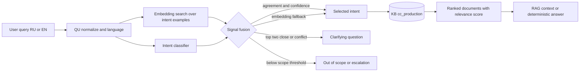

# ADR: Hybrid architecture for Query Understanding

- Status: **Accepted for dev baseline**
- Date: 2026-07-20
- Scope: P1-31…P1-34, P3-03
- Requirements: FR-UND-04, FR-UND-06

## Context

Query Understanding (QU) must map RU/EN user wording to an intent and relevant
documents in `cc_production`. It must:

- recognize synonyms and substantial paraphrases from one reference wording
  (FR-UND-04);
- account for word order, synonyms, and antonyms (FR-UND-06);
- return a relevance score for every retrieved document;
- identify ambiguous or out-of-scope requests instead of forcing an answer;
- run on-prem and remain configurable through reference examples.

Document relevance and intent confidence are different signals. A classifier
may be confident about an intent while the current KB has no suitable
document. Conversely, retrieval may find a relevant article before enough
labeled examples exist to train a reliable classifier.

## Decision

Use a **hybrid QU pipeline**:

1. Normalize the query and detect RU/EN.
2. Search embeddings of reference questions and KB chunks.
3. Run a lightweight intent classifier for known, versioned intents.
4. Fuse the two signals using calibrated thresholds and explicit reason
   codes.
5. Route the selected intent to a KB scope and perform retrieval.
6. Clarify or escalate when signals are weak, close, or contradictory.

Embedding retrieval remains the mandatory fallback. Therefore a newly added
intent can work from one reference phrase before the classifier has enough
examples for retraining, preserving FR-UND-04.

## Alternatives

| Option | Advantages | Limitations | Decision |
| --- | --- | --- | --- |
| Embedding-only | Works from one reference phrase; natural support for synonyms and paraphrases; directly produces document similarity | Similar intents and antonyms may be close; intent boundary is implicit; operational routing is harder to control | Keep as retrieval layer and fallback, not the only QU mechanism |
| Classifier-only | Stable labels for known intents; fast runtime; explicit routing and analytics | Requires representative labeled examples; weak on new/rare wording and unknown intents; does not itself provide KB document relevance | Reject as the sole mechanism |
| Hybrid | Combines one-shot semantic matching with controlled intent routing; supports disagreement/ambiguity handling; keeps document relevance separate | More components, calibration, versioning, and observability are required | **Selected** |

## Runtime flow



The required logical sequence is **QU → intent → KB**. Intent narrows the KB
scope but never replaces semantic retrieval inside that scope.

## Fusion rules

The initial policy is deterministic and versioned:

1. If classifier and embedding agree on an intent and both pass their
   calibrated thresholds, select that intent.
2. If the classifier is unavailable or not yet trained for a new intent,
   allow embedding fallback when retrieval passes the configured threshold.
3. If classifier and embedding disagree, do not silently choose the larger
   raw number. Their scores have different calibration and must be normalized
   before fusion.
4. If top-2 retrieval results differ by no more than 5 percentage points,
   route to clarification according to UC-UND-02.
5. If no document reaches `context_inclusion`, return clarification,
   out-of-scope handling, or escalation—never ungrounded generation.
6. `deterministic_answer` may be used only when the selected source and
   answer template are approved for deterministic delivery.

The frozen dev profile `kb_cc_production` currently supplies retrieval
defaults:

```text
embedding model: intfloat/multilingual-e5-large
context inclusion: 0.60
deterministic answer: 0.85
status: dev_frozen
```

These are engineering defaults, not contractual optimums. Changes require a
repeat benchmark and sign-off through ModelRegistry change control.

## Output contract

P3-03 should return one structured decision:

```json
{
  "query": "Как закрыть карточку?",
  "language": "ru",
  "intent_id": "card.close",
  "intent_confidence": 0.91,
  "route": "kb",
  "kb_profile": "kb_cc_production",
  "documents": [
    {
      "document_id": "suz-article-123",
      "relevance_score": 0.88,
      "source_path": "suz://cards/close"
    }
  ],
  "reason_codes": ["classifier_embedding_agree"],
  "model_version": "qu-dev",
  "profile_version": "dev_frozen"
}
```

`intent_confidence` is internal classifier confidence.
`relevance_score` is retriever document relevance and is the value displayed
as a percentage in preview and hint cards. They must not be interchanged.

Allowed routes:

- `kb` — retrieve and prepare grounded context;
- `clarify` — ask the user/operator to choose between close alternatives;
- `escalate` — transfer to an operator or manual flow;
- `out_of_scope` — apply the approved refusal policy.

## Training and versioning

- Reference pairs are versioned as
  `question → intent_id → KB document/scope`.
- A single approved phrase is sufficient to activate embedding matching.
- Additional approved phrases improve classifier training but are not
  required for first use.
- Updates create a new dataset/index version and trigger FR-UND-08 retraining.
- Runtime records the model, reference dataset, and KB profile versions.
- Rollback restores classifier and embedding index versions as one compatible
  release.

## FR mapping

| Requirement | Architecture mapping | Verification |
| --- | --- | --- |
| FR-UND-04 | Embedding search over reference phrases is always available; a new intent works from one approved formulation without waiting for classifier retraining | One reference phrase plus synonym/paraphrase test set resolves to the same intent/document |
| FR-UND-06: word order | Contextual embedding plus classifier tests distinguish order changes that alter intent | Positive reorder and meaning-changing reorder cases |
| FR-UND-06: synonyms | Embedding similarity maps synonyms and paraphrases to the same intent | RU/EN synonym benchmark |
| FR-UND-06: antonyms | Classifier/fusion rejects conflicts; retrieval threshold and negative examples reduce false matches | Antonym must score below acceptance or trigger clarification |
| FR-UND-06: relevance | Retriever returns normalized `relevance_score` for every document, sorted descending | API/UI contract test for every returned item |

## Consequences

Positive:

- supports one-shot intents and gradual classifier improvement;
- explicit intent improves routing, reporting, and policy enforcement;
- retrieval remains grounded in the current KB;
- disagreements become observable instead of hidden errors.

Costs:

- two model paths and a fusion policy must be deployed and monitored;
- classifier confidence and retrieval relevance require separate calibration;
- releases must keep classifier labels, reference examples, and KB profile
  versions compatible.

## Observability

Each QU decision logs without raw sensitive text where policy forbids it:

- correlation/session ID;
- detected language;
- top classifier intents and calibrated confidence;
- top retrieval document IDs and relevance scores;
- selected route and reason codes;
- model, dataset, and profile versions;
- latency per stage;
- clarification, escalation, and out-of-scope outcome.

Required quality slices include RU/EN, paraphrases, antonyms, changed word
order, low relevance, top-2 ambiguity, and newly added one-example intents.

## Delivery sequence

1. P1-31: define intent taxonomy and versioned reference-pair schema.
2. P1-32: implement embedding-only baseline and relevance normalization.
3. P1-33: implement classifier adapter and confidence calibration.
4. P1-34: benchmark fusion rules, ambiguity, antonyms, and RU/EN.
5. P3-03: expose the stable QU decision contract to the RAG orchestrator.

## Non-goals

- QU does not generate the final answer.
- Intent confidence is not presented as KB relevance.
- The classifier does not hard-code article content.
- Hybrid selection does not permit retrieval outside `cc_production` for the
  Contact Center profile.
